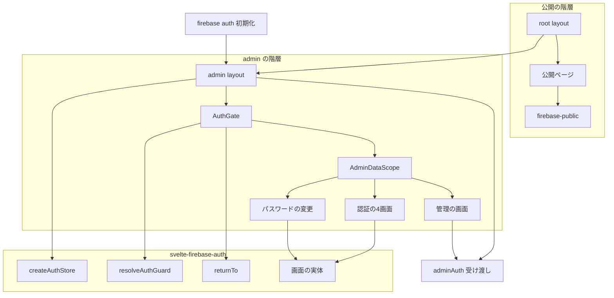
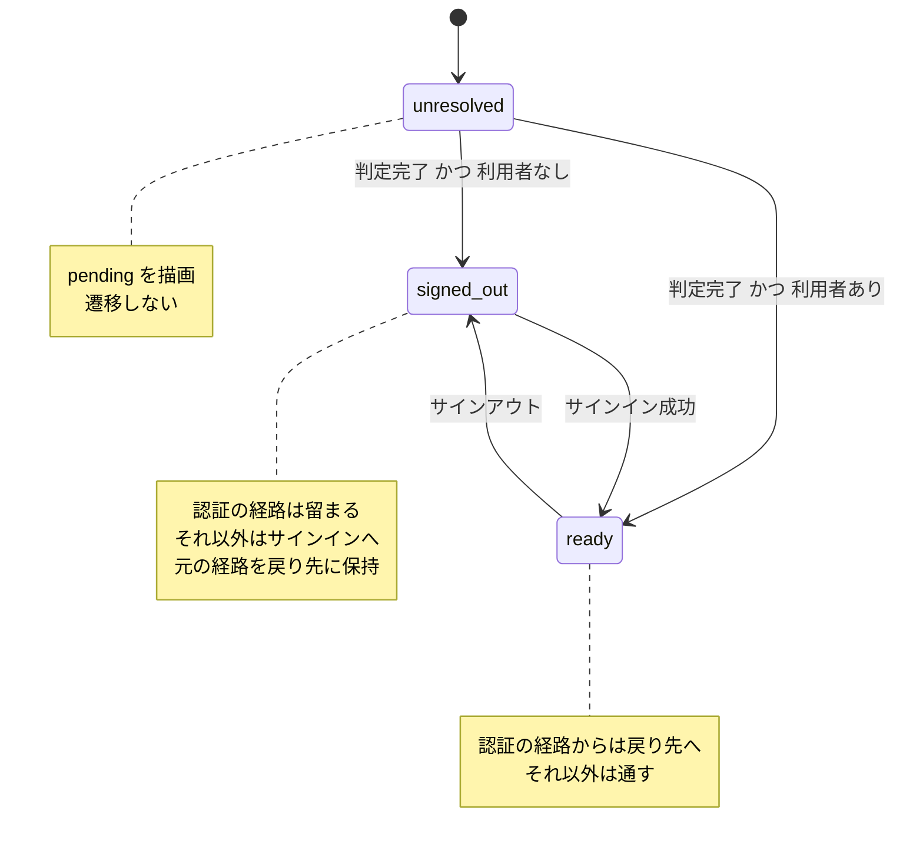
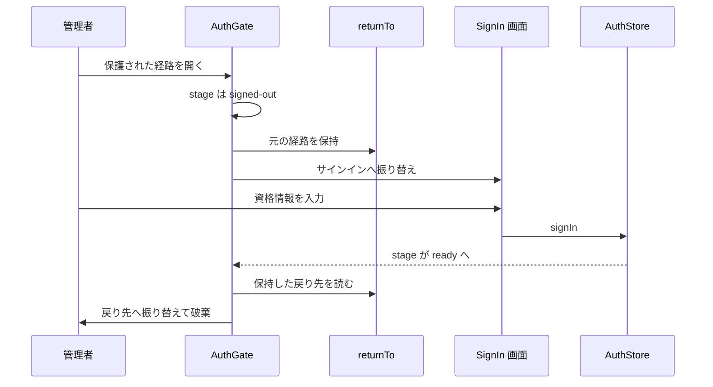
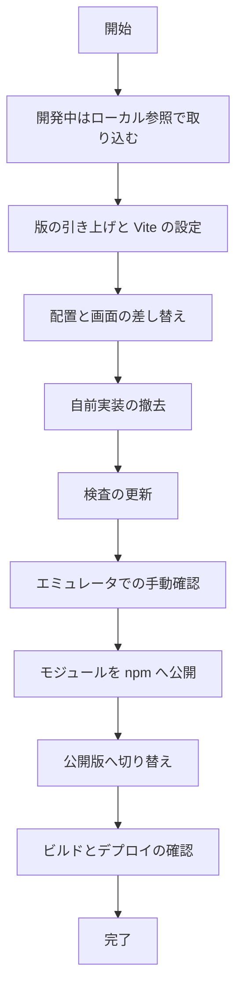

# Technical Design: admin-auth-module-migration

## Overview

**Purpose**: 管理画面の認証を `@14ch/svelte-firebase-auth` へ委譲し、logotope が持つ認証の実装を撤去する。運営者はパスワードの再設定と変更を自力で行えるようになる。

**Users**: logotope の管理者（運営者）が `/admin/**` へ入るときに利用する。公開ページの閲覧者には影響しない。

**Impact**: 認証状態の保持・到達ガード・サインイン後の戻り先という3つの担当がモジュールへ移る。logotope 側に残るのは Firebase の初期化・経路の設定・アクセス制御だけになる。撤去されるのは `src/lib/stores/auth.svelte.ts`・`src/lib/utils/redirect.ts`・`src/routes/admin/login/+page.svelte` のログインフォーム、および `/admin/+layout.svelte` のガードである。

### Goals

- 認証の実装をモジュールに一本化し、logotope 側に同等の実装を残さない（要件 1）
- 公開ページを到達の制御の対象外に保ったまま、`/admin/**` を保護する（要件 4）
- パスワードの再設定と変更を管理画面に加える（要件 9）
- Firestore のセキュリティルールと Functions の認証検証を変更しない（要件 10）

### Non-Goals

- `@14ch/svelte-firebase-auth` 自体の実装・仕様変更（別リポジトリの担当）
- メールアドレスの確認を必須とすること（`emailVerification: false`。→ 要件 8）
- 外部の認証プロバイダの追加、管理者以外の利用者向けアカウント機能
- ルートグループ（`(public)` / `(admin)`）によるレイアウト階層の再編
- `/admin` を直接開いたときの 404 の解消（`afterSignIn` を `/admin/topics` にすることで実害は消える）
- logotope への E2E の土台の新設

## Boundary Commitments

### This Spec Owns

- `/admin` 階層における認証ストアの生成・設定・寿命
- 認証の経路（`AuthRoutes`）の値と、それに対応する `+page.svelte` の配置
- `AuthGate` の配置と、公開ページを対象外に保つこと
- モジュールの `AuthStore` を `/admin` 配下のコンポーネントへ配る受け渡し層
- 自前の認証実装（ストア・ログインフォーム・ガード・復帰先の検証）の撤去
- 依存の取り込み（版の引き上げ・Vite の設定・npm 公開版への切り替え）

### Out of Boundary

- **認証の段階の判定**（`AuthStage` の導出）と**到達の判定**（`resolveAuthGuard`）— モジュールが所有する
- **戻り先の保持と検証** — モジュールの `returnTo` が所有する。logotope は `?redirect=` を持たない
- **画面の中身と文言の既定** — モジュールが所有する。logotope は差し替えの項目だけを与える
- **Firestore のセキュリティルールの条件** — 変更しない（要件 8.4 / 10.1）
- **Functions の認証検証**（`functions/src/utils/auth.ts`）— 変更しない（要件 10.2）
- **Firebase コンソールの設定**（登録の遮断・承認済みドメイン・管理者アカウントの作成）— 運用が担う

### Allowed Dependencies

- `@14ch/svelte-firebase-auth`（npm 公開版）— 認証の一切
- `@14ch/svelte-ui` — 既存の標準 UI ライブラリ。モジュールの peer 依存でもある
- `src/lib/firebase.ts` — `Auth` の初期化。**この向きは反転しない**（モジュールは Firebase を初期化しない）
- `@sveltejs/kit` の `$app/navigation` / `$app/state` — モジュールが内部で使う

**依存の向き**: `firebase.ts` → `adminAuth.svelte.ts`（受け渡し）→ `admin/+layout.svelte`（生成・配置）→ 各画面。左から右へのみ import する。

### Revalidation Triggers

- モジュールの `AuthStore` / `AuthConfig` / `AuthRoutes` / `AuthStage` の形が変わったとき
- モジュールが `AuthGate` の配置の前提（根に1つ）を明文の制約に変えたとき
- 公開ページが `/admin` 配下へ移る、または `/admin` 配下に公開経路が生まれたとき
- `emailVerification` を `true` へ変える判断が出たとき（Firestore ルールと既存アカウントの移行が併発する）

## Architecture

### Existing Architecture Analysis

現行の認証は4つの場所に分かれている。

| 場所 | 持っているもの | 移動先 |
|---|---|---|
| `src/lib/stores/auth.svelte.ts` | グローバルな `authStore`。import 時に購読を開始する | モジュールの `createAuthStore` |
| `src/routes/admin/+layout.svelte` | 未認証なら `?redirect=` 付きでログインへ送る `$effect` | モジュールの `AuthGate` |
| `src/routes/admin/login/+page.svelte` | ログインフォームの実体と、認証済みなら復帰先へ送る `$effect` | モジュールの `SignIn` と `AuthGate` |
| `src/lib/utils/redirect.ts` | 復帰先の検証（オープンリダイレクト防止） | モジュールの `returnTo` |

維持する制約:

- `/admin` 配下は `ssr = false`（`src/routes/admin/+layout.ts`）。`AuthGate` はブラウザでのみ働くため、この設定と一致する
- 公開ページは `src/lib/firebase-public.ts`（Firestore のみ・auth を持たない）を使い、認証のコードを読み込まない
- `+page.svelte` / `+layout.svelte` は最小のラッパーにする（`.kiro/steering/structure.md`）。`+layout.svelte` に書いてよい例外は「store の寿命」「常時表示の要素」「到達ガード」であり、本設計はこの3つすべてに該当する
- 表示コンポーネントは props ドリリングより store 直読みを好む（`.kiro/steering/conventions.md`）

### Architecture Pattern & Boundary Map



**Architecture Integration**:

- **選んだ形**: 部分木ゲート。`AuthGate` を `/admin/+layout.svelte` に1つ置き、認証の4経路も `/admin` 配下に置く。モジュールは根への配置を前提に書かれているが、`resolveAuthGuard` は `stage` / `currentPath` / `routes` / `returnTo` だけを見る純関数であり、アプリの根を参照しない。**部分木でも判定はそのまま成立する**（→ `research.md`）
- **境界**: 判定はモジュール、配置と経路の値は logotope。logotope 側に段階を見た分岐や遷移のコードは1行も置かない（要件 4.7）
- **維持する形**: 公開ページは `AuthGate` の外に残り、認証のコードを一切読み込まない（要件 4.2 / 10.3）。`ssr = false` は `/admin` のみに掛かる
- **新設の理由**: `adminAuth.svelte.ts` は context のキーを1か所に閉じ、既存の 7 spec が mock 先を差し替えるだけで済むようにするために置く。**状態も操作も持たない**
- **steering との整合**: `+layout.svelte` の例外3つ（store の寿命・到達ガード・常時表示）に収まる。表示コンポーネントは受け渡し層を1つ import するだけで、props ドリリングを生まない

### Technology Stack

| Layer | Choice / Version | Role in Feature | Notes |
|---|---|---|---|
| Frontend | `@14ch/svelte-firebase-auth` 0.0.1 以上 | 認証ストア・5画面・到達の制御・戻り先 | **新規依存**。npm 公開が前提（→ Migration Strategy） |
| Frontend | `@sveltejs/kit` ^2.63.0 | `$app/navigation` / `$app/state`。モジュールの peer | 2.56.1 から引き上げ。2.57〜2.63 の breaking は remote functions に閉じる |
| Frontend | `@14ch/svelte-ui` ^0.0.61 | 画面の入力欄・ボタン。モジュールの peer | 0.0.58 から引き上げ。0.0.59〜0.0.61 は Fixed のみ |
| Frontend | `svelte` ^5.0.0 | runes | 5.55.1 で充足済み |
| Data | `firebase` ^12.18.0 | Auth の初期化と操作 | 12.14.0 から引き上げ。auth に破壊的変更なし。12.18.0 の Imagen 削除は未使用 |
| Infrastructure | Firebase App Hosting | 本番配信 | リポジトリからビルドするため、リポジトリ外への依存参照は解決できない |

## File Structure Plan

### Directory Structure

```
src/
├── lib/
│   ├── firebase.ts                        # 変更なし。auth をモジュールへ渡す
│   ├── models/auth/
│   │   └── admin-auth.constants.ts        # AuthConfig の確定値（経路・登録・確認・戻り先）
│   ├── stores/
│   │   └── adminAuth.svelte.ts            # context の受け渡しのみ。状態も操作も持たない
│   └── features/admin/
│       ├── AdminDataScope.svelte          # AuthGate の内側。管理データの購読の寿命だけを持つ
│       ├── AdminTemplate.svelte           # ログアウトのみ残す。出し分けは AuthGate へ移す
│       └── auth/
│           ├── AdminAuthTemplate.svelte    # 認証画面の共通の枠（名乗りと幅）
│           ├── AdminSignInPage.svelte      # SignIn の差し込み
│           ├── AdminPasswordResetPage.svelte
│           ├── AdminVerifyEmailPage.svelte
│           └── AdminPasswordChangePage.svelte  # PasswordChange の差し込み
└── routes/admin/
    ├── +layout.svelte                     # ストアの生成・寿命・AuthGate の配置
    ├── +layout.ts                         # 変更なし（ssr = false）
    ├── login/+page.svelte                 # AdminSignInPage の最小ラッパー
    ├── password-reset/+page.svelte
    ├── verify-email/+page.svelte
    └── password-change/+page.svelte
```

`login` / `password-reset` / `verify-email` / `password-change` の `+page.svelte` は同じ形（対応する feature コンポーネントを1つ差し込むだけ）。

### Modified Files

- `src/routes/admin/+layout.svelte` — 認証ガードの `$effect` を撤去。`createAuthStore` の生成、`setAdminAuthStore`、`start` / `stop`、`AuthGate` で子を包む処理を持つ。**`topicsStore` の寿命は `AdminDataScope` へ移す**
- `src/routes/admin/login/+page.svelte` — フォームの実体を撤去し、`AdminSignInPage` の最小ラッパーにする
- `src/lib/features/admin/AdminTemplate.svelte` — `authStore` の直読みを `getAdminAuthStore()` へ。`{#if authStore.user || isLoginPage}` の出し分けを撤去（`AuthGate` が担う）。ログアウトは `signOut()` を呼ぶ
- `vite.config.ts` — `optimizeDeps.exclude` / `include`（pnpm の再包含記法）と `resolve.dedupe` を追加
- `package.json` — `@14ch/svelte-firebase-auth` を追加。`firebase` / `@sveltejs/kit` / `@14ch/svelte-ui` を引き上げ
- `pnpm-workspace.yaml` — `minimumReleaseAgeExclude` に `@14ch/svelte-ui@0.0.61` と `@14ch/svelte-firebase-auth` の版を追加
- `apphosting.yaml` / `.env` — `continueUrl` に使うアプリの URL の変数を追加
- `src/tests/features/admin/**`（7 本）— mock 先を `$lib/stores/adminAuth.svelte.js` へ差し替え
- `src/tests/features/public/article-list/article-list-public-behavior.test.ts` — 禁止パターンに `svelte-firebase-auth` / `AuthGate` を追加

### Deleted Files

- `src/lib/stores/auth.svelte.ts` — モジュールの `createAuthStore` が代替する（要件 1.2）
- `src/lib/utils/redirect.ts` — モジュールの `returnTo` が代替する（要件 1.3）
- `src/tests/utils/redirect.test.ts` — 対象の削除に伴う（要件 1.3）

## System Flows

### 到達の制御



`emailVerification: false` のため `email-unverified` は現れない（要件 8.2）。**遷移と描画の抑止は `AuthGate` が対で持つ**ため、logotope 側で `{#if}` による出し分けを書かない。

### サインイン後の戻り先



振り替えは `replaceState: true` で履歴に残さない（要件 5.6）。保持はタブ単位で、外部を指す値は排除される（要件 5.4）。logotope は `?redirect=` を持たない（要件 5.3）。

## Requirements Traceability

| Requirement | Summary | Components | Interfaces | Flows |
|---|---|---|---|---|
| 1.1–1.5 | 委譲と撤去 | AdminLayout, AdminAuthAccessor, AdminTemplate | — | — |
| 1.6–1.8 | 依存の解決・版・バンドル | BuildConfig | — | — |
| 2.1–2.3 | 生成・共有・寿命 | AdminLayout, AdminAuthAccessor | `setAdminAuthStore` / `getAdminAuthStore` | — |
| 2.4–2.6 | 設定と `continueUrl` | AdminAuthConfig | `AuthConfig` | — |
| 2.7 | `isResolved` | AdminLayout | `AuthStore.isResolved` | 到達の制御 |
| 3.1–3.5 | 経路 | AdminAuthConfig | `AuthRoutes` | — |
| 3.6–3.9 | 画面の配置 | AdminSignInPage ほか4画面 | `AuthBaseProps` | — |
| 4.1–4.2 | `AuthGate` の配置 | AdminLayout | `AuthGateProps` | 到達の制御 |
| 4.3–4.4 | 判定前の抑止 | AdminLayout | `AuthGateProps.pending` | 到達の制御 |
| 4.5–4.6 | 振り替え | （モジュール） | — | 到達の制御 |
| 4.7 | 分岐を置かない | AdminLayout, AdminTemplate | — | — |
| 4.8 | `ssr = false` | — | — | — |
| 5.1–5.6 | 戻り先 | （モジュール） | — | 戻り先 |
| 6.1–6.3 | サインアウト | AdminTemplate | `AuthStore.signOut` | — |
| 6.4 | 購読の停止 | AdminDataScope | — | — |
| 7.1–7.4 | 登録の抑止 | AdminAuthConfig | `AuthConfig.selfRegistration` | — |
| 8.1–8.5 | 確認を求めない | AdminAuthConfig, AdminVerifyEmailPage | `AuthConfig.emailVerification` | 到達の制御 |
| 9.1–9.2 | 再設定 | AdminPasswordResetPage | `AuthBaseProps` | — |
| 9.3–9.6 | 変更と失敗の扱い | AdminPasswordChangePage | `AuthBaseProps` | — |
| 10.1–10.2 | 防御の維持 | — | — | — |
| 10.3–10.6 | 不変条件 | TestSuite | — | — |

## Components and Interfaces

| Component | Domain/Layer | Intent | Req Coverage | Key Dependencies | Contracts |
|---|---|---|---|---|---|
| AdminAuthConfig | models | `AuthConfig` の確定値を1か所に置く | 2.4–2.6, 3.1–3.5, 7.1, 8.1 | なし | State |
| AdminAuthAccessor | stores | `AuthStore` を `/admin` 配下へ配る | 2.1, 10.4 | svelte context (P0) | Service |
| AdminLayout | routes | ストアの生成・寿命・`AuthGate` の配置 | 1.1, 2.1–2.3, 2.7, 4.1–4.4, 4.7 | firebase.ts (P0), モジュール (P0) | State |
| AdminDataScope | features | 管理データの購読の寿命 | 4.7, 6.4 | topicsStore (P0) | State |
| AdminAuthTemplate | features | 認証画面の共通の枠（名乗りと体裁）を1か所に持つ | 3.8 | なし | — |
| AdminSignInPage | features | `SignIn` の差し込み | 3.6–3.9, 9.6 | AdminAuthAccessor (P0), AdminAuthTemplate (P0) | — |
| AdminPasswordResetPage | features | `PasswordReset` の差し込み | 9.1–9.2 | AdminAuthAccessor (P0), AdminAuthTemplate (P0) | — |
| AdminVerifyEmailPage | features | `VerifyEmail` の差し込み（到達しない） | 8.2 | AdminAuthAccessor (P0), AdminAuthTemplate (P0) | — |
| AdminPasswordChangePage | features | `PasswordChange` の差し込み | 9.3–9.5 | AdminAuthAccessor (P0), AdminAuthTemplate (P0) | — |
| AdminTemplate | features | サインアウトの操作 | 6.1–6.3, 4.7 | AdminAuthAccessor (P0) | — |
| BuildConfig | infra | 依存の解決とバンドル | 1.6–1.8 | pnpm, Vite (P0) | — |

### models

#### AdminAuthConfig

| Field | Detail |
|---|---|
| Intent | モジュールへ渡す `AuthConfig` の確定値を1か所に置く |
| Requirements | 2.4, 2.5, 3.1, 3.2, 3.4, 3.5, 7.1, 8.1 |

**Responsibilities & Constraints**

- `AuthConfig` の4項目すべてを、実行時の分岐を要さない確定値として持つ（要件 2.4）
- 経路は URL に現れるとおりの `pathname` を書く。判定は問い合わせ文字列を無視した完全一致である（要件 3.4）
- **`continueUrl` は管理画面のサインインの経路を指す**（要件 2.5）。Firebase の既定のアクションハンドラを経た利用者がここへ着地する。サイトの根を与えると、パスワードを再設定した管理者が公開の記事一覧へ放り出される。オリジンだけが環境で変わるため、環境変数はオリジンを持ち、経路はここで足す
- **`selfRegistration: false` / `emailVerification: false` を確定値として持つ。**分岐や上書きの余地を作らない

**Dependencies**

- External: なし（`import.meta.env` のみ）

**Contracts**: State [x]

##### State Management

```typescript
import type { AuthConfig } from '@14ch/svelte-firebase-auth';

export const ADMIN_AUTH_CONFIG: AuthConfig = {
	selfRegistration: false,
	emailVerification: false,
	continueUrl: `${import.meta.env.VITE_APP_ORIGIN}/admin/login`,
	routes: {
		signIn: '/admin/login',
		signUp: '/admin/login',
		verifyEmail: '/admin/verify-email',
		passwordReset: '/admin/password-reset',
		afterSignIn: '/admin/topics'
	}
};
```

- **到達しない経路の扱いは、到達しない理由で分ける。** `AuthRoutes` は全項目必須だが、`signUp` と `verifyEmail` はどちらも本設計では到達しない。理由が違うため扱いも分ける。
  - **`verifyEmail` は経路を実在させ、画面を置く。** 到達しないのは `emailVerification: false` という設定の帰結にすぎず、設定を反転すれば到達する。実在させておけば切り替えに何も足さずに済む
  - **`signUp` は経路を実在させず、`signIn` の値を重ねる。** 到達しないのではなく**到達させてはならない**（要件 7.1「登録の入口を画面に出さない」）。`signed-out` の段階では `resolveAuthGuard` が登録の経路への到達を許すため、経路を実在させると URL を直接開いた者に登録フォームが出る。**モジュールの `SignUp` は `canSelfRegister` を見ずに無条件でフォームを描画する**（実装で確認済み）ため、画面側の出し分けには頼れない
  - 値を重ねても `matchesAny` / `isAuthRoute` はサインインの経路として扱うため、振り替えの循環は生じない
- **`afterSignIn` は `/admin/topics`。** `/admin` には `+page.svelte` が無く 404 になる（現行の `sanitizeAdminRedirect` はここへ落としていた）
- **不変条件**: `routes` の全項目が `/admin` 配下であること。`AuthGate` の適用範囲の外の経路を書くと、振り替え先がゲートの外になり判定が働かない

### stores

#### AdminAuthAccessor

| Field | Detail |
|---|---|
| Intent | `AuthStore` を `/admin` 配下のコンポーネントへ配る |
| Requirements | 2.1, 10.4 |

**Responsibilities & Constraints**

- **状態も操作も持たない。** `setContext` / `getContext` の呼び出しと、context のキーの保持だけを行う
- 認証の判断（段階の解釈・遷移・失敗の扱い）を**一切持たない**。持てば要件 1.1 に反する
- 取得できないとき（`/admin` の外から呼ばれたとき）は例外を投げる。`null` を返して呼び出し側に分岐を作らせない

**Dependencies**

- Inbound: AdminLayout — 生成したストアを登録する（P0）
- Inbound: AdminTemplate, 各画面 — 取得する（P0）
- External: `svelte` の `setContext` / `getContext`（P0）

**Contracts**: Service [x]

##### Service Interface

```typescript
import type { AuthStore } from '@14ch/svelte-firebase-auth';

export const setAdminAuthStore: (store: AuthStore) => void;
export const getAdminAuthStore: () => AuthStore;
```

- **Preconditions**: `getAdminAuthStore` は `setAdminAuthStore` を呼んだ階層の配下でのみ呼べる
- **Postconditions**: `getAdminAuthStore` は同一のインスタンスを返す
- **Invariants**: context のキーはこのファイルの外に出ない

**Implementation Notes**

- Integration: 既存の 7 spec は `vi.mock('$lib/stores/auth.svelte.js')` を `vi.mock('$lib/stores/adminAuth.svelte.js')` へ差し替える。返す形は `{ getAdminAuthStore: () => ({ ... }) }`
- Validation: この層に条件分岐が増えていないかをレビューで確認する
- Risks: 「便利だから」と `isLoggedIn` の別名や遷移のヘルパーを足すと、撤去したはずの実装がここに戻る

### routes

#### AdminLayout

| Field | Detail |
|---|---|
| Intent | 認証ストアの生成・寿命・配布と、`AuthGate` の配置 |
| Requirements | 1.1, 2.1, 2.2, 2.3, 2.7, 4.1, 4.2, 4.3, 4.4, 4.7 |

**Responsibilities & Constraints**

- `createAuthStore(auth, ADMIN_AUTH_CONFIG)` を1回だけ呼び、`setAdminAuthStore` で配る
- `start()` と `stop()` を `$effect` の開始と後始末で対にする（要件 2.3）
- **`AuthGate` で子を包む。** `pending` に読み込み中の表示を渡す（要件 4.4）
- **段階を見た分岐を書かない**（要件 4.7）。`store.stage` / `isResolved` / `user` を読む条件式をこのファイルに置かない
- **管理データの購読を持たない。** `topicsStore` の寿命は `AuthGate` の内側の `AdminDataScope` が持つ
- この階層は `/admin` に限る。公開ページはこのレイアウトを通らない（要件 4.2）

**Dependencies**

- Outbound: AdminAuthConfig — 設定値（P0）
- Outbound: AdminAuthAccessor — 配布（P0）
- External: `src/lib/firebase.ts` の `auth`（P0）
- External: モジュールの `createAuthStore` / `AuthGate`（P0）

**Contracts**: State [x]

##### State Management

- **状態モデル**: `AuthStore` のインスタンス1つ。レイアウトの寿命と一致する
- **永続性**: 持たない。戻り先の保持はモジュールの `sessionStorage` に閉じる
- **並行性**: `start()` は既に開始していれば購読を張り直す。`$effect` の後始末で必ず `stop()` を呼ぶ

**Implementation Notes**

- Integration: `AuthGate` の中に `AdminDataScope` を置き、その中で子を描画する。`<AuthGate>` → `<AdminDataScope>` → `{@render children()}` の3層になる
- Validation: このファイルに `stage` / `isResolved` / `user` を読む条件式が無いことを、ソース走査の検査で固定する
- Risks: `AuthGate` を包み忘れるとガードが働かない。**防御は Firestore のルールが担う**（要件 10.1）

#### AdminDataScope

| Field | Detail |
|---|---|
| Intent | 管理データの購読を、到達を許された間だけ生かす |
| Requirements | 4.7, 6.4 |

**Responsibilities & Constraints**

- `topicsStore` の `start()` を `$effect` で呼び、後始末で `stop()` を返す。**条件式を持たない**
- **`AuthGate` の内側に置く。** ゲートは `allow` のときだけ children を描画するため、この包みは到達を許された間しか存在しない。開始条件も停止条件も認証の状態を読まずに得られる（要件 4.7）
- 認証の状態を一切参照しない。`store` を受け取らず、`getAdminAuthStore()` も呼ばない
- 描画は children をそのまま流すだけで、マークアップを持たない

**Dependencies**

- Inbound: AdminLayout — `AuthGate` の内側に置かれる（P0）
- Outbound: `topicsStore` — 購読の開始と停止（P0）

**Contracts**: State [x]

##### State Management

- **状態モデル**: 持たない。`topicsStore` の購読の寿命を自身のマウントの寿命に一致させるだけ
- **並行性**: `topicsStore.start()` は既に購読していれば何もしない（現行の実装）。二重の開始は起こらない

**Implementation Notes**

- Integration: サインアウトすると段階が `signed-out` へ変わり、`AuthGate` が children を外す。この包みが破棄され、後始末で `stop()` が走る（要件 6.4）
- Validation: このファイルに認証に関する参照（`stage` / `isLoggedIn` / `getAdminAuthStore`）が無いことを、ソース走査の検査で固定する
- Risks: 将来この包みに「認証済みなら〜」の条件を足したくなったら、**それは `AuthGate` の外に置いてしまった兆候**である。位置を疑う

### features

`AdminSignInPage` / `AdminPasswordResetPage` / `AdminVerifyEmailPage` / `AdminPasswordChangePage` は同じ形を採る。`getAdminAuthStore()` でストアを取り、対応する画面へ `store` を渡し、`AdminAuthTemplate` で包む。文言の差し替えは logotope 固有の呼称に限る（要件 3.8）。**コールバックは存在しない**ため、遷移の配線は書かない（要件 3.7）。

**名乗りはモジュールへ渡さず、外側の枠が持つ。** `AuthBaseProps` は `store` / `messages` / `onCompleted` のみで、見出しを差し込む口を持たない。各画面に `<h1>` を書き写すと名乗りと体裁が散るため、`AdminAuthTemplate` を1つ置いてそこだけが持つ。

```svelte
<!-- 各画面に共通する形 -->
<script lang="ts">
	import AdminAuthTemplate from './AdminAuthTemplate.svelte';
	import { SignIn } from '@14ch/svelte-firebase-auth';
	import { getAdminAuthStore } from '$lib/stores/adminAuth.svelte';

	const store = getAdminAuthStore();
</script>

<AdminAuthTemplate>
	<SignIn {store} />
</AdminAuthTemplate>
```

- **`AdminVerifyEmailPage` は `emailVerification: false` のため到達しない。** 設定を `true` へ変えたときに何も足さずに済むよう置く（→ `research.md` の決定）
- **`AdminPasswordChangePage` は認証の経路ではない。** `resolveAuthGuard` の `isAuthRoute` に含まれないため、サインイン済みの利用者が追い出されない（要件 9.4）
- **`PasswordChange` は完了時に `goto(routes.afterSignIn)` を行う。** ダイアログとして開くと遷移が噛み合わないため、独立した経路に置く

#### AdminTemplate（変更）

| Field | Detail |
|---|---|
| Intent | 管理画面の共通の枠。サインアウトの操作を持つ |
| Requirements | 4.7, 6.1, 6.2, 6.3 |

**Responsibilities & Constraints**

- `{#if authStore.user || isLoginPage}` による子の出し分けを**撤去する**。`AuthGate` が同じことを担うため、二重に持たない（要件 4.7）
- サインアウトは `store.signOut()` を呼ぶ。**遷移を書かない**。段階が `signed-out` へ変わり `AuthGate` が振り替える（要件 6.3）
- `isLoginPage` の判定が不要になる。`page` への依存が消える

**Implementation Notes**

- Integration: `store.isLoggedIn` によるサインアウトの表示の出し分けは残す（要件 6.1）。これは到達の制御ではなく、ヘッダーの内容の話である
- Risks: サインアウトの後に管理画面の内容が一瞬残らないこと。`AuthGate` が children を外すため、`AdminDataScope` ごと消える

### infra

#### BuildConfig

| Field | Detail |
|---|---|
| Intent | 依存の解決・版の整合・バンドルの設定 |
| Requirements | 1.6, 1.7, 1.8 |

**Responsibilities & Constraints**

- `@14ch/svelte-firebase-auth` を **npm 公開版**として解決する。リポジトリ外への `link:` / `file:` を最終状態に残さない（App Hosting のビルドが解決できない）
- peer 依存を満たす版へ引き上げる: `@sveltejs/kit ^2.63.0` / `firebase ^12.18.0` / `@14ch/svelte-ui ^0.0.61`
- `optimizeDeps.exclude` に2つのパッケージを挙げ、**再包含は pnpm の記法で書く**

**Dependencies**

- External: npm レジストリ（P0）、pnpm の `minimumReleaseAge` の設定（P1）

**Implementation Notes**

- Integration: `vite.config.ts` に以下を加える。`dompurify` は logotope の直接依存ではなく、pnpm の非フラットな `node_modules` では root から解決できないため、**`'@14ch/svelte-ui > dompurify'` の再包含記法**を使う

```typescript
optimizeDeps: {
	exclude: ['@14ch/svelte-firebase-auth', '@14ch/svelte-ui'],
	include: ['dayjs', '@14ch/svelte-ui > dompurify']
},
resolve: { dedupe: ['svelte'] }
```

- Integration: `pnpm-workspace.yaml` の `minimumReleaseAgeExclude` に新しい版を追加する
- Validation: 開発サーバーとビルドの両方で管理画面が描画されることを確認する
- Risks: exclude の追加で `@14ch/svelte-ui` の既存の描画が壊れうる。**現状は開発時に事前バンドルされて動いている**ため、変更の影響は実際に確認する

## Data Models

新しい永続データを持たない。モジュールが `sessionStorage` にタブ単位で戻り先の経路1つを保持するが、**これはモジュールが所有し、logotope は触らない**（→ Out of Boundary）。

Firestore のスキーマとセキュリティルールは変更しない（要件 8.4 / 10.1）。

**環境変数の追加**:

| 変数 | 用途 | 供給 |
|---|---|---|
| `VITE_APP_ORIGIN` | アプリのオリジン。`AuthConfig.continueUrl` は `${VITE_APP_ORIGIN}/admin/login` として組み立てる | `.env`（開発）/ `apphosting.yaml` の BUILD 変数（本番） |

このドメインは Firebase の**承認済みドメイン**に含まれている必要がある。含まれていないと再設定メールの送信が `auth/unauthorized-continue-uri` で失敗する。

着地先をサインインの経路にしておけば、着地した利用者が既にサインイン済みでも `AuthGate` が `ready` と判定して `afterSignIn` へ送るため、経路の分岐を持たずに済む。

## Error Handling

### Error Strategy

モジュールは**例外を投げず `AuthResult` で返す**。logotope 側に `try` / `catch` を書かない（要件 9.6）。画面は `AuthError` から文言を引いて表示する処理を内部に持つため、logotope が失敗を扱うコードは基本的に存在しない。

### Error Categories and Responses

| 分類 | 例 | 応答 |
|---|---|---|
| 利用者の入力 | `invalid-credential` / `invalid-email` | 画面が既定の日本語で案内する。logotope は関与しない |
| 設定の食い違い | `registration-disabled` | 画面が案内する。**Firebase コンソールの設定を確かめる兆候**（要件 7.3） |
| 設定の食い違い | `auth/unauthorized-continue-uri` | `continueUrl` のドメインが承認済みドメインに無い。再設定メールが送れない（要件 2.6） |
| 通信 | `network-error` | 画面が案内する |
| 到達の制御 | context が空 | `getAdminAuthStore()` が例外を投げる。`/admin` の外から呼んだ実装の誤り |

`AuthError.detail` は記録用であり、利用者へそのまま出さない。

### Monitoring

新たな監視の仕組みを設けない。`registration-disabled` と `unauthorized-continue-uri` は運用の設定漏れの兆候であるため、発生したら Firebase コンソールを確認する。

## Testing Strategy

### Unit Tests

- `AdminAuthAccessor` — 登録したストアが取得できること。未登録の階層で呼ぶと例外を投げること
- `AdminAuthConfig` — `routes` の全項目が `/admin` 配下であること。`selfRegistration` と `emailVerification` が `false` であること。**`continueUrl` が `/admin/login` で終わること**（公開の根を指していないこと）

### Component Tests（Vitest browser）

- 既存の 7 本 — mock 先を `$lib/stores/adminAuth.svelte.js` へ差し替え、**削除せずに通す**（要件 10.4）
- `AdminTemplate` — サインインしているときだけサインアウトの操作が出ること。サインアウトが `signOut()` を呼び、**遷移を行わない**こと（要件 6.2 / 6.3）

### Source Scan Tests（logotope の既存の手法を拡張）

- `article-list-public-behavior.test.ts` の禁止パターンに `svelte-firebase-auth` と `AuthGate` を追加する（要件 10.3）
- **`AuthGate` が `src/routes/admin/+layout.svelte` にのみ現れること**を検査する。公開側のレイアウトに混入していないこと（要件 4.1 / 4.2）
- **`src/routes/admin/+layout.svelte` に段階を見た条件式（`stage` / `isResolved` / `user` の分岐）が無いこと**を検査する（要件 4.7）
- **`AdminDataScope.svelte` に認証への参照（`stage` / `isLoggedIn` / `getAdminAuthStore`）が無いこと**を検査する（要件 4.7）
- **`src/routes/admin/` に `signup` の経路が存在しないこと**を検査する（要件 7.1）
- `authStore` / `sanitizeAdminRedirect` / `?redirect=` の参照が残っていないこと（要件 1.2 / 1.3 / 5.3）

判定の正しさ（`resolveAuthGuard` の振る舞い）は**モジュール側の単体試験が担保する**。logotope で再検証しない（`.kiro/steering/spec-dependencies.md`「受け入れ基準は依存元のものを使う」）。

### 手動確認（エミュレータ）

自動検査で守れない実挙動を、Firebase エミュレータ（`VITE_USE_EMULATOR=true`）で確認する。**tasks に明示の項目として置く**（要件 10.5）。

1. 未サインインで `/admin/topics/{id}/debate` を開き、サインインへ振り替わり、サインイン後に**その経路へ戻る**こと
2. サインアウトでサインインへ戻り、管理画面の内容が描画されないこと
3. 公開ページ（`/`・`/articles/{id}`）が未サインインで表示されること
4. パスワードの再設定の要求が受け付けられること（メールの到達はエミュレータのログで確認）。**リンクを開いた先が管理画面のサインインであること**（公開の記事一覧でないこと）
5. `/admin/password-change` でパスワードを変更でき、完了後に `/admin/topics` へ戻ること
6. 判定の完了前に管理画面の内容が一瞬でも見えないこと（要件 4.3）

## Security Considerations

- **`AuthGate` は防御ではない。** ブラウザでのみ働き、包み忘れれば働かない。到達の制御をモジュールへ移したことを理由に Firestore のセキュリティルールを緩めない（要件 10.1）
- **登録の遮断は二重に行う。** `selfRegistration: false` が塞ぐのは画面の入口だけで、登録の API は Firebase コンソールの設定でしか塞げない（要件 7.2）
- **オープンリダイレクトの防止はモジュールへ移る。** `sanitizeAdminRedirect` を削除する代わり、モジュールの `isSafeReturnTo` が根からの相対パスのみを受け入れ、`//evil.example` と `/\evil.example` を弾く
- **メールアドレスの到達性は運用が担保する。** `emailVerification: false` を選んだため、管理者アカウントの作成時に運営者が確認する（要件 8.5）
- Functions 側の `requireAuth` と Firestore のルールは変更しない（要件 10.1 / 10.2）

## Migration Strategy



**段階と検証点**:

1. **ローカル参照**（`link:`）— 往復を速くするための手段。**到達点ではない**
2. **版の引き上げと Vite の設定** — 開発サーバーとビルドの両方で既存の画面が壊れていないことを確認する。ここで `@14ch/svelte-ui` の描画を必ず見る
3. **配置と画面の差し替え** — `AuthGate` と4つの経路を置く。この時点では自前実装がまだ残っていてよい
4. **撤去** — `auth.svelte.ts` / `redirect.ts` / ログインフォームを削除する。**import が解決できなくなることで取りこぼしが型検査に現れる**
5. **検査の更新** — 7 本の mock 差し替えと、走査型の検査の追加
6. **手動確認** — 上の6項目
7. **npm 公開と切り替え** — **`pnpm-lock.yaml` にローカルパスが残っていないこと**を確認する。ここを飛ばすとデプロイのビルドが壊れる

**巻き戻しの引き金**: 版の引き上げで既存の画面に不具合が出た場合は、段階 2 で止めて原因を切り分ける（認証の差し替えとは独立した問題であるため）。

**データの移行は無い。** `emailVerification: false` を選んだため、既存の管理者アカウントに手を入れる必要がない（要件 8.3）。

## 実装時の決定（設計からの差分）

実装中に、設計の記述どおりでは成立しなかった点が3つある。いずれも設計の意図を満たす形へ寄せた。

### 1. `@14ch/svelte-ui` は事前バンドルの対象から外さない

- **設計の記述**: `optimizeDeps.exclude` に `@14ch/svelte-firebase-auth` と `@14ch/svelte-ui` の2つを挙げる（要件 1.8／モジュールの README）
- **実際**: `@14ch/svelte-ui` を外すと、その `<style>` が Vite クライアント経由の**非同期注入**に変わる。開発サーバーと本番ビルドでは問題ないが、既存のコンポーネント spec が装飾の適用前に操作するため、17 件が「他の要素が pointer events を横取りする」で落ちた（5 ファイル）
- **決定**: 外すのは `@14ch/svelte-firebase-auth` だけにする。要件 1.8 の目的である「`svelte` の実体を1つに揃える」は `resolve.dedupe: ['svelte']` が担う。開発サーバーの実際の依存グラフで、モジュールの `SignIn` が `svelte` の内部と `@14ch/svelte-ui` のいずれも logotope と同一の実体へ解決することを確認した
- **副次**: 外さないため、CJS の依存（`dompurify` / `dayjs` の plugin と locale）を `include` で戻す必要も消えた。`optimizeDeps` は `exclude` の1行だけになった

### 2. 開発中のローカル参照は `link:` ではなく**梱包した tarball** を使う

- **設計の記述**: 開発中は `link:` で往復する
- **実際**: `link:` はモジュールのリポジトリを直に指すため、そこの `node_modules`（`svelte` 5.56.10）まで解決に混ざり、logotope の `svelte` 5.55.1 と**二重になった**。型検査で `Snippet` が「同名の無関係な型が2つある」となり 13 件のエラーが出た。加えて Vite の `server.fs.allow` の外にあるため、モジュールのファイルが 403 になった
- **決定**: `npm pack` した tarball を `file:` で参照する。モジュールは logotope の `node_modules` 配下に展開され、`svelte` は peer として logotope の1つに解決される。`fs.allow` の問題も消え、**公開版に近い状態で検証できる**
- **注意**: モジュールを直したら `npm pack` をやり直して `pnpm install` する。到達点が公開版であることは変わらない（タスク 6.2）

### 3. 管理データの購読は `/admin/topics` の階層に置く

- **設計の記述**: `AdminDataScope` を `/admin/+layout.svelte` の `AuthGate` の内側に置く
- **実際**: `resolveAuthGuard` は `signed-out` の段階で**認証の4経路を `allow` にする**。`AuthGate` の直下に置くと、未サインインで `/admin/login` を開いた時点で children が描画され、`topicsStore.start()` が走る。Firestore のルールは `request.auth != null` を要求するため、**未サインインのまま購読して permission-denied になる**
- **決定**: `topicsStore` を読むのは `/admin/topics/**` だけであるため、`src/routes/admin/topics/+layout.svelte` に置く。`AuthGate` の内側であることは変わらず（`/admin` の配下）、条件式も認証への参照も持たない。サインアウトで破棄され購読が止まる性質も変わらない
- **固定**: `<AdminDataScope` が現れるのが `src/routes/admin/topics/+layout.svelte` だけであることを、ソース走査の検査で固定した
