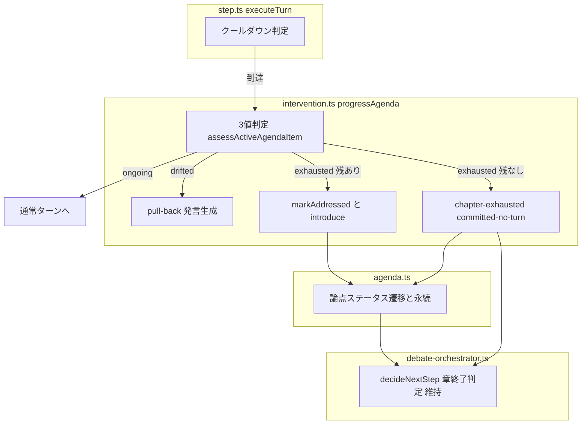
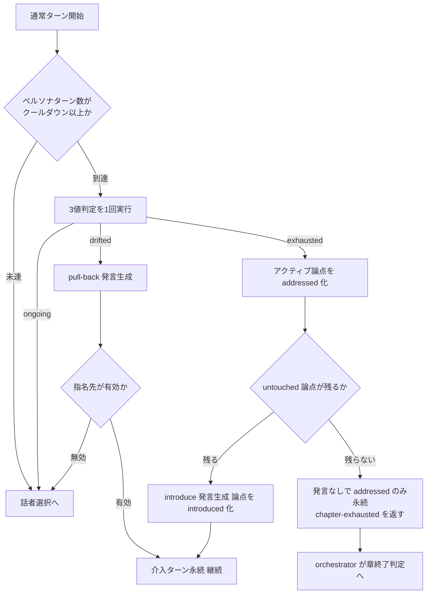

# Technical Design: agenda-progression-unification

## Overview

**Purpose**: 本機能は、討論のアジェンダ進行制御を「クールダウン＋3値判定」へ一本化し、論点が実質的に出尽くしたら確実に次の論点へ前進する討論パイプラインを討論コンテンツの閲覧者・管理者に提供する。

**Users**: 閲覧者は同じ問いの繰り返しがない、展開のある討論コンテンツを読める。管理者・開発者は論点の進行が止まる原因を単一の判定に絞って観測・調整できる。

**Impact**: 現行の `progressAgenda`（ゲート→判定→行動）から、前進を封じる3つの直列ゲート（立場カバレッジ・persona-chain・高意欲）と介入トリガー3分岐を撤去する。立場カバレッジ機構（bring-in 介入・`relevantPersonaIds` / `spokenPersonaIds` 追跡）は完全に削除する。3値判定・pull-back・introduce・章終了判定は維持する。

### Goals

- exhausted 判定を前進（addressed 化＋次論点投入）の十分条件にする
- 進行評価の起動条件を単一クールダウンに一本化する（トリガー種別の廃止）
- 立場カバレッジ機構を追跡・永続・プロンプト生成まで含めて完全撤去する
- 章終了の既存条件（allAddressed / cap / earlyEnd / 最終応答+1）を回帰なしに維持する

### Non-Goals

- 3値判定（`assessActiveAgendaItem`）のプロンプト・判定品質の変更（exhausted 感度の調整はデプロイ後観測を経て別途判断）
- 章立て・論点リスト生成（chapter-agent）の変更
- `relevantPersonaIds` を絞る等の生成側改善（本変更の効果検証後に判断。検証変数を1つに絞る）
- intervention.ts 等の改名・再配置（別 spec に委ねる）
- フロントエンドの変更（影響ゼロを確認済み）

## Boundary Commitments

### This Spec Owns

- 討論中のアジェンダ進行評価の起動条件（クールダウン）と3値判定後の行動分岐（none / pull-back / advance）
- 論点ステータス遷移（untouched → introduced → addressed）の発生条件と永続
- `AgendaItemState` の型形状（カバレッジフィールドの廃止）と `FacilitatorReply` の型形状（`relevantPersonaIds` の廃止）
- 撤去対象コード（bring-in・カバレッジ追跡・トリガー種別・高意欲ゲート）の完全削除

### Out of Boundary

- 3値判定プロンプトの中身（`assessActiveAgendaItem` の判定文言は現状維持）
- 章終了判定 `decideNextStep` のロジック（維持対象。変更しない）
- 話者選択（`selectSpeaker`）・意欲評価（engagement）・キュー（queued-intents）の仕組み
- committed-no-turn（chapter-exhausted）経路の orchestrator 側配線（維持対象）

### Allowed Dependencies

- `agents/facilitator-agent.ts` の判定・発言生成（introduce / pull-back）
- `pipeline/debate/agenda.ts` の状態遷移・永続関数
- `pipeline/debate/queued-intents.ts` の意図キュー（前進時の意欲者保全）
- 依存方向: `step.ts` → `intervention.ts` → `agents` / `agenda.ts`。逆方向の import は禁止（現行どおり）

### Revalidation Triggers

- `AgendaProgress`（progressAgenda の戻り値）の変更 → orchestrator の配線を再確認
- `AgendaItemState` の形状変更 → 復元（chapter.ts）・保存（agenda.ts）・FE 型の再確認
- クールダウン値・判定3値の意味変更 → 本 spec の観測前提が崩れるため再検証

## Architecture

### Existing Architecture Analysis

現行の進行制御は2層の条件系を持つ:

1. **トリガー層**（step.ts）: 末尾ターンの指名状態で3分岐（no-target / persona-chain / 評価なし）し、種別ごとに別クールダウン（3 / 5）を適用
2. **ゲート層**（intervention.ts `progressAgenda`）: 3値判定の結果に対し、立場カバレッジ（bring-in へ差し替え）・persona-chain（前進禁止）・高意欲（前進抑止）が直列に前進を封じる

`addressed` の付与箇所は exhausted→前進分岐が唯一であり、盛り上がる討論ではゲートが恒久的に閉じて論点が消化されない（観測済みの問題）。本設計はトリガー層とゲート層を撤去し、判定→行動の1層に縮約する。

### Architecture Pattern & Boundary Map

**Selected pattern**: 既存フローの縮約（gap-analysis Option A/C）。新規ファイル・新規抽象を作らず、削除中心の差分で単純化する。



**Architecture Integration**:

- 維持するパターン: 判定（純粋・content なし）と行動（発言生成）の分離、committed-no-turn 経路、addTurn の冪等追記と progressPatch 同一トランザクション更新
- 撤去する構造: `InterventionTrigger` 型と構築ロジック、bring-in 行動、カバレッジ追跡、`hasHighEngagement` ゲート
- Steering 準拠: 過度な共通化をせず既存配置のまま縮約。関数の並び順（呼び出し元が先）を維持

### Technology Stack

新規依存なし。既存スタック（TypeScript strict / Firebase Functions v2 / Firestore / Anthropic SDK 経由の `generateObject`）の範囲内で完結する。変更はすべて `functions/src/` 配下。

## File Structure Plan

新規ファイルなし。変更・削除のみ。

### Modified Files

| ファイル | 変更内容 |
|---|---|
| `functions/src/pipeline/debate/intervention.ts` | `progressAgenda` をゲートなしの「クールダウン→判定→行動」へ縮約。`InterventionTrigger` / `countConsecutivePersonaTargets` / `isAdoptableBringIn` を削除。`shouldEvaluateIntervention` / `countPersonaTurnsSinceFacilitator` / `persistInterventionTurn` は維持 |
| `functions/src/pipeline/debate/step.ts` | `executeTurn` からトリガー構築（3分岐・triggerCooldown）を削除し、progressAgenda を常時呼び出しに変更（クールダウンは progressAgenda 内で自己判定）。`finalizeCommittedTurn` からカバレッジ記録・保存を削除。`performOpenStep` から `relevantPersonaIds` の受け渡し（`filterValidPersonaIds`）を削除 |
| `functions/src/pipeline/debate/agenda.ts` | `recordSpeakerOnActiveAgendaItem` / `getUnheardRelevant` を削除。`markIntroduced` から `relevantPersonaIds` 引数と spoken/relevant 初期化を削除。`saveAgendaItemStatuses` から両フィールドの書き出しを削除 |
| `functions/src/agents/facilitator-agent.ts` | `InterventionAction` から bring-in を削除し、bring-in 発言生成分岐を削除。introduce スキーマ・プロンプトから `relevantPersonaIds` を削除。`generateOpening` / `generateChapterIntroduction` のスキーマ・プロンプトから関連参加者生成を削除 |
| `functions/src/pipeline/debate/speaker-selection.ts` | `hasHighEngagement` を削除（他に使用箇所なし） |
| `functions/src/constants/debate.constants.ts` | `STALL_INTERVENTION_THRESHOLD_SCORE` / `PERSONA_CHAIN_INTERVENTION_COOLDOWN` を削除 |
| `functions/src/types/chapter.types.ts` | `AgendaItemState` から `spokenPersonaIds` / `relevantPersonaIds` を削除 |
| `functions/src/types/debate.types.ts` | `FacilitatorReply` から `relevantPersonaIds` を削除 |
| `functions/src/tests/`（5ファイル） | ゲート・トリガー・カバレッジ系テストの削除、前進系の書き換え、回帰保護テストの維持（Testing Strategy 参照） |

変更しないファイル（維持対象・回帰保護）: `debate-orchestrator.ts`（`decideNextStep` / `reconcileEarlyEndCoverage` の配線）、`chapter.ts`（復元）、`turn.ts`、`queued-intents.ts`。

## System Flows

統合後の進行評価フロー（executeTurn 1回分の介入評価部分）:



フロー上の決定事項:

- クールダウンが唯一の起動条件。末尾ターンの指名状態（指名なし・ペルソナ間指名・ファシリテーター指名）は評価可否に影響しない（2.2）。ファシリテーター発言直後はペルソナターン数 0 で自然にスキップされるため、旧「facilitator 指名中は評価しない」分岐と挙動互換
- exhausted 前進の直前に既存の `addQueuedIntents` で高意欲者の意図をキューに積む（現行どおり）。これが高意欲ゲート撤去後の発言機会保全になる
- 指名チェーン中でも exhausted なら前進する（チェーン切断を許容）。章末の未応答指名は既存の最終応答+1（`hasUnansweredTargetAtEnd`）で救済される（5.4）

## Requirements Traceability

| Requirement | Summary | Components | Interfaces | Flows |
|-------------|---------|------------|------------|-------|
| 1.1 | exhausted で addressed 化＋次論点投入 | progressAgenda, agenda.ts, facilitator-agent | `AgendaProgress`, `markAddressed`, `markIntroduced`, introduce 発言生成 | System Flows: exhausted 分岐 |
| 1.2 | 最終論点は committed-no-turn | progressAgenda, step.ts | `AgendaProgress = 'chapter-exhausted'` | System Flows: CNT |
| 1.3 | カバレッジ非依存の前進 | progressAgenda | （unheardActive 分岐の不存在） | System Flows |
| 1.4 | 意欲スコア非依存の前進 | progressAgenda | （hasHighEngagement の不存在） | System Flows |
| 1.5 | ステータス変更の永続 | agenda.ts | `saveAgendaItemStatuses` | — |
| 2.1 | クールダウン未達は評価しない | progressAgenda | `shouldEvaluateIntervention` | System Flows: CD |
| 2.2 | 指名状態に関わらず単一判定 | step.ts, progressAgenda | executeTurn の常時呼び出し | System Flows: CD→Assess |
| 2.3 | 単一クールダウン値 | constants, step.ts | `DEFAULT_INTERVENTION_COOLDOWN` のみ | — |
| 2.4 | ongoing は何もしない | progressAgenda | `AgendaProgress = 'none'` | System Flows: ongoing |
| 3.1 | drifted は pull-back | progressAgenda, facilitator-agent | pull-back 発言生成 | System Flows: drifted |
| 3.2 | pull-back はステータス不変 | progressAgenda | — | — |
| 3.3 | 指名先無効なら不採用 | progressAgenda | `validPersonaId` | System Flows: Valid |
| 4.1 | bring-in を行わない | facilitator-agent, progressAgenda | `InterventionAction`（bring-in 変種の削除） | — |
| 4.2 | カバレッジを追跡・永続しない | agenda.ts, types | `AgendaItemState`（フィールド削除） | — |
| 4.3 | opening/導入で関連参加者を要求しない | facilitator-agent, step.ts | `FacilitatorReply`（フィールド削除） | — |
| 4.4 | 旧フィールドと互換 | chapter.ts（変更なし） | optional 読み捨て | — |
| 5.1–5.4 | 章終了条件の維持 | debate-orchestrator.ts（変更なし）, step.ts | `decideNextStep`, `reconcileEarlyEndCoverage` | — |

## Components and Interfaces

| Component | Domain/Layer | Intent | Req Coverage | Key Dependencies | Contracts |
|-----------|--------------|--------|--------------|------------------|-----------|
| progressAgenda（縮約） | pipeline/debate | クールダウン→3値判定→行動の進行編成 | 1.1–1.4, 2.1–2.4, 3.1–3.3 | facilitator-agent (P0), agenda.ts (P0), queued-intents (P1) | Service, State |
| executeTurn（縮約） | pipeline/debate | ターン実行。進行評価の常時委譲 | 2.2, 2.3 | progressAgenda (P0) | Service |
| agenda 状態モジュール（縮小） | pipeline/debate | 論点ステータス遷移・永続 | 1.5, 4.2 | Firestore (P0) | State |
| facilitator-agent（縮小） | agents | 3値判定・introduce/pull-back 発言・opening/導入生成 | 1.1, 3.1, 4.1, 4.3 | Claude API (P0) | Service |

### pipeline/debate

#### progressAgenda（縮約）

| Field | Detail |
|-------|--------|
| Intent | クールダウン到達時に3値判定を1回実行し、結果に応じて none / pull-back / 前進 / chapter-exhausted を編成する |
| Requirements | 1.1, 1.2, 1.3, 1.4, 2.1, 2.4, 3.1, 3.2, 3.3 |

**Responsibilities & Constraints**

- 進行評価の唯一の入口。ゲート層を持たず、判定結果が行動を一意に決める
- addressed / introduced の遷移は本コンポーネントのみが引き起こす（open ステップの初回 introduce を除く）
- 介入ターンの永続と論点ステータスの永続を編成する（既存の `persistInterventionTurn` / `saveAgendaItemStatuses` を使用）

**Dependencies**

- Inbound: `step.ts executeTurn` — 通常ターンごとに常時呼び出し (P0)
- Outbound: `assessActiveAgendaItem` — 3値判定 (P0) / `generateInterventionUtterance` — introduce・pull-back 発言生成 (P0) / `markAddressed` `markIntroduced` `saveAgendaItemStatuses` — 状態遷移・永続 (P0) / `addQueuedIntents` — 前進・介入直前の意欲者キュー積み (P1)

**Contracts**: Service [x] / State [x]

##### Service Interface

```typescript
// 戻り値型は現行を維持（orchestrator の配線を変えない）
type AgendaProgress = 'intervened' | 'chapter-exhausted' | 'none';

// trigger を廃止。engagements はキュー積みのためだけに残る（前進判定には使わない）
const progressAgenda: (params: {
	topicId: string;
	personas: Persona[];
	chapter: Chapter;
	chapterId: string;
	state: DebateState;
	engagements: Engagement[];
	interventionCooldown: number;
	chapterTurns?: DebateTurn[];
	chapterTurnStartIndex?: number;
	progressPatch?: ProgressPatch;
}) => Promise<AgendaProgress>;
```

- Preconditions: `state.agenda` は open ステップで初期化済み（論点なし章は空配列）
- Postconditions: `'intervened'` なら介入ターン1件と論点ステータスが永続済み。`'chapter-exhausted'` ならアクティブ論点の addressed のみ永続済みでターンは追加されていない。`'none'` なら状態・永続に変更なし
- Invariants: ongoing 判定では論点ステータスを変更しない（2.4）。pull-back では addressed を付けない（3.2）。1回の呼び出しで実行する3値判定は最大1回（2.2）

##### State Management

- State model: `AgendaItemState { point, status, introducedOrder? }`（カバレッジフィールド廃止後）
- Persistence & consistency: 既存の `saveAgendaItemStatuses`（章ドキュメント update）と `addTurn` の progressPatch（同一トランザクション）を維持
- Concurrency strategy: 現行どおり `addTurn` の期待位置照合・runId 世代照合に委ねる

**Implementation Notes**

- Integration: 内部フローは System Flows の図のとおり。クールダウン判定（`shouldEvaluateIntervention` + `countPersonaTurnsSinceFacilitator`）は progressAgenda 内で自己完結させ、呼び出し側の事前条件を無くす
- Validation: pull-back の指名先は `validPersonaId` で検証し、無効なら `'none'`（3.3）。introduce の `selectedAgendaItemIndex` は untouched リスト範囲で `markIntroduced` が検証（現行どおり）
- Risks: exhausted 感度が前進の唯一のドライバになる。観測ポイントは Monitoring 参照

#### executeTurn / step.ts（縮約）

| Field | Detail |
|-------|--------|
| Intent | トリガー構築を廃し、通常ターンで progressAgenda を常時呼び出す |
| Requirements | 2.2, 2.3, 4.2（記録呼び出しの撤去） |

**Responsibilities & Constraints**

- `InterventionTrigger` の構築・`triggerCooldown` の切り替えを削除し、`options.interventionCooldown` を常に渡す
- `finalizeCommittedTurn` は「キュー消化＋発言統計更新」に縮小（カバレッジ記録と保存を削除。論点ステータスの永続は遷移発生箇所＝progressAgenda / open ステップに一本化）
- `performOpenStep` は `markIntroduced(state, index)` のみ（関連参加者の受け渡しを削除）
- freeze（章末最終応答+1）パス・`reconcileEarlyEndCoverage`・戻り値配線は変更しない（5.1–5.4）

**Contracts**: Service [x]（既存 `ExecuteTurnResult` / `TurnExecution` を維持）

### agents

#### facilitator-agent（縮小）

| Field | Detail |
|-------|--------|
| Intent | 3値判定・introduce / pull-back 発言生成・opening / 章導入生成（カバレッジ関連の出力を廃止） |
| Requirements | 1.1, 3.1, 4.1, 4.3 |

**Responsibilities & Constraints**

- `assessActiveAgendaItem` は無変更（Non-Goal）
- `InterventionAction` は `introduce | pull-back` の2値になる。bring-in 分岐・プロンプトを削除
- introduce の出力は `content` / `targetPersonaId` / `selectedAgendaItemIndex` のみ（`relevantPersonaIds` を削除）
- `generateOpening` / `generateChapterIntroduction` のスキーマ・プロンプトから関連参加者リストの生成指示を削除。`selectedAgendaItemIndex`（先頭論点の introduce 化）は維持

**Contracts**: Service [x]

##### Service Interface

```typescript
type InterventionAction =
	| { kind: 'introduce'; untouchedAgendaItems: string[] }
	| { kind: 'pull-back'; activeAgendaItem: string };

type InterventionUtterance = {
	content: string;
	targetPersonaId: string;
	selectedAgendaItemIndex?: number; // introduce のときのみ
};

type FacilitatorReply = {
	content?: string;
	targetPersonaId?: string;
	selectedAgendaItemIndex?: number;
}; // relevantPersonaIds を削除
```

- Preconditions: introduce は `untouchedAgendaItems.length > 0`（空ならエラーを返す現行挙動を維持）
- Postconditions: introduce の `selectedAgendaItemIndex` は入力リスト範囲内
- Invariants: リスト外の論点を発明しない（現行プロンプト制約を維持）

## Data Models

### Domain Model

論点（agendaItem）のライフサイクル。カバレッジ属性を持たない純粋な進行状態になる:

```
untouched --（introduce 発言 / opening・章導入）--> introduced --（exhausted 判定）--> addressed
```

- 不変条件: introduced への遷移は「untouched リスト上の index」経由のみ（`markIntroduced`）。addressed への遷移は exhausted 判定由来のみ（`markAddressed`）
- アクティブ論点 = introduced のうち `introducedOrder` 最大（現行どおり）

### Physical Data Model（Firestore）

`topics/{topicId}/chapters/{chapterId}` ドキュメントの `agendaItemStatuses` 配列要素:

| フィールド | 変更前 | 変更後 |
|---|---|---|
| `point` | string | string（維持） |
| `status` | 'untouched' \| 'introduced' \| 'addressed' | 維持 |
| `introducedOrder` | number?（提示順の単調増加） | 維持 |
| `spokenPersonaIds` | string[]?（発言済み集合） | **削除** |
| `relevantPersonaIds` | string[]?（関連参加者） | **削除** |

**互換性（4.4）**: 両フィールドは optional であり、復元（`chapter.ts`）は配列をそのまま読むだけで参照しない。旧フィールドが残る進行中ドキュメントもエラーなく処理され、次回の `saveAgendaItemStatuses`（配列全体の書き換え）で自然に消える。章完了時はフィールドごと削除される（現行どおり）。マイグレーション不要。

## Error Handling

既存パターンを維持し、新規のエラー分類は導入しない。

- 判定・発言生成の LLM エラー: `Result<_, PipelineError>` を throw へ変換して orchestrator のリトライに委ねる（現行どおり）
- pull-back の指名先無効: エラーにせず `'none'` で通常フローへ（3.3。graceful degradation）
- 追記競合（index_mismatch / generation_mismatch）: `addTurn` の冪等追記と棄却理由伝播を変更しない

## Testing Strategy

### Unit Tests（書き換え・新規）

1. progressAgenda: クールダウン未達で判定 LLM が呼ばれず `'none'`（2.1）
2. progressAgenda: exhausted → addressed 化＋introduce。高意欲 engagement（score 5）を与えても前進する（1.1, 1.4）
3. progressAgenda: exhausted かつ untouched 残なし → 発言生成なしで `'chapter-exhausted'`、addressed が永続される（1.2）
4. progressAgenda: drifted → pull-back。ステータス不変。指名先無効なら `'none'`（3.1–3.3）
5. progressAgenda: ongoing → `'none'`、状態・永続に変更なし（2.4）
6. agenda.ts: `saveAgendaItemStatuses` の出力にカバレッジフィールドが含まれない（4.2）
7. facilitator-agent: opening / 章導入 / introduce の出力スキーマに `relevantPersonaIds` が存在しない（4.3）

### Unit Tests（削除）

- bring-in・`isAdoptableBringIn`・`recordSpeakerOnActiveAgendaItem`・`getUnheardRelevant`・`countConsecutivePersonaTargets`・persona-chain クールダウン・`hasHighEngagement` に関する全テスト

### Integration Tests（回帰保護・維持または書き換え）

1. 全論点 addressed で章が（盛り上がり中でも）終了する（5.1。既存テスト維持）
2. 未消化論点が残る間は早期終了が取り消される（5.2。既存テスト維持）
3. 章ターン上限・全体上限がハード終了条件として機能する（5.3。既存テスト維持）
4. 末尾指名時の 3値判定が指名状態に関わらず実行される（2.2。intervention-gate.integration.test.ts をゲート検証から判定一本化検証へ再設計）
5. 旧形式フィールド（spokenPersonaIds / relevantPersonaIds）を含む章ドキュメントからの復元・続行（4.4）

### 検証手順（デプロイ後観測）

本番 Functions へのデプロイ後、実討論で以下を観測する（エミュレータ不使用の運用に従う）:

- 論点あたりターン数（bring-in ループの消滅確認）
- addressed 到達率（フラグが立つようになったか）
- 章終了理由の比率（allAddressed / cap / earlyEnd。cap 到達が主だった状態から allAddressed 主体へ移ることを期待）
- 早すぎる前進（exhausted 感度）の有無 — **判断基準: 論点あたりペルソナターン数の中央値が3未満なら「駆け足消化」と判定**し、判定プロンプト調整を後続 spec で実施する（本 spec では調整しない。検証変数を1つに絞る）
- 1章あたりの3値判定呼び出し回数 — クールダウン到達後は介入が起きるまで毎ターン判定が走る（現行の no-target 経路と同挙動）。トリガー統合により指名チェーン区間の評価閾値が 5→3 に下がるため呼び出しは増える方向であり、**この増加は許容済み**とする。コスト最適化は debate-llm-cost-reduction spec の管轄とし、本観測値をそこへの入力にする

## Migration Strategy

スキーマ移行は不要（optional フィールドの読み捨て互換。Data Models 参照）。リリースは functions のデプロイのみで完結する。ロールバックは前バージョンの再デプロイで可能（新コードが書いたデータに旧コードが依存するフィールド欠落はない: 旧コードもカバレッジフィールドを optional として扱う）。
