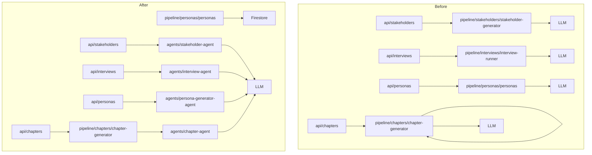
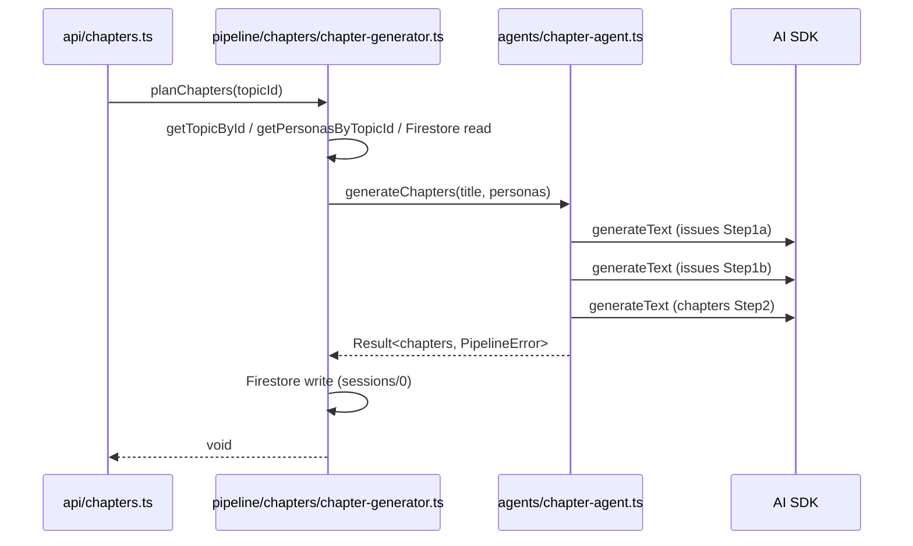

# Design Document: agent-extraction

## Overview

`functions/src/pipeline/` 配下には LLM を直接呼び出すコードと Firestore 操作・オーケストレーションが混在している。本仕様は LLM 呼び出し専用コードを `functions/src/agents/` 配下に移動し、「エージェントが LLM と対話し、パイプラインがオーケストレーションを担う」という責務分離を完成させる。

対象は4つの LLM 呼び出しコード群（ステークホルダー生成、インタビュー実行、ペルソナ生成、章構造生成）。外部 API シグネチャ・Firestore スキーマは変更しない純粋なリファクタリングである。

### Goals
- `agents/` = LLM 呼び出し専用、`pipeline/` = Firestore・フロー制御専用という責務境界を確立する
- 移動後も全関数シグネチャを保持し、動作を変えない
- 陳腐化テスト (`chapter-generator.test.ts`) を合わせて除去する

### Non-Goals
- 各エージェントのプロンプト内容・ロジックの変更
- 新規 LLM 機能の追加
- フロントエンド・Firestore スキーマへの影響

---

## Boundary Commitments

### This Spec Owns
- `agents/` 配下の新規4ファイルの作成と公開インターフェース定義
- 移動元 pipeline ファイルの修正または削除
- 影響を受ける `api/` 層のインポートパス変更
- 陳腐化した `chapter-generator.test.ts` の削除

### Out of Boundary
- `agents/facilitator-agent.ts`・`agents/persona-agent.ts` の内部実装
- `pipeline/debate/` 配下のロジック（エージェント呼び出しのみで LLM を直接持たない）
- Firestore データモデルの変更

### Allowed Dependencies
- `agents/` → `types/`（型定義）, `constants/`（定数）, `utils/`（ヘルパー）, `llm/`（モデル）, `search/`（検索）
- `pipeline/` → `agents/`（LLM 処理委譲）, `types/`, `constants/`
- `api/` → `agents/`（直接）または `pipeline/`（オーケストレーション経由）

### Revalidation Triggers
- `agents/` 配下の関数シグネチャを変更した場合、呼び出し元 (`api/`, `pipeline/`) の再確認が必要
- `InterviewOutput` 型を変更した場合、`api/interviews.ts` の再確認が必要

---

## Architecture

### Existing Architecture Analysis

現状は `api/` → `pipeline/` → LLM という依存チェーンだが、一部の `pipeline/` ファイルが LLM を直接呼び出している（エージェント的コード）。`agents/` はすでに `facilitator-agent.ts` と `persona-agent.ts` の2ファイルが存在し、パターンは確立されている。

### Architecture Pattern & Boundary Map



**依存方向**: `api/` → `agents/` または `pipeline/` → `agents/` → LLM

### Technology Stack

| Layer | Choice / Version | Role in Feature | Notes |
|-------|------------------|-----------------|-------|
| Backend | ai SDK + @ai-sdk/anthropic | LLM 呼び出し | 既存パターン継続。新規依存なし |
| Backend | @tavily/core | web_search ツール（interview-agent） | 既存パターン継続 |
| Runtime | Firebase Functions v2 / Node.js 24 | 実行環境 | 変更なし |

---

## File Structure Plan

### Directory Structure

```
functions/src/
├── agents/
│   ├── chapter-agent.ts          # 新規: generateChapters (LLMによる章構造生成)
│   ├── facilitator-agent.ts      # 変更なし
│   ├── interview-agent.ts        # 新規: runInterview + InterviewOutput (InterviewRunnerServiceを関数化)
│   ├── persona-agent.ts          # 変更なし
│   ├── persona-generator-agent.ts # 新規: generatePersonas (ペルソナ一括生成)
│   └── stakeholder-agent.ts      # 新規: generateStakeholders (ステークホルダー分析)
├── api/
│   ├── interviews.ts             # 変更: InterviewRunnerService → runInterview 関数インポートに変更
│   └── stakeholders.ts           # 変更: インポートパスを agents/ に変更
├── pipeline/
│   ├── chapters/
│   │   ├── chapter-generator.ts  # 変更: generateChapters を削除し agents/ からインポート
│   │   └── chapter-generator.test.ts # 削除: 陳腐化 (旧SDK・旧クラス参照)
│   ├── interviews/
│   │   └── interview-runner.ts   # 削除: agents/interview-agent.ts に全移動
│   ├── personas/
│   │   └── personas.ts           # 変更: generatePersonas を削除し getPersonasByTopicId のみ残す
│   └── stakeholders/
│       └── stakeholder-generator.ts # 削除: agents/stakeholder-agent.ts に全移動
```

### Modified Files

- `api/stakeholders.ts` — インポート先を `pipeline/stakeholders/stakeholder-generator.js` → `agents/stakeholder-agent.js` に変更
- `api/interviews.ts` — `InterviewRunnerService` クラスのインスタンス化 → `runInterview` 関数インポートに変更
- `api/personas.ts` — インポート先を `pipeline/personas/personas.js` → `agents/persona-generator-agent.js` に変更
- `pipeline/chapters/chapter-generator.ts` — `generateChapters` 関数定義・ツール定義を削除し `agents/chapter-agent.js` からインポート追加

---

## System Flows



章生成以外の3エージェントは `api/` → `agents/` の直接呼び出しで、間に pipeline 層を挟まない。

---

## Requirements Traceability

| 要件 | 概要 | コンポーネント | インターフェース |
|------|------|---------------|----------------|
| 1.1 | LLM 呼び出しは agents/ のみ | 全新規エージェント | — |
| 1.2 | Firestore 操作は pipeline/ または api/ | pipeline/personas.ts, pipeline/chapter-generator.ts | — |
| 1.3 | プロンプト・ツール定義を pipeline/ に置かない | 移動対象4ファイル | — |
| 2.1 | generateStakeholders を agents/ に定義 | stakeholder-agent | generateStakeholders |
| 2.2 | pipeline/stakeholders/ 削除 | stakeholder-generator.ts 削除 | — |
| 2.3 | api/stakeholders.ts のインポート更新 | api/stakeholders.ts | — |
| 2.4 | 関数シグネチャ保持 | stakeholder-agent | generateStakeholders |
| 3.1 | runInterview を agents/ に定義 | interview-agent | runInterview |
| 3.2 | pipeline/interviews/ 削除 | interview-runner.ts 削除 | — |
| 3.3 | api/interviews.ts のインポート更新 | api/interviews.ts | — |
| 3.4 | InterviewOutput 型・シグネチャ保持 | interview-agent | InterviewOutput |
| 3.5 | InterviewOutput のエクスポート | interview-agent | InterviewOutput |
| 4.1 | generatePersonas を agents/ に定義 | persona-generator-agent | generatePersonas |
| 4.2 | getPersonasByTopicId を pipeline/ に残す | pipeline/personas/personas.ts | — |
| 4.3 | api/personas.ts のインポート更新 | api/personas.ts | — |
| 4.4 | 関数シグネチャ保持 | persona-generator-agent | generatePersonas |
| 5.1 | generateChapters を agents/ に定義 | chapter-agent | generateChapters |
| 5.2 | planChapters を pipeline/ に残す | pipeline/chapters/chapter-generator.ts | — |
| 5.3 | planChapters のインポート更新 | pipeline/chapters/chapter-generator.ts | — |
| 5.4 | 戻り値型保持 | chapter-agent | generateChapters |
| 6.1 | tsc --noEmit でゼロエラー | 全ファイル | — |
| 6.2 | 削除ファイルへの参照なし | 全 import パス | — |
| 6.3 | index.ts のエクスポート名変更なし | index.ts | — |

---

## Components and Interfaces

### Summary Table

| Component | Layer | Intent | 要件カバレッジ | Key Dependencies |
|-----------|-------|--------|--------------|-----------------|
| `stakeholder-agent` | agents | ステークホルダー分析 LLM 呼び出し | 2.1–2.4 | ai SDK, llm/models (P0) |
| `interview-agent` | agents | インタビュー実行 LLM 呼び出し | 3.1–3.5 | ai SDK, @tavily/core, llm/models (P0) |
| `persona-generator-agent` | agents | ペルソナ一括生成 LLM 呼び出し | 4.1–4.4 | ai SDK, llm/models (P0) |
| `chapter-agent` | agents | 章構造生成 LLM 呼び出し | 5.1–5.4 | ai SDK, @ai-sdk/anthropic, facilitator-agent (P1) |
| `pipeline/personas/personas.ts` | pipeline | Firestore ペルソナ読み取り | 4.2 | firebase-admin (P0) |
| `pipeline/chapters/chapter-generator.ts` | pipeline | 章生成オーケストレーション | 5.2–5.3 | chapter-agent (P0), Firestore (P0) |

### agents/

#### stakeholder-agent

| Field | Detail |
|-------|--------|
| Intent | テーマに関するステークホルダーを LLM で分析・生成する |
| Requirements | 2.1, 2.2, 2.3, 2.4 |

**Responsibilities & Constraints**
- LLM への generateText 呼び出しとツール定義（`submit_stakeholders`）のみを担う
- Firestore 操作を含まない

**Dependencies**
- External: ai SDK — generateText (P0)
- Outbound: llm/models — getPipelineModel (P0)

**Contracts**: Service [x]

##### Service Interface
```typescript
export const generateStakeholders: (
  title: string
) => Promise<{ stakeholders: Stakeholder[] }>
```
- Preconditions: `title` が非空文字列
- Postconditions: LLM が `submit_stakeholders` ツールを呼び出した場合は `stakeholders` 配列を返す
- Invariants: ツール呼び出し未発火時は `Error` をスロー

---

#### interview-agent

| Field | Detail |
|-------|--------|
| Intent | ペルソナへのウェブリサーチ＋仮想インタビューを LLM で実行し、取材記録と初期信念を返す |
| Requirements | 3.1, 3.2, 3.3, 3.4, 3.5 |

**Responsibilities & Constraints**
- `web_search` ツールを持つマルチステップ LLM 呼び出しを担う
- Firestore 操作を含まない
- `InterviewOutput` 型を定義・エクスポートする

**Dependencies**
- External: ai SDK — generateText (P0)
- External: @tavily/core — web_search ツール実装 (P0)
- Outbound: llm/models — getPipelineModel (P0)

**Contracts**: Service [x]

##### Service Interface
```typescript
export type InterviewOutput = {
  researchSummary: string;
  interviewRecord: string;
  initialBelief: string;
};

export const runInterview: (
  topicTitle: string,
  persona: Persona
) => Promise<InterviewOutput>
```
- Preconditions: `topicTitle` が非空文字列、`persona` が有効な Persona オブジェクト
- Postconditions: `submit_research` ツールが呼ばれた場合は `InterviewOutput` を返す
- Invariants: `submit_research` 未呼び出し時は `Error` をスロー

**Implementation Notes**
- `InterviewRunnerService` クラスはトップレベル関数 `runInterview` に変換する（ステートレスなため）
- `api/interviews.ts` は `new InterviewRunnerService().runInterview(...)` → `runInterview(...)` に変更する

---

#### persona-generator-agent

| Field | Detail |
|-------|--------|
| Intent | ステークホルダーリストからペルソナを一括生成する LLM 呼び出し |
| Requirements | 4.1, 4.2, 4.3, 4.4 |

**Responsibilities & Constraints**
- LLM への generateText 呼び出しとツール定義（`submit_personas`）のみを担う
- `getPersonasByTopicId` は `pipeline/personas/personas.ts` に残り、このファイルには含まれない

**Dependencies**
- External: ai SDK — generateText (P0)
- External: nanoid — ID 生成 (P0)
- Outbound: llm/models — getPipelineModel (P0)

**Contracts**: Service [x]

##### Service Interface
```typescript
export const generatePersonas: (
  title: string,
  stakeholders: Stakeholder[],
  topicId: string
) => Promise<{ personas: Persona[] }>
```
- Preconditions: `stakeholders` が非空配列
- Postconditions: `submit_personas` ツールが呼ばれた場合は `personas` 配列を返す（各要素に nanoid ID を付与済み）
- Invariants: ツール呼び出し未発火時は `Error` をスロー

---

#### chapter-agent

| Field | Detail |
|-------|--------|
| Intent | トピックタイトルとペルソナから章構造を生成する LLM 呼び出し（2ステップ: 切り口洗い出し → 章構造化）|
| Requirements | 5.1, 5.2, 5.3, 5.4 |

**Responsibilities & Constraints**
- LLM への generateText 呼び出しとツール定義（`submit_issues`, `submit_chapters`）のみを担う
- Firestore 操作を含まない
- `planChapters`（Firestore 書き込みを含むオーケストレーション）は `pipeline/chapters/chapter-generator.ts` に残す

**Dependencies**
- External: ai SDK — generateText (P0)
- External: @ai-sdk/anthropic + nanoid (P0)
- Outbound: agents/facilitator-agent — `buildNeutralitySystemPrompt` (P1)
- Outbound: llm/models, constants/ai.constants (P0)

**Contracts**: Service [x]

##### Service Interface
```typescript
export const generateChapters: (
  topicTitle: string,
  personas: Persona[]
) => Promise<Result<{
  chapters: Chapter[];
  generalIssues: string[];
  personaIssues: string[];
}, PipelineError>>
```
- Preconditions: `topicTitle` が非空文字列
- Postconditions: 成功時は `{ chapters, generalIssues, personaIssues }` を返す
- Invariants: LLM 呼び出し失敗時は `{ ok: false, error: PipelineError }` を返す

---

## Error Handling

### Error Strategy

本 spec はリファクタリングのため、各エージェントのエラー処理ロジックは変更しない。

- `stakeholder-agent`, `persona-generator-agent`: ツール呼び出し未発火時は `Error` をスロー → `api/` 層で `HttpsError('internal', ...)` にラップ
- `interview-agent`: `submit_research` 未呼び出し時は `Error` をスロー → `api/interviews.ts` で同様にラップ
- `chapter-agent`: `Result<T, PipelineError>` 形式を継続。`planChapters` が `result.ok` を検査しスロー

---

## Testing Strategy

### Unit Tests

移動後にビルドが通ることの確認（tsc --noEmit）が主な検証手段。LLM 呼び出しロジックは変更しないため、新規テストは不要。

- `chapter-generator.test.ts` を削除（旧 SDK・旧クラス参照、実行不可能）
- 移動後のインポートパス変更による型エラーがゼロであることを `tsc --noEmit` で確認

### Integration Tests

- 各 `api/` エンドポイント（`generateStakeholders`, `runInterview`, `generatePersonas`, `generateChapters`）が移動後も同一のシグネチャで動作すること
- `planChapters` → `generateChapters`（agents）→ Firestore 書き込みの連鎖が維持されること
