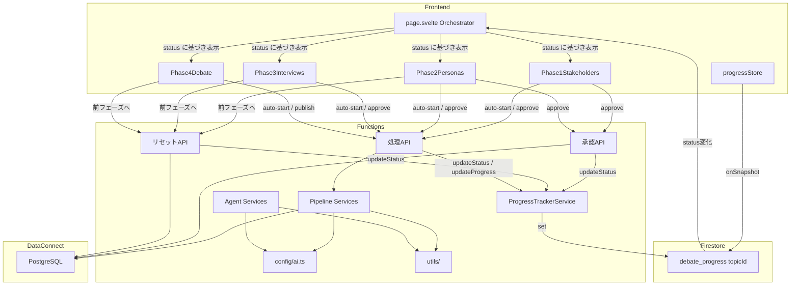
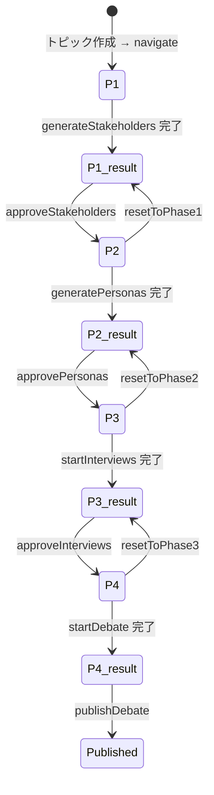
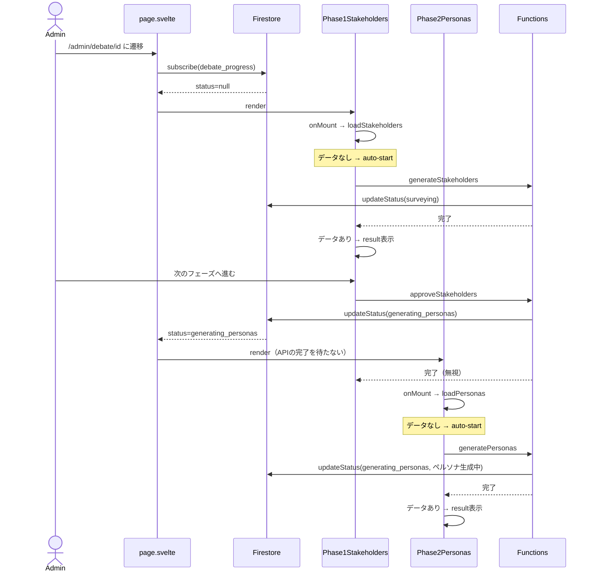
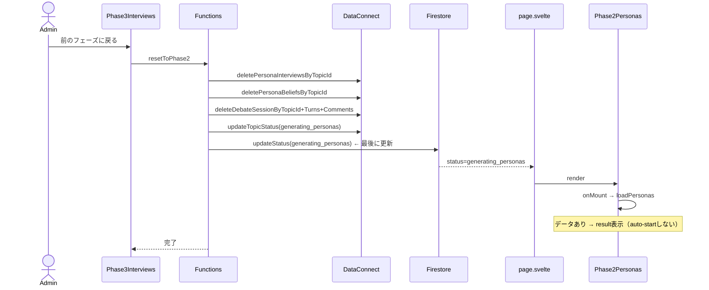

# 設計ドキュメント: architecture-refactoring

## Overview

logotope 管理画面のリファクタリング。現行の「APIレスポンス完了待ちUI」から「Firestore駆動リアルタイムUI」へ移行し、管理者がAIパイプラインの各フェーズを順番に把握・検証できるシステムに作り替える。

**Purpose**: 管理者がAIパイプライン（ステークホルダー調査→ペルソナ生成→取材→討論生成）の各フェーズを一貫した操作感で実行・検証できる管理画面を提供する。

**Users**: システム管理者。各フェーズの処理中状態・結果・エラーをリアルタイムで把握し、任意のフェーズから再検証を開始できる。

**Impact**: `topic.status`（API取得値）と `actionLoading` フラグに依存した画面制御を廃止し、Firestore `debate_progress.status` をUIステート唯一の情報源として確立する。バックエンドの承認APIから次フェーズ処理チェーンを切り離し、各フェーズ画面のauto-startに処理起動責務を移す。

### Goals

- フェーズ承認後、次フェーズ画面に即座に切り替わる（APIの完了を待たない）
- 全フェーズで「処理中 / 結果 / エラー」の3状態が統一パターンで表示される
- フェーズ2〜4から前フェーズのデータ表示状態にリセットできる
- Firestoreにエラーフィールドを書き込まない設計でエラー残留問題を根本解消する

### Non-Goals

- 公開閲覧ページの変更
- Firebase Data Connect スキーマ変更（テーブル追加・変更）
- GraphQL mutation の追加を除くデータモデルの変更

---

## Boundary Commitments

### This Spec Owns

- `src/routes/admin/debate/[id]/+page.svelte` の全面刷新
- `src/lib/components/admin/` の管理画面フェーズコンポーネント群
- `functions/src/api/` の承認API変更・リセットAPI追加
- `functions/src/pipeline/progress-tracker.ts` の `setError` 削除・`updateStatus` 修正
- `functions/src/utils/` の共通ユーティリティ追加（auth, conversation）
- `functions/src/config/ai.ts` の新規作成
- `functions/src/db/repository.ts` のdelete関数追加

### Out of Boundary

- Firebase Data Connect スキーマ変更（`schema.gql` は変更しない。削除mutationのみ `mutations.gql` に追加）
- 公開閲覧ページ（`/debate/[id]`）
- Firebase Auth 設定変更
- 既存ユニットテストのテストロジック変更（テスト対象コードのインターフェース変更への追従は許容）

### Allowed Dependencies

- Firebase Firestore（リアルタイム進捗）
- Firebase Data Connect / PostgreSQL（永続データ）
- Anthropic SDK（AI処理）
- `@14ch/svelte-ui`（UIコンポーネント標準ライブラリ）

### Revalidation Triggers

- `DebateStatus` 型に新しい状態値を追加した場合、フェーズマッピングロジックの確認が必要
- `debate_progress` Firestoreドキュメントのスキーマを変更した場合、`ProgressState` 型の更新が必要
- リセットAPIの削除対象範囲を変更した場合、対応するGraphQL mutationの見直しが必要

---

## Architecture

### Existing Architecture Analysis

現行アーキテクチャの問題点：

1. **フェーズ表示の情報源**: `topic.status`（Data Connect経由のAPIレスポンス）を使用。APIが返却するまで更新されない
2. **承認APIのチェーン処理**: `approveStakeholders` がペルソナ生成（最大540秒）を同期実行。UIはその間ステークホルダー画面でスピナーを表示
3. **エラー残留**: `ProgressTrackerService.setError()` が `merge: true` で `error` フィールドを書き込み、`updateStatus()` が `merge: true` のため `error` フィールドがクリアされない
4. **密結合API**: 承認APIが次フェーズ処理を内包しているため、フェーズ単位の独立したテストが困難

既存パターンで維持するもの：
- Firebase Functions v2 `onCall` による長時間AI処理
- Firestore `debate_progress/{topicId}` によるリアルタイム進捗
- `createProgressStore` の Firestore リアルタイムリスナー

### Architecture Pattern & Boundary Map



**依存方向**: `config/utils` → `types` → `pipeline/agents` → `api` → （UI）

**Key Decisions**:
- Firestore `status` が唯一のフェーズ切り替えシグナル。DB `topic.status` はData Connect側の整合性のためのみに存在
- 承認APIは「承認 + Firestoreステータス更新」のみ。次フェーズ処理は開始しない
- 各フェーズコンポーネントが自身のAI処理APIをauto-startで呼び出す

### Technology Stack

| Layer | 選択 | 役割 |
|-------|------|------|
| Frontend | SvelteKit 2.x / Svelte 5 runes | フェーズコンポーネント、Firestoreリスナー |
| UI Components | `@14ch/svelte-ui` | 標準UIコンポーネント（スピナー、カード等） |
| State | Firestore `debate_progress` | フェーズ切り替えシグナル |
| Backend | Firebase Functions v2 onCall | 承認API・リセットAPI・AI処理API |
| AI | Anthropic SDK (Claude API) | AIパイプライン実行 |
| Data | Firebase Data Connect / PostgreSQL | 永続データ（ステークホルダー、ペルソナ等） |

---

## File Structure Plan

### Directory Structure

```
src/
├── routes/admin/debate/[id]/
│   └── +page.svelte              # 全面刷新: Firestore購読によるフェーズ切り替えOrchestrator
└── lib/
    ├── components/admin/
    │   ├── Phase1Stakeholders.svelte  # 新規
    │   ├── Phase2Personas.svelte      # 新規
    │   ├── Phase3Interviews.svelte    # 新規
    │   └── Phase4Debate.svelte        # 新規
    ├── stores/
    │   └── progress.svelte.ts        # ProgressState型参照のみ（変更なし）
    ├── api/
    │   └── topics.ts                 # resetToPhaseN 関数追加
    └── types/
        └── index.ts                  # ProgressState から error フィールド削除

functions/src/
├── config/
│   └── ai.ts                        # 新規: モデル名・max_tokens定数
├── utils/
│   ├── conversation.ts              # 新規: formatHistory 関数
│   └── auth.ts                      # 新規: requireAuth ヘルパー
├── api/
│   ├── resets.ts                    # 新規: resetToPhase1/2/3 エンドポイント
│   ├── stakeholders.ts              # 変更: approveStakeholders からペルソナ生成チェーン削除
│   ├── personas.ts                  # 変更: approvePersonas から取材チェーン削除
│   └── interviews.ts                # 変更: approveInterviews にFirestore更新追加
├── pipeline/
│   ├── progress-tracker.ts          # 変更: setError削除, updateStatus full overwrite
│   ├── stakeholder-analyzer.ts      # 変更: DI対応 (ProgressTrackerService)
│   ├── persona-generator.ts         # 変更: DI対応, setError→throw
│   └── interviewer.ts               # 変更: DI対応
├── agents/
│   ├── facilitator-agent.ts         # 変更: DI対応 (Anthropic), formatHistory import
│   └── persona-agent.ts             # 変更: DI対応 (Anthropic), formatHistory import
└── db/
    └── repository.ts                # 変更: deletePersonaProfilesByTopicId 等を追加
```

### Modified Files

- `src/routes/admin/debate/[id]/+page.svelte` — Firestoreステータスでフェーズコンポーネント切り替え、`topic.status`/`actionLoading` 除去
- `src/lib/types/index.ts` — `ProgressState.error` フィールド削除
- `src/lib/api/topics.ts` — `approveStakeholders` / `approvePersonas` シグネチャ変更、`resetToPhase1/2/3` 追加
- `functions/src/api/stakeholders.ts` — `approveStakeholders` のペルソナ生成チェーン削除、Firestore更新追加
- `functions/src/api/personas.ts` — `approvePersonas` の取材チェーン削除、Firestore更新追加
- `functions/src/api/interviews.ts` — `approveInterviews` にFirestore更新追加
- `functions/src/pipeline/progress-tracker.ts` — `setError` 削除、`updateStatus` full overwrite
- `functions/src/pipeline/stakeholder-analyzer.ts` — DI, `setError` 参照削除
- `functions/src/pipeline/persona-generator.ts` — DI, `setError` 参照削除
- `functions/src/pipeline/interviewer.ts` — DI
- `functions/src/agents/facilitator-agent.ts` — DI, `formatHistory` 外部import
- `functions/src/agents/persona-agent.ts` — DI, `formatHistory` 外部import
- `functions/src/db/repository.ts` — delete関数追加
- `dataconnect/connector/mutations.gql` — delete mutation追加

---

## System Flows

### フェーズ遷移ステートマシン



> Firestore `status` 値によるマッピング: `null/pending/surveying` → P1 画面、`generating_personas` → P2 画面、`interviewing` → P3 画面、`debating/completed` → P4 画面

### 承認→次フェーズ遷移シーケンス



**Key Decision**: Firestoreステータス更新によりAPIのreturnを待たずに即座にP2がrenderされる。P2のauto-startは独立したAPIコールとして実行される。

### リセットフロー



**Key Decision**: Data Connect削除完了後にFirestoreを更新することで、UI切り替え時には削除済みデータを確実に参照できる。

---

## Requirements Traceability

| Requirement | Summary | Components | Interfaces | Flows |
|-------------|---------|------------|------------|-------|
| 1.1〜1.3 | トピック作成・バリデーション・遷移 | 既存 `/admin/topics/new` | createTopic API | — |
| 2.1 | Firestore status による3状態切り替え | `page.svelte`, 各PhaseN | `ProgressState` | 遷移シーケンス |
| 2.2 | フェーズ画面マウント時auto-start | 各PhaseN `.onMount` | ProcessAPI | 遷移シーケンス |
| 2.3 | 処理中: スピナー、次フェーズボタン非表示 | 各PhaseN `loading`状態 | — | — |
| 2.4 | 完了: 結果表示、次フェーズボタン表示 | 各PhaseN `result`状態 | — | — |
| 2.5 | エラー: エラーメッセージ表示 | 各PhaseN `error`状態 | — | — |
| 2.6 | フェーズ2〜4全状態で「前のフェーズに戻る」 | Phase2/3/4 全状態 | resetToPhaseN API | リセットフロー |
| 2.7 | Firestore status変化時に即座に画面切り替え | `page.svelte`, `progressStore` | Firestore onSnapshot | 遷移シーケンス |
| 2.8 | actionLoading / topic.status を使用しない | `page.svelte` | — | — |
| 3.1 | ステークホルダー一覧 | Phase1Stakeholders result | getStakeholders | — |
| 3.2 | ペルソナ一覧 | Phase2Personas result | getPersonas | — |
| 3.3 | 取材状態・進捗・結果 | Phase3Interviews | getInterviews | — |
| 3.4 | 討論進捗・全文・コメント | Phase4Debate | getAdminDebate | — |
| 3.5 | 「公開する」ボタン | Phase4Debate result | publishDebate | — |
| 4.1 | resetToPhase1: ペルソナ以降削除 | ResetAPI | resetToPhase1 | リセットフロー |
| 4.2 | resetToPhase2: 取材以降削除 | ResetAPI | resetToPhase2 | リセットフロー |
| 4.3 | resetToPhase3: 討論削除 | ResetAPI | resetToPhase3 | リセットフロー |
| 4.4 | リセット後、前フェーズresult表示 | 各PhaseN onMount | — | リセットフロー |
| 4.5 | データなしでもエラーなし | ResetAPI | — | — |
| 5.1 | Firestoreへの書き込みフィールド制限 | `ProgressTrackerService` | — | — |
| 5.2 | `setError` 削除 | `ProgressTrackerService` | — | — |
| 5.3 | エラーはthrowして伝播 | Pipeline Services | — | — |
| 5.4 | UIはAPIのcatchブロックでエラー表示 | 各PhaseN `error`状態 | — | — |
| 5.5 | updateStatus で progress フィールドリセット | `ProgressTrackerService` | — | — |
| 6.1 | formatHistory を utils に集約 | `utils/conversation.ts` | — | — |
| 6.2 | AI設定を config/ai.ts に集約 | `config/ai.ts` | — | — |
| 6.3 | FacilitatorAgent/PersonaAgent に Anthropic DI | agent services | コンストラクタ | — |
| 6.4 | Pipeline Services に ProgressTracker DI | pipeline services | コンストラクタ | — |
| 6.5 | auth ヘルパー集約 | `utils/auth.ts` | requireAuth | — |
| 6.6 | ユニットテスト全パス | 全テスト対象ファイル | — | — |

---

## Components and Interfaces

### コンポーネントサマリー

| Component | Layer | Intent | Req Coverage | Key Dependencies |
|-----------|-------|--------|--------------|------------------|
| `page.svelte` | UI Orchestrator | Firestoreステータスでフェーズコンポーネントを切り替える | 2.1, 2.7, 2.8 | `progressStore`, `getTopic` API |
| `Phase1Stakeholders` | UI Phase | ステークホルダー調査の処理中/結果/エラー表示 | 2.2〜2.5, 3.1 | `generateStakeholders`, `approveStakeholders`, `getStakeholders` |
| `Phase2Personas` | UI Phase | ペルソナ生成の3状態表示、リセット | 2.2〜2.6, 3.2, 4.1 | `generatePersonas`, `approvePersonas`, `resetToPhase1` |
| `Phase3Interviews` | UI Phase | 取材の3状態表示、進捗、リセット | 2.2〜2.6, 3.3, 4.2 | `startInterviews`, `approveInterviews`, `resetToPhase2`, `progressStore` |
| `Phase4Debate` | UI Phase | 討論生成の3状態表示、公開、リセット | 2.2〜2.6, 3.4, 3.5, 4.3 | `startDebate`, `publishDebate`, `resetToPhase3`, `progressStore` |
| `ProgressTrackerService` | Backend | Firestore進捗ドキュメントの書き込み管理 | 5.1, 5.2, 5.5 | Firestore Admin SDK |
| Reset API | Backend | フェーズN以降のデータ削除とステータスリセット | 4.1〜4.5 | `repository`, `ProgressTrackerService` |
| `config/ai.ts` | Backend Config | AIモデル名・max_tokens定数 | 6.2 | — |
| `utils/conversation.ts` | Backend Util | `formatHistory` 関数 | 6.1 | `ConversationTurn` 型 |
| `utils/auth.ts` | Backend Util | `requireAuth` ヘルパー | 6.5 | firebase-functions/v2/https |

---

### Frontend Layer

#### page.svelte (Orchestrator)

| Field | Detail |
|-------|--------|
| Intent | Firestoreリアルタイム購読結果のみを判断基準としてフェーズコンポーネントを切り替える |
| Requirements | 2.1, 2.7, 2.8 |

**Responsibilities & Constraints**
- `progressStore` の `status` フィールドのみでレンダリングするフェーズコンポーネントを決定する
- `topic.title` と `topicId` を各フェーズコンポーネントにpropsとして渡す
- `actionLoading` フラグおよび `topic.status`（API取得値）を保持しない

**State Management**
```typescript
// page.svelte の状態
let topic = $state<{ id: string; title: string } | null>(null);
const progressStore = $derived(createProgressStore(topicId));

// フェーズ判定 (statusのみを使用)
const currentPhase = $derived(() => {
  const status = progressStore.progress?.status ?? null;
  if (!status || status === 'pending' || status === 'surveying') return 1;
  if (status === 'generating_personas') return 2;
  if (status === 'interviewing') return 3;
  return 4; // debating | completed
});
```

**Dependencies**
- Inbound: Firestore `debate_progress/{topicId}` — status変化のシグナル (P0)
- Outbound: PhaseN コンポーネント — topicId, topicTitle を渡す (P0)
- Outbound: `getTopic` API — topicタイトル取得（初回マウント時のみ）(P1)

**Contracts**: State [ ✓ ]

---

#### PhaseN コンポーネント 共通仕様

すべての Phase コンポーネント（Phase1〜Phase4）は以下の基底インターフェースに従う：

```typescript
interface PhaseBaseProps {
  topicId: string;
  topicTitle: string;
}

// 内部状態（各コンポーネントが管理）
type PhaseState = 'loading' | 'result' | 'error';
```

**共通ライフサイクル**

```
onMount:
  1. loadData() → フェーズ固有データをData Connect APIから取得
  2. データが存在する → state = 'result'
  3. データが存在しない → autoStart() → state = 'loading'
     → API呼び出し
     → 成功: loadData() → state = 'result'
     → 失敗: errorMessage = e.message → state = 'error'
```

**共通ボタンレイアウト**

| 状態 | 表示内容 |
|------|---------|
| loading | スピナー + 処理中メッセージ（Firestore progressStore の currentStep を表示） |
| result | 結果データ + 「次のフェーズへ進む」ボタン（Phase4は「公開する」） |
| error | エラーメッセージ（APIのcatchブロックから受け取ったメッセージ） |
| Phase2〜4 全状態 | 「前のフェーズに戻る」ボタン（常時表示） |

---

#### Phase3Interviews.svelte

| Field | Detail |
|-------|--------|
| Intent | 取材処理のリアルタイム進捗（N人中M人完了）と結果表示 |
| Requirements | 2.2〜2.6, 3.3, 4.2 |

**Implementation Notes**
- 処理中状態: Firestoreの `completed/total` を `progressStore` から表示（「N人中M人完了」）
- 各ペルソナの取材状態は APIが返却後に `getInterviews()` で一覧取得
- DataConnectはリアルタイム購読非対応のため、処理中はFirestoreの集計値（completed/total）のみを表示する

---

### Backend Layer

#### ProgressTrackerService（変更）

| Field | Detail |
|-------|--------|
| Intent | Firestore `debate_progress` への書き込みを管理。エラーフィールドを書き込まない |
| Requirements | 5.1, 5.2, 5.5 |

**Contracts**: Service [ ✓ ]

##### Service Interface

```typescript
class ProgressTrackerService {
  // Full overwrite（merge: false相当）: 古い error / progress フィールドをクリア
  async updateStatus(topicId: string, status: DebateStatus, currentStep?: string): Promise<void>;

  // merge: true: status を変えずに進捗カウントのみ更新
  async updateProgress(topicId: string, completed: number, total: number): Promise<void>;

  // 削除: setError メソッドは廃止
}
```

**Firestore書き込みフィールド（`updateStatus` 実行後）**:

| フィールド | 値 |
|------------|-----|
| `status` | 引数の `DebateStatus` 値 |
| `currentStep` | 引数値 or `null` |
| `completed` | `0`（リセット） |
| `total` | `0`（リセット） |
| `updatedAt` | `FieldValue.serverTimestamp()` |

`error` フィールドは一切書き込まない。full overwriteにより既存の `error` フィールドも消去される。

**Implementation Notes**
- `updateStatus` は `doc.set({ ... })` をmerge無しで実行（full overwrite）
- `updateProgress` は `doc.set({ ... }, { merge: true })` を維持

---

#### Reset API（新規）

| Field | Detail |
|-------|--------|
| Intent | フェーズN以降のData Connectデータを削除し、Firestoreステータスを前フェーズに戻す |
| Requirements | 4.1〜4.5 |

**Contracts**: API [ ✓ ]

##### API Contract

| Function | 削除対象 | Firestore status | DB status |
|----------|---------|------------------|-----------|
| `resetToPhase1` | PersonaProfiles, PersonaInterviews, PersonaBeliefs, DebateSession+Turns+Comments | `surveying` | `surveying` |
| `resetToPhase2` | PersonaInterviews, PersonaBeliefs, DebateSession+Turns+Comments | `generating_personas` | `generating_personas` |
| `resetToPhase3` | DebateSession, DebateTurns, PostDebateComments | `interviewing` | `interviewing` |

**処理順序**: Data Connect削除 → `updateTopicStatus` → `tracker.updateStatus`（Firestore更新は最後）

**Preconditions**: 認証済みリクエスト、`topicId` が存在するトピック

**Idempotency**: 削除対象データが存在しない場合もエラーを返さず成功とする（Req 4.5）

---

#### 承認API変更仕様

**approveStakeholders（変更後）**:

```
入力: { topicId }
処理:
  1. stakeholderMap を approved=true に更新
  2. repo.updateTopicStatus(topicId, 'generating_personas')
  3. tracker.updateStatus(topicId, 'generating_personas')  ← 追加
出力: { status: 'ok' }
削除: ペルソナ生成チェーン全体
```

**approvePersonas（変更後）**:

```
入力: { topicId }
処理:
  1. PersonaProfiles を approved=true に更新
  2. repo.updateTopicStatus(topicId, 'interviewing')
  3. tracker.updateStatus(topicId, 'interviewing')  ← 追加
出力: { status: 'ok' }
削除: 取材チェーン全体
```

**approveInterviews（変更後）**:

```
入力: { topicId }
処理:
  1. repo.updateTopicStatus(topicId, 'debating')
  2. tracker.updateStatus(topicId, 'debating')  ← 追加
出力: { status: 'ok' }
```

---

#### config/ai.ts（新規）

| Field | Detail |
|-------|--------|
| Intent | AI呼び出しに使用するモデル名とmax_tokens定数を一元管理 |
| Requirements | 6.2 |

**Contracts**: Service [ ✓ ]

```typescript
export const AI_MODELS = {
  OPUS: 'claude-opus-4-8',
  SONNET: 'claude-sonnet-4-6',
} as const;

export const MAX_TOKENS = {
  STAKEHOLDER: 4096,
  PERSONA: 8192,
  INTERVIEW: 4096,
  FACILITATOR_OPENING: 1024,
  FACILITATOR_SELECT: 256,
  FACILITATOR_INTERVENTION: 512,
  FACILITATOR_CLOSING: 1024,
} as const;
```

---

#### utils/auth.ts（新規）

| Field | Detail |
|-------|--------|
| Intent | onCall ハンドラーの認証チェックを共通化し、各APIの冒頭の重複を除去 |
| Requirements | 6.5 |

```typescript
import { HttpsError } from 'firebase-functions/v2/https';
import type { CallableRequest } from 'firebase-functions/v2/https';

export function requireAuth(request: CallableRequest): void {
  if (!request.auth) throw new HttpsError('unauthenticated', 'Must be authenticated');
}
```

---

#### utils/conversation.ts（新規）

| Field | Detail |
|-------|--------|
| Intent | 会話履歴をLLMプロンプト用文字列にフォーマットする関数を集約 |
| Requirements | 6.1 |

```typescript
import type { ConversationTurn } from '../types/index.js';

export function formatHistory(history: ConversationTurn[]): string {
  return history
    .map(t => `[${t.speakerName}(${t.speakerRole})]: ${t.content}`)
    .join('\n');
}
```

---

#### Pipeline/Agent Services DI仕様

**Req 6.3** — FacilitatorAgentService, PersonaAgentService:

```typescript
export class FacilitatorAgentService {
  private client: Anthropic;
  constructor(client?: Anthropic) {
    this.client = client ?? new Anthropic();
  }
}
```

**Req 6.4** — StakeholderAnalyzerService, PersonaGeneratorService, InterviewerService:

```typescript
export class StakeholderAnalyzerService {
  private client: Anthropic;
  private tracker: ProgressTrackerService;
  constructor(tracker?: ProgressTrackerService, client?: Anthropic) {
    this.tracker = tracker ?? new ProgressTrackerService();
    this.client = client ?? new Anthropic();
  }
}
```

**エラー伝播パターン（Req 5.3）**:
```typescript
// 変更前
} catch (err) {
  await this.tracker.setError(topicId, message);
  return { ok: false, error: { ... } };
}

// 変更後
} catch (err) {
  throw err; // API層でHttpsErrorとして処理
}
```

---

## Data Models

### Firestore: debate_progress/{topicId}

**変更後スキーマ**:

```typescript
// src/lib/types/index.ts
export interface ProgressState {
  status: DebateStatus;
  currentStep: string | null;  // null: 処理未開始またはリセット後
  completed: number;
  total: number;
  updatedAt: Timestamp;
  // error フィールドを削除（Req 5.1）
}
```

**`updateStatus` 実行後の確定フィールド**: `status`, `currentStep`, `completed=0`, `total=0`, `updatedAt`

### Data Connect: 新規削除 Mutation

以下の GraphQL mutation を `dataconnect/connector/mutations.gql` に追加:

| Mutation名 | 削除対象 | 引数 |
|-----------|---------|------|
| `DeletePersonaProfilesByTopicId` | PersonaProfile（topicIdでフィルタ） | `topicId: String!` |
| `DeletePersonaInterviewsByTopicId` | PersonaInterview（Persona経由でtopicId） | `topicId: String!` |
| `DeletePersonaBeliefsByTopicId` | PersonaBelief（Persona経由でtopicId） | `topicId: String!` |
| `DeleteDebateSessionByTopicId` | DebateSession（topicIdでフィルタ） | `topicId: String!` |

> `DeleteDebateTurnsBySession`, `DeletePostDebateCommentsBySession`, `DeleteDebateSession` は既存。

### Data Connect: repository.ts 追加関数

```typescript
export async function deletePersonaProfilesByTopicId(topicId: string): Promise<void>;
export async function deletePersonaInterviewsByTopicId(topicId: string): Promise<void>;
export async function deletePersonaBeliefsByTopicId(topicId: string): Promise<void>;
export async function deleteDebateSessionByTopicId(topicId: string): Promise<void>;
```

---

## Error Handling

### Error Strategy

エラーはすべてAPIレスポンス（`HttpsError`）経由で返す。Firestoreへのエラー書き込みは行わない。

### Error Categories and Responses

**AI処理エラー（Pipeline Services）**:
- `StakeholderAnalyzerService`, `PersonaGeneratorService`, `InterviewerService` はエラーを `throw` して上位に伝播
- API層で `HttpsError('internal', err.message)` として変換してクライアントに返す
- フロントエンドは `catch (e)` で `e.message` を `errorMessage` stateに設定

**リセットAPI部分失敗**:
- Data Connect削除は可能な限り全件削除を試みる
- 一部データが存在しない場合でもエラーとしない（Req 4.5）

**認証エラー**: `requireAuth()` が `HttpsError('unauthenticated')` を throw → クライアント側でリダイレクト

### エラー表示ルール（フロントエンド）

- `error` state表示: `catch` ブロックで受け取った `Error.message` のみを表示
- Firestoreの `error` フィールドは参照しない（型定義から削除済み）
- エラーが表示中でも「前のフェーズに戻る」ボタンは常時表示（Req 2.6）

---

## Testing Strategy

### Unit Tests

- `ProgressTrackerService.updateStatus` — full overwrite により旧フィールドがクリアされることを検証
- `requireAuth` ヘルパー — auth未設定リクエストで `unauthenticated` errorが throwされることを検証
- `formatHistory` — ConversationTurn配列から期待する文字列が生成されることを検証
- Reset API (`resetToPhase1/2/3`) — 各削除関数が正しい順序で呼ばれ、Firestoreが最後に更新されることを検証（repositoryとProgressTrackerServiceをモック）

### Integration Tests

- Phase承認フロー: `approveStakeholders` 呼び出し後にFirestore statusが `generating_personas` になり、ペルソナ生成が行われないことを検証
- `generatePersonas` の独立呼び出し: ステークホルダーmap承認済みの状態で正常完了することを検証
- リセットAPI: 実際のData Connect（エミュレータ）に対してデータ削除が正しく実行されることを検証

### E2E/UI Tests

- フェーズ1マウント→auto-start→結果表示→「次のフェーズへ進む」でフェーズ2に切り替わることを検証
- フェーズ3で「前のフェーズに戻る」→フェーズ2のresult表示（ペルソナ一覧あり）になることを検証
- API失敗時にerrorメッセージが表示され、「前のフェーズに戻る」ボタンが表示されることを検証

---

## Security Considerations

すべてのFunctions APIエンドポイントは `requireAuth(request)` で認証チェックを実施する。既存APIへの変更でも認証チェックを省略しない。管理者のみが操作可能なエンドポイントであることをauth.uidベースで担保する（既存設計を踏襲）。
