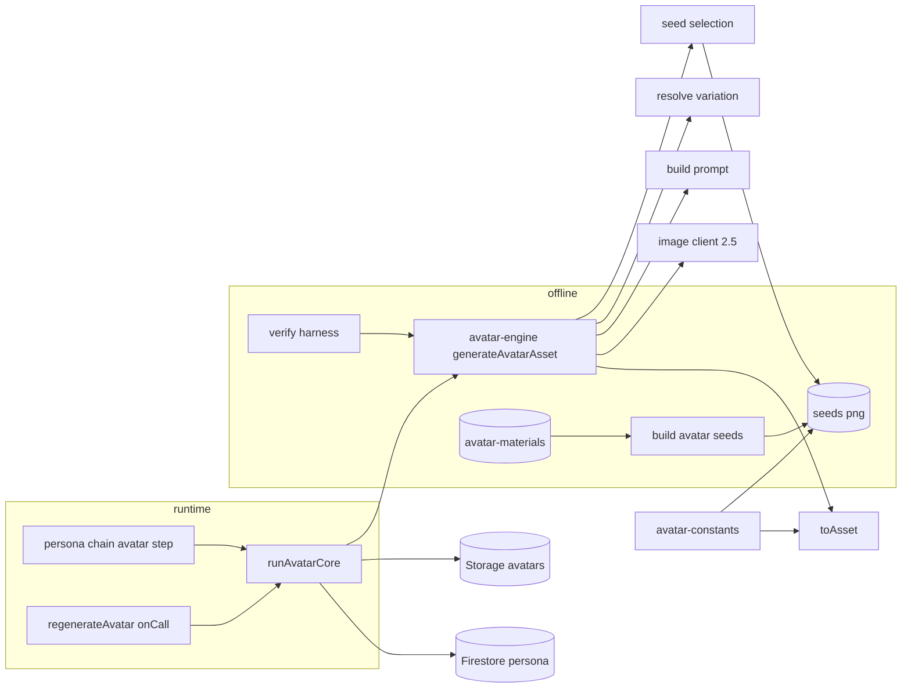
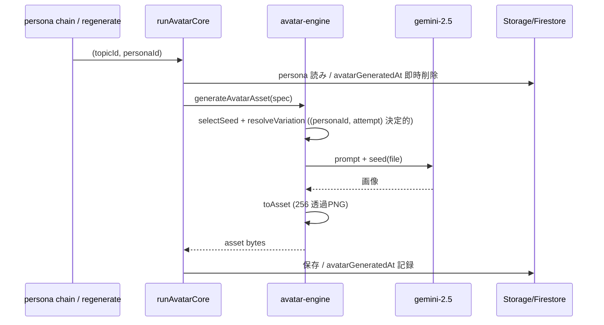

# Technical Design: avatar-generation-engine

## Overview

**Purpose**: ペルソナ向けアバター（顔なし・黒基調シルエットのアイコン）を、先行フィジビリ `persona-avatar-image-generation` の成功パターン（編集ベース生成）に基づき、**再現可能な1本の実行コード**として復元する。

**Users**: 討論ペルソナ生成パイプライン（ペルソナ作成時のオフライン生成）と、管理画面の個別再生成が、この生成エンジンを利用する。

**Impact**: 現行 `api/avatars.ts` の text-only 生成（seed 非使用）を、seed を編集元に添付する編集ベース生成へ置き換える。検証コードと本番コードを**共有エンジン1本**に統合し、乖離を構造的に不能にする。

### Goals
- 編集ベース手法（seed 添付・ズーム/目線固定・0.92 接地・輝度→アルファ後処理）を共有エンジンとして実装する。
- 本番 `runAvatarCore` と offline 検証が同一エンジンを呼ぶ（Req 1.4）。
- 効くパラメータを単一定義の定数としてコードに保持する（Req 1.2）。
- 2.5 で実生成し、枠転写・様式・再現性を確認できる状態にする（Req 7）。

### Non-Goals
- androgynous の seed アンカー整備、`gemini-3.1-flash-image` 移行（後続）。
- アバター表示 UI（`PersonaAvatar.svelte`）の改修・独立着色の表示側実装。
- ペルソナへの画像割り当てロジック、配信・キャッシュ・CDN。

## フィジビリ準拠条件（`persona-avatar-image-generation/validation/` 由来・漏れなく適用する）

> 出典: [per-persona-variation.md](../persona-avatar-image-generation/validation/per-persona-variation.md) ／ [results.md](../persona-avatar-image-generation/validation/results.md) ／ [go-no-go.md](../persona-avatar-image-generation/validation/go-no-go.md)。**採用手法の確定結論。再導出しない。** 破棄経路は「不採用」と明記する。実装・プロンプト・後処理・検証はここを唯一の根拠にし、記憶や破棄版（prompt.md の text-only）で埋めない。

### A. 生成手法
- A1. **編集ベース**: seed を「編集の元画像」として file 添付し、1体ずつ単発生成する。黒ベタ・顔なしのテイストはピクセルから移る（生成ツールの記憶に依存しない）。
- A2. **不採用**: 参照画像を「別 demographic のスタイルヒント」として足す方式（対象外 demographic で線画＋顔描写に逸脱）。text-only 生成も不採用。
- A3. **独立単発生成（per-persona）**: 「まとめて1枚に描く」はスケールは揃うが per-persona 不適（ペルソナは1体ずつ増える）ため採らない。
- A4. モデル呼び出し: `gemini-2.5-flash-image` ＋ `responseModalities:['TEXT','IMAGE']` ＋ ベース画像（seed）添付。鍵はシークレットのインライン注入（ローカル保存しない）。

### B. スケール一貫（生成側で固定・Req 4）
- B1. **プロンプトで固定するのは「ズーム（画面内での頭の大きさ）と目線の高さ」のみ**。seed に完全一致させる。
- B2. 体型・髪型・ポーズは固定しない（構図を固定しすぎると体型変化まで消える）。
- B3. **後処理の幾何検出による自動スケール正規化は不採用**（顔穴＝首連結、首くびれ＝ロングヘアで破綻し、髪型・ポーズに頑健でない）。
- B4. 顔高（`FACE_HEIGHT_PERCENT=45`）は seed の顔高の目標として採用（設計時のユーザー指示）。prompt は B1 の zoom/目線一致で seed のこの顔高を転写する。**プロンプトに絶対px（例:460px）や「体を枠に収める/フィット/縮小」を書き足さない**（＝実装が勝手に足した後付け。これがスケールを崩した）。
- B5. スケールの拠り所は「seed（手動で顔高を揃えた確定アセット）＋ B1 の生成側固定」。独立単発でも頭サイズ・位置が揃う。

### C. 様式・スタイル基準（受け入れの合否項目）
- C1. 背景は無地の白一色（グラデーション・小物・影・枠・テクスチャなし）。
- C2. 被写体は**黒く暗い**（黒ベタ）＝輝度→アルファで抽出できる。白い服・線画主体で明るいと胴体が透明化して抽出不能（男性逸脱 A2 の主因）。
- C3. 顔を描かない（目・鼻・口・眉・まつげ・顔の輪郭線を描かない）。顔の内側は白のネガティブスペース（featureless）。
- C4. **基調は黒ベタ塗りのシルエット**（写実的陰影・写真調・多色にしない。**輪郭線主体の線画は不合格**＝男性逸脱 A6）。ただし seed に含まれる**細い線描（襟・ボタン・眼鏡）**と明るい要素の様式には一致させる（seed 準拠・Req 5.2）。
- C5. 被写体（髪・衣服・輪郭）と非被写体（顔内側・背景）が 2 色に分離できる。
- C6. 構図はバストアップ（胸から上）・正方 1:1。
- C7. 影・ドロップシャドウを描かない。生成時に「純白背景・影/ドロップシャドウなし」を**明示**する（影は後処理で半透明ハローになる）。
- C8. 表情は話している最中の真剣な様子（笑顔にしない）。
- C9. 明るい要素（白い服・グレーの髪）は輝度→アルファで薄い階調として自然に残る。**高齢の白髪はベタ塗りにせず筋のストロークで描く**（白髪感が出る・Req 3.4）。

### D. 可変軸（すべてシルエットで表現・指定値で制御）
- D1. 髪型（例: ベリーショート／ウルフ／ツーブロック／マッシュ／パーマ）。
- D2. 体型（細身／肥満＝二重顎・太い首・恰幅／筋肉質＝広い肩幅）。
- D3. ポーズ（腕組み／顎に手／斜め／手を下ろす／横向き）。
- D4. 年齢は**灰色や皺でなく、頭身（頭:体 比率）・生え際・姿勢・髪型のシルエット**で表す（子供＝大きい頭身、高齢＝生え際後退・白髪ストローク）。
- D5. アングル・服装・メガネ。
- D6. バリエーションは AI 裁量任せにせず、各軸の指定値で制御する（Req 3.5）。

### E. 後処理・アセット化（決定的）
- E1. 輝度→アルファ変換（黒=不透明・白=透明・中間=半透明）。
- E2. 薄い影/にじみをしきい値で透明に落とす。
- E3. 出力は 256×256px・正方 1:1・RGB=黒のアルファ透過 PNG・同一入力に決定的。
- E4. フレーム占有は高さ基準で正規化し、横ははみ出させる（大柄でも全体を縮小しない）。※スケール一貫の本命は B の生成側固定であり、後処理は幾何検出でスケールを作り直さない（B3）。
- E5. 2 色独立着色が成立（silhouette 色／背景色を別指定でき、顔内側が背景色で透け、縁が濁らない）。
- E6. 命名は `{ageBandCode}_{gender}_{serial}`、`serial` は発番後不変。

### F. シード（基準ベース）整備
- F1. 各（年齢帯×性別）バケットに on-style シード（黒ベタ・顔なし・バストアップ）を最低 1 枚確定する。**スタイル再現性はアンカー一致に依存**（一致で 3/3、不一致で 0/1）。
- F2. 提供シート（1枚に 4 体）は白ガター検出で 2×2 → 4 分割して切り出す。

### G. 運用・ゲート
- G1. ペルソナ作成時に**オフラインで 1 回生成**し、そのペルソナの資産として保存する（ランタイム毎回生成はしない）。
- G2. 生成失敗（画像を返さない／崩れ）に備え**リトライ＋受け入れチェック**でゲートする。
- G3. 受け入れは C の合否項目でチェックリスト判定し、同一指示の**再現性（合格率）を記録**する。

## Boundary Commitments

### This Spec Owns
- 生成エンジン `functions/src/avatar/*`：seed 選択規則・可変軸の決定的導出・プロンプト・モデル呼び出し・後処理・スタイル定数。
- 本番生成経路 `runAvatarCore` の生成部（エンジン呼び出しへの置換）。
- offline 検証ハーネス（2.5 実生成・枠測定）。
- seed アセットの命名・正規化仕様（0.92・下端接地・256）。

### Out of Boundary
- Firestore のペルソナ/トピック スキーマ（読み取りのみ。**変更しない**）。
- アバターの Storage 配置規約 `topics/{topicId}/avatars/{personaId}`（既存を踏襲）。
- 表示コンポーネントと独立着色のレンダリング。
- androgynous seed、3.1 移行。

### Allowed Dependencies
- `@ai-sdk/google`（既存）・`ai`・`sharp`（既存 functions 依存）。
- `firebase-admin`（Firestore/Storage、`avatars.ts` 内のみ）。
- 先行 spec の validation 結論（手法の出典。再導出しない）。

### Revalidation Triggers
- `AvatarSpec`（エンジン入力）の形が変わる。
- seed 命名規則（`{generation}_{presentation}_{index}.png`）や正規化定数が変わる。
- 画像モデルが変わる（2.5→3.1 等）。
- ペルソナの `age` / `genderPresentation` の意味・区分が変わる。

## Architecture

### Existing Architecture Analysis
- 生成は `api/avatars.ts` の `runAvatarCore`（Firestore 読み→生成→`toAsset`→Storage 保存→`avatarGeneratedAt` 記録、失敗は握りつぶし）に集約。パイプライン `persona-chain.ts` と onCall `regenerateAvatar` が共有。**この配線・保存・lifecycle は維持する。**
- 現行の生成部は text-only（`buildPrompt`＋`generateImageWithRetry`）＝破棄対象。
- 検証は `functions/src/scripts/verify-avatar-generation.ts`、seed 生成は `build-avatar-seeds.ts`。両者はエンジン化に伴い同一エンジン/定数へ寄せる。

### Architecture Pattern & Boundary Map
- **Selected pattern**: 共有ドメインエンジン（純粋生成）＋薄い実行アダプタ（本番＝Firestore/Storage、offline＝検証）。
- **New components rationale**: `avatar-engine.ts`（唯一の生成実装）、`avatar-constants.ts`（定数の単一定義）。
- **Existing patterns preserved**: functions のドメイン別配置、`runAvatarCore` の lifecycle と Storage 規約、Vitest ミラーテスト。



**Dependency direction（左が下位。上位は下位のみ import）**:
`avatar-constants` → `avatar-seeds`(taxonomy/selection) → `avatar-variation` / `avatar-prompt` / `avatar-postprocess` → `avatar-image-client` → `avatar-engine` → `api/avatars.ts`(runtime) ／ `scripts/verify`(offline)

### Technology Stack

| Layer | Choice / Version | Role in Feature | Notes |
|-------|------------------|-----------------|-------|
| Backend / Services | Firebase Functions v2 (Node 24, TS strict) | 生成エンジン・本番生成経路 | 既存 |
| AI | `@ai-sdk/google` + `gemini-2.5-flash-image` | 画像生成（TEXT+IMAGE） | 3.1→2.5 に戻す（検証済みモデル） |
| Image | `sharp` | 輝度→アルファ後処理・seed 正規化 | 既存 |
| Data / Storage | Firestore（読み）/ Cloud Storage（書き） | persona 読み・アバター保存 | 既存規約踏襲・スキーマ不変 |

## File Structure Plan

### Directory Structure
```
functions/src/avatar/
├── avatar-constants.ts     # NEW: 単一定義（SEED_CANVAS=256 / SUBJECT_HEIGHT_RATIO=0.92 / SHADOW_CUTOFF=36）
├── avatar-seeds.ts         # taxonomy(Generation/Presentation/toGeneration) + seed選択(selectSeed) + 命名
├── avatar-variation.ts     # 髪型/体型/ポーズ/アングル カタログ + resolveVariation(決定的導出)
├── avatar-prompt.ts        # buildAvatarPrompt（編集ベース・掃除済み）
├── avatar-postprocess.ts   # toAsset（avatar-constants を参照）
├── avatar-image-client.ts  # NEW: モデル呼び出しアダプタ（2.5・seed添付・リトライ）
├── avatar-engine.ts        # NEW: generateAvatarAsset（唯一の生成実装）
└── seeds/                  # {generation}_{presentation}_{index}.png（masculine/feminine・各4枚）※手動調整済みの確定アセット（顔高45%化を含む）＝真実の源。再生成で上書きしない

functions/src/scripts/
├── build-avatar-seeds.ts   # 初期導出の記録。**再実行禁止**（avatar-materials から再正規化し、手動調整済み seeds を上書きするため）
└── verify-avatar-generation.ts  # MODEL→2.5 / engine 経由 / presentation語彙

avatar-materials/           # ルート: seed の元素材（10枚）
```

### Created / Modified Files

> クリーンアップ済みの現状を反映：失敗した `api/avatars.ts` と avatar 配線は削除済み。impl は「新規作成」と「配線の再追加」を行う（既存の直しではない）。

- `functions/src/api/avatars.ts`（**新規作成**）— `runAvatarCore`/`regenerateAvatar` を `avatar-engine.generateAvatarAsset` 呼び出しで実装。persona 読み・Storage 保存（`topics/{topicId}/avatars/{personaId}`）・`avatarGeneratedAt`・例外握りつぶし・リトライを持つ。
- `functions/src/pipeline/personas/persona-chain.ts`（**avatar ステップ再追加**）— personas 段で avatar ステップを enqueue し、`avatar` ハンドラで engine 経由生成を呼ぶ（既存の color=assignAll 配線は維持）。
- `functions/src/pipeline/personas/enqueue-persona-step.ts`（**再追加**）— `PersonaStepKind` に `avatar` を戻し、personaId 必須・deterministic id に含める。
- `functions/src/index.ts`（**再追加**）— `regenerateAvatar` の export を戻す。
- `functions/src/constants/ai.constants.ts` — `AVATAR_IMAGE_MODEL` を `gemini-2.5-flash-image` に（現状 3.1）。
- `functions/src/avatar/avatar-seeds.ts`（コミット済み・masculine/feminine・`toGeneration` まで）— impl で `selectSeed(personaId, attempt, …)`・`seedFileName` を追加。
- `functions/src/avatar/avatar-variation.ts`（**新規作成**）— 髪型/体型/ポーズ/アングル カタログ＋`resolveVariation`。
- `functions/src/avatar/seeds/*.png` — 命名 `_male_/_female_` → `_masculine_/_feminine_` にリネーム（40枚）。

### Removed / Replaced（本番コードのみ）
- `functions/src/api/avatars.ts` の text-only 生成経路（`buildPrompt`/`generateImageWithRetry`/`STYLE_CLAUSES`）。エンジン呼び出しへ置換。これは本番コードであり、フィジビリではない。

### Preserved（削除しない・フィジビリの記録）
- `scripts/avatar-generation/` 一式は**先行フィジビリの記録として保全する。撤去・削除しない。**
- text-only の `prompt-builder.ts` は「再利用しない破棄経路」であって削除対象ではない。記録として残す。
- 再利用対象（`postprocess.py`・`gemini-image-client.ts`・`generate.ts` 骨格・`variation-spec.ts`）は functions 側へ**再実装**するが、原本は動かさない。
- 位置づけ: ランタイムの真実の源は functions 側、`scripts/avatar-generation/` は**凍結された記録**。二重定義は「記録 vs 稼働」の区別で許容する。

## System Flows

### 本番生成（runtime）

- 生成失敗・画像未返却はエンジン内で数回リトライ。使い切ると例外 → `runAvatarCore` が握りつぶし「未生成」で残す（討論を止めない）。
- `genderPresentation=androgynous` は適合 seed 無し → エンジンが `no_seed` を返し、`runAvatarCore` は生成せず `avatarGeneratedAt` 未設定のまま残す（androgynous seed 追加時に既存の未生成回収で拾う）。
- 初回生成（persona chain）は `attempt=0`（決定的）。再生成（`regenerateAvatar`）は `attempt` を変えて別 seed／軸を引く（persona スキーマは変えない。regen は非決定でよい＝不出来からの探索）。

## Requirements Traceability

| Requirement | Summary | Components | Interfaces | Flows |
|-------------|---------|------------|------------|-------|
| 1.1–1.5 | 再現可能な実行コード・検証=本番同一・入出力分離 | avatar-engine, avatar-constants | `generateAvatarAsset` | runtime/offline 共有 |
| 2.1–2.6 | シート4分割→0.92接地→256・masculine/feminine バケット | build-avatar-seeds, avatar-seeds, avatar-constants | `buildSeeds`, `seedFileName` | offline |
| 3.1–3.7 | 編集ベース・可変軸決定的導出・白髪ストローク・genderPresentation のみ | avatar-engine, avatar-variation, avatar-prompt | `resolveVariation`, `buildAvatarPrompt` | runtime |
| 4.1–4.4 | ズーム+目線固定・後処理自動正規化不採用 | avatar-prompt | `buildAvatarPrompt` (LOCKED) | runtime |
| 5.1–5.7 | 様式の合否項目（seed準拠・顔非描写） | avatar-prompt, verify | スタイル基準 | offline(人判定) |
| 6.1–6.6 | 輝度→アルファ・256透過・明るい要素は階調・命名 | avatar-postprocess, avatar-constants | `toAsset` | runtime |
| 7.1–7.5 | 2.5で実生成し合否・再現性記録 | verify, avatar-engine | verify harness | offline |

## Components and Interfaces

| Component | Layer | Intent | Req | Key Deps (P0/P1) | Contracts |
|-----------|-------|--------|-----|------------------|-----------|
| avatar-constants | config | 効く定数の単一定義 | 1.2, 2.2, 6.3 | — | State |
| avatar-seeds | taxonomy | 区分定義・seed 選択・命名 | 2.6, 3.7 | avatar-constants (P0) | Service |
| avatar-variation | catalog | 可変軸カタログ・決定的導出 | 3.2, 3.4 | avatar-seeds (P0) | Service |
| avatar-prompt | domain | 編集ベースのプロンプト | 3, 4, 5 | avatar-variation (P1) | Service |
| avatar-postprocess | domain | 決定的アセット化 | 6.1–6.3 | avatar-constants (P0) | Service |
| avatar-image-client | adapter | 2.5 呼び出し・seed添付・retry | 7.4 | @ai-sdk/google (P0) | Service |
| avatar-engine | service | 唯一の生成実装 | 1.4, 3.1 | 上記全て (P0) | Service |
| api/avatars (mod) | runtime | 本番配線・Storage・lifecycle | 1.4 | avatar-engine (P0) | Service |
| verify (mod) | offline | 2.5 検証・枠測定 | 7 | avatar-engine (P0) | Batch |

### Engine

#### avatar-engine
| Field | Detail |
|-------|--------|
| Intent | seed選択→プロンプト→モデル→後処理を束ねる唯一の生成実装 |
| Requirements | 1.1, 1.4, 3.1 |

**Responsibilities & Constraints**
- `AvatarSpec` から seed とプロンプトを決定的に組み立て、生成画像を `toAsset` でアセット化して返す。
- Firestore/Storage には触れない（純粋生成）。
- 適合 seed が無い外見表現（androgynous）は `{ ok: false, reason: 'no_seed' }` を返す（throw しない）。

**Dependencies**
- Outbound: avatar-seeds, avatar-variation, avatar-prompt, avatar-image-client, avatar-postprocess — 生成部品 (P0)

**Contracts**: Service [x]

##### Service Interface
```typescript
interface AvatarSpec {
  personaId: string;              // 決定的選択の同一性キー
  attempt: number;                // 初回=0（決定的）。再生成で変えると別 seed／軸を引く（探索）
  age: number;
  genderPresentation: PersonaGenderPresentation; // 外観のみ。gender は渡さない
  occupation: string;
}

type GenerateResult =
  | { ok: true; asset: Uint8Array }          // 256x256 RGBA 黒+アルファ PNG
  | { ok: false; reason: 'no_seed' | 'generation_failed' };

interface AvatarEngine {
  generateAvatarAsset(spec: AvatarSpec): Promise<GenerateResult>;
}
```
- Preconditions: `age >= 0`、`genderPresentation` は既定3区分。
- Postconditions: `ok:true` の asset は 256×256・アルファ透過・RGB=黒で決定的後処理済み。
- Invariants: 同一 `(personaId, attempt)` は常に同一 seed・同一可変軸（画像自体はモデル非決定）。再生成は `attempt` を変えて別選択を引く。

**Implementation Notes**
- Integration: `runAvatarCore` と verify の双方が本 API のみを使う（乖離不能）。
- Risks: 手法未検証（Req 7 で確認）。

### Taxonomy / Selection

#### avatar-seeds
**Contracts**: Service [x]
```typescript
type Generation = 'child' | 'young' | 'middle' | 'senior' | 'elder';
type Presentation = 'masculine' | 'feminine' | 'androgynous';
const SEED_PRESENTATIONS: readonly ('masculine' | 'feminine')[];

const toGeneration: (age: number) => Generation;
const seedFileName: (bucket: { generation: Generation; presentation: Presentation }, index: number) => string;

// (personaId, attempt) 決定的に seed を選ぶ。androgynous は seed 無し→null。
const selectSeed: (personaId: string, attempt: number, generation: Generation, presentation: Presentation)
  => { fileName: string; index: number } | null;
```
- Invariants: 命名は `{generation}_{presentation}_{index}.png`。index は 1..SEEDS_PER_BUCKET。

#### avatar-variation
**Contracts**: Service [x]
```typescript
interface Variation { hair: string; body: string; pose: string; angle: string; glasses: boolean; }
// (personaId, attempt) ハッシュでカタログから決定的に選ぶ
const resolveVariation: (personaId: string, attempt: number, generation: Generation, presentation: Presentation) => Variation;
```
- 髪型は `HAIR_CATALOG[generation][presentation]` から、体型/ポーズ/アングル/メガネは各カタログから決定的に選ぶ。カタログは追記拡張可（要素数依存の処理を作らない・Req 3.6）。

### Domain

#### avatar-prompt / avatar-postprocess / avatar-image-client
- **avatar-prompt**: `buildAvatarPrompt(variation & { age; occupation })` → テキスト。様式は seed 準拠（黒ベタ・顔なしシルエット＋白髪ストローク）。**LOCKED はズーム（頭の大きさ）+目線のみ（Req 4.1）**。顔高%や接地はプロンプトの固定に含めない（フィジビリ per-persona-variation.md：固定はズーム＋目線だけ、構図を固定しすぎない）。
- **avatar-postprocess**: `toAsset(raw): Promise<Uint8Array>`。`avatar-constants` の値を参照（二重定義解消）。明るい要素は薄いアルファ階調で残す（Req 6.3）。決定的。
- **avatar-image-client**: `generateImage(prompt, seedBytes): Promise<Uint8Array>`。`gemini-2.5-flash-image`＋`responseModalities:['TEXT','IMAGE']`＋seed を file パート添付。一時失敗は数回リトライ、使い切りで throw。

## Data Models

### 生成入力・アセット
- `AvatarSpec`（上記）＝ persona から導出（`gender`＝性自認は含めない・Req 3.7）。
- **seed 命名**: `{generation}_{presentation}_{index}.png`（入力アセット）。**seeds は手動調整済みの確定アセット（顔高45%化を含む）で、コミットされた真実の源**。`build-avatar-seeds.ts` はその初期導出の記録であり再実行しない（再正規化で手動調整を上書きするため）。
- **本番保存**: Storage `topics/{topicId}/avatars/{personaId}`（既存規約・変更なし）。`{ageBandCode}_{gender}_{serial}` のオフライン量産命名は本仕様では採らない。
- **状態**: `Persona.avatarGeneratedAt`（既存）。生成中は削除、成功時に記録、失敗/skip は未設定のまま。

### 定数（avatar-constants・単一定義）
| 定数 | 値 | 用途 | 出所 |
|------|----|----|----|
| SEED_CANVAS / ASSET_SIZE | 256 | 正方サイズ | 仕様 |
| SUBJECT_HEIGHT_RATIO | 0.92 | 縦占有・下端接地 | 採用値（0.855 は却下） |
| SHADOW_CUTOFF | 36 | 影/にじみ除去しきい値 | postprocess.py |
| FACE_HEIGHT_PERCENT | 45 | seed の顔高の目標（手動調整済み seed の顔高。prompt は Req 4.1 の zoom/目線一致で seed のこの顔高を転写する） | 設計時のユーザー指示 |

## Error Handling

### Error Strategy
- **一時失敗（モデル API・画像未返却）**: `avatar-image-client` が数回リトライ。使い切りで throw → エンジンが `{ok:false, generation_failed}`。
- **適合 seed 無し（androgynous）**: エンジンが `{ok:false, no_seed}`。`runAvatarCore` は生成せず `avatarGeneratedAt` 未設定のまま（未生成として観測・後で回収）。
- **本番の失敗方針**: `runAvatarCore` は例外/失敗を握りつぶし、討論生成を1件の失敗で止めない（既存踏襲）。欠落は管理画面の個別再生成で回収。

### Monitoring
- 失敗・skip は `topicId`/`personaId` とともに `console.error`/`console.warn`（既存の運用ログ様式）。

## Testing Strategy

### Unit Tests
- `toAsset` のゴールデン等価性（`postprocess.py` 参照・既存 `avatar-postprocess.test.ts` を定数集約後も維持）。
- `selectSeed` / `resolveVariation` の**決定性**（同一 personaId→同一結果、分散が偏らない）。
- `toGeneration` の境界（12/13, 29/30, 49/50, 69/70）。
- `avatar-prompt` のスナップショット（様式・LOCKED・軸が含まれる／黒ベタ強制が無い）。

### Integration Tests
- `avatar-engine.generateAvatarAsset` を client モックで通し、seed 選択→プロンプト→後処理の結線を確認。
- `runAvatarCore` を engine/Storage/Firestore モックで通し、成功時 `avatarGeneratedAt` 記録・`no_seed` 時 未設定・失敗時 握りつぶしを確認。

### Verification（人＋機械・Req 7）
- `verify-avatar-generation.ts` を **2.5** で実行（GEMINI_API_KEY）。機械: 枠（正方・縦占有0.92・接地）。人: 様式・顔非描写・軸適合。合否と再現性（同一指示の合格率）を記録。**これが本エンジン成立ゲート**。

## Migration Strategy

失敗した `api/avatars.ts` と avatar 配線は既に除去済み（tsc は通る・作業ツリーはクリーン）。編集ベース手法は未検証。したがって順序を固定し、**2.5 検証 PASS を本番配線の前提条件（ゲート）**とする。

1. **エンジン構築（本番未接続）**: avatar-constants / seeds taxonomy＋selectSeed / variation＋resolveVariation / prompt / image-client / engine。avatar-postprocess 流用（ゴールデン担保）。ユニット・結線テストまで。ここでは本番配線しない。
2. **2.5 検証（ゲート）**: `verify` を 2.5 で実行。枠（機械）＋様式・顔非描写・軸適合（人）が基準を満たすまで次へ進まない。
3. **本番作成・配線（ゲート通過後のみ）**: `avatars.ts` を新規作成（`runAvatarCore`/`regenerateAvatar` を engine 経由で）、`persona-chain`(avatar ステップ)・`enqueue`(avatar stepKind)・`index`(export) を再追加、`AVATAR_IMAGE_MODEL=gemini-2.5-flash-image`。
- **Rollback**: 3 で問題が出たら配線を戻す。エンジンは 1–2 で隔離済みのため本番影響を限定できる。

## Open Questions / Risks
- **[要検証] 2.5 での品質（High）**: 未検証。不合格ならプロンプト反復。`buildAvatarPrompt` を差し替え可能に保つ。
- **[決定済み・要観察] 可変軸の決定的割り当ての多様性**: seed4×カタログ×ハッシュで確保。verify で散りを確認。
- **[スコープ外] 表示側独立着色（Req 6.4）**: アセットはアルファ透過で用意するが、`PersonaAvatar.svelte` の消費は後続 spec。
- **[修正済] スケールの固定方法**: プロンプトで固定するのは Req 4.1 どおり**ズーム（頭の大きさ）＋目線のみ**。顔高45%（`FACE_HEIGHT_PERCENT`）は seed の顔高目標（設計時のユーザー指示）で、prompt はその seed に zoom/目線を一致させて転写する。**実装が勝手に足した「絶対px（460px）・体を枠に収める/フィット/縮小」は削除した**（これがスケールを崩した後付け）。
