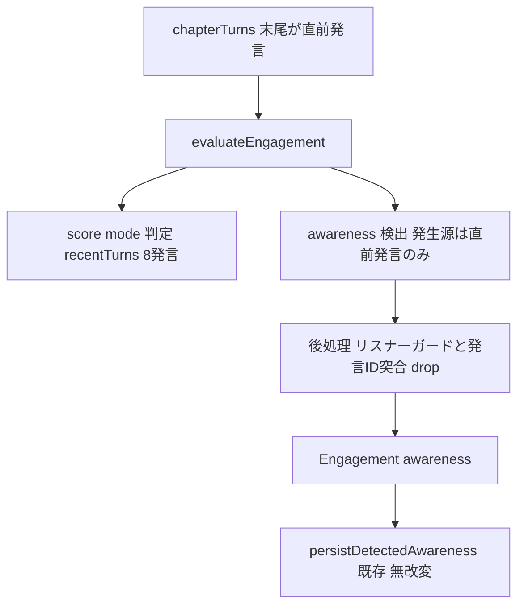

# Technical Design: awareness-last-utterance-only

## Overview

**Purpose**: 討論中の気づき（awareness）の**発生源を「直前の発言（提示会話の最後の1発言）」のみ**に限定し、いま聞いたばかりの一発言への反応として気づきを記録する。

**Users**: 討論パイプライン（傾聴段階＝engagement評価）が本制約に従い、運用者・閲覧者に提示される気づきの質（因果の鮮度・重複の排除）が改善される。

**Impact**: 現状、気づきは `evaluateEngagement` が score/mode 評価と共有する直近8発言（`recentTurns`）のいずれからも発生し得る。本変更で、気づきの発生源を末尾1発言に限定し、reception の帰属を直前発言の話者へ決定的に固定する。score/mode 評価のウィンドウ・基準、および永続・可視化・発言消費の各経路は変更しない。

### Goals
- 気づきの発生源を直前の1発言のみに限定する（Req1）。
- 直前発言の話者自身からは気づきを発生させない（リスナー限定、追加LLM評価なし）（Req2）。
- reception の帰属先を直前発言の話者に一致させる（Req3）。
- score/mode 評価・既存の気づき抑制・追加コストゼロを維持する（Req4）。

### Non-Goals
- score/mode が参照する会話ウィンドウ（`recentTurns` = 直近8発言）の変更。
- 気づきの永続・巻き戻し・発言生成での消費、可視化仕様の変更（`belief-awareness-remodel` の資産をそのまま使用）。
- reception/self の意味の再定義、および信念モデル（固定初期信念＋追記列）の構造変更。

## Boundary Commitments

### This Spec Owns
- `evaluateEngagement` における気づき検出の**発生源スコープ**（直前発言のみ）。
- 気づき後処理のうち、リスナー限定ガードと reception 帰属正規化。
- 上記に対応する `awarenessDetectionNote`（気づき検出指示）の文言。

### Out of Boundary
- score/mode の評価ロジック・スコア基準・`recentTurns` ウィンドウ。
- 気づきの永続（`appendAwareness`）・巻き戻し（`rollbackAwarenessesForRemovedTurns`）・発言消費（`generateTurn` / `formatAwarenessSection`）。
- 話者選択・介入・キュー投入の判定、および気づきの可視化（管理画面）。

### Allowed Dependencies
- 上流 `belief-awareness-remodel` が定義した `AwarenessEvent` / `AwarenessForFirestore` 型、`Engagement.awareness` 契約、永続・消費経路。
- `evaluateEngagement` に渡る `turns`（末尾が直前の発言）。

### Revalidation Triggers
- `Engagement.awareness` の形（`kind` / `content` / `sourcePersonaId`）が変わる場合。
- 気づき検出を engagement 評価から分離する（別LLM呼び出し化する）等、呼び出し構造が変わる場合。
- 直前話者の判定元（`turns` 末尾 vs `state.lastSpeakerId`）が変わる場合。

## Architecture

### Existing Architecture Analysis
- 気づき検出は `evaluateEngagement`（[persona-agent.ts:377](../../../functions/src/agents/persona-agent.ts#L377)）内で score/mode 判定と**同一の1回の `generateObject` 呼び出し**に相乗りしている。入力は `recentTurns = turns.slice(-8)`。
- 一括評価 `evaluateEngagements`（[engagement.ts:101](../../../functions/src/pipeline/debate/engagement.ts#L101)）は `assessTargets` で直前話者（`state.lastSpeakerId`）を除外するため、通常フローでは話者自身は気づき検出されない。フォールバック `evaluateEngagementWithFallback` は指名話者を個別評価する（端ケースで直前話者が対象になり得る）。
- 検出された気づきは同一 persona 参照へ追記され、同ターンの発言生成へ即反映される（[awareness-same-turn.test.ts](../../../functions/src/tests/pipeline/debate/awareness-same-turn.test.ts)）。この結合は維持する。

### Architecture Pattern & Boundary Map



**Architecture Integration**:
- Selected pattern: 既存関数への**挙動制約の内挿**（プロンプト＋後処理）。新規コンポーネント・レイヤは追加しない。
- Domain/feature boundaries: 変更は `evaluateEngagement` の気づき検出部のみ。score/mode 判定部・永続部・消費部とはコード上分節したまま。
- Existing patterns preserved: 気づきの1回相乗り評価、同一 persona 参照による同ターン反映、self の `sourcePersonaId=null` 正規化。
- New components rationale: 新規コンポーネントなし（Extension）。
- Steering compliance: 過度な共通化・中央ディスパッチャを作らない方針に沿い、処理を該当関数へ素直に閉じ込める。

### Technology Stack

| Layer | Choice / Version | Role in Feature | Notes |
|-------|------------------|-----------------|-------|
| Backend / Services | Firebase Functions (TypeScript), Vercel AI SDK `generateObject` | `evaluateEngagement` の気づき検出プロンプトと後処理 | 依存の追加・更新なし |
| Data / Storage | Firestore `topics/{topicId}/personas/{personaId}.awarenesses` | 既存の永続先（無改変） | スキーマ変更なし |

## File Structure Plan

### Modified Files
- `functions/src/agents/persona-agent.ts` — `evaluateEngagement` の (1) `awarenessDetectionNote` を発生源＝直前発言のみ＋`sourceTurnId` 申告に書き換え、(2) engagement 用会話提示に発言識別子を付与、(3) `engagementSchema.awareness` を `sourcePersonaId` 申告から `sourceTurnId` へ差し替え、(4) 後処理にリスナー限定ガードと発言ID突合（一致→採用＋話者導出／不一致→drop）を追加。
- `functions/src/tests/pipeline/debate/awareness.test.ts` / `awareness-same-turn.test.ts` / `engagement.test.ts` — ID突合の採用・drop、リスナーガード、ファシリテーター端ケース、score/mode 不変のケース追加。

> 新規ファイル・永続型・永続経路の変更はない（`sourceTurnId` は engagement 内の一時値で `AwarenessEvent`／Firestore には出ない）。

## Requirements Traceability

| Requirement | Summary | Components | Interfaces | Flows |
|-------------|---------|------------|------------|-------|
| 1.1 | 発生源を直前発言のみに判定 | evaluateEngagement（検出指示＋ID突合） | `awarenessDetectionNote` / `sourceTurnId` 突合 | 気づき検出・後処理 |
| 1.2 | 直前より前のターンを発生源にしない | evaluateEngagement（ID突合で drop） | `sourceTurnId ≠ 直前発言ID → null` | 後処理 |
| 1.3 | 過去ターンは文脈にとどめる | evaluateEngagement（`recentTurns` 温存＋指示） | `recentTurns` 提示 | 気づき検出 |
| 2.1 | 話者自身なら気づきなし | evaluateEngagement（後処理ガード） | リスナー限定ガード | 後処理 |
| 2.2 | 気づきはリスナーのみに発生 | evaluateEngagements（既存除外）＋ガード | `assessTargets` / ガード | 傾聴評価 |
| 2.3 | 話者向け追加LLM評価を設けない | 設計方針（1回相乗り維持） | — | — |
| 3.1 | reception source＝直前話者（発言から導出） | evaluateEngagement（ID突合後に導出） | `sourcePersonaId := 直前ターン話者` | 後処理 |
| 3.2 | self は source なし（null） | evaluateEngagement（既存正規化） | 既存 self 正規化 | 後処理 |
| 4.1 | score/mode 不変 | evaluateEngagement（判定部・ウィンドウ温存） | `recentTurns` / スコア基準 | score/mode 判定 |
| 4.2 | 既存抑制の維持 | evaluateEngagement（検出指示） | 抑制文（同意・言い換え・既出） | 気づき検出 |
| 4.3 | 大半は null | evaluateEngagement（検出指示） | 厳格閾値の指示 | 気づき検出 |

## Components and Interfaces

| Component | Domain/Layer | Intent | Req Coverage | Key Dependencies (P0/P1) | Contracts |
|-----------|--------------|--------|--------------|--------------------------|-----------|
| evaluateEngagement | AI Pipeline / 傾聴 | 気づき検出の発生源を直前発言に限定し、発言ID突合で帰属確定・過去ターン由来を drop | 1, 2, 3, 4 | turns 末尾＝直前発言 (P0)、Engagement.awareness 契約 (P0) | Service, State |

### AI Pipeline / 傾聴

#### evaluateEngagement（変更）

| Field | Detail |
|-------|--------|
| Intent | score/mode 評価に相乗りする気づき検出の発生源を直前発言のみに限定し、リスナー限定・発言ID突合による帰属確定と過去ターン由来の drop を後処理で確定する |
| Requirements | 1.1, 1.2, 1.3, 2.1, 2.2, 2.3, 3.1, 3.2, 4.1, 4.2, 4.3 |

**Responsibilities & Constraints**
- 気づきの発生源は `turns` 末尾の1発言（直前の発言）のみ。それ以前の `recentTurns` は score/mode の文脈および直前発言の理解のためだけに提示する（1.1–1.3）。
- 直前発言の話者が評価対象ペルソナ自身の場合、気づきを `null` にする（2.1）。追加のLLM評価は行わない（2.3）。
- reception は LLM 申告の `sourceTurnId` を直前発言IDと突合し、一致時のみ採用して `sourcePersonaId` を直前ターンの `personaId ?? null` から導出、不一致（過去ターン由来）は null で drop する（1.2, 3.1、ファシリテーター直前時は null）。self は従来どおり `null`（3.2）。
- score/mode の判定・スコア基準・`recentTurns`（8）ウィンドウ・既存抑制文は変更しない（4.1–4.3）。

**Dependencies**
- Inbound: `evaluateEngagements` / `evaluateEngagementWithFallback` — 傾聴評価の呼び出し元（P0）
- Outbound: `generateObject`（Vercel AI SDK）— score/mode＋awareness の単一評価（P0）
- External: Firestore（永続は呼び出し元 `persistDetectedAwareness` が実施、本関数は awareness を返すのみ）（P1）

**Contracts**: Service [x] / API [ ] / Event [ ] / Batch [ ] / State [x]

##### Service Interface
```typescript
// 公開シグネチャは不変。awareness 検出の発生源スコープ・LLM出力・後処理を変更する。
const evaluateEngagement: (
  persona: Persona,
  turns: DebateTurn[],
  otherPersonaNames?: string[],
  personas?: ReadonlyArray<Persona>
) => Promise<Engagement>;

// engagementSchema.awareness（LLM出力・内部）：sourcePersonaId の申告を廃し、
// 反応した発言の識別子 sourceTurnId を出力させる。ペルソナは突合後にコードで導出する。
interface AwarenessDetectionOutput {
  kind: 'reception' | 'self';
  content: string;
  sourceTurnId: string | null; // reception が反応した発言のID（self は null 可）。検証用の一時値
}

// Engagement.awareness（downstream 契約は不変）。sourceTurnId は永続・伝播しない。
interface AwarenessEvent {
  kind: 'reception' | 'self';
  content: string;
  sourcePersonaId: string | null;
}
```
- Preconditions: `turns` の末尾要素が直前の発言。空配列の場合は発生源なし。
- Postconditions:
  - `kind==='reception'` は、LLM 申告の `sourceTurnId` が直前発言（`turns` 末尾）のIDと**一致する場合のみ採用**し、その `sourcePersonaId` を直前ターンの `personaId ?? null` から導出する（1.1, 3.1）。
  - `kind==='reception'` で `sourceTurnId` が直前発言のIDと**不一致**（過去ターン由来）なら `awareness === null`（1.2 をコードで強制）。
  - 直前ターンの `personaId === persona.id` のとき `awareness === null`（2.1）。
  - `kind==='self'` のとき `sourcePersonaId === null`（`sourceTurnId` は無視、3.2）。
  - `score`/`mode`/`intentSummary` は本変更で挙動不変（4.1）。
- Invariants: 気づき検出は score/mode と同一の単一 `generateObject` 呼び出しに相乗り（追加呼び出しなし）。`sourceTurnId` は evaluateEngagement 内で消費され、`AwarenessEvent` へは伝播しない。

##### State Management
- State model: 返り値 `Engagement.awareness`。永続は呼び出し元が既存経路で実施（本関数は状態を持たない）。
- Persistence & consistency: 変更なし（`persistDetectedAwareness` → `appendAwareness`）。
- Concurrency strategy: 変更なし。

**Implementation Notes**
- Integration:
  - `awarenessDetectionNote` を「発生源＝提示会話の最後の1発言（直前の発言）のみ。それ以前は文脈で、発生源にしない。reception のとき `sourceTurnId` に反応した発言の識別子を記す」に改訂。
  - 傾聴プロンプトの会話提示に**発言単位の識別子**を出す（`generateTurn` と共有の `formatTurns` は変更せず、engagement 側の整形でのみ付与）。nanoid の転記ミスを避けるため、実 `turnId` ではなく**ウィンドウ内ローカル序数**（各行に番号、末尾＝直前）を提示し、序数→`turnId` をコードで解決する実装を可とする（impl 詳細、いずれでも Postconditions は同一）。
- Validation（後処理・純ローカル整形）:
  - (a) 直前ターンの話者＝評価対象なら awareness を null（2.1 ガード）。
  - (b) reception は `sourceTurnId` を直前発言IDと突合し、不一致なら null で drop（1.2）。一致時のみ採用し `sourcePersonaId` を直前ターン話者から導出（3.1）。
  - (c) self は `sourcePersonaId=null`（既存踏襲、3.2）。
- Risks: 「反応が本当に直前発言か」の**意味判断**自体は依然プロンプト依存だが、話者粒度でなく発言粒度で突合するため、同一話者の過去発言への反応も検出・drop できる。残余（LLM が直前発言IDを誤申告）はテストで監視。

## Error Handling

### Error Strategy
- 本関数は既存どおり `try/catch` で失敗時 `{ score: 1, mode: 'none' }`（awareness なし）を返し、討論継続を優先する（Fail-safe）。本変更はこの既存挙動を保つ。
- 後処理のガード・発言ID突合・drop は純粋なローカル整形で外部I/Oを伴わず、新たな失敗経路を追加しない。

### Monitoring
- 既存の `persistDetectedAwareness` の失敗ログ（`[awareness] append failed`）を踏襲。追加のログは設けない。

## Testing Strategy

### Unit Tests
- reception で `sourceTurnId` が直前発言IDと一致するとき、採用され `sourcePersonaId` が直前話者IDへ導出される（1.1, 3.1）。
- reception で `sourceTurnId` が**直前より前の発言**（同一話者が直前と過去の両方に登場するケースを含む）を指すとき、awareness が `null` で drop される（1.2）。
- 直前発言が評価対象ペルソナ自身のとき、awareness が `null` になる（2.1）。
- 直前発言がファシリテーター（`personaId` なし）のとき、reception 採用時に `sourcePersonaId` が `null` になり、リスナーは気づきを得られる（3.1 端ケース）。
- self 検出時に `sourcePersonaId` が `null` のまま維持される（`sourceTurnId` は無視、3.2）。
- 同一の LLM 出力に対し `score`/`mode`/`intentSummary` の解決が本変更前後で不変（4.1、後処理が score/mode 経路を触らないことの確認。LLM はモックのため実挙動の非干渉ではなく字義的不変を検証）。

> 4.1 の「非干渉」は、score/mode の**指示文・スコア基準・`recentTurns` ウィンドウを字義的に不変**に保ち差分を `awarenessDetectionNote` に限定することで担保する。同一プロンプト相乗りゆえ実 LLM の score/mode 出力への影響は単体テストで保証しきれないため、実挙動は討論出力のスポット確認で見る。

### Integration Tests
- `awareness-same-turn.test.ts` の同ターン反映（傾聴→永続→消費）が維持される（永続・消費経路の無改変確認）。
- `evaluateEngagements` 経由で直前話者が対象外のまま、リスナーのみ気づきが永続される（2.2）。
