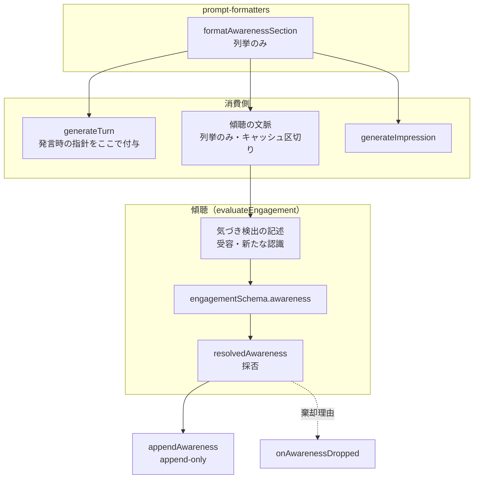
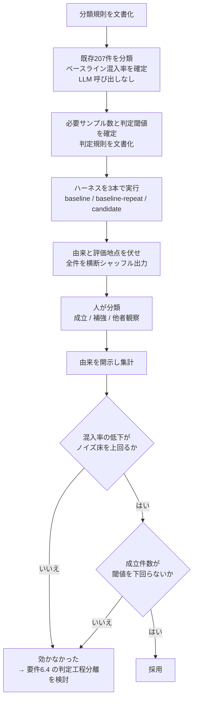

# Technical Design: awareness-position-change-enforcement

## Overview

**Purpose**: 気づき（awareness）の記録対象から「自説の補強」と「他者の変化の観察」を除外し、公開・可視化される気づきを、その人が討論を通じて受け取ったものだけで構成する。

**Users**: 記事の閲覧者が公開ページで気づきを読み、運用者が管理画面で討論の質を確認する。

**Impact**: 検出の枠組みを置き換えモデル（立場が別の状態へ動いたとき）から受容・新たな認識モデルへ改める。あわせて、発言のための指示が傾聴の呼び出しに混入している構造を解消し、発言時の「立場を反転させない」制約を撤回する。記録件数は2〜3割程度減る見込みで、公開表示のバッジ数と章編集の保護ターンが連動して減る。

### Goals

- 補強・他者観察を気づきから除外する（要件 1.4・1.5）
- 検出の枠組みを信念固定＋追記のアーキテクチャと一致させる（要件 2）
- 発言のための指示を傾聴の文脈から構造的に排除する（要件 3.3）
- 効果を、判定者のバイアスに耐える手続きで測る（要件 6）

### Non-Goals

- 気づきの件数上限・保持数の設計
- 所感生成での気づきの選別
- 独立した判定呼び出しの導入（第一段階では行わない。要件 5.5・6.4）
- コスト削減（件数減少に伴う副次的な低下は成功判定に用いない）

## Boundary Commitments

### This Spec Owns

- 気づきとして**記録する対象の定義**と、その担保（検出プロンプトの記述）
- 気づき節の整形が返す内容の責務範囲（列挙のみか、指示を含むか）
- 記録しなかった件数と理由の観測手段
- 効果判定の手続き（測定軸・ノイズ床・盲検・事前規則）

### Out of Boundary

- 気づきの発生源の限定（`awareness-last-utterance-only` が所有・維持する）
- 気づきの永続形・append-only・帰属・巻き戻し（`belief-awareness-remodel` が所有・維持する）
- 発言意欲（score / mode / intentSummary）の基準と使われ方
- 公開ページ・管理画面の表示仕様
- 章編集の保護条件そのもの（`computeProtectedTurnIds` のロジックは変更しない）

### Allowed Dependencies

- `utils/prompt-formatters.ts` の整形関数
- `constants/writing-style.constants.ts`（`NOTE_STYLE`）
- 既存の検証ハーネス `pipeline/debate/verify-engagement-model.ts`
- 既存の点検スクリプト `scripts/inspect-awareness.ts`

### Revalidation Triggers

- 気づき節整形の戻り値の意味が変わる（列挙のみ ↔ 指示を含む）→ 発言生成・傾聴・所感の全消費側が再確認を要する
- 傾聴側のキャッシュ区切りに載る内容が変わる → コスト実測の前提が変わる
- 記録対象の定義が変わる → 公開表示の件数水準・章編集の保護範囲が変わる

## Architecture

### Existing Architecture Analysis

現行は、気づきの検出・採否・整形が以下の位置に分散している。

- **検出**: `evaluateEngagement` の `awarenessDetectionNote`（プロンプト）と `engagementSchema.awareness`（スキーマ）
- **採否**: 同関数内の `resolvedAwareness`。空内容・話者自身・`sourceTurnId` 不一致で棄却し、`onAwarenessDropped` で理由を通知
- **整形**: `formatAwarenessSection`。**発言用の指示文を含んだまま**、発言生成・傾聴・（所感は別経路）へ渡る

本設計は検出と整形の2箇所のみを変更し、採否の枠組み（発言ID突合・リスナー限定ガード）と永続経路には手を入れない。

### Architecture Pattern & Boundary Map



**Architecture Integration**

- **選択したパターン**: 整形の単一責務化＋用途指示の呼び出し側配置（research.md Decision 1 / Option A-2）
- **境界の分離**: 「気づきを列挙する」責務と「その気づきをどう扱わせるか」の責務を分ける。後者は呼び出しごとに異なるため、呼び出し側が持つ
- **維持する既存パターン**: 発言ID突合、リスナー限定ガード、append-only、`onAwarenessDropped` による棄却の可視化
- **steering 準拠**: 気づきは変化の軌跡そのものであり成果物であるという `product.md` の位置づけを前提に、記録対象の定義のみを絞る

### Technology Stack & Alignment

| Layer | Choice | Role in Feature | Notes |
|---|---|---|---|
| Backend / Services | TypeScript (Firebase Functions) | 検出プロンプト・整形・採否 | 新規依存なし |
| LLM | Claude Sonnet 5（既定） | 気づき検出（意欲評価に相乗り） | 呼び出し回数は不変（要件 5.5） |
| Data / Storage | Firestore `topics/{id}/personas/{id}.awarenesses` | 永続形は不変 | 過去データとの互換を維持（要件 5.4） |
| 検証 | 既存ハーネス＋点検スクリプト | 効果判定 | 新経路を作らない（要件 6.2） |

## File Structure Plan

### Modified Files

- `functions/src/utils/prompt-formatters.ts` — `formatAwarenessSection` を列挙のみに変更。用途依存の指示文を除去
- `functions/src/agents/persona-agent.ts` — ①`awarenessDetectionNote` の全面書き換え ②`generateTurn` に発言時の気づき指針を配置（「反転させない」を含めない）③`onAwarenessDropped` の理由に記録対象外の判定を追加
- `functions/src/pipeline/debate/verify-engagement-model.ts` — 盲検出力モードの追加
- `functions/src/scripts/inspect-awareness.ts` — ベースライン確定のための全文出力（既存207件を分類規則で人が分類する材料。自動分類はしない）
- `functions/src/tests/agents/persona-agent.test.ts` — 2件を新しい意図の固定へ差し替え
- `functions/src/tests/utils/prompt-formatters.test.ts` — 1件を列挙のみの固定へ差し替え

新規ファイルは作らない。

## System Flows

### 効果判定の手続き



規則の文書化を実行より前に置くのは、結果に合わせて基準が動くことを防ぐためである。

**ベースライン混入率の確定を最初に置く理由**: 必要サンプル数は「判別したい差」から決まり、その差はベースラインの実測値なしには決められない。既存トピックには分類可能な気づきが207件あり、これは LLM 呼び出しなしで分類できる。ここを飛ばして仮の数値で規模を決めると、実際には効いているのに判別できない結果になり、判定規則により「効かなかった」へ誤って倒れる。

分岐が「効いた」に倒れる条件を2つとも満たす場合に限定するのは、曖昧な結果を採用すると次に問題が起きたときの切り分けができなくなるためである。

## Requirements Traceability

| Requirement | Summary | Components | Flows |
|---|---|---|---|
| 1.1・1.2・1.3 | 受容・新たな認識を記録する | 気づき検出の記述 | — |
| 1.4 | 補強を記録しない | 気づき検出の記述 | — |
| 1.5 | 他者の変化の観察を記録しない | 気づき検出の記述 | — |
| 2.1・2.2 | 置き換えを要件としない／信念固定＋追記に合わせる | 気づき検出の記述 | — |
| 2.3 | 言い回しの禁止をやめ内容で定める | 気づき検出の記述 | — |
| 3.1 | 発言時の非反転制約を撤回 | 発言時の気づき指針 | — |
| 3.2 | 初期信念の固定は維持 | （変更なし・system プロンプト） | — |
| 3.3 | 発言指示を傾聴の文脈に含めない | 気づき節整形 | — |
| 4.1・4.2 | 棄却理由の記録と集計 | 採否（`onAwarenessDropped`） | — |
| 5.1〜5.5 | 既存保証との非干渉 | （変更しない範囲の明示） | — |
| 6.1〜6.4 | 効果の検証 | 盲検評価 | 効果判定の手続き |

## Components and Interfaces

| Component | Layer | Intent | Req | Contracts |
|---|---|---|---|---|
| 気づき節整形 | utils | 気づきを列挙する（用途中立） | 3.3 | Service |
| 気づき検出の記述 | agents（プロンプト） | 記録対象の定義を述べる | 1.1〜1.5, 2.1〜2.3 | — |
| 発言時の気づき指針 | agents（プロンプト） | 発言で気づきをどう扱うかを述べる | 3.1 | — |
| 採否 | agents | 棄却と理由の通知 | 4.1 | Service |
| 盲検評価 | 検証ハーネス | 由来を伏せた分類材料の出力 | 6.1〜6.3 | Batch |

### utils

#### 気づき節整形（`formatAwarenessSection`）

| Field | Detail |
|---|---|
| Intent | ペルソナの気づきを、用途に依存しない形で列挙する |
| Requirements | 3.3 |

**Responsibilities & Constraints**

- 気づきの見出しと各件の列挙のみを返す
- 「どう扱うか」「どう発言するか」を含めない
- 気づきが無ければ空文字（現行どおり）

**Dependencies**

- Inbound: `generateTurn` / `evaluateEngagement` / （所感は別経路で列挙） — 気づきの提示（P0）

##### Service Interface

```typescript
const formatAwarenessSection: (
  awarenesses?: ReadonlyArray<AwarenessForFirestore>
) => string;
```

- Preconditions: なし
- Postconditions: 戻り値に発言・傾聴いずれの指示も含まれない
- Invariants: 件数が0なら空文字

**Implementation Note**: 傾聴側ではこの戻り値がプロンプトキャッシュの区切りに載る。列挙のみに純化することで、指示文の改訂がキャッシュを無効化しなくなる。

### agents（プロンプト）

#### 気づき検出の記述（`awarenessDetectionNote`）

| Field | Detail |
|---|---|
| Intent | 何を気づきとして記録し、何を記録しないかを述べる |
| Requirements | 1.1〜1.5, 2.1〜2.3 |

**Responsibilities & Constraints**

- 枠組みを `product.md` の語彙に合わせる：**他者の視点の受容**と**新たな認識**
- 立場が別の状態へ置き換わることを記録の要件としない（要件 2.1）
- 初期信念を固定した主軸としたうえで、そこに追記される変化として述べる（要件 2.2）
- 記録しない対象を**内容で**定義する（要件 2.3）
  - 元の考えを裏付け・補強しただけのもの
  - 動いたのが他の参加者であり、自分の中に何も入っていないもの
- 特定の言い回し（「改めて」「やはり」「再確認」等）の禁止は置かない
- 発生源が直前発言のみであること、`sourceTurnId` に序数を記すことは現行どおり維持する
- 文体は `NOTE_STYLE` を引き続き用いる

**現行から撤去する記述**

| 撤去対象 | 理由 |
|---|---|
| 「結論・立場そのものが以前と別の場所に動いたとき」 | 置き換えモデル。信念固定＋追記と不整合（要件 2.1） |
| 「立場を変える新しい論点を採り入れた」 | 同上 |
| 自己点検の言い回し列挙（「改めて」「やはり」「再確認」「深く理解した／腹落ちした」） | 実測で禁止語一致 4.8%。回避され、正当な表現まで狭める（要件 2.3） |

#### 発言時の気づき指針（`generateTurn` 内）

| Field | Detail |
|---|---|
| Intent | 蓄積された気づきを発言でどう扱うかを述べる |
| Requirements | 3.1 |

**Responsibilities & Constraints**

- 気づきを踏まえた結果として立場が変わることを禁じない
- 初期信念を固定した参照資料として保つことは述べてよい（要件 3.2）
- 現行の「立場を反転させない範囲で」に相当する制約を置かない

#### 採否（`resolvedAwareness` / `onAwarenessDropped`）

| Field | Detail |
|---|---|
| Intent | 記録しない判断と、その理由の通知 |
| Requirements | 4.1・4.2, 5.1 |

**Responsibilities & Constraints**

- 既存の棄却（空内容 / 話者自身 / `sourceTurnId` 不一致）は変更しない
- 第一段階では、補強・他者観察の判断はモデル側に委ねるため、この層に新しい棄却条件を追加しない
- 棄却理由は既存の識別子で通知し、集計可能な形を維持する

##### Service Interface

```typescript
type AwarenessDropReason = 'source-mismatch' | 'listener-is-speaker' | 'empty-content';

type EvaluateEngagementOptions = {
  onAwarenessDropped?: (reason: AwarenessDropReason) => void;
};
```

- Invariants: 棄却時は必ず理由が1つ通知される

### 検証

#### 盲検評価（`verify-engagement-model.ts`）

| Field | Detail |
|---|---|
| Intent | 3本の試行を、由来を伏せた形で分類材料として出力する |
| Requirements | 6.1〜6.3 |

**Responsibilities & Constraints**

- 既存の `--compare` の枠組みに、記録対象の定義を変数とする比較を追加する
- 出力は**気づき本文のみ**とし、試行の由来に加えて**評価地点を特定できる情報（ペルソナ名・章・ターン位置）も含めない**
- 全件を評価地点をまたいで完全にシャッフルする
- 由来の対応表は別ファイルに出し、分類完了後に突き合わせる
- 分類そのものは行わない（機械判定しない・要件 6.3）

**評価地点を伏せる理由**: 3本は同一入力で走るため、1つの評価地点から最大3件の気づきが出る。同一地点由来の3件が識別できると「これは同じ地点の3バリアント」と分かり、そこから改修後の推測が始まる。盲検は判定者と提案者が同一であることへの唯一の手当てであり、部分的にでも破れると設計の安全装置が働かない。

##### Batch Contract

| 出力 | 内容 |
|---|---|
| 分類用ファイル | 全件を横断シャッフルした気づき本文の一覧（由来・評価地点なし・通し番号のみ） |
| 対応表ファイル | 通し番号 → 試行の由来・評価地点 |
| 集計 | 分類結果を入力すると、試行別の混入率・成立件数を出す |

## 効果判定の規則（実行前に固定する）

### 分類規則

各気づきを3分類する。判断は本文のみで行い、どの試行由来かは見ない。

| 分類 | 定義 | 実データの例 |
|---|---|---|
| 成立 | 他者の視点を受容した、または新たな認識が入った。立場の変化を伴わなくてよい | 「価格を据え置けばリスク回避できると考えていたが、事務作業は価格に関係なく発生すると気づいた」／「軽減税率導入時にも補助金があったのだと気づいた」 |
| 補強 | 元の考えの裏付けが増えただけ。自分の中に新しいものが入っていない | 「給付の方が確実に届くという確信が固まった」／「自分の主張と完全に一致していることを確認した」 |
| 他者観察 | 動いたのが他の参加者。自分の中では何も起きていない | 「与党側からも制度の欠陥への自覚が引き出された」 |

### 測定軸

| 軸 | 定義 | 期待する向き |
|---|---|---|
| 混入率 | （補強＋他者観察）÷ 検出件数 | 下がる |
| 成立件数 | 成立 ÷ 評価地点 | 維持される |

混入率のみを見ると、検出が萎縮して何も出なくなった状態を成功と誤判定する。成立件数を第2軸に据えるのはこのためである。

### ベースラインの確定（実行前・LLM 呼び出しなし）

判定規則の閾値と必要サンプル数は、ベースラインの実測なしには決められない。分類規則を固めた直後、既存トピックに永続済みの気づき **207件**（`inspect-awareness.ts` で全文を取得できる）を同じ分類規則で分類し、以下を確定する。

| 確定するもの | 用途 |
|---|---|
| ベースラインの混入率 | 「判別したい差」を決める。必要サンプル数がここから決まる |
| 成立件数の水準（評価地点あたり） | 判定規則2項の閾値の基準 |

改修前の目視（n=12）では混入率を約30%と見積もったが、これは分類規則を固める前の粗い読みであり、その後「単に新しく知ったこと」を成立側に含める判断（要件 1.3）が入っている。**実際のベースラインは20%を下回る可能性があり、その場合は必要サンプル数が倍近くに増える。**

### 判定規則

1. ノイズ床 = baseline 2本の間の混入率の差
2. **採用条件**: candidate の混入率の低下がノイズ床を上回り、**かつ** candidate の成立件数（評価地点あたり）が baseline 2本の平均に対して所定の割合を下回らない
   - 割合の具体値はベースライン確定時に決める。baseline 2本の成立件数のばらつきを見て、その揺れを超える低下だけを検出できる水準に置く
   - **「baseline 2本の範囲内」という書き方は用いない。** 2点の範囲は引きによって極端に広くも狭くもなり、同じ改修が採用にも不採用にもなる。検出の萎縮（Haiku 検証で実際に起きた失敗モード）を捕まえる唯一の軸なので、規則が引きに左右されてはならない
3. 上記を満たさない場合は「効かなかった」として扱い、要件 6.4 に従い判定工程の分離を検討する
4. 判別できない差は 3 に倒す。判別可能な差の下限はベースライン確定時に算出する

### 規模

分類対象は検出された気づき（検出率約33%）であるため、評価地点はその約3倍を要する。**下表はベースライン混入率を30%と仮置きした場合の目安であり、確定値で再計算する。**

| 判別したい差 | 分類件数/本 | 評価地点/本 | 3本の実費 |
|---|---|---|---|
| 混入率 30% → 10% | 約40件 | 約120地点 | 約 $5.5 |

## Error Handling

- 気づき検出の失敗（スキーマ不一致・API エラー）は現行どおり `evaluateEngagement` の catch で `score 1 / mode none` を返し、討論を止めない
- 棄却は失敗ではない。理由を通知したうえで気づきなしとして続行する
- 盲検出力の生成失敗は検証手続きの中断であり、本番経路に影響しない

## Testing Strategy

### 差し替えるテスト

| 対象 | 現行が固定している内容 | 新しく固定する意図 |
|---|---|---|
| `persona-agent.test.ts`（検出プロンプト） | 「結論・立場」「再確認」「改めて/やはり」を含む | 受容・新たな認識の枠組みであること。置き換えを要件としないこと。言い回しの禁止列挙を含まないこと |
| `persona-agent.test.ts`（発言時の注入） | 「立場反転しない旨」を注入する | 気づきを注入すること。非反転の制約を含めないこと |
| `prompt-formatters.test.ts` | 気づき節が「信念」を含む | 気づき節が列挙のみであること（発言・傾聴いずれの指示も含まない） |

### 維持するテスト

- 発言ID突合による採用・棄却（`awareness-last-utterance-only` 由来）
- リスナー限定ガード
- append-only・巻き戻し
- 同一ターン内の気づき反映（`awareness-same-turn`）
- 傾聴側の気づき節がキャッシュ区切りの独立パートであること

### 盲検の成立を固定するテスト

盲検は本設計の安全装置であり、実装の不備で静かに破れると効果判定そのものが無効になる。以下を固定する。

- 分類用ファイルに試行の由来が含まれないこと
- 分類用ファイルに評価地点を特定できる情報（ペルソナ名・章・ターン位置）が含まれないこと
- 同一評価地点から出た複数件が、出力上で隣接・連番にならないこと（横断シャッフルが効いていること）

### 検証（機械判定しない部分）

効果判定は上記「効果判定の規則」に従い、人が全文を読んで行う。テストで固定するのは手続きが成立すること（上記の盲検条件）までとする。

## Security Considerations

本改修はプロンプトの記述と整形の責務範囲のみを変更し、認証・データアクセス・外部公開範囲に影響しない。気づきの永続先・読み取り経路・公開ページの表示条件はいずれも変更しない。
