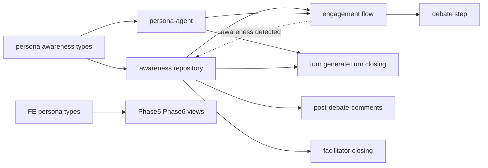
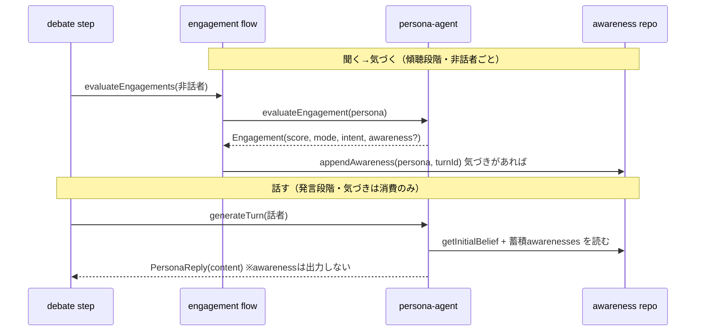

# 技術設計: belief-awareness-remodel

## Overview

**Purpose**: 討論におけるペルソナの信念の扱いを「固定の初期信念＋気づき（awareness）の非破壊追記」へ進化させ、より自然で良い討論モデルにする。**Users**: 閲覧者（多様な立場と気づきの軌跡を読む）・運用者/管理者（生成結果の確認）。**Impact**: 現状の破壊的な信念上書き（`applyBeliefChange` による `beliefs[]` の版更新）を廃し、初期信念を不変とし、討論中の気づきを別配列 `awarenesses[]` に追記する。気づきは「聞く→気づく→話す」に沿い、傾聴（engagement評価）で検出し、発言（generateTurn）で消費する。

本仕様は討論**モデルの品質改善**が主題であり、コスト・効率化・キャッシュは扱わない（下流 `debate-llm-cost-reduction` が本仕様の安定コンテキストに依存して担当）。**改修前の出力との一致は求めない**。

### Goals
- 初期信念を不変とし、気づきを非破壊・追記で管理する（1.x, 2.x）。
- 「聞く→気づく→話す」：傾聴段階で気づきを検出、発言で消費（3.x）。
- 見解を「初期信念＋気づき」から都度導出し、最終信念を永続しない（4.x）。
- 気づきの軌跡を管理画面で可視化する（5.x）。

### Non-Goals
- プロンプトキャッシュ・usage計測・コスト効率化（`debate-llm-cost-reduction`）。
- 話者選択・介入・キュー投入・章立ての判定基準の変更（score/mode の意味は不変）。
- 気づきの横断集約による「創発的アイデア」合成（将来別spec）。
- interview の初期信念**生成方法**の変更、既存データの移行（クリア・再生成）。

## Boundary Commitments

### This Spec Owns
- ペルソナ信念モデルの型・永続・生成・導出・可視化（固定初期信念＋`awarenesses`）。
- 傾聴段階での気づき検出と発言での消費の流れ、気づきの帰属・非破壊・巻き戻し。

### Out of Boundary
- キャッシュ・計測・トグル・効率化（下流spec）。
- engagement スコア（score/mode）の意味・話者選択での使われ方（不変を保証）。
- interview が生成する初期信念の内容、公開ページ表示。

### Allowed Dependencies
- Firestore（persona ドキュメント）、`prompt-formatters`、`debate.constants`、既存 `getPersonaModel`。
- interview の出力 `beliefs[0]`（初期信念）を読取り専用で使用。

### Revalidation Triggers
- `Engagement` 契約変更（`awareness` 追加。score/mode の意味は不変）。
- `executeTurn` 返却／`PersonaReply` からの `beliefChange` 除去。
- persona ドキュメントスキーマ（`beliefs` の意味変更、`awarenesses` 追加）。
- ターンに紐づく信念変化情報 → 気づきベースへの変更（下流の可視化・編集が参照）。

## Architecture

### Existing Architecture Analysis
- 1ターン：engagement評価（[evaluateEngagements](functions/src/pipeline/debate/engagement.ts#L38)）→話者選択→発言生成（[generateTurn](functions/src/agents/persona-agent.ts#L212)）→インラインFC→信念適用（[step.ts:110](functions/src/pipeline/debate/step.ts#L110)）。
- 信念は persona 埋め込み `beliefs: Belief[]`。interview が version 0（初期信念）を書き、討論が上書き版を追記（[belief.ts](functions/src/pipeline/debate/belief.ts)）。可視化3箇所が `changeSummary`/`triggeredByTurnId` を参照。
- **現状は信念変化を「話す」段階（generateTurn 出力）で拾う**。本設計はこれを「聞く」段階（engagement）へ移す。

### Architecture Pattern & Boundary Map



**Architecture Integration**:
- **Selected pattern**: 既存パイプラインの拡張（Extension）。新規ファイルは `awareness.ts`（`belief.ts` を置換）のみ。
- **Dependency direction**: `Types → awareness repo → agents → pipeline(engagement/step/turn/comments)/facilitator → FE`。左方向のみ import。
- **Existing patterns preserved**: `arrayUnion` 追記、restart 巻き戻し、`Result<T,E>`、tests/ ミラー配置、in-memory persona 更新（`applyBeliefChange` と同型）。
- **New component rationale**: `awareness.ts` = 信念変化の非破壊管理を担う単一責務。中央ディスパッチャは作らない。

### Technology Stack

| Layer | Choice / Version | Role in Feature | Notes |
|-------|------------------|-----------------|-------|
| Backend / Services | Firebase Functions v2 (Node 24) | 討論パイプライン | 既存 |
| AI SDK | `ai@6` / `@ai-sdk/anthropic@3` | engagement/発言生成 | 既存、追加なし |
| Data / Storage | Firestore | persona `beliefs`(初期)＋`awarenesses`(追記) | 既存パターン |
| Frontend | SvelteKit 5 (runes) | 気づきの可視化 | 既存管理画面の置換 |

## File Structure Plan

### New Files
```
functions/src/pipeline/debate/
└── awareness.ts   # getInitialBelief / appendAwareness / rollbackAwarenessesForRemovedTurns（belief.ts を置換）
```

### Modified Files
- `functions/src/types/persona.types.ts` — `Belief` を初期信念のみにスリム化、`AwarenessForFirestore` 追加、`Persona.awarenesses?` 追加。
- `functions/src/types/debate.types.ts` / `turn.types.ts` — `BeliefChangeEvent` → `AwarenessEvent`、`Engagement` に `awareness?` 追加、`executeTurn` 返却から `beliefChange` 除去。
- `functions/src/agents/persona-agent.ts` — `buildPersonaSystemPrompt` は最新信念でなく**初期信念**を用いる（不変・主軸）。`evaluateEngagement` の出力に awareness を追加（**傾聴段階で検出**）＋揮発部に既存 awareness を注入。`generateTurn` は `turnOutputSchema` から awareness/beliefChange を除去し awareness を消費のみ。`generatePostDebateComment` は初期信念＋awareness。
- `functions/src/agents/facilitator-agent.ts` — closing の信念要約を「初期信念＋awareness」へ。
- `functions/src/pipeline/debate/engagement.ts` — 評価結果の `awareness` を `appendAwareness` で永続（`evaluateEngagements`／`evaluateEngagementWithFallback` の双方、話者選択の前）。
- `functions/src/pipeline/debate/step.ts` — `applyBeliefChange`（reply由来）を除去。
- `functions/src/pipeline/debate/turn.ts` — closing の `finalBeliefs` を「初期信念＋awareness」へ。`executeTurn` 返却の `beliefChange` を除去。
- `functions/src/pipeline/debate/post-debate-comments.ts` — `finalBelief` → 初期信念＋awareness 合成。
- `functions/src/utils/prompt-formatters.ts` — `formatAwarenessSection(awarenesses)` 追加（純関数）。
- （FE）`src/lib/models/persona/persona.types.ts` — `BeliefForFirestore` スリム化、`AwarenessForFirestore` 追加、`PersonaForFirestore.awarenesses`。
- （FE）`src/lib/stores/personas.svelte.ts` — `awarenesses[].createdAt` の Date 変換。
- （FE）`Phase5Debate.svelte` / `Phase6Editing.svelte` — 信念変化描画を awareness ベースへ（`triggeredByTurnId` 紐付けは踏襲）。`InterviewItem.svelte` は初期信念表示のまま不変。

**削除**: `functions/src/pipeline/debate/belief.ts`（awareness.ts へ置換、re-export はしない＝import側を直接書換え）。

## System Flows

### 1ターン：聞く→気づく→話す（要件2・3・4）



**Key decisions**:
- **気づきの検出は傾聴段階（engagement）**。話者選択の前に `appendAwareness` で永続し、選ばれた話者の `generateTurn` が最新の気づきを消費できる（3.1–3.3）。非話者も気づける（3.4）。
- **発言生成は awareness を出力しない**（消費のみ）。`generateTurn` の出力から `beliefChange` を除去（3.2）。
- 初期信念は不変・主軸、awareness は「一理ある受容／自己の気づき」として反映するが立場を反転させない（1.1, 2.5）。
- engagement 出力に awareness を足しても score/mode の意味・使われ方は不変（3.5）。

## Requirements Traceability

| Requirement | Summary | Components | Interfaces | Flows |
|-------------|---------|------------|------------|-------|
| 1.1–1.3 | 初期信念の固定・主軸・restart巻き戻し | awareness repo, persona-agent | `getInitialBelief`, `rollbackAwarenessesForRemovedTurns` | 1ターン |
| 2.1–2.5 | 気づきの非破壊追記・種別/由来/ターン・帰属・stance不変 | awareness repo, persona-agent | `AwarenessEvent`, `appendAwareness` | 1ターン |
| 3.1–3.5 | 傾聴検出・発言消費・次発言前反映・非話者・score不変 | persona-agent, engagement flow | `Engagement.awareness`, `formatAwarenessSection` | 1ターン |
| 4.1–4.3 | 見解=初期信念+気づき・最終信念なし | awareness repo, turn, post-comments, facilitator | `getInitialBelief`+`formatAwarenessSection` | — |
| 5.1–5.3 | 気づきの可視化・置換・初期信念維持 | FE persona types/views | State | — |
| 6.1–6.3 | 分離保持・前方互換・クリア | types, awareness repo | `AwarenessForFirestore` | — |
| 7.1–7.3 | 進化としての品質・人格分離・確認手段 | persona-agent | — | — |

## Components and Interfaces

| Component | Layer | Intent | Req | Key Deps (P0/P1) | Contracts |
|-----------|-------|--------|-----|------------------|-----------|
| awareness repo | pipeline | 初期信念取得・気づき追記・巻き戻し | 1,2,4,6 | Firestore (P0) | Service |
| persona-agent（改修） | agents | 初期信念主軸のプロンプト、傾聴でawareness検出／発言で消費 | 1,2,3,4,7 | awareness repo(P0) | Service |
| engagement flow（改修） | pipeline | 評価結果のawarenessを話者選択前に永続 | 3,7 | awareness repo(P0), persona-agent(P0) | Service |
| turn/comments/facilitator（改修） | pipeline/agents | 見解を初期信念+気づきから導出 | 4 | awareness repo(P0) | Service |
| FE persona types/views（改修） | FE | 気づきの型・可視化 | 5,6 | Firestore(P0) | State |

### pipeline/debate / awareness（belief.ts 置換）

#### awareness repository
| Field | Detail |
|-------|--------|
| Intent | 初期信念取得・気づきの非破壊追記・破棄ターン巻き戻し |
| Requirements | 1.1, 1.3, 2.1, 2.3, 4.1, 6.1 |

**Responsibilities & Constraints**
- 初期信念は `beliefs[0]`（interview 出力）。上書きしない。
- `appendAwareness` は `arrayUnion` で `persona.awarenesses` に追記し、**渡された persona オブジェクトの in-memory `awarenesses` も更新**（同一参照が engagement→話者選択→generateTurn へ流れ、直前の気づきが即反映される。既存 `applyBeliefChange` と同型）。
- 破棄ターン巻き戻しは `triggeredByTurnId` でフィルタ（restart）。

**Contracts**: Service [x]

##### Service Interface
```typescript
const getInitialBelief: (persona: Persona) => string; // beliefs[0].content（無ければ ''）

const appendAwareness: (args: {
  topicId: string; persona: Persona; turnId: string; awareness: AwarenessEvent;
}) => Promise<void>; // arrayUnion 追記＋in-memory 更新

const rollbackAwarenessesForRemovedTurns: (
  topicId: string, removedTurnIds: Set<string>
) => Promise<void>; // triggeredByTurnId で巻き戻し
```
- Preconditions: persona ドキュメント存在。`beliefs[0]` が初期信念。
- Postconditions: `awarenesses` に1件追記（`triggeredByTurnId` 付与、5.1 の紐付けを担保）。初期信念は不変（1.1）。
- Invariants: 破壊的上書きを行わない（append-only、2.3）。

**Implementation Notes**
- Integration: engagement flow が呼ぶ。closing/comments は `getInitialBelief`+`formatAwarenessSection`。
- Risks: `applyBeliefChange`/`getLatestBelief`/`rollbackBeliefsForRemovedTurns` の全 import を直接置換（re-export しない）。

### agents / persona-agent（改修）

#### buildPersonaSystemPrompt / evaluateEngagement / generateTurn
| Field | Detail |
|-------|--------|
| Intent | 初期信念を主軸に置き、傾聴で気づきを検出、発言で消費 |
| Requirements | 1.2, 2.1, 2.5, 3.1, 3.2, 3.5, 7.2 |

**Responsibilities & Constraints**
- `buildPersonaSystemPrompt`: 最新信念でなく**初期信念**（`getInitialBelief`）を主軸として system に置く（不変）。
- 揮発部（user）に `formatAwarenessSection(awarenesses)` を注入（engagement/generateTurn/postComment すべて＝気づきを文脈として読む）。
- `evaluateEngagement`（傾聴）: 出力に `awareness?` を追加（**検出**）。フレーミングは「ここまで聞いていて受け止めた／気づいた」。score/mode/intentSummary の意味は不変。
  - **検出面の拡大に対する閾値**: 検出は非話者全員の傾聴（〜225回/トピック）で走り、旧 beliefChange（発言時〜45回）より検出機会が多い。総量の膨張と希薄化を避けるため、プロンプトで**明確な閾値**を課す：単なる同意・相槌（「そうですね」等）は awareness にしない。真に「一理ある」と受け止めた受容、または自分の観点から生じた明確な気づきのみを記録し、無ければ `awareness=null`。
  - **二重タスクの分節**: 1コールで score/mode 判定と気づき検出を行うため、プロンプト上で両者を明確に分節し、気づき検出が主判定（score/mode）を乱さないようにする。検出は付随的・低干渉に留める。
- `generateTurn`（発言）: `turnOutputSchema` から awareness/beliefChange を除去（**消費のみ**）。蓄積 awareness を発言に反映するが立場を反転させない。

**Contracts**: Service [x]

##### Service Interface
```typescript
type AwarenessKind = 'reception' | 'self';

interface AwarenessEvent {
  kind: AwarenessKind;               // reception=他者視点の受容 / self=自己発の気づき
  content: string;
  sourcePersonaId: string | null;    // reception のとき由来ペルソナ、self は null
}

// engagement（傾聴）の出力。score/mode/intentSummary の意味は不変、awareness を追加
interface Engagement {
  personaId: string;
  score: number;                     // 1..5（不変）
  mode: 'question' | 'fact' | 'opinion' | 'none';  // 不変
  intentSummary?: string;
  awareness?: AwarenessEvent | null; // 傾聴段階で検出（大半は null）
}

// generateTurn（発言）は awareness を出力しない
interface PersonaReply {
  content: string;
  speechMode: 'opinion' | 'fact' | 'question';
  targetPersonaId?: string;
  searchUsed?: boolean;
  searchQueries?: string[];
}

const evaluateEngagement: (
  persona: Persona, turns: DebateTurn[],
  otherPersonaNames: string[], personas: ReadonlyArray<Persona>
) => Promise<Engagement>;

const generateTurn: (
  persona: Persona, context: TurnGenerationContext,
  engagement: Engagement, personas: ReadonlyArray<Persona>
) => Promise<Result<PersonaReply, PipelineError>>;
```
- Preconditions: `persona.beliefs[0]`（初期信念）が存在。`persona.awarenesses` は空でも可。
- Postconditions: `Engagement` の score/mode/intentSummary は現行同様に話者選択で使える（3.5）。awareness 永続は engagement flow が担当。
- Invariants: 発言・スコアは「初期信念＋気づき」に基づく（4.1）。人格は初期信念・取材・帰属気づきで分離（7.2）。

**Implementation Notes**
- Integration: engagement で検出→ engagement flow が永続→ generateTurn が同一 persona 参照から消費。
- Validation: `engagementSchema` に `awareness`（kind/content/sourcePersonaId、nullable）を追加。`turnOutputSchema` から `beliefChange`（opinion_change/partial_acceptance）を除去。
- Risks: 二重タスク（採点＋検出）で score が乱れないよう検出は低干渉に。要件7でモデル自体の品質確認。

### pipeline/debate / engagement flow（改修）

#### evaluateEngagements / evaluateEngagementWithFallback
| Field | Detail |
|-------|--------|
| Intent | 傾聴で検出された awareness を話者選択の前に永続 |
| Requirements | 3.1, 3.3, 3.4 |

**Responsibilities & Constraints**
- 評価結果（`Engagement.awareness?`）が非nullのペルソナについて `appendAwareness`（key=当該ターンid）を呼ぶ。話者選択の前に完了させる。
- 除外話者経路（`evaluateEngagementWithFallback`）でも同様に永続。

**Contracts**: Service [x]

**Implementation Notes**
- Integration: `saveEngagements` の近傍で awareness を永続。step は awareness に関与しない。
- Risks: `appendAwareness` は best-effort（失敗しても評価・討論は継続）。

### 導出（turn closing / post-debate-comments / facilitator）（改修）

Summary-only。いずれも従来 `getLatestBelief` を使っていた箇所を「`getInitialBelief` ＋ `formatAwarenessSection(awarenesses)`」の合成に置換（4.1, 4.3）。専用の最終信念フィールドは持たない（4.2）。

### FE persona types / views（改修）

Summary-only（新規境界なし、既存描画の置換）。`BeliefForFirestore` をスリム化し `AwarenessForFirestore` を追加。`Phase5Debate`/`Phase6Editing` の「🔄 信念変化」を awareness（`content`）ベースへ。`triggeredByTurnId` によるターン紐付けは踏襲。`InterviewItem`（初期信念表示）は不変。FE型はFirestore永続形と一致させる（乖離形を作らない）。

**可視化の意味変化（要対応）**: 旧マーカーは「話者が信念を変えた自分のターン」に付いたが、awareness は傾聴段階で検出されるため `triggeredByTurnId` は「**聞いて気づいた元ターン**」＝他ペルソナの発言を指す。表示は動くが意味が変わるため、**文言を「〜を聞いて○○が気づいた」系に更新**する（旧「○○が考えを改めた」のままにしない）。sourcePersonaId／kind（reception/self）を用いて「誰の視点から」「受容か自己発か」を表現してよい。

**Implementation Note**: 既存データはクリア前提のため後方互換読みは実装しない（6.2, 6.3）。

## Data Models

### Domain Model
- **Persona**（集約）: 不変の初期信念を保持し、討論中に気づき（awareness）を追記。見解＝初期信念＋気づきの合成（永続化された最終信念を持たない）。
- **Awareness**（値オブジェクト・append-only）: 他者視点の受容（reception）または自己発の気づき（self）。ターンに帰属（`triggeredByTurnId`）、reception は由来（`sourcePersonaId`）を持つ。ペルソナに帰属し横断集約しない。

### Physical Data Model（Firestore・Document Store）

`topics/{topicId}/personas/{personaId}` 埋め込み:
```typescript
// スリム化：初期信念のみ（version は 0 固定、変化追跡フィールドは廃止）
interface BeliefForFirestore { id: string; version: number; content: string; createdAt: Timestamp; }

// 新規：討論中の気づき（追記のみ）
interface AwarenessForFirestore {
  id: string;
  kind: 'reception' | 'self';
  content: string;
  sourcePersonaId: string | null;
  triggeredByTurnId: string;
  createdAt: Timestamp;
}

interface PersonaForFirestore {
  // ...既存フィールド...
  beliefs: BeliefForFirestore[];        // 初期信念のみ（interview が生成、debate は追記しない）
  awarenesses: AwarenessForFirestore[]; // debate が arrayUnion で追記
}
```
- **Embedding**: `awarenesses` は persona と常に一緒に読むため埋め込み（firebase.md 方針）。件数は発生頻度が低くターン上限に有界。
- **Consistency**: `arrayUnion` で原子追記。restart は `triggeredByTurnId` で巻き戻し（既存 belief 巻き戻しと同型）。
- **Migration**: なし（既存データはクリア・再生成、6.2/6.3）。

### Data Contracts & Integration
- ターンに紐づく信念変化情報（可視化・編集が参照）は awareness ベースへ。BE→FE は型を一致（mirror）。

## Error Handling

### Error Strategy
- **engagement評価失敗**: 既存 `evaluateEngagement` の try/catch を踏襲（score 1/none）。awareness は付随せず null 扱い。
- **awareness永続失敗**: `appendAwareness` は best-effort。失敗しても評価・発言・討論は継続。
- **初期信念欠落**: `getInitialBelief` は `beliefs[0]` 無しで `''` を返し、生成を継続。

## Testing Strategy

### Unit Tests
- `awareness.ts`: `appendAwareness`（arrayUnion＋in-memory更新、同一参照反映）、`getInitialBelief`（beliefs[0]/空）、`rollbackAwarenessesForRemovedTurns`（triggeredByTurnId フィルタ）。
- `persona-agent`: `buildPersonaSystemPrompt` が初期信念（最新でなく）を用いる、`evaluateEngagement` が awareness を出力し `generateTurn` は出力しない、発言が蓄積 awareness を参照する。
- `formatAwarenessSection`: 空・reception/self 混在の整形。

### Integration Tests
- 傾聴→永続→消費: engagement で検出した awareness が話者選択の前に永続され、同ターンの `generateTurn` が参照できる（同一 persona 参照）。初期信念が不変であること。
- restart: 破棄ターンに紐づく awareness のみ巻き戻り、初期信念は保持。
- 完全性: 旧 `getLatestBelief`／`rollbackBeliefsForRemovedTurns` の全呼び出しが `getInitialBelief`／awareness版に置換され、討論更新後の信念を前提とする読み手が残らない（grep で全数確認）。

### 検証パス（実装初手・要件7）
- 1トピックを通し実行し、**awareness件数の分布**（総量が過剰でないか＝閾値が効いているか）と **score分布**（二重タスク化で主判定が乱れていないか）を確認する。過剰なら閾値プロンプトを締める。

### UI Tests（Vitest browser, tests/ ミラー）
- `Phase5Debate` / `Phase6Editing`: awareness（content）が `triggeredByTurnId` でターンに紐付き描画。`InterviewItem` の初期信念表示が不変。
- `personas` store: `awarenesses[].createdAt` の Date 変換。

## Open Questions / Risks
- **検出面の拡大と総量**: 検出が非話者全員（〜225回）に広がるため、閾値が緩いと awareness が膨張し可視化が煩雑化・希薄化する。閾値プロンプト＋実装初手の分布確認（Testing 検証パス）で調整。
- **二重タスクの干渉**: engagement で score/mode 判定と awareness 検出を同時に行うため主判定が乱れないか。プロンプトで分節し低干渉に留め、score分布を確認（要件7）。
- **stance 非反転の担保**: 「立場を反転させない」をプロンプトでどこまで守れるか。7.2 で人格分離を確認。
- **気づきの粒度**: reception/self の判定・content の書き方・閾値はプロンプト設計で詰める。
