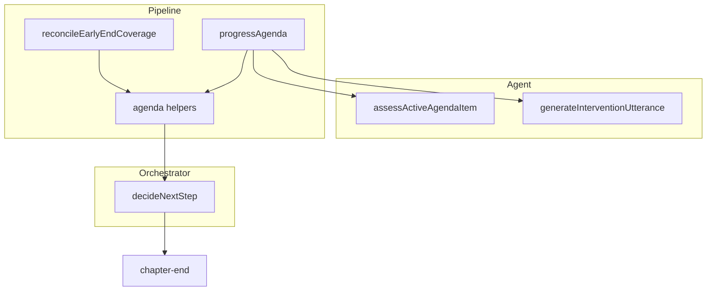
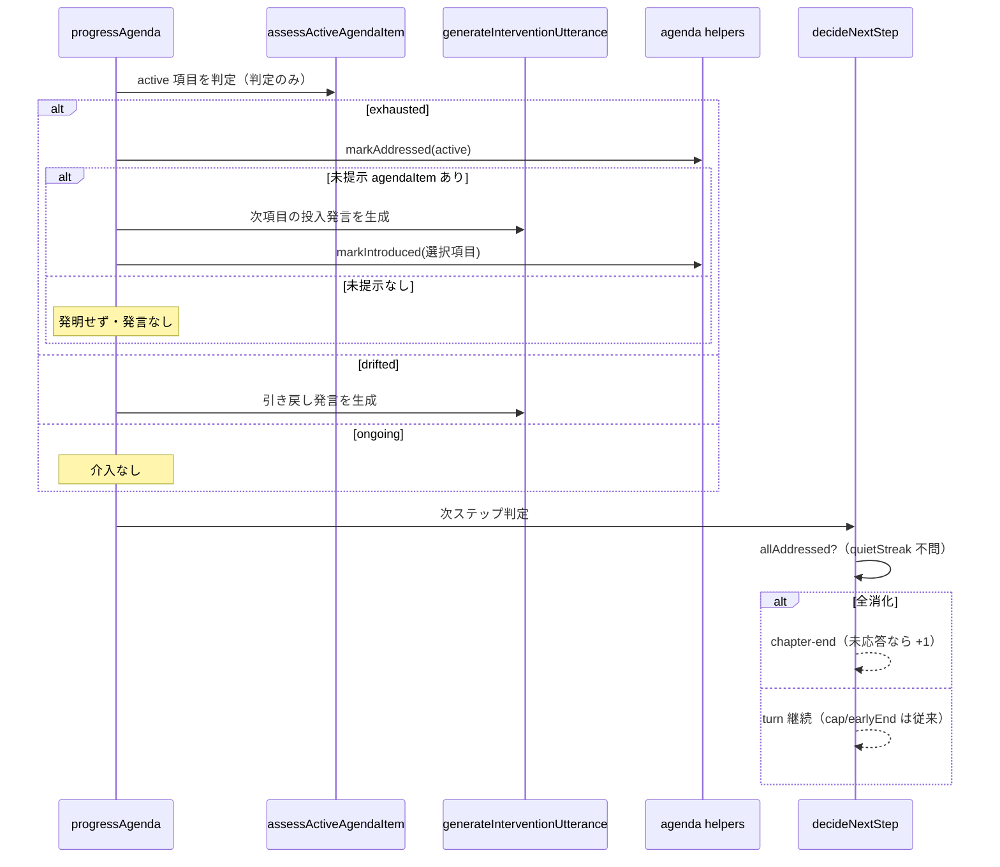

# Design Document: chapter-agenda-progression

## Overview
**Purpose**: 司会（ファシリテーター）が章の agenda（論点リスト）を忠実に進行し、各 agendaItem を「出尽くし判断」の時点で消化済み(addressed)として記録し、全項目を消化しきった時点で章を終了する。現状の課題（消化が記録されず盛り上がり中は完了検知できない／司会がアジェンダ外の論点を発明する）を、**出尽くし判定を介入行動から分離**することで根本から正す。

**Users**: 討論コンテンツの管理者・閲覧者。生成される討論が章のアジェンダに沿って進み、消化後は間延びせず次章へ移る。

**Impact**: 現状は「出尽くし判断＋発言生成＋論点選択」が1つのLLM呼び出しに融合している。本設計は **判定（assess）と行動（act）を分離**し、「出尽くし → その agendaItem を addressed」という一律ルールを実現する。あわせて `addressed` の権威を早期終了間際の一括カバレッジ評価から出尽くし判断へ移し、章終了に「全項目消化」条件を追加する。

### Goals
- 出尽くし判定を独立させ、介入行動（発言生成・項目投入）と切り離す。
- 「出尽くし → active agendaItem を addressed」を前進の有無に関わらず一律適用する（3）。
- 次項目の投入を未提示リストへ忠実化し、アジェンダ外発明を止める（1, 2）。
- 全項目消化を検知して章を終了する（4）。
- 消化専用の追加 LLM 評価を発生させない（5）。
- 未消化中の早期終了防止と既存ハード上限を維持する（6）。

### Non-Goals
- 論点そのものの生成・章立て（`chapter-generation-scoring` 系）。
- engagement 評価・立場カバレッジ判定の再設計。
- agendaItem を持たない章の終了挙動（従来の cap / quietStreak のまま）。

## Boundary Commitments

### This Spec Owns
- 司会介入における **判定（出尽くし／論点ずれ／継続）と行動（発言生成）の分離**。
- 次項目投入の忠実性・アジェンダ外発明の禁止。
- `AgendaItemState.status` の `introduced → addressed` 遷移トリガー（出尽くし判断由来）。
- 章終了条件への「全項目消化」分岐の追加。
- `addressed` 判定の権威を一括カバレッジ評価から出尽くし判断へ移す決定。
- 既存の保持対象挙動（立場カバレッジの引き込み・persona-chain の drift 限定・high-engagement の前進抑止）を、新しいゲート層として判定/行動モデルへ**写像**すること（挙動は保持し、判定ロジックは再設計しない）。

### Out of Boundary
- agendaItem の生成・スコアリング・章立て。
- engagement スコア算出、話者選択、立場カバレッジ（relevantPersonaIds）の決定ロジック。
- `introduced` 化そのもの（既存 `markIntroduced` の挙動は不変）。

### Allowed Dependencies
- `agenda.ts`（`markAddressed` / `getActiveAgendaItem` / `markIntroduced` / `getUnheardRelevant`）。
- `facilitator-agent.ts`（判定・行動の各プロンプト生成）。
- `debate.constants.ts`（cap 比率・閾値）。
- 依存方向: `agenda`（状態）→ `intervention` / `step` → `debate-orchestrator`。上位への逆流禁止。

### Revalidation Triggers
- `AgendaItemState.status` の意味・遷移契約の変更。
- 介入の判定/行動インターフェース（`AgendaAssessment` / 行動戻り値）の形状変更。
- `decideNextStep` の終了判定入力の変更。
- `evaluateAgendaItemCoverage` の除去・存置の最終決定。

## Architecture

### Existing Architecture Analysis
- **チェーン駆動**: 各 step は Firestore から状態を再構築する冪等・再入可能なタスク連鎖。`decideNextStep` は永続状態のみから次ステップを決める純粋関数。
- **agendaItem ライフサイクル**: `AgendaItemState`（`untouched | introduced | addressed`）を `agenda.ts` の純粋関数で遷移。永続は `saveAgendaItemStatuses`。
- **介入（現状・融合）**: 現 `tryIntervention`（本設計で `progressAgenda` へ改名）が `evaluateTopicDrift`（A・3択）→`evaluateStallIntervention`（B・出尽くし）を試行。各関数が1回の LLM 呼び出しで「判定＋content 生成＋項目選択」を返す。前進は `selectedAgendaItemIndex` 確定→`markIntroduced`。`unheardActive` の間は index 無効化で前進を封じる。
- **消化判定（現状）**: `reconcileEarlyEndCoverage` が `isEarlyEndCandidate` 成立時のみ `evaluateAgendaItemCoverage`（LLM）で addressed を一括更新。

### Architecture Pattern & Boundary Map



**Architecture Integration**:
- Selected pattern: 既存の介入層を **判定/行動分離** へ再構成する Extension。新規ファイルは作らず、`facilitator-agent.ts` 内で融合関数を分割。
- Key decision: 出尽くし判定を行動から切り離すことで「出尽くし → addressed」が一律化し、最終項目の特別扱い（tri-state / 専用フィールド）が不要になる。
- Existing patterns preserved: 冪等な状態再構築、`markIntroduced` の index 空間、`unheardActive` 前進封じ、finalResponse(+1)。
- Steering compliance: 純粋関数分離・依存方向単一・型安全（`any` 不使用）。

### Technology Stack
| Layer | Choice / Version | Role in Feature | Notes |
|-------|------------------|-----------------|-------|
| Backend / Services | TypeScript (Cloud Functions), `ai` + `@ai-sdk/anthropic` | 判定・行動プロンプト、状態遷移、終了判定 | 既存スタック。新規依存なし |
| Data / Storage | Firestore（`topics/{id}/chapters/{cid}` の `agendaItemStatuses`） | `addressed` の永続 | 既存 `saveAgendaItemStatuses` |

## File Structure Plan

### Modified Files
- `functions/src/agents/facilitator-agent.ts` — 融合していた `evaluateTopicDrift`/`evaluateStallIntervention` を **判定 `assessActiveAgendaItem`（content なし）** と **行動 `generateInterventionUtterance`（content あり・投入 or 引き戻し）** に分割。投入行動は未提示リスト内選択に限定し、リスト外発明を排す。（1, 2, 3）
- `functions/src/pipeline/debate/intervention.ts` — 現 `tryIntervention` を `progressAgenda` へ改名し、「判定→（exhausted なら markAddressed(active)）→未提示があれば投入行動／なければ発言なし」「drifted なら引き戻し行動」に再構成。（3.1–3.4）
- `functions/src/pipeline/debate/debate-orchestrator.ts` — `decideNextStep` に `allAddressed → chapter-end` 分岐を追加（hitCap 後段・earlyEnd と並列、finalResponse 維持）。（4, 6.2, 6.3）
- `functions/src/pipeline/debate/step.ts` — `reconcileEarlyEndCoverage` から `evaluateAgendaItemCoverage`（LLM）を除去し、「未消化が残れば早期終了を取り消し継続」を非 LLM の状態チェックとして残す。（5, 6.1）
- `functions/src/agents/facilitator-agent.ts` — 未使用化する `evaluateAgendaItemCoverage` の除去（消費者は `reconcileEarlyEndCoverage` の1箇所のみと確認済み）。（5.2）

## Components & Interfaces

### 概要

| Component | Domain | Intent | Requirements | Key Dependencies |
|-----------|--------|--------|--------------|------------------|
| `assessActiveAgendaItem` | Agent | active 項目を出尽くし/論点ずれ/継続で判定（content なし） | 3.1, 3.2 | Inbound: `progressAgenda` |
| `generateInterventionUtterance` | Agent | 投入/引き戻し/引き込みの発言生成（投入は未提示リスト内・忠実） | 1.1–1.3, 2.1–2.3, 3.3 | Inbound: `progressAgenda` |
| `progressAgenda`(改) | Pipeline | 判定→addressed→行動を編成 | 3.1–3.4 | `agenda`(P0), Agent 2種(P0) |
| `decideNextStep`(改) | Orchestrator | 全消化→章終了 | 4.1–4.4, 6.2–6.3 | `agenda`(状態, P0) |
| `reconcileEarlyEndCoverage`(改) | Pipeline | LLM 消化評価の除去・継続保護の維持 | 5.1–5.2, 6.1 | `agenda`(P0) |

### `assessActiveAgendaItem`（新・判定のみ）

- **Contracts**: Service
- **Intent**: active agendaItem を、直近の会話から「出尽くし／論点ずれ／継続」で判定する。**content・項目選択・指名は行わない**（純粋な判定）。

```typescript
type AgendaAssessment =
  | { verdict: 'exhausted' }  // 主要な意見・対立が出て新規性が尽きた
  | { verdict: 'drifted' }    // 会話が active 項目から逸脱している
  | { verdict: 'ongoing' };   // まだ深まっている＝介入不要

// 入力に未提示リストは不要（判定は active 項目と会話のみで決まる）
declare function assessActiveAgendaItem(
  activeAgendaItem: string,
  recentTurns: DebateTurn[],
  personas: Persona[]
): Promise<Result<AgendaAssessment, PipelineError>>;
```
- **Requirements**: 3.1, 3.2
- **Implementation Notes**:
  - Integration: クールダウン・高意欲者ゲート（`hasHighEngagement`）・立場カバレッジ（`unheardActive`）の既存前提は `progressAgenda` 側で維持。
  - Validation: verdict は3値の discriminated union。`any` 不使用。
  - Risks: 判定と行動を分けることで、行動が必要な回に +1 LLM 呼び出し（後述コスト）。

### `generateInterventionUtterance`（新・行動）

- **Contracts**: Service
- **Intent**: 決定済みの行動（次項目の投入 / active への引き戻し）について、司会発言・指名先・関連参加者を生成する。**投入は未提示リスト内の項目に限定**し、リスト外の論点を作らない。

```typescript
type InterventionAction =
  | { kind: 'introduce'; untouchedAgendaItems: string[] }                      // リストから1件選び投入
  | { kind: 'pull-back'; activeAgendaItem: string }                            // active へ引き戻す
  | { kind: 'bring-in'; activeAgendaItem: string; unheardRelevant: string[] }; // 未発言の関連参加者を active へ引き込む（立場カバレッジ保持）

type InterventionUtterance = {
  content: string;
  targetPersonaId: string;
  selectedAgendaItemIndex?: number; // introduce のときのみ（untouched リスト上の index）
  relevantPersonaIds?: string[];    // introduce のときのみ
};

declare function generateInterventionUtterance(
  action: InterventionAction,
  chapter: Chapter,
  recentTurns: DebateTurn[],
  personas: Persona[]
): Promise<Result<InterventionUtterance, PipelineError>>;
```
- **Requirements**: 1.1, 1.2, 1.3, 2.1, 2.2, 2.3, 3.3
- **Implementation Notes**:
  - Integration: `introduce` は `untouchedAgendaItems` からの選択・`selectedAgendaItemIndex` 必須。content は選んだ項目そのものに切り込む問い（折衷禁止）。リストが空なら `introduce` 行動は起こさない（呼び出し側で制御）。
  - `bring-in`: **既存の立場カバレッジ挙動を保持**する行動。`targetPersonaId` は `unheardRelevant` の中の1人、`selectedAgendaItemIndex` は付けない（active 項目を維持）。既存の `buildCoverageSection` 相当の指示を踏襲。
  - Validation: `selectedAgendaItemIndex` は untouched リスト上の index（`markIntroduced` の index 空間と一致）。bring-in の targetPersonaId は `unheardRelevant` に属すること（既存 `isAdoptableBringIn` 相当）。
  - Risks: LLM が選択項目から逸れないようプロンプトで強制（R1）。

### `progressAgenda`（改）

- **Contracts**: Service / State
- **Intent**: 「ゲート（許容行動の絞り込み）→ 判定 → 消化記録 → 行動」の順で編成する。ゲートは既存の保持対象挙動（立場カバレッジ・persona-chain・high-engagement）を写像し、その内側で一律ルール「出尽くし → active を addressed」を適用する（最終項目を特別扱いしない）。

**ゲート層（既存挙動の保持・Out of Boundary の写像）:**

| ゲート | 効果 |
|---|---|
| `unheardActive`（立場カバレッジ未充足） | `introduce`・addressed を封じ、`bring-in`（未発言の関連参加者を active へ）に限定（3.3） |
| trigger = persona-chain | drift 系のみ評価（exhausted による前進は行わない） |
| `hasHighEngagement` | `introduce`（前進）を抑止（強く話したい人が残る＝出尽くしていない扱い） |
| クールダウン未達 | 介入評価しない |

**判定/行動層（ゲート通過後）:**

| 判定 | 未提示 agendaItem | 動作 |
|---|---|---|
| exhausted | あり | `markAddressed`(active) → `introduce` → `markIntroduced`(選択項目) |
| exhausted | なし（＝最後の項目） | `markAddressed`(active) のみ（発言なし・発明なし） |
| drifted | — | `pull-back`（addressed 更新しない） |
| ongoing | — | 介入なし |

- **Requirements**: 3.1, 3.2, 3.3, 3.4
- **Dependencies**: `agenda.markAddressed`/`getActiveAgendaItem`/`markIntroduced`（Outbound, P0）, `assessActiveAgendaItem`/`generateInterventionUtterance`（Outbound, P0）
- **Implementation Notes**:
  - Integration: `unheardActive` の間は行動（投入）を封じる既存ゲートを維持 → 前進が起きず addressed も付かない（3.3）。`markAddressed` → `markIntroduced` の順序を守り、`getActiveAgendaItem` で前進元を解決。addressed 後は `saveAgendaItemStatuses` で永続。
  - Validation: drift（引き戻し）では addressed 更新しない（3.4）。
  - **実装細部（設計の中核ではない）**: 最後の項目で「発言せず addressed だけ立てた」場合の status 永続と、余計なペルソナ発言を挟まず次の `decideNextStep`（全消化→終了）へ渡す配線（committed-no-turn 化 / 末尾1ターン許容のいずれか）は tasks で確定。

### `decideNextStep`（改）

- **Contracts**: State
- **Intent**: 全項目消化で章終了。cap・maxTurns・finalResponse を維持。

```typescript
const allAddressed =
  agenda.length > 0 && agenda.every((item) => item.status === 'addressed');
// hitCap を最優先で維持（6.2/6.3）。
if (hitCap || earlyEnd || allAddressed) {
  if (hasUnansweredTargetAtEnd(chapterTurns)) return { kind: 'turn', expectedTurnIndex, finalResponse: true };
  return { kind: 'chapter-end', expectedTurnIndex };
}
return { kind: 'turn', expectedTurnIndex };
```
- **Requirements**: 4.1, 4.2, 4.3, 4.4, 6.2, 6.3
- **Implementation Notes**:
  - Integration: `allAddressed` は quietStreak と独立（4.3）。`agenda.length > 0` ガードで項目なし章は不適用（4.4）。hitCap を分岐先頭に残し cap 優先を保証（6.2/6.3）。
  - Risks: 参照する `agenda` が最新 addressed を反映していること（Open Question）。

### `reconcileEarlyEndCoverage`（改）

- **Contracts**: State
- **Intent**: LLM 消化評価を除去し、addressed は出尽くし由来に一本化。「未消化が残れば早期終了を取り消し継続」を非 LLM の状態チェックとして残す。

```typescript
// isEarlyEndCandidate 不成立なら従来どおり return。
// evaluateAgendaItemCoverage 呼び出しと markAddressed ループを削除。
// agenda に未 addressed が残る かつ 早期終了候補なら quietStreak を 0 に戻し継続（6.1）。
```
- **Requirements**: 5.1, 5.2, 6.1
- **Implementation Notes**:
  - Integration: `evaluateAgendaItemCoverage` の唯一消費者が本関数（検証済み）。未使用化後、関数と `coverageSchema` を除去（5.2）。

## Requirements Traceability

| Requirement | Summary | Components | Flows |
|---|---|---|---|
| 1.1–1.3 | 次項目投入の忠実性 | `generateInterventionUtterance` | 投入フロー |
| 2.1–2.3 | アジェンダ外発明の禁止 | `generateInterventionUtterance`, `progressAgenda` | 投入フロー |
| 3.1 | 前進元を addressed 化 | `assessActiveAgendaItem`, `progressAgenda` | 出尽くしフロー |
| 3.2 | 最終項目の出尽くし→addressed | `assessActiveAgendaItem`, `progressAgenda` | 出尽くしフロー |
| 3.3 | カバレッジ未充足なら記録しない・引き込み保持 | `progressAgenda`（ゲート層）, `generateInterventionUtterance`（bring-in） | ゲート→引き込み |
| 3.4 | 引き戻しは記録しない | `progressAgenda` | 引き戻し |
| 4.1–4.4 | 全消化→章終了 | `decideNextStep` | 終了判定 |
| 5.1–5.2 | 消化専用 LLM なし | `progressAgenda`, `reconcileEarlyEndCoverage` | — |
| 6.1 | 未消化中は終了しない | `reconcileEarlyEndCoverage`, `decideNextStep` | 終了判定 |
| 6.2–6.3 | cap/maxTurns 尊重 | `decideNextStep` | 終了判定 |

## System Flows



## コスト
- 判定（`assessActiveAgendaItem`）は content を生成せず軽量。従来の融合1回を、判定1回＋（行動が要る回のみ）行動1回に分ける。**非行動ターンは実質同数（判定のみ）**、**行動ターンのみ +1 呼び出し**。行動は間欠的なので概ねコスト中立。

## Testing Strategy
- **単体**: `assessActiveAgendaItem`（3値判定）。`generateInterventionUtterance`（introduce はリスト内 index・忠実 content／pull-back）。`progressAgenda`（exhausted で前進元 addressed＋投入 / 最後の項目で addressed のみ / drift は非更新 / unheardActive 中は非更新）。`decideNextStep`（全消化→chapter-end、未消化→継続、cap 優先、項目なし章は不適用、+1 維持）。
- **統合**: 全項目消化→章終了、未消化での早期終了抑止（6.1）。
- **既存回帰**: `facilitator-agent.test` / `intervention.test` / `agenda.test` を新契約に追随。

## Open Questions / Risks
- **最終項目の終了配線（実装細部）**: 出尽くし→addressed を発言なしで立てた場合の status 永続と、余計なペルソナ発言を挟まず `decideNextStep` へ渡す方式は tasks で確定。設計の中核（出尽くし→addressed→残無しなら終了）は不変。
- **decideNextStep の入力鮮度**: 直近の addressed が永続され、次 step の状態再構築で `agenda` に反映されること（上の永続配線に従属）。
- **ついで消化の非対応（受容リスク）**: 一括カバレッジ評価の除去により、順不同・付随的に議論された項目は addressed に到達せず章が cap まで延びうる。忠実進行（1, 2）で各項目が自分の出尽くしで addressed 化される前提で受容し、最終的な打ち切りは cap（6.2/6.3）が保証。
