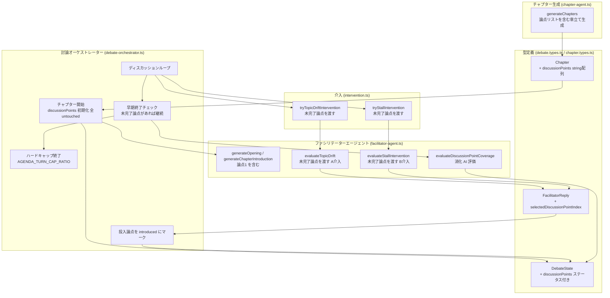
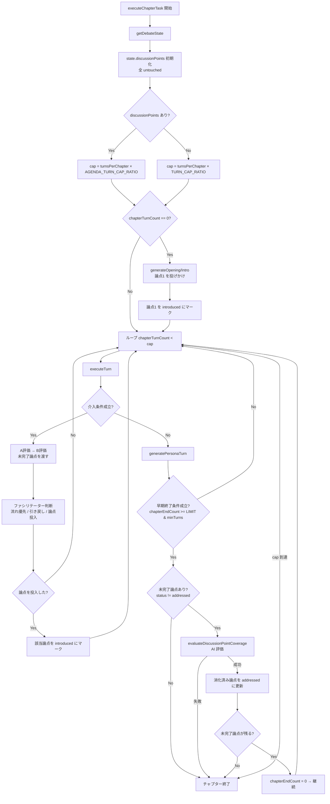

# Design Document: chapter-agenda-tracking

## Overview

各チャプターにおける論点（discussionPoints）をチャプター生成時に決定し、討論全体を通じて論点の消化を追跡・促進する機能。

チャプター開幕時にファシリテーターが論点1を投げかけ、以降の議論は既存の自然な流れを維持する。ファシリテーターの介入（A：論点ずれ／B：出尽くし）が発動した際は、未完了論点をコンテキストとして渡し、**流れを最優先**しつつ流れが一段落していれば論点投入を促す。論点は「未着手 / 着手 / 完了」の3ステータスで管理し、チャプターの早期終了判断時に未完了論点が残っていれば終了を抑止して議論を継続する。

**Impact**: `Chapter` 型の拡張、`DebateState` への論点ステータス追加、`FacilitatorReply` の拡張、ファシリテーターエージェント（開幕・A介入・B介入・消化評価）と討論オーケストレーターの動作変更。

### Goals

- チャプター生成時に各チャプターの論点リスト（3〜5件）を生成・保存する
- チャプター開幕の投げかけを論点1と連動させる
- ファシリテーターの介入（A・B 両方）時に未完了論点をコンテキストとして提供する
- 論点を3ステータスで追跡し、全論点が完了するまでチャプター早期終了を抑止する

### Non-Goals

- 論点消化のリアルタイム追跡（消化評価は早期終了トリガー時のみ）
- 公開ページでの論点表示 UI
- 論点の手動編集
- 論点ステータスの Firestore 永続化（メモリのみ）

---

## Boundary Commitments

### This Spec Owns

- `Chapter` 型の `discussionPoints` フィールド定義
- `DebateState` の `discussionPoints`（ステータス付き）フィールド定義と初期化・更新
- `FacilitatorReply` の `selectedDiscussionPointIndex` フィールド追加
- チャプター生成時の論点リスト生成ロジック（`chapter-agent.ts`）
- ファシリテーター開幕・A介入・B介入プロンプトへの論点コンテキスト追加（`facilitator-agent.ts`）
- 論点消化 AI 評価関数（`evaluateDiscussionPointCoverage`）
- チャプター終了判断の論点チェックロジック（`debate-orchestrator.ts`）
- ハードキャップ定数の追加（`AGENDA_TURN_CAP_RATIO`）

### Out of Boundary

- 既存の介入トリガー条件（`shouldEvaluateIntervention`・クールダウン・高意欲者ゲート）への変更
- A介入・B介入の評価順序（A→B）の変更
- `chapterIssues`（general / persona）の生成フロー変更

### Allowed Dependencies

- `functions/src/agents/chapter-agent.ts` — チャプター生成
- `functions/src/agents/facilitator-agent.ts` — ファシリテーター発言生成
- `functions/src/pipeline/debate/debate-orchestrator.ts` — チャプター実行制御
- `functions/src/pipeline/debate/intervention.ts` — 介入判断
- `functions/src/constants/debate.constants.ts` — 討論制御定数

### Revalidation Triggers

- `Chapter` 型のフィールド変更（`discussionPoints` の削除・型変更）
- `DebateState.discussionPoints` の型変更
- `FacilitatorReply.selectedDiscussionPointIndex` の変更
- `evaluateDiscussionPointCoverage` の戻り値型変更

---

## Architecture

### Existing Architecture Analysis

本機能は既存のマルチエージェント討論パイプラインへの Extension である。既存の主要なフロー：

```
executeChapterTask
  └─ while (chapterTurnCount < cap)
       └─ executeTurn
            ├─ tryIntervention
            │    ├─ tryTopicDriftIntervention → evaluateTopicDrift (A: クールダウン経過 & 指名なし)
            │    └─ tryStallIntervention → evaluateStallIntervention (B: 高意欲者なし)
            └─ generatePersonaTurn
```

チャプター終了は2つの条件で制御：
- **ハードキャップ**: `chapterTurnCount < cap`（ループ条件）
- **早期終了**: `chapterEndCount >= CHAPTER_END_COUNT_LIMIT && minTurns達成`

**論点消化のドライブ設計（重要）**: A介入は engagement の高低に依存せず、クールダウン経過かつ指名なしで評価される。B介入は高意欲者なし時のみ発火する。活発な議論でも A は定期的に発火機会を得る（指名連鎖は `MAX_PAIR_CONVERSATION_TURNS=3` で必ず途切れる）ため、**A・B 両方に未完了論点を渡すことで、停滞時も活発時も論点消化をドライブできる**。

本機能は以下4点に変更を加える：
1. チャプター生成（`chapter-agent.ts`）: `discussionPoints` フィールドを追加。第1章の論点は日常感覚で答えられる切り口に制約
2. ファシリテーター（`facilitator-agent.ts`）: 開幕・A介入・B介入に論点コンテキストを追加、消化評価関数を追加
3. オーケストレーター（`debate-orchestrator.ts`）: 論点ステータス初期化・更新、早期終了前に論点消化チェックを追加
4. 型（`debate.types.ts`）: `DebateState` に論点ステータス、`FacilitatorReply` に投入論点インデックスを追加

### Architecture Pattern & Boundary Map



### Technology Stack

| Layer | Choice / Version | Role in Feature |
|-------|-----------------|-----------------|
| Backend / AI | Anthropic SDK (Claude Sonnet) | 論点生成・消化評価・ファシリテーター発言 |
| Backend / Runtime | Firebase Functions v2 (Node.js 24) | チャプタータスク実行 |
| Data / Storage | Firestore | `Chapter.discussionPoints` を sessions/0 に保存 |
| Language | TypeScript (strict) | 全型定義・ロジック実装 |

---

## File Structure Plan

### Modified Files

- `functions/src/types/chapter.types.ts` — `Chapter` 型に `discussionPoints: string[]` を追加
- `functions/src/types/debate.types.ts` — `DiscussionPointStatus` / `DiscussionPointState` 型を追加、`DebateState` に `discussionPoints` を追加、`FacilitatorReply` に `selectedDiscussionPointIndex` を追加
- `functions/src/constants/debate.constants.ts` — `AGENDA_TURN_CAP_RATIO` 定数を追加
- `functions/src/agents/chapter-agent.ts` — `SUBMIT_CHAPTERS_TOOL` に `discussionPoints` を追加、第1章制約をプロンプトに追記
- `functions/src/agents/facilitator-agent.ts` — 開幕プロンプト更新、`evaluateTopicDrift` / `evaluateStallIntervention` に論点引数追加・三択/二択判断のプロンプト化、介入 TOOL に投入論点インデックス追加、`evaluateDiscussionPointCoverage` 新規追加
- `functions/src/pipeline/debate/intervention.ts` — A・B 介入に未完了論点を渡し、投入論点インデックスを呼び出し元へ返す
- `functions/src/pipeline/debate/debate-orchestrator.ts` — 論点ステータス初期化・introduced マーク・ハードキャップ計算・早期終了ロジック変更

---

## System Flows

### チャプター実行フロー（論点追跡あり）



**論点ドライブの設計意図**: 論点投入は A・B 両介入で行うが、いずれも「流れ最優先」をプロンプトで明示する。活発な議論では A（engagement 非依存）が、停滞時は B が論点投入の機会を担う。cap 到達時に未完了論点が残った場合は強制終了する（流れ優先のトレードオフとして許容）。

---

## Requirements Traceability

| Requirement | Summary | Components | Interfaces |
|-------------|---------|------------|------------|
| 1.1 | 章ごとに discussionPoints を生成 | ChapterAgent | SUBMIT_CHAPTERS_TOOL |
| 1.2 | Firestore に discussionPoints を保存 | ChapterAgent, chapter-generator | Chapter 型 |
| 1.3 | 生成失敗時フォールバック（空配列） | ChapterAgent | generateChapters 戻り値 |
| 1.4 | Chapter 型に discussionPoints 追加 | chapter.types.ts | Chapter |
| 2.1 | 開幕で論点1を投げかける | FacilitatorAgent | generateOpening, generateChapterIntroduction |
| 2.2 | 論点なし時は既存ロジック維持 | FacilitatorAgent | generateOpening |
| 2.3 | 開幕で論点1を introduced にマーク | DebateOrchestrator | DebateState.discussionPoints |
| 3.1 | チャプター開始時に全 untouched で初期化 | DebateOrchestrator | DebateState |
| 3.2 | ステータスは DebateState（メモリ） | DebateState | DiscussionPointState |
| 3.3 | AI 評価で全チャプターターンを評価 | FacilitatorAgent | evaluateDiscussionPointCoverage |
| 3.4 | 消化判定基準（実質的な内容があるか） | FacilitatorAgent | evaluateDiscussionPointCoverage プロンプト |
| 3.5 | AI 評価失敗時フォールバック | DebateOrchestrator | — |
| 4.1 | 介入トリガー条件は変更なし | intervention.ts | tryIntervention |
| 4.2 | 介入時に未完了論点リストを渡す（A・B 両方） | intervention.ts, FacilitatorAgent | evaluateTopicDrift, evaluateStallIntervention |
| 4.3 | ファシリテーターは流れ優先 | FacilitatorAgent | A/B 介入プロンプト |
| 4.4 | 1介入1論点 | FacilitatorAgent | selectedDiscussionPointIndex |
| 4.5 | 論点消化時にステータス更新 | DebateOrchestrator | DebateState |
| 4.6 | 未完了論点なし時は既存ロジック | FacilitatorAgent | — |
| 5.1 | 未完了論点あり → 早期終了抑止 | DebateOrchestrator | — |
| 5.2 | 全論点完了 → 既存早期終了条件適用 | DebateOrchestrator | — |
| 5.3 | ハードキャップを十分高く設定 | debate.constants.ts | AGENDA_TURN_CAP_RATIO |
| 5.4 | ハードキャップ到達 → 強制終了 | DebateOrchestrator | — |
| 5.5 | discussionPoints 空 → 既存ロジック | DebateOrchestrator | — |

---

## Components and Interfaces

### Summary

| Component | Layer | Intent | Req Coverage | Key Dependencies |
|-----------|-------|--------|-------------|-----------------|
| ChapterAgent | AI Generation | 章と論点リストを同時生成 | 1.1–1.4 | Claude API (P0) |
| FacilitatorAgent | AI Generation | 開幕・A/B介入・論点消化評価 | 2.1–2.2, 3.3–3.4, 4.2–4.4, 4.6 | Claude API (P0) |
| DebateOrchestrator | Pipeline | チャプター実行・ステータス管理・終了制御 | 2.3, 3.1, 3.2, 3.5, 4.5, 5.1–5.5 | FacilitatorAgent (P0), Intervention (P0) |
| Intervention | Pipeline | A/B介入判断・論点受け渡し | 4.1, 4.2 | FacilitatorAgent (P0) |
| DebateState | Type / In-memory | 実行中の討論状態・論点ステータス | 3.2 | — |
| Constants | Config | ハードキャップ定数 | 5.3 | — |

---

### Types Layer

#### Chapter 型（`functions/src/types/chapter.types.ts`）

| Field | Detail |
|-------|--------|
| Intent | チャプター定義に論点リストを追加 |
| Requirements | 1.4 |

**Contracts**: State [x]

```typescript
export type Chapter = {
    id: string;
    title: string;
    focusQuestion: string;
    discussionPoints: string[]; // 3〜5件の論点。空配列の場合は既存ロジックを維持
};
```

> `Chapter.discussionPoints` は生成・保存される素の論点（Firestore に保存）。実行中のステータス管理は `DebateState` 側で行う。

#### 論点ステータス型・DebateState（`functions/src/types/debate.types.ts`）

| Field | Detail |
|-------|--------|
| Intent | チャプター実行中の論点を3ステータスで追跡 |
| Requirements | 3.1, 3.2 |

**Contracts**: State [x]

```typescript
export type DiscussionPointStatus = 'untouched' | 'introduced' | 'addressed';

export type DiscussionPointState = {
    point: string;
    status: DiscussionPointStatus;
};

export type DebateState = {
    turns: DebateTurn[];
    silenceMap: Map<string, number>;
    speakCount: Map<string, number>;
    lastSpeakerId?: string;
    queuedIntents: Map<string, QueuedIntent[]>;
    pairConversationTurns: number;
    currentTurnIndex: number;
    lastFacilitatorTurnIndex: number;
    discussionPoints: DiscussionPointState[]; // NEW: chapter.discussionPoints から初期化。Firestore 非永続
};
```

**ステータスの決まり方（2軸）**:
- `introduced`: **アクションベース（決定的）**。ファシリテーターが開幕または介入で投入した瞬間にオーケストレーターがマークする
- `addressed`: **内容ベース（AI 評価）**。`evaluateDiscussionPointCoverage` が消化済みと判定した論点をマークする
- 自然な流れで議論された論点は `introduced` を経由せず直接 `addressed` になりうる（線形遷移ではない）
- **未完了** = `status !== 'addressed'`。介入で投入する対象は未完了論点（優先順位: `untouched` → 拾われ損ねた `introduced`）

**Implementation Notes**
- `getDebateState()` は変更しない。`discussionPoints` は `executeChapterTask` 内で `getDebateState()` 呼び出し後に `chapter.discussionPoints` から全 `untouched` で初期化する
- タスク再実行時もすべて `untouched` で再初期化する（次の早期終了トリガー時に AI 評価で `addressed` を復元）

#### FacilitatorReply 型（`functions/src/types/debate.types.ts`）

| Field | Detail |
|-------|--------|
| Intent | ファシリテーターが投入した論点をオーケストレーターへ返す |
| Requirements | 4.4, 4.5 |

```typescript
export type FacilitatorReply = {
    content?: string;
    targetPersonaId?: string;
    selectedDiscussionPointIndex?: number; // NEW: 投入した未完了論点のインデックス。投入しなかった場合は undefined
};
```

> インデックスはオーケストレーターが渡した「未完了論点リスト」内の位置を指す。オーケストレーターはこれを使って該当論点を `introduced` にマークする。

---

### AI Generation Layer

#### ChapterAgent（`functions/src/agents/chapter-agent.ts`）

| Field | Detail |
|-------|--------|
| Intent | `SUBMIT_CHAPTERS_TOOL` を拡張して論点リストを各章に生成させる |
| Requirements | 1.1, 1.2, 1.3 |

**Contracts**: Service [x]

##### Service Interface

```typescript
// 変更なし（既存シグネチャを維持）
export const generateChapters = async (
    topicTitle: string,
    personas: Persona[]
): Promise<Result<
    { chapters: Chapter[]; generalIssues: string[]; personaIssues: string[] },
    PipelineError
>>
```

`SUBMIT_CHAPTERS_TOOL` の chapters 配列アイテムに `discussionPoints: string[]` を追加する：

```typescript
chapters: {
    type: 'array',
    items: {
        properties: {
            title: { type: 'string' },
            focusQuestion: { type: 'string' },
            discussionPoints: {
                type: 'array',
                items: { type: 'string' },
                description: 'この章で押さえるべき論点を3〜5件。focusQuestionに沿った多様な切り口'
            }
        },
        required: ['title', 'focusQuestion', 'discussionPoints']
    }
}
```

**プロンプト変更方針（Issue 3 対応）**:
- 既存の構成原則「第1章は固有名詞・専門用語を含めない／誰でも感覚的に答えられる入口」を論点生成にも適用する
- 例: `第1章の discussionPoints は、専門知識のない人でも日常感覚で答えられる切り口にすること。固有名詞・専門用語は第2章以降の論点から導入してよい。`

**Implementation Notes**
- 生成失敗時（`toolCall` なし、または `discussionPoints` が空）は `discussionPoints: []` としてフォールバック（1.3）
- `planChapters` 内の `chapters.map(...)` で `discussionPoints` を含めて保存する

---

#### FacilitatorAgent（`functions/src/agents/facilitator-agent.ts`）

| Field | Detail |
|-------|--------|
| Intent | 開幕・A/B介入プロンプトへの論点コンテキスト追加、論点消化 AI 評価の提供 |
| Requirements | 2.1, 2.2, 3.3, 3.4, 4.2, 4.3, 4.4, 4.6 |

**Contracts**: Service [x]

##### Service Interface

```typescript
// 既存（シグネチャ変更なし。Chapter 型に discussionPoints が追加されるため自動的に利用可能）
export const generateOpening = async (
    topicTitle: string,
    personas: Persona[],
    firstChapter?: Chapter
): Promise<Result<FacilitatorReply, PipelineError>>

export const generateChapterIntroduction = async (
    nextChapter: Chapter,
    personas: Persona[]
): Promise<Result<FacilitatorReply, PipelineError>>

// 既存（引数追加）— A介入
export const evaluateTopicDrift = async (
    turns: DebateTurn[],
    personas: Persona[],
    speakCount: Map<string, number>,
    currentChapter?: Chapter,
    unaddressedDiscussionPoints?: string[]  // NEW: 未完了論点リスト
): Promise<Result<FacilitatorReply, PipelineError>>

// 既存（引数追加）— B介入
export const evaluateStallIntervention = async (
    turns: DebateTurn[],
    personas: Persona[],
    speakCount: Map<string, number>,
    currentChapter?: Chapter,
    unaddressedDiscussionPoints?: string[]  // NEW: 未完了論点リスト
): Promise<Result<FacilitatorReply, PipelineError>>

// 新規追加 — 論点消化評価
export const evaluateDiscussionPointCoverage = async (
    chapterTurns: DebateTurn[],
    incompletePoints: string[]
): Promise<Result<number[], PipelineError>>
// 入力: 当該チャプターの全ターン、未完了論点リスト
// Postconditions: incompletePoints のうち消化済みと判定された論点のインデックス配列を返す（空 = 消化なし）
// Error: PipelineError with code 'AI_API_ERROR'
```

**プロンプト変更方針（`generateOpening` / `generateChapterIntroduction`）**:
- `chapter.discussionPoints.length > 0` の場合、`discussionPoints[0]` をプロンプトに追加
- 例: `この章の最初の論点: ${discussionPoints[0]}。この論点を最初の問いかけの切り口として使ってください。`
- 戻り値の `selectedDiscussionPointIndex` は開幕では常に `0`（論点1）を返す

**プロンプト変更方針（`evaluateTopicDrift` — A介入の三択判断, Issue 1 対応）**:
未完了論点が非空の場合、criteria に以下の三択判断と流れ最優先を明記する：
1. 会話がフォーカス問いから逸脱している → 引き戻す（既存）
2. 逸脱していないが現在の論点が一段落しており、未完了論点へ自然に移れる → 未完了論点を1件投入する
3. 流れが深まっている最中 → 介入しない（content・targetPersonaId を省略）

投入した場合は `selectedDiscussionPointIndex` に渡された未完了論点リスト内のインデックスを設定する。

**プロンプト変更方針（`evaluateStallIntervention` — B介入）**:
- 未完了論点が非空の場合、「流れが有効ならそれを優先。落ち着いていれば未完了論点から最適な1件を投入」と指示
- 投入した場合は `selectedDiscussionPointIndex` を設定する

**`evaluateDiscussionPointCoverage` の動作**:
- 専用 tool を呼び出し、`chapterTurns`（当該章の全ターン）と `incompletePoints` を渡す
- 「各未完了論点について、ターンに実質的な議論内容が含まれるか」を判定させ、消化済み論点のインデックス配列を返す
- Preconditions: `incompletePoints.length > 0`

**Implementation Notes**
- 介入 TOOL（`INTERVENTION_TOOL`）に `selectedDiscussionPointIndex`（optional number）を追加。プロパティ定義順は targetPersonaId → content → selectedDiscussionPointIndex
- A・B いずれも「1介入1論点」をプロンプトで強制（4.4）

---

### Pipeline Layer

#### DebateOrchestrator（`functions/src/pipeline/debate/debate-orchestrator.ts`）

| Field | Detail |
|-------|--------|
| Intent | 論点ステータスの初期化・introduced マーク・ハードキャップ計算・早期終了ロジックの変更 |
| Requirements | 2.3, 3.1, 3.2, 3.5, 4.5, 5.1–5.5 |

**変更箇所**:

```typescript
// 1. DebateState 初期化後に論点ステータスを設定 (3.1)
const state = getDebateState(existingTurns, personas, persistedQueuedIntents);
state.discussionPoints = (chapter.discussionPoints ?? []).map((point) => ({
    point,
    status: 'untouched' as const
}));

// 2. ハードキャップ計算を分岐 (5.3)
const hasPoints = state.discussionPoints.length > 0;
const cap = hasPoints
    ? Math.ceil(turnsPerChapter * AGENDA_TURN_CAP_RATIO)
    : Math.ceil(turnsPerChapter * TURN_CAP_RATIO);

// 3. 開幕後、論点1を introduced にマーク (2.3)
//    generateOpening / generateChapterIntroduction の戻り値 selectedDiscussionPointIndex を使う

// 4. 介入後、投入論点を introduced にマーク (4.5)
//    tryIntervention が返す selectedDiscussionPointIndex を未完了論点リストの順序にマッピングして state.discussionPoints を更新

// 5. 早期終了チェックに論点確認を追加 (5.1, 5.2, 5.4, 5.5)
if (
    chapterTurnCount() >= Math.ceil(turnsPerChapter * EARLY_END_PROGRESS_RATIO) &&
    chapterEndCount >= CHAPTER_END_COUNT_LIMIT
) {
    const incomplete = state.discussionPoints.filter((p) => p.status !== 'addressed');
    if (incomplete.length > 0) {
        const coverageResult = await evaluateDiscussionPointCoverage(
            state.turns.filter((t) => t.chapterId === chapter.id),
            incomplete.map((p) => p.point)
        );
        if (coverageResult.ok) {
            for (const idx of coverageResult.value) {
                const target = state.discussionPoints.find((p) => p.point === incomplete[idx].point);
                if (target) target.status = 'addressed'; // (4.5)
            }
            if (state.discussionPoints.some((p) => p.status !== 'addressed')) {
                chapterEndCount = 0; // 未完了あり → 継続 (5.1)
                continue;
            }
        }
        // coverageResult 失敗 → フォールバックで break (3.5)
    }
    break; // 全完了 or 論点なし (5.2, 5.5)
}
```

> 未完了論点リストのインデックスと `state.discussionPoints` のマッピングは「論点文字列の一致」で解決する（論点文字列は章内で一意の前提）。

#### Intervention（`functions/src/pipeline/debate/intervention.ts`）

| Field | Detail |
|-------|--------|
| Intent | A・B 介入に未完了論点を渡し、投入論点インデックスを呼び出し元へ返す |
| Requirements | 4.1, 4.2 |

**変更箇所**:

```typescript
// tryIntervention は介入発火時に selectedDiscussionPointIndex を返せるよう戻り値を拡張
// 既存: Promise<boolean> → 変更: Promise<{ intervened: boolean; selectedDiscussionPointIndex?: number }>
// （または state 経由でマーク。呼び出し元 debate-orchestrator がマークするため index を伝播）

// A・B 介入呼び出し時に未完了論点を渡す
const incompletePoints = state.discussionPoints
    .filter((p) => p.status !== 'addressed')
    .map((p) => p.point);

intervention = await tryTopicDriftIntervention({ personas, chapter, state, unaddressedDiscussionPoints: incompletePoints });
if (!intervention) {
    intervention = await tryStallIntervention({ personas, chapter, state, engagements, unaddressedDiscussionPoints: incompletePoints });
}
```

> 既存の評価順序（A→B）は維持する（Out of Boundary）。`tryIntervention` は既に `state` を受け取っているため、論点リストは `state.discussionPoints` から導出する。

#### Constants（`functions/src/constants/debate.constants.ts`）

```typescript
/** 章ごとの論点リストが存在する場合のターン強制終了上限比率 */
export const AGENDA_TURN_CAP_RATIO = 2.5; // ceil(15 × 2.5) = 38 ターン
```

---

## Data Models

### Domain Model

```
Chapter (Firestore: topics/{topicId}/sessions/0.chapters[])
  id: string                  — nanoid
  title: string               — 章タイトル
  focusQuestion: string       — 討論フォーカス問い
  discussionPoints: string[]  — NEW: 3〜5件の論点（空配列でもよい）

DebateState (in-memory only)
  discussionPoints: DiscussionPointState[]  — NEW: { point, status } の配列
    status: 'untouched' | 'introduced' | 'addressed'
```

### Physical Data Model（Firestore）

`topics/{topicId}/sessions/0` の `chapters` 配列に `discussionPoints`（`string[]`）が追加される。論点ステータスは保存しない（メモリのみ）。既存チャプターデータとの後方互換性は `chapter.discussionPoints ?? []` で対処する。

---

## Error Handling

### Error Strategy

| エラーケース | 対処 |
|---|---|
| `generateChapters` の論点生成失敗 | `discussionPoints: []` でフォールバック（討論自体はブロックしない、1.3） |
| `evaluateDiscussionPointCoverage` 失敗 | ステータスを更新せず、既存の early-end ロジックで `break`（3.5） |
| `evaluateTopicDrift` / `evaluateStallIntervention` 失敗（論点渡しの場合も） | 既存のエラーハンドリングを踏襲（例外をスロー） |
| `selectedDiscussionPointIndex` が範囲外 | 無効として無視し、introduced マークを行わない |

---

## Testing Strategy

### Unit Tests

- `evaluateDiscussionPointCoverage`: チャプターターンと未完了論点を渡し、消化済みインデックスの判定が正しいか（AI モック）
- `executeChapterTask` の早期終了ロジック: 未完了論点あり → 継続、全完了 → 終了、空配列 → 既存ロジックの各ケース
- 論点ステータス遷移: 開幕で論点1が `introduced`、介入投入で `introduced`、AI 評価で `addressed` になるか
- `selectedDiscussionPointIndex` の範囲外・undefined のハンドリング
- `cap` 計算: `discussionPoints` あり/なしで `AGENDA_TURN_CAP_RATIO`/`TURN_CAP_RATIO` を使い分けるか

### Integration Tests

- チャプター生成 → `discussionPoints` が Firestore に保存されるか（第1章は日常感覚の論点か）
- チャプター実行 → ファシリテーター開幕発言に論点1が含まれるか（プロンプト検証）
- A介入・B介入 → 未完了論点が渡され、投入時に該当論点が `introduced` になるか
