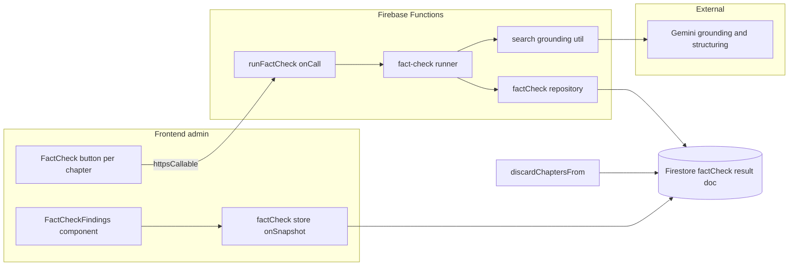
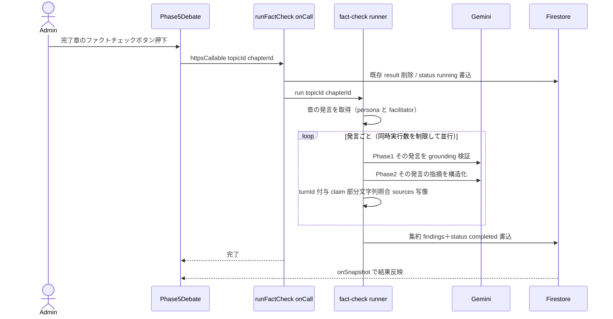

# Technical Design: chapter-fact-check

## Overview

**Purpose**: 完了した章に対し、管理者が手動でファクトチェックを実行し、発言（ペルソナ・ファシリテーター）に含まれる事実主張の誤りを「どの発言のどこが・どう間違っているか・正しい事実・理由・出典」として具体的に指摘・記録する機能を提供する。

**Users**: 管理者が討論管理画面の各章に設置されたファクトチェック実行ボタンから起動し、結果を管理画面で確認する。指摘は後続の編集工程が参照する入力となる。

**Impact**: 既存の討論生成パイプラインには手を入れない（自動起動しない）。新規 `onCall` 関数・ファクトチェック実行モジュール・章配下の結果ドキュメント・管理画面コンポーネントを追加する。再生成（`discardChaptersFrom`）時に結果を無効化する1点のみ既存コードを拡張する。

### Goals
- 章単位で独立・手動実行できるファクトチェックを提供する（1.x）
- 事実主張の誤りを、編集工程が機械的に参照できる構造（対象発言・引用・正しい事実・理由・出典）で記録する（2.x, 3.x, 4.x）
- 結果を管理画面で確認でき、実行中・失敗状態が分かる（5.x）

### Non-Goals
- 討論生成パイプラインからの自動起動（手動のみ）
- 指摘に基づく発言の自動修正・削除（編集工程は別スペック）
- 公開閲覧ページへの表示
- 意見・価値判断の正否評価（事実主張のみ対象）

## Boundary Commitments

### This Spec Owns
- 章単位ファクトチェックの実行制御（`runFactCheck` onCall）と実行モジュール（`pipeline/fact-check/`）
- ファクトチェック結果データ（`topics/{topicId}/chapters/{chapterId}/factCheck/result`）の形と書き込み
- 管理画面のファクトチェック実行ボタンと指摘表示
- Gemini グラウンディング共通処理の抽出（`search/grounding.ts`）

### Out of Boundary
- 章・ターンの生成・永続（討論パイプラインが所有）
- 章ステータス（pending/running/completed）の管理（討論パイプラインが所有）
- 指摘に基づく発言の編集（別スペック）
- 出典の長期保管・再解決（実行時に解決した結果を保存するのみ）

### Allowed Dependencies
- 章・ターンの読み取り（`pipeline/debate/chapter.ts` の取得関数）
- Gemini プロバイダ（`llm/models.ts` `getPipelineModel`）・検索グラウンディング基盤
- Firestore（Admin SDK は functions 側、FE は Client SDK の onSnapshot）
- 認証（`utils/auth.ts` `requireAuth`）

### Revalidation Triggers
- `FactCheckResultForFirestore` / `FactCheckFinding` の形変更（編集工程の入力契約）
- 結果ドキュメントの保存パス変更
- `DebateTurn` の `id` / `speakerType` の意味変更
- `discardChaptersFrom` のリセット対象変更

## Architecture

### Existing Architecture Analysis
- **討論ライフサイクル**: 章は Cloud Tasks ベースの step パイプラインで生成され、`status: completed` で確定する。本機能はこのパイプラインに介入せず、完了済みの章を読み取り対象とする。
- **グラウンディング検証の前例**: `interview-agent.ts` の `verifyWithGrounding` が反証起点の Web 検証＋出典抽出（`extractSources` / `resolveSourceUrls`）を実装済み。本機能はこれと同型で、共通処理を `search/grounding.ts` に抽出して再利用する。
- **管理操作の前例**: `runInterview`（onCall・grounding・`timeoutSeconds: 300`）が手動実行の同型。FE は `httpsCallable` を store/model に colocate。
- **章単位データの前例**: `chapters/{id}/engagements` サブコレクション、`chapterAnalysis/0` シングルトン。

### Architecture Pattern & Boundary Map



**Architecture Integration**:
- **Selected pattern**: 同期 `onCall` 起動＋専用パイプラインモジュール（Option A）。手動ボタンのため Firestore トリガもタスク投入も使わない。
- **Domain/feature boundaries**: 実行制御は `api/`、検証ロジックは `pipeline/fact-check/`、共通グラウンディングは `search/`、永続は functions 側 repository、表示は FE。各層は単方向依存。
- **Existing patterns preserved**: onCall 管理操作（runInterview）、章単位サブコレクション、onSnapshot ストア、grounding 検証＋出典解決。
- **New components rationale**: 検証は討論本体と責務・ライフサイクルが異なるため独立モジュール化（gap-analysis Option A）。
- **Dependency direction**: `types → constants/llm → search/grounding → pipeline/fact-check → api(onCall)`、FE は `models(types) → api callable → store → component`。左方向のみ import。

### Technology Stack

| Layer | Choice / Version | Role in Feature | Notes |
|-------|------------------|-----------------|-------|
| Frontend | SvelteKit 2.x / Svelte 5 runes, `@14ch/svelte-ui` | 実行ボタン・指摘表示・onSnapshot 購読 | 既存 admin パターン踏襲 |
| Backend | Firebase Functions v2 `onCall` | 手動実行エンドポイント `runFactCheck` | `timeoutSeconds: 540`, secret `GEMINI_API_KEY` |
| AI | Vercel AI SDK `ai` + `@ai-sdk/google`。Phase1=`gemini-2.5-pro`（grounding 検証）／Phase2=`gemini-2.5-flash`（構造化） | 発言単位で検証・構造化 | grounding と構造化は**併用不可**→2段。構造化は平易かつ発言数ぶん回るため軽量モデル（research.md 参照） |
| Data | Firestore | 結果 doc `chapters/{id}/factCheck/result` | 章 doc は不変。Admin SDK 書き込み / Client SDK 購読 |

## File Structure Plan

### Directory Structure
```
functions/src/
├── api/
│   └── fact-check.ts              # runFactCheck onCall（実行制御・冪等・status遷移）
├── pipeline/fact-check/
│   ├── fact-check-runner.ts       # 抽出→検証→構造化→永続のオーケストレーション
│   └── fact-check-repository.ts   # 結果 doc の読み書き・削除（Admin SDK）
├── search/
│   └── grounding.ts               # 抽出: extractSources / resolveSourceUrls / SearchSource型
└── types/
    └── fact-check.types.ts        # FactCheckFinding / FactCheckResultForFirestore / FactCheckStatus

src/lib/
├── models/factCheck/
│   └── factCheck.types.ts         # FE型（FactCheckResult / FactCheckFinding, Date変換後）
├── stores/
│   └── factCheck.svelte.ts        # 章単位 onSnapshot＋runFactCheck callable 呼び出し
└── features/admin/debate/
    └── FactCheckFindings.svelte   # 発言ごとの指摘表示（EngagementList と同列）
```

### Modified Files
- `functions/src/agents/interview-agent.ts` — `extractSources`/`resolveSourceUrls`/`SearchSource`・`SearchResult` を `search/grounding.ts` へ移し、import を直接書き換える（re-export しない）。
- `functions/src/constants/ai.constants.ts` — `PIPELINE_MODELS` に grounding 用 `gemini-2.5-pro` と構造化用 `gemini-2.5-flash` の2エントリを追加（例: `factCheckGrounding` / `factCheckStructuring`）。
- `functions/src/llm/models.ts` — `getPipelineModel` の switch にファクトチェックの2エントリ（いずれも Gemini プロバイダ）を追加。
- `functions/src/pipeline/debate/chapter.ts` — `discardChaptersFrom` で破棄章の `factCheck/result` を削除（Req6.2）。
- `functions/src/index.ts` — `runFactCheck` を export。
- `src/lib/features/admin/debate/Phase5Debate.svelte` — 完了章にファクトチェック実行ボタンと `FactCheckFindings` を組み込む。

## System Flows

### 手動実行フロー（Phase1 grounding → Phase2 構造化）



- **検索プロバイダ利用不可**: 実行前にプロバイダ可用性を確認し、不可なら章全体を `completed`（findings 空・検証不能注記）として終える。**出典0件**（検索は動いたが裏付けなし）は主張単位の `verdict: unverifiable` として記録し処理継続（いずれも 3.6）。
- **重複起動防止**: 実行中は `status: running` を UI が監視しボタンを無効化（1.4）。
- **失敗**: Runner 例外時は `status: failed` を書き、討論本体には触れない（6.1）。

## Requirements Traceability

| Requirement | Summary | Components | Interfaces | Flows |
|-------------|---------|------------|------------|-------|
| 1.1 | 完了章にボタン表示 | Phase5Debate, factCheck store | chapter.status==completed | 手動実行 |
| 1.2 | 押下で実行 | runFactCheck onCall | API Contract | 手動実行 |
| 1.3 | 章単位独立 | repository（章配下 doc） | 結果パス | — |
| 1.4 | 実行中は重複防止 | Phase5Debate | factCheck.status==running | 手動実行 |
| 1.5 | 旧結果削除→再実行 | runFactCheck onCall | clear-then-run | 手動実行 |
| 2.1 | 両 speakerType から抽出 | fact-check runner | claim extraction | 手動実行 |
| 2.2 | 事実主張なしは除外 | fact-check runner | Phase1/2 prompt | 手動実行 |
| 2.3 | 発言・該当箇所に紐づけ | runner / 型 | FactCheckFinding.turnId, claim | — |
| 3.1 | 外部検索で裏付け収集 | grounding util | Phase1 | 手動実行 |
| 3.2 | 誤り箇所・正しい事実・理由を指摘 | runner / 型 | FactCheckFinding | 手動実行 |
| 3.3 | 誤りなければ指摘生成しない | fact-check runner | Phase2 schema | 手動実行 |
| 3.4 | 各指摘に出典関連付け | runner / grounding | FactCheckFinding.sources | 手動実行 |
| 3.5 | 編集工程が参照できる形 | 型 | FactCheckFinding | — |
| 3.6 | 検索不可は検証不能で継続 | runner | verdict unverifiable | 手動実行 |
| 4.1 | 完了時に永続化 | repository | result doc 書込 | 手動実行 |
| 4.2 | 章/発言から辿れる | repository / 型 | パス＋turnId | — |
| 4.3 | 進捗 status 記録 | repository / 型 | FactCheckStatus | 手動実行 |
| 5.1 | 発言に指摘表示 | FactCheckFindings | props findings | — |
| 5.2 | 詳細（箇所/事実/理由/出典） | FactCheckFindings | finding fields | — |
| 5.3 | 実行中表示 | Phase5Debate | status running | — |
| 5.4 | 失敗表示 | Phase5Debate | status failed | — |
| 6.1 | 失敗記録・本体非干渉 | runFactCheck onCall | failed 書込 | 手動実行 |
| 6.2 | 再生成で無効化 | discardChaptersFrom | doc 削除 | — |
| 6.3 | 再実行は手動のみ | runFactCheck onCall | 自動起動なし | — |

## Components and Interfaces

| Component | Domain/Layer | Intent | Req Coverage | Key Dependencies (P0/P1) | Contracts |
|-----------|--------------|--------|--------------|--------------------------|-----------|
| runFactCheck | Functions/API | 手動実行の制御・冪等・status遷移 | 1.2, 1.5, 4.1, 4.3, 6.1, 6.3 | runner (P0), repository (P0), requireAuth (P1) | API, Service |
| fact-check runner | Functions/Pipeline | 抽出→grounding検証→構造化 | 2.x, 3.x | grounding util (P0), getPipelineModel (P0) | Service |
| grounding util | Functions/Search | 出典抽出・URL解決（共通） | 3.1, 3.4 | @ai-sdk/google groundingMetadata (P0) | Service |
| factCheck repository | Functions/Data | 結果 doc の読み書き・削除 | 1.3, 1.5, 4.x, 6.2 | Firestore Admin (P0) | State |
| factCheck store | FE/State | 章単位 onSnapshot＋実行 callable | 1.1, 1.4, 5.x | runFactCheck callable (P0), Firestore Client (P0) | State, Service |
| FactCheckFindings | FE/UI | 発言ごとの指摘表示 | 5.1, 5.2 | factCheck store (P1) | — |

### Functions / API

#### runFactCheck (onCall)

| Field | Detail |
|-------|--------|
| Intent | 完了章のファクトチェックを手動起動し、冪等に再実行する |
| Requirements | 1.2, 1.5, 4.1, 4.3, 6.1, 6.3 |

**Responsibilities & Constraints**
- 認証必須（`requireAuth`）。入力 `{ topicId, chapterId }`。
- 対象章が存在し `status === 'completed'` であることを検証（不一致は `failed-precondition`）。
- 開始時に既存 `factCheck/result` を削除し `status: running` を書く（1.5, 4.3）。
- runner 実行 → `findings` ＋ `status: completed` を書く（4.1）。例外時 `status: failed`＋`errorMessage`（6.1）。討論本体（章 doc・phaseStatus）には触れない。

**Dependencies**
- Outbound: fact-check runner — 検証実行（P0）／ factCheck repository — 永続（P0）
- Inbound: FE `httpsCallable('runFactCheck')`（P0）

**Contracts**: Service [x] / API [x] / State [ ]

##### API Contract
| Method | Endpoint | Request | Response | Errors |
|--------|----------|---------|----------|--------|
| onCall | runFactCheck | `{ topicId: string; chapterId: string }` | `{ topicId: string; chapterId: string }` | `unauthenticated`, `not-found`(章なし), `failed-precondition`(未完了), `internal` |

##### Service Interface
```typescript
interface FactCheckRunner {
  run(input: { topicId: string; chapterId: string }): Promise<Result<FactCheckResultForFirestore, PipelineError>>;
}
```
- Preconditions: 章が存在し completed。
- Postconditions: `factCheck/result` に `completed` または `failed` の結果が存在する。
- Invariants: 討論本体ドキュメント（章 turns・phaseStatus）を変更しない。

**Implementation Notes**
- Integration: `runInterview`（timeoutSeconds 300）と同型。`timeoutSeconds: 540`、secret `GEMINI_API_KEY`。FE timeout は ~550000。
- Validation: 入力・章ステータスを境界で検証。
- Risks: 章の主張数が多い場合のタイムアウト → 超過時は Option B（onCall→Cloud Task）へ移行（research.md）。

### Functions / Pipeline

#### fact-check runner

| Field | Detail |
|-------|--------|
| Intent | 章の発言から事実主張を抽出し、grounding 検証して構造化された指摘を返す |
| Requirements | 2.1, 2.2, 2.3, 3.1, 3.2, 3.3, 3.4, 3.6 |

**Responsibilities & Constraints**
- 対象章のターン（`speakerType: 'persona' | 'facilitator'` 双方）を取得（2.1）。
- **検索プロバイダ前提の確認**: 実行前に Gemini プロバイダ可用性（`getGoogleProvider()`/`GEMINI_API_KEY`）を確認する。利用不可なら検証を行わず、章全体を「検証不能」結果（`status: completed`・findings は空・`unverifiable` を示す注記）として記録し処理を終える（3.6 の「外部検索が利用不可」ケース）。
- **発言単位（per-turn）で処理する**。各発言は独立に検証し、`turnId` は **runner が処理対象の発言から固定的に付与**する（LLM 出力に依存しない＝turnId のハルシネーション不可能）。各発言の処理は独立のため**同時実行数を制限した並行実行**で行う（onCall タイムアウト対策）。
- **発言ごと Phase1（grounding 検証）**: `generateText`＋`google.tools.googleSearch({})`（gemini-2.5-pro）。その発言の content に含まれる事実主張を反証起点で検証し、「引用・誤り箇所・正しい事実・理由」を含む検証テキストを生成。本文に URL を書かせない（interview 方針踏襲）。`extractSources`/`resolveSourceUrls` で出典を解決し**番号付きリスト**に整える。
- **発言ごと Phase2（構造化）**: `generateObject`＋Zod スキーマ（grounding なし、**軽量モデル `gemini-2.5-flash`**）。入力は「その発言の content＋Phase1 検証テキスト＋番号付き解決済み出典」。出力 finding は 引用 `claim`・`verdict`・`correction`・`reason`・`sourceIndices`（番号付き出典参照）。`turnId`/`speakerType` は runner が付与する。誤りのない主張は finding を生成しない（3.3）。
- **runner による検証**: Phase2 出力を受けて、(a) `claim` が当該発言 `content` の部分文字列であることを照合（不一致は破棄またはログ）、(b) `sourceIndices` を解決済み出典に写像して `finding.sources` を確定（2.3, 3.4, 3.5, 4.2）。title 突合は行わない。`turnId` は runner 付与のため照合不要。
- grounding が出典0件の主張は `verdict: 'unverifiable'`（3.6）。検証可能な事実主張を含まない発言は finding を生成しない（2.2）。
- 全発言の finding を集約して章の結果とする。

**Dependencies**
- Outbound: grounding util（P0）／ `getPipelineModel('factCheck')`（P0）／ chapter 取得（P0）
- External: Gemini（grounding／structuring）（P0）

**Contracts**: Service [x]

##### Service Interface
```typescript
interface ChapterFactChecker {
  checkChapter(input: {
    topicId: string;
    chapterId: string;
  }): Promise<Result<FactCheckFinding[], PipelineError>>;
}
```
- Preconditions: 章のターンが取得可能。
- Postconditions: 誤り／検証不能のみを含む findings を返す（正確な主張は含まない）。各 finding の `turnId` は runner 付与の実在 id、`claim` は当該発言の部分文字列、`sources` は解決済み出典の写像。
- Invariants: 発言単位で Phase1/Phase2 を実行（各 2 呼び出し、SDK 制約により grounding と構造化は別呼び出し）。`turnId` は LLM 出力に依存しない。

**Implementation Notes**
- Integration: interview-agent の grounding プロンプト方針（反証起点・URL非記載）を踏襲。
- Concurrency: 発言は独立処理のため同時実行数を制限した並行実行（例: 数件ずつ）。壁時計は概ね「最も遅い発言 × ceil(発言数/同時実行数)」で、onCall `timeoutSeconds: 540` 内に収める。超過するほど発言数が多い章は Option B（非同期タスク）へ移行。
- Validation: Phase2 は Zod スキーマで構造保証。runner で `claim` 部分文字列照合・`sourceIndices` 写像を行い、ハルシネーション参照を排除（2.3, 3.4）。`turnId` は runner 付与で常に正当。
- Risks: 発言数 × 2 呼び出しのコスト／レイテンシ。手動・低頻度のため許容。横断文脈は弱まるが事実主張検証は発言内で完結することが多い。

### Frontend

#### factCheck store / FactCheckFindings（要約）
- `createFactCheckStore(topicId)`: 章ごとに `chapters/{id}/factCheck/result` を onSnapshot 購読し `Map<chapterId, FactCheckResult>` を提供（engagements ストア同型）。`runFactCheck(chapterId)`（httpsCallable, timeout ~550000）を内包し、実行アクションを debate 画面に提供する。
- `FactCheckFindings.svelte`: ある発言（turnId）の findings を受け取り、誤り箇所・正しい事実・理由・出典を表示（`Phase3Interviews` のマークダウン節＋出典表示に倣う）。`Phase5Debate` の発言描画ループ内で、結果の `findings` を `turnId` でフィルタし**各発言の直下**に `EngagementList` と同列で配置する（5.1）。
- ボタン状態: `status === 'running'` で無効化（1.4）、`failed` を表示（5.4）、未実行（doc なし）は実行可能。

**Implementation Note**: 画面アクション（ボタン・callable 呼び出し）は debate 画面近傍に置く（steering: 画面の処理は画面に）。中央ディスパッチャは作らない。

## Data Models

### Logical Data Model
- 集約ルート: `FactCheckResult`（章に1件）。`findings` を内包。各 finding は `turnId` で章内のターンを参照。
- `topics/{topicId}/chapters/{chapterId}/factCheck/result` に保存（固定 doc id `result`）。章 doc とは分離（1MB回避・独立 status）。

### Physical Data Model（functions/src/types/fact-check.types.ts）
```typescript
import type { Timestamp } from 'firebase-admin/firestore';
import type { SearchResult } from '../search/grounding.js';

export type FactCheckStatus = 'running' | 'completed' | 'failed';

export type FactCheckVerdict = 'incorrect' | 'unverifiable';

export type FactCheckFinding = {
  id: string;
  turnId: string;                 // 対象発言（2.3, 4.2）
  speakerType: 'persona' | 'facilitator';
  claim: string;                  // 該当箇所（発言からの引用）
  verdict: FactCheckVerdict;
  correction: string;             // 正しい事実（incorrect 時）／unverifiable は空可
  reason: string;                 // そう判断した理由
  sources: SearchResult[];        // 出典（3.4）
};

export type FactCheckResultForFirestore = {
  chapterId: string;
  status: FactCheckStatus;
  findings: FactCheckFinding[];
  sources: SearchResult[];        // 章全体で参照した出典（finding 突合のフォールバック）
  errorMessage?: string;
  startedAt: Timestamp;
  completedAt?: Timestamp;
};
```
- FE 型（`src/lib/models/factCheck/factCheck.types.ts`）は同形で `Timestamp` を `Date` に変換した `FactCheckResult` を定義（`*ForFirestore` 命名に準拠）。
- 出典型 `SearchResult`/`SearchSource` は `search/grounding.ts` に集約（interview と共有）。

### Data Contracts & Integration
- **編集工程向け契約**: `FactCheckFinding`（`turnId` ＋引用 `claim` ＋ `correction` ＋ `reason` ＋ `sources`）が編集工程の入力契約。形変更は Revalidation Trigger。

## Error Handling

### Error Strategy
- **入力／前提エラー**: 認証なし→`unauthenticated`、章なし→`not-found`、未完了→`failed-precondition`（onCall が早期失敗、結果 doc は作らない）。
- **検索プロバイダ利用不可（章全体）**: `GEMINI_API_KEY` 不在等でプロバイダを生成できない場合は、章全体を検証できないため **failed ではなく `completed`（findings 空・検証不能注記）** として記録し処理を終える（3.6 の「外部検索が利用不可」）。これは「主張単位の出典0件」とは区別する。
- **出典0件（主張単位）**: 検索は動いたが特定主張の裏付けが得られないケース。該当主張を `verdict: 'unverifiable'` として finding に残し継続（3.6）。
- **検証失敗（実行中の例外）**: 上記以外の実行時例外は `status: failed`＋`errorMessage` を結果 doc に記録（6.1）。討論本体には影響させない。`PipelineError` の `AI_API_ERROR(retryable)` は runner 内で握り、可能な範囲で部分結果を残すか failed を記録。

### Monitoring
- `console.error('[runFactCheck] error', { topicId, chapterId }, err)` で既存ログ規約に合わせる。FE は `status` を onSnapshot で監視し running/failed を提示。

## Testing Strategy

### Unit Tests
- `fact-check-runner`: 誤りのある主張のみ finding を生成（3.3）／両 speakerType を対象（2.1）／出典0件で `unverifiable`（3.6）。Gemini 呼び出しはモック。
- `fact-check-repository`: 開始時に旧 result を削除し running を書く（1.5）／完了・失敗の status 遷移（4.3, 6.1）。
- `grounding util`: `extractSources`/`resolveSourceUrls` の抽出後も挙動不変（既存テスト移設）。

### Integration Tests
- `runFactCheck` onCall: 未完了章で `failed-precondition`／完了章で result doc に findings と completed が書かれる／例外時 failed。
- `discardChaptersFrom`: 章再生成で対象章の `factCheck/result` が削除される（6.2）。

### E2E/UI Tests
- 完了章でボタン表示→押下→onSnapshot で findings 表示（1.1, 1.2, 5.1, 5.2）。
- 実行中はボタン無効化（1.4）、失敗時に失敗表示（5.4）。

## Security Considerations
- `runFactCheck` は `requireAuth` で管理者のみ。FE は Functions 経由のみ（Firebase Admin 直アクセス禁止の既存方針）。
- 出典 URL は HEAD のみ解決し本文を取得しない（OOM／過剰取得回避、既存 `resolveSourceUrls` 踏襲）。
