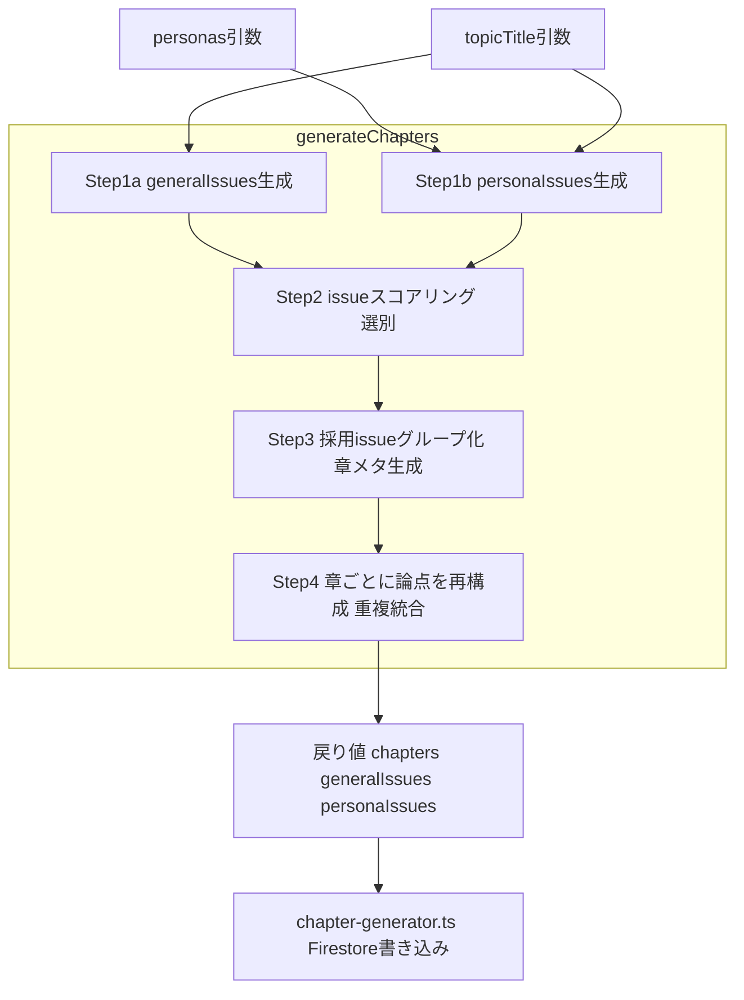
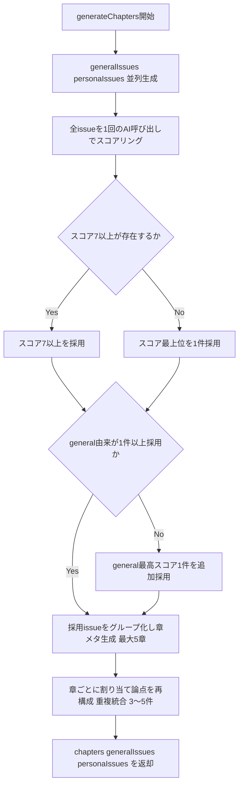

# Technical Design Document

## Overview

**Purpose**: チャプター生成パイプラインに「論点（issue）の個別スコアリング・選別」と「採用論点のグループ化・章化」を導入し、論点の内容に応じた可変チャプター数を実現する。

**Users**: 管理者がチャプター生成（フェーズ4）を実行した際、論点の量・質に応じて2〜5章が自動的に構成される。閲覧者は冗長でない、内容に厚みのある章立てを得る。

**Impact**: 現状の `generateChapters`（`functions/src/agents/chapter-agent.ts`）は chapter生成プロンプトの「3〜4章」指示で章数を固定誘導している。本設計は issue生成と chapter生成の間に「スコアリング・選別」ステップを挿入し、章化ステップを「採用issueのグループ化（章タイトル・フォーカス問い・論点割り当て）」に作り替え、さらに章ごとに割り当て論点を discussionPoints として作り直す（重複統合）ステップを追加する。`generateChapters` の引数・戻り値は不変のため、呼び出し側 `chapter-generator.ts` は無改修。

### Goals
- 論点を個別スコアリングし、閾値で選別する（Requirement 1, 2）
- 採用論点をグループ化し、各グループを章に変換する（Requirement 3）
- 章数を論点クラスタ数として1〜5の範囲で自然に決定する（Requirement 3）
- チャプターごとに discussionPoints を 3〜5 件まで補完する（Requirement 4）
- 既存の章構成品質制約（第1章の親しみやすさ・進行性・汎用的discussionPoints）を維持する（Requirement 5）
- `generateChapters` のインターフェースを変更しない（Requirement 6）

### Non-Goals
- フロントエンド表示・Firestore書き込み（`chapter-generator.ts`）の変更
- issue生成ステップ（general/persona 並列）のロジック変更
- ペルソナ・討論パイプラインへの影響

## Boundary Commitments

### This Spec Owns
- `generateChapters` 関数内部のステップ構成（スコアリング・選別・グループ化・章化・論点再構成）
- 新規追加するスコアリング/グループ化/論点再構成のスキーマ定義とプロンプト
- 閾値・章数上限・discussionPoints 件数（3〜5）といった選別・整形パラメータ

### Out of Boundary
- `generateChapters` の引数シグネチャと戻り値型（不変・契約として固定）
- `chapter-generator.ts` の Firestore 書き込み（chapterIndex 付与・chapterAnalysis/0 書き込み）
- issue生成（generalIssues / personaIssues）の生成ロジック自体

### Allowed Dependencies
- `AI_MODELS.SONNET`、`MAX_TOKENS.*`（`constants/ai.constants.ts`）
- `buildNeutralitySystemPrompt`（`agents/facilitator-agent.ts`）
- `formatPersonas`（`utils/prompt-formatters.ts`）
- Vercel AI SDK `generateObject` + `zod` + `nanoid`
- 型 `Chapter`, `Persona`, `Result`, `PipelineError`, `TopicContext`

### Revalidation Triggers
- `generateChapters` の引数・戻り値型変更（呼び出し側 `chapter-generator.ts` 再検証が必須）
- `Chapter` 型（`chapter.types.ts`）の変更
- `generalIssues` / `personaIssues` の意味・形式変更（chapterAnalysis/0 書き込みに波及）

## Architecture

### Existing Architecture Analysis
- 現状の `generateChapters` は3ステップ: ①generalIssues生成 ②personaIssues生成（①②は `Promise.all` で並列）③chapters生成。各ステップは `generateObject(model: SONNET, system: buildNeutralitySystemPrompt(), schema)` パターン。
- 戻り値は `{ chapters: Chapter[], generalIssues: string[], personaIssues: string[] }`。`chapter-generator.ts` がこれを受けて Firestore に書き込む。
- 章数は③のプロンプト文言にのみ依存。コード上の制御点は無い。

### Architecture Pattern & Boundary Map



**Architecture Integration**:
- Selected pattern: 線形パイプライン（既存パターン踏襲）。issue生成→スコアリング→グループ化→論点再構成の逐次ステージ。
- Domain/feature boundaries: 全変更は `chapter-agent.ts` 内部に閉じる。`generateChapters` の契約は固定。
- Existing patterns preserved: `generateObject` + SONNET + `buildNeutralitySystemPrompt` + zod スキーマ。`Result` 型でのエラー返却。
- New components rationale: スコアリングステップ（issue選別の制御点）、グループ化ステップ（章数を論点クラスタ数に委ねる）、論点再構成ステップ（章ごとに割り当て論点の重複を統合し discussionPoints を整える）を新設。
- Steering compliance: 過度な共通化を避け、章生成ロジックは `chapter-agent.ts` に直接記述（structure.md の方針）。アロー関数・非省略命名（tech.md）。

### Technology Stack

| Layer | Choice / Version | Role in Feature | Notes |
|-------|------------------|-----------------|-------|
| Backend / Services | Firebase Functions v2 (Node 24) | `generateChapters` 実行環境 | 既存 |
| AI | Anthropic Claude Sonnet (`claude-sonnet-4-6`) via Vercel AI SDK `generateObject` | issueスコアリング・グループ化のLLM呼び出し | 既存 `AI_MODELS.SONNET` |
| Validation | zod | スコアリング/グループ化のレスポンススキーマ | 既存パターン |
| ID生成 | nanoid | Chapter.id 付与 | 既存 |

## File Structure Plan

### Modified Files
- `functions/src/agents/chapter-agent.ts` — issue生成後に「スコアリング（`scoreIssues`）」「選別（`selectIssues` 純関数）」「グループ化・章メタ生成（`composeChapters`）」「論点再構成（`authorChapterPoints`）」を追加し、既存の単一 chapters生成ステップを置き換える。新規 zod スキーマ（スコアリング結果・グループ化結果・論点再構成結果）とプロンプトビルダーを同ファイル内に追加。
- `functions/src/constants/ai.constants.ts`（任意） — `MAX_TOKENS` にスコアリング/再構成用エントリを追加（既存値の流用でも可）。

> 変更は `chapter-agent.ts` 内部に閉じる。`chapter-generator.ts`・型ファイル・フロントエンドは無改修。

## System Flows



- **選別ゲート**: スコア7以上を採用。0件のときのみスコア最上位を1件採用し採用ゼロを防ぐ。general由来ゼロを防ぐため不足時に general 最高スコアを1件追加（Requirement 2.1〜2.3）。採用が少数に収束すれば1章を許容（Requirement 3.4）。
- **章化**: グループ化と章メタデータ生成（title/focusQuestion + 各章への論点割り当て）を1回のAI呼び出しで実施。上限5章、超過時は近接グループ統合（Requirement 3.1〜3.3, 5.1〜5.4）。
- **論点再構成**: 各章に割り当てられた論点を素材に discussionPoints を作り直す。意味的重複を統合し3〜5件に整える（Requirement 4.1〜4.4）。
- **エラー**: スコアリング・章化・論点再構成いずれの呼び出し失敗も既存 try/catch で `{ code: 'AI_API_ERROR', message, retryable: true }` を返却（Requirement 6.4）。

## Requirements Traceability

| Requirement | Summary | Components | Interfaces | Flows |
|-------------|---------|------------|------------|-------|
| 1.1 | 全issueを1回でスコアリング | IssueScorer | `scoreIssues` | Scoring |
| 1.2 | general/persona区別保持 | IssueScorer | ScoredIssue.source | Scoring |
| 1.3 | 評価軸（対立/関心/価値） | IssueScorer | scoring prompt | Scoring |
| 1.4 | スコア分布偏り対策 | IssueScorer | scoring prompt | Scoring |
| 1.5 | 全体相対評価 | IssueScorer | `scoreIssues` 一括入力 | Scoring |
| 2.1 | スコア7以上採用 | IssueSelector | `selectIssues` | Filter |
| 2.2 | 0件時に最上位1件採用 | IssueSelector | `selectIssues` | Top1 |
| 2.3 | general最低1件保証 | IssueSelector | `selectIssues` | EnsureGeneral |
| 3.1 | 採用issueグループ化→章 | ChapterComposer | `composeChapters` | Grouping |
| 3.2 | 章メタ生成・論点割り当て | ChapterComposer | composing prompt | Grouping |
| 3.3 | 上限5章・近接統合 | ChapterComposer | composing prompt | Grouping |
| 3.4 | 1章収束を許容 | ChapterComposer | composing prompt | Grouping |
| 4.1 | 章ごとに論点再構成 | ChapterPointAuthor | `authorChapterPoints` | Author |
| 4.2 | 重複統合 | ChapterPointAuthor | authoring prompt | Author |
| 4.3 | 3〜5件に整える | ChapterPointAuthor | authoring prompt | Author |
| 4.4 | 汎用的な問いの形 | ChapterPointAuthor | authoring prompt | Author |
| 5.1 | 第1章general由来 | ChapterComposer | composing prompt | Grouping |
| 5.2 | 段階的に専門性増 | ChapterComposer | composing prompt | Grouping |
| 5.3 | 汎用的discussionPoints | ChapterPointAuthor | authoring prompt | Author |
| 5.4 | 進行原則維持 | ChapterComposer | composing prompt | Grouping |
| 6.1 | 引数不変 | generateChapters | function signature | - |
| 6.2 | 戻り値型不変 | generateChapters | return type | Return |
| 6.3 | ステップ挿入 | generateChapters | pipeline order | All |
| 6.4 | エラー構造踏襲 | generateChapters | try/catch | Error |

## Components and Interfaces

| Component | Domain/Layer | Intent | Req Coverage | Key Dependencies (P0/P1) | Contracts |
|-----------|--------------|--------|--------------|--------------------------|-----------|
| generateChapters | agents | パイプライン統括・契約維持 | 6.1〜6.4 | generateObject (P0) | Service |
| IssueScorer | agents | 全issueをスコアリング | 1.1〜1.5 | generateObject (P0) | Service |
| IssueSelector | agents | スコアで採用issue選別 | 2.1〜2.3 | (純関数) | Service |
| ChapterComposer | agents | 採用issueをグループ化・章メタ生成 | 3.1〜3.4, 5.1, 5.2, 5.4 | generateObject (P0) | Service |
| ChapterPointAuthor | agents | 章ごとに論点を再構成・重複統合 | 4.1〜4.4, 5.3 | generateObject (P0) | Service |

### agents

#### generateChapters（既存・改修）

| Field | Detail |
|-------|--------|
| Intent | issue生成→スコアリング→選別→章化→論点再構成を統括し、契約された戻り値を返す |
| Requirements | 6.1, 6.2, 6.3, 6.4 |

**Responsibilities & Constraints**
- 引数 `(topicTitle: string, personas: Persona[], topicContext?: TopicContext)` を変更しない。
- 戻り値 `Result<{ chapters: Chapter[]; generalIssues: string[]; personaIssues: string[] }, PipelineError>` を変更しない。
- 全AI呼び出しを単一 try/catch で囲み、失敗時は `AI_API_ERROR`（retryable: true）を返す。

**Dependencies**
- Outbound: IssueScorer — issueスコアリング (P0)
- Outbound: IssueSelector — 採用issue選別 (P0)
- Outbound: ChapterComposer — グループ化・章メタ生成 (P0)
- Outbound: ChapterPointAuthor — 章ごとの論点再構成 (P0)

**Contracts**: Service [x]

##### Service Interface
```typescript
export const generateChapters = async (
  topicTitle: string,
  personas: Persona[],
  topicContext?: TopicContext
): Promise<
  Result<
    { chapters: Chapter[]; generalIssues: string[]; personaIssues: string[] },
    PipelineError
  >
>;
```
- Preconditions: personas は approved 済みが渡される（呼び出し側で filter 済み）。
- Postconditions: chapters は 1〜5 件、各 chapter は id/title/focusQuestion/discussionPoints(3〜5件) を持つ。generalIssues/personaIssues は生成時のまま返す。
- Invariants: 戻り値の generalIssues/personaIssues はスコアリング・選別の影響を受けない（生の生成結果を保持）。

#### IssueScorer（新規）

| Field | Detail |
|-------|--------|
| Intent | general/persona の全issueを1回のAI呼び出しで相対スコアリングする |
| Requirements | 1.1, 1.2, 1.3, 1.4, 1.5 |

**Responsibilities & Constraints**
- generalIssues と personaIssues を結合し、各issueに `source`（'general' | 'persona'）を付して入力する。
- 全issueを同一プロンプトに提示し相対評価させる（孤立評価しない）。
- 評価軸: 対立の生まれやすさ／一般人の関心／討論を深める価値。
- スコア分布制約: 全issueを高得点にしない、低スコア（≤5）を必ず含める（全issueが高品質な場合を除く）。

**Dependencies**
- Outbound: generateObject (SONNET) — スコア生成 (P0)
- External: zod — レスポンス検証 (P0)

**Contracts**: Service [x]

##### Service Interface
```typescript
type IssueSource = 'general' | 'persona';

interface ScoredIssue {
  text: string;
  source: IssueSource;
  score: number;   // 0..10
  reason: string;
}

const scoreIssues = async (
  topicTitle: string,
  generalIssues: string[],
  personaIssues: string[],
  topicContext?: TopicContext
): Promise<ScoredIssue[]>;
```
- Preconditions: generalIssues/personaIssues は生成済み。
- Postconditions: 入力全issueに対し1対1で ScoredIssue を返す（順序・source保持）。
- Invariants: score は 0〜10 の整数。

**Implementation Notes**
- Integration: `generateObject(model: SONNET, system: buildNeutralitySystemPrompt(), maxTokens: MAX_TOKENS.FACILITATOR_CHAPTER_ISSUES 相当, schema)`。スキーマは `{ scoredIssues: [{ index, score, reason }] }` とし index で入力issueに突き合わせる（text再生成によるドリフト防止）。
- Validation: 返却数が入力数と一致しない場合は受領分のみ採用し欠落はスコア0扱い。
- Risks: スコア高止まり → プロンプトで低スコア強制＋相対評価を明示。

#### IssueSelector（新規・純関数）

| Field | Detail |
|-------|--------|
| Intent | スコア済みissueから採用集合を決定する |
| Requirements | 2.1, 2.2, 2.3 |

**Responsibilities & Constraints**
- スコア≥7 を採用。
- スコア≥7 が0件なら、スコア最上位1件を採用（採用ゼロを防ぐ）。
- general由来が0件なら general 最高スコア1件を追加採用。
- 採用が少数に収束した場合はそのまま渡す（結果1章を許容）。

**Contracts**: Service [x]

##### Service Interface
```typescript
const selectIssues = (
  scoredIssues: ScoredIssue[]
): ScoredIssue[];
```
- Preconditions: scoredIssues は score を持つ。
- Postconditions: 戻り値は最低1件、かつ（general が入力に存在すれば）general を1件以上含む。
- Invariants: AI呼び出しを行わない純関数（テスト容易）。

**Implementation Notes**
- Integration: 閾値7はモジュール先頭の定数で定義。
- Validation: scoredIssues が空なら空配列を返す（理論上 issue は必ず存在するが防御的に扱う）。
- Risks: 閾値7の妥当性は実データで観察し調整。

#### ChapterComposer（新規）

| Field | Detail |
|-------|--------|
| Intent | 採用issueをグループ化し、各章のメタ（title/focusQuestion）を生成し、論点を各章に割り当てる |
| Requirements | 3.1, 3.2, 3.3, 3.4, 5.1, 5.2, 5.4 |

**Responsibilities & Constraints**
- 採用issueを意味的近接でグループ化し、各グループ=1章とする。
- 各章に title/focusQuestion を生成し、採用issueをその章に割り当てる（この段階では discussionPoints の最終整形はしない＝割り当てられた issue 群を保持）。
- 章数上限5、超過時は近接グループ統合。採用が収束すれば1章を許容。
- 第1章は general 由来を割り当て、固有名詞・専門用語を排除。章順は専門性・対立が段階的に増すよう整列。

**Dependencies**
- Outbound: generateObject (SONNET) — グループ化・章メタ生成 (P0)

**Contracts**: Service [x]

##### Service Interface
```typescript
interface ComposedChapter {
  title: string;
  focusQuestion: string;
  assignedIssues: string[];  // この章に割り当てられた採用issueの text
}

const composeChapters = async (
  topicTitle: string,
  selectedIssues: ScoredIssue[],
  topicContext?: TopicContext
): Promise<ComposedChapter[]>;
```
- Preconditions: selectedIssues は IssueSelector の出力（general 1件以上含む）。
- Postconditions: 1〜5件の ComposedChapter。各章に1件以上の assignedIssues。
- Invariants: 全採用issueがいずれかの章に割り当てられる（取りこぼしなし）。

**Implementation Notes**
- Integration: `generateObject(model: SONNET, system: buildNeutralitySystemPrompt(), maxTokens: MAX_TOKENS.FACILITATOR_CHAPTER_STRUCTURE, schema)`。スキーマは `{ chapters: [{ title, focusQuestion, assignedIssueIndexes: number[] }] }` とし、index で selectedIssues に突き合わせる（text再生成ドリフト防止）。
- Validation: 返却章数が0なら採用issue全件を単一章に割り当てるフォールバック。割り当て漏れ issue は最終章に寄せる。
- Risks: グループ化粒度がブレる → プロンプトで「上限5・近接統合・第1章general」を明示。

#### ChapterPointAuthor（新規）

| Field | Detail |
|-------|--------|
| Intent | 各章に割り当てられた採用issueを素材に discussionPoints を作り直し、重複統合のうえ3〜5件に整える |
| Requirements | 4.1, 4.2, 4.3, 4.4, 5.3 |

**Responsibilities & Constraints**
- 章ごとに assignedIssues を素材として discussionPoints を生成し直す。
- 意味的に重複する論点を1つに統合する。
- 最終的に各章 3〜5件に収める（素材不足はタイトル・フォーカス問いに沿って補い、過剰は統合・取捨）。
- ペルソナ固有名詞・発言前提を排し、汎用的な問いの形にする。

**Dependencies**
- Outbound: generateObject (SONNET) — 章ごとの論点再構成 (P0)
- External: nanoid — Chapter.id (P0)

**Contracts**: Service [x]

##### Service Interface
```typescript
const authorChapterPoints = async (
  topicTitle: string,
  composedChapters: ComposedChapter[],
  topicContext?: TopicContext
): Promise<Chapter[]>;
```
- Preconditions: composedChapters は ChapterComposer の出力。
- Postconditions: 入力章と同数・同順の Chapter[]。各 chapter は id/title/focusQuestion/discussionPoints(3〜5件)。id は nanoid 付与。
- Invariants: discussionPoints にペルソナ固有名詞を含めない。title/focusQuestion は composedChapters のものを引き継ぐ。

**Implementation Notes**
- Integration: 全章を1回のAI呼び出しにまとめて渡し、章ごとの discussionPoints を返すスキーマ `{ chapters: [{ discussionPoints: string[] }] }`（入力順で突き合わせ）。`maxTokens: MAX_TOKENS.FACILITATOR_CHAPTER_STRUCTURE`。
- Validation: ある章の discussionPoints が3件未満で返った場合もそのまま採用するが、プロンプトで3〜5件を強制。返却章数が入力と不一致なら受領分を入力順にマップし、欠落章は assignedIssues をそのまま discussionPoints に流用。
- Risks: 章をまたいだ論点の重複は本ステップの対象外（章内重複の統合に限定）。章間調整が必要になった場合は将来拡張。

## Error Handling

### Error Strategy
- 全AI呼び出し（issue生成・スコアリング・章化・論点再構成）を `generateChapters` の単一 try/catch で囲む。例外は `{ code: 'AI_API_ERROR', message, retryable: true }` に正規化して返す（既存踏襲）。

### Error Categories and Responses
- **System Errors（AI API失敗・タイムアウト）**: `AI_API_ERROR`（retryable: true）。呼び出し側 `planChapters` が throw に変換しフェーズを stopped に。
- **Business Logic（採用issueゼロ・章ゼロ）**: 例外にせずフォールバック（採用は最高スコア1件、章0は採用issue全件を単一章に、論点再構成の欠落章は assignedIssues 流用）。チャプター数ゼロを防ぐ。

### Monitoring
- 既存 Functions ログを踏襲。スコア分布・採用件数・最終章数を `console` ログに出すと閾値チューニングに有用（任意）。

## Testing Strategy

### Unit Tests
- `selectIssues`: スコア≥7のみ採用 / 0件時の最上位1件採用 / general0件時の追加採用 / 空入力。
- `scoreIssues`（モックLLM）: 入力全issueに1対1でScoredIssueが返る / index突き合わせ / 返却欠落時のスコア0扱い。
- `composeChapters`（モックLLM）: 1〜5章に収まる / 章0返却時の単一章フォールバック / 割り当て漏れissueが最終章に寄る / 全issueが取りこぼされない。
- `authorChapterPoints`（モックLLM）: 各章 discussionPoints が3〜5件 / 章内重複の統合 / 返却章数不一致時の入力順マップと欠落章の assignedIssues 流用 / id が nanoid 付与され title/focusQuestion 引き継ぎ。
- `generateChapters`（モックLLM）: 戻り値型・generalIssues/personaIssues が生成時のまま保持される（選別非依存）。

### Integration Tests
- `generateChapters` エンドツーエンド（全LLMモック）: issue生成→スコア→選別→章化→論点再構成の連結で chapters が返り、エラー時に `AI_API_ERROR` を返す。
- 既存 `chapter-generator.test.ts` / `chapter-agent.test.ts` がインターフェース不変で通過すること。

> AI生成ロジックはモックを使ってUnit Testを書く（testing.md / tech.md 準拠）。テストは `functions/src/tests/` に分離配置（既存ルール）。
