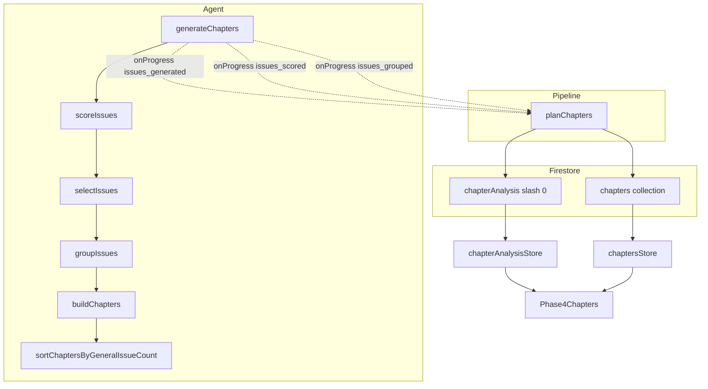
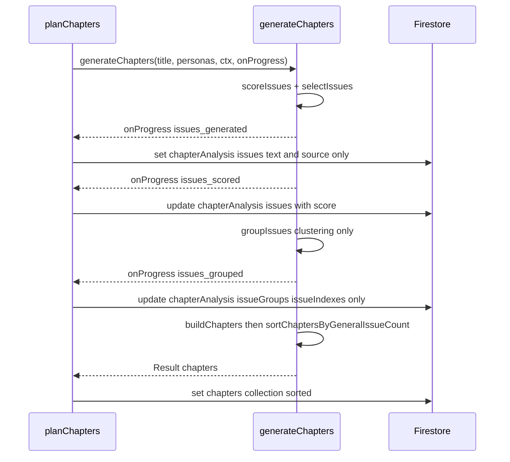

# Technical Design: chapter-grouping-separation

## Overview

**Purpose**: チャプター生成パイプラインのグループ化ステップを純粋なクラスタリングに分離し、AIがタイトル生成の都合で章数上限まで水増しする問題を解消する。

**Users**: 管理者がフェーズ4（章立て）で討論の章構成を生成する際、論点の自然なクラスタ数に基づいた章立てが得られる。

**Impact**: 現行の `composeChapters`（クラスタリング＋タイトル＋フォーカス問いを1回のAI呼び出しで生成）を3つの責務に分解する — グループ化（クラスタリングのみ）→ 章生成（タイトル・フォーカス問い・discussionPoints 生成）→ 並べ替え（純粋関数）。あわせて `ChapterAnalysisDoc` を論点とスコアを統合した形に再設計する。

### Goals
- グループ化AIをクラスタリング（`issueIndexes` の割り当て）のみに限定する。
- 章の並び順を「general由来論点数」で決める純粋関数を独立させ、単体テスト可能にする。
- 論点・スコア・グループの中間データを `chapterAnalysis/0` 単一ドキュメントで段階的に表現する。

### Non-Goals
- スコアリング（`scoreIssues`）・選別（`selectIssues`）・論点生成（Step 1）のロジック変更。
- 討論パイプライン（debate）への影響。

## Boundary Commitments

### This Spec Owns
- `chapter-agent.ts` のグループ化（`groupIssues`）・章生成（`buildChapters`）・並べ替え（`sortChaptersByGeneralIssueCount`）関数とそのスキーマ・プロンプト。
- `ChapterProgress` イベント型（`chapters_composed` → `issues_grouped` 改名を含む）。
- `ChapterAnalysisDoc` の構造（論点を単一 `issues: Issue[]` に集約し唯一の真実とする）と、`planChapters` の Firestore 書き込み手順。
- `Phase4Chapters.svelte` の中間表示（4ステップ）。

### Out of Boundary
- スコアリング・選別・論点生成の判定基準（上流 `chapter-generation-scoring` が所有）。
- `ChapterDoc` の討論関連フィールド（`turns`/`status`/`discussionPointStatuses`）。
- 公開閲覧ページ。

### Allowed Dependencies
- `onProgress`/`ChapterProgress` 機構（上流スペック由来）。
- `@14ch/svelte-ui`、Vercel AI SDK `generateObject` + Zod、Firestore Client/Admin SDK。

### Revalidation Triggers
- `ChapterAnalysisDoc` のフィールド形状変更（フロント `chapterAnalysisStore` 消費側に影響）。
- `ChapterProgress` のイベント名・ペイロード変更（`planChapters` コールバックに影響）。
- `Chapter` 型の変更。

## Architecture

### Existing Architecture Analysis
- パイプラインは `generateChapters`（agent層）が5ステップをオーケストレーションし、`onProgress` コールバックで中間状態を `planChapters`（pipeline層）に通知、`planChapters` が Firestore に書き込む。
- フロントは `chaptersStore`・`chapterAnalysisStore` が `onSnapshot` で購読し、`Phase4Chapters.svelte` が表示。
- この構造は維持する。変更はグループ化/章生成の内部分割と、書き込み先・データ形状のみ。

### Architecture Pattern & Boundary Map



**Architecture Integration**:
- Selected pattern: 既存のステップパイプライン + コールバック通知を踏襲。グループ化の内部を2関数（クラスタリング/章生成）+ 1純粋関数（並べ替え）に分割。
- Domain/feature boundaries: クラスタリングは意味的近接のみ、タイトル・フォーカス問いは章生成、順序は並べ替え関数が単独で所有。
- Existing patterns preserved: `generateObject` + Zod スキーマ、`onProgress` 通知、`Result` エラー型、トップダウン関数配置。
- New components rationale: `sortChaptersByGeneralIssueCount` を**エクスポートされた純粋関数**として新設（要件5.5の単体テスト要求のため）。
- Steering compliance: 過度な抽象化なし、アロー関数、省略しない命名、型は `functions/src/types` / `src/lib/models` に分離。

### Dependency Direction
Types → Agent（pure helpers → AI helpers → `generateChapters`）→ Pipeline（`planChapters`）→ UI。各層は左側のみ参照する。`sortChaptersByGeneralIssueCount` は純粋関数で外部依存を持たない。

### Technology Stack

| Layer | Choice / Version | Role in Feature | Notes |
|-------|------------------|-----------------|-------|
| Backend / Services | Firebase Functions v2 (Node 24, TS strict) | パイプライン実行 | 既存 |
| AI | Vercel AI SDK `generateObject` + Zod | グループ化/章生成の構造化出力 | スキーマ2種を改定 |
| Data / Storage | Firestore | `chapterAnalysis/0`・`chapters` | 新コレクション追加なし |
| Frontend | SvelteKit 5 runes + `@14ch/svelte-ui` | 中間表示 | `Phase4Chapters.svelte` |

新規依存なし。`Array.prototype.sort` の安定性（Node 24）に依存。

## File Structure Plan

### Modified Files
- `functions/src/types/chapter.types.ts` — `IssueSource`/`Issue`/`IssueGroup`/`ChapterAnalysisDoc` を追加。すべて永続形状で、agent・pipeline・表示で共用する（`ScoredIssue` のような内部専用型は作らない）。
- `functions/src/agents/chapter-agent.ts` — `composeChapters`→`groupIssues`、`authorChapterPoints`→`buildChapters`、`sortChaptersByGeneralIssueCount` 新設（export）、スキーマ2種改定、`ChapterProgress` 改定、`generateChapters` 組み立て更新。
- `functions/src/pipeline/chapters/chapter-generator.ts` — `planChapters` のコールバック分岐を新イベントに更新。`chapterAnalysis/0` の `issues` を段階的に `set`→`update`、チャプターは末尾で一括 `set`。プレースホルダーID追跡を撤廃。
- `src/lib/models/chapter/chapter.types.ts` — `Issue`/`IssueGroup` 追加、`ChapterAnalysisDoc` を `issues`（`Issue[]`）+ `issueGroups?`（`IssueGroup[]`）に再設計、`ScoredIssueDoc` 削除、`ChapterDoc.assignedIssues` 削除。
- `src/lib/features/admin/chapters/Phase4Chapters.svelte` — 表示を新データ形状（`Issue[]`、`issueGroups.issueIndexes` を解決して表示）に合わせる。
- テスト: `functions/src/tests/agents/chapter-agent.test.ts`、`functions/src/tests/agents/chapter-agenda.integration.test.ts`、`functions/src/tests/pipeline/chapters/chapter-generator.test.ts` を新スキーマ・新イベントに更新。`sortChaptersByGeneralIssueCount` の単体テストを追加。

## System Flows

### 章生成パイプライン（新）



グループは `issues_grouped` 時点（クラスタリング順）で書き込み、チャプターは並べ替え後の順序で書き込むため、グループ表示順と最終章順は一致しないことがある（グループ表示はクラスタリングの可視化、章順は別概念として許容）。

## Requirements Traceability

| Requirement | Summary | Components | Interfaces | Flows |
|-------------|---------|------------|------------|-------|
| 1.1–1.4 | グループ化の純粋化 | `groupIssues` | `groupingResultSchema` | パイプライン |
| 2.1–2.3 | 章生成拡張 | `buildChapters` | `chapterResultSchema` | パイプライン |
| 3.1–3.4 | 並べ替え純粋関数 | `sortChaptersByGeneralIssueCount` | export 関数シグネチャ | パイプライン |
| 4.1–4.6 | `ChapterAnalysisDoc` 再設計 | `chapter.types`（両側） | `Issue`/`issueIndexes` | — |
| 5.1–5.3 | Firestore 書き込み | `planChapters` | `ChapterProgress` | パイプライン |
| 6.1–6.5 | テスト整合 | 各テストファイル | モックヘルパー | — |

## Components and Interfaces

| Component | Domain/Layer | Intent | Req Coverage | Key Dependencies | Contracts |
|-----------|--------------|--------|--------------|------------------|-----------|
| `groupIssues` | Agent | 採用論点をクラスタリング | 1 | `generateObject` (P0) | Service |
| `buildChapters` | Agent | グループから章を生成 | 2 | `generateObject` (P0) | Service |
| `sortChaptersByGeneralIssueCount` | Agent (pure) | 章をgeneral数降順に整列 | 3 | なし | Service |
| `generateChapters` | Agent | 全体オーケストレーション | 1,2,3,5 | 上記3関数 (P0) | Event |
| `planChapters` | Pipeline | Firestore 書き込み | 4,5 | `generateChapters` (P0), Firestore (P0) | Batch, State |
| `Phase4Chapters` | UI | 4ステップ中間表示 | 4,5 | stores (P0) | State |

### Agent

#### groupIssues

| Field | Detail |
|-------|--------|
| Intent | 採用論点を意味的近接でクラスタリングし、index集合のグループを返す |
| Requirements | 1.1, 1.2, 1.3, 1.4 |

**Responsibilities & Constraints**
- 入力 `Issue[]`（全件、`selected` フラグ付き）。タイトル・フォーカス問いは生成しない。
- 0グループ応答時は全採用論点を1グループに束ねる（1.3）。
- 未割り当ての採用 index は最終グループに追加し、全採用論点の被覆を保証（1.4）。

**Contracts**: Service [x]

##### Service Interface
```typescript
const groupIssues: (
  topicTitle: string,
  issues: Issue[],            // 全件（issues 配列そのもの）
  topicContext?: TopicContext
) => Promise<IssueGroup[]>;   // issueIndexes は issues への index

const groupingResultSchema = z.object({
  issueGroups: z.array(z.object({
    issueIndexes: z.array(z.number().int()),
    issues: z.array(z.string()).optional() // 精度向上のためAIにテキストをecho させてよい（保持しない）
  }))
});
```
- Preconditions: AIへは採用論点（`selected === true`）をローカル index 0..n で提示する。
- Postconditions: 返却 `IssueGroup.issueIndexes` は AI のローカル index を `issues` 配列への index に変換済み。全採用論点がいずれかのグループに属する。
- Invariants: グループ数 ≥ 1。グループの index はすべて採用論点を指す。
- AI出力の `issues`（テキストecho）は精度目的で許容するが、`IssueGroup` には保持しない（テキストの唯一の保持先は `issues` 配列）。

**Implementation Notes**
- プロンプトは「意味的に近い論点を同じグループにまとめる。タイトルやフォーカス問いは生成しない」を明示。`index` 配列のみ要求。

#### buildChapters

| Field | Detail |
|-------|--------|
| Intent | 各グループにタイトル・フォーカス問い・discussionPoints を一括生成 |
| Requirements | 2.1, 2.2, 2.3 |

**Contracts**: Service [x]

##### Service Interface
```typescript
const buildChapters: (
  topicTitle: string,
  issueGroups: IssueGroup[],
  issues: Issue[],          // index 解決用
  topicContext?: TopicContext
) => Promise<Chapter[]>;

const chapterResultSchema = z.object({
  chapters: z.array(z.object({
    title: z.string(),
    focusQuestion: z.string(),
    discussionPoints: z.array(z.string())
  }))
});
```
- Preconditions: `issueGroups` は1件以上。プロンプトは各グループの `issueIndexes` を `issues[i].text` に解決して提示する。
- Postconditions: 各章に `nanoid` で `id` 付与。返却順は入力グループ順（並べ替えは別関数）。
- Invariants: AIが特定グループの章を返さない場合、そのグループの論点テキスト（index解決）を discussionPoints にフォールバック。

**Implementation Notes**
- 順序・第1章制約はプロンプトに含めない（並べ替え関数が担う）。

#### sortChaptersByGeneralIssueCount

| Field | Detail |
|-------|--------|
| Intent | 章を「対応グループのgeneral由来論点数」降順に安定ソート |
| Requirements | 3.1, 3.2, 3.3, 3.4 |

**Contracts**: Service [x]

##### Service Interface
```typescript
export const sortChaptersByGeneralIssueCount: (
  chapters: Chapter[],
  issueGroups: IssueGroup[],
  issues: Issue[]   // source 参照用
) => Chapter[];
```
- Preconditions: `chapters.length === issueGroups.length`、`chapters[i]` は `issueGroups[i]` に対応。
- Postconditions: general 数が多いグループの章を先頭に配置。同数は元順を維持（安定ソート）。入力は変更しない（純粋）。
- Invariants: 要素数・集合は不変、順序のみ変化。

**Implementation Notes**
- general 数 = `issueGroups[i].issueIndexes.filter(index => issues[index].source === 'general').length`。
- `[...chapters]` を複製してから `sort`（破壊的変更回避）。export して直接単体テスト（6.5）。

#### generateChapters（更新）

| Field | Detail |
|-------|--------|
| Intent | パイプライン全体のオーケストレーションと進捗通知 |
| Requirements | 1,2,3,5 |

**Contracts**: Event [x]

##### Event Contract
```typescript
export type ChapterProgress =
  | { step: 'issues_generated'; issues: Issue[] }
  | { step: 'issues_scored'; issues: Issue[] }
  | { step: 'issues_grouped'; issueGroups: IssueGroup[] };
```
- Published events: 上記3イベントを順に `onProgress` で通知（`chapters_composed` は廃止）。
- `issues_generated`: `Issue` は `{text, source}` のみ。`issues_scored`: `score`/`reason`/`selected` 付き。`issues_grouped`: `issueIndexes`（`issues` 参照）のリストのみ。
- 戻り値は `Result<Chapter[], PipelineError>` に簡素化（旧 `{ chapters, generalIssues, personaIssues }` を廃止）。論点リストはコールバック（`issues`）に一本化し、戻り値で二重に持たない。

**Implementation Notes**
- 組み立て: `groupIssues` → `onProgress(issues_grouped)` → `buildChapters` → `sortChaptersByGeneralIssueCount` → 返却。

### Pipeline

#### planChapters（更新）

| Field | Detail |
|-------|--------|
| Intent | 進捗イベントに応じた Firestore 書き込み |
| Requirements | 4.3, 4.4, 5.1, 5.2, 5.3 |

**Contracts**: Batch [x] / State [x]

##### Batch / Job Contract
- Trigger: フェーズ4の章立て生成。
- 書き込み手順:
  - `issues_generated` → `chapterAnalysis/0` を `set({ issues })`（`{text, source}` のみ）。
  - `issues_scored` → `update({ issues })`（score 付き）。
  - `issues_grouped` → `update({ issueGroups })`（`issueIndexes` のリストのみ）。
  - 完了後 → `chapters` コレクションに各章を `set`（`chapterIndex` は並べ替え後の位置、`turns: []`、`status: 'pending'`）。
- Idempotency & recovery: 再生成時は `resetChapters`（既存）が `chapters`・`chapterAnalysis/0` を削除。`planChapters` は毎回新規生成。プレースホルダーID追跡は撤廃。

**Implementation Notes**
- 旧実装の placeholderChapterIds / 件数不一致フォールバックは不要（グループは `chapterAnalysis` 側、チャプターは末尾一括書き込みのため）。

### UI

#### Phase4Chapters（更新・Summary-only）
- Step 1: `chapterIssues.issues`（`Issue[]`）を `source` でフィルタし、一般／ペルソナ別に `text` を表示。
- Step 2: 同配列の `score !== undefined` を条件にスコア・採点理由・`selected` を表示（スコア降順）。
- Step 3: `chapterIssues.issueGroups` の各 `issueIndexes` を `chapterIssues.issues` で解決し「グループ {N}: text, text...」で表示。
- Step 4: `chaptersStore` の章（title・focusQuestion・discussionPoints）。
- **Implementation Note**: 4ステップを `{#if}` で積み上げ表示（`{:else if}` で切り替えない）。`chapter.assignedIssues` 参照は廃止。

## Data Models

### Logical Data Model

`topics/{topicId}/chapterAnalysis/0`（再設計）。以下の型は永続・ローカル共用（`functions/src/types/chapter.types.ts`、フロントは `src/lib/models/chapter/chapter.types.ts` にミラー）:
```typescript
type IssueSource = 'general' | 'persona';
interface Issue {
  text: string;
  source: IssueSource;
  score?: number;     // スコアリング後に付与
  reason?: string;    // スコアリング後に付与
  selected?: boolean; // 選別後に付与
}
interface IssueGroup {
  issueIndexes: number[]; // issues 配列へのインデックス参照
}
interface ChapterAnalysisDoc {
  issues: Issue[];
  issueGroups?: IssueGroup[];
}
```

- 論点は単一の `issues` 配列に集約し、general/persona は `source` フィールドで区別する（2配列に分けない）。
- `issueGroups` はインデックス参照だけを持ち、テキストを複製しない。`number[][]` にしないのは Firestore がネスト配列を許可しないため（`{ issueIndexes }` オブジェクトの配列で回避）。
- `Issue`/`IssueGroup` は agent・pipeline・表示で同一型を共用する。内部専用の別型（旧 `ScoredIssue`）は作らない — 単一表現を徹底する。
- 命名規約: `Doc` 接尾辞は「永続形と domain 形を区別する必要がある型」に付ける（`Chapter`↔`ChapterDoc`、`Turn`↔`TurnDoc`）。`Issue`/`IssueGroup` は単一表現で区別対象がないため `Doc` を付けない。`ChapterAnalysisDoc` は `chapterAnalysis/0` ドキュメントそのものを表す既存型のため名称を維持する。

`topics/{topicId}/chapters/{chapterId}`（`ChapterDoc`）: 既存から `assignedIssues?` を削除。他フィールドは不変。

**Consistency & Integrity**:
- `chapterAnalysis/0` は段階的に同一ドキュメントを `set`（issues_generated）→`update`（issues_scored）→`update`（issues_grouped）する。`issues` の配列順は論点生成順（general→persona）を維持し、以降のステップでも順序不変。
- インデックス空間: `issueGroups[].issueIndexes` は `issues` 配列を直接指す（連結変換は不要）。表示・並べ替えはこの配列でインデックスを解決する。
- ソース判定: `issues[i].source` を直接参照する（並べ替えの general 数カウントに使用）。

## Error Handling

### Error Strategy
- AI呼び出し失敗は既存どおり `generateChapters` の `try/catch` で捕捉し `{ ok: false, error: { code: 'AI_API_ERROR', retryable: true } }` を返す。`planChapters` は `message` を throw。
- グループ0件・章欠落は例外ではなくフォールバック（1.3 / 2.3 invariant）で吸収。

### Monitoring
- 既存の Functions ログを踏襲。新規メトリクスなし。

## Testing Strategy

### Unit Tests
- `sortChaptersByGeneralIssueCount`: general数降順整列／同数時の元順維持／入力非破壊（直接 export 呼び出し）。
- `groupIssues`（generateChapters経由）: クラスタリングプロンプトにタイトル要求が含まれない／0グループ→1グループ・フォールバック／未割り当て論点が最終グループに付く。
- `buildChapters`（経由）: 章欠落時の論点テキスト（index解決）フォールバック／`nanoid` 付与。
- `selectIssues`/`scoreIssues`: 既存テストの維持（モック形状のみ追従）。

### Integration Tests
- `chapter-agenda.integration.test.ts`: 5回の `generateObject` チェーンを新スキーマ（グループ化=`{issueGroups}`、章生成=`{chapters:{title,focusQuestion,discussionPoints}}`）に更新。
- `chapter-generator.test.ts`: `issues_generated`/`issues_scored`/`issues_grouped` を発火するコールバックモックで、`chapterAnalysis/0` の set/update と `chapters` の最終 set を検証。

### Migration Strategy
- 既存トピックの旧 `chapterAnalysis/0`（`general: string[]` 形式）は再生成（`resetChapters` → 生成）で新形状に置き換わる。後方互換の読み替えは行わない（管理画面の中間データであり永続価値が低い）。
