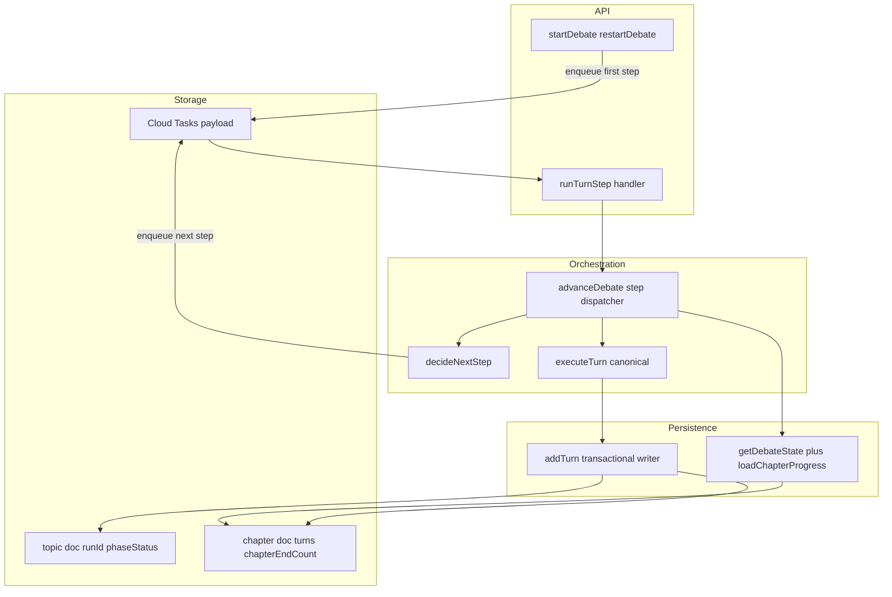
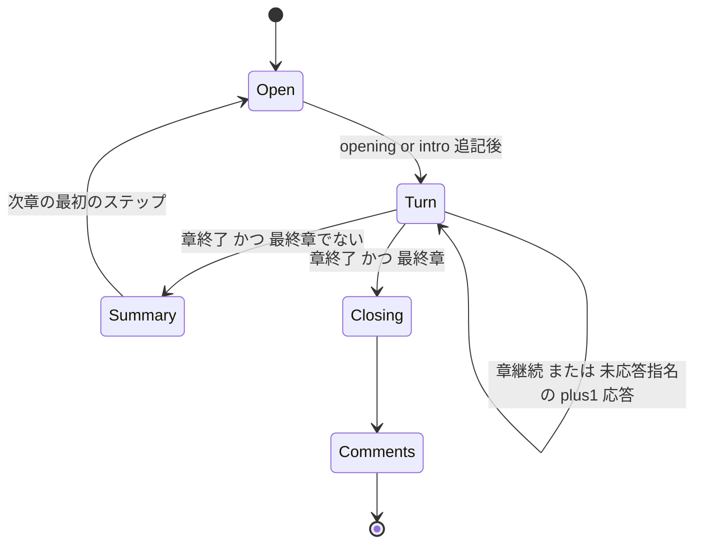
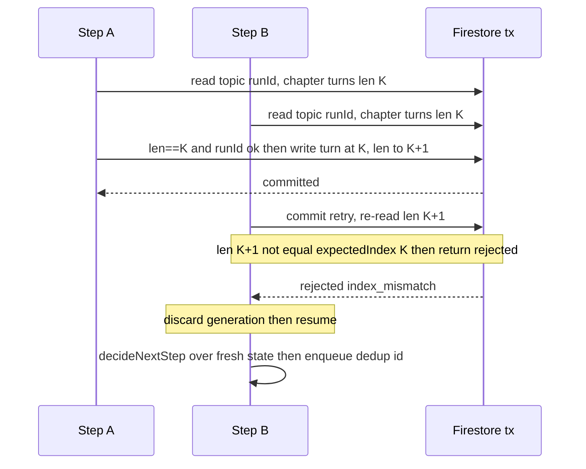
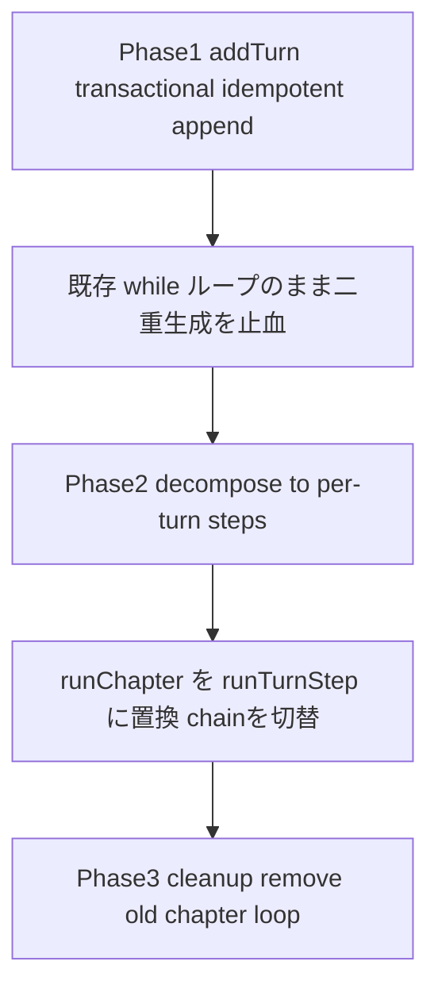

# Design Document: chapter-turn-task-decomposition

## Overview

**Purpose**: 討論のチャプター処理を「1チャプター=1 function 実行のターンループ」から「1ステップ=1 Cloud Tasks タスクの再入可能な処理」へ再構成し、各ターンが Firestore に高々1回だけ書き込まれることを保証する。これにより、同一 runId のリトライ／重複配信による二重生成（同じ発言者が連続する症状）を解消する。

**Users**: 討論パイプラインの運用者・管理者。討論生成の正確性（ターンの重複なし）と、`onTaskDispatched` 実質30分上限に縛られない安定動作を得る。

**Impact**: `executeChapterTask` の while ループを解体し、ステップ単位の再入可能関数とタスクチェーンに置き換える。ターン追記 `addTurn` を無条件 `arrayUnion` から**章ローカル `turns.length` を期待位置とする条件付きトランザクション追記**へ変更する。chapter doc に進捗フィールド `chapterEndCount` を追加する。

### Goals
- 各ターン位置（章ローカル index）が高々1回だけ永続化されることをトランザクションで保証する（冪等追記）。
- チャプター処理を1ステップ=1タスクに分解し、各タスクが永続データから状態を再構築して前進する。
- 再構成前後で討論ロジック（話者決定・介入・章終了・+1 応答）の行動を等価に保つ。
- 既存 `debate-run-isolation`（別 runId ガード）と `isDebateActive`（停止）を壊さず共存する。

### Non-Goals
- 旧 Cloud Function invocation の強制終了・キャンセル（Cloud Tasks 仕様上不可）。
- 別 runId 間の競合解決（`debate-run-isolation` の責務）。
- LLM 生成内容の決定性（同一入力でも文言は変わりうる）。
- ターンのサブコレクション化など chapter doc データモデルの抜本変更（将来別 spec）。

## Boundary Commitments

### This Spec Owns
- チャプター処理の制御フロー（while ループ → ステップ単位の再入可能関数とタスクチェーン）。
- ターン追記の冪等性（章ローカル `turns.length` を期待位置とする条件付きトランザクション追記）。
- chapter doc の進捗フィールド `chapterEndCount`（生成・更新・後方互換）。
- per-turn ステップ用 Cloud Tasks ペイロードとハンドラ（`runTurnStep`）、およびステップ間チェーン。
- ステップ enqueue の冪等化（deterministic task id による dedup）と、frontier 不一致/rejected 時の resume による liveness 保証。
- 章継続/終了/次章/終端の判定を永続状態から行うロジック（`decideNextStep` の純粋性）。

### Out of Boundary
- `debate-run-isolation` の runId 世代照合ロジック（維持・内包するが、別世代ブロックの責務は本 spec が再定義しない）。
- `isDebateActive`（停止チェック）の責務。
- 話者選択・エンゲージメント評価・介入判定・ファシリテーター/ペルソナ生成の**アルゴリズム**（呼び出し方は変えるが中身は変えない）。
- postDebateComments / beliefs のデータ構造。

### Allowed Dependencies
- Firestore Admin SDK（トランザクション、chapter/topic doc）。
- Cloud Tasks（Firebase Functions v2 `onTaskDispatched`）。
- 既存モジュール: `getDebateState`、`selectSpeaker`、`engagement`、`intervention`、`facilitator-agent`、`persona-agent`、`queued-intents`、`debate-lifecycle`。
- `nanoid`（ターン id 生成、既存）。

### Revalidation Triggers
- `addTurn` のシグネチャ／戻り値型変更 → 全呼び出し元（turn.ts / intervention.ts）の更新が必要。
- Cloud Tasks ペイロード型変更 → `runTurnStep` ハンドラと enqueue 側の更新が必要。
- chapter doc スキーマ（`chapterEndCount` 追加）→ `restartChapter`（リセット）と読み取り側の更新が必要。
- ステップ種別（`TurnStepKind`）の追加・意味変更 → チェーン投入ロジックの再検証。
- task id の鍵（`runId:chapterId:frontierIndex`）や `decideNextStep` の純粋性を変える → dedup と resume の収束性が崩れるため再検証。

## Architecture

### Existing Architecture Analysis
- `startDebate`/`restartDebate` → `enqueueChapterTask` → `runChapter`(onTaskDispatched, 540s) → `executeChapterTask`（章 while ループ）→ `executeTurn`（正準1ターン）→ `addTurn`（`arrayUnion`）。
- `executeChapterTask` は冒頭で `getDebateState` により状態を1回ロードし、以降インメモリ state を進める。**並走時にこのインメモリ行進が2本に分岐**して全ターンを二重追記する（本不具合の機序）。
- `getDebateState` は turns + 永続 queuedIntents から `speakCount`/`silenceMap`/`lastSpeakerId`/`queuedIntents` を**決定論的に再構築**する（per-turn 化の土台）。
- ターンは chapter doc の `turns` 配列。index は章ローカル。`addTurn` の runId 照合は topic doc 別 get（追記と非原子）。
- 章終了カウンタ `chapterEndCount` のみ while ループ局所で復元元がない → **永続化**（gap-analysis 確定）。

### Architecture Pattern & Boundary Map

採用パターン: **再入可能ステップ + タスクチェーン（既存の章チェーンをターン粒度へ拡張）**。各ステップは「停止ゲート → 状態再構築 → frontier 判定（frontier なら 1ターン生成・冪等追記／非 frontier なら生成せず resume）→ deterministic id で次ステップ enqueue」を行う。



**Architecture Integration**:
- Selected pattern: 再入可能ステップ + タスクチェーン。長時間ループを排し、状態は毎回 Firestore から再構築。
- Domain/feature boundaries: 「制御フロー（advanceDebate/decideNextStep）」「冪等追記（addTurn）」「状態再構築（getDebateState + loadChapterProgress）」を分離。ターン**生成**は frontier の唯一勝者のみ。次ステップ **enqueue** は全タスクが行うが deterministic id の dedup で実体は1本に収束する。
- Existing patterns preserved: 章チェーン（enqueue 連鎖）、`getDebateState` 決定論再構築、runId ガード、停止ゲート、`Result` 型のエラー伝播。
- New components rationale: `advanceDebate`（ステップ dispatcher）と `runTurnStep`（per-turn タスク）は while ループの置換として必須。`addTurn` のトランザクション化は冪等性の単一ガードポイント。
- Steering compliance: アロー関数・型安全（`any` 不使用・判別共用体）・本番 Functions 直結（エミュレータ不使用）・既存ファイル配置に準拠。

### Dependency Direction
```
types/constants → debate-state(reconstruct) → addTurn(writer) → executeTurn/intervention → advanceDebate(dispatcher) → runTurnStep(handler/api)
```
各層は左方向のみ import する。`advanceDebate` は writer と turn ロジックに依存するが、ハンドラ/API には依存しない。

### Technology Stack

| Layer | Choice / Version | Role in Feature | Notes |
|-------|------------------|-----------------|-------|
| Backend / Services | Firebase Functions v2 (`onTaskDispatched`), Node.js 24, TypeScript strict | per-turn ステップ実行とチェーン | `runChapter` を `runTurnStep` へ置換 |
| Data / Storage | Firestore (Admin SDK transaction) | 条件付きターン追記・進捗・runId 照合 | `arrayUnion` → tx read-modify-write |
| Messaging / Events | Cloud Tasks (asia-northeast1) | ステップ間チェーン | ペイロードに stepKind/expectedTurnIndex 追加 |

> 逸脱: 既存は `arrayUnion` 無条件追記＋章単位タスク。本 spec はトランザクション条件付き追記＋ターン単位タスクへ変更（新規外部依存なし）。

## File Structure Plan

### Modified Files
- `functions/src/pipeline/debate/turn.ts` — `addTurn` をトランザクション条件付き追記（`expectedTurnIndex`・`progressPatch`・`runId` を同一 tx）へ変更し、`AppendResult` を返す。`generateFacilitatorTurn`/`generatePersonaTurn` は `expectedTurnIndex` を受け取り `AppendResult` を伝播。
- `functions/src/pipeline/debate/intervention.ts` — `persistInterventionTurn` を `expectedTurnIndex` 対応に変更、`AppendResult` 伝播。
- `functions/src/pipeline/debate/debate-orchestrator.ts` — `executeChapterTask`（while ループ）を撤去し、`advanceDebate`（1ステップ実行）と `decideNextStep`（次ステップ判定）に置換。章開始・章終了・終端・+1 応答を各ステップへ再配置。
- `functions/src/pipeline/debate/debate-state.ts` — `loadChapterProgress`（`chapterEndCount`・`discussionPointStatuses` 復元）を追加。`getDebateState` は据え置き（state.discussionPoints へ注入はハンドラ層で実施）。
- `functions/src/pipeline/debate/debate-lifecycle.ts` — `restartChapter` で `chapterEndCount` をリセット（`turns: []` と同時に削除）。
- `functions/src/api/debates.ts` — `runChapter` を `runTurnStep`（onTaskDispatched）へ置換。`enqueueTurnStep`（deterministic `id` dedup、`task-already-exists` を成功扱い）を追加。`startDebate`/`restartDebate` が最初のステップ（`open`）を enqueue。
- `functions/src/types/debate.types.ts` — `TurnStepKind`・`TurnStepPayload`・`AppendResult`・chapter 進捗型を追加。
- `functions/src/constants/debate.constants.ts` — 既存閾値を流用（変更なし想定）。

> ファイル新設は最小（中核ロジックは既存 `debate-orchestrator.ts` 内に再構成）。テストは `functions/src/tests/pipeline/debate/` 配下の既存配置に追加。

## System Flows

### ステップ状態遷移（章→ターン→終端）

- `Turn → Turn` は `decideNextStep` が「章継続（cap 未満かつ早期終了条件未成立）」または「章終了だが `getLastTargetPersona` 残存（+1 応答）」と判定した場合。
- 早期終了判定で論点未消化なら coverage 評価（LLM）を勝者タスク内で実行し、未消化が残れば `chapterEndCount` を 0 にして `Turn` 継続。

### 冪等追記シーケンス（並走2実行 A B が同じ index K を狙う）

- 敗者 B はトランザクション本体で不一致を検出し**例外を投げず rejected を返して正常コミット**（追記は1件のみ）。
- B はその後 **resume**: 最新状態から次ステップを再導出し deterministic id で enqueue する。A も同 id で enqueue 済みのため dedup され、実体は1本（liveness と no-fan-out の両立）。A が enqueue 前に死亡していた場合は B の enqueue がチェーンを復活させる。

## Requirements Traceability

| Requirement | Summary | Components | Interfaces | Flows |
|-------------|---------|------------|------------|-------|
| 1.1 | 1タスク≤1ターン | advanceDebate | `advanceDebate` | ステップ状態遷移 |
| 1.2 | 起動時に状態再構築 | State Reconstruction | `getDebateState`,`loadChapterProgress` | — |
| 1.3 | インメモリ非依存 | advanceDebate | `advanceDebate` | — |
| 1.4 | 成功時に次ステップ enqueue | advanceDebate, Task Layer | `decideNextStep`,`enqueueTurnStep` | ステップ状態遷移 |
| 2.1 | 期待位置をタスクが保持 | Task Layer, Turn Writer | `TurnStepPayload` | 冪等追記 |
| 2.2 | 照合と追記の原子性 | Turn Writer | `addTurn` | 冪等追記 |
| 2.3 | 同一 index は1つだけ成功 | Turn Writer | `addTurn` | 冪等追記 |
| 2.4 | 各位置≤1ターン | Turn Writer | `addTurn` | 冪等追記 |
| 3.1 | 既埋め位置の検出で no-op | advanceDebate, Turn Writer | `advanceDebate`,`AppendResult` | 冪等追記 |
| 3.2 | 正常終了・停止しない | advanceDebate | `advanceDebate` | — |
| 3.3 | リトライ誘発せず重複 enqueue なし | advanceDebate | `advanceDebate` | 冪等追記 |
| 4.1 | 進行判定を永続状態から | decideNextStep | `decideNextStep` | ステップ状態遷移 |
| 4.2 | ファシリテーターターンも同一照合 | Turn Writer | `addTurn` | 冪等追記 |
| 4.3 | 完了章を二重 finalize しない | decideNextStep, Task Layer | `decideNextStep` | ステップ状態遷移 |
| 4.4 | 終端の重複生成なし | Finalize Step | `performClosing`,`performComments` | ステップ状態遷移 |
| 5.1 | 話者/介入/終了カウントの等価 | decideNextStep, executeTurn | `decideNextStep` | — |
| 5.2 | +1 応答の意味論等価 | decideNextStep | `decideNextStep` | ステップ状態遷移 |
| 5.3 | 1ターン処理の論理等価 | advanceDebate, executeTurn | `advanceDebate` | — |
| 6.1 | runId ガード維持＋冪等追加 | Turn Writer | `addTurn` | 冪等追記 |
| 6.2 | 既存ガードと独立責務 | Turn Writer | `addTurn` | — |
| 6.3 | メタ欠如時は照合スキップ | Turn Writer | `addTurn` | — |
| 7.1 | 順次実行で脱落なし | Turn Writer | `addTurn` | — |
| 7.2 | 拒否は実並走時のみ | Turn Writer | `addTurn` | 冪等追記 |

## Components and Interfaces

| Component | Domain/Layer | Intent | Req Coverage | Key Dependencies (P0/P1) | Contracts |
|-----------|--------------|--------|--------------|--------------------------|-----------|
| Turn Writer (`addTurn`) | Persistence | 条件付き原子追記＋runId＋進捗を1 tx | 2,3,4,6,7 | Firestore tx (P0) | Service, State |
| State Reconstruction | Persistence | 永続データから状態復元 | 1 | getDebateState (P0), Firestore (P0) | Service |
| advanceDebate | Orchestration | 1ステップ実行（再入可能） | 1,3,5 | Turn Writer (P0), executeTurn (P0) | Service |
| decideNextStep | Orchestration | 次ステップ判定（永続状態駆動） | 4,5 | constants (P1) | Service |
| Finalize Step | Orchestration | 終端の冪等処理 | 4 | Firestore tx (P0) | Service, State |
| Task Layer | API | per-turn タスクとチェーン | 1,2,3,4 | Cloud Tasks (P0) | Batch |

### Persistence

#### Turn Writer (`addTurn`)

| Field | Detail |
|-------|--------|
| Intent | 章ローカル `turns.length === expectedTurnIndex` のときだけ1ターン追記し、runId 照合と進捗更新を同一トランザクションで行う |
| Requirements | 2.1, 2.2, 2.3, 2.4, 3.1, 4.2, 6.1, 6.2, 6.3, 7.1, 7.2 |

**Responsibilities & Constraints**
- 単一ガードポイント: すべてのターン追記（opening/intro/intervention/persona/summary/closing）がこの関数を通る。
- トランザクション境界: topic doc（runId 読取）+ chapter doc（turns・chapterEndCount・discussionPointStatuses 読取/書込）を1トランザクション。**そのステップが起こす全状態変更（ターン追記 + 進捗カウンタ + 論点ステータス）を同一 tx に畳む**ことで、部分失敗による desync を排除する（Issue 2）。
- LLM 生成（発言・coverage 評価）は tx の**外**（前段の純計算）で行い、tx 内では index/runId 照合と write のみ。tx が rejected の場合、生成結果は破棄される（無駄だが整合は保たれる）。
- 不変条件: 各章ローカル index に対し永続ターンは高々1件。
- 後方互換: `runId` がペイロード or topic doc に無ければ世代照合をスキップ（6.3）。`chapterEndCount` 未設定は 0 とみなす。

**Dependencies**
- Outbound: Firestore transaction — 条件付き read-modify-write（P0）
- Inbound: advanceDebate / executeTurn / persistInterventionTurn — 唯一の追記経路（P0）

**Contracts**: Service [x] / State [x]

##### Service Interface
```typescript
type AppendResult =
  | { status: 'committed'; id: string }
  | { status: 'rejected'; reason: 'index_mismatch' | 'generation_mismatch' | 'debate_inactive' };

interface AppendTurnInput {
  topicId: string;
  chapterId: string;
  expectedTurnIndex: number;          // 章ローカル turns.length の期待値
  turn: NewTurnFields;                // speakerType/content/personaId/targetPersonaId 等
  runId?: string;                     // 無ければ世代照合スキップ
  // そのステップの進捗・論点ステータス変更をまとめて同一 tx で書く（Issue 2）
  progressPatch?: {
    chapterEndCount?: number;                          // TURN ステップで更新
    discussionPointStatuses?: DiscussionPointStatus[]; // open/coverage で更新
  };
}

declare const addTurn: (input: AppendTurnInput) => Promise<AppendResult>;
```
- Preconditions: `expectedTurnIndex >= 0`。`turn` は検証済み（targetPersonaId は呼び出し側で `validPersonaId`、自己指名は undefined 化）。
- Postconditions: `committed` 時のみ chapter doc の `turns` が 1 件増え、`progressPatch` 指定分（`chapterEndCount`・`discussionPointStatuses`）が同一 tx で更新される。`rejected` 時は副作用なし。
- Invariants: 章ローカル index と永続ターン数の一致。runId 不一致・index 不一致では書き込まない。

##### State Management
- State model: chapter doc `{ turns: DebateTurn[], chapterEndCount?: number, discussionPointStatuses?: [...] }`。
- Persistence & consistency: 追記と進捗は同一トランザクション。敗者は本体で sentinel を返して no-op コミット（リトライ地獄回避）。
- Concurrency strategy: 楽観的並行制御（index を版数代わりに使用）。競合は「1勝者 + 敗者 rejected」に収束。

#### State Reconstruction

| Field | Detail |
|-------|--------|
| Intent | 各ステップ起動時に永続データから `DebateState` と章進捗を復元する |
| Requirements | 1.2, 1.3 |

**Contracts**: Service [x]

##### Service Interface
```typescript
interface ChapterProgress {
  chapterEndCount: number;                       // 未設定時 0
  discussionPointStatuses: DiscussionPointStatus[]; // 未設定時は chapter.discussionPoints から untouched 初期化
}

declare const loadChapterProgress: (
  topicId: string,
  chapterId: string,
  chapter: Chapter
) => Promise<ChapterProgress>;
```
- Postconditions: `getDebateState(turns, personas, queuedIntents)` の結果に `discussionPoints` と `chapterEndCount` を注入して、while ループ版と等価な state を得る。
- Invariants: 同一入力 → 同一出力（決定論）。

### Orchestration

#### advanceDebate（ステップ dispatcher）

| Field | Detail |
|-------|--------|
| Intent | 停止ゲート→状態再構築→（frontier なら生成・追記／非 frontier なら resume）→次ステップ enqueue を1タスクで行う |
| Requirements | 1.1, 1.3, 1.4, 3.1, 3.2, 3.3, 5.3 |

**Responsibilities & Constraints**
- 1タスク=1ステップ=≤1ターン追記。1ターンの生成（LLM）は**自分が frontier のときだけ**行う。
- **早期 resume（Issue 1）**: 再構築直後に章ローカル `turns.length !== payload.expectedTurnIndex` なら、LLM 生成はせず（門前払い）、**現在の永続状態から `decideNextStep` で次ステップを再導出し、deterministic id で enqueue（resume）してから正常終了**する。pure no-op にしない。
  - 理由: 「追記成功直後・次 enqueue 前にクラッシュ」した場合でも、リトライ／重複タスクがチェーンを再駆動できる（liveness 保証）。
- **rejected 時も resume**: `addTurn` が `index_mismatch`/`generation_mismatch` を返したら、生成物は破棄し、最新状態を読み直して `decideNextStep` → enqueue（resume）して正常終了。
- **enqueue は常に deterministic id（後述）で冪等化**。重複 enqueue は dedup で1本に収束するため、resume による多重投入は fan-out しない（3.3）。
- 例外時のみ throw（Cloud Tasks リトライ対象）。停止・resume・no-op は throw しない（3.2）。

**Contracts**: Service [x]

##### Service Interface
```typescript
type TurnStepKind = 'open' | 'turn' | 'summary' | 'closing' | 'comments';

interface TurnStepPayload {
  topicId: string;
  chapterIndex: number;
  runId: string;
  stepKind: TurnStepKind;
  expectedTurnIndex: number;   // 'comments' では未使用（-1 等）
  singleChapterMode?: boolean;
}

// 戻り値: 生成して追記したか（観測用）。停止/resume/rejected は false。
declare const advanceDebate: (payload: TurnStepPayload) => Promise<boolean>;
```
- Preconditions: `isDebateActive(topicId)` を冒頭で確認。false なら即 return false（3.2）。
- Postconditions: frontier かつ committed のときのみターンを生成・追記する。**生成有無に関わらず、停止でない限り `decideNextStep` の結果を deterministic id で高々1件 enqueue**（dedup により実体は at-most-once）。

**Implementation Notes**
- Integration: 既存 `executeTurn` の正準ロジックを `stepKind==='turn'` の本体として再利用（5.3）。`generateFacilitatorTurn`/`generatePersonaTurn`/`persistInterventionTurn` に `expectedTurnIndex` と `progressPatch` を渡す。
- Validation: `expectedTurnIndex` が再構築した章ローカル長と一致するときのみ生成。不一致は resume。
- Risks: resume が `decideNextStep` を**最新の永続状態**から計算すること（古い state で計算すると誤った frontier を投入しうる）。rejected 後は state を読み直す。

#### decideNextStep（次ステップ判定）

| Field | Detail |
|-------|--------|
| Intent | 追記成功後、永続状態から次ステップ種別と expectedTurnIndex を決める |
| Requirements | 4.1, 4.3, 5.1, 5.2 |

**Responsibilities & Constraints**
- 章継続/章終了/次章/終端の判定を、while ループ版と等価な規則で行う（5.1）。
  - 継続条件: `chapterTurnCount < cap` かつ `globalTurns < maxTurns` かつ（早期終了未成立 または 早期終了だが coverage 未消化で継続）。
  - 早期終了: `chapterTurnCount >= ceil(turnsPerChapter * EARLY_END_PROGRESS_RATIO)` かつ `chapterEndCount >= CHAPTER_END_COUNT_LIMIT` で coverage 評価（勝者タスク内）。未消化が残れば `chapterEndCount=0` 永続化して継続。
- +1 応答: 章終了と判定しても `getLastTargetPersona(state)` が残る場合は `turn`（最終応答）を1回挟んでから終了（5.2）。
- 完了済み章（`status==='completed'`）には次ステップを投入しない（4.3）。
- **純粋性（resume の前提）**: `decideNextStep` は引数（永続状態）のみに依存する純関数とする。これにより、同じ frontier を観測した複数の enqueuer（勝者・敗者・リトライ）が**同一の次ステップ種別・expectedTurnIndex**を計算し、deterministic id が一致して dedup される。状態に依らない乱数・時刻・外部 I/O を判定に持ち込まない。

**Contracts**: Service [x]

##### Service Interface
```typescript
type NextStep =
  | { kind: 'turn'; expectedTurnIndex: number }
  | { kind: 'summary'; expectedTurnIndex: number }
  | { kind: 'closing'; expectedTurnIndex: number }
  | { kind: 'open'; chapterIndex: number; expectedTurnIndex: 0 } // 次章
  | { kind: 'comments' }
  | { kind: 'none' };                                            // 終端後・停止

declare const decideNextStep: (args: {
  state: DebateState;
  chapter: Chapter;
  chapterIndex: number;
  options: DebateOptions;
  isLastChapter: boolean;
}) => NextStep;
```

#### Finalize Step（performClosing / performComments）

| Field | Detail |
|-------|--------|
| Intent | クロージング追記と事後コメント生成を冪等に行う |
| Requirements | 4.4 |

**Responsibilities & Constraints**
- `closing`: クロージングをファシリテーターターンとして `addTurn`（index 照合）で追記 → `comments` を enqueue。重複は index 不一致で弾かれる。
- `comments`: 事後コメントを生成し `postDebateComments/0` を set、`phaseStatus` を `generated` に**トランザクションで遷移**（`phaseStatus==='running'` のときだけ）。既に `generated` なら no-op（4.4）。

**Contracts**: Service [x] / State [x]

### API

#### Task Layer（runTurnStep / enqueueTurnStep）

| Field | Detail |
|-------|--------|
| Intent | per-turn ステップを Cloud Tasks で実行・連鎖する |
| Requirements | 1.4, 2.1, 3.3, 4.3 |

**Contracts**: Batch [x]

##### Batch / Job Contract
- Trigger: `onTaskDispatched`（`runTurnStep`, region asia-northeast1, `retryConfig.maxAttempts`, secrets 既存）。
- Input / validation: `TurnStepPayload`。`runId` 欠如は後方互換でガードスキップ。
- Output / destination: chapter doc への1ターン追記 + 次ステップ enqueue（`enqueueTurnStep`）。
- Idempotency & recovery: `advanceDebate` が冒頭で停止ゲート＋frontier 照合、`addTurn` が原子照合。非 frontier・rejected は resume（次ステップを再投入）で liveness を維持。最終リトライ失敗時のみ `markDebateStopped`。

##### Deterministic Enqueue（dedup id）
`enqueueTurnStep` は Cloud Tasks の `id`（`TaskOptions.id`）でタスクを冪等化する。

```typescript
// frontierIndex = 投入先ステップの章ローカル expectedTurnIndex
// 終端 comments は index を持たないため種別ベースの鍵
const taskKey = (p: { runId: string; chapterId: string; frontierIndex: number | 'comments' }): string => `${p.runId}:${p.chapterId}:${p.frontierIndex}`;
// SDK 推奨に従い hash 化（連番そのままはレイテンシ悪化のため）
declare const enqueueTurnStep: (payload: TurnStepPayload, taskKey: string) => Promise<void>;
```
- id = `hash(taskKey)`。同一 (runId, chapterId, frontierIndex) は**同一 id** に決まる。
- 同一 id のタスクが既に存在/最近実行済みなら SDK は `functions/task-already-exists` を投げる → **catch して成功扱い（no-op）**。これにより resume の多重投入が1本に dedup される。
- `runId` を鍵に含めることで、`restartChapter`（新 runId）が約1時間の id 予約と衝突しない。
- 通常前進では index が単調増加するため id は毎回別物（dedup は発火しない）。**同一 id になるのは並走・重複配信・リトライの瞬間のみ**で、まさに止めたい多重 enqueue だけを潰す。

## Data Models

### Physical Data Model（Firestore）
chapter doc `topics/{topicId}/chapters/{chapterId}` に進捗フィールドを追加:

| Field | Type | 説明 |
|-------|------|------|
| `turns` | `DebateTurn[]` | 既存。条件付き追記対象。章ローカル index = 配列位置 |
| `chapterEndCount` | `number` (optional) | **新規**。連続低意欲ターン数。未設定=0。追記 tx で更新。`restartChapter` で削除 |
| `discussionPointStatuses` | `[{point,status}]` (optional) | 既存。`open`/coverage ステップで更新、ステップ起動時に復元 |
| `status` | `pending\|running\|completed` | 既存。終端冪等の補助ガード |

> 既存ターンには index メタを付与しない（章ローカル `turns.length` を sequence number として用いるため後方互換）。

### Data Contracts & Integration
- Cloud Tasks ペイロード `TurnStepPayload`（上記）。`chapterIndex`/`runId`/`singleChapterMode` は既存踏襲、`stepKind`/`expectedTurnIndex` を追加。
- `AppendResult` 判別共用体で追記結果を呼び出し側へ返す（throw しない）。

## Error Handling

### Error Strategy
- **重複・陳腐（業務正常系）**: frontier 不一致または `addTurn` の `rejected` → 生成物を破棄し、最新状態から resume（dedup id で次ステップ投入）して正常終了。throw しない（3.2, 3.3）。
- **`task-already-exists`（enqueue dedup）**: resume が既存タスクと衝突したシグナル → catch して成功扱い（多重投入を1本に収束）。
- **LLM/外部失敗（System 5xx）**: 既存どおり `Result` で `AI_API_ERROR`（retryable）を伝播し throw → Cloud Tasks がリトライ。リトライは同 `expectedTurnIndex` で再実行され冪等。
- **世代不一致（runId）**: `rejected: generation_mismatch` → 正常終了（旧世代の混入防止、`debate-run-isolation` と整合）。resume も同 runId の id を作るため旧世代がチェーンを乗っ取ることはない。

### Error Categories and Responses
- User Errors: なし（管理者起動のバックグラウンド処理）。
- System Errors: LLM 失敗・Firestore 障害 → throw → リトライ。最終リトライ失敗で `markDebateStopped`。
- Business Logic: index/generation mismatch → rejected（no-op）。

### Monitoring
- 観測: `rejected` 件数（reason 別）・resume 回数・`task-already-exists`（dedup ヒット）をログ出力し、並走/重複配信の発生を可視化。ステップ enqueue/完了をログ。

## Testing Strategy

### Unit Tests
- `addTurn`: index 一致で committed / 不一致で `index_mismatch` / runId 不一致で `generation_mismatch` / runId 欠如で照合スキップ。
- `decideNextStep`: 継続・cap 到達・早期終了（coverage 消化/未消化）・最終章 closing・+1 応答（未応答指名残存）の各分岐。
- `loadChapterProgress`: `chapterEndCount` 未設定=0 復元、discussionPointStatuses 復元、決定論性。
- `advanceDebate`: 停止ゲート return / frontier 不一致で生成せず resume / rejected で resume / deterministic id で enqueue。
- `enqueueTurnStep`: 同一 (runId, chapterId, frontierIndex) が同一 id を生成 / `task-already-exists` を成功扱いにする。

### Integration Tests
- 冪等追記: 同一 `expectedTurnIndex` で2回 `advanceDebate` を走らせ、ターンが1件のみ・2回目は生成せず resume。
- 並走シミュレーション: 同一状態から2ステップを実行し、各 index に1ターンのみ。両者が同 id を enqueue し dedup で後続が1本に収束すること。
- liveness（resume）: 「追記コミット済みだが次 enqueue 前」状態を再現し、リトライ/重複タスクが resume で後続を投入してチェーンが復活すること。
- 終端冪等: `comments` を2回実行しても postDebateComments が重複せず `phaseStatus` 二重遷移しない。

### Behavior Parity（行動等価性, 5.1–5.3）
- 決定論ハーネス: LLM エージェント（`generateTurn`/`evaluateEngagement`/facilitator 系）をスクリプト化したモックに差し替え、**旧 while ループ版と新 per-turn チェーン版**を同一スクリプトで実行し、ターン列（speaker/mode/targetPersonaId/fromQueue/順序）が一致することを検証。
- 介入・章終了カウント・+1 応答の各シナリオで等価性を確認。

## Migration Strategy


- **Phase 1（止血・小）**: `addTurn` を条件付きトランザクション追記へ変更し、`generatePersonaTurn`/`persistInterventionTurn`/`generateFacilitatorTurn` が `expectedTurnIndex`（既存ループでは `state.turns` の章ローカル長）を渡し `rejected` で当該章処理を打ち切る。→ **現行構造のままでも二重生成が停止**（R2/R3/R6/R7）。
- **Phase 2（構造変更）**: `advanceDebate`/`decideNextStep`/`runTurnStep`/`enqueueTurnStep`/`loadChapterProgress` を導入し、`startDebate`/`restartDebate` を最初の `open` ステップ投入に切替。`chapterEndCount` 永続化。→ R1/R4/R5。
- **Phase 3（クリーンアップ）**: 旧 `executeChapterTask`/`runChapter`/`enqueueChapterTask` を撤去し単一経路へ収束。`restartChapter` の `chapterEndCount` リセットを確認。
- Rollback: Phase 2 で問題時は Phase 1 状態（冪等追記済みの章ループ）へ戻せる。

## Performance & Scalability
- ターン間に Cloud Tasks dispatch + コールドスタートのレイテンシが加わる（背景生成のため許容）。1ステップは数十秒で30分上限に達しない（[[project-task-timeout-30min-cap]] の制約から解放）。
- **書込増幅（Issue 3・許容判断）**: `arrayUnion`（サーバサイド追記）→ tx での全配列 read-modify-write に変わり、ターン毎に増大する配列を書き直す。ただし1章のターン数は有界（`TURNS_PER_CHAPTER=15` × `AGENDA_TURN_CAP_RATIO=2.5` ≈ 最大37、`+1` 応答含む）で、配列サイズ・書込量・1MiB 上限とも当面安全。よって full-array RMW を許容する。長期的なターンのサブコレクション化は別 spec（follow-up）。
- **dedup id のコスト**: `TaskOptions.id` 指定は重複検出のため enqueue レイテンシが増す。SDK 推奨に従い id は hash 化し連番プレフィックスを避ける。dedup ヒット（`task-already-exists`）は並走時のみで定常負荷にはならない。
- トランザクション競合は「1勝者+敗者 rejected」に収束し安全。
