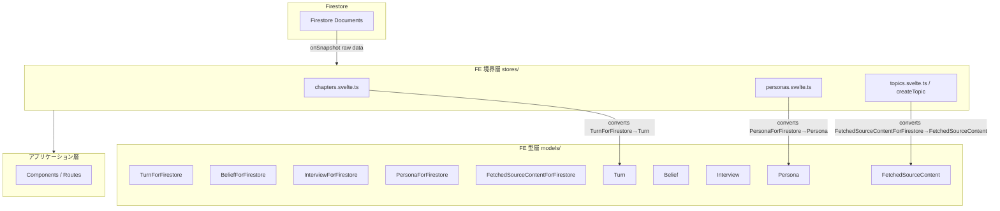

# Design Document: chapter-type-unification

## Overview

FE（`src/lib/models/`）と functions（`functions/src/types/`）全体で `*Doc` サフィックスが混在する型命名を整理し、Firestore 永続型は `*ForFirestore`、アプリケーション内型（Date 変換済み）はサフィックスなし（または用途を示す既存名）に統一する。

Timestamp を含む型には既存の `TurnDoc` / `Turn` パターン（`Omit<*ForFirestore, 'dateField'> & { dateField: Date }`）を適用し、Firestore 境界で自動変換する。Timestamp を含まない型は単純なリネームで完結する。

**Users**: 開発者。型名からその型の役割（Firestore 境界 vs アプリ内）が自明になり、認知負荷が下がる。

### Goals

- 全 `*Doc` 型を `*ForFirestore` にリネームする
- Timestamp 含有型に Date 変換版アプリ型を追加する（`Belief`・`Interview`・`FetchedSourceContent`）
- `PersonaForFirestore` / `Persona` のカスケード変換をストアに実装する
- FE / functions の `DiscussionPointState` 命名を統一する
- 型チェックとテストがゼロエラーで通過する

### Non-Goals

- 型の構造（フィールド名・型・省略可否）の変更
- Firestore スキーマ・セキュリティルールの変更
- `Topic` / `createTopicStates` の Svelte state パターン変更
- 新機能追加

## Boundary Commitments

### This Spec Owns

- `src/lib/models/` 配下の型定義ファイルのリネームとアプリ型追加
- `personas.svelte.ts` の Timestamp→Date 変換追加
- `createTopic.svelte.ts` の `fetchedSourceContents` 変換追加
- `functions/src/types/` の `ChapterStateData`・`ChapterAnalysisDoc` リネーム
- 型参照側（ストア・テスト）の import / 型アノテーション更新
- ストア境界外（コンポーネント・ルート）に残存する `.toDate()` 呼び出しの発見と除去（`grep -r '\.toDate()'` でスキャン）

### Out of Boundary

- `Topic` 型（`createTopicStates` 戻り値型）の構造変更
- ストアの公開 API（メソッド名・戻り値）の変更
- functions pipeline / API コードの変更（`ChapterStateData` は未使用）

### Allowed Dependencies

- `firebase/firestore` の `Timestamp`（既存依存）
- SvelteKit `$lib` エイリアス

### Revalidation Triggers

- `Timestamp` を含む新規型を追加した際、`*ForFirestore` + アプリ型の2種類作成が必要
- `PersonaForFirestore` の構造変更時、`Persona` と変換ロジックの更新が必要

## Architecture

### Existing Architecture Analysis

プロジェクトは既に `TurnDoc` / `Turn` ペアで Firestore 境界変換パターンを確立している。`chapters.svelte.ts` は Firestore からの読み取り時に `Turn.createdAt: Timestamp` を `Date` へ変換し、`Chapter[]` として公開する。現在は `ChapterForFirestore` が存在しないため inline の `RawChapter` 型で代替しているが、本設計で `ChapterForFirestore` を正式定義することでこの inline 型は不要になる。また同パターンを `BeliefForFirestore`・`InterviewForFirestore`・`FetchedSourceContentForFirestore` など全 Timestamp 含有型に拡張する。

### Architecture Pattern & Boundary Map



**Key Decisions**:
- Firestore read/write は `*ForFirestore` 型を使用し、ストアが変換してアプリ型を公開する
- ストア外には `*ForFirestore` 型は露出しない
- Timestamp を含まない型（`ChapterForFirestore`・`DiscussionPointState` 等）は変換不要

### Technology Stack

| Layer | Choice / Version | Role in Feature |
|-------|-----------------|-----------------|
| 型定義 | TypeScript strict mode | `*ForFirestore` + アプリ型の定義 |
| Firestore 境界 | `firebase/firestore` Timestamp | ForFirestore 型のフィールド型 |
| ストア | SvelteKit `$state` | 変換後のアプリ型を保持 |

## File Structure Plan

### Modified Files（FE）

| ファイル | 変更内容 |
|---------|---------|
| `src/lib/models/turn/turn.types.ts` | `TurnDoc` → `TurnForFirestore`（`Turn` は構造変更なし） |
| `src/lib/models/chapter/chapter.types.ts` | `ChapterDoc` → `ChapterForFirestore`、`ChapterAnalysisDoc` → `ChapterAnalysisForFirestore`、`DiscussionPointStatusDoc` → `DiscussionPointState`、`Chapter` の Omit 参照更新 |
| `src/lib/models/persona/persona.types.ts` | `BeliefDoc` → `BeliefForFirestore` + `Belief`（新規）、`InterviewDoc` → `InterviewForFirestore` + `Interview`（新規）、`PersonaDoc` → `PersonaForFirestore` + `Persona`（新規） |
| `src/lib/models/topic/topic.types.ts` | `TopicDoc` → `TopicForFirestore`、`TopicBase` → `TopicBaseForFirestore`（ファイル内のみ）、`StakeholderDoc` → `StakeholderForFirestore`、`FetchedSourceContent` → `FetchedSourceContentForFirestore` + `FetchedSourceContent`（Date版・新規） |
| `src/lib/models/engagement/engagement.types.ts` | `EngagementDoc` → `EngagementForFirestore` |
| `src/lib/models/postDebateComment/postDebateComment.types.ts` | `PostDebateCommentDoc` → `PostDebateCommentForFirestore`、`PostDebateCommentsDoc` → `PostDebateCommentsForFirestore` |
| `src/lib/stores/chapters.svelte.ts` | `TurnDoc` → `TurnForFirestore`、`ChapterDoc` → `ChapterForFirestore` の import 更新、inline の `RawTurn`・`RawChapter` 型を削除して `ChapterForFirestore` で直接キャスト |
| `src/lib/stores/personas.svelte.ts` | `PersonaDoc` → `PersonaForFirestore`、`Persona` を import 追加、変換ロジック追加 |
| `src/lib/stores/chapterAnalysis.svelte.ts` | `ChapterAnalysisDoc` → `ChapterAnalysisForFirestore` |
| `src/lib/stores/topics.svelte.ts` | `TopicDoc` → `TopicForFirestore` |
| `src/lib/stores/stakeholders.svelte.ts` | `StakeholderDoc` → `StakeholderForFirestore` |
| `src/lib/stores/postDebateComments.svelte.ts` | `PostDebateCommentDoc` → `PostDebateCommentForFirestore`、`PostDebateCommentsDoc` → `PostDebateCommentsForFirestore` |
| `src/lib/models/topic/createTopic.svelte.ts` | `TopicDoc` → `TopicForFirestore`、`FetchedSourceContent` → `FetchedSourceContentForFirestore`（引数型）、`fetchedSourceContents` の Timestamp→Date 変換を追加 |
| `src/tests/stores/chapters.test.ts` | `ChapterDoc` → `ChapterForFirestore` |
| `src/tests/stores/chapterAnalysis.test.ts` | `ChapterAnalysisDoc` → `ChapterAnalysisForFirestore` |
| `src/tests/stores/stakeholders.test.ts` | `StakeholderDoc` → `StakeholderForFirestore` |
| `src/tests/models/chapter/chapter.types.test.ts` | `ChapterDoc` → `ChapterForFirestore`、`ChapterAnalysisDoc` → `ChapterAnalysisForFirestore` |

### Modified Files（functions）

| ファイル | 変更内容 |
|---------|---------|
| `functions/src/types/debate.types.ts` | `ChapterStateData` → `ChapterForFirestore`、`DiscussionPointState` はそのまま維持 |
| `functions/src/types/chapter.types.ts` | `ChapterAnalysisDoc` → `ChapterAnalysisForFirestore` |
| `functions/src/tests/types/debate.types.test.ts` | `ChapterStateData` → `ChapterForFirestore` の参照更新 |

## Requirements Traceability

| Requirement | Summary | 主な変更ファイル |
|-------------|---------|--------------|
| 1.1–1.5 | 全 `*Doc` → `*ForFirestore` リネーム | 全 `models/*/types.ts`、参照ストア・テスト |
| 2.1 | `Belief`（Date版）追加 | `persona/persona.types.ts` |
| 2.2 | `Interview`（Date版）追加 | `persona/persona.types.ts` |
| 2.3 | `FetchedSourceContent`（Date版）追加 | `topic/topic.types.ts` |
| 2.4 | Omit パターン適用 | `persona/persona.types.ts`、`topic/topic.types.ts` |
| 2.5 | Timestamp なし型はアプリ型なし | 設計制約として文書化 |
| 3.1 | `PersonaForFirestore` 定義 | `persona/persona.types.ts` |
| 3.2 | `Persona`（Date版）定義 | `persona/persona.types.ts` |
| 3.3–3.4 | ストアで変換実装 | `personas.svelte.ts` |
| 3.5 | ストア外は `Persona` のみ公開 | `personas.svelte.ts` |
| 4.1–4.4 | `DiscussionPointState` に統一 | `chapter/chapter.types.ts`（FE）、`debate.types.ts`（functions）は変更なし |
| 5.1–5.4 | 型チェック・テスト全件通過 | 全修正ファイル |

## Components and Interfaces

| コンポーネント | 種別 | 変更 | 要件 |
|------------|------|------|------|
| `turn.types.ts` | 型定義 | `TurnDoc` → `TurnForFirestore`リネーム | 1.1 |
| `chapter.types.ts` (FE) | 型定義 | 3型リネーム + `DiscussionPointState` 統一 | 1.1, 4.1 |
| `persona.types.ts` | 型定義 | 3型リネーム + `Belief`・`Interview`・`Persona` 追加 | 1.1, 2.1, 2.2, 3.1, 3.2 |
| `topic.types.ts` | 型定義 | 2型リネーム + `FetchedSourceContent`（Date版）追加 | 1.1, 2.3 |
| `personas.svelte.ts` | ストア | 変換ロジック追加 | 3.3, 3.4, 3.5 |
| `createTopic.svelte.ts` | モデル | FetchedSourceContent 変換追加 | 2.3 |

### 型定義層（FE: `src/lib/models/`）

#### turn/turn.types.ts

**Contracts**: State [ ✓ ]

```typescript
type TurnForFirestore = {
  id: string;
  speakerType: SpeakerType;
  personaId?: string;
  content: string;
  createdAt: Timestamp;        // Firestore 境界
  speechMode?: 'opinion' | 'fact';
  engagementScore?: number;
  fromQueue?: boolean;
  targetPersonaId?: string;
};

type Turn = Omit<TurnForFirestore, 'createdAt'> & { createdAt: Date };  // 変更なし
```

#### persona/persona.types.ts

**Contracts**: State [ ✓ ]

```typescript
type BeliefForFirestore = {
  id: string;
  version: number;
  content: string;
  changeType?: BeliefChangeType;
  changeSummary?: string;
  triggeredByTurnId?: string;
  createdAt: Timestamp;        // Firestore 境界
};
type Belief = Omit<BeliefForFirestore, 'createdAt'> & { createdAt: Date };

type InterviewForFirestore = {
  researchSummary?: string;
  interviewRecord?: string;
  status: 'queued' | 'in_progress' | 'completed' | 'error';
  errorMessage?: string;
  completedAt?: Timestamp;     // Firestore 境界
};
type Interview = Omit<InterviewForFirestore, 'completedAt'> & { completedAt?: Date };

type PersonaForFirestore = {
  id: string;
  topicId: string;
  // ... その他フィールド（Timestamp なし）
  interview?: InterviewForFirestore;
  beliefs: BeliefForFirestore[];
};
type Persona = Omit<PersonaForFirestore, 'interview' | 'beliefs'> & {
  interview?: Interview;
  beliefs: Belief[];
};
```

- Preconditions: `PersonaForFirestore` は Firestore から読んだ生データ
- Postconditions: `Persona` は `beliefs[].createdAt` と `interview?.completedAt` が `Date` に変換済み

#### topic/topic.types.ts

**Contracts**: State [ ✓ ]

```typescript
type FetchedSourceContentForFirestore = {
  url: string;
  content: string;
  fetchedAt: Timestamp;        // Firestore 境界
};
type FetchedSourceContent = Omit<FetchedSourceContentForFirestore, 'fetchedAt'> & {
  fetchedAt: Date;
};

type TopicBaseForFirestore = {   // ファイル内部のみ、export はしない
  id: string;
  title: string;
  // ...
  fetchedSourceContents?: FetchedSourceContentForFirestore[];
  sourceContentsFetchedAt?: Timestamp;
  // ...
};

type TopicForFirestore = TopicBaseForFirestore & {
  createdAt: Timestamp;
  updatedAt: Timestamp;
  publishedAt?: Timestamp;
};
// Topic は createTopicStates の ReturnType として実質定義済み（変更なし）
```

#### chapter/chapter.types.ts (FE)

**Contracts**: State [ ✓ ]

```typescript
type DiscussionPointState = {   // 旧 DiscussionPointStatusDoc
  point: string;
  status: DiscussionPointStatus;
};

type ChapterForFirestore = {
  chapterIndex: number;
  title: string;
  focusQuestion: string;
  discussionPoints: string[];
  turns: TurnForFirestore[];
  discussionPointStatuses?: DiscussionPointState[];
  status: ChapterProgressStatus;
};

type Chapter = Omit<ChapterForFirestore, 'turns'> & {   // 変更なし
  id: string;
  turns: Turn[];
};

type ChapterAnalysisForFirestore = {
  issues: Issue[];
  issueGroups?: IssueGroup[];
};
```

### ストア層（`src/lib/stores/`）

#### personas.svelte.ts

| Field | Detail |
|-------|--------|
| Intent | Firestore から `PersonaForFirestore` を読み取り、`Persona`（Date変換済み）として公開する |
| Requirements | 3.3, 3.4, 3.5 |

**変換インターフェース**（概念的定義）:

```typescript
// Firestore → Persona 変換（境界変換ヘルパー）
// PersonaForFirestore を受け取り Persona を返す純粋変換
// beliefs: BeliefForFirestore[] → Belief[]（createdAt: Timestamp → Date）
// interview?: InterviewForFirestore → Interview?（completedAt: Timestamp? → Date?）
```

- Preconditions: `onSnapshot` コールバックで受け取った生データ
- Postconditions: ストアが公開する `personas` は `Persona[]` 型。Timestamp を含まない

**Implementation Notes**:
- 既存の `personas = snap.docs.map(d => ({ id: d.id, ...d.data() }) as PersonaDoc)` を変換込みに置き換える
- `updateDoc` 等の書き込みパスは変更しない（型注釈なし部分オブジェクト渡しのまま）

### 型定義層（functions: `functions/src/types/`）

#### debate.types.ts

```typescript
// ChapterStateData → ChapterForFirestore にリネーム
type ChapterForFirestore = {
  chapterIndex: number;
  title: string;
  focusQuestion: string;
  discussionPoints: string[];
  turns: DebateTurn[];          // functions 側は DebateTurn のまま
  discussionPointStatuses?: DiscussionPointState[];
  status: ChapterProgressStatus;
};

// DiscussionPointState はリネームなし（そのまま維持）
type DiscussionPointState = {
  point: string;
  status: DiscussionPointStatus;
};
```

## Testing Strategy

- **型チェック**: `pnpm exec svelte-check` / `tsc --noEmit` でゼロエラーを確認（各ファイル更新後に随時）
- **ユニットテスト**: `pnpm test:unit` で全件通過を確認（型アノテーション変更のみのため既存テストロジックは変わらない）
- **ペルソナ変換テスト**: `personas.svelte.ts` のストアテスト（未存在の場合は追加推奨）で `createdAt` が `Date` インスタンスであることを検証
