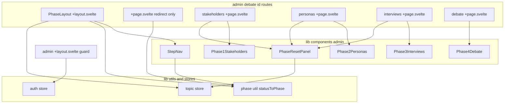
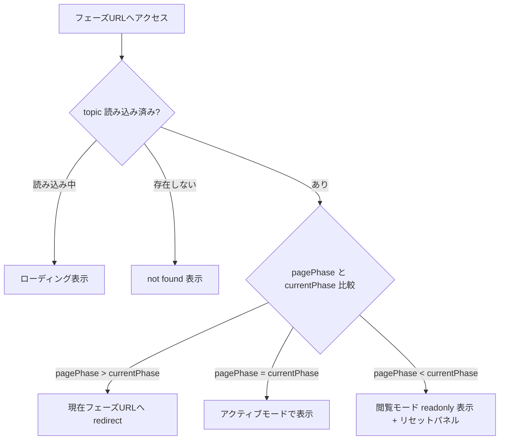
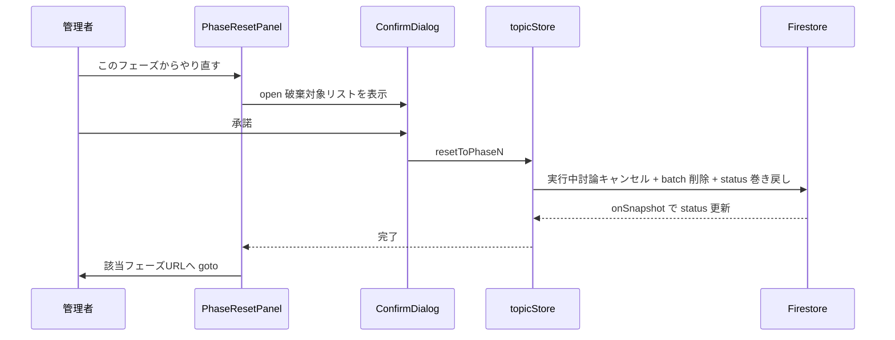
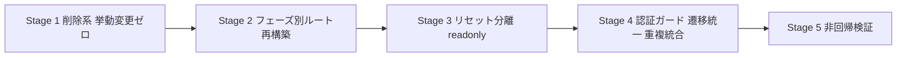

# Technical Design: code-and-navigation-cleanup

## Overview

**Purpose**: 本機能は開発過程で蓄積した未使用コード・重複実装を削除し、管理画面の討論生成フローを「フェーズ別URL＋ステップナビゲーション」という一般的なナビゲーション構造に再構築することで、開発者の保守コストと管理者の操作迷いを解消する。

**Users**: 管理者は討論生成の各フェーズを個別URLで行き来し、過去フェーズの確認とやり直しを明確に区別して操作する。開発者は参照されないコード・壊れた参照のないコードベースを保守する。

**Impact**: 現行の `/admin/debate/[id]` 単一ページ（status による表示切替）をフェーズ別の4ルートに分割する。「前のフェーズに戻る」ボタンが担っていた破壊的リセットを、確認ステップ付きの独立した操作に分離する。外部から見た公開ページの機能・URLは変更しない。

### Goals
- 未使用コード10項目（gap-analysis §1.1）と壊れたテスト参照の削除
- 討論生成4フェーズの個別URL化とステップナビゲーションの導入
- フェーズ閲覧（非破壊）とリセット（破壊的・要確認）の操作分離
- ログイン後の元ページ復帰・not found 表示・クライアントサイド遷移統一
- 重複実装（インラインFirestoreクエリ・auth リスナー・reset 関数）の統合

### Non-Goals
- 公開ページのSSR化（tech.md との乖離は別件。ステアリング更新も本スペック外）
- 実ページを対象とした E2E テストの新規整備（Firestore エミュレータ整備とセットで別スペック）
- AIパイプラインのロジック変更・Firestoreスキーマの変更
- 管理画面の視覚的リデザイン（レイアウト・配色は現状踏襲）

## Boundary Commitments

### This Spec Owns
- `src/routes/admin/debate/[id]/` 配下のルート構造とフェーズナビゲーション規則
- `src/routes/admin/` の認証ガード実装（リダイレクトパラメータ含む）
- 削除対象ファイルの除去と参照確認（gap-analysis §1.1 の全項目）
- `topic.svelte.ts` のリセット関数統合（`resetDebate` → `resetToPhase3`）
- `topics.svelte.ts` への公開トピック取得ストア追加

### Out of Boundary
- Firestore スキーマ・セキュリティルール・Cloud Functions の API contract（一切変更しない）
- 公開ページ（`/`・`/debate/[id]`）のURL・表示内容（トップのデータ取得をストア経由に変える内部変更のみ）
- Phase1〜4 コンポーネントの業務ロジック（生成・承認・公開処理の中身）

### Allowed Dependencies
- `@14ch/svelte-ui`（Tab / ConfirmDialog / Button）— UI標準ライブラリ
- 既存ストア（`topic` / `topics` / `personas` / `session` / `auth`）— 読み書きの唯一の経路
- SvelteKit ルーティング（`goto` / `page` / layout 階層）

### Revalidation Triggers
- `DebateStatus` 列挙の追加・変更（`statusToPhase` の全域性が崩れる）
- 討論生成フェーズの追加・削除（ルート・StepNav・リセット対応の更新が必要）
- 認証方式の変更（ガードの前提が変わる）

## Architecture

### Existing Architecture Analysis
- 現行: `admin/debate/[id]/+page.svelte` が `topic.status` で Phase1〜4 コンポーネントを切替。URL とフェーズが非対応で、ブラウザ履歴・直リンクが機能しない
- 「前のフェーズに戻る」= `resetToPhaseN`（ペルソナ・セッション削除を伴う）が確認なしで実行される
- 認証ガードは layout の 50ms ポーリング、加えて2ページが個別に `onAuthStateChanged` を張る三重構造
- 維持する境界: ストア集約原則（firebase.md）、Phase コンポーネントの props 構造（`topicId`/`topicTitle`）

### Architecture Pattern & Boundary Map



**Architecture Integration**:
- Selected pattern: フェーズ別ルート＋layout 集約（research.md Option B）。layout が `topicStore` のオーナーとなり context でページへ供給する
- Domain boundaries: ナビゲーション規則（リダイレクト・活性制御）は `statusToPhase` ユーティリティに一元化。ページは「自フェーズの表示モード決定」のみ担当
- Existing patterns preserved: `createXxxStore` パターン、`onSnapshot` デフォルト、Phase コンポーネントの props 構造
- New components rationale: `StepNav`（svelte-ui Tab のラッパー）、`PhaseResetPanel`（リセット分離の受け皿）の2つのみ新設
- Steering compliance: Firestore アクセスはストア集約（公開トップのインラインクエリも是正）、UI は svelte-ui 優先、アロー関数規約

**Dependency Direction**: `types` → `utils/phase` → `stores` → `components` → `routes`。左から右へのみ import を許可する。

### Technology Stack

| Layer | Choice / Version | Role in Feature | Notes |
|-------|------------------|-----------------|-------|
| Frontend | SvelteKit 2.x / Svelte 5 runes | フェーズ別ルート・layout 集約・context | 既存スタックのみ。新規依存なし |
| UI | `@14ch/svelte-ui`（Tab, ConfirmDialog, Button） | ステップナビ・リセット確認 | Stepper は無いため Tab を流用（research.md 参照） |
| Data | Firestore（既存ストア経由） | 変更なし | スキーマ・ルール変更なし |
| Testing | Vitest | phase util・ストア・readonly 挙動 | Playwright スキャフォールドは削除（research.md 決定） |

## File Structure Plan

### Directory Structure

```
src/routes/admin/debate/[id]/
├── +layout.svelte              # topicStore生成・context供給・StepNav・タイトル・not found・未到達ガード
├── +page.svelte                # 現在フェーズURLへのリダイレクトのみ
├── stakeholders/+page.svelte   # Phase 1ページ（Phase1Stakeholdersを表示モード付きで描画）
├── personas/+page.svelte       # Phase 2ページ（同パターン）
├── interviews/+page.svelte     # Phase 3ページ（同パターン）
└── debate/+page.svelte         # Phase 4ページ（同パターン・リセットなし）

src/lib/
├── utils/phase.ts              # Phase型・statusToPhase・PHASE_DEFS（slug/label/順序）
└── components/admin/
    ├── StepNav.svelte          # svelte-ui Tab ラッパー（未到達フェーズ disabled）
    └── PhaseResetPanel.svelte  # 「このフェーズからやり直す」+ ConfirmDialog
```

### Modified Files
- `src/routes/admin/+layout.svelte` — ポーリング廃止、`$effect` ガード＋ `redirect` パラメータ付与
- `src/routes/admin/login/+page.svelte` — `redirect` 検証付き復帰、認証済みなら `/admin` へ
- `src/routes/admin/+page.svelte` — `location.href` → `goto`、個別 `onAuthStateChanged` 撤去
- `src/lib/components/admin/Phase{1..4}*.svelte` — `readonly` プロップ追加、「前のフェーズに戻る」ボタン撤去
- `src/lib/stores/topic.svelte.ts` — `resetDebate` を `resetToPhase3` へ統合
- `src/lib/stores/topics.svelte.ts` — `createPublishedTopicsStore` 追加
- `src/routes/+page.svelte` — インライン Firestore クエリを上記ストアへ置換
- `functions/src/pipeline/debate-orchestrator.test.ts` — 存在しない `progress-tracker.js` への型参照とモックを除去

### Deleted Files（参照ゼロ確認済み: gap-analysis §1.1）
- `src/routes/demo/` 一式（E2Eテスト `page.svelte.e2e.ts` 含む）、`playwright.config.ts`、`package.json` の `test:e2e`・`@playwright/test`
- `src/lib/components/admin/{DebatePreview,InterviewReview,PersonaReview,StakeholderReview}.svelte`（＋各 spec）
- `src/lib/api/client.ts`・`client.spec.ts`、`src/lib/vitest-examples/` 一式、`src/lib/index.ts`
- 旧 `admin/debate/[id]/+page.svelte` の status 切替ロジック（リダイレクトページに置換）

## System Flows

### フェーズアクセス制御



- 判定は layout に集約し、ページは `pageMode`（`active` / `view`）を受け取って描画に専念する
- フェーズの前進はアクション完了時の明示的 `goto` で行い、自動リダイレクトは「未到達フェーズへのアクセス」のみに限定する（閲覧中の勝手な遷移を防ぐ）

### リセット実行



## Requirements Traceability

| Requirement | Summary | Components | Interfaces | Flows |
|-------------|---------|------------|------------|-------|
| 1.1–1.4 | 未使用コード削除 | Deleted Files 全項目 | — | — |
| 2.1–2.4 | progress 残骸除去・検証 | debate-orchestrator.test.ts 修正 | — | — |
| 3.1 | 重複実装統合 | topics store（公開クエリ）、topic store（reset 統合） | `createPublishedTopicsStore` | — |
| 3.2 | 挙動維持確認 | 全 Modified Files | — | — |
| 3.3 | svelte-ui 優先 | StepNav、PhaseResetPanel | Tab / ConfirmDialog | — |
| 4.1 | フェーズ別URL | フェーズ4ルート | `PHASE_DEFS` | — |
| 4.2 | ステップナビ表示 | StepNav | `StepNavProps` | — |
| 4.3 | 過去フェーズ閲覧 | PhaseLayout、Phase コンポーネント readonly | `PhasePageContext` | フェーズアクセス制御 |
| 4.4 | 未到達リダイレクト | PhaseLayout、リダイレクトページ | `statusToPhase` | フェーズアクセス制御 |
| 4.5 | 閲覧とリセットの分離 | PhaseResetPanel | `PhaseResetPanelProps` | リセット実行 |
| 4.6 | リセット確認ステップ | PhaseResetPanel + ConfirmDialog | 同上 | リセット実行 |
| 4.7 | ブラウザ履歴対応 | フェーズ別ルート構造そのもの | — | — |
| 5.1 | 作成後遷移 | 既存実装維持（topics/new） | — | — |
| 5.2 | ログイン後復帰 | AdminGuard、LoginPage | `redirect` クエリ契約 | — |
| 5.3 | 親画面導線 | PhaseLayout（ダッシュボードへ戻る） | — | — |
| 5.4 | not found 表示 | PhaseLayout | — | フェーズアクセス制御 |
| 5.5 | ローディング表示 | PhaseLayout | — | フェーズアクセス制御 |
| 5.6 | クライアント遷移統一 | AdminDashboard ほか | `goto` | — |
| 6.1–6.4 | 非回帰 | Testing Strategy 参照 | — | — |

## Components and Interfaces

| Component | Domain/Layer | Intent | Req Coverage | Key Dependencies | Contracts |
|-----------|--------------|--------|--------------|------------------|-----------|
| phase util | lib/utils | status→フェーズ対応の単一の真実 | 4.1, 4.4 | types (P0) | Service |
| PhaseLayout | routes | ストア供給・ナビ・ガード・not found | 4.2, 4.3, 4.4, 5.3, 5.4, 5.5 | phase util (P0), topic store (P0), StepNav (P1) | State |
| StepNav | components/admin | フェーズ位置表示と到達済みフェーズへのリンク | 4.1, 4.2, 4.3 | svelte-ui Tab (P0) | State |
| PhaseResetPanel | components/admin | リセットの確認付き実行 | 4.5, 4.6 | svelte-ui ConfirmDialog (P0), topic store (P0) | State |
| フェーズページ ×4 | routes | pageMode に応じた Phase コンポーネント描画 | 4.1, 4.3 | PhaseLayout context (P0) | — |
| AdminGuard | routes/admin/+layout | リアクティブ認証ガード＋redirect付与 | 5.2 | auth store (P0) | State |
| LoginPage | routes | redirect 検証付き復帰 | 5.2 | auth store (P0) | State |
| topics store 拡張 | lib/stores | 公開トピック取得の集約 | 3.1 | Firestore (P0) | Service |

### lib/utils

#### phase util

| Field | Detail |
|-------|--------|
| Intent | `DebateStatus` とフェーズ（番号・slug・ラベル）の対応を一元定義する |
| Requirements | 4.1, 4.4 |

**Responsibilities & Constraints**
- 全 `DebateStatus` を被覆する全域写像（未知値は Phase 1 にフォールバック）
- ナビゲーション規則の唯一の真実。他コンポーネントはこのモジュール以外でフェーズ判定をしない

**Contracts**: Service [x]

##### Service Interface
```typescript
type Phase = 1 | 2 | 3 | 4;

interface PhaseDef {
  phase: Phase;
  slug: 'stakeholders' | 'personas' | 'interviews' | 'debate';
  label: string; // ステップナビ表示名
}

const PHASE_DEFS: readonly PhaseDef[];
const statusToPhase: (status: DebateStatus) => Phase;
const phasePath: (topicId: string, phase: Phase) => string; // /admin/debate/{id}/{slug}
```
- Preconditions: なし（純粋関数）
- Postconditions: 任意の status 入力に対し必ず Phase を返す
- Invariants: `PHASE_DEFS` は phase 昇順・slug 一意

### routes（管理画面）

#### PhaseLayout（`admin/debate/[id]/+layout.svelte`）

| Field | Detail |
|-------|--------|
| Intent | topicStore のライフサイクル管理と、配下ページへの context 供給・共通枠（StepNav・タイトル・戻る導線）・アクセスガード |
| Requirements | 4.2, 4.3, 4.4, 5.3, 5.4, 5.5 |

**Responsibilities & Constraints**
- `topicStore` を生成・start し、destroy 時に stop する（ページは生成しない）
- topic 未読込中はローディング、読込完了かつ不存在なら not found を表示し、children を描画しない
- 現在URLのフェーズが `currentPhase` を超える場合、`phasePath(topicId, currentPhase)` へ `goto`（replaceState）
- ダッシュボードへ戻るリンクを常設

**Dependencies**
- Inbound: フェーズページ4つ — context 取得（P0）
- Outbound: topic store — 購読（P0）/ phase util — 判定（P0）/ StepNav — 表示（P1）

**Contracts**: State [x]

##### State Management
- State model: context key `phase-page` で以下を供給
```typescript
interface PhasePageContext {
  topicId: string;
  readonly topic: TopicDoc | null;     // リアクティブ getter
  readonly currentPhase: Phase;        // statusToPhase(topic.status)
  pageModeFor(pagePhase: Phase): 'active' | 'view'; // ガード通過後は2値
}
```
- Persistence & consistency: onSnapshot 由来。書き込みは行わない
- Concurrency strategy: status 変化時の再判定は Svelte のリアクティビティに委譲。後退リダイレクトはしない（閲覧継続を許容）

**Implementation Notes**
- Integration: 旧 `+page.svelte` の status 切替・個別 `onAuthStateChanged` はここに吸収して撤去。認証確定は親の AdminGuard が保証する
- Validation: 不正 topicId（not found）・未知 status（Phase 1 扱い）
- Risks: リダイレクト条件を「未到達のみ」に限定しないとループや勝手な遷移が起きる

#### AdminGuard（`admin/+layout.svelte`）/ LoginPage

| Field | Detail |
|-------|--------|
| Intent | リアクティブな認証ガードとログイン後の元ページ復帰 |
| Requirements | 5.2 |

**Responsibilities & Constraints**
- `$effect` で `authStore.loading === false && user === null` を検知し `/admin/login?redirect=<pathname>` へ遷移（ポーリング廃止）
- LoginPage は成功時に `redirect` を検証して復帰。検証規則: `/admin` で始まる相対パスのみ許可、それ以外は `/admin`
- 認証済みユーザーの `/admin/login` アクセスは `/admin` へ即時遷移

**Contracts**: State [x]

##### State Management
- State model: URLクエリ `redirect: string`（相対パス）。authStore は既存のまま変更しない
- Concurrency strategy: ガードの判定材料を `loading`/`user` の2値に限定し、副作用は `goto` のみ

**Implementation Notes**
- Integration: `admin/+page.svelte`・`admin/debate/[id]` 系の個別 `onAuthStateChanged` を全廃し、「ガード通過後に children 描画」の保証に置換
- Validation: redirect のオープンリダイレクト防止（上記検証規則）
- Risks: 認証フロー回帰。実装順を最終段とし、手動確認（ログイン・ログアウト・未認証直リンク・復帰）を必須化

### components/admin

#### StepNav

| Field | Detail |
|-------|--------|
| Intent | 全フェーズと現在位置を表示し、到達済みフェーズへの非破壊ナビゲーションを提供する |
| Requirements | 4.1, 4.2, 4.3 |

**Contracts**: State [x]

##### State Management
- Props:
```typescript
interface StepNavProps {
  topicId: string;
  currentPhase: Phase; // これより先のフェーズは disabled
}
```
- svelte-ui `Tab` に `tabItems`（`PHASE_DEFS` から生成、未到達は `disabled: true`）と `currentPath` を渡す薄いラッパー。独自状態を持たない

**Implementation Notes**
- Integration: リンクは `phasePath` で生成（href ベース＝ブラウザ履歴が自然に機能、4.7）
- Risks: Tab の活性判定が URL 完全一致前提のため `pathPrefix` の設定を確認する

#### PhaseResetPanel

| Field | Detail |
|-------|--------|
| Intent | 過去フェーズの閲覧画面で「このフェーズからやり直す」を確認付きで実行する |
| Requirements | 4.5, 4.6 |

**Contracts**: State [x]

##### State Management
- Props:
```typescript
interface PhaseResetPanelProps {
  phase: 1 | 2 | 3;            // Phase 4 はリセット対象外（討論やり直しは Phase 3 から）
  topicId: string;
  discardSummary: string[];     // 破棄対象の列挙（フェーズごとに定義）
  onReset: () => Promise<void>; // topicStore.resetToPhaseN を注入
}
```
- ConfirmDialog（`danger: true`）で `discardSummary` を提示し、`onSubmit` でのみ `onReset` を実行 → 完了後 `phasePath(topicId, phase)` へ `goto`
- 実行中は二重実行を防止（実行状態を内部管理）

**Implementation Notes**
- Integration: 表示は `pageMode === 'view'` のページに限定。Phase コンポーネント内の「前のフェーズに戻る」ボタンと `handleBack` は全廃
- Validation: リセット失敗時はエラーメッセージを表示し、画面遷移しない
- Risks: 実行中討論のキャンセル漏れ — `resetToPhaseN` 内の `cancelRunningDebate` 呼び出しを維持する

### components/admin（修正: 要約のみ）

- **Phase1〜4 コンポーネント**: `readonly?: boolean` プロップを追加（4.3）。readonly 時は生成・承認・公開等のアクションUIを描画せず、アクション関数も呼び出さない（UIの disabled に頼らない）。「前のフェーズに戻る」ボタンを撤去。props 構造（`topicId`/`topicTitle`）は維持
- **フェーズページ ×4**: context から `pageMode` を取得し、`Phase{N}`＋（view 時のみ）`PhaseResetPanel` を描画するだけの薄いページ。新しい boundary は持たない
- **リダイレクトページ（`[id]/+page.svelte`）**: `phasePath(topicId, currentPhase)` へ `goto(…, { replaceState: true })` するのみ

### lib/stores（修正: 要約のみ）

- **topic store**: `resetDebate` を削除し呼び出し元を `resetToPhase3` に統一（3.1）。reset 関数のセマンティクス・Firestore 操作は変更しない
- **topics store**: `createPublishedTopicsStore()` を追加し、公開トップのインラインクエリ（`status == 'published'` の onSnapshot＋ソート）を移管（3.1）。返却 shape は既存 `createTopicsStore` と同形（`topics` / `isLoaded` / `start` / `stop`）

## Error Handling

### Error Strategy
ナビゲーション系は「安全側へ倒す」: 不明な状態では Phase 1 表示・not found 表示・`/admin` への復帰を選び、データ破壊操作は確認なしで到達できない構造とする。

### Error Categories and Responses
- **不正 topicId（Not Found）**: PhaseLayout が not found 表示＋ダッシュボード導線（5.4）。無限ローディングを排除
- **未知 DebateStatus**: `statusToPhase` が Phase 1 へフォールバック（リダイレクトループ防止）
- **リセット失敗（Firestore エラー）**: PhaseResetPanel がダイアログを閉じずエラー表示。部分削除リスクは既存 `writeBatch`（原子的）で緩和済み
- **不正 redirect パラメータ**: 検証で `/admin` へフォールバック（オープンリダイレクト防止）
- **認証セッション失効**: AdminGuard が現在パスを `redirect` に載せてログインへ誘導（5.2）

### Monitoring
既存方針を踏襲（console エラー）。本スペックでの新規監視基盤は導入しない。

## Testing Strategy

### Unit Tests（Vitest）
1. `statusToPhase` / `phasePath`: 全 status の対応、未知値フォールバック、パス生成
2. `createPublishedTopicsStore`: published フィルタ・publishedAt 降順ソート（既存 topics store テストのパターンに準拠）
3. `topic.svelte.ts`: `resetDebate` 統合後も `resetToPhase3` が セッション削除＋status 巻き戻しを行うこと
4. Phase コンポーネント readonly: readonly 時にアクションUIが描画されないこと（既存 spec ファイルのパターンで追加）
5. `debate-orchestrator.test.ts`: progress-tracker 残骸除去後にテストがグリーンであること

### Integration / Manual Tests
1. フェーズ遷移一巡: テーマ作成 → Phase1〜4 を通しで進行し、各フェーズでURLが変わること・StepNav の現在位置・ブラウザ戻る/進む（6.4）
2. ガード: 未認証で `/admin/debate/{id}/personas` 直リンク → ログイン → 元ページ復帰（5.2）
3. 未到達フェーズ直リンク → 現在フェーズへリダイレクト（4.4）
4. 過去フェーズ閲覧 → データ不変を確認 → リセット実行 → 確認ダイアログ → 該当フェーズが再実行可能になること（4.3, 4.5, 4.6）
5. 公開ページ: トップ・討論閲覧の表示とURLが従前同一であること（6.3）

### Regression Gates（6.1, 6.2）
- `pnpm check`（svelte-check + TypeScript）と `pnpm build` が警告なく通過
- `npm --prefix functions run build` と Functions ユニットテストが通過
- 削除対象の参照ゼロを `pnpm build` 成功＋grep で二重確認

## Migration Strategy

段階実施（gap-analysis Option C を具体化）。各段階は独立にコミット・検証可能で、失敗時は段階単位で巻き戻す。



- Stage 1: Deleted Files の除去＋debate-orchestrator.test.ts 残骸除去 → ビルド・テストで検証
- Stage 2: phase util・PhaseLayout・フェーズページ・StepNav・リダイレクトページ
- Stage 3: readonly プロップ・PhaseResetPanel・旧「戻る」ボタン撤去・reset 統合
- Stage 4: AdminGuard 書き換え・login redirect・`goto` 統一・公開トップのストア化
- Rollback triggers: 認証フロー回帰（Stage 4）、フェーズ遷移ループ（Stage 2）を検知した場合は当該 Stage を revert
