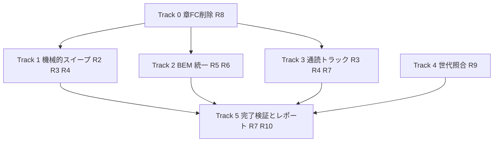
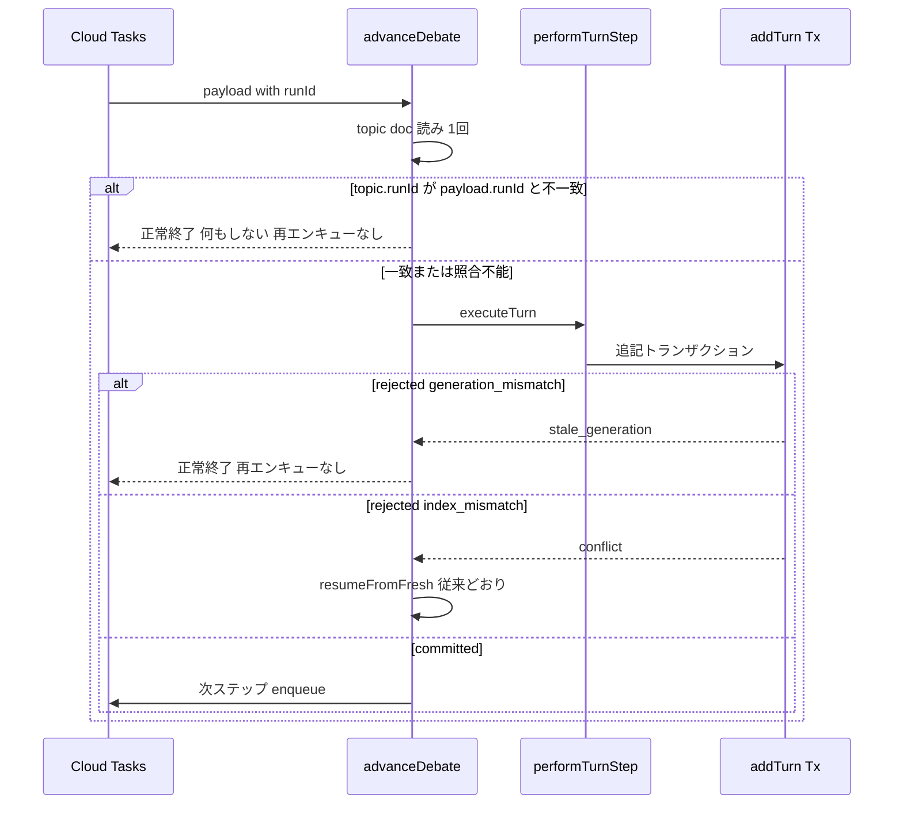

# Technical Design: codebase-refactoring

## Overview

**Purpose**: 本設計は、logotope コードベース全体（`src/` と `functions/src/`）を steering 規約へ整合させる挙動保全リファクタリングと、ユーザー決定による2つの限定的な挙動変更（章ファクトチェック機能の削除、討論チェーンの世代照合）の実現方法を定義する。

**Users**: 開発者・運用者。リファクタリング後のコードベースは、どのファイルを開いても同じ規約で読め、旧世代タスクによる LLM コスト浪費が構造的に発生しない。

**Impact**: 外部から観測可能な挙動は、Requirement 8（章FC削除）と Requirement 9（世代照合）を除き一切変更しない。ベースライン（svelte-check 0 エラー / lint 通過 / 272 テスト / Functions tsc）は全 green であり、これを検証の安全網として全工程で維持する。

### Goals
- steering 規約違反（アロー関数・省略名・BEM・型配置・テスト配置）の全解消（gap-analysis §2 の違反一覧が対象）
- デッドコード・重複の削減と、チェーン内の挙動保全整理（D4 採用範囲）
- 章FC機能の完全削除（インラインFCは無傷で維持）
- 討論チェーンの世代照合による旧世代ゾンビチェーンの停止
- 仕様不備・不整合の一覧レポート提出

### Non-Goals
- 生成ライフサイクルのサーバ一本化（B-1/B-2/B-3/B-5/B-6）— 別 spec へ
- Firestore 読み取り重複の解消（A-2/C-5）— R1.4 に照らして別 spec へ
- 型のドメイン分割・`*Doc`→`*ForFirestore` 移行、プロンプト見出し統一 — 計画済みの別 spec
- steering ドキュメント自体の更新（コードを正とし、報告対象にもしない）

## Boundary Commitments

### This Spec Owns
- `src/` と `functions/src/` の既存コードの内部品質（命名・記法・配置・並び順・CSS 記法・テスト配置・重複/デッドコード）
- 章FC機能の削除範囲（research.md「R8: 章FC削除の境界」の削除リスト）と `firestore.rules` の factCheck match 削除
- 討論ステップの世代照合契約（入口ゲート + 棄却理由の伝播）
- 仕様不備レポート（`findings-report.md` として本 spec ディレクトリに出力）

### Out of Boundary
- 上記 Non-Goals の全項目
- 章FC残存データ（`chapters/{id}/factCheck/result`）の一括削除（コード削除のみ、AC 8.5）
- インラインFC・編集保護判定・engagement/awareness の意味論変更

### Allowed Dependencies
- 既存の検証パイプライン（`pnpm check` / `pnpm lint` / `pnpm test` / functions tsc）
- 新規依存: `dayjs@^1.11.x`（フロント・functions 両 package.json。これ以外の依存追加・更新は禁止）
- 既存の runId インフラ（topic doc の `runId`、`DebateStepPayload.runId`、`addTurn` の世代照合トランザクション）— 変更せず利用する

### Revalidation Triggers
- `DebateStepPayload` の形状変更（在飛行タスクとの互換に影響）
- `computeProtectedTurnIds` の入力契約変更（編集チェーンの保護仕様に影響）
- FE `turn.types.ts` の factCheck 埋め込み型の変更（Firestore 永続形ミラーの原則に影響）

## Architecture

### Existing Architecture Analysis
- SvelteKit（features/models/sharedComponents/stores/utils）+ Firebase Functions v2（api/agents/pipeline/types/utils）+ Firestore。この構造自体は変更しない
- 討論チェーンは「毎ステップ Firestore から全再構築 + frontier トランザクション + deterministic task id」の冪等設計。R9 はこの設計の延長（既存の照合をチェーン入口へ前倒し）であり、新しい仕組みを導入しない
- 依存方向（維持・変更禁止）: `types → constants/utils → agents/llm/search → pipeline → api`（functions）、`models → stores → features/routes`（FE）。orchestrator → step の一方向依存も維持する

### Architecture Pattern & Boundary Map

作業は性質別の5トラックに分割する（Option C ハイブリッド、research.md 参照）。トラック間の順序依存は最小限で、Track 0 のみ先行必須（削除により後続トラックの対象ファイルが減るため）。



**Key Decisions**:
- Track 0（削除）を最初に行う。削除対象ファイルへのスイープ・BEM 適用は無駄作業になるため
- Track 4（R9）は他トラックと独立。討論チェーンのファイル群は Track 3 の通読対象でもあるため、**R9 の変更を先に入れてから Track 3 で当該ファイルを通読する**（逆順だと通読結果が R9 で上書きされる）
- **共有ファイルの直列化**: Track 1（短縮名改名等）と Track 3（構造整理）はどちらも `pipeline/debate/` 等の同一ファイルを触る。図の並列はトラックの論理独立を示すもので、**同一ファイル群に対しては Track 1 → Track 3 の順で直列に実施する**（tasks 生成時の順序制約とする）
- 各トラックの完了時に必ず検証4点セット（check / lint / test / functions build）を回す（AC 1.2）

### Technology Stack

| Layer | Choice / Version | Role in Feature | Notes |
|-------|------------------|-----------------|-------|
| Frontend | SvelteKit 2.x / Svelte 5 runes | リファクタリング対象 | 変更なし |
| Backend | Firebase Functions v2 / Node 24 | リファクタリング対象 | 変更なし |
| 日付整形 | **dayjs ^1.11.x（新規）** | R4.4 日付整形の統一 | 両 package.json に追加。ロケールファイル不要 |
| 検証 | svelte-check / ESLint / Prettier / Vitest / tsc | 挙動保全の安全網 | 変更なし |

## File Structure Plan

### Deleted Files（Track 0 + デッドコード）
```
# 章FC削除（R8）
functions/src/api/fact-check.ts
functions/src/pipeline/fact-check/fact-check-repository.ts
src/lib/stores/factCheck.svelte.ts
src/lib/features/admin/topic-detail/debate/FactCheckFindings.svelte
functions/src/tests/pipeline/fact-check/fact-check-repository.test.ts
src/tests/stores/factCheck.test.ts
src/tests/features/admin/debate/FactCheckFindings.svelte.spec.ts

# デッドコード（R4.2、gap-analysis §2）
src/lib/features/admin/topic-detail/TopicDetailTemplate.svelte
src/lib/features/admin/topic-detail/general/TopicGeneralPage.svelte
src/lib/features/topics/list/TopicListPage.svelte
functions/src/types/interview.types.ts
src/tests/models/session/            # 旧スキーマの名残ディレクトリ
```

### Modified Files（主要なもの。パターンで示す）
- `functions/src/pipeline/fact-check/fact-check-runner.ts` — `checkTurn`/`checkChapter`/`OnTurnFindings` を削除、`checkContent` は維持
- `functions/src/index.ts` — `runFactCheck`/`runFactCheckTask` の export 削除
- `functions/src/pipeline/debate/debate-lifecycle.ts` — `deleteFactCheckResult` の import・呼び出し削除
- `src/lib/stores/currentTopic.svelte.ts` — factCheckStore 配線の削除
- `src/lib/features/admin/topic-detail/debate/Phase5Debate.svelte`・`editing/Phase6Editing.svelte` — 章FC実行 UI・指摘突合表示の削除（インライン trace 表示は turn 埋め込み由来のため対象外）
- `src/lib/models/factCheck/factCheck.types.ts` — 結果ドキュメント型を削除。`FactCheckFinding` 型は turn 埋め込みミラーからの参照が残る場合 `models/turn/` へ移動（re-export 禁止、import 側を直接書き換える）
- `firestore.rules` — `match /factCheck/{docId}` ブロック削除
- `functions/src/pipeline/debate/debate-orchestrator.ts`・`step.ts`・`turn.ts` — R9（入口ゲート + 理由伝播）と Track 3 の整理（A-3/A-6/A-7/A-8）
- `src/lib/stores/personas.svelte.ts`・`Phase3Interviews.svelte` — 死にパラメータ topicContext の合成・送信削除（B-4 の FE 側のみ。callable の入力契約は変えない）
- BEM 違反 17 ファイル、短縮名 40+ ファイル、`function` 宣言 3 ファイル、dayjs 3 箇所、`topic.types.ts` の変換関数移動 — gap-analysis §2 の一覧が正
- `package.json`・`functions/package.json` — dayjs 追加

## System Flows

### R9: 討論ステップの世代照合（変更後）



- 入口ゲートは既存の `isDebateActive` 用 topic doc 読みに相乗りし、追加の Firestore 読み取りを発生させない
- 旧世代タスクは**例外を投げず正常終了**で ack する（Cloud Tasks の maxAttempts リトライを誘発しない）
- `addTurn` の後方互換ガード（双方に runId がある場合のみ照合）と同じ規約を入口ゲートにも適用する
- summary / closing / comments ステップは入口ゲートのみで保護される（ターン追記を経由しないため。AC 9.1 が唯一の防衛線であることをテストで固定する）

## Requirements Traceability

| Requirement | Summary | 実現するトラック / コンポーネント |
|-------------|---------|----------------------------------|
| 1.1–1.4 | 挙動保全と例外の限定 | 全トラック共通制約 + Verification Gate |
| 2.1–2.4 | アロー関数・命名・any 禁止・strict | Track 1（機械的スイープ） |
| 3.1–3.3 | 配置基準の確認 | Track 3（通読。違反発見時のみ修正） |
| 3.4 | 関数のトップダウン順 | Track 3（通読） |
| 3.5 | types ファイルの変換関数排除 | Track 1（`topicFromFirestore` の移動） |
| 4.1–4.3 | 過度な共通化・デッドコード・重複 | Track 1（削除）+ Track 3（判定） |
| 4.4–4.5 | dayjs 統一・出力同一 | Track 1 |
| 5.1–5.3 | BEM 統一 | Track 2 |
| 6.1–6.3 | テスト配置 | Track 1（session 残骸削除のみ。他は準拠済み） |
| 7.1–7.5 | 仕様不備の記録と報告 | Track 3 + Findings Report |
| 8.1–8.5 | 章FC削除 | Track 0（FC Deletion） |
| 9.1–9.4 | 世代照合 | Track 4（Generation Gate） |
| 10.1–10.3 | 完了検証 | Verification Gate |

## Components and Interfaces

| Component | Layer | Intent | Req | Contracts |
|-----------|-------|--------|-----|-----------|
| FC Deletion (Track 0) | FE + Functions + rules | 章FC専用コードの完全削除 | 8.1–8.5 | — |
| Generation Gate (Track 4) | Functions/pipeline | 入口 runId 照合と理由伝播 | 9.1–9.4 | Service |
| Mechanical Sweep (Track 1) | 全域 | 機械的規約修正・削除・dayjs | 2.*, 3.5, 4.*, 6.* | — |
| BEM Track (Track 2) | FE | CSS 記法統一 | 5.1–5.3 | — |
| Read-through (Track 3) | 全域 | 関数並び順・チェーン整理・不備検出 | 3.*, 4.1, 4.3, 7.1–7.2 | — |
| Findings Report | spec 成果物 | 仕様不備の一覧レポート | 7.3–7.5 | Batch |
| Verification Gate | CI 相当 | 4点セット検証 | 1.2, 10.1–10.3 | Batch |

### Functions / debate pipeline

#### Generation Gate（R9）

| Field | Detail |
|-------|--------|
| Intent | 討論ステップ入口での世代照合と、addTurn 棄却理由のチェーン制御への伝播 |
| Requirements | 9.1, 9.2, 9.3, 9.4 |

**Responsibilities & Constraints**
- `advanceDebate` 冒頭で topic doc を1回読み、アクティブ判定と runId 照合を同時に行う。不一致時は LLM 呼び出し・状態変更・enqueue を一切行わず正常終了する
- 棄却理由の判別可能ユニオンを `addTurn`（既存）→ `generatePersonaTurn` → `performTurnStep` → orchestrator まで貫通させる。途中での null 潰し・reason 破棄を禁止する
- `addTurn` のトランザクション・後方互換ガード・progressPatch 同梱は変更しない

**Dependencies**
- Inbound: Cloud Tasks `runStep` — ステップ起動（P0）
- Outbound: `addTurn` — 既存の世代照合トランザクション（P0、無変更）

**Contracts**: Service [x]

##### Service Interface（戻り値契約の変更点のみ）
```typescript
// turn.ts（既存を維持）
type AppendResult =
  | { status: 'committed'; turnId: string }
  | { status: 'rejected'; reason: 'generation_mismatch' | 'index_mismatch' };

// generatePersonaTurn の戻り値: null 潰しを廃止し理由を保持する
type TurnGenerationOutcome =
  | { kind: 'committed'; /* 既存の確定情報 */ }
  | { kind: 'rejected'; reason: 'generation_mismatch' | 'index_mismatch' }
  | { kind: 'skipped' };  // 停止検出など既存の非確定ケース

// performTurnStep の戻り値: 'conflict' を二分する
// 【加法的変更の原則】既存の列挙値・フィールドは一切変更・削除しない。
// 追加するのは 'stale_generation'（performTurnStep）と rejected 理由の保持（generatePersonaTurn）のみ。
// 既存値（'completed' / 'advanced' / 'conflict' 等、実装時点の全列挙）の意味・発生条件は不変とする。
type TurnStepResult = ExistingTurnStepResult | 'stale_generation';
// orchestrator: 'stale_generation' → return（enqueue なし） / 'conflict' → resumeFromFresh（従来）
```
- Preconditions: payload.runId は必須（既存契約）。topic doc に runId が無い場合は照合をスキップ（後方互換、addTurn と同一規約）
- Postconditions: 旧世代タスクは副作用ゼロで ack される。単一世代内の遷移（AC 9.4）は変更されない
- Invariants: orchestrator → step の一方向依存を維持。step 層は enqueue を知らない

**Implementation Notes**
- Integration: 入口ゲートは open/turn/summary/closing/comments 全 stepKind に共通適用（dispatch 前に1箇所）
- Validation: 旧世代 payload を与えた各 stepKind のユニットテストを新設。既存テストの修正は型追従に限定（AC 1.3）
- Risks: 在飛行タスク（デプロイ跨ぎ）は旧形 payload を持ち得るが、runId は従来から必須のため互換問題なし

### 削除・スイープ系トラック（新規境界なし・要点のみ）

- **FC Deletion**: 削除・維持リストは research.md「R8: 章FC削除の境界」を正とする。FE `FactCheckFinding` 型は turn 埋め込みミラーからの参照が残る場合のみ `models/turn/` へ移動し、re-export は作らない。`firestore.rules` はコード削除と同一 PR で match 削除し、デプロイ手順（後述）に含める
- **Mechanical Sweep**: 短縮コールバック引数の改名は「意味の伝わる名前」への置換（`(t) =>` → `(topic) =>` / `(turn) =>` 等、対象コレクションの単数形を既定とする）。`topicFromFirestore` は利用側へインライン化（feedback-types-file-no-converters 準拠）。dayjs 置き換え3箇所は置換前後の出力文字列一致をテストで固定する（AC 4.5）
- **BEM Track**: 1ファイル=1コミット単位。Block 名はコンポーネント名の kebab-case（`Phase5Debate` → `.phase5-debate`）、page/layout は場所接頭辞 + `-page`/`-layout`（`routes/+page.svelte` → `.home-page`、`admin/login` → `.login-page`、`admin/topics/new` → `.topic-new-page`）。各ファイルの完了条件は2つ: (a) svelte-check の未使用セレクタ警告 0、(b) **旧クラス名のリポジトリ全域 grep が 0 件**（コンポーネント spec のセレクタ・TS からの `querySelector` 等、style ブロック外の参照の改名漏れを防ぐ）
- **Read-through**: モジュール単位（stores → models → features → functions/pipeline → functions/agents・api）で通読し、(a) 関数のトップダウン順是正、(b) D4 採用のチェーン整理（A-3 `isEarlyEndCandidate` 純関数抽出、A-6 `executeFinalResponseTurn` 切り出しと summary/closing 選択の一本化、A-7 DebateState 組成の loadStepContext 完結化と `chapter` エイリアス削除、A-8 死んだ分岐削除・`getTopicContext` 同名解消・intervention フォールバック必須引数化、B-4 FE topicContext 合成/送信の削除、B-9 stakeholder/persona-generator agent の Result 型化）、(c) R7 の不備記録を同時に行う

#### Findings Report

| Field | Detail |
|-------|--------|
| Intent | R7 の仕様不備・不整合レポートの成果物定義 |
| Requirements | 7.1, 7.2, 7.3, 7.4, 7.5 |

**Contracts**: Batch [x]

##### Batch / Job Contract
- Trigger: 全トラック完了時（Track 3 の記録を集約）
- Input / validation: chain-structure-findings.md の未対応項目（B 系・A-4/A-5/A-9・C-2/C-3・B-7/B-8）+ Track 3 通読で新規発見した不備。steering 陳腐化は含めない（AC 7.5）
- Output / destination: `.kiro/specs/codebase-refactoring/findings-report.md`。各項目は「場所 / 事象 / なぜ不備か / 推奨対応（別 spec 化 or 個別修正）」の形式
- Idempotency & recovery: 再生成可能（記録はすべて findings ドキュメントに集約されているため）

#### Verification Gate

| Field | Detail |
|-------|--------|
| Intent | トラック完了ごと・全体完了時の機械検証 |
| Requirements | 1.2, 10.1, 10.2, 10.3 |

**Contracts**: Batch [x]

##### Batch / Job Contract
- Trigger: 各トラック完了時（最低限: test + 対象側ビルド）、全体完了時（フルセット）
- Input / validation: `pnpm check` → 0 エラー、`pnpm lint` → 通過、`pnpm test` → 全成功、`pnpm build` → 成功、`npm --prefix functions run build` → 成功
- Output / destination: 実行ログ。失敗時はそのトラック内で修正してから次へ進む

## Data Models

スキーマ変更なし。変更されるのは以下のみ:

- **書き込みの停止**: `topics/{id}/chapters/{chapterId}/factCheck/result` への読み書きコードを削除（ドキュメント自体は残存、AC 8.5）
- **firestore.rules**: `match /factCheck/{docId}` ブロックの削除（唯一のルール変更、AC 8.4）
- **topic doc**: `runId` フィールドは既存のまま。R9 は読み取り箇所を1つ追加するだけで書き込み契約は不変

## Error Handling

- **旧世代タスク（R9）**: エラーではなく正常終了として扱う。ログには `stale generation skipped`（topicId / payload runId / current runId）を info で残し、監視で頻度を観察可能にする。例外を投げると Cloud Tasks が maxAttempts=3 まで無駄リトライするため禁止
- **リファクタリング全般**: エラーハンドリングの追加・削減は行わない（既存の方針を維持。過剰なエラーハンドリング追加は CLAUDE.md 方針に反する）
- **BEM / 改名作業**: svelte-check・ESLint をファイル単位で回し、コンパイル不能状態でのコミットを作らない

## Testing Strategy

### Unit Tests（新設）
- Generation Gate: 旧世代 payload での各 stepKind（open/turn/summary/closing/comments）が「副作用ゼロ・enqueue なし・正常終了」となること
- 理由伝播: `generation_mismatch` → resume なし / `index_mismatch` → resumeFromFresh の分岐
- dayjs 置き換え3箇所: 置換前後の出力文字列一致（固定日付でスナップショット）
- `isEarlyEndCandidate` 純関数（A-3 抽出後）: 閾値境界のテーブルテスト

### Regression（既存 272 テストの扱い）
- 章FC削除に伴い削除するテスト: research.md の削除リスト記載分（repository / store / FactCheckFindings spec）。`fact-check-runner.test.ts` は checkContent 分を残して章FC部分のみ削除
- それ以外の既存テスト修正は import パス・識別子名・R9 型追従に限定（AC 1.3）。アサーションの変更が必要になった場合は設計逸脱として立ち止まる

### 目視確認（BEM）
- 違反17ファイルの改名後、管理画面の各フェーズ画面 + 公開トップ + ログインを1周し、スタイル欠落（クラス名不一致による未適用）がないことを確認。svelte-check の未使用セレクタ警告 0 を機械的な事前条件とする

## Migration Strategy

デプロイはコード完成後に一括で行う（本プロジェクトはエミュレータ未使用・本番直結のため、変更はデプロイするまで本番に影響しない）:

1. フロント・functions のビルド確認（Verification Gate フルセット）
2. `firebase deploy --only functions` — 章FC endpoint 削除 + R9 反映。**討論実行中でないことを確認してからデプロイする**（在飛行タスクは runId 互換のため安全だが、endpoint 削除中の呼び出しを避ける）
3. `firebase deploy --only firestore:rules` — factCheck match 削除
4. App Hosting へのフロントデプロイ（既存手順）

ロールバック: 全変更は git revert 可能。Firestore データ変更がないためデータロールバックは不要。
