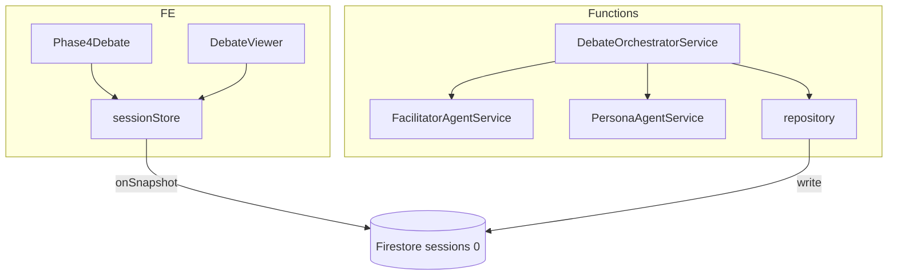
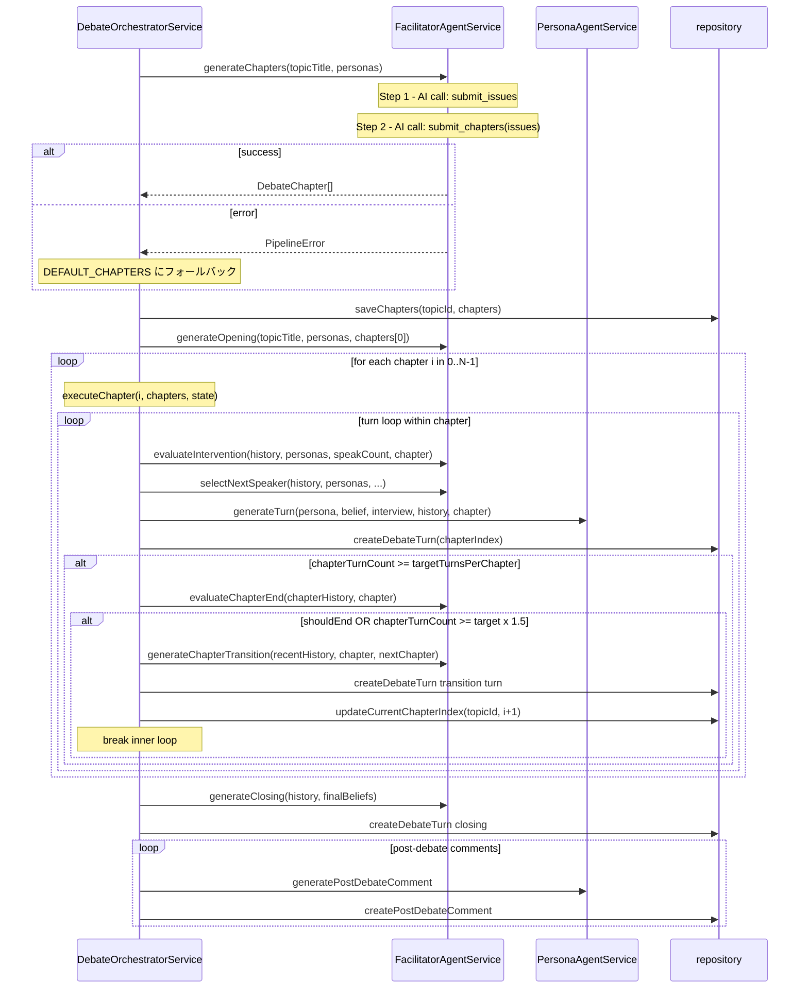

# Design Document

## Overview

本機能は、現在フラットなターンループで進行する討論オーケストレーターに「章立て構成」を追加する。`DebateOrchestratorService` の `executeDebate` をアウターの章ループ＋インナーのターンループという 2 層構造に再編し、各章ごとに AI が終了判定を行って次章への遷移発言を生成する。

対象ユーザーは管理者（章付き討論コンテンツを生成する）と閲覧者（章見出しで整理された討論を読む）の 2 者。既存の介入判定・沈黙管理・信念変化追跡ロジックはすべて維持されたまま章構造が付加される。

### Goals

- 討論開始前に AI が 4〜6 章を自動生成し、`sessions/0.chapters` に永続化する
- 章フォーカス（タイトル・フォーカス問い）をファシリテーター・ペルソナ両エージェントのプロンプトに注入する
- 章終了判定（独立 AI 呼び出し）→ 遷移発言生成 → `currentChapterIndex` 更新のフローを実現する
- 公開ビュワーで章見出しつき表示を実現する（旧データは章見出しなしでフォールバック）

### Non-Goals

- 管理者による章の手動定義・編集
- 章のリアルタイム追加・削除
- 章ごとの参加者制限
- `maxTurns` 全体の変更（1 章あたり目標ターン数は `maxTurns / 章数` で自動算出）

---

## Boundary Commitments

### This Spec Owns

- `DebateOrchestratorService` の章進行ロジック（章生成・章ループ・終了判定・遷移）
- `FacilitatorAgentService` への 3 メソッド追加と既存 2 メソッドの章コンテキスト対応
- `PersonaAgentService.generateTurn` への章コンテキスト注入
- Firestore `sessions/0` への `chapters` / `currentChapterIndex` フィールド追加
- `turns[]` 各要素への `chapterIndex` フィールド追加
- FE の `DebateViewer` 章別表示と `Phase4Debate` 現在章表示

### Out of Boundary

- 章の品質評価・フィードバックループ（将来の別 spec）
- 章単位での討論リトライ・再開 API の公開（内部実装として `resume()` を更新するのみ）
- `startDebate` Functions エンドポイントのシグネチャ変更（変更なし）

### Allowed Dependencies

- 既存 `FacilitatorAgentService` / `PersonaAgentService` / `repository.ts` / `DebateState` 型
- `sessions/0` Firestore スキーマ（`turns` / `postDebateComments` 埋め込みパターンを踏襲）
- `src/lib/types/index.ts` の `SessionDoc` / `TurnDoc`（フィールド追加のみ）

### Revalidation Triggers

- `FacilitatorAgentService` のメソッドシグネチャ変更（`generateOpening` / `evaluateIntervention` / `generateTurn` の引数追加）は、それらを呼び出すすべての箇所の更新が必要
- `SessionDoc` / `TurnDoc` のフィールド追加は、Firestore 読み取り箇所の型チェックを要確認

---

## Architecture

### Existing Architecture Analysis

`DebateOrchestratorService.executeDebate` は現在、単一の `while (currentTurnIndex < maxTurns)` ループで構成されている。`DebateState` は `history` / `speakCount` / `silenceMap` などを保持し、ループを通じて状態を継続する。

章進行では：
- `currentTurnIndex` をローカル変数から `DebateState` のフィールドに昇格させてチャプター間で共有する
- `executeDebate` がアウターループ（章ループ）を持ち、インナーループを `executeChapter` に委譲する
- `FacilitatorAgentService` に 3 つの新メソッドを追加し、既存 2 メソッドには章コンテキスト引数を追加する

### Architecture Pattern & Boundary Map



- **採用パターン**: 2 層ループ（アウター章ループ + インナーターンループ）。`DebateState` はチャプター間で継続
- **既存パターン継承**: `FieldValue.arrayUnion` によるターン追記、`Result<T, E>` 型のエラーハンドリング
- **新コンポーネント**: `generateChapters` / `evaluateChapterEnd` / `generateChapterTransition`（すべて `FacilitatorAgentService` メソッド）
- **`close` 介入タイプ**: `executeChapter` 内の `evaluateIntervention` が `close` を返した場合は無視する（討論終了は章ループ完了後のみ）

### Technology Stack

| Layer | Choice / Version | Role in Feature | Notes |
|-------|-----------------|-----------------|-------|
| Backend | Firebase Functions v2 | 章生成・章ループ実行 | 既存パターン踏襲 |
| AI | Anthropic SDK / Claude Sonnet | 章生成・章終了判定・遷移発言 | 3 つの新 tool_use を追加 |
| Data | Firestore Admin SDK | chapters / currentChapterIndex 書き込み | arrayUnion 不使用（セットと直接 update） |
| Frontend | Svelte 5 / SvelteKit | 章グループ表示 | sessionStore の onSnapshot で自動更新 |

---

## File Structure Plan

### Modified Files

**Functions（バックエンド）:**

- `functions/src/types/index.ts` — `DebateChapter` インターフェース追加、`DebateState` に `currentTurnIndex` 追加
- `functions/src/agents/facilitator-agent.ts` — `generateChapters` / `evaluateChapterEnd` / `generateChapterTransition` メソッド追加、`generateOpening` / `evaluateIntervention` にチャプター引数追加
- `functions/src/agents/persona-agent.ts` — `generateTurn` に `currentChapter` 引数追加
- `functions/src/pipeline/debate-orchestrator.ts` — `executeDebate` を 2 層ループに再編、`executeChapter` プライベートメソッド追加、`resume` をチャプター対応に更新
- `functions/src/db/repository.ts` — `saveChapters` / `updateCurrentChapterIndex` 追加、`CreateDebateTurnParams` に `chapterIndex` 追加

**フロントエンド:**

- `src/lib/types/index.ts` — `ChapterDoc` 追加、`SessionDoc` に `chapters?` / `currentChapterIndex?` 追加、`TurnDoc` に `chapterIndex?` 追加、`PublishedTurn` に `chapterIndex?` 追加、`PublishedDebateDetail` に `chapters?` 追加
- `src/lib/components/public/DebateViewer.svelte` — `debate.chapters` が存在する場合に章見出しつきグループ表示へ切り替え
- `src/lib/components/admin/Phase4Debate.svelte` — `session.chapters` / `session.currentChapterIndex` を使って現在の章タイトルと進行状況を表示
- `src/routes/debate/[id]/+page.svelte` — `PublishedDebateDetail` の `chapters` フィールドを `session.chapters` から設定

---

## System Flows



**Key decisions:**
- 章終了判定は `chapterTurnCount >= targetTurnsPerChapter` に到達したターンからのみ実行（全ターンで呼ばない）
- `evaluateChapterEnd` が `false` を返しても `chapterTurnCount >= target × 1.5` なら強制遷移（フェイルセーフ）
- 最終章（`i === N-1`）の遷移後は次の章ループへ入らず `generateClosing` へ進む

---

## Requirements Traceability

| Requirement | Summary | Components | Interfaces | Flows |
|------------|---------|------------|------------|-------|
| 1.1 | 討論開始時に 4〜6 章を生成 | DebateOrchestratorService, FacilitatorAgentService | `generateChapters` | System Flow 先頭 |
| 1.2 | 章タイトル・フォーカス問いを生成 | FacilitatorAgentService | `DebateChapter` 型 | — |
| 1.3 | sessions/0.chapters に保存 | repository | `saveChapters` | — |
| 1.4 | フォールバック 4 章 | DebateOrchestratorService | `DEFAULT_CHAPTERS` 定数 | System Flow alt ブランチ |
| 2.1 | 章情報をエージェントに注入 | FacilitatorAgentService, PersonaAgentService | `evaluateIntervention(chapter)`, `generateTurn(chapter)` | ターンループ |
| 2.2 | 章フォーカスに沿った誘導 | FacilitatorAgentService | `evaluateIntervention` プロンプト拡張 | — |
| 2.3 | 各ターンに chapterIndex 付与 | repository, DebateOrchestratorService | `CreateDebateTurnParams.chapterIndex` | ターンループ |
| 3.1 | 目標ターン数到達で終了判定起動 | DebateOrchestratorService | `executeChapter` 内条件分岐 | System Flow alt |
| 3.2 | 終了判定 true で遷移発言生成 | FacilitatorAgentService | `evaluateChapterEnd`, `generateChapterTransition` | System Flow |
| 3.3 | currentChapterIndex 更新 | repository | `updateCurrentChapterIndex` | System Flow |
| 3.4 | 最終章後にクロージング | DebateOrchestratorService | 章ループ終了後の `generateClosing` | System Flow |
| 3.5 | 150% でフォールバック遷移 | DebateOrchestratorService | `executeChapter` フェイルセーフ | System Flow alt |
| 4.1 | sessions/0 に chapters / currentChapterIndex を保存 | repository | `saveChapters`, `updateCurrentChapterIndex` | — |
| 4.2 | currentChapterIndex の Firestore 書き込み | repository | `updateCurrentChapterIndex` | — |
| 4.3 | ターンの chapterIndex を arrayUnion で保存 | repository | `createDebateTurn` 拡張 | — |
| 4.4 | ChapterDoc の構造 | src/lib/types | `ChapterDoc` インターフェース | — |
| 5.1 | 章ごとにターンをグループ化 | DebateViewer | `debate.chapters` + `turn.chapterIndex` | — |
| 5.2 | 章見出しに番号・タイトル・フォーカス問い | DebateViewer | `ChapterDoc` props | — |
| 5.3 | Phase4 で現在章と進行状況を表示 | Phase4Debate | `session.chapters`, `session.currentChapterIndex` | — |
| 5.4 | 旧データの後方互換 | DebateViewer, Phase4Debate | `chapters?: ChapterDoc[]`（optional）| — |

---

## Components and Interfaces

### Summary Table

| Component | Layer | Intent | Req Coverage | Key Dependencies | Contracts |
|-----------|-------|--------|-------------|-----------------|-----------|
| FacilitatorAgentService | AI Pipeline | 章生成・終了判定・遷移発言の新メソッド群 | 1.1, 1.2, 1.4, 2.2, 3.2 | Anthropic SDK | Service |
| DebateOrchestratorService | AI Pipeline | executeDebate の 2 層ループ再編 | 1.1, 1.3, 2.1, 2.3, 3.1, 3.3–3.5 | FacilitatorAgentService, PersonaAgentService, repository | Service |
| PersonaAgentService | AI Pipeline | generateTurn への章コンテキスト追加 | 2.1 | Anthropic SDK | Service |
| repository | Data | saveChapters / updateCurrentChapterIndex 追加、createDebateTurn 拡張 | 1.3, 2.3, 4.1–4.3 | Firestore Admin SDK | Service |
| DebateViewer | Frontend | 章グループ表示（旧データ後方互換あり） | 5.1, 5.2, 5.4 | sessionStore → SessionDoc | State |
| Phase4Debate | Frontend | 現在章タイトルと進行状況表示 | 5.3, 5.4 | sessionStore → SessionDoc | State |

---

### AI Pipeline Layer

#### FacilitatorAgentService（修正）

| Field | Detail |
|-------|--------|
| Intent | 章生成・章終了判定・章遷移発言の 3 メソッドを追加し、既存 2 メソッドに章コンテキスト引数を追加する |
| Requirements | 1.1, 1.2, 1.4, 2.2, 3.2 |

**Responsibilities & Constraints**

- 新メソッド 3 つはいずれも `tool_use` 強制（`tool_choice: { type: 'tool', ... }`）で構造化レスポンスを得る
- `generateChapters` は **2 回の AI 呼び出し** で構成される：
  1. **論点洗い出し**（`submit_issues`）: トピックタイトルとペルソナ一覧から 5〜10 の討論論点を生成する
  2. **章構造化**（`submit_chapters`）: 洗い出した論点をコンテキストとして受け取り、適切な章立てに整理する。章数は論点の数と粒度から自然に決定し、目安として 3〜6 章
- `evaluateChapterEnd` は現章の会話履歴のみを受け取り、単一 boolean を返す（フル履歴は渡さない）
- `generateChapterTransition` は `nextChapter` が `undefined`（最終章）の場合でも呼ばれる
- `evaluateIntervention` と `generateOpening` の `close` 型処理は影響なし（orchestrator 側で無視）

**Dependencies**

- External: Anthropic SDK — `messages.create` 呼び出し（P0）

**Contracts**: Service [x]

##### Service Interface

```typescript
// 新メソッド（追加）
generateChapters(
  topicTitle: string,
  personas: PersonaAttributes[]
): Promise<Result<DebateChapter[], PipelineError>>

evaluateChapterEnd(
  chapterHistory: ConversationTurn[],
  chapter: DebateChapter
): Promise<Result<boolean, PipelineError>>

generateChapterTransition(
  recentHistory: ConversationTurn[],
  currentChapter: DebateChapter,
  nextChapter: DebateChapter | undefined
): Promise<Result<string, PipelineError>>

// 既存メソッド — シグネチャ変更（章引数追加）
generateOpening(
  topicTitle: string,
  personas: PersonaAttributes[],
  firstChapter: DebateChapter    // NEW
): Promise<Result<FacilitatorOpeningResult, PipelineError>>

evaluateIntervention(
  history: ConversationTurn[],
  personas: PersonaAttributes[],
  speakCount: Map<string, number>,
  currentChapter: DebateChapter  // NEW
): Promise<Result<FacilitatorIntervention, PipelineError>>
```

##### Tool Schemas

```typescript
// Step 1: 論点洗い出しツール — 追加
submit_issues: {
  issues: string[];  // 5〜10 の討論論点（各論点を 1〜2 文で記述）
}

// Step 2: 章構造化ツール — 追加（issues を user メッセージのコンテキストとして渡す）
submit_chapters: {
  chapters: Array<{ title: string; focusQuestion: string }>;  // 論点の数と粒度から自然に決定（目安 3〜6）
}

// evaluate_chapter_end ツール — 追加
evaluate_chapter_end: {
  shouldEnd: boolean;
}

// generate_chapter_transition ツール — 追加
generate_chapter_transition: {
  content: string;  // ファシリテーターの遷移発言テキスト
}
```

**Implementation Notes**

- `generateChapters` は 2 回の AI 呼び出しで構成される。Step 1 で得た `issues` 配列を Step 2 の user メッセージに含めてコンテキストとして渡す。いずれかの呼び出しが失敗した場合、orchestrator 側の `DEFAULT_CHAPTERS`（4 章）フォールバックへ進む
- `DEFAULT_CHAPTERS` フォールバックでは論点洗い出しステップを経ないため、章の質は低下する可能性があるが討論の継続を優先する
- `evaluateChapterEnd` のプロンプトは「このフォーカスに関して主要な意見が出尽くしたか」のみを問い、介入判定プロンプトとは独立する
- `generateChapterTransition` は `nextChapter` が存在する場合に次章のフォーカス問いへの橋渡しを含め、存在しない場合は現章の要約のみ生成する

---

#### DebateOrchestratorService（修正）

| Field | Detail |
|-------|--------|
| Intent | executeDebate を 2 層ループに再編し、章生成・チャプター単位実行・再開を管理する |
| Requirements | 1.1, 1.3, 2.1, 2.3, 3.1, 3.3–3.5 |

**Responsibilities & Constraints**

- `executeDebate` は（1）章生成 → （2）`saveChapters` → （3）`generateOpening(firstChapter)` → （4）章ループ（`executeChapter` × N）→ （5）クロージング、の順で実行
- `executeChapter` はプライベートメソッドとして分離し、1 章分のターンループを担う
- `close` タイプの介入判定は `executeChapter` 内で無視する（break しない）
- `resume()` は `sessions/0.chapters` と `currentChapterIndex` を読み取り、該当章の `startTurnIndex` を既存ターンから導出してから再開する

**Contracts**: Service [x]

##### Service Interface

```typescript
// DebateState 型変更（currentTurnIndex 追加）
export interface DebateState {
  history: ConversationTurn[];
  currentBeliefs: Map<string, { content: string; version: number }>;
  silenceMap: Map<string, number>;
  speakCount: Map<string, number>;
  lastAddressedPersonaId: string | undefined;
  lastSpeakerId: string | undefined;
  consecutiveDirectExchanges: number;
  lastFacilitatorTurnIndex: number;
  currentTurnIndex: number;  // NEW: チャプター間で継続するターンカウンター
}

// DEFAULT_CHAPTERS（新規追加定数）
const DEFAULT_CHAPTERS: ReadonlyArray<{ title: string; focusQuestion: string }> = [
  { title: '導入', focusQuestion: 'この問題の核心は何か？' },
  { title: '核心的対立', focusQuestion: '最も意見が分かれる点はどこか？' },
  { title: '影響と懸念', focusQuestion: 'それぞれの立場にどのような影響があるか？' },
  { title: 'まとめ', focusQuestion: '各自の立場から何が言えるか？' },
];

// 新プライベートメソッド
private async executeChapter(
  sessionId: string,
  topicId: string,
  personas: PersonaAttributes[],
  interviewRecords: Map<string, string>,
  chapters: DebateChapter[],
  chapterIndex: number,
  state: DebateState
): Promise<void>
```

- Preconditions: `state.currentTurnIndex >= 1`（opening 完了後）
- Postconditions: `state.currentTurnIndex` が遷移発言分だけ進んでいる
- Invariants: `chapters[chapterIndex].startTurnIndex` はメソッド開始時に設定済み

---

#### PersonaAgentService（修正）

| Field | Detail |
|-------|--------|
| Intent | generateTurn に章コンテキストを追加してペルソナが現在の章フォーカスを意識した発言をする |
| Requirements | 2.1 |

```typescript
generateTurn(
  persona: PersonaAttributes,
  currentBelief: string,
  interviewRecord: string,
  history: ConversationTurn[],
  currentChapter: DebateChapter  // NEW
): Promise<Result<AgentTurnResult, PipelineError>>
```

**Implementation Notes**

- `currentChapter` の `title` と `focusQuestion` を user メッセージに注入する（system プロンプトは変更しない）
- ペルソナの system プロンプト（`buildPersonaSystemPrompt`）は変更なし

---

### Data Layer

#### repository.ts（修正）

| Field | Detail |
|-------|--------|
| Intent | saveChapters / updateCurrentChapterIndex の追加と createDebateTurn の chapterIndex 対応 |
| Requirements | 1.3, 2.3, 4.1–4.3 |

**Contracts**: Service [x]

##### Service Interface

```typescript
// 新関数
export const saveChapters = async (
  topicId: string,
  chapters: ReadonlyArray<{ index: number; title: string; focusQuestion: string }>
): Promise<void>
// → sessions/0 に { chapters, currentChapterIndex: 0 } を update

export const updateCurrentChapterIndex = async (
  topicId: string,
  index: number
): Promise<void>
// → sessions/0.currentChapterIndex を update

// 変更（chapterIndex 追加）
export interface CreateDebateTurnParams {
  sessionId: string;
  turnIndex: number;
  speakerType: string;
  personaId?: string;
  content: string;
  chapterIndex?: number;  // NEW: 章遷移発言は undefined（ファシリテーター発言）、それ以外は必須
}
```

**Implementation Notes**

- `saveChapters` は `update` を使用（`set` ではない）。`sessions/0` はデバッグ開始時に `createDebateSession` で作成済み
- `chapterIndex` は `turn` の embed オブジェクトに含めて `FieldValue.arrayUnion` で追記する。`undefined` の場合はフィールド自体を含めない（既存パターンと同一）

---

### Frontend Layer

#### DebateViewer.svelte（修正）

| Field | Detail |
|-------|--------|
| Intent | debate.chapters が存在する場合に章見出しつきグループ表示に切り替える |
| Requirements | 5.1, 5.2, 5.4 |

**Contracts**: State [x]

**Implementation Notes**

- `debate.chapters` が `undefined` の場合は既存のフラット表示を維持（後方互換）
- ターンの `chapterIndex` が `undefined` の場合は末尾のグループに振り分ける
- 章見出しには「第 N 章：タイトル」と `focusQuestion` を表示する

---

#### Phase4Debate.svelte（修正）

| Field | Detail |
|-------|--------|
| Intent | session.chapters と currentChapterIndex から現在の章タイトルと進行状況を表示する |
| Requirements | 5.3, 5.4 |

**Contracts**: State [x]

**Implementation Notes**

- `session.chapters` が `undefined`（旧セッション）の場合は既存の「討論中...」表示にフォールバック
- `$derived` で `currentChapter = session.chapters?.[session.currentChapterIndex ?? 0]` を算出して表示

---

### Type Layer

#### functions/src/types/index.ts（修正）

```typescript
// 追加
export interface DebateChapter {
  index: number;
  title: string;
  focusQuestion: string;
  startTurnIndex: number;   // orchestrator 内部管理（Firestore に保存しない）
  endTurnIndex?: number;    // orchestrator 内部管理（Firestore に保存しない）
}
```

#### src/lib/types/index.ts（修正）

```typescript
// 追加
export interface ChapterDoc {
  index: number;
  title: string;
  focusQuestion: string;
}

// SessionDoc に追加
export interface SessionDoc {
  // ... 既存フィールド
  chapters?: ChapterDoc[];           // NEW
  currentChapterIndex?: number;      // NEW
}

// TurnDoc に追加
export interface TurnDoc {
  // ... 既存フィールド
  chapterIndex?: number;             // NEW
}

// PublishedTurn に追加
export interface PublishedTurn {
  // ... 既存フィールド
  chapterIndex?: number;             // NEW
}

// PublishedDebateDetail に追加
export interface PublishedDebateDetail {
  // ... 既存フィールド
  chapters?: ChapterDoc[];           // NEW
}
```

---

## Data Models

### Domain Model

- **`DebateChapter`**: `sessions/0` に属する値オブジェクト。`index`（0-based）・`title`・`focusQuestion` が identity。`startTurnIndex` / `endTurnIndex` は orchestrator のランタイム状態であり Firestore には不要
- 章リストは討論開始時に確定し、実行中に変更されない（不変）
- `currentChapterIndex` のみがライフタイム中に更新される

### Physical Data Model

**`topics/{topicId}/sessions/0`（追加フィールド）**

```
chapters: [
  {
    index: number,          // 0-based
    title: string,
    focusQuestion: string
  },
  ...                       // 最大 6 要素
]
currentChapterIndex: number  // 現在の章インデックス（0〜N-1）
```

**`topics/{topicId}/sessions/0.turns[]`（各ターン embed に追加）**

```
{
  id, turnIndex, speakerType, personaId?, content, createdAt,
  chapterIndex?: number  // NEW: 章遷移ファシリテーター発言は省略
}
```

**書き込みパターン:**
- `chapters` / `currentChapterIndex`: `update()`（`arrayUnion` ではなく直接セット）
- `turns[].chapterIndex`: `FieldValue.arrayUnion` でターン追記時に含める（既存パターン踏襲）

---

## Error Handling

### Error Strategy

`generateChapters` の失敗は `DEFAULT_CHAPTERS`（4 章）へのフォールバックで対応し、討論を中断しない。その他の章関連 AI 呼び出し失敗（`evaluateChapterEnd` / `generateChapterTransition`）は `PipelineError` として throw し、上位の `run()` でキャッチして `AI_API_ERROR` を返す（既存エラーハンドリングと同一）。

### Error Categories and Responses

| エラー | 発生箇所 | 対応 |
|-------|---------|------|
| `generateChapters` AI エラー | orchestrator 章生成フェーズ | `DEFAULT_CHAPTERS` フォールバック |
| `evaluateChapterEnd` AI エラー | executeChapter 終了判定 | throw → run() キャッチ → FE にエラー返却 |
| `generateChapterTransition` AI エラー | executeChapter 遷移発言 | throw → run() キャッチ |
| `saveChapters` Firestore エラー | orchestrator 章保存 | throw → run() キャッチ |
| 章終了判定 false の連続（ハング） | executeChapter | chapterTurnCount >= target × 1.5 で強制遷移 |

---

## Testing Strategy

### Unit Tests

- `generateChapters` — 4〜6 章の構造を返す正常系、AI エラー時に `PipelineError` を返すこと
- `evaluateChapterEnd` — `shouldEnd: true` / `false` それぞれで `Result<boolean>` を返すこと
- `executeChapter`（`DebateOrchestratorService`）— 目標ターン数到達で `evaluateChapterEnd` を呼び出すこと、150% で強制遷移すること
- `DebateState.currentTurnIndex` — 章ループをまたいで継続すること
- `DEFAULT_CHAPTERS` フォールバック — `generateChapters` 失敗時に 4 章でフォールバックすること

### Integration Tests

- `run()` — 章生成 → 討論 → クロージングの全フローが `sessions/0` に `chapters` / `chapterIndex` つきで保存されること
- `resume()` — `currentChapterIndex` を読み取って正しい章から再開されること
- Firestore emulator を使った `saveChapters` / `updateCurrentChapterIndex` の書き込み確認

### E2E / UI Tests

- `DebateViewer` — `chapters` あり：章見出しが表示されること、`chapters` なし：フラット表示にフォールバックすること
- `Phase4Debate` — `session.chapters` があるとき現在の章タイトルが表示されること
