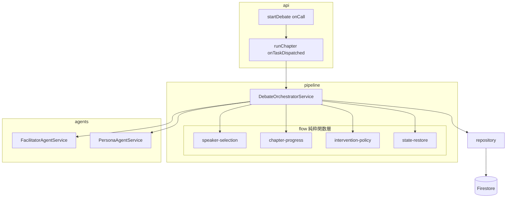
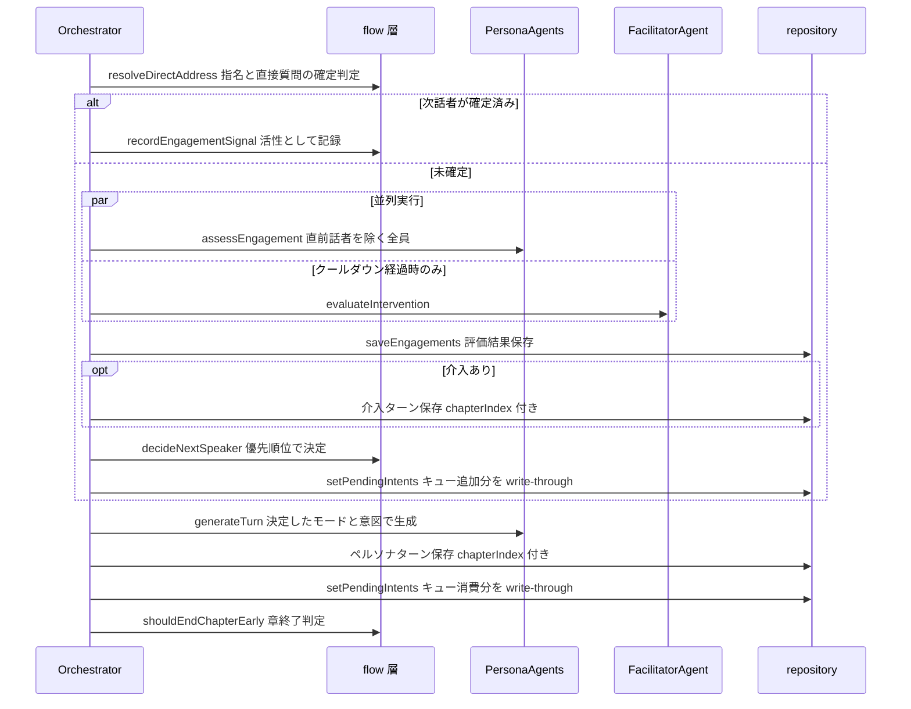
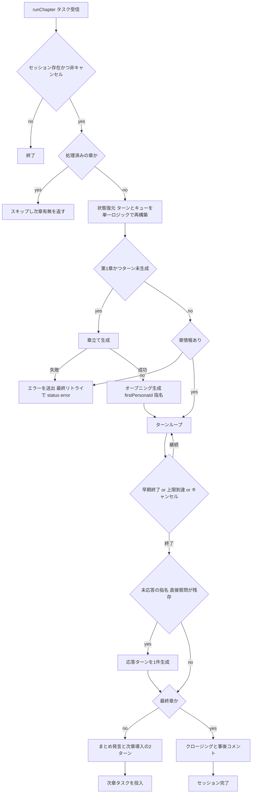

# Technical Design: debate-flow-control-redesign

## Overview

**Purpose**: 本機能は、複数の仕様で段階的に拡張され複雑化した討論フロー制御を、単一の一貫した動作仕様に対応する構造へ再設計する。管理者には「指名が無視される」「キューが章をまたいで消える」等のバグ解消を、開発者には要件と1対1対応するテスト可能なフロー制御コードを提供する。

**Users**: 管理者は討論生成の安定動作のためにこれを利用する。開発者はフロー制御ルールの変更・検証のためにこれを利用する。

**Impact**: 現行の `debate-orchestrator.ts`（857行・3実行経路）を、本番経路（Cloud Tasks 章単位実行）一本＋純粋関数のフロー制御モジュール群に再構成する。エージェント・リポジトリの公開構造は維持し、未使用コードを削除する。

### Goals
- 話者選択・介入・章進行のルールを要件と1対1対応する純粋関数に集約し、独立してテスト可能にする
- 実行経路を `executeChapterTask` に一本化し、状態復元（キュー含む）を単一ロジックにする
- 確認済みバグ（キュー章またぎ消失・指名消失・chapterIndex 欠落・メモリ/Firestore 乖離）を解消する
- フォールバック章・間隔トリガー・未使用メソッド等のデッドコードを除去する

### Non-Goals
- ペルソナの語り口・発言品質プロンプトの内容変更
- 管理画面 UI の改善（エラー表示・再実行導線は別仕様）
- Firestore スキーマの構造変更（status 値の追加・chapterIndex の付与徹底はスキーマ互換の範囲）
- LLM モデルルーティングの変更

## Boundary Commitments

### This Spec Owns
- 討論フロー制御の全ロジック: 話者選択・発言意欲評価の取り回し・意図キュー・ファシリテーター介入・章進行・ライフサイクル
- `DebateState` の構造と、保存済みターンからの状態復元ロジック
- 意図キューのデータ所有（Firestore `engagements/{personaId}.pendingIntents` をソースオブツルースとする一貫性規約）
- セッション status の `error` 終端状態の定義

### Out of Boundary
- エージェントのプロンプト内容（介入評価から `close` を外す等、フロー制御に必要な契約変更のみ行う）
- Cloud Tasks 基盤（`startDebate`/`runChapter` のキュー設定・リトライ設定）
- 公開ページ・管理画面のコンポーネント
- ペルソナ生成・取材・ステークホルダー分析パイプライン

### Allowed Dependencies
- `agents/`（FacilitatorAgentService・PersonaAgentService）— LLM 呼び出し
- `db/repository.ts` — Firestore 永続化
- `types/index.ts` — 共通型
- 依存方向: `types` → `pipeline/flow`（純粋関数）→ `pipeline/debate-orchestrator` → `api/debates`。flow 層は agents・repository・Firestore に依存してはならない

### Revalidation Triggers
- `DebateTurn`・`EngagementDoc` の保存形状変更
- セッション status 値の追加・変更（フロントエンド表示に影響）
- `runChapter` タスクペイロードの変更
- 章遷移ターンの構成変更（公開ページ DebateViewer が章見出し挿入に `chapterIndex` を使用）

## Architecture

### Existing Architecture Analysis

現状の制約と尊重すべき境界（詳細は `gap-analysis.md`）:

- 本番経路は `startDebate` → Cloud Tasks `runChapter` → `executeChapterTask` のみ。`run()`/`resume()` は本番未使用
- 章単位実行は 540 秒タイムアウト・最大3回リトライのため、**章タスクの冪等性**（`currentChapterIndex` によるスキップ、保存済みターン末尾からの再開）は維持必須
- エクスポート純粋関数＋クラスサービスのパターン（`shouldEvaluateIntervention` 等）が既にあり、これを拡張する
- 解消する技術的負債: 状態復元の3重実装、キューの二重管理、選択ロジックの分散

### Architecture Pattern & Boundary Map



**Architecture Integration**:
- Selected pattern: 進行役（オーケストレーター）＋純粋関数ポリシー層。判定ロジック（flow）と副作用（LLM 呼び出し・永続化）を分離する
- Domain boundaries: flow 層は「入力状態 → 判定結果」のみ。オーケストレーターは「LLM 呼び出し順序と永続化」のみ。エージェントは「LLM 契約」のみ
- Existing patterns preserved: クラスサービス＋DI（コンストラクタ注入）、Result 型によるエラー伝播、`arrayUnion` によるターン追記
- New components rationale: flow 4モジュールは要件 9.2（独立テスト）の直接の実現手段
- Steering compliance: Firestore アクセスは repository 集約、AI 処理は pipeline/agents 配置、アロー関数・strict mode を維持

### Technology Stack

| Layer | Choice / Version | Role in Feature | Notes |
|-------|------------------|-----------------|-------|
| Backend / Services | Firebase Functions v2（Node.js 24・TypeScript strict） | 章単位タスク実行 | 変更なし |
| AI | Anthropic SDK（facilitator）・Vercel AI SDK（persona） | 介入評価・意欲評価・発言生成 | 既存構成を維持。新規依存なし |
| Data / Storage | Firestore（Admin SDK） | ターン・章・キュー・status 永続化 | スキーマ互換維持 |
| Messaging | Cloud Tasks（`runChapter` キュー） | 章単位の非同期実行 | 設定変更なし |

## File Structure Plan

### Directory Structure
```
functions/src/
├── pipeline/
│   ├── debate-orchestrator.ts        # 縮小: 進行役（LLM呼び出し順序・永続化・状態保持）
│   ├── debate-orchestrator.test.ts   # 書き直し: executeChapterTask ベースの統合テスト
│   └── flow/                         # 新設: 純粋関数のフロー制御ポリシー
│       ├── speaker-selection.ts      # 話者決定（優先順位の単一実装）
│       ├── chapter-progress.ts       # 章終了判定・活性シグナル・ターン上限
│       ├── intervention-policy.ts    # 介入評価の実行可否（クールダウン）
│       ├── state-restore.ts          # 保存済みターンからの DebateState 復元
│       └── *.test.ts                 # 各モジュールに併置
├── agents/
│   ├── facilitator-agent.ts          # 変更: close 削除・未使用メソッド削除
│   └── persona-agent.ts              # 変更: generateTurn をコンテキストオブジェクト化
├── db/repository.ts                  # 変更: キュー write-through・error status
├── api/debates.ts                    # 変更: 最終リトライ失敗時の error status 書き込み
└── types/index.ts                    # 変更: SpeakerDecision 等の追加・close 削除
```

### Modified Files
- `pipeline/debate-orchestrator.ts` — `run()`/`resume()`/`executeDebate()`/`DEFAULT_CHAPTERS`/`evaluateParticipationBalance`/旧 `shouldEvaluateIntervention` を削除。`executeChapterTask` と章ループのみ残し、判定を flow 層へ委譲
- `agents/facilitator-agent.ts` — `selectNextSpeaker`・`evaluateChapterEnd`・`PendingThought` を削除。`INTERVENTION_TOOL` から `close` を除去しプロンプトの介入基準を更新
- `agents/persona-agent.ts` — `generateTurn(persona, belief, interviewRecord, context: TurnGenerationContext)` に整理（ロジック変更なし）
- `db/repository.ts` — `setPendingIntents` 追加（write-through 用の全置換書き込み）、`markSessionError` 追加。`consumePendingIntent` は `setPendingIntents` に置換して削除
- `types/index.ts` — `SpeakerDecision`・`TurnGenerationContext` 追加、`FacilitatorIntervention.type` から `'close'` を除去
- `functions/src/agents/*.test.ts` — 削除メソッドのテストを除去、契約変更分を更新

## System Flows

### ターンサイクル（章ループ内の1ターン）



- 意欲評価と介入評価は相互依存がないため並列実行する（レイテンシ増を回避。`research.md` 参照）
- 介入で invite 指名があった場合、`decideNextSpeaker` が最優先で採用する（要件 4.1 の優先順位 (1)）
- 活性シグナルはターンごとに必ず1件記録する: 評価実行ターンは評価結果から算出、評価スキップターン（指名・直接質問）は常に活性とみなす（要件 2.5）

### 章タスクのライフサイクル



- 冪等性: リトライ時は保存済みターン末尾から `fromTurnIndex` を再計算するため、応答ターン含め重複生成しない（`research.md` 参照）
- 章生成失敗・章情報欠落はフォールバックせずエラー終端とする（要件 2.2・8.4）

## Requirements Traceability

| Requirement | Summary | Components | Interfaces | Flows |
|-------------|---------|------------|------------|-------|
| 1.1–1.5 | ライフサイクル進行・キャンセル | DebateOrchestratorService | `executeChapterTask` | 章タスクライフサイクル |
| 2.1, 2.2 | 章生成・失敗時エラー | FacilitatorAgentService, DebateOrchestratorService | `generateChapters` | 章タスクライフサイクル |
| 2.3–2.6 | 目標/上限ターン・早期終了・シグナル一貫性 | chapter-progress | `shouldEndChapterEarly`, `chapterTurnCap` | ターンサイクル |
| 2.7 | 未応答指名の応答ターン | DebateOrchestratorService, speaker-selection | `resolveDirectAddress` | 章タスクライフサイクル |
| 2.8 | 章遷移2ターン | DebateOrchestratorService, FacilitatorAgentService | `generateChapterSummary`, `generateChapterIntroduction` | 章タスクライフサイクル |
| 2.9 | 全ターンに chapterIndex | DebateOrchestratorService, repository | `createDebateTurn` | — |
| 2.10 | close 廃止・章終了の一元化 | FacilitatorAgentService, chapter-progress | `FacilitatorIntervention` | — |
| 3.1–3.4 | 意欲評価・失敗時継続・保存 | PersonaAgentService, DebateOrchestratorService | `assessEngagement`, `saveEngagements` | ターンサイクル |
| 4.1–4.5 | 話者選択の単一優先順位 | speaker-selection | `decideNextSpeaker`, `resolveDirectAddress` | ターンサイクル |
| 5.1–5.4 | キュー追加・失効・消費・full発言 | speaker-selection, DebateOrchestratorService | `SpeakerDecision`, `TurnGenerationContext` | ターンサイクル |
| 5.5 | キュー永続化と全経路復元 | state-restore, repository | `restoreDebateState`, `setPendingIntents` | 章タスクライフサイクル |
| 6.1, 6.2 | 毎ターン評価＋クールダウン | intervention-policy | `shouldEvaluateIntervention` | ターンサイクル |
| 6.3–6.6 | 介入タイプ・指名・保存 | FacilitatorAgentService, DebateOrchestratorService | `evaluateIntervention` | ターンサイクル |
| 7.1–7.5 | 制御コンテキスト伝達・信念反映 | PersonaAgentService | `TurnGenerationContext`, `generateTurn` | ターンサイクル |
| 8.1–8.4 | 実行パス一本化・状態復元・冪等 | DebateOrchestratorService, state-restore | `executeChapterTask`, `restoreDebateState` | 章タスクライフサイクル |
| 9.1–9.4 | デッドコード除去・テスタビリティ・互換 | 全コンポーネント | — | — |

## Components and Interfaces

| Component | Domain/Layer | Intent | Req Coverage | Key Dependencies | Contracts |
|-----------|--------------|--------|--------------|------------------|-----------|
| speaker-selection | pipeline/flow | 話者決定の単一優先順位実装 | 4.1–4.5, 5.3 | types のみ (P0) | Service |
| chapter-progress | pipeline/flow | 章終了判定と活性シグナル | 2.3–2.6, 2.10 | types のみ (P0) | Service |
| intervention-policy | pipeline/flow | 介入評価の実行可否判定 | 6.1, 6.2 | types のみ (P0) | Service |
| state-restore | pipeline/flow | 保存済みデータからの状態復元 | 5.5, 8.2 | types のみ (P0) | Service |
| DebateOrchestratorService | pipeline | フェーズ進行・LLM呼び出し順序・永続化 | 1, 2, 3, 5, 6, 8 | flow (P0), agents (P0), repository (P0) | Service / Batch |
| FacilitatorAgentService | agents | ファシリテーターの LLM 契約 | 1.2, 2.1, 2.8, 6.3 | Anthropic SDK (P0) | Service |
| PersonaAgentService | agents | ペルソナの LLM 契約 | 3.2, 7.1–7.4 | Vercel AI SDK (P0) | Service |
| repository | db | キュー write-through・error status | 2.9, 3.4, 5.5 | firebase-admin (P0) | State |

### pipeline/flow（新設・純粋関数層）

#### speaker-selection

| Field | Detail |
|-------|--------|
| Intent | 次話者決定の優先順位を単一実装に集約する |
| Requirements | 4.1, 4.2, 4.3, 4.4, 4.5, 5.3 |

**Responsibilities & Constraints**
- 要件 4.1 の優先順位 (1)〜(5) を唯一実装する場所。オーケストレーター側に選択分岐を残さない
- 純粋関数: LLM・Firestore への依存禁止。同一入力に対し決定的な出力を返す
- 2段階で判定する: ターン冒頭の確定判定（前ターン由来の指名・直接質問）と、評価後の決定（invite 指名・緊急リアクション・キュー・スコア）

**Dependencies**
- Inbound: DebateOrchestratorService — 毎ターン呼び出し (P0)
- Outbound: なし（`types/index.ts` のみ）

**Contracts**: Service [x]

##### Service Interface
```typescript
type SpeakerSource = 'nomination' | 'direct_address' | 'urgent_reaction' | 'queue' | 'score';

interface SpeakerDecision {
  personaId: string;
  source: SpeakerSource;
  mode?: 'full' | 'reaction';   // nomination/queue は 'full' 固定
  intentSummary?: string;
}

interface DirectAddressInput {
  pendingAddress?: { personaId: string; byFacilitator: boolean };
  consecutiveDirectExchanges: number;  // 上限 3
  personaIds: ReadonlyArray<string>;
}

/** ターン冒頭: 前ターン由来の指名・直接質問で次話者が確定するか判定する */
const resolveDirectAddress = (input: DirectAddressInput): SpeakerDecision | null;

interface SpeakerSelectionInput {
  assessments: ReadonlyArray<{
    personaId: string;
    score: number;
    mode: 'full' | 'reaction' | 'none';
    intentSummary?: string;
  }>;
  interventionTargetId?: string;  // invite 介入の指名（最優先）
  pendingIntents: ReadonlyMap<string, ReadonlyArray<PendingIntent>>;
  silenceMap: ReadonlyMap<string, number>;
  lastSpeakerId?: string;
  personaIds: ReadonlyArray<string>;
}

/** 評価後: invite 指名 > 緊急リアクション > キュー > スコアの順で決定する */
const decideNextSpeaker = (input: SpeakerSelectionInput): SpeakerDecision;
```
- Preconditions: `personaIds` は1件以上。`assessments` は直前話者を含まない
- Postconditions: 戻り値の `personaId` は必ず `personaIds` に含まれる（不正 ID は要件 4.5 によりスコア選択へフォールバック）。`source: 'nomination' | 'queue'` のとき `mode: 'full'`
- Invariants: `lastSpeakerId` は唯一の最高スコア保持者である場合を除き選択されない（要件 4.4）

#### chapter-progress

| Field | Detail |
|-------|--------|
| Intent | 章終了判定と活性シグナルの記録規約を提供する |
| Requirements | 2.3, 2.4, 2.5, 2.6, 2.10 |

**Responsibilities & Constraints**
- 章終了の判断はこのモジュールのみが行う（介入評価の close は廃止。要件 2.10）
- 活性シグナルは「ターンごとに必ず1件」記録される前提で判定する（記録規約は本モジュールが定義し、記録の実行はオーケストレーター）

**Dependencies**
- Inbound: DebateOrchestratorService — 毎ターン呼び出し (P0)

**Contracts**: Service [x]

##### Service Interface
```typescript
/** 評価結果から活性シグナルを算出する。評価スキップターンは常に 1 とする */
const toEngagementSignal = (
  assessments: ReadonlyArray<{ score: number; mode: 'full' | 'reaction' | 'none' }>
): 0 | 1;

interface ChapterEndInput {
  chapterTurnCount: number;            // 章内ペルソナ発言数
  targetTurns: number;                 // turnsPerChapter
  engagementSignals: ReadonlyArray<0 | 1>;  // 直近の活性記録（古い順）
}

/** 75% 消化かつ直近5シグナルすべて非活性で true */
const shouldEndChapterEarly = (input: ChapterEndInput): boolean;

/** 章の強制終了上限 = ceil(targetTurns * 1.5) */
const chapterTurnCap = (targetTurns: number): number;
```
- Preconditions: `engagementSignals` はターン順
- Postconditions: `shouldEndChapterEarly` はシグナルが5件未満なら必ず false
- Invariants: 全ペルソナの発言有無は判定に使用しない（要件 2.4 注記）

#### intervention-policy

| Field | Detail |
|-------|--------|
| Intent | 介入評価を実行すべきタイミングを判定する |
| Requirements | 6.1, 6.2 |

**Contracts**: Service [x]

##### Service Interface
```typescript
interface InterventionPolicyInput {
  speakerPredetermined: boolean;        // 指名・直接質問で次話者確定済みか
  personaTurnsSinceFacilitator: number; // 前回ファシリテーター発言以降のペルソナ発言数
  cooldownTurns: number;                // 既定 2
}

/** 次話者未確定かつクールダウン経過で true（毎ターン評価が原則） */
const shouldEvaluateIntervention = (input: InterventionPolicyInput): boolean;
```
- Invariants: 旧実装の間隔トリガー・沈黙トリガーは持たない（沈黙者は毎回の介入評価内で invite として扱われる）

#### state-restore

| Field | Detail |
|-------|--------|
| Intent | 保存済みターン・キューから DebateState を一意に復元する |
| Requirements | 5.5, 8.2 |

**Responsibilities & Constraints**
- 状態復元ロジックの唯一の実装（現行の `resume()`/`executeChapterTask` 内の重複を置換）
- キューの失効（8ターン超過）を復元時に適用する

**Contracts**: Service [x]

##### Service Interface
```typescript
interface DebateState {
  history: DebateTurn[];
  currentBeliefs: Map<string, { content: string; version: number }>;
  silenceMap: Map<string, number>;
  speakCount: Map<string, number>;
  pendingAddress?: { personaId: string; byFacilitator: boolean };
  lastSpeakerId?: string;
  pendingIntents: Map<string, PendingIntent[]>;
  consecutiveDirectExchanges: number;
  lastFacilitatorTurnIndex: number;
  currentTurnIndex: number;
  engagementSignals: Array<0 | 1>;
}

const restoreDebateState = (input: {
  turns: ReadonlyArray<DebateTurn>;            // 保存済み全ターン（ソート済み）
  personas: ReadonlyArray<PersonaAttributes>;
  persistedPendingIntents: ReadonlyMap<string, ReadonlyArray<PendingIntent>>;
  currentBeliefs: Map<string, { content: string; version: number }>;
}): DebateState;
```
- Postconditions: `currentTurnIndex` は保存済み最終ターン+1。キューは失効分除去済み
- Invariants: 同一入力から常に同一の状態を生成する（リトライ安全性の根拠）

### pipeline

#### DebateOrchestratorService

| Field | Detail |
|-------|--------|
| Intent | 章単位タスクの進行役。LLM 呼び出しの順序制御と永続化のみを担う |
| Requirements | 1.1–1.5, 2.1, 2.2, 2.7–2.9, 3.1, 3.3, 3.4, 5.1, 5.2, 5.4, 6.3–6.6, 7.5, 8.1, 8.3, 8.4 |

**Responsibilities & Constraints**
- 公開メソッドは `executeChapterTask(topicId, chapterIndex): Promise<boolean>` のみ（`run`/`resume` は削除）
- 判定はすべて flow 層へ委譲し、自身は分岐ロジックを持たない（要件 9.1 の検証観点）
- すべてのターン保存で `chapterIndex` を必須で付与する（介入・クロージング含む。要件 2.9）
- キュー変更（追加・消費・失効）は発生の都度 `setPendingIntents` で Firestore に反映する（write-through）

**Dependencies**
- Inbound: api/debates `runChapter` — タスク実行 (P0)
- Outbound: flow 層 (P0) / FacilitatorAgentService (P0) / PersonaAgentService (P0) / repository (P0)

**Contracts**: Service [x] / Batch [x]

##### Service Interface
```typescript
interface OrchestratorOptions {
  turnsPerChapter: number;      // 既定 15
  maxTurns: number;             // 既定 200
  interventionCooldown: number; // 既定 2
}
// 削除: interventionInterval, silenceThreshold, minTurnsPerPersona, minSpeaksPerPersonaInChapter

class DebateOrchestratorService {
  constructor(
    facilitator?: FacilitatorAgentService,
    personaAgent?: PersonaAgentService,
    options?: OrchestratorOptions
  );
  /** @returns 次章が存在する場合 true（呼び出し元が次章タスクを投入する） */
  executeChapterTask(topicId: string, chapterIndex: number): Promise<boolean>;
}
```

##### Batch / Job Contract
- Trigger: Cloud Tasks `runChapter`（ペイロード `{ topicId, chapterIndex }`、変更なし）
- Input / validation: セッション存在・非キャンセル・章情報（chapterIndex > 0 のとき必須、欠落はエラー）
- Output / destination: ターン・キュー・章インデックス・status を Firestore へ
- Idempotency & recovery: `currentChapterIndex` による処理済みスキップ＋保存済みターン末尾からの再開（現行機構を維持）。回復不能失敗は例外を送出し Cloud Tasks リトライに委ねる

**Implementation Notes**
- Integration: ターンループは「確定判定 →（並列: 意欲評価・介入評価）→ 決定 → 生成 → 永続化 → 章終了判定」の固定順とし、System Flows のシーケンスに一致させる
- Validation: 章上限到達時に `pendingAddress` が残っている場合のみ応答ターンを1件生成する（+1ターン許容。要件 2.7）
- Risks: 介入評価の並列化により topic_shift 直後の意欲評価が1ターン分古い文脈になる（現行と同等。`research.md` 参照）

### agents

#### FacilitatorAgentService（変更）

| Field | Detail |
|-------|--------|
| Intent | ファシリテーター発言の LLM 契約。フロー判断は持たない |
| Requirements | 1.2, 2.1, 2.8, 6.3, 6.4 |

**Responsibilities & Constraints**
- 削除: `selectNextSpeaker`・`evaluateChapterEnd`・`PendingThought`（要件 9.1）
- `evaluateIntervention`: ツールスキーマとプロンプトから `close` を除去し、介入基準を「topic_shift / invite / 介入不要」の3値に更新。「活発に進行中は介入不要」を明示する（要件 6.4）
- 維持: `generateOpening`・`generateChapters`・`generateChapterSummary`・`generateChapterIntroduction`・`generateClosing`

**Contracts**: Service [x]

##### Service Interface
```typescript
// 変更後の介入契約（types/index.ts）
interface FacilitatorIntervention {
  shouldIntervene: boolean;
  type?: 'topic_shift' | 'invite';  // 'close' を削除
  content?: string;
  targetPersonaId?: string;
}
```

#### PersonaAgentService（変更）

| Field | Detail |
|-------|--------|
| Intent | ペルソナ発言・意欲評価の LLM 契約 |
| Requirements | 3.2, 7.1, 7.2, 7.3, 7.4 |

**Responsibilities & Constraints**
- `generateTurn` の制御パラメータ6個を `TurnGenerationContext` に統合（呼び出し元はオーケストレーターのみ。挙動変更なし）
- `assessEngagement`・`generatePostDebateComment` は変更なし

**Contracts**: Service [x]

##### Service Interface
```typescript
interface TurnGenerationContext {
  chapterHistory: ReadonlyArray<DebateTurn>;
  chapter: DebateChapter;
  mode?: 'full' | 'reaction';
  intentSummary?: string;
  pendingTrigger?: { speakerName: string; content: string };
  nominatedByFacilitator: boolean;
}

class PersonaAgentService {
  generateTurn(
    persona: PersonaAttributes,
    currentBelief: string,
    interviewRecord: string,
    context: TurnGenerationContext
  ): Promise<Result<AgentTurnResult, PipelineError>>;
}
```

### db

#### repository（変更）

| Field | Detail |
|-------|--------|
| Intent | キューの write-through 書き込みとエラー終端状態の永続化 |
| Requirements | 2.9, 3.4, 5.5 |

**Responsibilities & Constraints**
- 追加: `setPendingIntents`（ペルソナ単位の全置換書き込み。メモリ側ワーキングコピーの変更を都度反映する）
- 追加: `markSessionError`（`sessions/0.status = 'error'`）
- 削除: `consumePendingIntent`（read-modify-write を `setPendingIntents` に置換）
- `createDebateTurn` の `chapterIndex` は呼び出し側で必須とする（型上は既存互換のため optional を維持し、オーケストレーターの規約で担保）

**Contracts**: State [x]

##### State Management
- State model: `topics/{topicId}/sessions/0/engagements/{personaId}.pendingIntents` をキューのソースオブツルースとする。メモリ（`DebateState.pendingIntents`）は章タスク実行中のワーキングコピー
- Persistence & consistency: キュー変更イベント（追加・消費・失効）の都度、該当ペルソナの配列を全置換書き込み。章タスク開始時に `loadPendingIntents` で復元
- Concurrency strategy: 章タスクは `rateLimits` と冪等性チェックにより同一セッションで直列実行されるため、競合書き込みは発生しない

```typescript
const setPendingIntents = (
  sessionId: string,
  personaId: string,
  items: ReadonlyArray<PendingIntentEntry>
): Promise<void>;

const markSessionError = (topicId: string): Promise<void>;
```

## Data Models

本仕様で変更されるのは以下のみ（スキーマ構造の変更なし）:

- **`sessions/0.status`**: 取りうる値に `'error'` を追加（`debating | completed | cancelled | error`）。書き込みは `runChapter` の最終リトライ失敗時のみ
- **`turns[].chapterIndex`**: 全ターンで必須付与に統一（現状欠落している介入・クロージングターンにも付与）。既存データは欠落のまま許容し、読み取り側の optional 扱いを維持する（要件 9.4）
- **`turns[].addressedPersonaId`**（追加・optional）: 指名・直接質問の対象ペルソナ ID。指名を伴うターン（オープニング・章導入・invite 介入・ペルソナの直接質問）で付与し、状態復元時の直近指名の唯一の情報源とする（名前マッチによる推定は行わない）。既存データは欠落のまま許容する
- **`engagements/{personaId}.pendingIntents`**: 形状変更なし。一貫性規約のみ変更（write-through・章開始時復元・復元時失効適用）

## Error Handling

### Error Strategy
既存の `Result<T, PipelineError>` パターンを維持し、回復可能性で処理を分ける。

### Error Categories and Responses
- **回復不能（章立て生成失敗・オープニング失敗・章情報欠落・発言生成失敗）**: 例外を送出して章タスクを失敗させ、Cloud Tasks のリトライ（最大3回）に委ねる。最終リトライ失敗時（`req.retryCount` が上限）は `markSessionError` で `status: 'error'` を書き込む。フォールバック生成は行わない（要件 2.2・8.4）
- **回復可能（個別ペルソナの意欲評価失敗）**: score 1・mode none として継続（要件 3.3）
- **状態系（セッション不存在・キャンセル）**: 正常終了扱いで処理を打ち切る（要件 1.5）
- **回復可能（事後コメントの個別失敗）**: 該当ペルソナのコメントをスキップして継続（現行踏襲）

### Monitoring
- 章タスクの失敗は Functions の標準ログ＋Cloud Tasks リトライ記録で追跡（現行どおり）
- `status: 'error'` により管理画面から失敗セッションが判別可能になる

## Testing Strategy

### Unit Tests（flow 層・純粋関数）
1. `decideNextSpeaker`: 優先順位 (1)〜(5) の網羅（invite 指名が緊急リアクションに勝つ、score 同点時の沈黙優先、不正 ID フォールバック、連続発言回避と唯一最高スコア例外）
2. `resolveDirectAddress`: ファシリテーター指名は連続交換上限を無視する／ペルソナ間直接質問は3回で中断する
3. `shouldEndChapterEarly` / `chapterTurnCap`: 75%・5シグナル・150% の境界値
4. `shouldEvaluateIntervention`: クールダウン境界と次話者確定時のスキップ
5. `restoreDebateState`: ターン履歴からの speakCount/silenceMap/直近指名の復元、キュー失効適用、決定性（同一入力→同一出力）

### Integration Tests（`executeChapterTask`・エージェントと repository をモック）
1. 章をまたいだキューの復元と write-through（消失バグの回帰テスト）
2. すべての保存ターンに chapterIndex が付与される（介入・クロージング含む）
3. 章上限到達時に未応答指名の応答ターンが生成され、その後章遷移する
4. 章立て生成失敗時にフォールバックせず例外送出する／キャンセル時に途中終了する
5. リトライ再実行時の冪等性（処理済み章スキップ・保存済みターンからの再開）

### Agent Contract Tests（既存パターン踏襲・LLM モック）
1. `evaluateIntervention` のツールスキーマに `close` が含まれない
2. `generateTurn` が `TurnGenerationContext` の各フィールドをプロンプトに反映する
