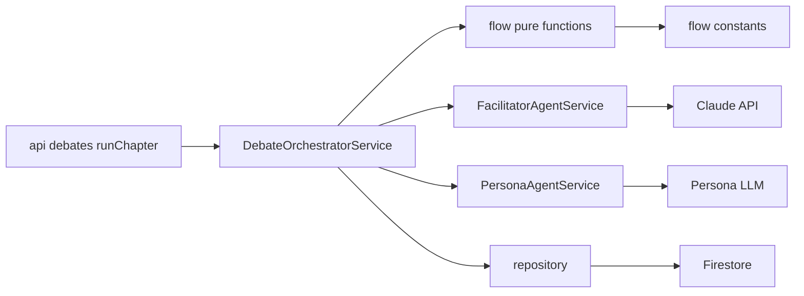
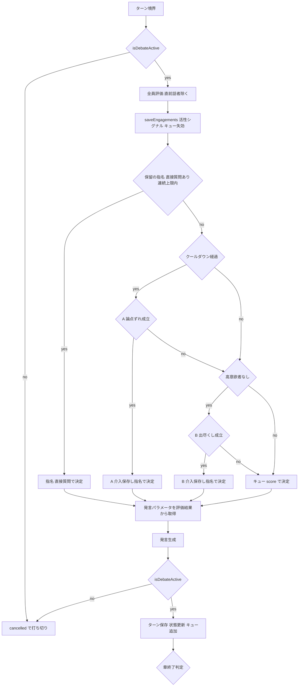

# Technical Design: debate-flow-simplification

## Overview

**Purpose**: 討論生成のターン進行ロジックを平易な単位に分解し、散在した分岐・閾値・ドキュメントの不整合を解消する。あわせて精査で確定したバグ（B介入のクールダウン誤適用）と挙動の不整合（介入が指名を破棄する／評価する分岐としない分岐の混在）を正す。

**Users**: 本機能の直接の受益者は本リポジトリの開発者（保守性・可読性）。間接的に、管理者が生成する討論コンテンツの進行品質が安定する。

**Impact**: `functions/src/pipeline/debate-orchestrator.ts` のターンループと `flow/` 純関数群を再構成する。公開メソッド（`generateChaptersOnly` / `executeChapterTask`）の契約と Firestore スキーマは変更しない。討論の観測可能な振る舞いは原則維持し、明示的に確定した3点のみ意図的に変更する。

### Goals
- 1ターンの進行を「停止ゲート → 全員評価 → 話者決定 → 発言パラメータ取得 → 発言生成・保存 → 状態更新 → 章終了判定」の単一の流れとして、コードと文書を一致させる。
- 評価経路を1本化（毎ターン全員評価）し、話者1人を再評価する第2経路を edge ケースに縮退させる。
- 論点ずれ介入(A)と出尽くし介入(B)を別処理として保ちつつ、発火条件・指名解決・発言保存を各処理内に一意配置する。
- 制御閾値・定数を単一定義にし、ドキュメント／コメントを実装と一致させる。
- メソッドを単一責務へ分割し役割に対応した命名へ統一する（過度な分割はしない）。

### Non-Goals
- 討論アルゴリズムの新方針（新しい話者選択方式・新しい介入種別）の追加。
- LLM プロンプト文面の品質改善、章立て構成方針の変更。
- Firestore スキーマ・永続化データ構造の変更、公開ページ／管理画面の変更。
- ④ maxTurns 到達時の空章挙動、⑤ `saveEngagements` のインデックス（いずれも今回は据え置き）。

### 確定した振る舞い変更（要件8.1の例外・テスト基準）

整理（振る舞い不変）と区別し、以下は**意図的な挙動変更**として扱う。テスト期待値の更新はこの一覧に対応するもののみとし、それ以外は回帰ガードとしてグリーンを維持する（要件8.5）。

- **BC1（バグ修正）**: 出尽くし介入(B)をクールダウンに依存させない。B の gate は「高意欲者なし」のみ（要件3.2/3.4）。
- **BC2**: 優先順位を「指名/直接質問 ＞ A ＞ B ＞ キュー ＞ スコア」に変更し、A は指名が無いときのみ評価する（指名・直接質問を破棄しない）（要件2.1/3.5）。
- **BC3**: 発言意欲評価を毎ターン全員（直前話者除く）に統一する（要件4.1）。
- **BC3 の波及（明示）**: BC3 により、従来スキップしていた**指名・直接質問・A 成立のターンでも、`saveEngagements`（可視化保存）とキュー追加（非選択かつ高意欲者の write-through）が実行される**。これは BC3 の必然的帰結であり、可視化の穴・キュー保守の偏りを解消する意図的デルタである（要件5.4）。`resolveSpeechParams` の単独再評価は edge ケースに縮退する。

## Boundary Commitments

### This Spec Owns
- `debate-orchestrator.ts` のターン進行ロジック（章ループ・話者決定・発言生成・状態更新の構造）。
- `flow/` 純関数（speaker-selection・chapter-progress・intervention-policy・state-restore）の分岐・閾値・命名。
- フロー制御定数の単一定義（新規 `flow/constants.ts`）。
- 論点ずれ介入(A)・出尽くし介入(B)の発火順序・gate 条件の配置（呼び出し側）。
- 1ターンの正準フローを記述する設計ドキュメント（本書 System Flows 節）。

### Out of Boundary
- `FacilitatorAgentService` / `PersonaAgentService` の LLM 呼び出しの**中身**（プロンプト・モデル選択）。インターフェースは現状維持で利用する。
- `repository` 層の関数シグネチャ・Firestore ドキュメント構造。
- `api/debates.ts`（Cloud Tasks 起動・リトライ・停止処理）のロジック。公開メソッド契約のみ尊重する。

### Allowed Dependencies
- 既存 `repository` の読み書き関数（`getDebateTurnsBySessionId`・`saveEngagements`・`setPendingIntents`・`loadPendingIntents`・`createDebateTurn` など）。
- 既存 `FacilitatorAgentService.evaluateTopicDrift` / `evaluateStallIntervention` / `PersonaAgentService.assessEngagement` / `generateTurn`。
- 依存方向: `types` → `flow/constants` → `flow/*`（純関数） → `agents` → `debate-orchestrator`（service） → `api`。左方向のみ参照。

### Revalidation Triggers
- `executeChapterTask` / `generateChaptersOnly` のシグネチャ変更（→ api/debates.ts 再確認）。
- `DebateState` の形・`restoreDebateState` の復元規則の変更（→ state 復元の決定性に依存する全テスト）。
- `SpeakerDecision` / `SpeakerSource` 型の変更（→ speaker-selection と orchestrator）。
- 確定した3つの振る舞い変更の範囲を超える挙動変更（→ 要件8-5 に従い記録）。

## Architecture

### Existing Architecture Analysis
- **現行パターン**: orchestrator（`DebateOrchestratorService`）が、純関数の `flow/*` と LLM エージェント（facilitator/persona）を組み合わせて章ループを駆動する。タスクはステートレスで、毎回 `restoreDebateState` が保存済みターン＋永続化キューから `DebateState` を一意に復元する。
- **尊重する境界**: 純関数（flow）／副作用（repository・agents）／オーケストレーション（orchestrator）の3層。フロントエンドからの直接アクセス禁止（Functions 経由）。
- **対処する技術的負債**: god-method `evaluateAndDecide`（6責務）、評価二経路、閾値の二重定義／散在、docstring と実装の不一致、分岐採番の欠番。

### Architecture Pattern & Boundary Map



**Architecture Integration**:
- Selected pattern: 既存の3層（純関数 / エージェント / オーケストレーション）を維持し、ターンループを**平易な private メソッドへ分解**するハイブリッド（research.md Option C）。
- Domain/feature boundaries: 「評価」「話者決定」「発言生成」「状態更新」を別メソッドに分離。A/B 介入はそれぞれ独立メソッド。
- Existing patterns preserved: ステートレス・タスク再開、`Result` 型のエラー伝播、flow 純関数の独立テスト。
- New components rationale: `flow/constants.ts` のみ新設（値の単一定義）。新しい抽象レイヤ・中央ディスパッチャは作らない（steering「過度な共通化禁止」・要件の「平易な分解」指針）。
- Steering compliance: アロー関数標準、省略名禁止、型は Functions 側 `types/index.ts`、エミュレータ非使用前提の Vitest 検証。

### Technology Stack

| Layer | Choice / Version | Role in Feature | Notes |
|-------|------------------|-----------------|-------|
| Backend / Services | TypeScript (strict), Node.js 24, Firebase Functions v2 | 討論オーケストレーション | 変更は内部構造のみ。新規依存なし |
| AI | Anthropic SDK（Claude / facilitator）, persona LLM ルーティング | 介入・評価・発言生成 | インターフェース現状維持で利用 |
| Data / Storage | Firestore | ターン・エンゲージメント・キュー永続化 | スキーマ変更なし |
| Testing | Vitest | flow 純関数・orchestrator の単体/結合 | behavior oracle |

新規外部依存なし。既存スタックの内部リファクタリングに閉じる。

## File Structure Plan

### New Files
```
functions/src/pipeline/flow/
└── constants.ts          # フロー制御定数の単一定義（閾値・上限・比率）
```

### Modified Files
- `functions/src/pipeline/debate-orchestrator.ts` — `evaluateAndDecide` を「評価ステップ」「話者決定（priority 合成）」「キュー追加（post-turn）」に分解。A/B 介入を別 private メソッドへ。`runChapterLoop` を統一フローに沿って整理。`INTENT_EXPIRY_TURNS` のローカル定義を `flow/constants.ts` 参照へ。
- `functions/src/pipeline/flow/speaker-selection.ts` — `decideNextSpeaker` から invite(B) 分岐を除去し queue/score のみに縮退、採番を (1)(2) に整理。`MAX_CONSECUTIVE_DIRECT` を constants 参照へ。`isHighEngagement` / `hasHighEngagement` 述語を新設し、キュー選択ゲートに使用。
- `functions/src/pipeline/flow/chapter-progress.ts` — 活性シグナル判定を `isHighEngagement` 述語＋`ACTIVE_SIGNAL_STRONG_SCORE` 参照へ（スコア境界の単一化）。
- `functions/src/pipeline/flow/state-restore.ts` — `INTENT_EXPIRY_TURNS` の二重定義を解消し constants 参照へ。
- `functions/src/pipeline/flow/intervention-policy.ts` — `shouldEvaluateIntervention` を A 専用と明確化（命名・docstring を A 限定に）。
- 対応テスト（`debate-orchestrator.test.ts` / `*.integration.test.ts` / `flow/*.test.ts`）— 確定した振る舞い変更（B クールダウン除去・指名優先・毎ターン評価）に合わせて期待値を更新。

> 各ファイルは単一責務を保つ。新規ファイルは値定義のみの `constants.ts` に限定し、ロジックの新規共通モジュールは作らない。

## System Flows

### 1ターンの正準フロー（process）



**フロー上の決定ポイント**:
- **評価は毎ターン無条件**（停止ゲート通過後）。可視化保存・活性シグナル・キュー失効はここに集約。
- **話者決定は priority 合成**: 指名/直接質問 ＞ A ＞ B ＞ キュー ＞ スコア。A・B は「指名が無いとき」のみ評価する（指名を破棄しない）。
- **A の gate はクールダウン**、**B の gate は『高意欲者なし』**（クールダウン非依存）。両者は別メソッド。
- **キュー追加は話者決定の後**（非選択かつ高意欲のペルソナを write-through）。
- 生成中に停止された場合は保存せず `cancelled`。介入発言は決定時点で保存済みだが、再開は章頭破棄（`restartDebate`）または `pendingAddress` 復元で整合する。

### チャプタータスクのライフサイクル（参考）
章立て生成（`generateChaptersOnly`）→ `startDebate` で chapter 0 タスク投入 →（停止ゲート→第1章オープニング→ターンループ→未応答リプライ→章遷移 or 終端）→ 次章タスク投入 …→ 最終章で `finalizeDebate`。本仕様はこのライフサイクルの**章ループ内部**のみを整理対象とする。

## Requirements Traceability

| Requirement | Summary | Components | Interfaces | Flows |
|-------------|---------|------------|------------|-------|
| 1.1–1.5 | 正準フローの単一記述（A/B 別処理の明示） | 本書 System Flows | — | 1ターン正準フロー |
| 2.1 | 優先順位 指名>A>B>キュー>スコア | runChapterLoop, decideNextSpeaker | `decideNextSpeaker` | 話者決定 |
| 2.2 | 採番の単一体系（欠番解消） | decideNextSpeaker | — | — |
| 2.3 | 直前話者の連続回避維持 | decideNextSpeaker | — | — |
| 2.4 | 不正指名IDのフォールバック | validPersonaId, decideNextSpeaker | — | — |
| 3.1 | A/B を別処理として保持 | tryTopicDriftIntervention, tryStallIntervention | — | 話者決定 |
| 3.2,3.3 | クールダウンは A 専用 | intervention-policy, runChapterLoop | `shouldEvaluateDriftCooldown` | DriftGate |
| 3.4 | B は出尽くしのみで発火 | tryStallIntervention | — | StallGate |
| 3.5 | 指名がある間は介入しない | runChapterLoop | — | Pending 分岐 |
| 3.6 | A/B の責務を各処理に一意配置 | tryTopicDriftIntervention, tryStallIntervention | — | — |
| 4.1 | 毎ターン全員評価 | evaluateEngagement | — | Assess |
| 4.2 | 発言パラメータは評価結果から取得 | resolveSpeechParams | `resolveSpeechParams` | Speech |
| 4.3 | 章末リプライが同じ処理単位を再利用 | generateUnansweredReply | — | — |
| 4.4 | 評価不能時の最小発言フォールバック | resolveSpeechParams, speechFromAssessment | — | — |
| 5.1 | engagementSignals を1ターン1回 | evaluateEngagement | — | Persist |
| 5.2 | consecutiveDirectExchanges を一貫更新 | (post-turn 状態更新) | — | — |
| 5.3 | ファシリ発言保存に状態更新を集約 | saveFacilitatorTurn | — | — |
| 5.4 | 可視化保存・キュー保守を毎ターン一貫 | evaluateEngagement, (post-turn) | — | Persist/Save |
| 5.5 | キュー意図を drift で破棄せず保持 | (キュー保守) | — | — |
| 5.6 | 状態復元の決定性維持 | restoreDebateState | `restoreDebateState` | — |
| 6.1–6.2,6.4 | 閾値・定数の単一定義 | flow/constants.ts | — | — |
| 6.3 | 同一意味の閾値を単一定義から参照（高意欲述語） | isHighEngagement, hasHighEngagement | `isHighEngagement` | — |
| 7.1–7.3 | docstring/コメントと実装一致 | 全対象ファイル | — | — |
| 8.1–8.5 | 振る舞い保全（確定変更は例外） | 全対象＋テスト | — | — |
| 9.1–9.5 | メソッドの単一責務・命名 | debate-orchestrator メソッド群 | — | — |

## Components and Interfaces

| Component | Domain/Layer | Intent | Req Coverage | Key Dependencies (P0/P1) | Contracts |
|-----------|--------------|--------|--------------|--------------------------|-----------|
| flow/constants | flow（値定義） | 制御閾値の単一定義 | 6 | — | State (定数) |
| decideNextSpeaker | flow（純関数） | キュー/スコアのみで次話者決定 | 2 | constants (P1) | Service |
| evaluateEngagement | orchestrator | 毎ターン全員評価＋可視化保存＋キュー保守 | 4, 5 | PersonaAgent (P0), repo (P0) | Service, State |
| tryTopicDriftIntervention | orchestrator | A：論点ずれ介入（指名が無く・クールダウン経過時） | 3 | Facilitator (P0), repo (P1) | Service |
| tryStallIntervention | orchestrator | B：出尽くし介入（指名が無く・高意欲者なし時） | 3 | Facilitator (P0), repo (P1) | Service |
| resolveSpeechParams | orchestrator | 発言パラメータを評価結果から取得（edge のみ再評価） | 4 | speechFromAssessment (P1) | Service |
| runChapterLoop | orchestrator | 統一フローでターン進行を駆動 | 1,2,3,5 | 上記すべて (P0) | Service, State |

### flow（純関数・値定義）

#### flow/constants

| Field | Detail |
|-------|--------|
| Intent | フロー制御に使う閾値・上限・比率を単一定義する |
| Requirements | 6.1, 6.2, 6.3, 6.4 |

**Responsibilities & Constraints**
- 値の定義のみ（ロジックを持たない）。各 flow 関数・orchestrator から参照される単一の真実源。
- キュー追加（`>= HIGH_ENGAGEMENT_SCORE`）とキュー選択（`< HIGH_ENGAGEMENT_SCORE`）が同一境界を逆向きに使うことを、単一定数＋比較方向の表現で固定する（向き取り違え防止）。
- 「高意欲」の**判定ロジック**は値だけでなく述語としても単一化する。純関数 `isHighEngagement(assessment)` / `hasHighEngagement(assessments)` を flow（例: `speaker-selection.ts`）に1つ定義し、(1) B ゲート（`tryStallIntervention` の「高意欲者なし」）、(2) キュー選択ゲート（`decideNextSpeaker`）、(3) 活性シグナル（`toEngagementSignal`）の判定を同一述語から導出する（要件6.3）。これは値の派生のみで条件分岐を増やさないため「過度な共通化」に当たらない。
```typescript
export const isHighEngagement: (a: { score: number }) => boolean;      // a.score >= HIGH_ENGAGEMENT_SCORE
export const hasHighEngagement: (as: ReadonlyArray<{ score: number }>) => boolean;
```

**Contracts**: State [x]

##### State Management
```typescript
export const INTENT_EXPIRY_TURNS = 8;        // 意図キューの失効ターン数（state-restore と共有）
export const HIGH_ENGAGEMENT_SCORE = 4;      // 高意欲の下限。>= で高意欲/キュー追加、< でキュー選択
export const ACTIVE_SIGNAL_STRONG_SCORE = 5; // mode に依らず活性とみなすスコア
export const MAX_CONSECUTIVE_DIRECT = 3;     // 連続直接質問の上限
export const DEFAULT_INTERVENTION_COOLDOWN = 2;
export const TURNS_PER_CHAPTER = 15;
export const MAX_TURNS = 200;
export const RECENT_SIGNAL_WINDOW = 5;
export const EARLY_END_PROGRESS_RATIO = 0.75;
export const TURN_CAP_RATIO = 1.5;
```
- Invariants: `DebateOrchestratorService` の `OrchestratorOptions` 既定値も同じ定数を参照し、二重定義を残さない。

#### decideNextSpeaker（speaker-selection.ts）

| Field | Detail |
|-------|--------|
| Intent | 介入・指名で決まらなかったときに、キュー→スコアで次話者を決める純関数 |
| Requirements | 2.1, 2.2, 2.3, 2.4 |

**Responsibilities & Constraints**
- invite(B) 分岐を削除（B は呼び出し側で `SpeakerDecision` を直接生成）。本関数はキュー（`hasHighEngagement(assessments)` が偽のとき最古エントリ保持者）→ スコア降順（同点は沈黙優先・直前話者回避）の2段のみ。キュー選択ゲートは B ゲートと同一述語を用いる。
- 分岐採番を (1) キュー / (2) スコア に整理（欠番解消）。
- 不正 ID・空集合のフォールバックは現行規則を維持。

**Contracts**: Service [x]
```typescript
export interface SpeakerSelectionInput {
  assessments: ReadonlyArray<SpeakerAssessment>;
  pendingIntents: ReadonlyMap<string, ReadonlyArray<PendingIntent>>;
  silenceMap: ReadonlyMap<string, number>;
  lastSpeakerId?: string;
  personaIds: ReadonlyArray<string>;
}
export const decideNextSpeaker: (input: SpeakerSelectionInput) => SpeakerDecision;
```
- 変更点: `interventionTargetId` 引数を削除（B は orchestrator 側で解決）。
- Preconditions: `assessments` は当ターンの全員評価結果（直前話者除く）。
- Postconditions: `source` は `'queue' | 'score'` のいずれか。

### orchestrator（ターン進行）

#### evaluateEngagement

| Field | Detail |
|-------|--------|
| Intent | 毎ターン、全員（直前話者除く）の発言意欲を評価し、可視化保存・活性シグナル・キュー失効を行う |
| Requirements | 4.1, 5.1, 5.4, 5.5 |

**Responsibilities & Constraints**
- `evaluateAndDecide` から「評価・保存・キュー保守」責務を抽出（決定・キュー追加は含めない＝単一責務）。
- 各ターンちょうど1回だけ `engagementSignals` を push（要件5.1）。
- キュー失効は `INTENT_EXPIRY_TURNS` を適用し write-through。**A 介入をまたいでも失効上限内の意図は保持**（要件5.5）。
- 評価失敗は最低意欲（score 1 / mode none）として継続。

**Dependencies**
- Outbound: `PersonaAgentService.assessEngagement` — 意欲評価 (P0)
- Outbound: `repository.saveEngagements` / `setPendingIntents` — 可視化・キュー永続化 (P0)

**Contracts**: Service [x], State [x]
```typescript
private async evaluateEngagement(
  sessionId: string,
  personas: PersonaAttributes[],
  interviewRecords: Map<string, string>,
  state: DebateState
): Promise<SpeakerAssessment[]>;
```
- Postconditions: 返り値は直前話者を除く全員の評価。`saveEngagements`・`engagementSignals`・キュー失効が反映済み。キュー追加は**未実施**（決定後に行う）。

#### tryTopicDriftIntervention（A）／ tryStallIntervention（B）

| Field | Detail |
|-------|--------|
| Intent | A=論点を本題へ引き戻す介入、B=出尽くし時に新論点へ振る介入。いずれも指名が無いときのみ評価する別処理 |
| Requirements | 3.1, 3.2, 3.3, 3.4, 3.6 |

**Responsibilities & Constraints**
- 共通ハンドラに統合しない（要件3.1）。各々が「発火判定 → 介入発言保存（`saveFacilitatorTurn`）→ 指名 `SpeakerDecision` 返却」を自処理内に一意に持つ。
- A の gate: クールダウン経過（`shouldEvaluateDriftCooldown`）。B の gate: 高意欲者なし（`!hasHighEngagement(assessments)`、キュー選択・活性シグナルと同一述語）。**B はクールダウンに依存しない**（バグ修正）。
- 不成立時は `undefined` を返し、呼び出し側の次優先（B / キュー / スコア）へ。

**Contracts**: Service [x]
```typescript
private async tryTopicDriftIntervention(
  sessionId: string, personas: PersonaAttributes[],
  chapter: DebateChapter, chapterIndex: number, state: DebateState
): Promise<SpeakerDecision | undefined>;

private async tryStallIntervention(
  sessionId: string, personas: PersonaAttributes[],
  chapter: DebateChapter, chapterIndex: number,
  state: DebateState, assessments: ReadonlyArray<SpeakerAssessment>
): Promise<SpeakerDecision | undefined>;
```
- Preconditions: 呼び出し側が「保留指名なし」を確認済み（要件3.5）。
- Postconditions: 成立時は介入ターンが保存され `state.currentTurnIndex` が進む。返す `SpeakerDecision.source === 'nomination'`。

#### runChapterLoop（合成）

| Field | Detail |
|-------|--------|
| Intent | 統一フローでターン進行を駆動する調整役 |
| Requirements | 1.1, 2.1, 3.5, 5.2 |

**Implementation Notes**
- Integration: 1ターンを以下の素直な合成で表現する。
  ```
  if (!isDebateActive) return 'cancelled';
  const assessments = await evaluateEngagement(...);          // 毎ターン
  const pending = resolveDirectAddress({...});                // 指名/直接質問
  const driftAllowed = shouldEvaluateDriftCooldown({...});    // A 専用 gate
  const decision =
        pending
    ?? (driftAllowed ? await tryTopicDriftIntervention(...) : undefined)
    ?? await tryStallIntervention(..., assessments)           // B: 高意欲者なしのみ内部判定
    ?? decideNextSpeaker({ assessments, ... });               // キュー/スコア
  const speech = resolveSpeechParams(decision, assessments, ...);
  // 生成 → 停止再確認 → 保存・状態更新・キュー追加
  ```
- Validation: `consecutiveDirectExchanges` は単一規則で更新する（要件5.2）。規則:
  - `direct_address`（ペルソナ間の直接質問）を消化した決定のとき **+1**。
  - それ以外の決定（`nomination`〔指名/A/B〕・`queue`・`score`）を採ったとき **0 にリセット**。
  - ファシリテーター発言を保存したとき（`saveFacilitatorTurn`）**0 にリセット**。
  - 復元時は常に 0 から開始する（`restoreDebateState` の現行規則を維持）。
  この更新は話者決定の確定直後の1か所に集約し、複数分岐に散らさない。
- Risks: A/B は「指名が無いとき」のみ評価する gate を厳守（指名破棄の再発防止）。キュー追加は決定後に実施。

#### resolveSpeechParams（旧 resolveSpeech）

| Field | Detail |
|-------|--------|
| Intent | 選ばれた話者の mode/score/intent を当ターン評価結果から取得する |
| Requirements | 4.2, 4.4 |

**Implementation Notes**
- 毎ターン全員評価により、選ばれた話者は通常 `assessments` に含まれるため `speechFromAssessment` で確定。
- edge（直前話者の指名など評価対象外）のみ単独 `assessEngagement` でフォールバック評価。さらに失敗時は最小発言（opinion / 最小スコア）。
- 改名理由（要件9.3）: 「発言（speech）」だけでなくパラメータ決定であることを明示。

## Error Handling

### Error Strategy
既存の `Result<T, PipelineError>` 方式を踏襲。LLM 呼び出し失敗は `pipelineErrorMessage` で `throw` し、Cloud Tasks のリトライ（最大3回）に委ねる。評価（assessEngagement）失敗のみ例外的に「最低意欲で継続」とし討論を止めない。

### Error Categories and Responses
- **System Errors（LLM/IO）**: facilitator 介入・発言生成・章立て生成の失敗は throw → タスクリトライ。最終リトライ失敗で `markTopicStopped`（api 層、本仕様対象外）。
- **Business Logic（評価失敗）**: `assessEngagement` 失敗は score 1 / mode none として継続（可視化にもその値で保存）。
- **停止（業務状態）**: 各ターン境界と発言生成後に `isDebateActive` を確認し、停止中は保存せず `cancelled`。

### Monitoring
`saveEngagements` による毎ターンのスコア可視化（管理画面）。本仕様で**全ターンに保存が揃う**ため可視化の穴が解消する。

## Testing Strategy

### Unit Tests（flow 純関数）
- `decideNextSpeaker`: invite 引数削除後、(1)キュー（`!hasHighEngagement`）→(2)スコア の2段で決まること、直前話者回避・不正IDフォールバックの維持。
- `isHighEngagement` / `hasHighEngagement`: `HIGH_ENGAGEMENT_SCORE` 境界での真偽（B ゲート・キュー選択・活性シグナルが同一述語を共有することの回帰防止）。
- `flow/constants` 参照: `state-restore` と orchestrator が同一の `INTENT_EXPIRY_TURNS` を用いること（二重定義解消の回帰防止）。
- `chapter-progress` / `state-restore`: 既存テストを維持（振る舞い不変）。

### Integration Tests（orchestrator）
- **優先順位**: 保留指名があるターンで A/B が評価されず指名が消化される（指名破棄しない）。
- **B のクールダウン非依存**: クールダウン未経過でも、高意欲者がいなければ B が発火する。
- **A のクールダウン依存**: クールダウン未経過では A が評価されない。
- **毎ターン全員評価**: 指名・直接質問・A 成立ターンでも `saveEngagements` が呼ばれる（可視化の穴なし）／`assessEngagement` 呼び出し回数が新仕様と一致。
- **キュー保持**: A 介入をまたいでも失効上限内の意図がキューに残る。

### 回帰の基準
既存テストを behavior oracle とし、確定した3変更（B クールダウン除去・指名優先・毎ターン評価）に該当するケースのみ期待値を更新する。純整理ステップではグリーンを維持する。

## Open Questions / Risks
- **R2（解決済み）**: スコア境界は `HIGH_ENGAGEMENT_SCORE=4` に集約し、判定は `isHighEngagement` / `hasHighEngagement` 述語へ一本化（キュー追加 `>=`／選択・B ゲート・活性シグナルは同述語）。
- **R3（解決済み）**: `consecutiveDirectExchanges` の更新規則を runChapterLoop に固定（direct_address 消化で +1、その他決定・ファシリ発言保存で 0、復元時 0 開始）。
- **R4**: 正準フロー仕様書は本 design.md System Flows を正とし、コード側は主要メソッドのコメントから参照する。
- **R5**: integration テストの assessEngagement 呼び出し回数期待値は BC3（毎ターン全員評価）に合わせて更新する。
- **混在リスク**: 「純整理」と「確定変更（BC1〜BC3）」をタスク/コミットで分離して進める（実装フェーズの方針）。
