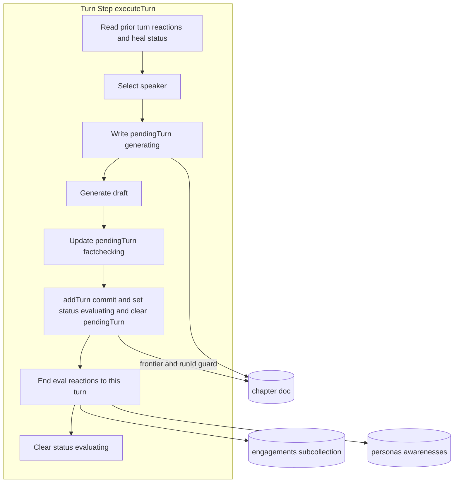
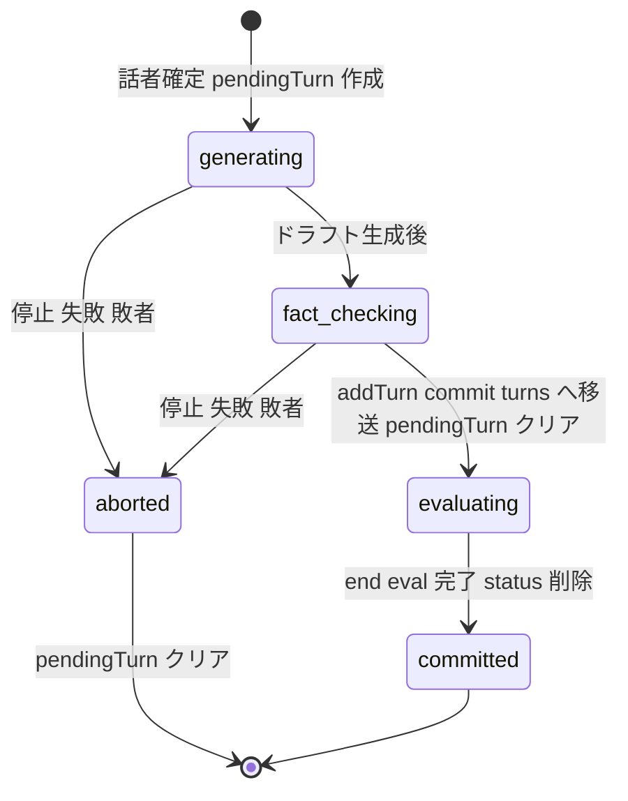
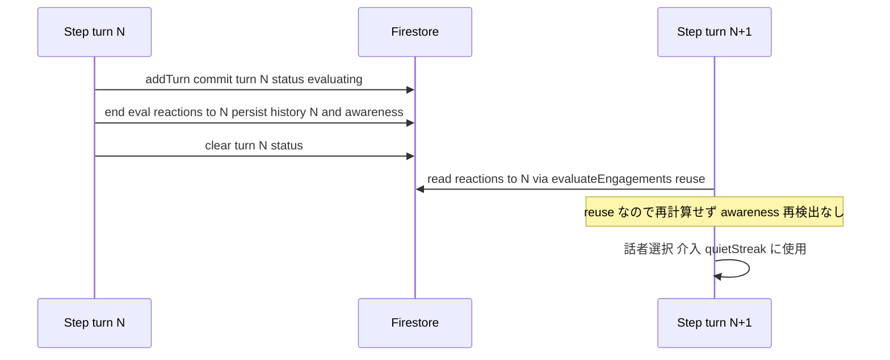

# Technical Design: debate-generation-progress

## Overview

本機能は、討論生成の途中状態を Firestore に明示し、各ターンの生成段階（本文生成中 / ファクトチェック中 / 反応評価中）を外部（FE 等）が参照できるようにする。あわせて前提として、engagement/awareness の評価を「次ターン先頭で前ターンを評価する」現状から「発言ターンの末尾で当該ターンへの反応を評価し次ターンへ渡す」へ改める。これにより章の最後のターンを含む全ての確定ターンに反応が付く。

**Purpose**: 討論生成パイプラインの運用者・FE に、生成の進捗（誰が・どの段階か）と、全ターンの反応（engagement/awareness）を提供する。
**Users**: 管理画面（討論生成画面）およびそれを支えるサーバー処理。
**Impact**: 生成中ターンを `chapter.pendingTurn` に、確定ターンの反応評価中状態を `DebateTurn.status` に持たせる。評価タイミングをターン末尾へ移し、`debate-llm-cost-reduction` の「freeze で最終ターン awareness を捕捉しない」決定を撤回する。

### Goals
- 各ターンの生成段階を `status`（および pendingTurn）として Firestore に明示する。
- 評価を発言ターン末尾で行い、章の最後のターンにも engagement/awareness を付与する。
- 既存の frontier・状態再構築・冪等追記のセマンティクスを壊さない。

### Non-Goals
- FE 側の Skeleton 描画・表示（status を書くところまでが本 spec）。
- 話者選択規則・発言生成プロンプト・ファクトチェック判定内容・engagement スコア式・awareness 文言モデルの変更。
- 公開閲覧ページ（`/debate/[id]`）の変更。

## Boundary Commitments

### This Spec Owns
- `chapter.pendingTurn` フィールド（生成中の persona ターンの id・話者・段階）の定義と書き込み/クリア。
- `DebateTurn.status`（`'evaluating'`）の定義と付与/終了。
- engagement/awareness 評価の実行タイミング（発言ターン末尾）と、全確定ターン（open/通常/freeze）への適用。

### Out of Boundary
- FE の描画・Skeleton・UI。型ミラー（`TurnForFirestore`/`ChapterForFirestore`）の追加のみ行う。
- engagement スコア・awareness の内容生成ロジック（belief-awareness-remodel の範囲）。
- 話者選択・介入・quietStreak の判定式（入力の取得元は変えるが式は不変）。

### Allowed Dependencies
- 既存の `engagement.ts`（reuse 冪等機構）、`turn.ts`（`addTurn` トランザクション）、`debate-orchestrator.ts`（frontier・runId ガード）。
- Firestore（chapter doc への相乗り書き込み）。別 progress ドキュメント/サブコレクションは作らない。

### Revalidation Triggers
- `history.<turnId>` の永続形・reuse キーの変更。
- `evaluateEngagements` の呼び出し構造の変更（末尾評価前提が崩れる場合）。
- `DebateTurn` / `ChapterForFirestore` のスキーマ変更（FE ミラーの再確認が必要）。
- freeze（章末最終応答）の評価方針変更（`debate-llm-cost-reduction` の改訂点）。

## Architecture

### Existing Architecture Analysis
- **ステップ駆動・再入可能**: 「1ステップ＝1 Cloud Task」。`advanceDebate` が毎回 Firestore から状態を再構築し、`decideNextStep`（純関数）で次段を決める。
- **frontier = `turns.length`**: `addTurn`（turn.ts:73）は `currentTurns.length === expectedTurnIndex` かつ runId 一致のときだけ1件を追記（トランザクション）。`getDebateState`（debate-state.ts）は turns 全要素から speakCount/silence/lastSpeaker/queue を導出。→ **未確定ターンを turns[] に混ぜられない**。
- **評価の冪等機構**: `evaluateEngagements`（engagement.ts:101）は `readReusableEngagement`（L68）で「同一 turnId の既存評価があれば LLM 再評価せず awareness も再検出しない」。`saveEngagements` は mergeFields で冪等。→ **末尾で評価→次ターン先頭は読むだけ**を追加コストなしで実現できる。
- **停止検出**: 生成途中で `isDebateActive` を確認し停止なら `skipped`（未コミットで中断）。

### Architecture Pattern & Boundary Map

**Selected pattern**: 既存パイプラインへの局所拡張（Option B）。生成中は `chapter.pendingTurn`（turns[] 外）に、反応評価中は確定 `DebateTurn.status='evaluating'` に持つ。turns[] は確定のみを維持し frontier/状態再構築を不変化する。



**Architecture Integration**:
- Domain/feature boundaries: 生成中（pendingTurn）と確定（turns[]）を物理的に分離。frontier/状態再構築は turns[] のみを見る。
- Existing patterns preserved: トランザクション追記＋runId 世代照合、reuse による評価冪等、`isDebateActive` 中断、onSnapshot ミラー。
- New components rationale: `pendingTurn`＝生成中を frontier から隔離する唯一の追加状態。`status='evaluating'`＝確定ターンの後処理シグナル。
- Steering compliance: Firestore は chapter doc に相乗り（課金/購読効率）、アロー関数・型厳格、[feedback-mirror-firestore-shape] に沿う型ミラー。

### Technology Stack

| Layer | Choice / Version | Role in Feature | Notes |
|-------|------------------|-----------------|-------|
| Backend / Services | Firebase Functions v2 (Node 24, TypeScript strict) | 評価タイミング改修・pendingTurn/status 書き込み | 既存 `pipeline/debate/` を拡張 |
| Data / Storage | Firestore | `chapter.pendingTurn` / `DebateTurn.status` の永続 | 新規コレクションなし。firestore.rules 変更不要（既存 chapters match 配下） |
| Frontend | SvelteKit 2.x / Svelte 5 runes | 型ミラー追加（描画は対象外） | `chapters.svelte.ts` は既存購読のまま観測可能 |

## Data Models

### 永続スキーマ変更（Firestore / functions）

`functions/src/types/turn.types.ts`:
```typescript
// 反応評価中のみ付与。確定・評価完了後は undefined（＝完了）。
export type TurnStatus = 'evaluating';

export type DebateTurn = {
  // ...既存フィールド...
  status?: TurnStatus; // 追加
};
// NewTurnFields にも status?: TurnStatus を追加し buildTurnRecord で書き出す
```

`functions/src/types/chapter.types.ts`:
```typescript
// 生成中（未コミット）の persona ターン。turns[] には入れない。
export type PendingTurnStatus = 'generating' | 'fact-checking';

export type PendingTurn = {
  id: string;          // 生成開始時に発番。コミットで同 id を turns[] へ移す
  personaId: string;   // 次の発言者（nextSpeakerId は設けない）
  status: PendingTurnStatus;
};

export type ChapterForFirestore = {
  // ...既存フィールド...
  pendingTurn?: PendingTurn; // 追加（生成中のみ存在）
};
```

### FE ミラー（描画対象外・型整合のみ）
- `src/lib/models/turn/turn.types.ts`: `TurnForFirestore` に `status?: 'evaluating'`。
- `src/lib/models/chapter/chapter.types.ts`: `ChapterForFirestore` に `pendingTurn?: PendingTurn`（`PendingTurn`/`PendingTurnStatus` をミラー）。
- `chapters.svelte.ts` は `raw.turns` をそのままマップ済みで、追加購読なしに status/pendingTurn を観測できる（R2.6）。

### 状態遷移（1ターンのライフサイクル）



- `generating`/`fact-checking` は `pendingTurn.status`。`evaluating` は確定 `DebateTurn.status`。`committed`（status なし）＝完了。
- `aborted` は未コミットのため turns[] に何も残らず、pendingTurn をクリアするだけ（R3.4/3.5）。

## System Flows

### 評価タイミング（末尾評価と次ターンへの受け渡し）



- **キー決定**: end-eval はコミット済みターンへの反応評価。次ステップ先頭の既存 `evaluateEngagements` は reuse により**読み取りへ退化**（R1.4）。非最終ターンの計算量は不変、最終ターンにのみ +1 sweep。
- **開始境界（R1.5）**: `performOpenStep` はオープニング facilitator ターンをコミット後に end-eval を実行し、最初の persona ターンの話者選択が反応を読める状態にする。
- **freeze（R1.6）**: `executeFinalResponseTurn` はコミット後に end-eval を実行（従来のスキップを撤回）。

### 自己修復（スタック回避）

各ステップ（および章末ステップ）は先頭で「直前確定ターンの反応が未永続なら評価し、`status='evaluating'` を終了へ」を行う。これは話者選択に必要な入力取得と同一処理のため追加負担が小さく、end-eval 途中クラッシュで残った `evaluating` を次ステップが解消する（R3.5/3.7）。章末ステップは最終ターンに対して同処理を行ってから `completed` にする（R3.3/3.7）。

## Requirements Traceability

| Requirement | Summary | Components | Flows |
|-------------|---------|------------|-------|
| 1.1, 1.2 | 末尾で当該ターンへの反応を評価し turnId に紐づけ永続 | EndEvaluation (engagement.ts) | 評価タイミング |
| 1.3 | awareness は engagement 評価に相乗り、専用 LLM 呼び出しなし | EndEvaluation | — |
| 1.4 | 次ターンの話者選択は直前ターンの永続評価を使用 | evaluateEngagements reuse | 評価タイミング |
| 1.5 | 開始境界（オープニング反応）を話者選択前に用意 | performOpenStep | 評価タイミング |
| 1.6 | freeze 含む全確定ターンを評価 | executeFinalResponseTurn | 評価タイミング |
| 1.7 | 同一 turnId のリトライで二重評価/永続しない | readReusableEngagement | 自己修復 |
| 1.8 | 確定ターン出力を不変（status/最終ターン awareness を除く） | executeTurn | — |
| 2.1 | 生成開始で pendingTurn(generating, personaId) 作成 | PendingTurnWriter | 状態遷移 |
| 2.2 | fact-check 開始で pendingTurn を fact-checking へ | PendingTurnWriter | 状態遷移 |
| 2.3 | コミットで本文確定・status=evaluating | addTurn | 状態遷移 |
| 2.4 | evaluating は当該ターン自身に書く | addTurn / EndEvaluation | 状態遷移 |
| 2.5 | 反応評価完了で status を終了 | EndEvaluation | 状態遷移 |
| 2.6 | 既存購読で追加リスナーなしに観測可 | chapters.svelte.ts | — |
| 2.7 | 次の発言者は pendingTurn.personaId で表現 | PendingTurn 型 | — |
| 2.8 | status 更新を追記トランザクション/frontier/runId と整合 | addTurn | — |
| 3.1, 3.2 | 生成中ターンを確定と区別、未確定本文をコンテキストに使わない | pendingTurn 分離 | 状態遷移 |
| 3.3 | 章末で生成中を残さない | completeChapterStep | 自己修復 |
| 3.4 | 停止で生成中/pendingTurn を残さない | isDebateActive path | 状態遷移 |
| 3.5 | 失敗/中断で pendingTurn を恒久残留させない | PendingTurnWriter | 自己修復 |
| 3.6 | 敗者は pendingTurn を重複作成せず確定 status を上書きしない | addTurn guard | — |
| 3.7 | 最終ターンでも status を終了 | completeChapterStep | 自己修復 |

## Components and Interfaces

| Component | Domain/Layer | Intent | Req Coverage | Key Dependencies | Contracts |
|-----------|--------------|--------|--------------|------------------|-----------|
| EndEvaluation | pipeline/debate/engagement | コミット済みターンへの反応を末尾評価・永続 | 1.1–1.7, 2.5 | evaluateEngagements, readReusableEngagement (P0) | Service |
| PendingTurnWriter | pipeline/debate | pendingTurn の set/update/clear | 2.1, 2.2, 3.5, 3.6 | chapter doc (P0) | State |
| addTurn 拡張 | pipeline/debate/turn | コミット時に status=evaluating 付与・pendingTurn クリア（同一トランザクション） | 2.3, 2.4, 2.8, 3.6 | Firestore tx, runId guard (P0) | Batch/State |
| Step 統合 | pipeline/debate/step | 開始時の自己修復・末尾 end-eval の呼び出し配線 | 1.5, 1.6, 3.3, 3.7 | executeTurn/open/freeze (P0) | — |
| 型ミラー | src/lib/models | status/pendingTurn を FE 型へ反映 | 2.6 | — | State |

### pipeline/debate

#### EndEvaluation（engagement.ts への追加）

| Field | Detail |
|-------|--------|
| Intent | コミット済みターンへの全非話者反応を末尾で評価し `history.<turnId>`・awareness を永続 |
| Requirements | 1.1, 1.2, 1.3, 1.6, 1.7, 2.5 |

**Responsibilities & Constraints**
- 対象は「直近コミットしたターン」。`turnId` はそのターンの id（`turns` 末尾）＝awareness の `triggeredByTurnId`（1.2）。
- `readReusableEngagement` により、既に永続済みなら LLM 再評価せず awareness も再検出しない（1.7）。
- awareness 検出は engagement 評価の一部で、専用 LLM 呼び出しを追加しない（1.3）。
- **単一不変条件（責務の一本化）**: 「反応の永続」と「当該ターンの `status='evaluating'` 削除」を**この関数内で必ずセットで**行う。反応が永続されているのに status が残る、という中間状態を作らない（2.5, 3.7）。呼び出し側（各ステップ先頭・章末）は「対象ターンの反応が未永続なら本関数を呼ぶ」だけで、status のクリアを個別に持たない（No Hidden Shared Ownership）。
- status 削除は確定ターン（turns[] 内要素）の更新なので、runId 世代ガード付きトランザクションで行い、敗者の上書きを弾く（3.6）。

**Contracts**: Service [x] / State [x]

##### Service Interface
```typescript
// コミット済みターンへの反応を評価・永続し、当該ターンの status を終了させる
interface EndEvaluation {
  evaluateReactionsForCommittedTurn(input: {
    topicId: string;
    chapterId: string;
    committedTurnId: string;   // 末尾ターン id
    personas: Persona[];
    chapterTurns: ReadonlyArray<DebateTurn>;
    runId?: string;            // status 終了更新の世代ガード
  }): Promise<void>;
}
```
- Preconditions: 対象ターンが turns[] にコミット済み。
- Postconditions: `history.<committedTurnId>` と awareness が永続され、当該ターン `status` が undefined。
- Invariants: 同一 turnId の再実行で LLM 再評価・二重 awareness を生じない（reuse）。

**Implementation Notes**
- Integration: 既存 `evaluateEngagements` を「keyed to 末尾ターン」で呼ぶ形に一般化。start 側呼び出しは reuse リード兼フォールバックとして残す。
- Validation: 対象ターンが未コミット（pendingTurn 側）でないこと。
- Risks: freeze/open で end-eval 漏れ→最終/先頭ターン反応欠落。テストで網羅。

#### PendingTurnWriter

| Field | Detail |
|-------|--------|
| Intent | 生成中 persona ターンを `chapter.pendingTurn` に反映し、確定/中断でクリア |
| Requirements | 2.1, 2.2, 3.4, 3.5, 3.6 |

**Responsibilities & Constraints**
- 話者確定・生成開始時に `pendingTurn={ id(発番), personaId, expectedTurnIndex, status:'generating' }` を set（2.1）。
- fact-check 開始で `status:'fact-checking'` に update（2.2）。
- 停止（`isDebateActive`=false → skipped）・生成失敗・frontier 敗者で pendingTurn をクリア（3.4/3.5/3.6）。
- **クリアは compare-and-clear**：`pendingTurn.id === 自タスクが発番した id` のときだけ削除する。これにより、ハングした遅延タスクが後続 frontier の正当な pendingTurn を誤消去しない（3.6）。

**Contracts**: State [x]

##### State Management
- State model: `chapter.pendingTurn`（0..1 件、turns[] 外）。`expectedTurnIndex` を含め、どの frontier のものかを識別する。
- Persistence & consistency: chapter doc への単一フィールド set/update/delete。
- Concurrency strategy: 同一 frontier の並走は決定的タスクキー（runId, chapterId, frontier）の ALREADY_EXISTS 重複排除でほぼ防がれる。残る狭い競合窓（遅延タスク＋再試行）に対しては pendingTurn の last-write-wins ＋ **id 一致 compare-and-clear** で収束。確定ターン（turns[]）は runId+frontier ガードで保護され、敗者は上書きしない（3.6）。

#### addTurn 拡張（turn.ts）

| Field | Detail |
|-------|--------|
| Intent | コミット時に `status='evaluating'` を付与し、同一トランザクションで pendingTurn をクリア |
| Requirements | 2.3, 2.4, 2.8, 3.6 |

**Responsibilities & Constraints**
- 既存の frontier（`turns.length===expectedTurnIndex`）＋ runId 照合を維持（2.8）。
- 追記するターンレコードに `status:'evaluating'` を含める（2.3/2.4）。
- 同一トランザクションで `pendingTurn` を削除（生成中→確定の原子的移送）。
- **id は任意引数**にする：persona ターンは pendingTurn で発番済みの id を渡す。id 未指定時は従来どおりトランザクション内 `nanoid()` 発番（facilitator ターン `generateFacilitatorTurn`＝open/介入は pendingTurn を持たないためこの経路を使う）。

**Contracts**: Batch [x] / State [x]

##### Batch / Job Contract
- Trigger: 発言生成の確定時（`generatePersonaTurn` / `executeFinalResponseTurn`）。
- Input/validation: `expectedTurnIndex`・`runId`・pendingTurn で発番した `id`。
- Output/destination: `chapter.turns`（+1）と `pendingTurn` 削除。
- Idempotency & recovery: 不一致（index/generation）は `rejected`（副作用なし）。敗者は turns[] を書き換えず、pendingTurn は勝者 commit または各タスクのクリアで収束（3.6）。

#### Step 統合（step.ts）

| Field | Detail |
|-------|--------|
| Intent | 各ステップ先頭の自己修復と、コミット後の end-eval 呼び出しを配線 |
| Requirements | 1.5, 1.6, 3.3, 3.7 |

**Responsibilities & Constraints**
- 通常ターン: コミット後に EndEvaluation を実行。
- `performOpenStep`: オープニング確定後に EndEvaluation（1.5）。
- `executeFinalResponseTurn`: コミット後に EndEvaluation（1.6、freeze skip 撤回）。
- `completeChapterStep`: `completed` にする前に、最終ターンの反応が未永続なら EndEvaluation を呼ぶ（3.3/3.7）。
- 開始時（自己修復）: 直前確定ターンの反応が未永続なら EndEvaluation を呼ぶ（reuse で通常は読み取りに退化）。status のクリアは EndEvaluation の責務のため、ここでは個別に触らない。

**Implementation Notes**
- Integration: `finalizeCommittedTurn` 直後に end-eval を差し込む。start 側 `evaluateEngagements` は据え置き（reuse リード）。
- Risks: facilitator（open/intervention）ターンは pendingTurn/status の対象外だが end-eval（反応評価）の対象。混線しないよう「status/pendingTurn は persona ターンのみ」を明記。

## Error Handling

### Error Strategy
- **停止（ユーザ操作）**: 生成途中の `isDebateActive`=false → `skipped`。pendingTurn をクリアし turns[] は不変（3.4）。
- **生成/評価失敗・中断**: 未コミットなら pendingTurn クリアで残骸なし。コミット後 end-eval 失敗は次ステップ/章末の自己修復で反応永続＋status 終了（3.5/3.7）。best-effort（awareness 永続失敗は討論継続）は既存方針を踏襲。
- **frontier 敗者・世代不一致**: `addTurn` が `rejected`。確定 status を上書きしない。status 終了更新も runId ガード付きで敗者を弾く（3.6）。

### Monitoring
- 既存の `console.error`（awareness/evaluation の best-effort 失敗ログ）を踏襲。end-eval・pendingTurn クリアの失敗は warn ログを残す。

## Testing Strategy

### Unit Tests
- `readReusableEngagement` reuse により、end-eval 後の次ターン先頭 `evaluateEngagements` が LLM 再評価・awareness 再検出をしない（1.4/1.7）。
- `addTurn` がコミット時に `status='evaluating'` を付与し pendingTurn を同一トランザクションで削除、index/generation 不一致で `rejected`（2.3/2.8/3.6）。
- `getDebateState` が pendingTurn の影響を受けない（turns[] のみ参照）ことの確認（3.1）。

### Integration Tests
- 通常ターンのライフサイクル: pendingTurn generating→fact-checking→commit(evaluating)→end-eval→status 削除（2.1–2.5）。
- 章の最終ターン・freeze・オープニングに engagement/awareness が付与される（1.5/1.6）。
- 停止・end-eval クラッシュ後のリトライで、pendingTurn/`evaluating` が残留せず自己修復される（3.3/3.4/3.5/3.7）。

### E2E/UI Tests
- 描画は対象外。onSnapshot で chapter doc の `pendingTurn`/`turns[].status` が観測できることのみ確認（2.6）。

## Migration Strategy
- 後方互換: `status`/`pendingTurn` は任意フィールド。既存データ（未設定）は「完了・生成中なし」と解釈され破綻しない。
- firestore.rules 変更不要（既存 `chapters` match 配下のフィールド追加のため）。
- 段階導入（任意）: 規模が大きければ「R1 末尾評価＋evaluating」を先行、`pendingTurn`（generating/fact-checking）を後続に分割可能（research.md の Option C）。tasks で判断する。
