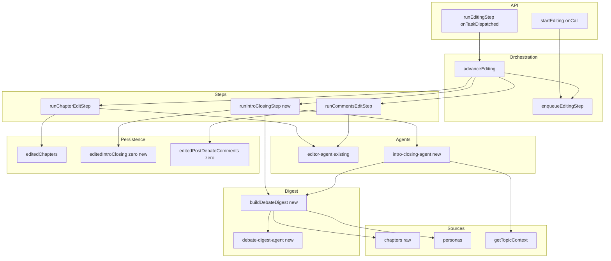
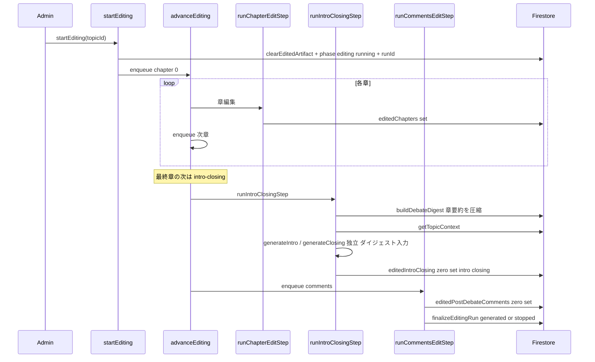

# Technical Design: debate-intro-closing

## Overview

**Purpose**: 討論コンテンツの冒頭に討論全体を紹介する**イントロ**、末尾（本編の後・事後コメントの前）に討論全体を締める**クロージング**を付加し、唐突に始まり唐突に終わる討論を読み物として成立させる。

**Users**: 閲覧者は本編の入口と締めを得て討論全体を把握しやすくなる。管理者は既存の編集操作と同一のボタンで、討論完了後にイントロ・クロージングまで一括生成する。

**Impact**: 既存の編集フェーズ（Phase 6 / `post-debate-editorial-pass`）の Cloud Task チェーンに `intro-closing` ステップを1段追加する。生ディベート（`chapters` / `postDebateComments`）は不変のまま、新たな編集成果物 `editedIntroClosing/0` を生成・保存する。`finalizeEditingRun` の判定（`editedChapters` ベース）は変更しない。生成入力には討論全文ではなく、討論を圧縮した消費者中立の**討論ダイジェスト**（`buildDebateDigest`）を用いる。ダイジェストは本 spec で先に用意し、将来の事後コメント生成でも再利用できる共通土台とする。

### Goals
- 討論完了後、編集パスと同一操作でイントロ・クロージングを生成する（R1, R2, R5）。
- 中立・非結論（結論／優劣／落としどころを出さない）を担保する（R2, R3）。
- 生ディベートと別の成果物として保存し、原本を不変に保つ（R6）。
- イントロ・クロージング生成の失敗が討論本編・既存編集成果物の確定を妨げない（R7）。

### Non-Goals
- 既存のファシリテーターオープニング／章導入／クロージング発言・事後コメントのロジック変更。
- 既存編集パス（ターン冗長性除去・連結・コメント編集）のロジック変更。
- 公開閲覧ルート（`src/routes/debate/[id]`）の新設・編集後コメントの FE 描画整備（未整備。本スペックは admin Phase6 プレビューでの表示に限定し、公開表示は後続）。
- 討論への結論・優劣・勝敗判断の付与。
- 討論チェーンのスリム化（章まとめ・締め発言・事後コメント生成の討論チェーンからの削除／編集フェーズへの移設）。これは別スペックの守備範囲。本設計は下記「将来変更への堅牢性」の前提でこの移設に耐えるよう作る。
- 討論ダイジェストを事後コメント生成へ接続する配線。これは将来 spec の責務。本 spec はダイジェストを消費者中立に用意し、イントロ・クロージングから消費するところまでを担う。

### 将来変更への堅牢性（別スペックのスリム化を見越した前提）
討論チェーンは将来「口火＋会話ターンのみ」へ絞られ、章まとめ・締め発言（いずれも章の `turns` 配列に混在して追記されている）と事後コメント生成は討論チェーンから外れる予定。本設計はこれに次の2点で備える。
- **入力の一般性**: イントロ・クロージング生成は章の `turns` を会話として一般的に扱い、章まとめターン・締め発言ターンの存在に依存しない。材料はテーマ・章立て（章タイトル）・会話のやり取り・ペルソナの信念/気づきに限る（章まとめ・締め発言を要約源にしない）。
- **ステップの自己完結**: intro-closing ステップは他ステップ（コメント・章まとめ・締め発言）の有無・順序に依存しない。チェーン上の位置（現状はコメント編集の前）は load-bearing ではなく、後半が組み替わっても移動可能。完了確定にも干渉しない（best-effort）。
- クロージング発言（会話内の締めの一言）が討論から外れた後は、読み物としての結び（本スペックのクロージング）が討論唯一の締めになる。役割重複は解消され、設計変更は不要。

## Boundary Commitments

### This Spec Owns
- 消費者中立の**討論ダイジェスト**生成（`buildDebateDigest`）と章要約エージェント（`summarizeChapter`）、`DebateDigest` 型。イントロ・クロージング生成の入力であり、将来の事後コメント生成でも再利用できる形（イントロ・クロージング固有の情報を混ぜない）にする。
- イントロ・クロージング生成エージェント（`generateIntro` / `generateClosing`）と、その専用プロンプト（中立・非結論・俯瞰視点）。
- 編集チェーンへの `intro-closing` ステップ（`runIntroClosingStep`）と、`EditingStepPayload` への `'intro-closing'` 追加。
- イントロ・クロージング成果物 `editedIntroClosing/0`（`{ intro, closing }`）とその read/write/clear、および `clearEditedArtifact` への破棄追加。
- FE のイントロ・クロージング購読ストア・型・Phase6 プレビュー表示（イントロ＝章の前、クロージング＝章の後）。

### Out of Boundary
- `finalizeEditingRun` / `runChapterEditStep` / `runCommentsEditStep` / `editor-agent` の編集ロジック（読み取り・流用のみ、改変しない）。
- 生ディベート（`chapters` / `postDebateComments` / `personas` / `factBase`）の書き込み。
- 討論ダイジェストを事後コメント生成に繋ぎ込む配線（将来 spec の責務）。本 spec はダイジェストを消費者中立に提供するのみ。
- ダイジェストの永続化（現状は intro-closing ステップ内でメモリ上に生成・消費。永続化は複数ステップ/フェーズをまたぐ消費者が現れた時点で将来 spec が判断）。
- 公開ルートおよび編集後コメントの FE 描画。

### Allowed Dependencies
- `getTopicContext(topicId)`（テーマ説明・参考資料・事実基盤の BE 権威経路）。
- `getChaptersByTopicId(topicId)`（原本章の読み取り。ダイジェスト生成の入力）、`getPersonasByTopicId`（承認済みペルソナ＝信念・気づき）。討論層のリーダーを使い、編集層 `editing-step` の内部関数には依存しない。
- 編集ライフサイクル基盤（`enqueueEditingStep` / `isEditingActive` / `startEditingRun` の破棄経路）。
- LLM 基盤（`ai` + `@ai-sdk/anthropic` + `zod`、`AI_MODELS.SONNET`）。

### Revalidation Triggers
- `EditingStepPayload` の形状変更（`stepKind` ユニオン拡張）。
- `editedIntroClosing/0` のスキーマ変更（`{ intro, closing }`）。
- 編集チェーンのステップ順序変更（`chapter → intro-closing → comments → finalize`）。
- `clearEditedArtifact` の破棄対象変更。

## Architecture

### Existing Architecture Analysis
- 編集フェーズは「1ステップ=1 Cloud Task」の自己継続チェーン。`advanceEditing` が `stepKind` で分岐し、状態を毎回 Firestore（原本＋`runId`）から再構築するため冪等・再入可能。旧世代タスクは `isEditingActive`（phase・phaseStatus・runId 一致）で no-op。
- 編集成果物は生ディベートと別コレクション（`editedChapters/{chapterId}`・`editedPostDebateComments/0`）。`startEditingRun` が旧成果物を即時破棄してから新世代 `runId` を発行（再生成時の即時削除と整合）。
- `runCommentsEditStep` 末尾の `finalizeEditingRun` が全 `editedChapters` の completed/failed から `generated`/`stopped` を確定。
- 本設計はこのチェーンに **純粋追加**でステップを挿し込み、既存ステップ本体・finalize 判定には触れない。

### Architecture Pattern & Boundary Map



**Architecture Integration**:
- **Selected pattern**: 既存の Cloud Task ステップチェーンへの純粋追加（Option A）。チェーンは `chapter(0..n) → intro-closing → comments → finalize`。
- **Domain/feature boundaries**: 圧縮は `buildDebateDigest`（消費者中立・討論ドメイン）、生成は `intro-closing-agent`（自由生成・由来ID/検証なし）、駆動は `intro-closing-step`、保存は `edited-repository`、駆動順は `editing-orchestrator`。責務ごとに分離し、既存 `editor-agent`（ターン単位・構造検証）と混在させない。ダイジェストにイントロ・クロージング固有の意図を持ち込まない（他消費者が再利用できる形を保つ）。
- **Existing patterns preserved**: 世代ゲート（`isEditingActive`）／deterministic task id／別成果物・原本不変／`getTopicContext` 権威経路／FE onSnapshot ストア。
- **New components rationale**: イントロ・クロージングは俯瞰・自由生成でターン編集と処理特性が異なるため、専用エージェント・ステップ・成果物・ストアを新設。
- **Steering compliance**: `firebase.md`（1:1 固定 ID `editedIntroClosing/0`・原本不変）、`product.md`（非結論）、アロー関数・型はフロント/Functions 分離。

### Dependency Direction
Functions: `debate-digest.types` / `editorial.types` → `debate-digest-agent` / `intro-closing-agent` / `edited-repository` → `debate-digest`（builder）→ `intro-closing-step` → `editing-orchestrator` → `api/editing`。
Frontend: `models/editedIntroClosing` → `stores/editedIntroClosing` → `features/.../Phase6Editing`。
各層は左の層のみに依存する（上位への依存禁止）。`debate-digest`（討論ドメイン）は編集層（`intro-closing-step`）から呼ばれるが、編集層には依存しない（討論の原本読み取りは `getChaptersByTopicId` / `getPersonasByTopicId` を用い、`editing-step` の内部関数に依存しない）。

### Technology Stack

| Layer | Choice / Version | Role in Feature | Notes |
|-------|------------------|-----------------|-------|
| Backend / Services | Firebase Functions v2（onTaskDispatched, Node 24） | `intro-closing` ステップの実行・チェーン継続 | 既存 `runEditingStep` に相乗り（新 Function 追加なし） |
| AI | `ai` + `@ai-sdk/anthropic`（既存）, `AI_MODELS.SONNET` | 章要約（ダイジェスト）＋イントロ／クロージングの自由生成 | 新規依存なし。ダイジェストは章数ぶんの要約呼び出しを1回だけ行い、以後は小さなダイジェストを再利用 |
| Data / Storage | Firestore（`editedIntroClosing/0`） | イントロ・クロージング成果物の永続化 | 1:1 固定 ID・埋め込み |
| Frontend | SvelteKit 2.x / Svelte 5 runes | Phase6 プレビュー表示・onSnapshot 購読 | 既存 `editedChapters` ストアと同型 |

## File Structure Plan

### Directory Structure
```
functions/src/
├── agents/
│   ├── debate-digest-agent.ts              # 新規: summarizeChapter（章のやり取りを中立に圧縮）
│   └── intro-closing-agent.ts              # 新規: generateIntro / generateClosing + introClosingSystemPrompt
├── pipeline/
│   ├── debate/
│   │   └── debate-digest.ts                # 新規: buildDebateDigest（消費者中立。原本章＋ペルソナ→DebateDigest）
│   └── editing/
│       └── intro-closing-step.ts           # 新規: runIntroClosingStep（best-effort・独立生成）
└── types/
    ├── debate-digest.types.ts              # 新規: DebateDigest / ChapterDigest / PersonaDigest
    └── editorial.types.ts                  # 変更: EditedIntroClosingForFirestore を追加

src/lib/
├── models/editedIntroClosing/
│   └── editedIntroClosing.types.ts        # 新規: EditedIntroClosing(ForFirestore)
├── stores/
│   └── editedIntroClosing.svelte.ts       # 新規: editedIntroClosing/0 の onSnapshot 購読
└── features/admin/topic-detail/editing/
    └── Phase6Editing.svelte          # 変更: イントロ（章の前）/ クロージング（章の後）表示
```

### Modified Files
- `functions/src/pipeline/editing/enqueue-editing-step.ts` — `EditingStepPayload.stepKind` に `'intro-closing'` を追加。
- `functions/src/pipeline/editing/editing-orchestrator.ts` — 最終章の次を `comments` から `intro-closing` に変更し、`'intro-closing'` 分岐で `runIntroClosingStep` 実行後に `comments` を enqueue。
- `functions/src/pipeline/editing/edited-repository.ts` — `writeEditedIntroClosing` / `readEditedIntroClosing` を追加し、`clearEditedArtifact` に `editedIntroClosing/0` の破棄を追加。
- `src/lib/stores/currentTopic.svelte.ts`（または currentTopicStore 構成箇所）— `editedIntroClosingStore` を配線（`editedChaptersStore` と同様）。
- `functions/src/api/editing.ts` — `startEditing` に討論完了ゲート（討論フェーズが `generated` 到達済みかの検証）を追加し、未完了なら拒否する（5.4 のサーバ側安全網）。
- `src/lib/features/admin/topic-detail/editing/Phase6Editing.svelte` — 討論完了までは編集開始ボタンを出さない/無効にする（5.4 の画面側ゲート。イントロ・クロージング表示の変更と併せて実施）。

> `runCommentsEditStep` / `runChapterEditStep` / `finalizeEditingRun` / `editor-agent.ts` は変更しない。

## System Flows

### 編集チェーン（intro-closing 挿入後）



**Flow-level decisions**:
- **best-effort**: `runIntroClosingStep` は生成失敗を握りつぶし（intro/closing を独立に判定、失敗側は `null`）、例外を投げずに必ず `comments` を enqueue する。これにより最終試行失敗時の `stopEditingRun` を誘発せず、finalize（`editedChapters` ベース）に非干渉（R7.1, R7.3）。
- **finalize 非干渉**: `finalizeEditingRun` は従来どおり `editedChapters` のみで `generated`/`stopped` を判定。イントロ・クロージングの成否は phaseStatus に影響しない。
- **世代ゲート**: intro-closing ステップも先頭で `isEditingActive` により旧世代を no-op（既存 `advanceEditing` の共通ガードを流用）。

## Requirements Traceability

| Requirement | Summary | Components | Interfaces | Flows |
|-------------|---------|------------|------------|-------|
| 1.1–1.5 | イントロ生成（テーマ位置づけ・立場の多様性・俯瞰） | buildDebateDigest, intro-closing-agent, intro-closing-step | `generateIntro` | 編集チェーン |
| 2.1–2.4 | クロージング生成（振り返り・問いを開いたまま） | buildDebateDigest, intro-closing-agent, intro-closing-step | `generateClosing` | 編集チェーン |
| 3.1–3.3 | 中立・非結論 | intro-closing-agent（`introClosingSystemPrompt`） | system prompt | — |
| 4.1–4.4 | 表示位置・識別・未生成非表示 | Phase6Editing, editedIntroClosing ストア | `EditedIntroClosing` | — |
| 5.1–5.4 | 同一操作生成・再実行時破棄・進行表示・未完了不可 | editing-orchestrator, startEditingRun, startEditing（討論完了ゲート）, Phase6Editing（ボタン非表示/無効） | `EditingStepPayload` | 編集チェーン |
| 6.1–6.4 | 別成果物保存・topic 単位1件・原本不変 | edited-repository（`editedIntroClosing/0`） | `writeEditedIntroClosing` | — |
| 7.1–7.3 | 失敗が本編を妨げない・片方保持 | intro-closing-step（best-effort） | `runIntroClosingStep` | 編集チェーン |

## Components and Interfaces

| Component | Domain/Layer | Intent | Req Coverage | Key Dependencies (P0/P1) | Contracts |
|-----------|--------------|--------|--------------|--------------------------|-----------|
| buildDebateDigest | Pipeline/Debate | 討論を消費者中立に圧縮した DebateDigest を生成 | 1, 2 | debate-digest-agent (P0), getChaptersByTopicId (P0), getPersonasByTopicId (P0) | Service |
| debate-digest-agent | Agents | 章のやり取りを中立に圧縮（summarizeChapter） | 1, 2 | ai sdk (P0) | Service |
| intro-closing-agent | Agents | ダイジェスト＋テーマ文脈からイントロ／クロージングを自由生成 | 1, 2, 3 | DebateDigest (P0), getTopicContext (P0), ai sdk (P0) | Service |
| runIntroClosingStep | Pipeline/Steps | ダイジェスト生成→intro/closing 生成→保存を best-effort 実行 | 1, 2, 7 | buildDebateDigest (P0), intro-closing-agent (P0), edited-repository (P0) | Batch |
| editing-orchestrator | Pipeline/Orchestration | チェーンへの intro-closing 挿入 | 5 | enqueueEditingStep (P0) | Batch |
| edited-repository | Persistence | editedIntroClosing の read/write/clear | 6 | Firestore (P0) | State |
| editedIntroClosing store | FE/Stores | editedIntroClosing/0 の購読 | 4 | Firestore onSnapshot (P0) | State |
| Phase6Editing | FE/UI | イントロ／クロージングのプレビュー表示 | 4 | editedIntroClosing store (P0) | State |

### Debate（圧縮）

#### buildDebateDigest / debate-digest-agent

| Field | Detail |
|-------|--------|
| Intent | 完了討論を消費者中立に圧縮した `DebateDigest`（章ごとの圧縮散文＋ペルソナの立場・変化）を生成する |
| Requirements | 1.1, 2.1（生成入力の供給） |

**Responsibilities & Constraints**
- `getChaptersByTopicId` / `getPersonasByTopicId`（approved）で原本を読み、章ごとに `summarizeChapter`（LLM）で会話を圧縮、`DebateDigest` に組み立てる。
- **消費者中立**: イントロ・クロージング固有の意図（俯瞰導入・結びの語り口など）を持ち込まない。将来の事後コメント生成が同じダイジェストを再利用できる形に保つ。
- 章の `turns` を会話として一般的に扱い、章まとめ・締め発言ターンの存在に依存しない（「将来変更への堅牢性」参照）。
- 圧縮は中立（結論・優劣・特定立場支持を含めない）。討論は読み取りのみ。
- ダイジェストは永続化しない（intro-closing ステップ内でメモリ生成・消費）。

**Dependencies**
- Outbound: `debate-digest-agent.summarizeChapter`（P0）, `getChaptersByTopicId`（P0）, `getPersonasByTopicId`（P0）
- External: `ai` + `@ai-sdk/anthropic`（`AI_MODELS.SONNET`）, `zod`（P0）

**Contracts**: Service [x]

##### Service Interface
```typescript
// functions/src/pipeline/debate/debate-digest.ts
import type { Result, PipelineError } from '../../types/common.types.js';
import type { DebateDigest } from '../../types/debate-digest.types.js';

export const buildDebateDigest: (topicId: string) => Promise<Result<DebateDigest, PipelineError>>;

// functions/src/agents/debate-digest-agent.ts
import type { DebateTurn } from '../types/turn.types.js';
import type { Persona } from '../types/persona.types.js';

export const summarizeChapter: (input: {
  title: string;
  discussionPoints: string[];
  turns: ReadonlyArray<DebateTurn>;
  personas: ReadonlyArray<Persona>;
}) => Promise<Result<string, PipelineError>>;
```
- Preconditions: `topicId` は討論完了済みトピック。
- Postconditions: 成功時は全章ぶんの `ChapterDigest` を含む `DebateDigest`。いずれかの章要約が失敗すれば `PipelineError` を返す（部分成功は許容しない＝ダイジェストの一貫性を保つ）。
- Invariants: 生ディベートを改変しない。イントロ・クロージング固有情報を含めない。

### Agents

#### intro-closing-agent

| Field | Detail |
|-------|--------|
| Intent | 討論ダイジェスト＋テーマ／事実基盤からイントロ・クロージングを中立・非結論で自由生成する |
| Requirements | 1.1–1.5, 2.1–2.4, 3.1–3.3 |

**Responsibilities & Constraints**
- 由来ターンID・構造検証を持たない自由生成（`editor-agent` とは別責務）。
- `introClosingSystemPrompt` で「結論・優劣・勝敗・落としどころを出さない／特定立場を支持・否定しない／個人の主張是非でなく論点と立場の広がりを扱う」を強制（3.1–3.3）。
- イントロ＝テーマの位置づけ＋立場の多様性＋俯瞰視点（1.2–1.5）。クロージング＝論点・立場の広がりの振り返り＋問いを開いたまま締める（2.2–2.3）。
- 入力は圧縮済みの `DebateDigest`（討論全文は渡さない）。`topicContext` はテーマの位置づけ・事実的裏付けのため併せて渡す（1.2, 1.4, 2.4）。
- 討論は読み取りのみ。書き込み・保存はステップ層の責務。

**Dependencies**
- Inbound: `DebateDigest`（`buildDebateDigest` の生成物）— 生成入力（P0）
- Outbound: `getTopicContext` — テーマ説明・参考資料・事実基盤（P0）
- External: `ai` + `@ai-sdk/anthropic`（`AI_MODELS.SONNET`）, `zod`（P0）

**Contracts**: Service [x]

##### Service Interface
```typescript
// functions/src/agents/intro-closing-agent.ts
import type { Result, PipelineError } from '../types/common.types.js';
import type { TopicContext } from '../types/topic.types.js';
import type { DebateDigest } from '../types/debate-digest.types.js';

export interface IntroClosingInput {
  digest: DebateDigest;        // 圧縮済みの討論（全文は渡さない）
  topicContext: TopicContext;  // description / sourceContents / factBase
}

export const generateIntro: (input: IntroClosingInput) => Promise<Result<string, PipelineError>>;
export const generateClosing: (input: IntroClosingInput) => Promise<Result<string, PipelineError>>;
```
- Preconditions: `digest` は `buildDebateDigest` の成功値。
- Postconditions: 成功時は非空のプレーン散文を返す。失敗時は `PipelineError`（`AI_API_ERROR`）。
- Invariants: 生ディベートを改変しない。結論・優劣・特定立場支持を含まない。

### Pipeline

#### runIntroClosingStep

| Field | Detail |
|-------|--------|
| Intent | intro-closing ステップ本体。イントロ・クロージングを独立に best-effort 生成し `editedIntroClosing/0` に保存する |
| Requirements | 1, 2, 7.1, 7.3 |

**Responsibilities & Constraints**
- まず `buildDebateDigest(topicId)` で討論ダイジェストを作り、`getTopicContext` と併せて入力を用意する。
- `generateIntro` と `generateClosing` を独立に呼び、成功した側のみ保存、失敗側は `null`（7.3）。
- `buildDebateDigest` が失敗した場合は intro/closing とも生成不能 → 両方 `null` で保存（best-effort。本編確定は妨げない・7.1）。
- **例外を投げない**。ダイジェスト失敗・生成失敗はいずれもログのみ。ステップは常に正常終了し、orchestrator が `comments` を enqueue（7.1）。
- 状態は Firestore から再構築するため冪等（再入時は上書き）。

**Dependencies**
- Outbound: `buildDebateDigest`（P0）, `intro-closing-agent`（P0）, `edited-repository.writeEditedIntroClosing`（P0）, `getTopicContext`（P0）

**Contracts**: Batch [x]

##### Batch / Job Contract
- Trigger: `advanceEditing` の `stepKind === 'intro-closing'` 分岐（Cloud Task）。
- Input: `topicId`, `runId`。実データは Firestore から再構築。
- Output: `editedIntroClosing/0` の set（`{ intro, closing }`）。
- Idempotency & recovery: 固定 ID 上書きで冪等。失敗は best-effort（`null`）。再実行は編集パス再起動（`startEditingRun` が旧成果物破棄）で担保（7.2）。

#### editing-orchestrator（変更）

| Field | Detail |
|-------|--------|
| Intent | 最終章の次に intro-closing、intro-closing の次に comments を enqueue する |
| Requirements | 5.1 |

**Contracts**: Batch [x]

##### Batch / Job Contract
- `stepKind === 'chapter'` かつ最終章: 従来 `comments` → **`intro-closing`** を enqueue。
- `stepKind === 'intro-closing'`: `runIntroClosingStep` 実行後に `comments` を enqueue。
- `stepKind === 'comments'`: 従来どおり `runCommentsEditStep`（finalize 内包・不変）。

```typescript
// enqueue-editing-step.ts（変更後）
export type EditingStepPayload = {
  topicId: string;
  runId: string;
  stepKind: 'chapter' | 'intro-closing' | 'comments';
  chapterIndex: number; // intro-closing / comments は -1 固定
};
```

### Persistence

#### edited-repository（変更）

| Field | Detail |
|-------|--------|
| Intent | editedIntroClosing/0 の read/write と、clearEditedArtifact への破棄追加 |
| Requirements | 6.1–6.4 |

**Contracts**: State [x]

##### State Management
- State model: `topics/{topicId}/editedIntroClosing/0` = `EditedIntroClosingForFirestore`。
- Persistence & consistency: 固定 ID `0`（1:1）。`writeEditedIntroClosing` は set（冪等上書き）。`clearEditedArtifact` は `editedChapters` 全削除・`editedPostDebateComments/0` 空化に加え、`editedIntroClosing/0` を空（`{ intro: null, closing: null }`）に set。
- Concurrency strategy: 世代 `runId` ゲート（`isEditingActive`）で旧世代の書き込みを排除。

```typescript
// edited-repository.ts（追加）
export const writeEditedIntroClosing:
  (topicId: string, introClosing: EditedIntroClosingForFirestore) => Promise<void>;
export const readEditedIntroClosing:
  (topicId: string) => Promise<EditedIntroClosingForFirestore | null>;
```

### Frontend

#### editedIntroClosing store / Phase6Editing（表示）

| Field | Detail |
|-------|--------|
| Intent | editedIntroClosing/0 を購読し、Phase6 でイントロ（章の前）・クロージング（章の後）を表示 |
| Requirements | 4.1–4.4 |

**Responsibilities & Constraints**
- `createEditedIntroClosingStore(topicId)` は `editedChapters` ストアと同型（onSnapshot・`isLoaded`）。
- Phase6Editing: `intro` が非 `null` のとき章群の**前**に、`closing` が非 `null` のとき章群の**後**に、本編と区別できるセクションで表示（4.1–4.3）。`null` は非表示（4.4）。
- クロージングの「事後コメント直前」への厳密配置は、編集後コメント描画整備後に対応（現状 admin では章の後＝末尾）。公開表示は後続。

**Contracts**: State [x]

##### State Management
- State model: `intro: string | null`, `closing: string | null`, `isLoaded: boolean`。
- Persistence & consistency: Firestore onSnapshot（読み取り専用）。書き込みは Functions のみ。

## Data Models

### Logical Data Model
- `DebateDigest` は討論を圧縮した**非永続の中間表現**（intro-closing ステップ内でメモリ生成・消費）。消費者中立で、将来の事後コメント生成が再利用できる形。
- `editedIntroClosing/0` は topic に対し 1:1。`intro`・`closing` は独立に生成・保存され、片方のみ存在し得る（`null` 許容）。
- 生ディベート（`chapters` / `postDebateComments`）・`personas` への参照・改変はなく、原本と疎結合。

### DebateDigest（非永続・中間表現）

```typescript
// functions/src/types/debate-digest.types.ts（追加）
export type ChapterDigest = {
  title: string;
  discussionPoints: string[];
  summary: string;          // 章のやり取り・提示された立場を圧縮した中立の散文
};

export type PersonaDigest = {
  personaId: string;
  name: string;
  stance: string;           // 立場の要旨
  beliefShifts: string[];   // 討論で得た気づき/変化（awareness 由来）。無ければ空
};

export type DebateDigest = {
  topicTitle: string;
  chapters: ChapterDigest[];
  personas: PersonaDigest[];
};
```
- 永続化しない（Firestore に保存しない）。複数ステップ/フェーズをまたぐ再利用が必要になった時点で将来 spec が永続化を判断する（本 spec の Out of Boundary）。

### Physical Data Model（Document Store）

```typescript
// functions/src/types/editorial.types.ts（追加）
export type EditedIntroClosingForFirestore = {
  intro: string | null;    // 討論全体のイントロ（冒頭）。未生成/失敗は null
  closing: string | null;  // 討論全体のクロージング（末尾）。未生成/失敗は null
};
```

```typescript
// src/lib/models/editedIntroClosing/editedIntroClosing.types.ts（追加・永続形と一致）
export type EditedIntroClosingForFirestore = {
  intro: string | null;
  closing: string | null;
};

export type EditedIntroClosing = EditedIntroClosingForFirestore & { id: string };
```

- Collection: `topics/{topicId}/editedIntroClosing/{ '0' }`。埋め込み理由: topic と 1:1・常に一緒に読む・件数有界（`firebase.md`）。
- 変換関数は持たない（`*.types.ts` は型と型ガードのみ）。

## Error Handling

### Error Strategy
- **intro-closing 生成失敗（LLM/AI_API_ERROR）**: best-effort。該当側を `null` として保存し、他方は保持（7.3）。ステップは例外を投げず、`comments` へ連鎖（7.1）。→ finalize は `editedChapters` に基づき `generated` に到達し得る。
- **本編（章・コメント）**: 既存の挙動を不変維持（章 failed フォールバック・最終試行で `stopEditingRun`）。イントロ・クロージングはこの判定に非干渉。
- **再試行**: 管理者による編集パス再実行（`resetEditing → startEditing` もしくは `startEditing`）で `startEditingRun` が旧 `editedIntroClosing/0` を破棄し再生成（7.2, 5.2）。

### Error Categories and Responses
- **User Errors**: 討論フェーズ未完了での起動を二重に抑止する（5.4）。
  - **画面（大前提）**: `Phase6Editing` は討論完了（討論フェーズが `generated` 到達）までは編集開始ボタンを出さない/無効にする。通常操作はここで止まる。
  - **サーバ（安全網）**: `startEditing` は開始前に討論完了を検証し、未完了なら `HttpsError('failed-precondition')` 相当で拒否する。画面を経由しない直接呼び出しもここで止まる。既存の `No chapter to edit`（章存在チェック）は章立て段階から満たされるため討論完了の判定には使わない。
- **System Errors**: LLM 一過性障害 → intro-closing は best-effort で `null`、本編は既存リトライ。
- **Business Logic Errors**: なし（イントロ・クロージングは検証を持たない自由生成）。

### Monitoring
- `runIntroClosingStep` は intro/closing 各生成の成否を `console.info` / `console.warn`（`topicId`, `runId`, どちらが失敗か）で記録。既存編集ステップのロギング方針に準拠。

## Testing Strategy

### Unit Tests
- `buildDebateDigest`: 章要約 LLM をモックし、全章成功で `DebateDigest` を組み立てる／1章でも失敗すれば `PipelineError`（部分成功なし）／イントロ・クロージング固有情報を含まない（消費者中立）（1.1, 2.1）。
- `generateIntro` / `generateClosing`: `DebateDigest` を入力に LLM をモックし、成功時に非空文字列・失敗時に `PipelineError` を返す（1.1, 2.1）。
- `introClosingSystemPrompt`: 代表出力に対する非結論・非支持のプロンプト制約（レビュー観点の固定化）（3.1–3.3）。
- `runIntroClosingStep`: ダイジェスト失敗時は両方 `null`／片方生成失敗時に他方を保持し `null` 混在で保存する／**例外を投げない**（7.1, 7.3）。
- `edited-repository`: `writeEditedIntroClosing` の冪等上書き、`clearEditedArtifact` が `editedIntroClosing/0` を空化する（6.1, 5.2）。

### Integration Tests
- 編集チェーン: `chapter(0..n) → intro-closing → comments → finalize` の順序と、intro-closing 失敗時も `comments`/`finalize` が到達し `generated` になること（5.1, 7.1）。
- 再実行: `startEditingRun` 後に旧 `editedIntroClosing/0` が破棄され再生成される（5.2, 7.2）。
- 既存編集の parity: intro-closing 追加後も `editedChapters`/`editedPostDebateComments`/finalize 判定が不変（既存 editing テスト群に回帰なし）。

### E2E/UI Tests
- Phase6Editing: `intro` 非 null で章の前・`closing` 非 null で章の後にセクション表示、`null` は非表示（4.1–4.4）。

## Performance & Scalability
- **入力圧縮の方針**: 討論全文を各生成に渡さず、`buildDebateDigest` で圧縮した `DebateDigest` を入力とする（Issue 2 対応）。章数ぶんの要約呼び出しを1回だけ行い、以後は小さなダイジェストをイントロ・クロージング（および将来の事後コメント生成）で再利用する。
- **トレードオフ**: 呼び出し回数は増える（章数＋2）が、各呼び出しのトークン量が大きく減り、全文を複数生成に重複投入する構成より総トークン・総コストを抑えられる。ダイジェストは非永続のため同一ステップ内でのみ共有する（別ステップの再利用は将来 spec が永続化を判断）。
