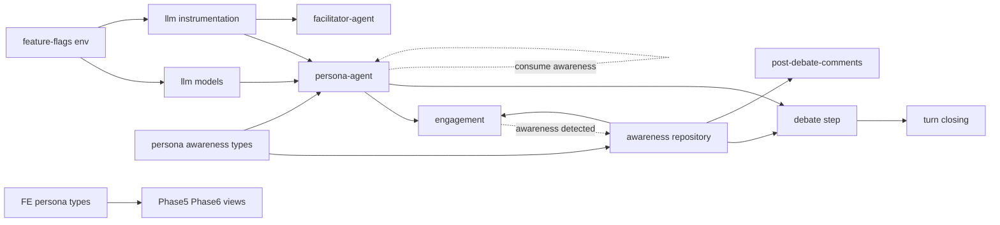
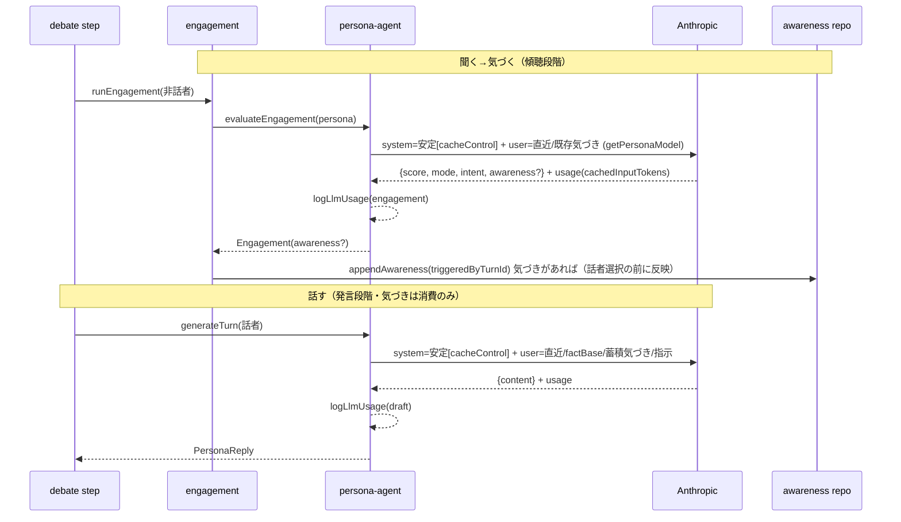

# 技術設計: debate-llm-cost-reduction

## Overview

**Purpose**: 討論フェーズ（1トピック通しLLMコストの約88%）のLLM利用を、**品質を落とさずにムダ（同一コンテキストの重複課金・冗長計算）を無くす＝効率化**する。安価モデルへの格下げのような品質トレードオフは採らない。**Users**: 運用者（品質維持のまま運用コスト低減）・開発者（施策の実測検証）。**Impact**: 現状フルプライスで再送しているペルソナ安定コンテキストをプロンプトキャッシュで再利用し、その前提として信念モデルを「固定の初期信念＋気づき（awareness）の追記」へ作り替える。気づきは「聞く→気づく→話す」の順で、傾聴（engagement）段階で検出し発言（generateTurn）で消費する。すべて施策単位のトグルと実測（usage記録）を伴う。

### Goals
- 品質を維持したまま、engagement評価と発言draft生成の合算LLMコストをベースライン比 30% 以上削減（1.2）。
- ペルソナ安定コンテキストの重複課金を、プロンプトキャッシュ再利用で排除（2.x, 3.1）。
- 信念を上書きせず、気づき（awareness）を非破壊・追記で管理し、傾聴段階で検出する（7.x）。
- 各LLM呼び出しの usage を実測・記録し、効果を推測でなく検証（4.x）。

### Non-Goals
- personas / interviews / topics（gemini・gpt）フェーズのコスト最適化。
- 討論フローの判定基準（話者選択・介入・章立て）の再設計。
- 気づきの横断集約による「創発的アイデア」合成（将来別spec）。
- 既存トピックの旧信念データの移行（クリア・再生成前提、7.7）。

## Boundary Commitments

### This Spec Owns
- 討論フェーズの claude-sonnet-4-6 呼び出し（engagement・draft・再生成・事後コメント・ファシリテーター）のプロンプト構成とモデル選択。
- ペルソナ信念モデル（固定初期信念＋`awarenesses`）の型・永続・生成・可視化。
- LLM呼び出しの usage 計測ログと施策トグル。

### Out of Boundary
- 話者選択・介入・キュー投入の**判定基準**（engagementスコアの意味・閾値は不変）。
- **engagement の安価モデルへの格下げ**（品質トレードオフ＝効率化の趣旨に反するため採らない）。
- interview が生成する初期信念の内容（beliefs[0] は据え置き）。
- 公開ページの表示（信念変化描画は管理画面のみに存在）。
- BE 既存 `Belief` 型名の `*ForFirestore` 統一（chapter-type-unification の範疇）。

### Allowed Dependencies
- `ai@^6` / `@ai-sdk/anthropic@^3`（cacheControl・usage）。
- 既存 `getPersonaModel` / `getPipelineModel`（`llm/models.ts`）、`prompt-formatters`、`debate.constants`。
- Firestore（persona ドキュメント、session ドキュメント）。

### Revalidation Triggers
- `Engagement` の契約変更（`awareness` 追加。ただし score/mode の意味は不変）／`PersonaReply` からの `beliefChange` 除去。
- persona ドキュメントのスキーマ変更（`awarenesses` 追加、`beliefs` の意味変更）。
- ターン埋め込みの信念変化情報 → 気づきベースへの変更。

## Architecture

### Existing Architecture Analysis
- 討論は `debate-orchestrator` が step を Cloud Task で逐次駆動。1ターン＝engagement評価（[engagement.ts](functions/src/pipeline/debate/engagement.ts)）→話者選択→発言生成（[persona-agent.ts generateTurn](functions/src/agents/persona-agent.ts#L212)）→インラインFC→信念適用（[step.ts:110](functions/src/pipeline/debate/step.ts#L110) `applyBeliefChange`）。**現状は信念変化を「話す」段階（generateTurn 出力）で拾う**が、本設計では「聞く」段階（engagement）へ移す。
- ペルソナ発言・engagement・事後コメントは共通の `buildPersonaSystemPrompt` を system に使用。**現状ここに最新信念を埋め込むためキャッシュが成立しない**。
- 信念は persona ドキュメント埋め込み `beliefs: Belief[]`（バージョン管理、[belief.ts](functions/src/pipeline/debate/belief.ts)）。管理画面3箇所が `changeSummary`/`triggeredByTurnId` を描画。
- LLM呼び出しに usage 記録・キャッシュ・トグルは存在しない（全て新規）。

### Architecture Pattern & Boundary Map



**Architecture Integration**:
- **Selected pattern**: 既存パイプラインの拡張（Extension）。新規は薄い横断ユーティリティ2つ（config・instrumentation）のみ。
- **Dependency direction**: `Types → Config → llm(models/instrumentation) → agents → pipeline(debate) → FE`。左方向のみ import。中央ディスパッチャは作らない（steering: 過度な共通化回避）。
- **Existing patterns preserved**: `Result<T,E>` エラー型、arrayUnion 追記、`getPersonaModel` 切替、tests/ ミラー配置。
- **New components rationale**: (1) `feature-flags` = 施策の独立トグル（6.x）、(2) `instrumentation` = usage 記録（4.x）。いずれも配線が薄く単一責務。

### Technology Stack

| Layer | Choice / Version | Role in Feature | Notes |
|-------|------------------|-----------------|-------|
| Backend / Services | Firebase Functions v2 (Node 24) | 討論パイプライン実行 | 既存 |
| AI SDK | `ai@6.0.208` | usage（`cachedInputTokens`）取得・生成 | 既存、追加なし |
| AI Provider | `@ai-sdk/anthropic@3.0.85` | `cacheControl`（ephemeral, ttl `5m`/`1h`） | breakpoint はメッセージ／パート単位 |
| Data / Storage | Firestore | persona `awarenesses` 追記、session（既存） | 既存 |
| Config | 環境変数 | 施策トグル（キャッシュ・冗長評価削減） | 新規（`constants/`） |

## File Structure Plan

### New Files
```
functions/src/
├── constants/
│   └── feature-flags.ts        # 施策トグル（env読取: キャッシュ・冗長評価削減・TTL）
├── llm/
│   └── instrumentation.ts      # logLlmUsage(kind, model, usage, topicId) 構造化ログ
└── pipeline/debate/
    └── awareness.ts            # appendAwareness / getInitialBelief / rollbackAwarenessesForRemovedTurns（belief.ts を置換）
```

### Modified Files
- `functions/src/types/persona.types.ts` — `Belief` を初期信念のみにスリム化、`AwarenessForFirestore` 追加、`Persona.awarenesses?` 追加。
- `functions/src/types/debate.types.ts` / `turn.types.ts` — `BeliefChangeEvent` → `AwarenessEvent`、**`Engagement` に `awareness?` を追加**（気づきは傾聴段階で発生）、`PersonaReply.beliefChange` を除去（generateTurn は消費のみ）、ターン埋め込みの信念変化 → 気づき。
- `functions/src/agents/persona-agent.ts` — system を安定コンテキスト（初期信念含む・cacheControl付与）と揮発部に再構成（`promptCache` フラグで切替）。`evaluateEngagement` の出力スキーマに awareness を追加（**検出はここ**）＋揮発部に既存 awareness を注入。`generateTurn` は `turnOutputSchema` から awareness 出力を除去し awareness を消費のみ。`generatePostDebateComment` も同構成。全生成後に `logLlmUsage`。engagement のモデルは `getPersonaModel` のまま（格下げしない）。
- `functions/src/agents/facilitator-agent.ts` — closing の信念要約を「初期信念＋awareness」へ。`logLlmUsage` 付与。
- `functions/src/pipeline/debate/engagement.ts` — 評価結果に含まれる awareness を `appendAwareness` で永続（`runEngagement`／フォールバック双方。keyは当該ターンid）。
- `functions/src/pipeline/debate/step.ts` — `applyBeliefChange`（reply由来）を除去。awareness 永続は engagement 段階へ移動。
- `functions/src/pipeline/debate/turn.ts` — closing の `finalBeliefs` 導出を「初期信念＋awareness」へ。`PersonaReply` 参照更新。
- `functions/src/pipeline/debate/post-debate-comments.ts` — `finalBelief` → 初期信念＋awareness 合成。
- `functions/src/utils/prompt-formatters.ts` — `formatAwarenessSection(awarenesses)` 追加（純関数）。
- `functions/src/llm/models.ts` — 変更なし（格下げ用の `getEngagementModel` は導入しない。engagement は `getPersonaModel` を継続使用）。
- （FE）`src/lib/models/persona/persona.types.ts` — `BeliefForFirestore` スリム化、`AwarenessForFirestore` 追加、`PersonaForFirestore.awarenesses`。
- （FE）`src/lib/stores/personas.svelte.ts` — `awarenesses[].createdAt` の Date 変換。
- （FE）`Phase5Debate.svelte` / `Phase6Editing.svelte` — 信念変化描画を awareness ベースへ（`triggeredByTurnId` 紐付けは踏襲）。`InterviewItem.svelte` は初期信念表示のまま不変。

**削除**: `functions/src/pipeline/debate/belief.ts`（awareness.ts へ置換、re-export はしない＝import側を直接書換え）。

## System Flows

### 1ターンのLLM呼び出しとキャッシュ／気づき（要件2・3・4・7）



**Key decisions**:
- 安定コンテキスト（初期信念含む）を system パートに置き `cacheControl` を付与。同一ペルソナの engagement/draft/再生成/コメントが TTL 内でキャッシュ再利用（2.1, 3.1）。信念は不変なので追記（awareness）は system を無効化しない（2.2, 7.3）。engagement のモデルは格下げせず品質維持（3.2）。
- キャッシュ未成立・期限切れは AI SDK が自動でフルプライス処理（`cachedInputTokens=0`）＝欠落なし（2.5）。
- **気づきの検出は傾聴段階（engagement）で行い、話者選択の前に永続**。generateTurn は蓄積された気づきを消費して発言に反映する（聞く→気づく→話す、7.5）。非話者も気づける。
- awareness は揮発部（user）に注入し、engagement/draft/comment すべてで文脈として読む。発言は「初期信念（主軸）＋気づき」で構成し立場を反転させない（7.4）。engagement は awareness を読むが score/mode の意味は不変（3.4, 7.5）。

## Requirements Traceability

| Requirement | Summary | Components | Interfaces | Flows |
|-------------|---------|------------|------------|-------|
| 1.1, 1.2 | ベースライン比較・30%削減（品質維持） | instrumentation + 全レバー | `logLlmUsage` | 1ターンフロー |
| 1.3, 1.4 | 討論完遂・範囲限定 | persona-agent / step | — | — |
| 2.1–2.5 | 安定コンテキストのキャッシュ再利用・フォールバック | persona-agent, feature-flags | `cacheControl` providerOptions | 1ターンフロー |
| 3.1–3.5 | engagementのキャッシュ再利用・格下げ回避・冗長評価削減 | persona-agent, engagement, feature-flags | `cacheControl`, `engagementSkipRedundant` | 1ターンフロー |
| 4.1–4.4 | usage記録・種別/モデル別・ヒット率 | instrumentation | `logLlmUsage` | 1ターンフロー |
| 5.1–5.3 | 品質非退行・人格分離・切戻し | feature-flags, persona-agent | env toggles | — |
| 6.1–6.3 | 施策の個別トグル | feature-flags | env toggles | — |
| 7.1–7.9 | 信念固定＋awareness別管理・傾聴段階検出 | types, awareness repo, persona-agent, engagement, FE views | `Awareness*`, `appendAwareness` | 1ターンフロー |

## Components and Interfaces

| Component | Layer | Intent | Req | Key Deps (P0/P1) | Contracts |
|-----------|-------|--------|-----|------------------|-----------|
| feature-flags | Config | 施策の独立トグル（キャッシュ・冗長評価削減・TTL） | 5, 6 | env (P0) | State |
| instrumentation | llm | usage を種別/モデル別に構造化ログ | 4 | ai usage (P0) | Service |
| awareness repo | pipeline | 気づきの追記・初期信念取得・巻き戻し | 7 | Firestore (P0) | Service |
| persona-agent（改修） | agents | プロンプト再構成・キャッシュ・傾聴段階でのawareness検出／発言での消費 | 2,3,7 | feature-flags(P0), instrumentation(P1) | Service |
| engagement（改修） | pipeline | 評価結果の awareness を永続、冗長評価の削減 | 3,7 | awareness repo(P0) | Service |
| FE persona types/views | FE | awareness の型・可視化 | 7 | Firestore(P0) | State |

### llm / instrumentation

#### instrumentation
| Field | Detail |
|-------|--------|
| Intent | LLM呼び出しの usage を種別・モデル別に記録し、フェーズ集計とヒット率算出を可能にする |
| Requirements | 4.1, 4.2, 4.3, 4.4 |

**Responsibilities & Constraints**
- 呼び出し結果の `usage`（`inputTokens`/`outputTokens`/`cachedInputTokens`）を受け、種別・モデルID・topicId 付きで構造化ログを1行出力。
- 集計はログベース（Cloud Logging クエリ）。Firestore書込みはしない。常時ON（低コスト）。

**Contracts**: Service [x]

##### Service Interface
```typescript
type LlmCallKind = 'engagement' | 'draft' | 'regen' | 'comment' | 'facilitator';

interface LlmUsageLog {
  kind: LlmCallKind;
  modelId: string;
  topicId: string;
  usage: {
    inputTokens: number;
    outputTokens: number;
    cachedInputTokens: number; // ヒット率 = cachedInputTokens / (inputTokens + cachedInputTokens)
  };
}

const logLlmUsage: (entry: LlmUsageLog) => void;
```
- Preconditions: 生成呼び出しが完了し `usage` を得ている。
- Postconditions: 構造化ログ1行を出力（副作用のみ、戻り値なし）。
- Invariants: 生成の成否に関わらず記録は best-effort（例外は握りつぶす）。

**Implementation Notes**
- Integration: persona-agent / facilitator-agent の各 generate 直後に呼ぶ。
- Risks: `usage` フィールドは `number | undefined` のため 0 補完。

### Config / feature-flags

#### feature-flags
| Field | Detail |
|-------|--------|
| Intent | 効率化施策を施策単位で独立ON/OFF（変数隔離） |
| Requirements | 5.3, 6.1, 6.2, 6.3 |

**Contracts**: State [x]

##### State Management
```typescript
interface DebateEfficiencyFlags {
  promptCache: boolean;             // ENABLE_PROMPT_CACHE
  cacheTtl: '5m' | '1h';            // CACHE_TTL（既定 '5m'）
  engagementSkipRedundant: boolean; // ENABLE_ENGAGEMENT_SKIP_REDUNDANT（既定 false）
}
const getDebateEfficiencyFlags: () => DebateEfficiencyFlags;
```
- State model: 環境変数を読取り不変オブジェクトで返す純関数。
- Concurrency: 読取専用。中央ディスパッチャ化せず、各利用箇所が必要なフラグのみ参照。
- 注: engagement の安価モデル格下げフラグは持たない（格下げは採らない＝要件3.2）。

**Implementation Notes**
- Integration: persona-agent（cacheControl付与）・engagement（冗長評価の省略）が個別に参照。
- Validation: 未設定は既定 false / `'5m'`（＝ベースライン動作）。

### agents / persona-agent（改修）

#### buildStablePersonaContext / evaluateEngagement / generateTurn
| Field | Detail |
|-------|--------|
| Intent | 安定コンテキスト（初期信念含む）を分離しキャッシュ、揮発部に気づき・文脈を注入。傾聴（engagement）で気づきを検出、発言（generateTurn）で消費 |
| Requirements | 2.1, 2.2, 2.3, 2.4, 3.1, 3.2, 7.2, 7.4, 7.5 |

**Responsibilities & Constraints**
- `buildStablePersonaContext(persona)`: 固定導入・スタイル・プロフィール・取材レコード・**初期信念**を返す純関数。全ペルソナ呼び出しで同一。
- system は安定コンテキストを1パートとして持ち `providerOptions.anthropic.cacheControl` を付与（`promptCache` ON時）。
- user（揮発）: 直近ターン・factBase（draftのみ）・`formatAwarenessSection(awarenesses)`・指示。
- 統合規則: 初期信念を主軸とし、awareness は「一理ある／自己の気づき」として反映するが立場を反転させない（プロンプト明示）。
- **awareness の入力／出力の区別（聞く→気づく→話す）**:
  - **入力（文脈として読む）**: `evaluateEngagement`・`generateTurn`・`generatePostDebateComment` の**すべて**が揮発部に `formatAwarenessSection(awarenesses)` を含める。engagement が意図（mode/intentSummary）を形成する段階でも既存の気づきを反映しないと、発言も awareness 不在になるため（score/mode の意味は変えず入力のみ追加）。
  - **出力（新規に気づきを検出）**: `evaluateEngagement`（傾聴段階）が `awareness?` を emit する。ペルソナは直近の会話を「聞いて」処理する段階で気づきを得るため、これが自然（非話者も気づける）。検出のフレーミングは「**ここまで聞いていて受け止めた／気づいた**」。
  - `generateTurn`（発言）は awareness を**出力しない**（消費のみ）。`turnOutputSchema` から awareness/beliefChange を除去。
  - engagement の出力に awareness を足しても、**score/mode の意味・話者選択への使われ方は不変**（3.4, 7.5）。engagement は格下げしない（フルモデル）ので検出品質は保たれる（3.2）。

**Contracts**: Service [x]

##### Service Interface
```typescript
type AwarenessKind = 'reception' | 'self';

interface AwarenessEvent {
  kind: AwarenessKind;
  content: string;               // 気づきの内容
  sourcePersonaId: string | null;// receptionのとき誰の視点か、selfはnull
}

// engagement（傾聴）の出力に awareness を追加。score/mode/intentSummary の意味は不変。
interface Engagement {
  personaId: string;
  score: number;                 // 1..5（不変）
  mode: 'question' | 'fact' | 'opinion' | 'none';  // 不変
  intentSummary?: string;
  awareness?: AwarenessEvent | null;   // 新規：傾聴段階で検出（大半は null）
}

// generateTurn（発言）は awareness を出力しない（消費のみ）
interface PersonaReply {
  content: string;
  speechMode: 'opinion' | 'fact' | 'question';
  targetPersonaId?: string;
  searchUsed?: boolean;
  searchQueries?: string[];
}

const evaluateEngagement: (
  persona: Persona, turns: DebateTurn[],
  otherPersonaNames: string[], personas: ReadonlyArray<Persona>
) => Promise<Engagement>;   // awareness? を含みうるが score/mode の意味は不変

const generateTurn: (
  persona: Persona, context: TurnGenerationContext,
  engagement: Engagement, personas: ReadonlyArray<Persona>
) => Promise<Result<PersonaReply, PipelineError>>;  // 蓄積 awareness を消費、出力はしない
```
- Preconditions: `persona.beliefs[0]`（初期信念）が存在。`persona.awarenesses` は空でも可。
- Postconditions: `Engagement` の score/mode/intentSummary は現行と同一（3.3, 3.4）。`awareness` の永続は engagement フローが担当（step ではない）。
- Invariants: `promptCache` OFF ではベースラインと同一の呼び出しモデル・スコア構造。engagement は常に `getPersonaModel`（格下げなし）。

**Implementation Notes**
- Integration: cacheControl は Anthropic 呼び出しにのみ効く。gpt/openai は無視（no-op）で安全。生成直後に `logLlmUsage`。
- Validation: `engagementSchema` に `awareness`（kind/content/sourcePersonaId、nullable）を追加。`turnOutputSchema` から `beliefChange` を除去。
- Risks: TTL(5m) 内にターンが収まるかは実測（research 7-3）。収まらなければ `cacheTtl='1h'`。

### pipeline/debate / awareness（belief.ts 置換）

#### awareness repository
| Field | Detail |
|-------|--------|
| Intent | 気づきの追記・初期信念取得・破棄ターン巻き戻し |
| Requirements | 7.1, 7.2, 7.3, 7.7, 7.9 |

**Contracts**: Service [x]

##### Service Interface
```typescript
const getInitialBelief: (persona: Persona) => string; // beliefs[0].content（無ければ''）

const appendAwareness: (args: {
  topicId: string; persona: Persona; turnId: string; awareness: AwarenessEvent;
}) => Promise<void>; // arrayUnion で persona.awarenesses に追記＋in-memory 更新

const rollbackAwarenessesForRemovedTurns: (
  topicId: string, removedTurnIds: Set<string>
) => Promise<void>; // triggeredByTurnId で巻き戻し（restart 用）
```
- Preconditions: persona ドキュメント存在。
- Postconditions: `awarenesses` に1件追記（`triggeredByTurnId` 付与、7.7 の可視化紐付けを担保）。初期信念は不変（7.1）。
- Invariants: 上書きを行わない（破壊的更新禁止、7.3）。

**Implementation Notes**
- Integration: **engagement フロー**が評価結果の `awareness` を `appendAwareness` で永続（話者選択の前）。closing/comments は `getInitialBelief` + `formatAwarenessSection`。step は awareness 永続に関与しない。
- Risks: 既存 `applyBeliefChange`/`getLatestBelief`/`rollbackBeliefsForRemovedTurns` の全 import を直接置換（re-export しない）。

### pipeline/debate / engagement（改修）

#### runEngagement / evaluateEngagementWithFallback
| Field | Detail |
|-------|--------|
| Intent | 傾聴段階で検出された awareness を永続し、必要なら冗長評価を省く |
| Requirements | 3.5, 7.2, 7.5 |

**Responsibilities & Constraints**
- 評価結果（`Engagement.awareness?`）が非nullのペルソナについて `appendAwareness`（key=当該ターンid）を呼ぶ。話者選択の前に完了させ、選ばれた話者の `generateTurn` が最新の気づきを消費できるようにする。
- `engagementSkipRedundant` ON時のみ、判定に影響する会話変化がないペルソナの再評価を省略し前回結果を流用してよい（3.5、妥当性を損なう場合は全評価にフォールバック）。既定OFF＝全対象を評価（ベースライン一致）。

**Contracts**: Service [x]

**Implementation Notes**
- Integration: `evaluateEngagement` を呼ぶ既存2経路（`runEngagement`・`evaluateEngagementWithFallback`）の双方で awareness を永続。
- Risks: 冗長評価削減は話者選択に影響しうるため、既定OFF・要件5で妥当性確認後に有効化。

### FE persona types / views（改修）

Summary-only（新規境界なし、既存描画の置換）。`BeliefForFirestore` をスリム化し `AwarenessForFirestore` を追加、`Phase5Debate`/`Phase6Editing` の「🔄 信念変化」を awareness（`content`）ベースへ。`triggeredByTurnId` によるターン紐付けは踏襲。`InterviewItem`（初期信念表示）は不変。FE型はFirestore永続形と一致させる（乖離形を作らない）。

**Implementation Note**: 既存データはクリア前提のため後方互換読みは実装しない（7.7）。

## Data Models

### Domain Model
- **Persona**（集約）: 初期信念（不変）を保持し、討論中に気づき（awareness）を追記する。見解＝初期信念＋気づきの合成（永続化された「最終信念」は持たない、7.5/7.6）。
- **Awareness**（値オブジェクト・追記のみ）: 他者視点の受容（reception）または自己発の気づき（self）。ターンに帰属（`triggeredByTurnId`）、reception は発生源（`sourcePersonaId`）を持つ。ペルソナに帰属し横断集約しない（7.8）。

### Physical Data Model（Firestore・Document Store）

`topics/{topicId}/personas/{personaId}` 埋め込み:
```typescript
// スリム化：初期信念のみ（version は 0 固定、変化追跡フィールドは廃止）
interface BeliefForFirestore { id: string; version: number; content: string; createdAt: Timestamp; }

// 新規：討論中の気づき（追記のみ）
interface AwarenessForFirestore {
  id: string;
  kind: 'reception' | 'self';
  content: string;
  sourcePersonaId: string | null;
  triggeredByTurnId: string;
  createdAt: Timestamp;
}

interface PersonaForFirestore {
  // ...既存フィールド...
  beliefs: BeliefForFirestore[];        // 初期信念のみ（interview が生成、debate は追記しない）
  awarenesses: AwarenessForFirestore[]; // debate が arrayUnion で追記
}
```
- **Embedding**: `awarenesses` は persona と常に一緒に読むため埋め込み（firebase.md 方針）。件数はターン上限に有界（≤ MAX_TURNS 程度）。
- **Consistency**: `arrayUnion` で原子追記。restart 時は `triggeredByTurnId` で巻き戻し（既存 belief 巻き戻しと同型）。
- **Migration**: なし（既存データはクリア・再生成、7.7）。

### Data Contracts & Integration
- ターン埋め込み（session `turns[]`）の信念変化情報は awareness ベースに変更（`triggeredByTurnId` で FE が紐付け）。BE→FE は型を一致（mirror）。

## Error Handling

### Error Strategy
- **キャッシュ不成立/期限切れ（2.5）**: AI SDK が自動でフルプライス処理。`cachedInputTokens=0` を記録するのみ、欠落なし。
- **engagement評価失敗（3.3）**: 既存 `evaluateEngagement` の try/catch を踏襲し、例外時は score 1/none（既存挙動）。awareness は付随せず null 扱い。
- **awareness永続失敗（7）**: `appendAwareness` は best-effort。失敗しても討論継続（発言・スコアは生成済み）。
- **冗長評価削減の不確実性（3.5）**: `engagementSkipRedundant` 既定OFF。妥当性が疑わしい場合は全評価にフォールバック。
- **usage記録失敗（4）**: `logLlmUsage` は例外を握りつぶし生成フローに影響させない。

### Monitoring
- 構造化ログ（kind/modelId/topicId/usage）を Cloud Logging に出力。フェーズ集計・ヒット率はログクエリで算出（4.3, 4.4）。ベースライン取得は全トグルOFFで1トピック実行し同ログを集計（1.1）。

## Testing Strategy

### Unit Tests
- `awareness.ts`: `appendAwareness`（arrayUnion＋in-memory更新）、`getInitialBelief`（beliefs[0]/空）、`rollbackAwarenessesForRemovedTurns`（triggeredByTurnId フィルタ）。
- `persona-agent`: 安定/揮発の分割（初期信念が安定側・awarenessが揮発側）、cacheControl 付与が `promptCache` フラグで切替わる、`evaluateEngagement` が `awareness?` を出力し `generateTurn` は出力しない。
- `feature-flags`: 未設定時の既定（promptCache=false, ttl='5m', skipRedundant=false）＝ベースライン。
- `instrumentation.logLlmUsage`: usage undefined の 0 補完、例外握りつぶし。
- `formatAwarenessSection`: 空・reception/self 混在の整形。

### Integration Tests
- engagement 永続: `Engagement.awareness` → `appendAwareness` 追記が話者選択の前に行われ、初期信念が不変であること。
- ベースライン一致: 全トグルOFFで engagement/draft の呼び出しモデル・スコア構造が現行と一致（1.4, 3.3）。

### UI Tests（Vitest browser, tests/ ミラー）
- `Phase5Debate` / `Phase6Editing`: awareness（content）が `triggeredByTurnId` でターンに紐付き描画される。`InterviewItem` の初期信念表示が不変。
- `personas` store: `awarenesses[].createdAt` の Date 変換。

## Performance & Scalability
- **目標**: 品質を維持したまま engagement＋draft 合算コスト ベースライン比 −30% 以上（1.2）。主寄与は**プロンプトキャッシュ**による安定プレフィックスの重複課金排除（engagement/draft の入力大半 ~0.1×）。engagement は格下げしない（品質維持）。
- **測定**: `cachedInputTokens/(inputTokens+cachedInputTokens)` をヒット率、種別別トークン×単価で推定コスト。品質はベースライン比の前後比較（5.1）。
- **トレードオフ**: TTL `5m`（書込1.25×）で開始。ターン間隔が超過するなら `1h`（書込2×、要3回以上の読取で回収）。研究 7-3 で判断。

## Open Questions / Risks
- **TTLヒット率**: Cloud Tasks チェーンのターン間隔が 5m を超えるとキャッシュ失効。実測で `5m`/`1h` を確定（research 7-3）。キャッシュはこの spec の主レバーのため、実装初手で `cachedInputTokens>0` の疎通スパイクを置く。
- **冗長評価削減の妥当性**: 「会話変化なし」の判定基準が曖昧で、毎ターン新発言が加わるため適用機会が少ない可能性。既定OFFで導入し、5.1のA/Bで効果と妥当性を確認してから有効化（3.5）。
- **awareness の効き方**: 「立場非反転」をプロンプトでどこまで担保できるか、傾聴段階（engagement）での検出品質。品質非退行（5.1, 5.2）で人格分離と発話品質を確認。
