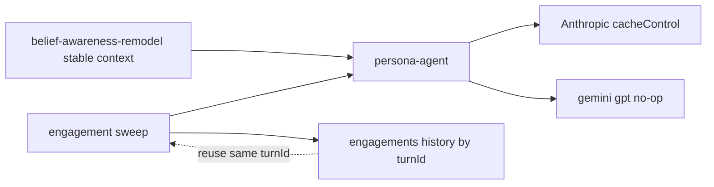
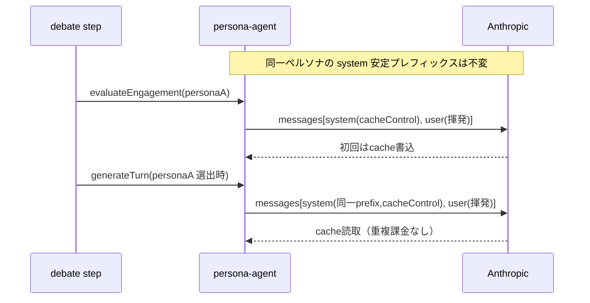

# 技術設計: debate-llm-cost-reduction

## Overview

討論フェーズの Claude 呼び出しは、ペルソナごとにほぼ同一の巨大な安定コンテキスト（固定導入文・スタイルガイド・プロフィール・事前取材レコード・初期信念）を、engagement評価・発言生成のたびにフルプライスで再送している。**Purpose**: この重複課金を Anthropic のプロンプトキャッシュで排除する。**Impact**: `buildPersonaSystemPrompt` が生成する安定コンテキストを、`system` 文字列パラメータから **`cacheControl` を付与した system メッセージ** に載せ替える。プロンプトキャッシュはモデル出力を変えないため、計測・品質検証・トグルは設けない（既存の仕様変更と同じく、変更を入れて挙動を見て判断する）。

加えて、engagement評価の冗長を2点で削る（要件2）: **(1) 章末+1の最終応答（freeze）は話者が指名で確定済みのため、全非話者のフル評価を廃し指名者のみ評価する（捨てられていた (P−2)件/章の無駄打ちを削減）。(2) 同一ターン状態（同一 turnId）に対する再評価を、永続済み評価結果の再利用で省く（ステップ再実行・リトライ時）。**

上流仕様 `belief-awareness-remodel` が初期信念を固定し安定コンテキストを不変にしたことで、初めてキャッシュが繰り返しヒットする。本仕様はその成果に依存する。

### Goals
- ペルソナ安定コンテキストの重複課金を、Anthropic プロンプトキャッシュ再利用で排除する（1.1）。
- キャッシュ適用が発言・engagementの出力／スキーマを変えないこと、非成立時に自動フォールバックすること（1.2, 1.3）。
- 同一ターン状態に対する engagement 再評価を、永続結果の再利用で省く（2.1, 2.2）。

### Non-Goals
- コスト計測ログ（instrumentation）・品質非退行検証・施策トグルの構築（キャッシュは出力不変のため不要）。
- 信念モデル（固定初期信念＋awareness）の型・永続・生成・可視化（上流 `belief-awareness-remodel` が所有）。
- 話者選択・介入・キュー投入・章立ての判定基準の変更。personas / interviews / topics フェーズのコスト。

## Boundary Commitments

### This Spec Owns
- 討論フェーズのペルソナ系 Claude 呼び出し（`evaluateEngagement` / `generateTurn`＝draft・regen / `generatePostDebateComment`）における **system プロンプトのキャッシュ配置**（安定コンテキストを cacheControl 付き system メッセージにする）。
- engagement評価の **冗長削減**: 章末+1（freeze）での指名者のみ評価、および同一 turnId の永続結果再利用。

### Out of Boundary
- 信念モデルの設計・型・永続・可視化（上流 `belief-awareness-remodel`）。`buildPersonaSystemPrompt` が読む初期信念（`getInitialBelief`）と awareness 整形（`formatAwarenessSection`）は上流が確立済みで、本仕様は**その入出力を変えない**。
- engagement の score/mode の意味・話者選択での使われ方（不変）。安価モデルへの格下げ。
- コスト計測・品質検証・トグルの仕組み。

### Allowed Dependencies
- `ai@^6`（system を構造化メッセージで受け、`role:'system'` メッセージに `providerOptions` を許容）／`@ai-sdk/anthropic@^3`（`cacheControl: { type:'ephemeral' }`）。
- 既存 `getPersonaModel`（`llm/models.ts`）、`buildPersonaSystemPrompt`、`formatAwarenessSection`、`getInitialBelief`、engagements サブコレクション（`engagement.ts` の `saveEngagements` が永続する `history.<turnId>`）。
- 上流 `belief-awareness-remodel`（不変な安定コンテキストの確立）。

### Revalidation Triggers
- `buildPersonaSystemPrompt` の引数・内容が可変要素を含むよう変わる（安定性が崩れキャッシュ前提が無効化）。
- ペルソナ系呼び出しの `system`／`messages` 構成の変更。
- engagements の永続形（`history.<turnId>` の score/mode）の変更。

## Architecture

### Existing Architecture Analysis
- ペルソナ系の3呼び出し（`evaluateEngagement` / `generateTurn` / `generatePostDebateComment`）は、いずれも `buildPersonaSystemPrompt(persona, interviewRecord, getInitialBelief(persona))` を **`system` 文字列**として渡し、可変文脈（直近ターン・factBase・awareness・指示）を **`user` メッセージ**に渡している（[persona-agent.ts](functions/src/agents/persona-agent.ts)）。上流適用済みのため system は討論中に不変（初期信念は固定、awareness は user 側）。
- モデルは `getPersonaModel(llmType)`。claude 以外（gemini/gpt）もペルソナに応じて選ばれる。
- ai SDK v6 では **`system` を文字列で渡すとキャッシュのブレークポイントが付かない**（既知の挙動）。キャッシュには system を `messages` 内の `role:'system'` メッセージにして `providerOptions.anthropic.cacheControl` を付ける必要がある（research 参照）。
- engagement は毎ターン `evaluateEngagements` が非直前話者を一括評価し、`saveEngagements` が `engagements/<personaId>.history.<turnId>` に score/mode を永続する（[engagement.ts](functions/src/pipeline/debate/engagement.ts)）。

### Architecture Pattern & Boundary Map



**Architecture Integration**:
- **Selected pattern**: 既存パイプラインの内部改修（Extension）。新規コンポーネント・新規ファイルなし。
- **Domain boundaries**: キャッシュ配置は persona-agent 内に閉じる。冗長削減は engagement.ts 内に閉じる。中央ディスパッチャや設定レイヤは作らない（steering: 過度な共通化回避）。
- **Existing patterns preserved**: `Result<T,E>`、`getPersonaModel` 切替、`buildPersonaSystemPrompt` の責務、engagements 永続形。
- **Steering compliance**: 最小変更・画面（処理）に直接記述・不要な抽象化なし。

### Technology Stack

| Layer | Choice / Version | Role in Feature | Notes |
|-------|------------------|-----------------|-------|
| Backend / Services | Firebase Functions v2 (Node 24) | 討論パイプライン | 既存 |
| AI SDK | `ai@^6` | `system` を構造化メッセージで受ける | 既存、追加なし |
| AI Provider | `@ai-sdk/anthropic@^3` | `cacheControl: { type:'ephemeral' }` | 追加なし。非anthropicは無視（no-op） |
| Data / Storage | Firestore | engagements `history.<turnId>` の再利用（既存） | 追加なし |

## File Structure Plan

### New Files
なし（新規ファイル・新規設定レイヤは作らない）。

### Modified Files
- `functions/src/agents/persona-agent.ts` — **anthropic(claude) 経路のときのみ**、`evaluateEngagement` と `generateTurn`（draft/regen）の安定コンテキストを **`system` 文字列 → cacheControl 付き system メッセージ** に載せ替える。gemini/gpt 経路は現行の `system` 文字列呼び出しのまま不変。`generatePostDebateComment`（ペルソナ1回・別プレフィックスで cache write の純増になる）はキャッシュ対象外。`buildPersonaSystemPrompt` はそのまま利用。cacheControl 用の providerOptions はモジュール定数として1つ持つ。
- `functions/src/pipeline/debate/engagement.ts` — `evaluateEngagements` で、当該 turnId の engagement が既に永続（`history.<turnId>`）されているペルソナは LLM 再評価を省き永続値を再利用する。未永続（＝新規ターン状態）は従来どおり評価する。
- `functions/src/pipeline/debate/step.ts` — 章末+1（freeze）ブランチで `evaluateEngagements`（全非話者のフル評価）を廃し、指名済み話者のみを `evaluateEngagementWithFallback`（engagements 空指定＝単独評価）で評価する。非指名者のスコア保存・awareness 捕捉はこの最終ターンでは行わない（捨てられていた計算の削減。振る舞い差分として許容）。

## System Flows

### 1ターン内のキャッシュ再利用（要件1）



**Key decisions**:
- 安定コンテキストを system メッセージの単一ブロックにし `cacheControl:{type:'ephemeral'}`（既定TTL 5分）を付与。同一ペルソナの engagement→（選出時）draft、および次ターン以降の engagement が TTL 内でプレフィックスを再利用する（1.1）。
- 初期信念は不変・awareness は user 側なので、awareness 追記は system を無効化しない（3.2、上流の成果に依存）。
- 非anthropicモデルは `providerOptions.anthropic` を無視するため gemini/gpt は従来どおり動作（1.2 の出力不変を担保）。
- キャッシュ未成立（最小トークン未満）・期限切れは ai SDK/Anthropic がフルプライスで自動処理＝欠落なし（1.3）。上流未確立で system が可変な間もエラーなく動作する（3.3）。

### engagement の冗長削減（要件2）

**(1) 章末+1（freeze）**: 話者が指名で確定しており、全非話者のスコアは話者選択・キュー・終了判定のいずれにも使われず捨てられている（[step.ts:156-192](functions/src/pipeline/debate/step.ts#L156-L192)）。この分岐でフル評価を廃し指名済み話者のみを評価する（(P−2)件/章の無駄打ちを削減）。非指名者のスコア保存・awareness 捕捉はこの最終ターンでは行わない（振る舞い差分として許容）。

**(2) 同一 turnId の再利用**: `evaluateEngagements` は評価前に当該 turnId の永続 engagement（`history.<turnId>`）を読み、存在するペルソナは LLM 呼び出しを省いて永続値を score/mode として再利用する。線形進行では毎ターン turnId が変わるため通常は全評価（2.2 の「変化の有無が判定できないなら従来どおり」に一致）、ステップ再実行・Cloud Task リトライで同一 turnId を再処理する場合にのみ再評価を省く（同一状態＝同一結果で出力不変）。

## Requirements Traceability

| Requirement | Summary | Components | Interfaces | Flows |
|-------------|---------|------------|------------|-------|
| 1.1 | 安定コンテキストのキャッシュ再利用 | persona-agent | system メッセージ + cacheControl | キャッシュ再利用 |
| 1.2 | 出力・スキーマ不変／人格非平準化 | persona-agent | 出力契約不変 | キャッシュ再利用 |
| 1.3 | 最小未満・非成立・期限切れの自動フォールバック | persona-agent | ai SDK 既定挙動 | キャッシュ再利用 |
| 1.4 | 適用範囲を討論フェーズに限定 | persona-agent, engagement | — | — |
| 2.1 | 冗長評価の削減（freeze指名者のみ／同一turnId再利用） | engagement, step | freeze指名者評価, history.<turnId> 再利用 | 冗長削減 |
| 2.2 | 判定不能なら従来どおり全評価 | engagement | 既定は全評価 | 冗長削減 |
| 3.1 | 信念モデルを上流の成果として前提 | persona-agent | getInitialBelief/formatAwarenessSection 不変 | — |
| 3.2 | 不変な安定コンテキストを前提にキャッシュ | persona-agent | cacheControl | キャッシュ再利用 |
| 3.3 | 上流未確立でもエラーなく継続 | persona-agent | 自動フォールバック | キャッシュ再利用 |

## Components and Interfaces

| Component | Layer | Intent | Req | Key Deps (P0/P1) | Contracts |
|-----------|-------|--------|-----|------------------|-----------|
| persona-agent（改修） | agents | anthropic経路の engagement/draft の安定コンテキストを cacheControl 付き system メッセージへ載せ替え | 1,3 | ai/anthropic (P0), buildPersonaSystemPrompt (P0) | Service |
| engagement/step（改修） | pipeline | freeze指名者のみ評価＋同一 turnId の再利用で冗長評価を削減 | 2 | engagements history (P0) | Service |

### agents / persona-agent（改修）

| Field | Detail |
|-------|--------|
| Intent | ペルソナ系3呼び出しの system 安定コンテキストをキャッシュ配置し、重複課金を排除する |
| Requirements | 1.1, 1.2, 1.3, 1.4, 3.1, 3.2, 3.3 |

**Responsibilities & Constraints**
- **anthropic(claude) 経路のときのみ**、`buildPersonaSystemPrompt` の返す安定コンテキスト文字列を `messages` 先頭の `role:'system'` メッセージ（`providerOptions.anthropic.cacheControl` 付き）に載せ替える。gemini/gpt 経路は現行の `system` 文字列呼び出しのまま不変（利益がなく、出力を確実に不変に保つため）。可変文脈（`user` メッセージ）は現状のまま。
- 対象は `evaluateEngagement` と `generateTurn`（draft/regen）。`generatePostDebateComment` はペルソナ1回・別プレフィックスで cache write の純増になるためキャッシュ対象外。
- 出力スキーマ（`turnOutputSchema` の content/targetPersonaId、`engagementSchema` の score/mode/intentSummary/awareness）は不変（1.2）。

**Contracts**: Service [x]

##### Service Interface
```typescript
// providerOptions はモジュール定数として1つ持つ（TTLは既定の 5m ephemeral）
const PERSONA_CACHE_PROVIDER_OPTIONS = {
  anthropic: { cacheControl: { type: 'ephemeral' } }
} as const;

// 各呼び出しの messages を「キャッシュ済み system + 揮発 user」に構成する内部形
type CachedSystemMessage = {
  role: 'system';
  content: string; // buildPersonaSystemPrompt(...) の返り値（安定コンテキスト）
  providerOptions: typeof PERSONA_CACHE_PROVIDER_OPTIONS;
};
```
- Preconditions: `persona.beliefs[0]`（初期信念）が存在（`getInitialBelief`）。system が討論中に不変（上流の成果）。
- Postconditions: 生成結果（発言・engagement・コメント）の内容・スキーマは現行と同一。キャッシュ成立時は入力トークン課金のみ減少。
- Invariants: system の内容・順序を変えない（プレフィックス一致がヒット条件）。呼び出しのモデル選択（`getPersonaModel`）は不変（格下げなし）。

**Implementation Notes**
- Integration: anthropic 経路で `generateText`（generateTurn。`output`/`tools` はそのまま）・`generateObject`（engagement）の `system` パラメータを外し `messages` 先頭に system メッセージを差し込む。`generatePostDebateComment` と非anthropic経路は変更しない。
- Validation: 安定コンテキストは大きく（指示＋プロフィール＋取材＋初期信念）Anthropic の最小キャッシュサイズを満たす想定。満たさない場合は no-op で従来課金（1.3）。
- Risks: TTL(5m) を跨ぐターン間隔だとヒットしない（下記 Open Questions）。ヒットしなくても出力・完遂は不変。

### pipeline/debate / engagement・step（改修）

| Field | Detail |
|-------|--------|
| Intent | freeze の指名者のみ評価と、同一 turnId の永続結果再利用で、engagement の冗長評価を削る |
| Requirements | 2.1, 2.2 |

**Responsibilities & Constraints**
- **freeze（step.ts）**: 章末+1 の最終応答ブランチで、全非話者のフル評価（`evaluateEngagements`）を廃し、指名済み話者のみを `evaluateEngagementWithFallback`（engagements 空指定＝単独評価）で評価する。非指名者の評価・awareness 捕捉はこのターンでは行わない。
- **同一turnId再利用（engagement.ts）**: `evaluateEngagements` は評価対象ペルソナごとに、当該 turnId の `history.<turnId>` が既に存在すれば LLM 再評価せず永続 score/mode を再利用する。未永続（新規ターン状態）は従来どおり `evaluateEngagement` を呼ぶ（2.2）。awareness は初回評価時に `persistDetectedAwareness` で永続済みのため、再利用時に再検出しない（重複追記の回避＝出力保存的）。

**Contracts**: Service [x]

**Implementation Notes**
- Integration: step.ts freeze ブランチの `evaluateEngagements`→指名者単独評価への差し替え。engagement.ts では turnId（`chapterTurns[last].id`）をキーに既存 engagements を読み、ヒット分を再利用・ミス分のみ評価。`evaluateEngagementWithFallback` の既存の「一括結果からの再利用」はそのまま。
- Validation: 通常ターンの一括評価は不変（話者選択・キュー・quietStreak・awareness に必要）。削減対象は freeze の非指名者と、リトライ時の同一 turnId。
- Risks: 再利用は永続済みフィールド（score/mode/intentSummary）に限る。不足時は当該ペルソナを従来評価にフォールバック（2.2）。freeze で非指名者の最終ターン awareness を捕捉しない差分は許容済み。

## Data Models

新規の永続スキーマ変更なし。engagement 冗長削減は既存 `topics/<topicId>/chapters/<chapterId>/engagements/<personaId>` の `history.<turnId>`（score/mode/intentSummary?）を**読み取り再利用**するのみ。信念・awareness の永続形は上流所有で本仕様は変更しない。

## Error Handling

- **キャッシュ非成立・期限切れ（1.3）**: ai SDK/Anthropic が自動でフルプライス処理。欠落なし、追加ハンドリング不要。
- **非anthropicモデル**: `providerOptions.anthropic` は無視（no-op）。従来どおり生成。
- **engagement 再利用の不足（2.2）**: 永続値が再利用に不十分（intentSummary 欠落等）なら当該ペルソナのみ従来評価にフォールバック。
- **上流未確立（3.3）**: system が可変でもキャッシュがヒットしないだけ。エラーなく討論継続。

## Testing Strategy

### Unit Tests
- `persona-agent`: anthropic 経路で `evaluateEngagement`・`generateTurn` が cacheControl 付き system メッセージを構成すること。gemini/gpt 経路と `generatePostDebateComment` は従来どおり `system` 文字列で呼ぶこと。出力スキーマ（content/targetPersonaId, score/mode/awareness）が不変であること。
- `engagement`: 同一 turnId の `history.<turnId>` 既存時に `evaluateEngagement` を呼ばず永続値を再利用する。未永続時は評価する。永続値不足時のフォールバック。
- `step`（freeze）: 章末+1 ブランチが `evaluateEngagements`（全評価）を呼ばず、指名者のみ評価すること。

### Integration Tests
- 全ペルソナ（claude/gemini/gpt 混在）で1ターンを実行し、発言・engagement の内容・スキーマが改修前と同型であること（1.2）。
- ステップ再実行（同一 turnId）で engagement の LLM 呼び出しが発生しないこと（2.1）。

## Performance & Scalability
- **狙い**: 品質不変のまま、ペルソナ安定プレフィックスの重複課金を排除（engagement/draft の入力大半がキャッシュ読取単価に置き換わる）。
- **TTL**: 既定 `5m` ephemeral で開始。同一ペルソナは毎ターン engagement 評価されるため、ターン間隔が 5m 内なら章を通してプレフィックスが再利用される。

## Open Questions / Risks
- **TTLヒット率**: Cloud Tasks チェーンのターン間隔が 5m を超えるとキャッシュ失効。失効してもフルプライスで完遂するため機能リスクはない。ヒット率が低ければ `ttl:'1h'`（書込コスト増）への変更を検討（定数1つの変更、トグルは設けない）。
- **engagement 冗長削減の効き幅**: 削減対象は (1) 章末+1（freeze）の非指名者評価（捨てられていた計算・(P−2)件/章）と (2) 同一turnId再利用（リトライ時）。通常ターンの一括評価は話者選択・キュー・quietStreak・awareness 検出に必要で、削ると振る舞いが変わるため対象外。freeze での非指名者 awareness を最終ターンで捕捉しない差分は許容済み。
