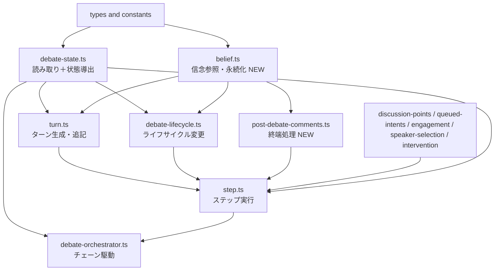
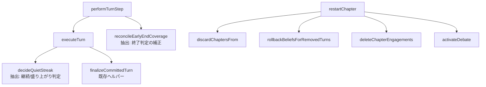

# Technical Design: debate-orchestration-module-restructure

## Overview

本設計は、討論パイプラインのオーケストレーション層（`functions/src/pipeline/debate/`）における**挙動保存リファクタリング**を定義する。`turn.ts`（451行）に同居する異質な責務を退避し、永続データの「読み取り」と「変更」をファイル境界で分離し、複数責務を抱えるメソッド（`performTurnStep`・`executeTurn`・`restartChapter`）を意味単位の関数へ分割する。

**Purpose**: 各層を独立して読み書きできる構造にし、ファイル肥大化による認知負荷を下げる。**Users**: 討論パイプラインを保守する開発者。**Impact**: 関数の物理配置とファイル間 import 経路が変わるが、外部から観測可能な振る舞い（生成・追記・enqueue されるタスク・Firestore 書き込み・公開 API のシグネチャと戻り値）は一切変わらない。

### Goals
- `turn.ts` を「ターンの生成・冪等追記」の責務に限定する。
- 永続データの読み取り（`debate-state.ts`）と変更（`debate-lifecycle.ts`）を境界で分離する。
- 複数責務メソッドを純関数・ヘルパーへ分割する。
- 一方向依存を維持し、循環 import を生じさせない。

### Non-Goals
- アルゴリズム・判定規則・パフォーマンスの変更（`decideNextStep` 規則、frontier 競合解決、冪等性、カバレッジ再確認の発火条件・閾値、quietStreak 算出式は不変）。
- 公開 API のシグネチャ変更、Firestore ドキュメント構造の変更、型スキーマの変更。
- 既存テストのアサーション変更（import パスのみ更新可）。
- 機能追加・バグ修正（既存挙動は不具合を含めて保存）。

## Boundary Commitments

### This Spec Owns
- `functions/src/pipeline/debate/` 内の関数・ヘルパーの物理配置（どのファイルに置くか）。
- 新規モジュール `belief.ts`・`post-debate-comments.ts` の責務境界。
- `debate-state.ts`（読み取り＋状態導出層）・`debate-lifecycle.ts`（ライフサイクル変更層）の責務再定義。
- 層間 import 経路と依存方向の一方向性。

### Out of Boundary
- `decide-next-step` / frontier / 冪等追記等のアルゴリズム（`debate-orchestrator-step-split` 等で確立済み、不変）。
- `engagement.ts`・`intervention.ts`・`speaker-selection.ts`・`queued-intents.ts`・`discussion-points.ts`・`turn-step-task.ts` の内部実装。
- 型の命名統一（別 spec `chapter-type-unification`）。

### Allowed Dependencies
- `firebase-admin/firestore`・`nanoid`（既存）。
- `agents/*`（persona-agent・facilitator-agent）、`types/*`、`constants/*`。
- 既存の per-turn ステップチェーン設計（`debate-orchestrator-step-split`）。

### Revalidation Triggers
- `advanceDebate` / `decideNextStep` / `DEFAULT_OPTIONS` の契約が変わる場合。
- enqueue されるタスク（stepKind・frontier・タスクキー）が変わる場合。
- 層間の依存方向が変わる場合。
- `api/debates.ts` から呼ばれる関数のシグネチャが変わる場合。

## Architecture

### Existing Architecture Analysis

直近の `debate-orchestrator-step-split` で「チェーン駆動（orchestrator）／ステップ実行（step）／論点状態（discussion-points）」の層分割は完了済み。本 spec はその続きとして、`turn.ts`・`debate-state.ts`・`debate-lifecycle.ts` 周辺に残る責務混在を解消する。既存の確立パターン（`queued-intents.ts`・`discussion-points.ts` の「状態遷移＋永続化を 1 モジュールに集約」）を新規 `belief.ts`・`post-debate-comments.ts` でも踏襲する。

### Architecture Pattern & Boundary Map



**Architecture Integration**:
- **Selected pattern**: レイヤード（読み取り/状態 → 変更/ドメイン → ステップ実行 → チェーン駆動）。左の層は右の層を import しない。
- **Domain/feature boundaries**: 読み取り＝`debate-state.ts`、ライフサイクル変更＝`debate-lifecycle.ts`、信念＝`belief.ts`、終端処理＝`post-debate-comments.ts`、ターン生成＝`turn.ts`。
- **Existing patterns preserved**: 一方向依存（orchestrator → step → …）、per-turn ステップチェーン、`queued-intents.ts` 型の集約モジュール構成。
- **New components rationale**: `belief.ts`（信念参照 `getLatestBelief` と永続化 `applyBeliefChange` を 1 箇所に）、`post-debate-comments.ts`（討論終端のコメント生成＋phaseStatus 遷移）。
- **Steering compliance**: 「置き場所と役割を一致させる」「過度な共通化をしない」（新規ファイルは責務が明確な箇所に限定）。

### Technology Stack

| Layer | Choice / Version | Role in Feature | Notes |
|-------|------------------|-----------------|-------|
| Backend / Services | TypeScript (Node.js, Firebase Functions) | 討論パイプライン | 既存スタックのまま。新規依存なし |
| Data / Storage | Cloud Firestore (firebase-admin) | ターン・章・ペルソナ永続化 | 書き込み内容・タイミング不変 |
| Testing | Vitest | 回帰検知（parity / idempotency / decide-next-step） | アサーション不変・import パスのみ更新 |

## File Structure Plan

### Directory Structure
```
functions/src/pipeline/debate/
├── debate-orchestrator.ts   # チェーン駆動（変更なし、import 経路のみ更新）
├── step.ts                  # ステップ実行（内部ヘルパー抽出）
├── turn.ts                  # ターン生成・追記に限定（責務を退避）
├── belief.ts                # NEW: getLatestBelief / applyBeliefChange
├── post-debate-comments.ts  # NEW: persistPostDebateComments
├── debate-state.ts          # 読み取り＋状態導出層（読み取り関数を集約）
├── debate-lifecycle.ts      # ライフサイクル変更層（restartChapter を分割）
└── (discussion-points / queued-intents / engagement / intervention / speaker-selection / turn-step-task / utils は不変)
```

### Modified Files
- `turn.ts` — `isDebateActive`・`getDebateTurnsByTopicId`・`updateSpeakerStats`・`applyBeliefChange`・`getLatestBelief`・`persistPostDebateComments` を退避。残すのは追記・生成系。`buildQueuedTrigger` を内部抽出。
- `debate-state.ts` — `getChaptersByTopicId`・`getDebateTurnsByTopicId`・`isDebateActive`・`updateSpeakerStats` を受け入れ。
- `debate-lifecycle.ts` — `getChaptersByTopicId` を `debate-state.ts` へ移動。`restartChapter` を private ヘルパーへ分割。
- `step.ts` — `performTurnStep` から early-end カバレッジ補正、`executeTurn` から quietStreak 判定を抽出。import 経路を更新（`applyBeliefChange`←belief、`updateSpeakerStats`←state、`persistPostDebateComments`←comments）。
- `debate-orchestrator.ts` — `isDebateActive`・`getDebateTurnsByTopicId`・`getChaptersByTopicId` の import 元を `debate-state.ts` に統一。
- 新規 `belief.ts`・`post-debate-comments.ts`。
- テスト（`turn.test.ts` 他）— 必要に応じ import パスのみ更新。

> 各ファイルは単一責務。依存方向（types → state/belief → lifecycle/turn → domain/comments → step → orchestrator）が許容される import を規定する。

## System Flows

構造移動のため実行フローは不変。複数責務メソッド分離後の内部呼び出し関係のみ示す（外部観測は同一）。



- `reconcileEarlyEndCoverage`: 早期終了手前の論点カバレッジ再確認（LLM 判定 → `addressed` 更新 → quietStreak リセット）。呼び出し条件・閾値は不変、`performTurnStep` から関数として切り出すのみ。
- `decideQuietStreak`: engagements から `shouldContinue` を判定し次 quietStreak を返す純関数。算出式不変。
- `restartChapter` の各ヘルパー: 既存の処理順序（章リセット → コメント初期化 → 信念巻き戻し → engagement 削除 → activate）を保つ。

## Requirements Traceability

| Requirement | Summary | Components | Interfaces |
|-------------|---------|------------|------------|
| 1.1 | turn.ts に追記・生成系を残す | turn.ts | addTurn, generateFacilitatorTurn, generatePersonaTurn, generateChapterTransition, appendClosingTurn |
| 1.2 | isDebateActive 退避 | debate-state.ts | isDebateActive |
| 1.3 | getDebateTurnsByTopicId 退避 | debate-state.ts | getDebateTurnsByTopicId |
| 1.4 | applyBeliefChange 退避 | belief.ts | applyBeliefChange |
| 1.5 | persistPostDebateComments 退避 | post-debate-comments.ts | persistPostDebateComments |
| 1.6 | import 経路更新・ビルド成功 | 全対象 + step.ts, orchestrator | — |
| 2.1 | 読み取り・状態導出の集約 | debate-state.ts | getDebateState, loadChapterProgress, getChaptersByTopicId, getDebateTurnsByTopicId, isDebateActive |
| 2.2 | ライフサイクル変更の集約 | debate-lifecycle.ts | activateDebate, markDebateStopped, updateChapterStatus, restartChapter |
| 2.3 | 章/ターン読み取りの同居 | debate-state.ts | getChaptersByTopicId, getDebateTurnsByTopicId |
| 2.4 | updateSpeakerStats を state へ | debate-state.ts | updateSpeakerStats |
| 3.1 | performTurnStep 分離 | step.ts | reconcileEarlyEndCoverage |
| 3.2 | executeTurn 分離 | step.ts | decideQuietStreak |
| 3.3 | restartChapter 分離 | debate-lifecycle.ts | discardChaptersFrom, rollbackBeliefsForRemovedTurns, deleteChapterEngagements |
| 3.4 | 同一書き込み・戻り値・順序 | 全対象 | — |
| 3.5 | 意味の伝わる関数名 | 全対象 | — |
| 4.1-4.4 | 挙動・契約保存 | 全対象 | 既存テストで担保 |
| 5.1-5.3 | 依存方向の一方向性 | 全対象 | Architecture 図参照 |

## Components and Interfaces

| Component | Layer | Intent | Req Coverage | Key Dependencies (P0/P1) | Contracts |
|-----------|-------|--------|--------------|--------------------------|-----------|
| belief.ts | 信念ドメイン | 最新信念参照と信念変化の永続化 | 1.4 | firestore (P0), persona types (P1) | Service, State |
| post-debate-comments.ts | 終端処理 | 事後コメント生成と phaseStatus 遷移 | 1.5 | persona-agent (P0), belief.ts (P1) | Batch, State |
| debate-state.ts | 読み取り/状態 | 永続データ読み取りと状態導出 | 1.2, 1.3, 2.1, 2.3, 2.4 | firestore (P0) | Service, State |
| debate-lifecycle.ts | ライフサイクル | 章/討論の状態変更 | 2.2, 3.3 | debate-state.ts (P1), firestore (P0) | Service |
| turn.ts | ターン生成 | ターン生成・冪等追記 | 1.1 | belief.ts (P1), debate-state.ts (P1), agents (P0) | Service |
| step.ts | ステップ実行 | perform*Step と内部分離 | 3.1, 3.2 | turn/belief/comments/state/lifecycle (P0) | Service |

> `debate-orchestrator.ts` は契約・責務不変（import 経路のみ更新）のため詳細ブロックを割愛。

### 信念ドメイン

#### belief.ts (NEW)

| Field | Detail |
|-------|--------|
| Intent | 最新信念の参照と信念変化の Firestore 永続化を 1 モジュールに集約 |
| Requirements | 1.4 |

**Responsibilities & Constraints**
- `getLatestBelief`: ペルソナの最新 version の belief を返す純関数（現 turn.ts と同一実装）。
- `applyBeliefChange`: 新 version の belief を `arrayUnion` で永続化し、引数 persona の in-memory `beliefs` も更新する（現 turn.ts と同一の書き込み・副作用）。
- 最下層（firestore・nanoid・types のみ依存）。`turn.ts`・`post-debate-comments.ts`・`debate-lifecycle.ts` から参照されるが逆参照しない。

**Dependencies**
- Inbound: turn.ts（`getLatestBelief`）, post-debate-comments.ts（`getLatestBelief`）, step.ts（`applyBeliefChange`）— Criticality P1
- Outbound: firebase-admin/firestore, nanoid — P0

**Contracts**: Service [x] / State [x]

##### Service Interface
```typescript
export const getLatestBelief: (persona: Persona) => { content: string; version: number };

export const applyBeliefChange: (input: {
  topicId: string;
  persona: Persona;
  turnId: string;
  beliefChange: BeliefChangeEvent;
}) => Promise<void>;
```
- Preconditions: persona は有効な id を持つ。
- Postconditions: `persona.beliefs` に新エントリ追加、Firestore も同一内容で更新。
- Invariants: version は現最新 +1。書き込みフィールド・条件は現実装と同一。

**Implementation Notes**
- Integration: `getLatestBelief` を export 化し、turn.ts の3利用箇所と comments を import に切り替える。
- Risks: なし（純粋な移動）。

### 終端処理

#### post-debate-comments.ts (NEW)

| Field | Detail |
|-------|--------|
| Intent | 全ペルソナの事後コメント生成・保存と phaseStatus の running→generated 遷移 |
| Requirements | 1.5 |

**Responsibilities & Constraints**
- `persistPostDebateComments`: 各ペルソナの最終信念を基にコメント生成 → `postDebateComments/0` に保存 → phaseStatus が running のときのみ generated へ遷移（冪等）。現 turn.ts と同一手順。
- **phaseStatus 遷移の所有**: `running→generated` は「討論ループ終了後の終端フェーズに入った」ことを表す遷移であり、コメント生成と不可分。討論ループのライフサイクル遷移（`activateDebate`=running / `markDebateStopped`=stopped、`debate-lifecycle.ts` 所有）とは関心が異なるため、本モジュールが所有する（lifecycle へは切り出さない）。

**Dependencies**
- Inbound: step.ts（`performCommentsStep`）— P0
- Outbound: persona-agent（`generatePostDebateComment`）— P0, belief.ts（`getLatestBelief`）— P1, firestore — P0

**Contracts**: Batch [x] / State [x]

##### Batch / Job Contract
- Trigger: `performCommentsStep`（comments ステップ）から呼び出し。
- Input: topicId, personas, state。
- Output: `topics/{topicId}/postDebateComments/0` への set、phaseStatus 遷移。
- Idempotency: phaseStatus が generated 済みなら no-op（現実装と同一）。

**Implementation Notes**
- Integration: step.ts の import を turn.ts → post-debate-comments.ts へ変更。
- Risks: なし。

### 読み取り/状態層

#### debate-state.ts (responsibility expanded)

| Field | Detail |
|-------|--------|
| Intent | 永続データの読み取りと DebateState の導出・in-memory 更新（Firestore 書き込みを持たない層） |
| Requirements | 1.2, 1.3, 2.1, 2.3, 2.4 |

**Responsibilities & Constraints**
- 既存: `getDebateState`（状態導出）, `loadChapterProgress`（章進捗読み取り）。
- 受け入れ: `getChaptersByTopicId`（章読み取り）, `getDebateTurnsByTopicId`（全ターン読み取り）, `isDebateActive`（討論稼働判定）, `updateSpeakerStats`（in-memory 状態変更）。
- 制約: Firestore 書き込みを行わない（`updateSpeakerStats` は in-memory のみ）。

**Dependencies**
- Inbound: debate-orchestrator.ts, turn.ts（`isDebateActive`）, debate-lifecycle.ts（`getChaptersByTopicId`）, step.ts（`updateSpeakerStats`）
- Outbound: firebase-admin/firestore, types, constants — P0

**Contracts**: Service [x] / State [x]

##### Service Interface
```typescript
export const getChaptersByTopicId: (topicId: string) => Promise<ChapterEntry[]>;
export const getDebateTurnsByTopicId: (topicId: string) => Promise<DebateTurn[]>;
export const isDebateActive: (topicId: string) => Promise<boolean>;
export const updateSpeakerStats: (input: { state: DebateState; personas: Persona[]; personaId: string }) => void;
// 既存: getDebateState, loadChapterProgress（シグネチャ不変）
```
- Invariants: 各関数の入出力は現実装と同一。

**Implementation Notes**
- Integration: `getChaptersByTopicId` の移動に伴い、orchestrator と lifecycle の import 元を更新。
- Risks: 循環 import なし（turn.ts/lifecycle.ts → debate-state.ts は一方向）。

### ライフサイクル層

#### debate-lifecycle.ts (restartChapter split)

| Field | Detail |
|-------|--------|
| Intent | 章/討論ライフサイクルの状態変更 | 
| Requirements | 2.2, 3.3 |

**Responsibilities & Constraints**
- 保持: `updateChapterStatus`, `activateDebate`, `markDebateStopped`, `restartChapter`（公開シグネチャ不変）。
- `restartChapter` を private ヘルパーへ分割: `discardChaptersFrom`（対象章の turns/status/進捗リセット）, `rollbackBeliefsForRemovedTurns`（削除ターン由来の belief 除去）, `deleteChapterEngagements`（engagement サブコレクション削除）。処理順序・Firestore 書き込みは現実装と同一。
- **belief 巻き戻しの所有**: `rollbackBeliefsForRemovedTurns` は「破棄するターン集合に紐づく belief をまとめて消す」restart ライフサイクル固有のバルク操作であり、`belief.ts` の `applyBeliefChange`（単一の信念追記）とは性質が異なる。restart ライフサイクルの一部として `debate-lifecycle.ts` が所有する（belief.ts へは集約しない）。
- `getChaptersByTopicId` は `debate-state.ts` から import。

**Dependencies**
- Inbound: api/debates.ts, step.ts（`updateChapterStatus`）
- Outbound: debate-state.ts（`getChaptersByTopicId`）— P1, firestore — P0

**Contracts**: Service [x]

**Implementation Notes**
- Integration: `restartChapter` の戻り値（新 runId）と副作用は不変。
- Risks: 分割で書き込み順序が変わらないこと（テスト `debate-lifecycle.test.ts` で担保）。

### ステップ実行層

#### step.ts (internal extraction)

| Field | Detail |
|-------|--------|
| Intent | 各 stepKind の実行と、複数責務メソッドの内部分離 |
| Requirements | 3.1, 3.2 |

**Responsibilities & Constraints**
- `performTurnStep` から `reconcileEarlyEndCoverage` を抽出: 早期終了手前の論点カバレッジ再確認（発火条件・閾値・LLM 判定・`addressed` 更新・quietStreak リセット書き込み）を関数化。`performTurnStep` は実行結果算出に専念。
- `executeTurn` から `decideQuietStreak` を抽出: engagements から `shouldContinue` を判定し次 quietStreak を返す純関数。
- import 更新: `applyBeliefChange`←belief.ts, `updateSpeakerStats`←debate-state.ts, `persistPostDebateComments`←post-debate-comments.ts。

**Dependencies**
- Inbound: debate-orchestrator.ts（`perform*Step`）— P0
- Outbound: turn.ts, belief.ts, post-debate-comments.ts, debate-state.ts, debate-lifecycle.ts, discussion-points.ts, queued-intents.ts, engagement.ts, intervention.ts, speaker-selection.ts — P0/P1

**Contracts**: Service [x]

**Implementation Notes**
- Integration: 抽出後も `performTurnStep`/`executeTurn` の戻り値・Firestore 書き込み・呼び出し順序は不変。
- Validation: `debate-parity` / `debate-step-idempotency` テストがアサーション不変で通過。
- Risks: カバレッジ補正の発火条件をリファクタで変えないこと。

### ターン生成層

#### turn.ts (slimmed)

| Field | Detail |
|-------|--------|
| Intent | ターンの生成・冪等追記に限定 |
| Requirements | 1.1 |

**Responsibilities & Constraints**
- 保持: `addTurn`, `buildTurnRecord`, `generateFacilitatorTurn`, `generatePersonaTurn`, `generateChapterTransition`, `appendClosingTurn`。
- 退避: `isDebateActive`/`getDebateTurnsByTopicId`/`updateSpeakerStats`→state, `getLatestBelief`/`applyBeliefChange`→belief, `persistPostDebateComments`→comments。
- `generatePersonaTurn` 内のキュー由来トリガ整形を `buildQueuedTrigger` として内部抽出（契約不変）。
- import: `isDebateActive`←debate-state.ts, `getLatestBelief`←belief.ts。

**Dependencies**
- Inbound: step.ts, debate-orchestrator.ts（生成系）
- Outbound: persona-agent, facilitator-agent, belief.ts, debate-state.ts, utils — P0/P1

**Contracts**: Service [x]

**Implementation Notes**
- Integration: 退避関数を import する側（step.ts・orchestrator）の経路更新が必要。
- Risks: `generatePersonaTurn`/`addTurn` のシグネチャ・副作用不変（`turn.test.ts` で担保）。

## Error Handling

本リファクタリングはエラー処理方針を変更しない。各関数の例外送出条件（`pipelineErrorMessage` による throw、`isDebateActive` 偽時の null/false 返却、追記 rejected 時のハンドリング）は現実装をそのまま保持する。

## Testing Strategy

### Unit / Module Tests（既存、アサーション不変・import パスのみ更新）
- `turn.test.ts`: `generatePersonaTurn`・`addTurn` の冪等追記・runId ミスマッチ挙動。
- `debate-state.test.ts`: `loadChapterProgress`（移動した読み取り関数の追加検証は任意）。
- `debate-lifecycle.test.ts`: `restartChapter` の分割後も同一の Firestore 書き込み・新 runId 返却。
- `decide-next-step.test.ts`: `decideNextStep`（orchestrator、不変）。

### Integration / Regression Tests
- `debate-parity.test.ts`: `advanceDebate` の生成・追記・enqueue が分割前と同一であること（R4 の主担保）。
- `debate-step-idempotency.test.ts`: 再入・冪等性が維持されること。

### 検証ゲート
- `tsc` ビルド成功（循環 import・型エラーなし、R1.6/R5）。
- 上記テストがアサーション変更なしで全通過（R4）。

## Open Questions / Risks
- `reconcileEarlyEndCoverage` 抽出時に、カバレッジ補正の発火条件（`EARLY_END_PROGRESS_RATIO`・`QUIET_STREAK_LIMIT` 判定）を変えないこと。実装時に `performTurnStep` の現分岐を 1:1 で関数へ移すこと。
- belief 書き込みの所有は 2 系統に分ける（決定済み）: 単一の信念追記 `applyBeliefChange` は `belief.ts`、restart 時のバルク巻き戻し `rollbackBeliefsForRemovedTurns` は restart ライフサイクルの一部として `debate-lifecycle.ts`。両者は性質が異なるため意図的に分離する。
- `post-debate-comments.ts` の phaseStatus 遷移は終端フェーズの所有物（決定済み、上記コンポーネント参照）。討論ループのライフサイクル遷移とは分離する。
