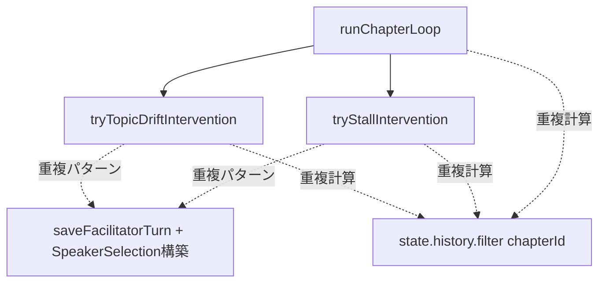
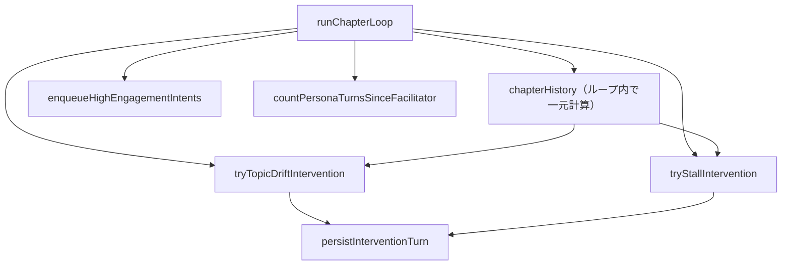

# Design Document

## Overview

`debate-orchestrator.ts` の内部構造を整理し、重複コードの排除と可読性向上を実現する。外部 API（`executeChapterTask`）の入出力・副作用（Firestore 書き込みの順序と内容）は変えない。Firestoreと状態更新の結合は現状を維持する。

**Purpose**: 介入関数の重複排除と `runChapterLoop` の自己文書化により、コードの保守性を高める。  
**Users**: このファイルを読み書きする開発者。  
**Impact**: 1つの新規プライベート関数の導入、2つの関数シグネチャ変更、`runChapterLoop` の構造改善。

### Goals
- `tryStallIntervention` / `tryTopicDriftIntervention` の重複パターンを共通化する
- `chapterHistory` フィルタを `runChapterLoop` で一元計算してパラメータ渡しにする
- `sessionId` という冗長な別名を除去し `topicId` に一本化する
- `runChapterLoop` が番号付きコメントなしで読める

### Non-Goals
- `generatePersonaTurn` の分割（FirestoreとState更新の結合は維持）
- `evaluateEngagement` の分割
- 外部モジュールの変更
- 振る舞いの変更

## Boundary Commitments

### This Spec Owns
- `debate-orchestrator.ts` 内のプライベート関数の構造
- `executeChapterTask` のコントラクト（維持）

### Out of Boundary
- 外部モジュールの型・インタフェース
- Firestore スキーマ
- テストファイル

### Allowed Dependencies
- 既存のすべてのインポートはそのまま維持する

### Revalidation Triggers
- `SpeakerSelection` 型の変更
- `saveFacilitatorTurn` のシグネチャ変更
- `DebateState` / `Chapter` 型の変更

## Architecture

### Existing Architecture Analysis

ファイルはトップダウン原則に従い `executeChapterTask` を先頭に、Firestore ヘルパー群を末尾に配置している。この配置は維持する。

現在の問題箇所：



### Architecture Pattern & Boundary Map

リファクタ後の構造：



**Key Decisions**:
- `persistInterventionTurn` が `saveFacilitatorTurn` + `SpeakerSelection` 構築を一元化する。FirestoreとState更新（`state.history` / `state.pairConversationTurns`）は `saveFacilitatorTurn` 内に留まる
- `chapterHistory` は `runChapterLoop` のループ先頭で計算し、介入関数2つにパラメータとして渡す。`generatePersonaTurn` は引数が多いため対象外
- `countPersonaTurnsSinceFacilitator` と `enqueueHighEngagementIntents` はロジックを関数名で表現し、ステップコメントへの依存を解消する

### Technology Stack

| Layer | Choice | Role |
|-------|--------|------|
| Backend | TypeScript strict mode | 型安全な関数シグネチャ |
| Runtime | Node.js 24 / Firebase Functions v2 | 変更なし |

## File Structure Plan

### Modified Files
- `functions/src/pipeline/debate/debate-orchestrator.ts` — 内部関数の再構成

### 変更内容サマリ

| 変更 | 種別 | 要件 |
|------|------|------|
| `persistInterventionTurn` | 新規プライベート関数 | 1 |
| `tryStallIntervention` | シグネチャ変更（`chapterHistory` パラメータ追加） | 1, 2 |
| `tryTopicDriftIntervention` | シグネチャ変更（`chapterHistory` パラメータ追加） | 1, 2 |
| `sessionId` → `topicId` への一本化 | ファイル全体のリネーム | 3 |
| `runChapterLoop` | 内部構造改善（一元計算・名前付き関数） | 2, 4 |
| `enqueueHighEngagementIntents` | 新規プライベート関数（step 6 抽出） | 4 |
| `countPersonaTurnsSinceFacilitator` | 新規プライベート関数（step 3 抽出） | 4 |

### トップダウン配置順（変更後）

```
executeChapterTask
loadSessionContext
runChapterLoop
  ← countPersonaTurnsSinceFacilitator（ループ内ヘルパー、直前に配置）
  ← enqueueHighEngagementIntents（ループ内ヘルパー、直前に配置）
evaluateEngagement
tryStallIntervention
tryTopicDriftIntervention
  ← persistInterventionTurn（両介入関数の直前に配置）
resolveSpeechParams
generatePersonaTurn
generateUnansweredReply
saveFacilitatorTurn
generateChapterTransition
finalizeDebate
---- Firestore helpers ----
```

## Requirements Traceability

| 要件 | 概要 | 関連コンポーネント |
|------|------|-----------------|
| 1.1 | save+decide 共通化 | `persistInterventionTurn`（新規） |
| 1.2 | ヘルパーで保存+返却 | `tryStallIntervention` / `tryTopicDriftIntervention`（変更） |
| 1.3 | `saveFacilitatorTurn` + 返却重複排除 | `persistInterventionTurn` |
| 2.1 | `chapterHistory` をループ内で計算してパラメータ渡し | `runChapterLoop`（変更） |
| 2.2 | 介入関数内の再計算を除去 | `tryStallIntervention` / `tryTopicDriftIntervention`（変更） |
| 3.1 | `const sessionId = topicId` 除去 | ファイル全体 |
| 3.2 | `sessionId` / `topicId` 二重引数の除去 | 全関数シグネチャ |
| 3.3 | Firestoreヘルパーの `sessionId` → `topicId` リネーム | Firestoreヘルパー群 |
| 4.1 | クールダウン計算を名前付き関数に | `countPersonaTurnsSinceFacilitator`（新規） |
| 4.2 | キューエンキューを名前付き関数に | `enqueueHighEngagementIntents`（新規） |
| 4.3 | 番号コメント不要な構造に | `runChapterLoop`（内部構造改善） |

## Components and Interfaces

### コンポーネント一覧

| コンポーネント | 種別 | 責任 | 要件 |
|---------------|------|------|------|
| `persistInterventionTurn` | 新規 | 介入ターン保存 + SpeakerSelection 返却 | 1 |
| `tryStallIntervention` | 変更 | B介入評価（`chapterHistory` 受け取り） | 1, 2 |
| `tryTopicDriftIntervention` | 変更 | A介入評価（`chapterHistory` 受け取り） | 1, 2 |
| `sessionId` → `topicId` 一本化 | リネーム | 冗長な別名の除去（全関数・Firestoreヘルパー） | 3 |
| `countPersonaTurnsSinceFacilitator` | 新規 | ファシリテーター以降のペルソナターン数（純粋関数） | 4 |
| `enqueueHighEngagementIntents` | 新規 | 高意欲キュー追加 + Firestore write-through | 4 |
| `runChapterLoop` | 変更 | `chapterHistory` 一元計算、名前付きヘルパー活用 | 2, 4 |

### 新規: `persistInterventionTurn`

| Field | Detail |
|-------|--------|
| Intent | ファシリテーター介入ターンを保存し、ターゲットがあれば `SpeakerSelection` を返す |
| Requirements | 1.1, 1.2, 1.3 |

**Responsibilities**
- `saveFacilitatorTurn` を呼び出す（Firestoreと`state.history`更新は`saveFacilitatorTurn`内）
- `targetPersonaId` が存在する場合に `{ personaId, reason: 'targeted_by_facilitator' }` を返す

**Service Interface**

```typescript
const persistInterventionTurn: (
  topicId: string,
  state: DebateState,
  content: string,
  targetPersonaId: string | undefined,
  chapterId: string
) => Promise<SpeakerSelection | undefined>
```

- Postconditions: `saveFacilitatorTurn` が完了している
- セマンティクス: `targetPersonaId` が `undefined` でも保存する（対象なし介入として正常動作）

**Implementation Notes**
- `tryTopicDriftIntervention` は `validPersonaId` が `undefined` のとき、この関数を呼ぶ前に早期 return する（保存しない）
- `tryStallIntervention` は `validPersonaId` の結果にかかわらずこの関数を呼ぶ（`undefined` でも保存）

### 変更: `tryStallIntervention` / `tryTopicDriftIntervention`

**シグネチャ変更**:

```typescript
// before
const tryStallIntervention: (
  topicId: string,
  personas: Persona[],
  chapter: Chapter,
  state: DebateState,
  assessments: Engagement[]
) => Promise<SpeakerSelection | undefined>

// after
const tryStallIntervention: (
  topicId: string,
  personas: Persona[],
  chapterHistory: readonly DebateTurn[],
  chapter: Chapter,
  state: DebateState,
  assessments: Engagement[]
) => Promise<SpeakerSelection | undefined>
```

```typescript
// before
const tryTopicDriftIntervention: (
  topicId: string,
  personas: Persona[],
  chapter: Chapter,
  state: DebateState
) => Promise<SpeakerSelection | undefined>

// after
const tryTopicDriftIntervention: (
  topicId: string,
  personas: Persona[],
  chapterHistory: readonly DebateTurn[],
  chapter: Chapter,
  state: DebateState
) => Promise<SpeakerSelection | undefined>
```

- 内部の `state.history.filter(t => t.chapterId === chapter.id)` を `chapterHistory` パラメータで置き換える

### 新規: `countPersonaTurnsSinceFacilitator`

| Field | Detail |
|-------|--------|
| Intent | 直近のファシリテーターターン以降のペルソナターン数を返す（クールダウン判定用） |
| Requirements | 4.1 |

**Service Interface**

```typescript
const countPersonaTurnsSinceFacilitator: (
  history: readonly DebateTurn[]
) => number
```

- 副作用なし（純粋関数）
- ファシリテーターターンが存在しない場合は全履歴を対象にカウントする

### 新規: `enqueueHighEngagementIntents`

| Field | Detail |
|-------|--------|
| Intent | 高意欲かつ非選択ペルソナのインテントを追加し Firestore に write-through する |
| Requirements | 4.2 |

**Service Interface**

```typescript
const enqueueHighEngagementIntents: (
  topicId: string,
  state: DebateState,
  assessments: readonly Engagement[],
  decision: SpeakerSelection,
  triggerTurnIndex: number
) => Promise<void>
```

- `isHighEngagement(assessment)` かつ `assessment.personaId !== decision.personaId` のエントリを `state.pendingIntents` に追加し、`setPendingIntents` で write-through する

### `runChapterLoop` の内部構造変更

ループ内の変更点（シグネチャは変わらない）：

1. ループ先頭で `chapterHistory` を一元計算し、`tryStallIntervention` / `tryTopicDriftIntervention` に渡す
2. step 3 を `countPersonaTurnsSinceFacilitator(state.history)` で置き換える
3. step 6 を `enqueueHighEngagementIntents(...)` 呼び出しで置き換える
4. 番号付きコメントを削除し、必要に応じて簡潔な説明コメントに置き換える

## Error Handling

変更なし。既存のエラー伝播パターン（throw）を維持する。

## Testing Strategy

- **Unit Tests（新規）**:
  - `countPersonaTurnsSinceFacilitator`: ファシリテーターなし・末尾・複数の各ケース
  - `persistInterventionTurn`: `targetPersonaId` あり/なしで戻り値と `saveFacilitatorTurn` 呼び出しを検証
  - `enqueueHighEngagementIntents`: 高意欲ペルソナのキュー追加と write-through を検証
- **Regression**: 既存の `debate-orchestrator.test.ts` が引き続き通過することを確認
