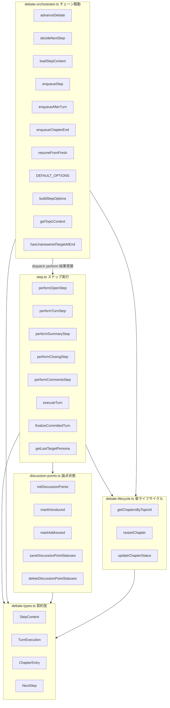
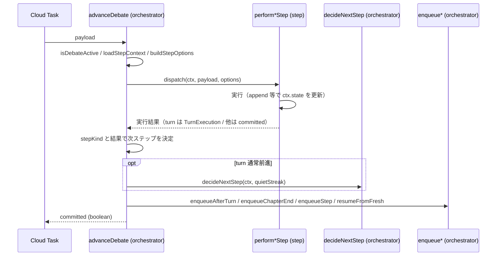

# Technical Design: debate-orchestrator-step-split

## Overview

**Purpose**: 肥大化した `functions/src/pipeline/debate/step.ts`（701 行、旧 `debate-orchestrator.ts`）に同居する複数の責務を、層ごとに分離する挙動保存リファクタリング。

**Users**: 討論パイプラインを保守する開発者。ステップ実行・チェーン駆動・論点状態・章永続化が混在した単一巨大ファイルを読み解く負荷を下げる。

**Impact**: 各 step 処理（`perform*Step`）から「次ステップの決定・enqueue」を剥がし、handler は自分のステップの「実行結果」だけを返す。次に何をするかの決定（`decideNextStep` 呼び出しと enqueue）は `advanceDebate`（orchestrator）が、dispatch した stepKind と実行結果から行う。これにより `advanceDebate`・`decideNextStep` を `debate-orchestrator.ts` に置いたまま、ファイル間依存が一方向（`debate.types.ts` 最下層 → `debate-lifecycle.ts`/`discussion-points.ts` → `debate-orchestrator.ts` → `step.ts`）になる。外部から観測可能な挙動・公開 API のシグネチャは不変。

### Goals
- `perform*Step` を「実行して結果を返す」形にし、次ステップ決定・enqueue は orchestrator が持つ（実行と決定の分離）。
- 論点（discussionPoint）状態の遷移＋永続化を新規 `discussion-points.ts` に集約する（`queued-intents.ts` と同型）。
- `executeTurn` の重複後処理を共通ヘルパーへ括り出す。
- ファイル間を一方向依存に保ち、循環 import（型 import 含む）を排除する。
- 既存テスト 3 種をアサーション無変更で通過させ、挙動等価を保証する。

### Non-Goals
- アルゴリズム・判定規則・パフォーマンスの変更。
- 「終了判定の補正」「継続/盛り上がり判定（quietStreak）」の集約、`performOpenStep` の初期化/生成分離（後続スペック `debate-step-concern-separation`）。
- 公開 API のシグネチャ・戻り値の変更。
- `ChapterEntry` と既存 `ChapterForFirestore` の型統一（別スペック `chapter-type-unification`）。

## Boundary Commitments

### This Spec Owns
- `step.ts` 内シンボルの最終配置先の決定と再配置。
- `perform*Step` を「実行結果を返す」形へ変更し、次ステップ決定・enqueue を `advanceDebate` に集約。
- 論点状態の `discussion-points.ts` への集約、`executeTurn` 後処理の共通化。
- 契約型（`StepContext`/`TurnExecution`/`ChapterEntry`）の `debate.types.ts` への集約。
- 移動に伴う各ファイル間および利用側（`api/debates.ts`・該当テスト）の import 経路更新。

### Out of Boundary
- 移動・分離する関数の判定規則・生成ロジック・挙動。
- `debate-lifecycle.ts` の既存関数、`turn.ts`・`engagement.ts`・`debate-state.ts`・`turn-step-task.ts` の内部。
- early-end 補正の発火条件・quietStreak 評価ロジック（後続スペック）。
- `ChapterEntry`/`ChapterForFirestore` の統一・スキーマ変更。
- テストの検証ロジック（import パスのみ更新可）。

### Allowed Dependencies
- `debate.types.ts`: 他 pipeline モジュールに依存しないリーフ（型のみ）。
- `debate-lifecycle.ts` / `discussion-points.ts`: `firebase-admin/firestore`・`debate.types.ts`・constants。互いに、また上位層に依存しない。
- `debate-orchestrator.ts`: `debate-lifecycle.ts`・`debate-state.ts`・`turn-step-task.ts`・`turn.ts`・`queued-intents.ts`・`debate.types.ts`・`step.ts`（dispatch）。
- `step.ts`: `debate-lifecycle.ts`・`discussion-points.ts`・`turn.ts`・`engagement.ts`・`intervention.ts`・`speaker-selection.ts`・`queued-intents.ts`・agents・`debate.types.ts`。**`debate-orchestrator.ts` には依存しない。**

### Revalidation Triggers
- `advanceDebate` / `decideNextStep` / `DEFAULT_OPTIONS` の定義ファイルまたはシグネチャ変更。
- `TurnExecution`（handler→orchestrator の実行結果契約）の形変更。
- ファイル間依存方向の変更（一方向が崩れる場合）。
- `discussion-points.ts` / `debate-lifecycle.ts` の公開シンボル名変更。

## Architecture

### Existing Architecture Analysis
- `step.ts` 1 ファイルに、論点永続化・状態再構築・次ステップ判定/投入・各 stepKind 処理・1 ターン実行が同居。
- 循環の根本原因は `perform*Step` が「実行」と「次ステップ決定・enqueue」を兼ねること。役割で素朴に 2 分割すると `advanceDebate(orch) → perform*(step) → enqueue*(orch)` で循環する。
- `debate-lifecycle.ts` は章ドキュメント（`status`・`turns`・`discussionPointStatuses`・`quietStreak`）の永続化を担う。`queued-intents.ts` は「キュー状態の遷移＋永続化」を 1 モジュールに集約する既存パターン。
- `decideNextStep` は純関数で、戻り値 `NextStep` は既に `debate.types.ts` に定義済み（[debate.types.ts:163](functions/src/types/debate.types.ts#L163)）。
- per-turn ステップチェーン（冪等・再入・frontier 競合解決）は維持必須。

### 設計判断: 実行と次ステップ決定の分離（採用案）

handler は enqueue も `decideNextStep` も呼ばず、自分のステップの「実行結果」だけを返す。`advanceDebate` は dispatch した stepKind を知っているので、結果に応じて既存の enqueue 系ヘルパーを呼ぶ。turn の通常前進時のみ `decideNextStep` を呼ぶ。

- handler→orchestrator の唯一の意味ある実行結果は turn（下記 `TurnExecution`）。open/summary/closing/comments は committed の真偽値のみ（次の行き先は stepKind だけで決まる）。
- 「次ステップ記述子」の新語彙（`StepOutcome` 共用体や `applyOutcome`）は導入しない。既存 `NextStep` と二重化させない。
- 検討した代替案: (a) handler が `NextStep` を返す＝handler が `decideNextStep` を呼ぶ → 「次の決定」が step 層に漏れるため却下。(b) handler が enqueue を引数注入（DI）→ コールバック引き回しで可読性低下のため却下。

### Architecture Pattern & Boundary Map



**Architecture Integration**:
- Selected pattern: 依存方向優先の層分割＋「実行と次ステップ決定の分離」。一方向 `types ← {lifecycle, discussion-points} ← orchestrator → step` を強制。
- Domain boundaries: types=契約型 / lifecycle=章ドキュメント永続化 / discussion-points=論点状態 / orchestrator=チェーン駆動（決定＋投入）/ step=1 ステップ実行。
- Existing patterns preserved: per-turn ステップチェーン、冪等・再入・frontier 競合解決、`db()` 遅延取得、`queued-intents.ts` 型のドメインモジュール、アロー関数スタイル。
- New components rationale: `debate-orchestrator.ts`（チェーン駆動の受け皿）、`discussion-points.ts`（論点状態の集約、既存パターン踏襲）、`TurnExecution`（turn の実行結果契約、最小）。中央ディスパッチャや next-step 記述子の新語彙は作らない（steering 準拠）。
- Steering compliance: kebab-case、`functions/src/pipeline/debate/` 配置、アロー関数、省略名回避、型は `*.types.ts`、テストは `functions/src/tests/`、re-export しない。

### Technology Stack

| Layer | Choice / Version | Role in Feature | Notes |
|-------|------------------|-----------------|-------|
| Backend / Services | TypeScript（Firebase Functions, Node ESM） | 分割対象モジュール群 | `.js` 拡張子付き ESM import を維持 |
| Data / Storage | Firestore（`firebase-admin/firestore`） | 章/論点永続化（lifecycle・discussion-points 層） | `db()`・`FieldValue` は各層に既存パターンで定義 |
| Messaging / Events | Cloud Tasks（`turn-step-task.ts` 経由） | 次ステップ投入（orchestrator 層、不変） | enqueue インターフェース・タスクキー不変 |

## File Structure Plan

### Directory Structure
```
functions/src/pipeline/debate/
├── debate-lifecycle.ts      # 章ライフサイクル（既存 + updateChapterStatus 受け入れ、ChapterEntry は types へ移動）
├── discussion-points.ts     # 新規: 論点状態の遷移 + 永続化（queued-intents.ts と同型）
├── debate-orchestrator.ts   # 新規: チェーン駆動（advanceDebate + 次ステップ決定 + enqueue*）
└── step.ts                  # ステップ実行（perform*(実行結果を返す) + executeTurn）
functions/src/types/
└── debate.types.ts          # 既存 + StepContext / TurnExecution / ChapterEntry
```

### Modified Files
- `step.ts` — orchestrator/discussion-points/lifecycle のシンボルを抜き出し、`perform*Step`（実行結果を返す形へ変更）・`executeTurn`（後処理を `finalizeCommittedTurn` に共通化）・`getLastTargetPersona` を保持。enqueue/`decideNextStep` 呼び出しを除去。冒頭コメントを「ステップ実行層」に更新。
- `debate-orchestrator.ts`（新規）— `advanceDebate`（dispatch＋stepKind 別の次ステップ決定＋enqueue）・`decideNextStep`・`loadStepContext`・`getTopicContext`・`hasUnansweredTargetAtEnd`・enqueue 系・`resumeFromFresh`・オプション。冒頭にチェーン駆動の責務コメント。
- `discussion-points.ts`（新規）— `initDiscussionPoints`・`markIntroduced`・`markAddressed`・`saveDiscussionPointStatuses`・`deleteDiscussionPointStatuses`。`db()`/`FieldValue` を当ファイルに定義。
- `debate-lifecycle.ts` — `updateChapterStatus` を追加。`ChapterEntry` 定義を `debate.types.ts` へ移し、当ファイルは型を import。
- `debate.types.ts` — `ChapterEntry`（移動）・`StepContext`・`TurnExecution`（新規）を追加。既存 `ChapterForFirestore` とは別物として併存（統一しない）。
- `api/debates.ts` — `advanceDebate` の import を `debate-orchestrator.js` へ更新。
- `tests/pipeline/debate/{decide-next-step,debate-parity,debate-step-idempotency}.test.ts` — `decideNextStep`/`advanceDebate` の import を `debate-orchestrator.js` へ更新（アサーションは不変）。

## System Flows

### advanceDebate の制御フロー（実行と決定の分離）



stepKind 別の次ステップ決定（`advanceDebate` 内、既存 enqueue ヘルパーを使用）:

| dispatch した stepKind | handler 結果 | advanceDebate の次アクション |
|---|---|---|
| open | committed | `enqueueStep(turn, frontier)` |
| turn | `completed` | 何もしない |
| turn | `conflict` | `resumeFromFresh(payload)` |
| turn | `advanced` かつ `payload.finalResponse` | `enqueueChapterEnd(ctx, payload)` |
| turn | `advanced`（通常） | `enqueueAfterTurn(ctx, payload, quietStreak)`（内部で `decideNextStep`） |
| summary | committed | 次章があれば `enqueueStep(open, chapterIndex+1)` |
| closing | committed | `enqueueStep(comments)` |
| comments | committed | 何もしない（終端） |

Key Decisions:
- handler は enqueue/`decideNextStep` を呼ばない。次ステップ決定は `advanceDebate` が dispatch 済み stepKind から行う。
- **frontier（位置）算出は分割前と同一タイミング**: handler が `ctx.state` を更新した「後」に、`advanceDebate` が既存 enqueue ヘルパー（`ctx.state` から `expectedTurnIndex` を算出）を呼ぶ。算出式・実行順は旧コードと不変（レビュー Issue 2 対応）。
- enqueue されるタスク（stepKind・frontier・タスクキー）は分割前と同一。

## Requirements Traceability

| Requirement | Summary | Components | Interfaces | Flows |
|-------------|---------|------------|------------|-------|
| 1.1 | 駆動・決定を orchestrator へ | debate-orchestrator.ts | advanceDebate/decideNextStep/enqueue* | Boundary Map |
| 1.2 | step 実行を step へ | step.ts | perform*/executeTurn | Boundary Map |
| 1.3 | updateChapterStatus を lifecycle へ | debate-lifecycle.ts | updateChapterStatus | — |
| 1.4 | 契約型を debate.types.ts へ | debate.types.ts | StepContext/TurnExecution/ChapterEntry | — |
| 1.5–1.6 | 単一層ヘルパー同居・コメント整合 | 全ファイル | — | — |
| 2.1–2.5 | 実行と決定の分離・一方向 | step.ts/orchestrator.ts | TurnExecution/advanceDebate | advanceDebate flow |
| 3.1–3.5 | 論点状態の集約 | discussion-points.ts | init/markIntroduced/markAddressed/save/delete | — |
| 4.1–4.3 | ターン後処理の共通化 | step.ts | finalizeCommittedTurn | — |
| 5.1–5.5 | 公開 API・挙動不変 | step.ts/orchestrator.ts | advanceDebate/decideNextStep/DEFAULT_OPTIONS | advanceDebate flow |
| 6.1–6.5 | import 更新・一方向・re-export 禁止 | 利用側全ファイル | named import | — |
| 7.1–7.3 | テスト通過・型エラーなし | tests/* | — | — |
| 8.1–8.4 | 命名・スタイル・非過剰抽象・テスト配置 | 全ファイル | — | — |

## Components and Interfaces

| Component | Domain/Layer | Intent | Req Coverage | Key Dependencies (P0/P1) | Contracts |
|-----------|--------------|--------|--------------|--------------------------|-----------|
| debate.types.ts | 契約型 | StepContext/TurnExecution/ChapterEntry を定義 | 1.4 | （なし、リーフ） | State |
| debate-lifecycle.ts | 章永続化 | 章ドキュメント status の永続化 | 1.3 | firestore (P0) | State |
| discussion-points.ts | 論点状態 | 論点遷移＋永続化 | 3.1–3.5 | firestore (P0), debate.types (P0) | State |
| debate-orchestrator.ts | チェーン駆動 | 状態再構築・次ステップ決定・enqueue | 1.1,2.2,5.2 | lifecycle (P0), turn-step-task (P0), step (P0 dispatch) | Service, Batch |
| step.ts | ステップ実行 | 1 ステップの実行と結果返却 | 1.2,2.1,4.1 | discussion-points (P0), lifecycle (P0), turn (P0) | Service |

> 本スペックは既存挙動を保存する。以下は移動/分離後も不変であることを固定する契約と、新設の最小契約（`TurnExecution`）。

### 契約型

#### TurnExecution（新規・turn の実行結果契約）

| Field | Detail |
|-------|--------|
| Intent | `performTurnStep` が「何が起きたか」を表現して返す（「次に何をするか」は含まない） |
| Requirements | 2.1, 2.2 |

```typescript
type TurnExecution =
  | { status: 'completed' }                       // 章は既に完了 → 何もしない
  | { status: 'conflict' }                        // 追記競合/停止 → resumeFromFresh
  | { status: 'advanced'; quietStreak: number };   // 実行コミット or frontier 前進 → 次へ
```
- Invariants: variant は上記に限定。`advanced` の分岐（freeze なら章末、通常なら `decideNextStep`）は `advanceDebate` が `payload.finalResponse` から判断する。
- Note: open/summary/closing/comments の handler は `Promise<boolean>`（committed）を返す。次の行き先は stepKind のみで定まるため実行結果に追加情報は不要。

### 論点状態層

#### discussion-points.ts

| Field | Detail |
|-------|--------|
| Intent | 論点（discussionPoint）状態の遷移と永続化を 1 モジュールに集約（`queued-intents.ts` と同型） |
| Requirements | 3.1, 3.2, 3.3, 3.4, 3.5 |

**Responsibilities & Constraints**
- 遷移（in-memory）: untouched 初期化・`introduced`・`addressed`。
- 永続化: `discussionPointStatuses` フィールドの保存/削除。
- 既存 `db()`/`FieldValue` パターンを当ファイルに持つ。上位層に依存しない。

**Dependencies**
- Inbound: `step.ts`（`perform*Step`/`executeTurn`） (P0)
- Outbound: `firebase-admin/firestore`、`debate.types.ts`（`DebateState`/`DiscussionPointState`/`Chapter`） (P0)

**Contracts**: State [x]

##### State Management（移動/新設後のシグネチャ）
```typescript
const initDiscussionPoints: (chapter: Chapter) => DiscussionPointState[]; // 全点 untouched
const markIntroduced: (state: DebateState, index: number | undefined) => void;
const markAddressed: (state: DebateState, point: string) => void;
const saveDiscussionPointStatuses: (topicId: string, chapterId: string, state: DebateState) => Promise<void>;
const deleteDiscussionPointStatuses: (topicId: string, chapterId: string) => Promise<void>;
```
- Preconditions: 対象章ドキュメントが存在する。`saveDiscussionPointStatuses` は `discussionPoints` 空なら no-op。
- Postconditions: `discussionPointStatuses` フィールドのみ更新/削除。遷移関数は `state.discussionPoints` のみ変更。
- Invariants: untouched→introduced→addressed の遷移規則は分割前と同一。
- Note: `markAddressed` は performTurnStep のカバレッジ再確認の状態更新に用いる（再確認の発火条件自体は本スペック対象外）。

### 章永続化層

#### debate-lifecycle.ts（受け入れ分）
| Field | Detail |
|-------|--------|
| Intent | 章ステータス永続化ヘルパーを既存ライフサイクル関数と同居させる | 
| Requirements | 1.3, 5.5 |

```typescript
const updateChapterStatus: (topicId: string, chapterId: string, status: ChapterEntry['status']) => Promise<void>;
```
- Postconditions: 章ドキュメントの `status` のみ更新。シグネチャ・本文不変。
- Note: `ChapterEntry` 定義を `debate.types.ts` へ移し、当ファイルは型を import（既存の `DebateTurn` import と整合）。既存 `ChapterForFirestore` とは別型として併存させ、本スペックでは統一しない（レビュー Issue 3 対応、統一は `chapter-type-unification`）。

### チェーン駆動層

#### debate-orchestrator.ts
| Field | Detail |
|-------|--------|
| Intent | 状態再構築・次ステップ決定・enqueue を担うチェーン駆動層 |
| Requirements | 1.1, 2.2, 5.2, 6.5 |

**Responsibilities & Constraints**
- `advanceDebate`：停止ゲート→`loadStepContext`→`buildStepOptions`→stepKind ディスパッチ→実行結果に応じた次ステップ決定・enqueue。公開シグネチャ不変。
- `decideNextStep`：純関数。判定規則不変。turn 通常前進時に `advanceDebate`（経由 `enqueueAfterTurn`）が呼ぶ。
- `enqueue*`／`resumeFromFresh`：決定的タスクキーで投入・再開。`ctx.state`（handler 更新後）から frontier を算出。
- `step.ts` を dispatch のために import する。逆向き（step→orchestrator）の参照は無い。

**Dependencies**
- Inbound: `api/debates.ts`（`advanceDebate`）、parity/idempotency/decide-next-step テスト (P0)
- Outbound: `step.ts`（`perform*Step`）・`debate-lifecycle.ts`・`turn-step-task.ts`・`debate-state.ts`・`turn.ts`・`queued-intents.ts`・`debate.types.ts` (P0)

**Contracts**: Service [x] / Batch [x]

```typescript
const advanceDebate: (payload: TurnStepPayload) => Promise<boolean>; // シグネチャ・挙動 不変
const decideNextStep: (args: {
  chapterTurns: DebateTurn[]; globalTurnCount: number; quietStreak: number;
  discussionPoints: DiscussionPointState[]; chapterIndex: number;
  options: DebateOptions; isLastChapter: boolean;
}) => NextStep;                                   // シグネチャ・規則 不変
const DEFAULT_OPTIONS: DebateOptions;             // 値 不変
```
- Preconditions: `isDebateActive` 偽なら即 false（停止ゲート、不変）。
- Invariants: dispatch→結果→enqueue の写像が分割前と同一のタスクを投入する。冪等・再入・frontier 競合解決 不変。

##### Batch / Job Contract
- Trigger: `api/debates.ts` の `onTaskDispatched`（Cloud Tasks）。
- Idempotency & recovery: 同一 frontier 二重起動は追記トランザクション/タスクキーで排他。turn の `conflict` → `resumeFromFresh`（挙動不変）。

**Implementation Notes**
- Integration: `decideNextStep`/`advanceDebate` は該当テストから import → テストの import を当ファイルへ更新。
- Risks: stepKind 別の次ステップ決定が分割前の handler 末尾の enqueue と一致すること（特に `advanced` の freeze 分岐＝chapterEnd、通常＝`enqueueAfterTurn`、open 後の firstTurn、summary 後の次章 open、closing 後の comments）。parity テストで担保。

### ステップ実行層

#### step.ts
| Field | Detail |
|-------|--------|
| Intent | dispatched された 1 ステップを実行し「実行結果」を返す層 |
| Requirements | 1.2, 2.1, 4.1, 5.1 |

**Responsibilities & Constraints**
- `perform*Step`：各ステップの生成・冪等追記を行い、実行結果（turn は `TurnExecution`、他は committed）を返す。enqueue/`decideNextStep`/`resumeFromFresh` を呼ばない。
- `executeTurn`：1 ターン生成。後処理を `finalizeCommittedTurn` に共通化。
- `getLastTargetPersona`：末尾ターンの指名取得（step 専用）。
- `debate-orchestrator.ts` を import しない。

**Dependencies**
- Inbound: `debate-orchestrator.ts`（`advanceDebate` が dispatch） (P0)
- Outbound: `discussion-points.ts`・`debate-lifecycle.ts`・`turn.ts`・`engagement.ts`・`intervention.ts`・`speaker-selection.ts`・`queued-intents.ts`・agents・`debate.types.ts` (P0)

**Contracts**: Service [x]

```typescript
const performTurnStep: (ctx: StepContext, payload: TurnStepPayload, options: DebateOptions) => Promise<TurnExecution>;
const performOpenStep: (ctx: StepContext, payload: TurnStepPayload) => Promise<boolean>;
// performSummaryStep / performClosingStep / performCommentsStep も Promise<boolean>
// private:
const finalizeCommittedTurn: (args: {
  topicId: string; chapterId: string; state: DebateState; personas: Persona[];
  reply: /* generatePersonaTurn の戻り */;
}) => Promise<void>; // キュー消化→発言統計→信念変化永続化（共通化）
```
- Preconditions: handler は受け取った `ctx`/`options` のみで実行し、次ステップを決めない。
- Invariants: 冪等・再入・frontier 競合解決 不変。`finalizeCommittedTurn` は freeze/通常両分岐から同一に呼ばれる。handler は `ctx.state` を破壊的に更新し、その更新後の状態を基に `advanceDebate` が enqueue する。

**Implementation Notes**
- Integration: discussion-points/lifecycle/generation から named import。`advanceDebate` から `ctx`・`payload`・`options` を受け取る。
- Risks: handler を「実行結果を返す」形へ書き換える際、分割前の各 enqueue 呼び出しと意味的に一致する結果を返すこと。move/分離以外の挙動変更を混入させない。

## Error Handling

### Error Strategy
エラー処理ロジックは変更しない。既存の例外伝播（`Topic not found`・`Chapters not found`・`pipelineErrorMessage`）は移動先で保持する。

### Error Categories and Responses
- System Errors: Firestore 失敗時の例外は移動後も同じ呼び出し階層から送出（不変）。
- Business Logic Errors: frontier 不一致・追記競合は turn の `TurnExecution`（`advanced`/`conflict`）経由で `advanceDebate` が従来どおり回復（不変）。

### Monitoring
追加の監視・ログは導入しない（挙動不変のため既存ログを維持）。

## Testing Strategy

### Unit Tests
- `decide-next-step.test.ts`：`decideNextStep` を `debate-orchestrator.js` から import し、判定規則が不変であることを確認。
- 型チェック（`tsc`／ビルド）：5 ファイル間の named import がすべて解決し、新規型エラー・型 import 循環が無いこと。

### Integration Tests
- `debate-parity.test.ts`：enqueue モックでチェーン全体を `advanceDebate` 駆動し、ターン列 snapshot が不変（[debate-parity.test.ts:158-160](functions/src/tests/pipeline/debate/debate-parity.test.ts#L158-L160)）。実行と決定の分離後も enqueue されるタスク・frontier・タスクキーが同一でなければ snapshot が壊れるため、等価性を強く担保。import パスのみ更新で通過。
- `debate-step-idempotency.test.ts`：各ステップの冪等性・再入が不変（import パスのみ更新で通過）。

### 検証コマンド
- `npm run build`（または `tsc --noEmit`）で型解決。
- `npm test`（vitest）で上記 3 テストを実行し全通過を確認。
