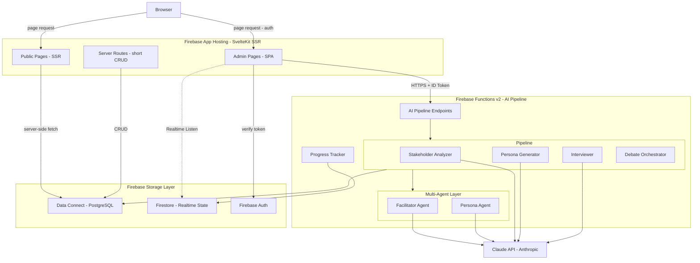
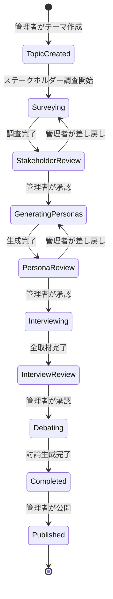
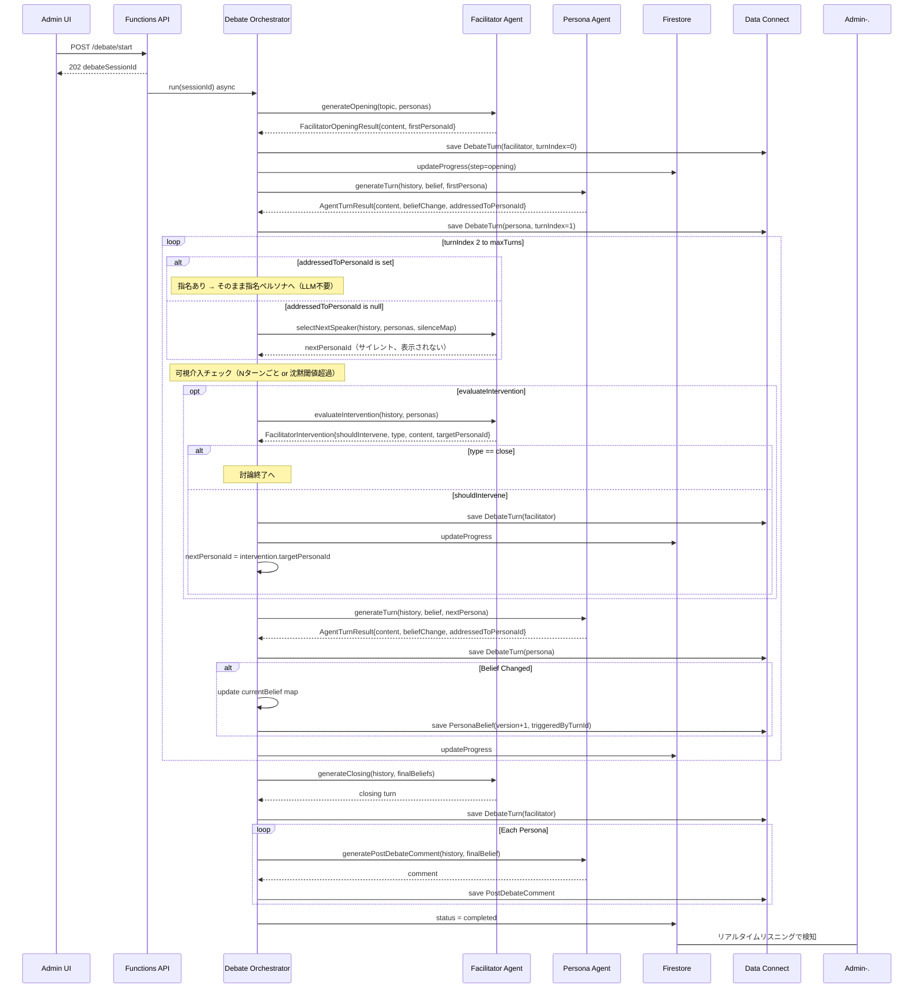
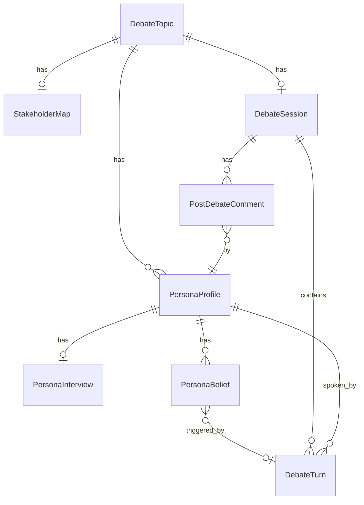

# Design Document: debate-platform

## Overview

logotope は管理者がテーマを設定すると、AIがステークホルダー調査→ペルソナ生成→事前取材→マルチエージェント討論の4フェーズを経て討論コンテンツを自動生成し、ウェブページとして公開するプラットフォームである。

**Purpose**: 声の大きい一部ではなく、多様な立場の意見を公平に可視化するコンテンツを自動生成する。

**Users**: 管理者（テーマ設定・各フェーズ承認・公開操作）と一般閲覧者（討論コンテンツ閲覧）の2ロールが対象。

**Impact**: 空のSvelteKitプロジェクトに対して、管理画面・公開討論閲覧画面（SSR）・Firebase Functions AIパイプライン・Firebase Data Connect スキーマをゼロから構築する。公開コンテンツページは Firebase App Hosting 上で SSR 配信し SEO に対応する。管理画面は Firebase Auth による認証ガード付き SPA として動作する。

### Goals
- テーマ設定から公開まで管理者が各フェーズを承認しながら進められる管理フロー
- ファシリテーター＋ペルソナが独立したAIエージェントとして会話するマルチエージェント討論生成
- 各ペルソナの信念変化を追跡し、討論ページで視覚的に可視化する

### Non-Goals
- 一般ユーザーのアカウント登録・コメント機能・SNS連携
- リアルタイム討論への人間の介入
- 多言語対応（日本語のみ）

---

## Boundary Commitments

### This Spec Owns
- Firebase Functions v2 AIパイプライン全体（ステークホルダー調査・ペルソナ生成・取材・討論オーケストレーション）
- Firebase Data Connect スキーマ定義（`dataconnect/schema/schema.gql` の完全置換）
- SvelteKit 管理画面ルート（`/admin/**`）
- SvelteKit 公開閲覧ルート（`/` および `/debate/[id]`）
- Firestore の進捗状態データ構造（`/debate_progress/{topicId}`）
- Firebase Functions の HTTP API エンドポイント定義

### Out of Boundary
- Firebase Auth の設定（`firebase.json` に既設定済み）
- `@14ch/svelte-ui` のコンポーネント実装（外部ライブラリとして依存）
- Firebase App Hosting の CI/CD パイプライン設定（`apphosting.yaml` で最小設定のみ）

### Allowed Dependencies
- `@14ch/svelte-ui` — フロントエンドUIコンポーネント（Svelte 5対応）
- Anthropic SDK — Claude API 呼び出し（Firebase Functions 内）
- `firebase-admin` — Firestore・Auth・Data Connect 操作（Functions 内、および SvelteKit `+page.server.ts` 内）
- Firebase Auth SDK — 管理画面クライアントサイドの認証状態管理
- Firebase Firestore SDK — 管理画面のリアルタイム進捗リスニング（クライアントサイド）
- Firebase Data Connect generated SDK — SSR サーバーサイドおよびクライアントサイドのデータ取得

### Revalidation Triggers
- Firebase Data Connect スキーマ変更（型・カラム名の変更は `+page.server.ts` の型定義に影響）
- Claude API のモデル変更（プロンプト設計の見直しが必要）
- Firebase Functions API エンドポイントのシグネチャ変更（フロントエンドの `lib/api/` の更新が必要）
- Firebase App Hosting のランタイム設定変更（`apphosting.yaml`）

---

## Architecture

### Architecture Pattern & Boundary Map



**Key Decisions**:
- 公開コンテンツページ（`/`・`/debate/[id]`）は `+page.server.ts` で SSR 配信し SEO に対応する
- 管理画面（`/admin/**`）は Firebase Auth で保護されたクライアントサイド SPA として動作する（SEO 不要）
- 短時間の読み取り API（討論一覧・討論詳細）は SvelteKit `+server.ts` に実装し Functions を経由しない
- 長時間 AI 処理（ステークホルダー調査・取材・討論生成）のみ Firebase Functions に委譲（60 分タイムアウト）
- 全 AI ロジックは Firebase Functions に隔離。フロントエンドは Claude API キーを保持しない
- 討論生成は非同期（Functions が即時 debateSessionId を返却しバックグラウンド実行）し、進捗は Firestore リアルタイムリスナーで管理者 UI に配信する

### Technology Stack

| Layer | Choice / Version | Role in Feature | Notes |
|-------|-----------------|-----------------|-------|
| Hosting | Firebase App Hosting | SvelteKit SSR ホスティング | `adapter-auto` を使用 |
| Frontend Framework | SvelteKit 2.x + adapter-auto | 公開ページSSR・管理画面SPA | 公開ページは `+page.server.ts`、管理画面はクライアントサイド |
| UI Components | @14ch/svelte-ui v0.0.42 | 全UIコンポーネントの基盤 | Svelte 5対応 |
| AI Pipeline Backend | Firebase Functions v2 (Node 24) | 長時間AI処理専用 | HTTP timeout 最大60分 |
| Short API | SvelteKit +server.ts | 討論一覧・詳細などの読み取り | Functions を経由しない |
| AI | Anthropic SDK + claude-sonnet-4-6 | 全AI生成処理 | ステアリングに従い最新モデルを使用 |
| Relational DB | Firebase Data Connect (PostgreSQL) | 永続化・公開データ | SSRサーバーサイドから直接アクセス可 |
| Realtime State | Firestore | 生成進捗のリアルタイム配信 | Admin SDK (server) + Client SDK (admin SPA) |
| Auth | Firebase Auth (email/password) | 管理者認証 | クライアントSDK + `+page.server.ts` でのAdmin SDK検証 |
| Package Manager | pnpm workspace | monorepo 管理 | |

---

## File Structure Plan

### Directory Structure

```
src/
├── routes/
│   ├── +layout.svelte              # グローバルレイアウト
│   ├── +page.server.ts             # SSR: 公開討論一覧をサーバーサイドで取得
│   ├── +page.svelte                # 公開トップ（討論一覧）
│   ├── debate/
│   │   └── [id]/
│   │       ├── +page.server.ts     # SSR: 討論詳細をサーバーサイドで取得
│   │       └── +page.svelte        # 討論閲覧ページ（OGP メタタグ含む）
│   ├── api/
│   │   ├── debates/
│   │   │   ├── +server.ts          # GET /api/debates（公開一覧）
│   │   │   └── [id]/
│   │   │       └── +server.ts      # GET /api/debates/:id（公開詳細）
│   │   └── admin/
│   │       └── [...path]/
│   │           └── +server.ts      # Admin API プロキシ → Firebase Functions
│   └── admin/
│       ├── +layout.svelte          # 管理者レイアウト（Firebase Auth ガード、クライアントサイド）
│       ├── +page.svelte            # 管理ダッシュボード（テーマ一覧）
│       ├── topics/
│       │   └── new/
│       │       └── +page.svelte    # テーマ作成フォーム
│       └── debate/
│           └── [id]/
│               └── +page.svelte    # 討論管理（フェーズ進行・承認）
├── lib/
│   ├── components/
│   │   ├── admin/
│   │   │   ├── TopicForm.svelte
│   │   │   ├── StakeholderReview.svelte
│   │   │   ├── PersonaReview.svelte
│   │   │   ├── InterviewReview.svelte
│   │   │   ├── DebateProgress.svelte
│   │   │   └── DebatePreview.svelte
│   │   └── public/
│   │       ├── DebateCard.svelte
│   │       ├── DebateViewer.svelte
│   │       ├── TurnDisplay.svelte
│   │       ├── BeliefEvolution.svelte
│   │       ├── PersonaFilter.svelte
│   │       └── PostDebateComments.svelte
│   ├── stores/
│   │   ├── auth.svelte.ts           # Firebase Auth 状態（runes）
│   │   └── progress.svelte.ts       # Firestore progress リスナー
│   ├── api/
│   │   ├── topics.ts                # Topics API クライアント
│   │   ├── debates.ts               # Debates API クライアント
│   │   └── client.ts                # 共通フェッチラッパー（Auth token付与）
│   └── types/
│       └── index.ts                 # フロントエンド共通型定義

functions/src/
├── index.ts                         # Functions エクスポート
├── api/
│   ├── topics.ts                    # /api/topics エンドポイント
│   ├── stakeholders.ts              # /api/topics/:id/stakeholders
│   ├── personas.ts                  # /api/topics/:id/personas
│   ├── interviews.ts                # /api/topics/:id/interviews
│   ├── debates.ts                   # /api/topics/:id/debate, /api/debates
│   └── middleware.ts                # Auth検証ミドルウェア
├── pipeline/
│   ├── stakeholder-analyzer.ts
│   ├── persona-generator.ts
│   ├── interviewer.ts
│   └── debate-orchestrator.ts
├── agents/
│   ├── facilitator-agent.ts
│   └── persona-agent.ts
├── db/
│   └── repository.ts                # Data Connect / Firestore アクセス層
└── types/
    └── index.ts                     # Functions共通型定義

dataconnect/
├── schema/
│   └── schema.gql                   # 完全置換（既存のサンプルを削除）
└── connector/
    ├── connector.yaml
    ├── queries.gql
    └── mutations.gql
```

### Modified Files
- `dataconnect/schema/schema.gql` — サンプルスキーマ（Movie/User/Review）を logotope スキーマに完全置換
- `functions/src/index.ts` — AI パイプライン用エンドポイントをエクスポートするよう更新
- `firebase.json` — `hosting` セクションを削除し Firebase App Hosting（`apphosting.yaml`）に移行
- `package.json` — `@sveltejs/adapter-static` を `@sveltejs/adapter-auto` に変更
- `svelte.config.js` — adapter を `adapter-auto` に更新

### New Config Files
- `apphosting.yaml` — Firebase App Hosting の最小設定（runConfig.cpu, memory, concurrency）

---

## System Flows

### 討論生成フロー全体（フェーズ管理）



### マルチエージェント討論オーケストレーション

討論は「ペルソナ主体の自由会話＋ファシリテーター要所介入」モデルを採用する。

ファシリテーターの役割は2つに分離する：

| 役割 | メソッド | 発言として表示 | 呼び出しタイミング |
|------|---------|-------------|----------------|
| **サイレントルーティング** | `selectNextSpeaker` | しない | `addressedToPersonaId` がない発言の直後に毎回 |
| **可視介入** | `evaluateIntervention` | する（topic_shift・invite・close） | 一定ターン数ごと、または停滞検出時 |

- **次話者決定ルール**:
  1. `addressedToPersonaId` が指定されている → そのペルソナが応答（LLM呼び出し不要）
  2. 指定がない → `selectNextSpeaker` を呼ぶ（LLM が「直前の発言内容・各ペルソナの立場・誰が最も反応したそうか」を判断して1名を選ぶ）
- **ファシリテーター可視介入条件**: 一定ターン数ごと（デフォルト: 5ターンごと）または特定ペルソナが長く沈黙している場合に `evaluateIntervention` を呼ぶ。介入タイプは `topic_shift`（新たな論点を投入）・`invite`（特定ペルソナを名指し）・`close`（討論終了）の3種



---

## Requirements Traceability

| Requirement | Summary | Components | Interfaces | Flows |
|-------------|---------|------------|------------|-------|
| 1.1–1.5 | テーマ管理 | TopicForm, TopicList, topics API | TopicRepository, createTopic | フェーズ管理ステートマシン |
| 2.1–2.7 | ステークホルダー調査 | StakeholderReview, stakeholders API | StakeholderAnalyzerService | フェーズ管理 |
| 3.1–3.7 | ペルソナ自動生成 | PersonaReview, personas API | PersonaGeneratorService | フェーズ管理 |
| 4.1–4.9 | 事前取材フェーズ | InterviewReview, interviews API | InterviewerService | フェーズ管理 |
| 5.1–5.5 | ファシリテーター機能 | — (Functions内部) | FacilitatorAgentService | 討論オーケストレーション |
| 6.1–6.15 | 討論生成（マルチエージェント） | DebateProgress, debates API | DebateOrchestratorService | 討論オーケストレーション |
| 7.1–7.9 | 討論コンテンツ公開・閲覧 | DebateViewer, DebateListing, PostDebateComments, BeliefEvolution | PublishService, debates API (public) | — |

---

## Components and Interfaces

### Summary Table

| Component | Layer | Intent | Req Coverage | Key Dependencies | Contracts |
|-----------|-------|--------|--------------|-----------------|-----------|
| StakeholderAnalyzerService | Functions/Pipeline | Claude API でステークホルダー調査を実行 | 2.1–2.3 | Claude API (P0) | Service |
| PersonaGeneratorService | Functions/Pipeline | ステークホルダーマップからペルソナを生成 | 3.1–3.3 | Claude API (P0) | Service |
| InterviewerService | Functions/Pipeline | 全ペルソナの事前取材を並行実行し信念ドキュメントを生成 | 4.1–4.5 | Claude API (P0) | Service |
| FacilitatorAgentService | Functions/Agents | ファシリテーターの発言を生成する独立エージェント | 5.1–5.5 | Claude API (P0) | Service |
| PersonaAgentService | Functions/Agents | ペルソナの発言・信念変化・討論後コメントを生成する独立エージェント | 6.1–6.8, 6.12–6.14 | Claude API (P0) | Service |
| DebateOrchestratorService | Functions/Pipeline | ターン制マルチエージェント討論ループを管理 | 6.1–6.15 | FacilitatorAgentService (P0), PersonaAgentService (P0), ProgressTrackerService (P0) | Service |
| ProgressTrackerService | Functions/Infra | Firestore へのリアルタイム進捗書き込み | 4.7, 6.9 | Firestore (P0) | Service |
| TopicRepository | Functions/DB | Data Connect への全データ永続化操作 | 1–7 全体 | Data Connect (P0) | Service |
| DebateProgress (Svelte) | Frontend/Admin | Firestore から進捗をリアルタイム表示 | 4.7, 6.9 | Firestore SDK (P0), @14ch/svelte-ui (P1) | State |
| DebateViewer (Svelte) | Frontend/Public | 討論コンテンツ・信念変化・コメントを表示 | 7.2–7.8 | @14ch/svelte-ui (P0) | State |
| BeliefEvolution (Svelte) | Frontend/Public | ペルソナの初期・最終信念と変化ポイントを表示 | 7.6 | @14ch/svelte-ui (P1) | State |

---

### Functions / Pipeline

#### StakeholderAnalyzerService

| Field | Detail |
|-------|--------|
| Intent | テーマタイトルを受け取り、Claude API でステークホルダーマップを生成する |
| Requirements | 2.1, 2.2, 2.3 |

**Responsibilities & Constraints**
- テーマに関連する全利害関係者（直接・間接）を網羅的に分析する
- 各立場に `minorityLevel`（マイノリティ度）を付与して出力に含める
- Anthropic SDK の structured output を使用して型安全な出力を得る

**Dependencies**
- External: Anthropic SDK — Claude API 呼び出し (P0)
- Outbound: TopicRepository — 結果の永続化 (P0)
- Outbound: ProgressTrackerService — ステータス更新 (P1)

**Contracts**: Service [x]

##### Service Interface
```typescript
interface StakeholderAnalyzerService {
  analyze(topicId: string, title: string): Promise<Result<Stakeholder[], PipelineError>>;
}
```
- Preconditions: `title` は1文字以上500文字以下
- Postconditions: 返却する `Stakeholder[]` は5件以上
- Invariants: エラー時は `Result.ok = false` を返す（例外を投げない）

---

#### PersonaGeneratorService

| Field | Detail |
|-------|--------|
| Intent | 承認済みステークホルダーリストから具体的なペルソナ属性を生成する |
| Requirements | 3.1, 3.2, 3.3 |

**Contracts**: Service [x]

##### Service Interface
```typescript
interface PersonaGeneratorService {
  generate(
    topicId: string,
    topicTitle: string,
    stakeholders: Stakeholder[]
  ): Promise<Result<PersonaAttributes[], PipelineError>>;
}
```
- Preconditions: `stakeholders` は1件以上
- Postconditions: `stakeholders` の各要素に対して1体のペルソナを返す

---

#### InterviewerService

| Field | Detail |
|-------|--------|
| Intent | 全ペルソナに対して並行で取材を実行し、初期信念ドキュメントを生成する |
| Requirements | 4.1, 4.2, 4.3, 4.4, 4.8, 4.9 |

**Responsibilities & Constraints**
- `Promise.allSettled` で並行実行し、一部失敗しても他に影響しない（4.9）
- 各取材の結果は `BeliefDocument`（Markdown）として保存する

**Contracts**: Service [x]

##### Service Interface
```typescript
interface InterviewerService {
  interviewAll(
    topicId: string,
    topicTitle: string,
    personas: PersonaAttributes[]
  ): Promise<Result<InterviewResult[], PipelineError>>;

  retryInterview(
    topicId: string,
    topicTitle: string,
    persona: PersonaAttributes
  ): Promise<Result<InterviewResult, PipelineError>>;
}

interface InterviewResult {
  personaId: string;
  interviewRecord: string;
  initialBelief: string;  // Markdown-serialized BeliefDocument
  status: 'completed' | 'error';
  errorMessage?: string;
}
```

---

#### FacilitatorAgentService

| Field | Detail |
|-------|--------|
| Intent | 中立的なファシリテーターとして、討論の冒頭・ラウンド進行・クロージングの各発言を生成する独立エージェント |
| Requirements | 5.1, 5.2, 5.3, 5.4, 5.5 |

**Responsibilities & Constraints**
- システムプロンプトに中立性制約を必ず含める（特定立場・結論への誘導禁止）
- 呼び出しはステートレス。会話履歴は毎回引数で受け取る

**Dependencies**
- External: Anthropic SDK — Claude API (P0)

**Contracts**: Service [x]

##### Service Interface
```typescript
interface FacilitatorAgentService {
  generateOpening(
    topicTitle: string,
    personas: PersonaAttributes[]
  ): Promise<Result<FacilitatorOpeningResult, PipelineError>>;

  /**
   * 指名なし発言の直後に呼ぶ。発言として表示されない（サイレントルーティング）。
   * 直前の発言内容・各ペルソナの立場・沈黙状況を考慮して次話者を1名選ぶ。
   */
  selectNextSpeaker(
    history: ConversationTurn[],
    personas: PersonaAttributes[],
    silenceMap: Map<string, number>
  ): Promise<Result<string, PipelineError>>;  // 返り値: 次話者の personaId

  /**
   * 可視介入の要否を判断する。Nターンごと or 沈黙閾値超過時に呼ぶ。
   * shouldIntervene=true の場合のみ発言ターンとして表示される。
   */
  evaluateIntervention(
    history: ConversationTurn[],
    personas: PersonaAttributes[]
  ): Promise<Result<FacilitatorIntervention, PipelineError>>;

  generateClosing(
    history: ConversationTurn[],
    finalBeliefs: Map<string, string>
  ): Promise<Result<string, PipelineError>>;
}

interface FacilitatorOpeningResult {
  content: string;
  firstPersonaId: string;  // 最初に発言させるペルソナID
}

interface FacilitatorIntervention {
  shouldIntervene: boolean;
  content?: string;                          // 介入する場合のファシリテーター発言テキスト
  type?: 'topic_shift' | 'invite' | 'close';
  targetPersonaId?: string;                  // invite: 次話者, topic_shift: 新論点への最初の応答者
}
```

---

#### PersonaAgentService

| Field | Detail |
|-------|--------|
| Intent | ペルソナとして発言を生成し、信念変化を判定・記録する独立エージェント。討論後コメントも生成する |
| Requirements | 6.2, 6.3, 6.5, 6.6, 6.7, 6.12, 6.13 |

**Responsibilities & Constraints**
- システムコンテキストにペルソナ属性＋取材レコード＋**現在の信念ドキュメント**を含める
- 他のペルソナエージェントのシステムコンテキストにはアクセスしない（呼び出し側の責務）
- レスポンスは発言テキスト本文に加え、JSONブロックとして「信念変化の有無」と「次に話してほしいペルソナID（`addressedToPersonaId`）」を埋め込む形式で出力させる。`addressedToPersonaId` は明確な宛先がなければ省略可

**Contracts**: Service [x]

##### Service Interface
```typescript
interface PersonaAgentService {
  generateTurn(
    persona: PersonaAttributes,
    currentBelief: string,
    interviewRecord: string,
    history: ConversationTurn[]
  ): Promise<Result<AgentTurnResult, PipelineError>>;

  generatePostDebateComment(
    persona: PersonaAttributes,
    finalBelief: string,
    history: ConversationTurn[]
  ): Promise<Result<PostDebateCommentResult, PipelineError>>;
}
```

---

#### DebateOrchestratorService

| Field | Detail |
|-------|--------|
| Intent | ターン制マルチエージェント討論のループ全体を管理し、会話履歴・信念状態・進捗を逐次更新する |
| Requirements | 6.1, 6.3, 6.4, 6.8, 6.9, 6.10, 6.11, 6.15 |

**Responsibilities & Constraints**
- 会話履歴（`ConversationTurn[]`）を正規の共有状態として管理し、全エージェント呼び出しに渡す
- ペルソナの `currentBelief` マップとペルソナごとの沈黙ターン数（`silenceMap: Map<personaId, number>`）をオーケストレーター内に保持する
- 次話者決定の優先順位:
  1. `AgentTurnResult.addressedToPersonaId` が設定されている → そのペルソナ（LLM呼び出しなし）
  2. 設定されていない → `FA.selectNextSpeaker(history, personas, silenceMap)` で文脈に基づき選択（サイレント、表示されない）
- 可視介入チェック: 一定ターン数ごと（デフォルト: 5ターンごと）または `silenceMap` で閾値超過のペルソナがいる場合に `FA.evaluateIntervention` を呼ぶ。介入時は次話者を上書きする
- `FacilitatorIntervention.type == 'close'` またはターン上限到達で討論を終了する
- エラー発生時は `Firestore` にエラー状態を書き込み、再開可能なチェックポイントを保存する

**Contracts**: Service [x]

##### Service Interface
```typescript
interface DebateOrchestratorService {
  run(sessionId: string, topicId: string): Promise<Result<void, PipelineError>>;
  resume(sessionId: string, fromTurnIndex: number): Promise<Result<void, PipelineError>>;
}
```
- Preconditions: `sessionId` に対応する `DebateSession` が存在し、status = 'running'
- Postconditions: 正常終了時は status = 'completed'、全ターン・コメントが Data Connect に保存済み

---

#### ProgressTrackerService

| Field | Detail |
|-------|--------|
| Intent | Firestore にリアルタイム進捗を書き込み、フロントエンドへの配信を担当する |
| Requirements | 4.7, 6.9 |

**Contracts**: Service [x]

##### Service Interface
```typescript
interface ProgressTrackerService {
  updateStatus(topicId: string, status: DebateStatus, currentStep?: string): Promise<void>;
  updateProgress(topicId: string, completed: number, total: number): Promise<void>;
  setError(topicId: string, error: string): Promise<void>;
}
```

---

### Functions / API

#### API Contracts（全エンドポイント）

全エンドポイントは Firebase Functions v2 `onRequest` で実装。管理者向けエンドポイントは `Authorization: Bearer <ID_TOKEN>` ヘッダーを必須とする。

| Method | Endpoint | Request Body | Response | Auth | Notes |
|--------|----------|-------------|----------|------|-------|
| GET | /api/topics | — | `TopicSummary[]` | Admin | テーマ一覧 |
| POST | /api/topics | `{ title: string }` | `{ topicId: string }` | Admin | 1.1 |
| GET | /api/topics/:id | — | `TopicDetail` | Admin | 1.5 |
| POST | /api/topics/:id/stakeholders/generate | — | `{ jobId: string }` | Admin | 2.1, 非同期 |
| POST | /api/topics/:id/stakeholders/approve | `{ approved: boolean }` | `{ status: "ok" }` | Admin | 2.5, 2.6 |
| POST | /api/topics/:id/personas/generate | — | `{ jobId: string }` | Admin | 3.1, 非同期 |
| POST | /api/topics/:id/personas/approve | `{ approved: boolean }` | `{ status: "ok" }` | Admin | 3.5, 3.6 |
| POST | /api/topics/:id/interviews/start | — | `{ jobId: string }` | Admin | 4.1, 非同期 |
| POST | /api/topics/:id/interviews/approve | — | `{ status: "ok" }` | Admin | 4.8 |
| POST | /api/topics/:id/debate/start | — | `{ debateSessionId: string }` | Admin | 6.1, 非同期 |
| POST | /api/debates/:id/publish | — | `{ status: "ok", url: string }` | Admin | 7.1 |
| GET | /api/debates | — | `PublishedDebateSummary[]` | Public | 7.9 |
| GET | /api/debates/:id | — | `PublishedDebateDetail` | Public | 7.2–7.8 |

---

### Frontend / Admin

管理者UIコンポーネントはすべて `@14ch/svelte-ui` のコンポーネントを基盤として使用する。新規境界を持つコンポーネントのみ詳細を記す。

#### DebateProgress

| Field | Detail |
|-------|--------|
| Intent | Firestore の `/debate_progress/{topicId}` をリアルタイムリスニングし、生成進捗を表示する |
| Requirements | 4.7, 6.9 |

**State Management**
- Svelte 5 runes（`$state`）で `progressState` を保持
- `onMount` で Firestore `onSnapshot` を開始し、`onDestroy` でサブスクリプションを解除

##### State Management
```typescript
interface ProgressState {
  status: DebateStatus;
  currentStep: string;
  completed: number;
  total: number;
  error: string | null;
}
```

---

### Frontend / Public

#### DebateViewer

| Field | Detail |
|-------|--------|
| Intent | 公開済み討論の全コンテンツ（ターン一覧・信念変化マーカー・討論後コメント）を表示する |
| Requirements | 7.2, 7.3, 7.4, 7.5, 7.7 |

**Responsibilities & Constraints**
- ペルソナフィルター選択時は選択ペルソナの発言のみを `filteredTurns` として表示
- 信念変化が発生したターンには `BeliefChangeMarker` を表示（`@14ch/svelte-ui` のBadgeやChip等を活用）

#### BeliefEvolution

| Field | Detail |
|-------|--------|
| Intent | 特定ペルソナの初期信念→最終信念の変化と、変化ポイント一覧をサイドパネルや展開UIで表示する |
| Requirements | 7.6 |

**Implementation Notes**
- 初期信念・最終信念はMarkdownをレンダリングして表示
- 変化ポイントは時系列順のリストで、該当ターンへのアンカーリンクを付与

---

## Data Models

### Domain Model



**Key Invariants**:
- `DebateTopic` の `status` は一方向のみ遷移する（差し戻しは同フェーズの再実行）
- `DebateSession` は `DebateTopic` に対して1つのみ存在する（`@unique`）
- `PersonaInterview` は `PersonaProfile` に対して1つのみ存在する（`@unique`）
- `DebateTurn` の `(sessionId, turnIndex)` は一意
- `PersonaBelief` の `(personaId, version)` は一意。`version = 0` が取材後の初期信念を表す
- 信念データは `PersonaBelief` テーブルに一元管理する（他テーブルに重複保持しない）

### Physical Data Model（Firebase Data Connect / PostgreSQL）

```graphql
type DebateTopic @table {
  id: UUID! @default(expr: "uuidV4()")
  title: String! @col(dataType: "varchar(500)")
  status: String! @col(dataType: "varchar(50)")
  createdAt: Timestamp! @default(expr: "request.time")
  updatedAt: Timestamp! @default(expr: "request.time")
}

type StakeholderMap @table {
  id: UUID! @default(expr: "uuidV4()")
  topic: DebateTopic! @unique
  approved: Boolean! @default(expr: "false")
  content: String!  # JSON-serialized Stakeholder[]
  createdAt: Timestamp! @default(expr: "request.time")
}

type PersonaProfile @table {
  id: UUID! @default(expr: "uuidV4()")
  topic: DebateTopic!
  stakeholderRole: String! @col(dataType: "varchar(200)")
  name: String! @col(dataType: "varchar(100)")
  age: Int!
  occupation: String! @col(dataType: "varchar(200)")
  background: String!
  interests: String!
  stanceDirection: String! @col(dataType: "varchar(50)")
  approved: Boolean! @default(expr: "false")
  sortOrder: Int!
}

type PersonaInterview @table {
  id: UUID! @default(expr: "uuidV4()")
  persona: PersonaProfile! @unique
  interviewRecord: String!
  status: String! @col(dataType: "varchar(50)")
  errorMessage: String
  completedAt: Timestamp
}

type PersonaBelief @table {
  id: UUID! @default(expr: "uuidV4()")
  persona: PersonaProfile!
  version: Int!                              # 0=取材後初期値, 1以降=討論中の変化
  content: String!                           # Markdownテキスト（LLMシステムプロンプトに直接使用）
  changeType: String @col(dataType: "varchar(30)") # null=初期 | opinion_change | partial_acceptance
  changeSummary: String                      # 変化の理由・概要（version=0はnull）
  triggeredByTurn: DebateTurn               # version=0はnull
  createdAt: Timestamp! @default(expr: "request.time")
}

type DebateSession @table {
  id: UUID! @default(expr: "uuidV4()")
  topic: DebateTopic! @unique
  status: String! @col(dataType: "varchar(50)")
  totalTurns: Int                              # 生成完了後のターン総数（表示用）
  createdAt: Timestamp! @default(expr: "request.time")
  completedAt: Timestamp
  publishedAt: Timestamp
}

type DebateTurn @table {
  id: UUID! @default(expr: "uuidV4()")
  session: DebateSession!
  turnIndex: Int!                              # セッション内の通し番号（順序の唯一の管理軸）
  speakerType: String! @col(dataType: "varchar(20)")
  persona: PersonaProfile
  content: String!
  createdAt: Timestamp! @default(expr: "request.time")
}

type PostDebateComment @table {
  id: UUID! @default(expr: "uuidV4()")
  session: DebateSession!
  persona: PersonaProfile!
  content: String!
  sortOrder: Int!
}
```

### Firestore Real-time State

```
/debate_progress/{topicId}:
  status: DebateStatus      // pending | surveying | ... | completed
  currentStep: string       // 現在実行中ステップの説明（例: "田中太郎の取材中..."）
  completed: number         // 完了済みステップ数
  total: number             // 総ステップ数
  error: string | null
  updatedAt: Timestamp
```

### Data Contracts

#### フロントエンド共通型（`src/lib/types/index.ts`）

```typescript
type DebateStatus =
  | 'pending' | 'surveying' | 'generating_personas'
  | 'interviewing' | 'debating' | 'completed' | 'published';

type BeliefChangeType = 'opinion_change' | 'partial_acceptance';
type SpeakerType = 'facilitator' | 'persona';

interface TopicSummary {
  id: string;
  title: string;
  status: DebateStatus;
  createdAt: string;
}

interface PublishedDebateSummary {
  id: string;
  topicTitle: string;
  personaCount: number;
  publishedAt: string;
}

interface PublishedDebateDetail {
  id: string;
  topicTitle: string;
  personas: PersonaSummaryForViewer[];
  turns: PublishedTurn[];
  postDebateComments: PublishedComment[];
}

interface PersonaSummaryForViewer {
  id: string;
  name: string;
  role: string;
  beliefHistory: PersonaBeliefVersion[];  // version 昇順。[0]=初期, 最後=最終
}

interface PersonaBeliefVersion {
  version: number;
  content: string;                        // Markdown
  changeType?: BeliefChangeType;          // version=0 は undefined
  changeSummary?: string;
  triggeredByTurnId?: string;
}

interface PublishedTurn {
  id: string;
  turnIndex: number;
  speakerType: SpeakerType;
  speakerName: string;
  speakerRole: string;
  content: string;
  beliefChangesTriggered: BeliefChangeTrigger[];  // このターンで信念変化したペルソナ一覧
}

interface BeliefChangeTrigger {
  personaId: string;
  personaName: string;
  changeType: BeliefChangeType;
  changeSummary: string;
}

interface PublishedComment {
  personaId: string;
  personaName: string;
  personaRole: string;
  content: string;
}
```

#### Functions 共通型（`functions/src/types/index.ts`）

```typescript
type MinorityLevel = 'high' | 'medium' | 'low';
type StanceDirection = 'pro' | 'against' | 'conditional' | 'neutral';

interface Stakeholder {
  role: string;
  reason: string;
  mainInterests: string[];
  stanceDirection: StanceDirection;
  minorityLevel: MinorityLevel;
}

interface PersonaAttributes {
  id: string;
  stakeholderRole: string;
  name: string;
  age: number;
  occupation: string;
  background: string;
  interests: string;
  stanceDirection: string;
}

interface ConversationTurn {
  turnId: string;
  turnIndex: number;
  speakerType: SpeakerType;
  speakerName: string;
  speakerRole: string;
  content: string;
}

interface BeliefChangeEvent {
  type: BeliefChangeType;
  summary: string;
  updatedBelief: string;  // Markdown。PersonaBelief として保存される内容
}

interface AgentTurnResult {
  content: string;
  beliefChange: BeliefChangeEvent | null;
  addressedToPersonaId?: string;  // 発言が向けられているペルソナID（次話者ヒント）。なければ undefined
}

interface PostDebateCommentResult {
  personaId: string;
  content: string;
  // finalBelief は PersonaBelief の最新 version から取得するため不要
}

type PipelineError =
  | { code: 'AI_API_ERROR'; message: string; retryable: boolean }
  | { code: 'VALIDATION_ERROR'; message: string; field?: string }
  | { code: 'NOT_FOUND'; resource: string }
  | { code: 'INVALID_STATE'; current: string; expected: string };

type Result<T, E> =
  | { ok: true; value: T }
  | { ok: false; error: E };
```

---

## Error Handling

### Error Strategy

全サービスは例外を投げず `Result<T, PipelineError>` を返す。API 層でこれを HTTP ステータスコードに変換する。

### Error Categories and Responses

**4xx（クライアントエラー）**
- `VALIDATION_ERROR` → 400: フィールドレベルのエラーメッセージを返却
- 未認証 → 401: Firebase Auth トークン検証失敗時
- `NOT_FOUND` → 404: 存在しないリソースへのアクセス
- `INVALID_STATE` → 409: フェーズが不正（例：ステークホルダー未承認でペルソナ生成要求）

**5xx（サーバーエラー）**
- `AI_API_ERROR (retryable: true)` → 503: フロントエンドにリトライ可能であることを通知
- `AI_API_ERROR (retryable: false)` → 500: ログ記録後にエラー詳細を返却

**討論生成中のエラー（非同期）**
- `ProgressTrackerService.setError` で Firestore にエラーを書き込む
- フロントエンドはリアルタイムリスニングでエラーを検知し、リトライUIを表示
- 再開は `DebateOrchestratorService.resume(sessionId, fromTurnIndex)` で対応（6.10）

### Monitoring
- Firebase Functions の組み込みロギング（`firebase-functions/logger`）を使用
- 各パイプラインステップの開始・完了・エラーをログ出力
- Claude API のレスポンスタイムを記録してレイテンシを把握

---

## Testing Strategy

### Unit Tests（Vitest）
- `StakeholderAnalyzerService`: Claude API をモックし、返却フォーマットの検証
- `PersonaAgentService`: 信念変化の判定ロジック（変化あり・部分承認・変化なし の3ケース）
- `DebateOrchestratorService`: ターンシーケンスの正しい実行順序の検証
- `TopicRepository`: Data Connect クライアントのモックを用いたCRUD操作の検証

### Integration Tests
- Functions API エンドポイントのエラーハンドリング（不正状態遷移・未認証・バリデーション）
- Firestore への進捗書き込みと読み取りの整合性
- ペルソナ取材の並行実行（一部エラー時に他が継続することの検証）

### E2E Tests（Playwright）
- 管理者ログイン → テーマ作成 → 各フェーズ承認 → 討論生成 → 公開 のゴールデンパス
- 公開討論ページでのペルソナフィルター動作
- 信念変化マーカーの表示確認

---

## Security Considerations

- **管理者 API の保護**: 全変更系エンドポイントに `Authorization: Bearer` ヘッダーを必須とし、Functions 側で `firebase-admin.auth().verifyIdToken()` を使って検証する
- **Claude API キーの保護**: Anthropic API キーは Firebase Functions の環境変数（`process.env.ANTHROPIC_API_KEY`）のみに保持。フロントエンドには絶対に公開しない
- **公開 API のレート制限**: 閲覧系 API（`GET /api/debates`）は Firebase Hosting の CDN キャッシュを活用して Functions への直接呼び出しを最小化する

---

## Performance & Scalability

- **討論生成のトークン消費**: マルチエージェント構造はシングルエージェントの約15倍のトークンを消費する。ペルソナ数の上限（最大8体）とターン総数の上限（最大40ターン）を設ける
- **会話履歴の肥大化**: ラウンドが増えると会話履歴が長大になる。各エージェント呼び出し時に直近の履歴（最大20ターン分）のみを渡すトリミングロジックを `DebateOrchestratorService` に実装する
- **並行取材**: `InterviewerService` は `Promise.allSettled` で全ペルソナを並行処理し、逐次処理に比べて取材フェーズの時間を大幅に短縮する
