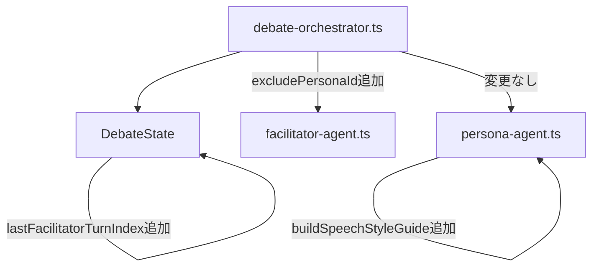
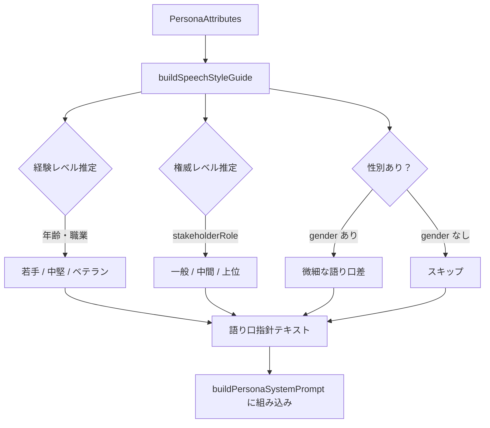

# Design Document: debate-quality-improvement

## Overview

討論コンテンツの品質を3軸で改善する。①同一ペルソナの連続発言防止、②ペルソナ属性（年齢・職業・地位・性別）に応じた語り口の個性化、③ファシリテーターが毎ターン割り込まず対話の自然な流れを維持する介入頻度制御。

すべての変更は `functions/src/` 内の3ファイルに閉じており、Firebase Functions の再デプロイのみで反映される。データスキーマ変更なし（`gender?` フィールドは任意追加のみ）。

### Goals
- 同一ペルソナが連続発言しない
- 年齢・職業・地位・性別から推定した語り口で各ペルソナが発言する
- ペルソナ同士の直接やりとり中はファシリテーターが割り込まず、区切りのタイミングで発言量の少ない・論点に関連性の高い参加者に話を振る
- 議論が尽くされたとファシリテーターが判断したタイミングで討論を終了する（固定ターン数での打ち切りなし）

### Non-Goals
- ペルソナ生成フェーズ（Phase2）の改善
- フロントエンド表示の変更
- データスキーマの変更（`gender` フィールドは任意追加のみ）

## Boundary Commitments

### This Spec Owns
- `persona-agent.ts` のシステムプロンプト生成ロジック（`buildPersonaSystemPrompt`, 新規 `buildSpeechStyleGuide`）
- `debate-orchestrator.ts` の `DebateState` 型と `executeDebate` ループ内のロジック
- `facilitator-agent.ts` の `selectNextSpeaker` インターフェース

### Out of Boundary
- ペルソナ属性の生成ロジック（`persona-generator.ts`）
- 討論結果の表示 UI
- `PersonaAttributes` 型への `gender` 追加は任意で行うが、ない場合のフォールバックを必ず実装する

### Allowed Dependencies
- `functions/src/types/index.ts` の既存型（`PersonaAttributes`, `ConversationTurn`, etc.）
- Anthropic SDK（既存の依存）

### Revalidation Triggers
- `selectNextSpeaker` のシグネチャ変更は `debate-orchestrator.ts` の呼び出し側を再チェックする
- `DebateState` への新フィールド追加は `resume()` のステート再構築ロジックも対象となる

## Architecture

### Existing Architecture Analysis

```
debate-orchestrator.ts
  ├─ executeDebate() ループ
  │    ├─ facilitator.selectNextSpeaker()   ← 1.発言者選択
  │    ├─ evaluateIntervention()            ← 2.固定間隔で介入評価
  │    └─ personaAgent.generateTurn()       ← 3.ペルソナ発言生成
  └─ DebateState { history, currentBeliefs, silenceMap, speakCount, lastAddressedPersonaId }

persona-agent.ts
  └─ buildPersonaSystemPrompt()             ← 語り口指針なし（属性列挙のみ）

facilitator-agent.ts
  └─ selectNextSpeaker(history, personas, silenceMap)  ← excludeなし
```

### Architecture Pattern & Boundary Map



変更は3ファイルに閉じており、外部インターフェース（API エンドポイント、Firestore スキーマ）への影響なし。

### Technology Stack

| Layer | Choice | Role |
|-------|--------|------|
| Backend | TypeScript / Node.js 24 | Functions ロジック |
| AI | Anthropic SDK (Claude Sonnet) | プロンプト生成・LLM 呼び出し |
| Runtime | Firebase Functions v2 | 実行環境（変更なし） |

## File Structure Plan

### Modified Files
- `functions/src/pipeline/debate-orchestrator.ts` — `DebateState` に3フィールド追加、`executeDebate` ループの発言者選択・介入評価ロジック変更、`evaluateParticipationBalance()` 追加、`resume()` のステート再構築更新
- `functions/src/agents/persona-agent.ts` — `buildSpeechStyleGuide()` 追加、`buildPersonaSystemPrompt()` に組み込み
- `functions/src/agents/facilitator-agent.ts` — `selectNextSpeaker()` に `excludePersonaId?` 追加、`evaluateIntervention()` に `speakCount` 追加

### Optionally Modified Files
- `functions/src/types/index.ts` — `PersonaAttributes` に `gender?: string` 追加（任意）

## System Flows

### 発言者選択・介入評価フロー（要件1・3）

```mermaid
sequenceDiagram
    participant Loop as executeDebate loop
    participant State as DebateState
    participant FA as FacilitatorAgent

    Loop->>State: lastAddressedPersonaId あり？
    alt あり（直接指名）
        State-->>Loop: nextPersonaId = lastAddressedPersonaId
        Loop->>State: consecutiveDirectExchanges++
    else なし
        Loop->>FA: selectNextSpeaker(history, personas, silenceMap, lastSpeakerId)
        FA-->>Loop: nextPersonaId
        Loop->>State: consecutiveDirectExchanges = 0
    end

    Loop->>Loop: shouldEvaluateIntervention(state, currentTurnIndex)?
    alt スキップ条件（直接やりとり中 かつ 最大間隔内 かつ 沈黙なし）
        Loop->>Loop: 介入評価スキップ
    else 評価条件（区切り OR 最大間隔超過 OR 緊急沈黙）
        Loop->>Loop: evaluateParticipationBalance(speakCount, personas)?
        alt 発言不足ペルソナあり
            Loop->>FA: evaluateIntervention(history, personas, speakCount)
            Note over FA: 発言数少ない×論点関連性で invite 対象を判断
            FA-->>Loop: shouldIntervene=true, type=invite, targetPersonaId
        else 発言バランス均等
            Loop->>FA: evaluateIntervention(history, personas, speakCount)
            FA-->>Loop: shouldIntervene=false or topic_shift or close
        end
    end

    Loop->>State: lastSpeakerId = nextPersonaId
```

### 語り口スタイルガイド生成フロー（要件2）



## Requirements Traceability

| 要件 | 概要 | コンポーネント | インターフェース |
|------|------|----------------|-----------------|
| 1.1 | 直前発言者を次の選択から除外 | `DebateOrchestratorService`, `FacilitatorAgentService` | `selectNextSpeaker` + `excludePersonaId` |
| 1.2 | `addressedToPersonaId` は連続発言より優先 | `DebateOrchestratorService` | `executeDebate` ループ |
| 1.3 | 候補0人の場合は除外を無視 | `FacilitatorAgentService` | `selectNextSpeaker` プロンプト |
| 1.4 | 自動選択とオーケストレーター両方で適用 | `DebateOrchestratorService` | `DebateState.lastSpeakerId` |
| 2.1 | 語り口指針をシステムプロンプトに含める | `PersonaAgentService` | `buildSpeechStyleGuide` |
| 2.2 | 若手→口語体・疑問形 | `PersonaAgentService` | `buildSpeechStyleGuide` |
| 2.3 | 専門家→専門語彙・断言的 | `PersonaAgentService` | `buildSpeechStyleGuide` |
| 2.4 | 現場職→経験談ベース | `PersonaAgentService` | `buildSpeechStyleGuide` |
| 2.5 | 画一的ビジネス敬語を禁止 | `PersonaAgentService` | `buildPersonaSystemPrompt` |
| 2.6 | 性別を微細に反映 | `PersonaAgentService` | `buildSpeechStyleGuide` |
| 2.7 | 上位地位→断言的、謙遜なし | `PersonaAgentService` | `buildSpeechStyleGuide` |
| 2.8 | 下位地位→遠慮がちな表現 | `PersonaAgentService` | `buildSpeechStyleGuide` |
| 3.1 | 固定間隔でなく条件ベースで介入評価 | `DebateOrchestratorService` | `shouldEvaluateIntervention` |
| 3.2 | 直接やりとり中は介入スキップ | `DebateOrchestratorService` | `consecutiveDirectExchanges` |
| 3.3 | 区切り時に speakCount で参加バランス評価 | `DebateOrchestratorService` | `evaluateParticipationBalance` |
| 3.4 | invite 時は発言量少＋論点関連性でターゲット選択 | `FacilitatorAgentService` | `evaluateIntervention` + `speakCount` |
| 3.5 | 最大間隔超過で強制評価 | `DebateOrchestratorService` | `lastFacilitatorTurnIndex` |
| 3.6 | 緊急沈黙（`personas.length` 超過）で強制評価 | `DebateOrchestratorService` | `silenceMap` (動的閾値) |
| 4.1 | 主終了条件をファシリテーターの close 判断とする | `DebateOrchestratorService` | `executeDebate` ループ終了条件 |
| 4.2 | close 受け入れ条件: 全ペルソナが minTurnsPerPersona 以上 | `DebateOrchestratorService` | `speakCount` + `minTurnsPerPersona` |
| 4.3 | maxTurns はセーフティネット（通常未到達） | `DebateOrchestratorService`, `OrchestratorOptions` | `maxTurns` 値を大幅増加 |
| 4.4 | maxTurns 到達時は強制終了 | `DebateOrchestratorService` | `executeDebate` ループ |

## Components and Interfaces

| コンポーネント | ドメイン | Intent | 要件 | 主要依存 |
|--------------|---------|--------|------|---------|
| `buildSpeechStyleGuide` | AI Agent | ペルソナ属性から語り口指針を生成する純粋関数 | 2.1〜2.8 | `PersonaAttributes` |
| `buildPersonaSystemPrompt` | AI Agent | スタイルガイドを統合したシステムプロンプト生成 | 2.1〜2.8 | `buildSpeechStyleGuide` |
| `DebateState` | Orchestrator | 討論状態の保持（新フィールド追加） | 1.1, 1.4, 3.1〜3.6 | — |
| `shouldEvaluateIntervention` | Orchestrator | 介入評価を行うべきか判定する純粋関数 | 3.1, 3.2, 3.5, 3.6 | `DebateState` |
| `evaluateParticipationBalance` | Orchestrator | speakCount から発言不足ペルソナを検出する純粋関数 | 3.3 | `DebateState.speakCount` |
| `evaluateIntervention`（変更） | AI Agent | speakCount を考慮した文脈ベースのinvite先判断 | 3.4 | `speakCount`, `personas`, `history` |
| `selectNextSpeaker`（変更） | AI Agent | 直前発言者を除外した次発言者選択 | 1.1, 1.3 | `excludePersonaId?` |

---

### AI Agent Layer

#### buildSpeechStyleGuide

| Field | Detail |
|-------|--------|
| Intent | `PersonaAttributes` を分析し、語り口指針テキスト（3〜5行）を返す純粋関数 |
| Requirements | 2.1, 2.2, 2.3, 2.4, 2.5, 2.6, 2.7, 2.8 |

**Responsibilities & Constraints**
- `age` と `occupation` キーワードから経験レベル（若手/中堅/ベテラン）を推定
- `stakeholderRole` から権威レベル（一般市民・現場職 / 中間管理 / 経営者・有識者）を推定
- `gender` があれば微細な語り口差を加える（強調しすぎない）
- 出力は3〜5行の自然言語テキスト（プロンプトに直接埋め込む）

**Contracts**: Service [x]

##### Service Interface
```typescript
function buildSpeechStyleGuide(persona: PersonaAttributes & { gender?: string }): string
```
- Preconditions: `persona.age`, `persona.occupation`, `persona.stakeholderRole` が存在する
- Postconditions: 3〜5行の語り口指針テキストを返す（空文字列は返さない）
- Invariants: 特定の立場・主張への誘導を含まない

**Implementation Notes**
- Integration: `buildPersonaSystemPrompt` の「発言スタイルの厳守事項」セクションに組み込む
- Validation: 返すテキストに「〜すべき」「〜しなければならない」などの過激な制約を含めない
- Risks: LLMがスタイル指針を無視する可能性がある → ツールの `content` フィールド説明にも簡潔に反映する

---

#### selectNextSpeaker（変更）

| Field | Detail |
|-------|--------|
| Intent | 直前発言者を除外した上で次の発言者を選択する |
| Requirements | 1.1, 1.3 |

**Contracts**: Service [x]

##### Service Interface
```typescript
// Before
selectNextSpeaker(
  history: ConversationTurn[],
  personas: PersonaAttributes[],
  silenceMap: Map<string, number>
): Promise<Result<string, PipelineError>>

// After
selectNextSpeaker(
  history: ConversationTurn[],
  personas: PersonaAttributes[],
  silenceMap: Map<string, number>,
  excludePersonaId?: string   // 追加: 直前発言者のID
): Promise<Result<string, PipelineError>>
```
- Preconditions: `personas.length >= 1`
- Postconditions: 有効なペルソナIDを返す。`excludePersonaId` と同一のIDは他に候補がある限り返さない
- Invariants: `personas.length === 1` の場合は `excludePersonaId` を無視する（要件1.3）

---

### Orchestrator Layer

#### DebateState（変更）

| Field | Detail |
|-------|--------|
| Intent | 討論状態の保持。連続発言防止と介入頻度制御のための新フィールドを追加 |
| Requirements | 1.1, 1.4, 3.1, 3.2, 3.3, 3.4 |

**Contracts**: State [x]

##### State Management
```typescript
interface DebateState {
  history: ConversationTurn[];
  currentBeliefs: Map<string, { content: string; version: number }>;
  silenceMap: Map<string, number>;
  speakCount: Map<string, number>;
  lastAddressedPersonaId: string | undefined;

  // 新規追加
  lastSpeakerId: string | undefined;          // 連続発言防止（要件1）
  consecutiveDirectExchanges: number;          // ペルソナ同士の直接やりとり連続回数（要件3）
  lastFacilitatorTurnIndex: number;            // 最後にファシリテーターが発言したターン番号（要件3）
}
```
- State model: `consecutiveDirectExchanges` は `lastAddressedPersonaId` 経由での発言が続く限り加算、`selectNextSpeaker` 使用やファシリテーター介入でリセット
- Persistence: `resume()` でのステート再構築時に `lastFacilitatorTurnIndex` も既存ターン履歴から再計算する

---

#### shouldEvaluateIntervention

| Field | Detail |
|-------|--------|
| Intent | 現在の討論状態から介入評価を実行すべきか判定する純粋関数 |
| Requirements | 3.1, 3.2, 3.5, 3.6 |

**Contracts**: Service [x]

##### Service Interface
```typescript
function shouldEvaluateIntervention(
  state: Pick<DebateState, 'silenceMap' | 'consecutiveDirectExchanges' | 'lastFacilitatorTurnIndex'>,
  currentTurnIndex: number,
  personasCount: number,
  interventionInterval: number
): boolean
```

**ロジック:**
```
emergencySilence = silenceMap の最大値 > personasCount   // 動的閾値
turnsSinceFacilitator = currentTurnIndex - lastFacilitatorTurnIndex
isActiveExchange = consecutiveDirectExchanges >= 2
exchangeBreak = consecutiveDirectExchanges === 0  // 直接指名なしのターンが来た

if emergencySilence → true（緊急：常に優先）
if isActiveExchange AND turnsSinceFacilitator < interventionInterval * 2 → false（やりとり継続中）
if exchangeBreak → true（区切りがついた → 参加バランス評価へ）
if turnsSinceFacilitator >= interventionInterval → true（最大間隔超過）
else → false
```

- Preconditions: `currentTurnIndex >= 1`
- Postconditions: `true` の場合のみ `evaluateParticipationBalance` → `evaluateIntervention` を呼ぶ
- Invariants: 緊急沈黙は常に `true` を返す（3.6が3.2より優先）

---

#### evaluateParticipationBalance

| Field | Detail |
|-------|--------|
| Intent | speakCount から平均を大きく下回るペルソナを検出する純粋関数 |
| Requirements | 3.3 |

**Contracts**: Service [x]

##### Service Interface
```typescript
function evaluateParticipationBalance(
  speakCount: Map<string, number>,
  personas: PersonaAttributes[]
): PersonaAttributes[]  // 発言不足ペルソナのリスト（空なら不足なし）
```

**ロジック:**
```
average = speakCount の合計 / personas.length
threshold = average * 0.5  // 平均の50%以下を「発言不足」とみなす
return personas.filter(p => (speakCount.get(p.id) ?? 0) <= threshold)
```

- Postconditions: 空配列なら全員が均等に発言できている
- Invariants: 討論開始直後（全員0回）は全員が候補になるが、`lastFacilitatorTurnIndex` が0なのでスキップされる

---

#### evaluateIntervention（変更）

| Field | Detail |
|-------|--------|
| Intent | 発言数＋論点の文脈から最適な介入タイプとinvite対象を判断する |
| Requirements | 3.4 |

**Contracts**: Service [x]

##### Service Interface
```typescript
// Before
evaluateIntervention(
  history: ConversationTurn[],
  personas: PersonaAttributes[]
): Promise<Result<FacilitatorIntervention, PipelineError>>

// After
evaluateIntervention(
  history: ConversationTurn[],
  personas: PersonaAttributes[],
  speakCount: Map<string, number>  // 追加
): Promise<Result<FacilitatorIntervention, PipelineError>>
```

- LLMへのプロンプトに `speakCount` を含めることで、「発言少ない × 論点との関連性高い」人を優先した invite を生成する
- Preconditions: `personas.length >= 1`

## Testing Strategy

### Unit Tests
- `buildSpeechStyleGuide(persona)` — 若手/ベテラン/経営者のペルソナ属性ごとに、適切なスタイルキーワードが含まれることを検証
- `shouldEvaluateIntervention()` — 直接やりとり中・緊急沈黙・区切り・最大間隔超過それぞれのパターンで正しい boolean を返すことを検証
- `evaluateParticipationBalance()` — 発言数の偏りがある場合のみ候補を返し、均等な場合は空配列を返すことを検証
- `selectNextSpeaker` プロンプト生成 — `excludePersonaId` が指定されたとき、プロンプトに除外指示が含まれることを検証

### Integration Tests
- `executeDebate` ループで同一ペルソナが連続して `savedTurn.personaId` に現れないことを検証
- ペルソナ数1の場合に `excludePersonaId` を無視して正常終了することを検証
- ファシリテーターが close を返し全ペルソナが `minTurnsPerPersona` を満たしたとき、`maxTurns` 未満で討論が終了することを検証
