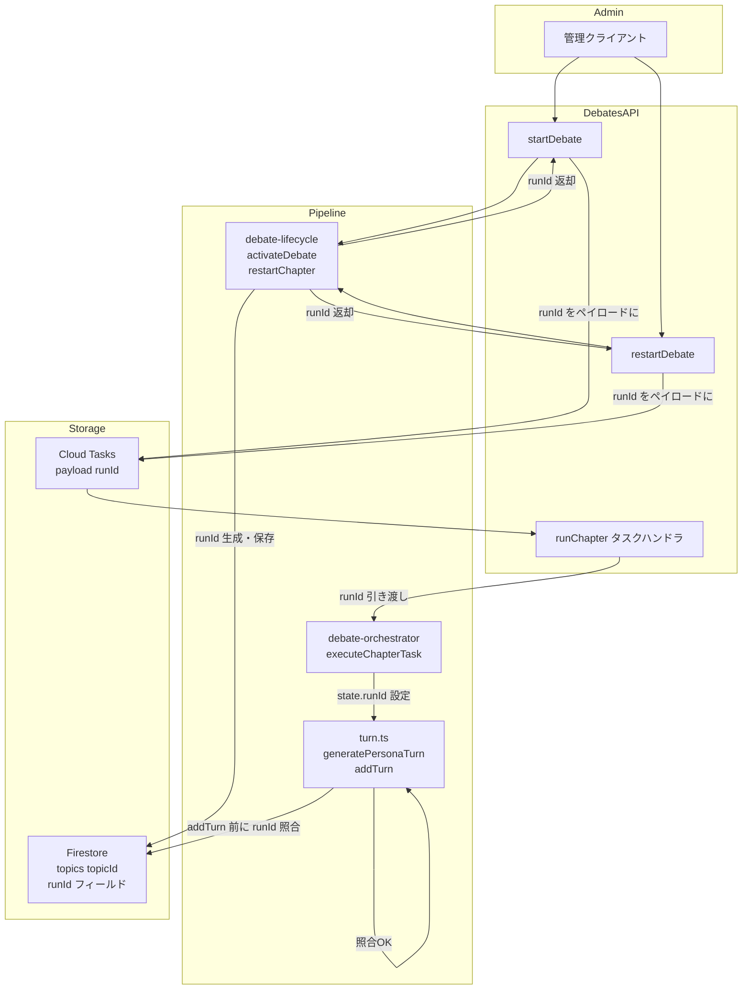
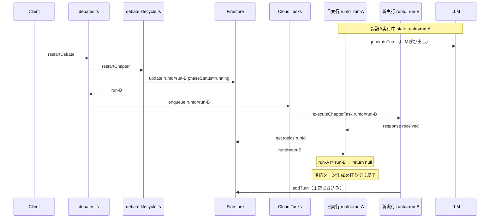
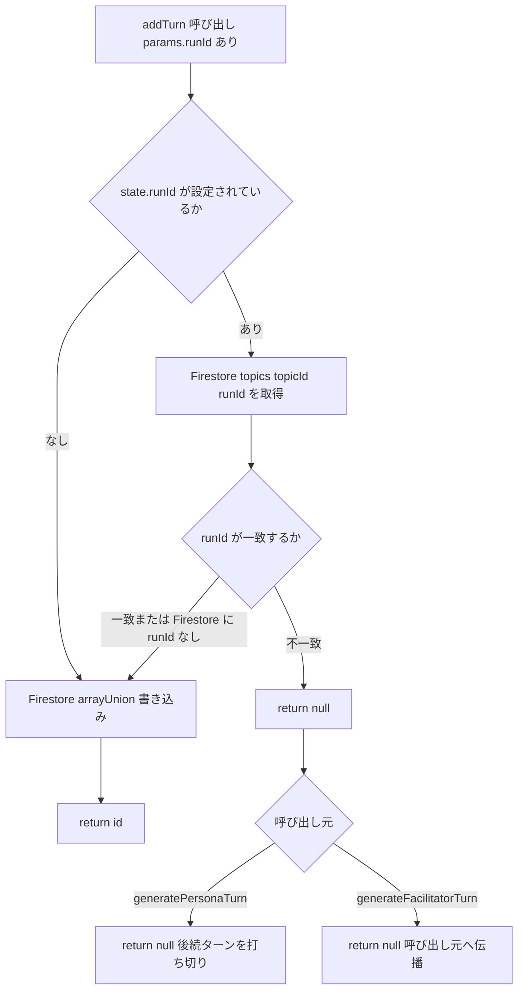

# Design Document: debate-run-isolation

## Overview

討論パイプラインは「LLM呼び出し → レスポンス受信 → Firestore書き込み」の非同期ループで動作する。「討論A実行中にAを停止してBを開始」した場合、AのLLMレスポンスが返ってきた時点ではBが実行中のため `isDebateActive` が `true` を返してしまい、Aのターンが Firestore に書き込まれる競合状態が発生する。

この spec は **runId（実行ID）** を導入してこの競合を解決する。`activateDebate`（開始・再起動）が nanoid で runId を生成し Firestore に保存する。Cloud Tasks ペイロードで各タスクに runId を渡し、`generatePersonaTurn` および `generateFacilitatorTurn` がLLMレスポンス取得後・`addTurn` 実行前に Firestore の runId と照合する。ミスマッチなら書き込みをスキップし以降のターン処理を打ち切る。

### Goals

- 再起動後に旧実行のターンが Firestore に混入しないことを保証する
- `isDebateActive`（停止チェック）と runId 照合（世代チェック）の責務を分離する
- 既存の topics ドキュメントへの backward compatibility を維持する（`runId` 未設定なら照合スキップ）

### Non-Goals

- 旧 Cloud Function invocation の強制終了（技術的に不可能）
- 読み取り操作への世代チェック適用
- runId のクライアント側への公開

---

## Boundary Commitments

### This Spec Owns

- `topics/{topicId}` の `runId` フィールド（生成・更新・照合）
- Cloud Tasks ペイロードにおける `runId` の引き回し
- `addTurn` 内の世代照合ロジック（全ターン書き込みの単一ガードポイント）
- `activateDebate` / `restartChapter` の戻り値型変更（`void` → `Promise<string>`）

### Out of Boundary

- Cloud Tasks タスクのキャンセル・削除
- `isDebateActive` の責務（停止チェック）への runId 混入

### Allowed Dependencies

- `nanoid` — runId 生成（既存依存）
- Firestore Admin SDK — `topics/{topicId}` 読み書き（既存依存）
- Cloud Tasks（Firebase Functions v2 `onTaskDispatched`）— ペイロード拡張

### Revalidation Triggers

- `activateDebate` の戻り値型を変更した場合、呼び出し元（`debates.ts`）の更新が必要
- Cloud Tasks ペイロード型を変更した場合、`runChapter` ハンドラ側の型も更新が必要

---

## Architecture

### Existing Architecture Analysis

`debates.ts` → `executeChapterTask` → `executeTurn` → `generatePersonaTurn` → `addTurn` の呼び出しスタックで各ターンを処理する。`isDebateActive` はターンループの先頭と `generatePersonaTurn` 内の2箇所で呼ばれており、Firestore の `phase=5 && phaseStatus='running'` を確認する。

競合ウィンドウはすべての「LLM呼び出し中」（`generatePersonaTurn` のペルソナターンだけでなく、`generateOpening`・`generateClosing` 等のファシリテーターターンも含む）に発生する。この期間中に `restartDebate` が呼ばれると Firestore の `phaseStatus` は `'running'`（新世代B）のままになるため `isDebateActive` ではブロックできない。

### Architecture Pattern & Boundary Map



**Key Decision**: runId 照合は `addTurn` の内部に置く。`addTurn` は全ターン（ペルソナ・ファシリテーター問わず）の唯一の Firestore 書き込みポイントであり、ここにガードを配置することで呼び出し元を問わず全ターン書き込みを一元的に保護できる（詳細は `research.md` 参照）。

### Technology Stack

| Layer | Choice / Version | Role in Feature |
|-------|------------------|-----------------|
| Backend | Firebase Functions v2 | `runChapter` タスクハンドラ（ペイロード拡張） |
| Data | Firestore Admin SDK | `topics/{topicId}.runId` の保存・照合 |
| Messaging | Cloud Tasks | `runId` を含むタスクペイロードの引き回し |
| ID生成 | nanoid（既存依存） | 一意の runId 生成 |

---

## File Structure Plan

### Modified Files

| File | 変更内容 |
|------|---------|
| `functions/src/types/debate.types.ts` | `DebateState` に `runId?: string` を追加 |
| `functions/src/pipeline/debate/debate-lifecycle.ts` | `activateDebate` の戻り値を `Promise<string>`（runId）に変更；`restartChapter` も同様 |
| `functions/src/pipeline/debate/debate-orchestrator.ts` | `executeChapterTask` に `runId?: string` パラメータを追加；`state.runId = runId` を設定 |
| `functions/src/api/debates.ts` | `enqueueChapterTask` のペイロードに `runId` を追加；次章タスクに引き継ぐ |
| `functions/src/pipeline/debate/turn.ts` | ① `addTurn` に `runId?` パラメータを追加・内部で世代照合・`{ id } \| null` を返す；② `generatePersonaTurn` の既存インライン runId チェックを削除し `addTurn` に `runId: state.runId` を渡して null を受けたら return null；③ `generateFacilitatorTurn` が `addTurn` に `runId: state.runId` を渡して null を受けたら return null（戻り値型 `\| null` に変更） |
| `functions/src/pipeline/debate/intervention.ts` | `persistInterventionTurn` が `addTurn` に `runId: state.runId` を渡す（null 受信時は return undefined） |

新規ファイルなし。

---

## System Flows

### 競合状態と世代照合フロー



### 世代照合ロジック（addTurn 内）



---

## Requirements Traceability

| Requirement | Summary | Components | Flows |
|-------------|---------|------------|-------|
| 1.1 | 開始時に runId を生成・Firestore 保存 | `activateDebate` | 競合状態フロー |
| 1.2 | 再起動時に runId を上書き | `activateDebate`（`restartChapter` 経由） | 競合状態フロー |
| 1.3 | runId を呼び出し元に返す | `activateDebate` 戻り値 | — |
| 2.1 | Cloud Tasks ペイロードに runId を含める | `enqueueChapterTask` | — |
| 2.2 | 次章タスクに runId を引き継ぐ | `enqueueChapterTask`（次章エンキュー時） | — |
| 2.3 | `DebateState` に runId を保持 | `executeChapterTask` / `DebateState` | — |
| 3.1 | `addTurn` 内で Firestore の runId と照合 | RunId ガード（`addTurn` 内） | 世代照合ロジック |
| 3.2 | 不一致 → 書き込みなし・後続打ち切り | RunId ガード + 呼び出し元の null ハンドリング | 世代照合ロジック |
| 3.3 | `runId` 未設定 → 照合スキップ・書き込み許可 | RunId ガード | 世代照合ロジック |
| 3.4 | Firestore の `runId` 未設定 → 照合スキップ・書き込み許可 | RunId ガード | 世代照合ロジック |
| 4.1 | 再起動後、旧実行のターンがブロックされる | RunId ガード + `activateDebate` | 競合状態フロー |
| 4.2 | 並走中も旧世代ターンが Firestore に混入しない（ペルソナ・ファシリテーター両方） | RunId ガード | 競合状態フロー |
| 4.3 | 照合失敗は `null` 返却（例外でない） | RunId ガード | 世代照合ロジック |

---

## Components and Interfaces

| Component | Layer | Intent | Requirements | Key Dependencies |
|-----------|-------|--------|--------------|-----------------|
| RunId 発行（`activateDebate`） | Pipeline/Lifecycle | runId を生成し Firestore に保存して返す | 1.1, 1.2, 1.3 | nanoid, Firestore（P0） |
| タスクルーター（`enqueueChapterTask`） | API | Cloud Tasks ペイロードに runId を含めて渡す | 2.1, 2.2 | Cloud Tasks（P0） |
| 状態保持（`executeChapterTask`） | Pipeline/Orchestrator | タスクペイロードから runId を受け取り DebateState に設定 | 2.3 | DebateState（P0） |
| RunId ガード（`addTurn` 内） | Pipeline/Turn | 全ターン書き込みの単一ガードポイント。Firestore の runId と照合し旧世代の書き込みをブロックする | 3.1〜3.4, 4.1〜4.3 | Firestore（P0） |

### Pipeline/Lifecycle

#### RunId 発行（`activateDebate`）

| Field | Detail |
|-------|--------|
| Intent | `topics/{topicId}` に `runId` を生成・保存し、呼び出し元に返す |
| Requirements | 1.1, 1.2, 1.3 |

**Contracts**: Service [x]

##### Service Interface

```typescript
// debate-lifecycle.ts
const activateDebate = (topicId: string): Promise<string>;
const restartChapter = (topicId: string, chapterId: string): Promise<string>;
```

- Preconditions: `topicId` が有効な Firestore ドキュメントパスを指すこと
- Postconditions: Firestore の `topics/{topicId}.runId` に新しい nanoid が書き込まれ、その値が返される
- Invariants: `restartChapter` は内部で `activateDebate` を呼び出す。runId は毎回新規生成される

---

### API

#### タスクルーター（`enqueueChapterTask`）

| Field | Detail |
|-------|--------|
| Intent | Cloud Tasks ペイロードに `runId` を含め、次章引き継ぎでも同一 runId を維持する |
| Requirements | 2.1, 2.2 |

**Contracts**: Batch [x]

##### Batch / Job Contract

```typescript
// debates.ts — Cloud Tasks ペイロード型
type ChapterTaskPayload = {
    topicId: string;
    chapterIndex: number;
    runId?: string;
    singleChapterMode?: boolean;
};
```

- Trigger: `startDebate` / `restartDebate` の onCall ハンドラ、および `runChapter` 内の次章エンキュー
- Input: `activateDebate` / `restartChapter` から返された `runId`
- Idempotency: Cloud Tasks のリトライ時も同一 `runId` が再利用される（ペイロードは不変）

---

### Pipeline/Orchestrator

#### 状態保持（`executeChapterTask`）

| Field | Detail |
|-------|--------|
| Intent | ペイロードの `runId` を `DebateState.runId` に設定し、ターン生成全体で参照可能にする |
| Requirements | 2.3 |

**Contracts**: State [x]

##### State Management

```typescript
// debate-orchestrator.ts
const executeChapterTask = (
    topicId: string,
    chapterIndex: number,
    options?: DebateOptions,
    runId?: string
): Promise<boolean>;

// debate.types.ts
type DebateState = {
    turns: DebateTurn[];
    silenceMap: Map<string, number>;
    speakCount: Map<string, number>;
    lastSpeakerId?: string;
    queuedIntents: Map<string, QueuedIntent[]>;
    discussionPoints: DiscussionPointState[];
    runId?: string; // 追加フィールド
};
```

- State model: `state.runId` は `executeChapterTask` 起動時に一度設定され、チャプター処理終了まで不変
- Concurrency strategy: 各 Cloud Function invocation が独立した `DebateState` インスタンスを保持するためロック不要

---

### Pipeline/Turn

#### RunId ガード（`addTurn` 内）

| Field | Detail |
|-------|--------|
| Intent | 全ターン書き込みの単一ガードポイント。`addTurn` が `runId` を受け取り、Firestore の現在の `runId` と照合して旧世代の書き込みをブロックする |
| Requirements | 3.1, 3.2, 3.3, 3.4, 4.1, 4.2, 4.3 |

**Contracts**: Service [x]

##### Service Interface

```typescript
// turn.ts
const addTurn = (params: {
    topicId: string;
    chapterId: string;
    speakerType: 'persona' | 'facilitator';
    personaId?: string;
    content: string;
    speechMode?: 'opinion' | 'fact' | 'question';
    engagementScore?: number;
    fromQueue?: boolean;
    targetPersonaId?: string;
    targetedBy?: 'facilitator' | 'persona';
    searchUsed?: boolean;
    searchQueries?: string[];
    runId?: string; // 追加: 世代照合用
}): Promise<{ id: string } | null>;

// generateFacilitatorTurn の戻り値型変更
const generateFacilitatorTurn = (params: {
    topicId: string;
    state: DebateState;
    content: string;
    targetPersonaId?: string;
    chapterId: string;
}): Promise<{ content: string; targetPersonaId?: string } | null>;
```

**照合ロジックの仕様:**

| 条件 | 動作 |
|------|------|
| `params.runId` が未設定 | 照合スキップ → Firestore 書き込み実行 → `{ id }` 返却 |
| Firestore の `runId` フィールドが未設定 | 照合スキップ → Firestore 書き込み実行 → `{ id }` 返却 |
| `params.runId === Firestore.runId` | 照合成功 → Firestore 書き込み実行 → `{ id }` 返却 |
| `params.runId !== Firestore.runId` | 照合失敗 → 書き込みなし → `null` 返却 |

**呼び出し元の null ハンドリング:**

| 呼び出し元 | null 受信時の動作 |
|-----------|----------------|
| `generatePersonaTurn` | `null` を返す → `executeTurn` が `null` を受けて while ループを終了 |
| `generateFacilitatorTurn` | `null` を返す → 呼び出し元（`executeChapterTask` 等）が早期リターン |

**Implementation Notes**:
- `addTurn` が `runId` を受け取るために、`generatePersonaTurn` と `generateFacilitatorTurn` は `state.runId` を `addTurn` に渡す
- `isDebateActive`（phaseStatus チェック）とは独立した Firestore 読み込みとして実装する（関心の分離）
- 照合失敗は例外でなく `null` 返却。Cloud Tasks のリトライを誘発させない

---

## Data Models

### Physical Data Model（Firestore）

`topics/{topicId}` ドキュメントへの追加フィールド:

| Field | Type | Description |
|-------|------|-------------|
| `runId` | `string` (optional) | 現在の実行世代を示す nanoid。`activateDebate` 呼び出しのたびに上書きされる |

- 既存ドキュメントに `runId` がない場合は照合をスキップする（backward compatibility）
- `runId` はターンの書き込み先（`chapters/{chapterId}`）には保存しない

---

## Error Handling

### Error Strategy

| 状況 | 動作 |
|------|------|
| runId ミスマッチ（旧世代検出） | `addTurn` が `null` を返す → `generatePersonaTurn` / `generateFacilitatorTurn` が `null` を返す。例外なし、リトライなし |
| Firestore 読み込みエラー（照合時） | エラーを上位に伝播させ、Cloud Tasks のリトライポリシーに委ねる |
| `activateDebate` の Firestore 書き込みエラー | エラーを上位に伝播させ、`startDebate` / `restartDebate` が失敗を返す |

runId ミスマッチを例外にしない理由: Cloud Tasks のリトライが発動すると同じ旧世代タスクが再実行され、再度ミスマッチとなって無限リトライを引き起こす可能性があるため（`research.md` 参照）。

---

## Testing Strategy

### Unit Tests

- `activateDebate`: Firestore に `runId` が保存され、その値が返ることを確認
- `restartChapter`: 呼び出し後に Firestore の `runId` が新しい値に更新されることを確認
- `addTurn` RunId ガード（ミスマッチ）: `params.runId !== Firestore.runId` のとき `null` を返し Firestore に書き込まないことを確認
- `addTurn` RunId ガード（一致）: `params.runId === Firestore.runId` のとき `{ id }` を返し書き込みが行われることを確認
- `addTurn` RunId ガード（スキップ）: `params.runId` 未設定のとき照合をスキップし書き込みが行われることを確認
- `addTurn` RunId ガード（スキップ）: Firestore `runId` 未設定のとき照合をスキップし書き込みが行われることを確認
- `generatePersonaTurn`: `addTurn` が `null` を返したとき `null` を返すことを確認
- `generateFacilitatorTurn`: `addTurn` が `null` を返したとき `null` を返すことを確認

### Integration Tests

- `startDebate` → `runChapter` タスクハンドラでペイロードの `runId` が `executeChapterTask` に渡ること
- 次章タスクエンキュー時に同一 `runId` が引き継がれること
- `restartDebate` 後、旧 `runId` を持つタスクが `addTurn` を呼ばないこと
