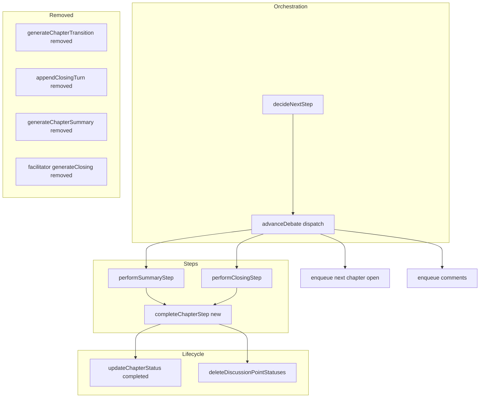
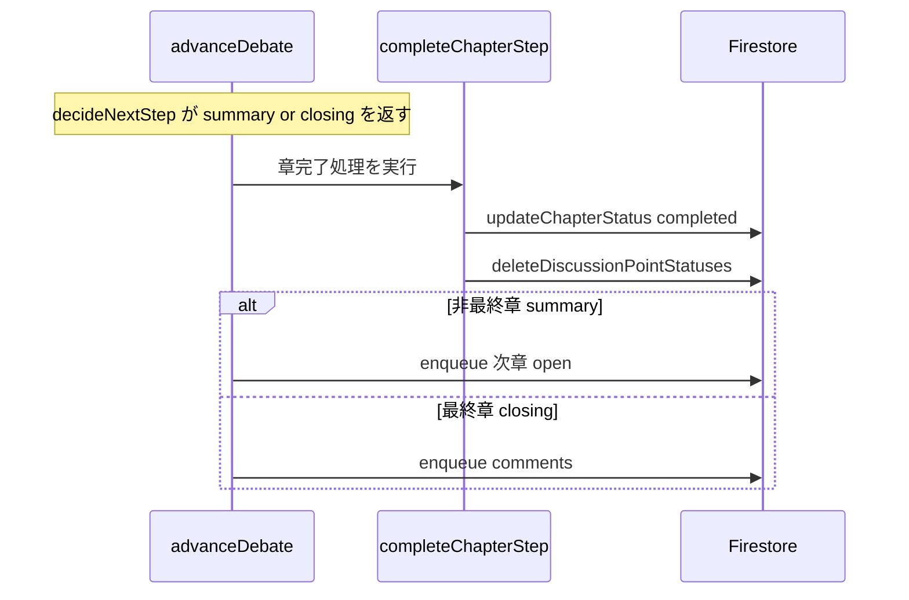

# Technical Design: debate-summary-closing-removal

## Overview

**Purpose**: 討論生成チェーンから、章区切りの**章まとめ（要約）発言**と討論末尾の**クロージング（締め）発言**の生成を削除し、討論を「口火＋会話ターン」中心にスリム化する。読み物としての締めは編集フェーズのクロージング成果物（`editedIntroClosing`・別スペック導入済み）が担うため、討論内の締め発言は役割重複となり不要。

**Users**: 閲覧者は冗長な要約・締め発言で区切られない、会話主体の討論コンテンツを読める。管理者は生成挙動の変化を意識せず、討論完了までのチェーンは従来どおり動作する。

**Impact**: 討論チェーンの `summary`/`closing` ステップから**発言生成のみ**を取り除く。両ステップが担う「章の完了確定」「次段（次章 open / comments）の起動」は不変に保つ。生ディベートの既存データ（過去に生成済みの章まとめ・クロージング発言）は改変しない。

### Goals
- 章まとめ発言・クロージング発言を今後生成しない（R1, R2）。
- 章遷移・討論終端（comments 到達・`generated` 確定）を従来どおり維持する（R3）。
- 既存データ・下流処理・編集フェーズの読み物クロージングに影響を与えない（R4, R5）。
- 未使用化した生成ロジックを残さず、ビルド・型・テストを緑に保つ（R6）。

### Non-Goals
- `summary`/`closing` の StepKind そのものの統合・廃止（Research の Option B）。本設計は StepKind・`decideNextStep`・dispatch 構造を維持する。
- 編集フェーズのイントロ・クロージング成果物（`intro-closing-agent` / `editedIntroClosing`）の変更。
- 章の口火（`open`）・章導入発言・会話ターン・事後コメント生成の変更。
- 過去に生成済みの章まとめ・クロージング発言のマイグレーション・削除。

## Boundary Commitments

### This Spec Owns
- 討論チェーンにおける**章まとめ発言生成**の停止（`performSummaryStep` の生成呼び出し除去）。
- 討論チェーンにおける**クロージング発言生成**の停止（`performClosingStep` の生成呼び出し除去）。
- 上記に伴い未使用化する討論側ロジックの削除：`generateChapterTransition`・`appendClosingTurn`（`turn.ts`）、`generateChapterSummary`・討論側 `generateClosing`・`contentOnlySchema`（`facilitator-agent.ts`）。
- 同一化する `performSummaryStep`/`performClosingStep` の章完了ルーチンへの集約（`completeChapterStep`）。

### Out of Boundary
- StepKind ユニオン（`'open' | 'turn' | 'summary' | 'closing' | 'comments'`）・`decideNextStep`・dispatch の**進行構造**の変更。本設計はこれらを不変に保つ（呼び出し先関数名の差し替えを除く）。
- 編集フェーズの `intro-closing-agent`（`generateIntro`/編集側 `generateClosing`）・`editedIntroClosing`。
- 共有ヘルパー `buildNeutralitySystemPrompt`（他エージェントが使用）。
- 生ディベート既存データの改変。

### Allowed Dependencies
- 既存の章ライフサイクル関数 `updateChapterStatus` / `deleteDiscussionPointStatuses`（`step.ts` 内で使用中）。
- 既存の orchestrator dispatch（`advanceDebate`）の分岐構造。

### Revalidation Triggers
- `performSummaryStep`/`performClosingStep` のシグネチャ変更（dispatch 呼び出し側）。
- `facilitator-agent.ts` の公開 export の削除（`generateChapterSummary`・討論側 `generateClosing`）。
- `turn.ts` の公開 export の削除（`generateChapterTransition`・`appendClosingTurn`）。

## Architecture

### Existing Architecture Analysis
討論は「1ステップ＝1 Cloud Task」の自己継続チェーン。`advanceDebate` が `stepKind` で分岐し、状態は毎回 Firestore（原本＋runId）から再構築するため冪等・再入可能。章末で `decideNextStep` が `isLastChapter ? closing : summary` を返し（[debate-orchestrator.ts:106-108]）、dispatch が該当ステップを実行後に次段を enqueue する（[debate-orchestrator.ts:261-280]）：

- `summary` → `performSummaryStep`（章まとめ生成＋章 completed＋論点クリーンアップ）→ **次章 `open`** を enqueue。
- `closing` → `performClosingStep`（クロージング生成＋章 completed＋論点クリーンアップ）→ **`comments`** を enqueue。

章まとめ・クロージング発言は `speakerType: 'facilitator'` の素のターンとして章 `turns` に追記される（識別マーカーなし）。`debate-state` はファシリテーター発言を集計から除外するため、これらの発言に依存する下流は存在しない。

### Architecture Pattern & Boundary Map

**Architecture Integration**:
- **Selected pattern**: 既存ステップチェーンからの純粋削除（Research の Option A）。生成呼び出しのみ除去し、進行・終端は不変。
- **Domain/feature boundaries**: 生成（削除対象）は agents/turn 層、進行・終端は orchestrator/step 層。後者に触れない。
- **Existing patterns preserved**: 世代ゲート（runId）・冪等再入・章ライフサイクル（completed 化・論点クリーンアップ）・dispatch の enqueue 判断。
- **New components rationale**: `completeChapterStep` は、生成除去後に同一化する `performSummaryStep`/`performClosingStep` の重複を解消するための単一章完了ルーチン（R6）。新たな責務は導入しない。
- **Steering compliance**: アロー関数・トップダウン配置・型安全（`any` 不使用）・過度な抽象化の回避（完全重複関数の DRY のみ）。

### Dependency Direction
`agents/facilitator-agent`（削除）→ `pipeline/debate/turn`（削除）→ `pipeline/debate/step`（生成除去＋集約）→ `pipeline/debate/debate-orchestrator`（呼び出し名の差し替えのみ）。各層は左のみに依存し、上位への依存を追加しない。

### Technology Stack

| Layer | Choice / Version | Role in Feature | Notes |
|-------|------------------|-----------------|-------|
| Backend / Services | Firebase Functions v2（onTaskDispatched, Node 24） | 討論ステップの実行 | 既存に相乗り。新 Function なし |
| AI | 変更なし（生成呼び出しを**削除**） | 章まとめ・クロージングの LLM 呼び出しを廃止 | 新規依存なし。LLM 呼び出し2種が減る |
| Data / Storage | Firestore（`chapters/{id}.turns`） | 追記対象から章まとめ・クロージング発言が外れる | 既存データは不変 |

## File Structure Plan

### Modified Files
- `functions/src/pipeline/debate/step.ts` — `performSummaryStep`/`performClosingStep` から生成ブロックを除去し、章完了処理を単一 `completeChapterStep` に集約。`generateChapterTransition`/`appendClosingTurn` の import を削除。
- `functions/src/pipeline/debate/debate-orchestrator.ts` — dispatch の `summary`/`closing` 分岐が `completeChapterStep` を呼ぶよう差し替え（enqueue 判断＝次章 open / comments はそのまま）。
- `functions/src/pipeline/debate/turn.ts` — `generateChapterTransition`・`appendClosingTurn` を削除。`facilitator-agent` からの `generateChapterSummary`/`generateClosing` import を削除。これに伴い未使用化する import（`getInitialBelief`・`formatAwarenessSection`・`Chapter` 型・`pipelineErrorMessage` 等）を、他所で未使用なら除去する。
- `functions/src/agents/facilitator-agent.ts` — 討論側 `generateClosing`・`generateChapterSummary`・専用 `contentOnlySchema` を削除。`buildNeutralitySystemPrompt` ほか他エージェント共有物は保持。

### Test Files (更新)
- `functions/src/tests/pipeline/debate/turn.test.ts` — `generateChapterTransition`/`appendClosingTurn` の describe・mock を削除。
- `functions/src/tests/pipeline/debate/step.test.ts` — 生成関数 mock を削除し、`completeChapterStep`（章 completed＋論点クリーンアップ）の検証へ更新。
- `functions/src/tests/agents/facilitator-agent.test.ts` — `generateChapterSummary`/討論側 `generateClosing` のテストを削除。
- `functions/src/tests/pipeline/debate/debate-parity.test.ts` / `debate-step-idempotency.test.ts` / `intervention-gate.integration.test.ts` / `inline-fact-check.flow.test.ts` — 生成関数 mock を除去し、期待ターン列から章まとめ・クロージング発言を除外。章遷移・comments 到達・`generated` の検証は維持。

> `debate-orchestrator.ts` の StepKind 分岐・`decideNextStep`・`enqueueChapterEnd`・taskKey は構造を変更しない（呼び出し先関数名の差し替えのみ）。

## System Flows

### 章末処理（削除後）

**Flow-level decisions**:
- **生成の不在**: 章末で LLM を呼ばず、章 `turns` に発言を追記しない（R1, R2）。
- **進行不変**: 章完了確定と次段 enqueue は従来どおり。`summary`/`closing` の分岐は残し、次段の差（次章 open / comments）を保持する（R3）。
- **冪等**: 状態は Firestore から再構築。`completeChapterStep` は completed 化の再適用に対し冪等。

## Requirements Traceability

| Requirement | Summary | Components | Interfaces | Flows |
|-------------|---------|------------|------------|-------|
| 1.1, 1.2, 1.3 | 章まとめ発言を生成・追記しない | performSummaryStep（生成除去）, turn.ts, facilitator-agent | `completeChapterStep` | 章末処理 |
| 2.1, 2.2, 2.3 | クロージング発言を生成・追記しない | performClosingStep（生成除去）, turn.ts, facilitator-agent | `completeChapterStep` | 章末処理 |
| 3.1, 3.2, 3.3, 3.4, 3.5 | 章完了確定・次段起動・generated 到達を維持 | debate-orchestrator（dispatch 不変）, completeChapterStep | `advanceDebate` | 章末処理 |
| 4.1, 4.2, 4.3 | 既存データ・下流・他発言に非影響 | （変更なしの下流各処理） | — | — |
| 5.1, 5.2 | 編集フェーズ読み物クロージングと分離 | intro-closing-agent（不変）, editedIntroClosing（不変） | — | — |
| 6.1, 6.2 | 未使用ロジック削除・ビルド/テスト緑 | turn.ts, facilitator-agent, テスト群 | — | — |

## Components and Interfaces

| Component | Domain/Layer | Intent | Req Coverage | Key Dependencies (P0/P1) | Contracts |
|-----------|--------------|--------|--------------|--------------------------|-----------|
| completeChapterStep | Pipeline/Steps | 章末の完了確定＋論点クリーンアップ（生成なし） | 1, 2, 3 | updateChapterStatus (P0), deleteDiscussionPointStatuses (P0) | Batch |
| advanceDebate（dispatch） | Pipeline/Orchestration | summary/closing 分岐で completeChapterStep を呼び次段を enqueue | 3 | completeChapterStep (P0), enqueueNextStep (P0) | Batch |
| turn.ts（削除） | Pipeline/Debate | 章まとめ・クロージングのターンビルダーを削除 | 1, 2, 6 | — | — |
| facilitator-agent（削除） | Agents | 討論側の章まとめ・クロージング生成関数を削除 | 1, 2, 6 | — | — |

### Pipeline/Steps

#### completeChapterStep

| Field | Detail |
|-------|--------|
| Intent | 章末に当該章を完了（completed）へ確定し、論点状態をクリーンアップする（発言生成は行わない） |
| Requirements | 1.1, 1.2, 1.3, 2.1, 2.2, 2.3, 3.1, 3.5 |

**Responsibilities & Constraints**
- 章の `status` を `completed` に確定し、`deleteDiscussionPointStatuses` を実行する。
- LLM 呼び出し・`turns` への追記を行わない（生成の完全排除）。
- 状態は Firestore から再構築するため冪等（completed 再適用に耐える）。
- 生ディベートの既存 `turns` を改変しない（読み取り・状態更新のみ）。

**Dependencies**
- Outbound: `updateChapterStatus`（P0）, `deleteDiscussionPointStatuses`（P0）

**Contracts**: Batch [x]

##### Batch / Job Contract
- Trigger: `advanceDebate` の `stepKind === 'summary'` または `'closing'` 分岐。
- Input: `ctx`（章・payload 由来の topicId/chapterId）。実データは Firestore から再構築。
- Output: 章 `status = completed`、論点状態の削除。
- Idempotency & recovery: 固定の章 ID への completed 化・削除で冪等。再入時は再適用。

#### advanceDebate（dispatch・変更）

| Field | Detail |
|-------|--------|
| Intent | `summary`/`closing` 分岐で `completeChapterStep` を実行し、次段（次章 open / comments）を従来どおり enqueue する |
| Requirements | 3.2, 3.3, 3.4 |

**Contracts**: Batch [x]

##### Batch / Job Contract
- `stepKind === 'summary'`: `completeChapterStep` 実行後、次章があれば `open` を enqueue（従来どおり）。
- `stepKind === 'closing'`: `completeChapterStep` 実行後、`comments` を enqueue（従来どおり）。
- StepKind ユニオン・`decideNextStep`・taskKey・世代ゲートは不変。

### Agents / Pipeline（削除）

#### 削除対象（turn.ts / facilitator-agent.ts）

| Field | Detail |
|-------|--------|
| Intent | 未使用化する討論側の章まとめ・クロージング生成ロジックを削除する |
| Requirements | 1.1, 2.1, 6.1, 6.2 |

**Responsibilities & Constraints**
- `turn.ts`: `generateChapterTransition`・`appendClosingTurn` を削除。未使用化する import（`getInitialBelief`・`formatAwarenessSection`・`Chapter` 型・`pipelineErrorMessage` 等）を、他で未使用なら除去する。
- `facilitator-agent.ts`: 討論側 `generateClosing`・`generateChapterSummary`・専用 `contentOnlySchema` を削除。`buildNeutralitySystemPrompt` および他エージェント（`generateOpening`・`generateChapterIntroduction`・`evaluateTopicDrift`・`evaluateStallIntervention`・`evaluateDiscussionPointCoverage`）は保持。
- 編集側 `intro-closing-agent`（`generateIntro`・編集側 `generateClosing`）は取り違えず、一切変更しない（R5）。

**Contracts**: 契約なし（削除）。

**Implementation Notes**
- Integration: 削除後 `tsc --noEmit` と lint で未使用 import・デッドコードを検出・除去する。
- Validation: 既存の parity/idempotency/intervention/fact-check flow テストの緑維持で進行不変（R3）を担保。
- Risks: 討論側/編集側 `generateClosing` の取り違え → import 元で峻別。

## Error Handling

### Error Strategy
- 削除により、章まとめ・クロージング生成時の LLM 失敗経路（従来 `generateChapterSummary` は失敗時スキップ、`appendClosingTurn` は失敗時 throw）が消滅する。章末処理は LLM に依存しない完了確定のみとなり、当該経路のエラーは発生しない。
- 章完了確定・次段 enqueue の既存エラーハンドリング（世代ゲート・冪等再入）は不変。

### Error Categories and Responses
- **System Errors**: `completeChapterStep` の Firestore 更新失敗は既存のタスクリトライに委ねる（従来どおり）。
- **Business Logic Errors**: なし（生成・検証を持たない）。

### Monitoring
- 章まとめ・クロージング生成に関するログ出力は削除に伴い消滅する。章完了・次段 enqueue の既存ログは不変。

## Testing Strategy

### Unit Tests
- `completeChapterStep`: 章 `status` を `completed` に確定し、`deleteDiscussionPointStatuses` を呼ぶ／LLM 生成・`turns` 追記を一切行わない（1.1, 2.1, 3.1）。
- `facilitator-agent`: 討論側 `generateClosing`・`generateChapterSummary` の削除後、共有 `buildNeutralitySystemPrompt` と他エージェントが不変であること（6.1）。

### Integration Tests
- 討論チェーン: 章末で章まとめ・クロージング発言が `turns` に追記されないこと、かつ **章遷移（次章 open）・discussion 終端（comments 到達）・`generated` 確定**が従来どおり成立すること（3.2, 3.3, 3.4）。
- 単章モード: closing 発言なしで comments 到達・`generated` に至ること（2.2, 3.3）。
- parity: `editedChapters`・事後コメント・信念変化・ファクトチェック・engagement が従来どおり（4.2）。

### Regression
- 編集フェーズの `editedIntroClosing`（読み物イントロ・クロージング）生成・保存・表示が不変であること（5.1, 5.2）。
- `tsc --noEmit` と lint が緑で、未使用 import・デッドコードが残らないこと（6.2）。
