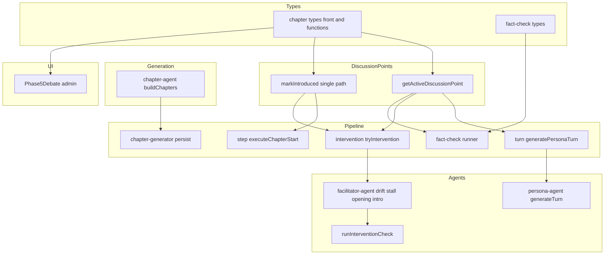
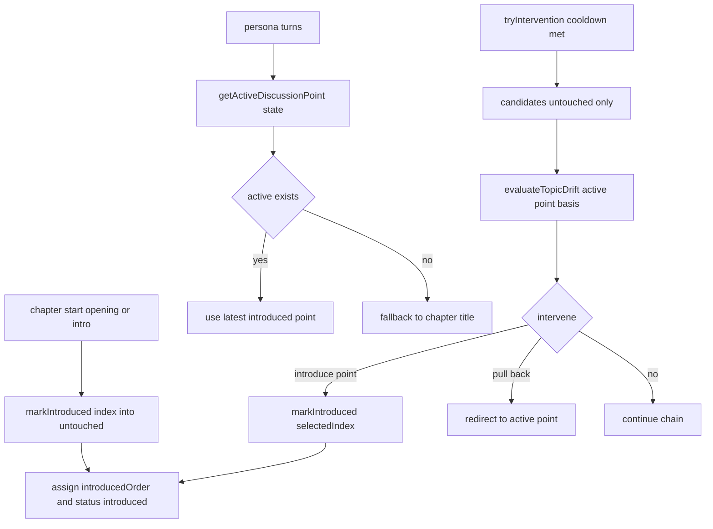
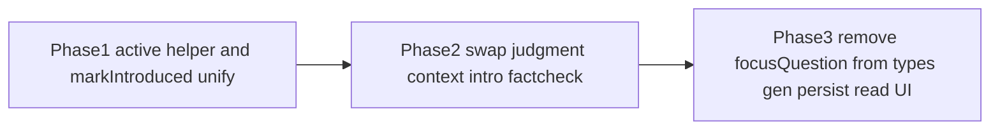

# Technical Design: discussion-point-consolidation

## Overview

本仕様は、章（Chapter）の `focusQuestion` を廃止し、章の「問い」を `discussionPoints` に一本化する。あわせて、ファシリテーターの誘導・論点ずれ（drift）・出尽くし（stall）判定、発言者への文脈提示、章導入、ファクトチェックの話題スコープを、すべて「いまアクティブな論点（最新の `introducedOrder` を持つ introduced 論点）」を基準に統一する。アクティブ論点が存在しない状況（論点ゼロの章、全論点 addressed）では章の `title` にフォールバックする。

**Purpose**: 「章の先頭の問い」が `focusQuestion` と `discussionPoints[0]` に二重化し、判断軸が広い `focusQuestion` に置かれている現状を解消し、判断・文脈・表示の軸を具体論点へ揃える。

**Impact**: 章データモデルから `focusQuestion` フィールドが消える。drift 判定は「章フォーカスからの逸脱」から「アクティブ論点からのずれ」へ変わる。発言者プロンプトへのアクティブ論点注入（実装済み）に判断側を整合させ、非対称を解消する。副次的に、介入で投入された論点が `introducedOrder` を持たない既存欠陥を是正する。

### Goals
- `focusQuestion` を型・生成・永続化・読み出し・表示から完全に除去する。
- 誘導・drift・stall・発言者文脈・章導入・ファクトチェックの軸をアクティブ論点に統一し、不在時は `title` にフォールバックする。
- 論点投入候補を未提示（untouched）に限定し、すべての introduced 遷移を `markIntroduced` 経由に一本化して `introducedOrder` を正しく付与する。
- `discussionPoints` を「専門知識のない一般人が日常感覚で理解できる問いの形」で生成する。

### Non-Goals
- `introducedOrder` 追跡機構そのものの再設計（既実装を再利用）。
- 論点 status 遷移アルゴリズム本体の変更（投入候補の絞り込みを除く）。
- 介入クールダウン・話者選択・engagement スコアリングの変更。
- 既存公開済み討論データの一括バックフィル／マイグレーション。

## Boundary Commitments

### This Spec Owns
- 章の「問い」の表現（`focusQuestion` 廃止、`discussionPoints` を単一の源泉とする）と、FE/functions 両側の章型定義の整合。
- アクティブ論点の解決規約（`getActiveDiscussionPoint`）と、各消費点での `title` フォールバックの適用。
- 論点投入候補の意味（untouched のみ）と、introduced 遷移の単一経路（`markIntroduced`）。
- drift/stall/誘導/章導入/発言者文脈/ファクトチェックスコープの判断軸の置換。

### Out of Boundary
- `introducedOrder` の採番・永続化の仕組み（既実装。再利用のみ）。
- 介入の発火タイミング・クールダウン・指名チェーン評価（`facilitator-intervention-timing` の領域）。
- engagement スコア・話者選択・キュー投入ロジック。
- Firestore 旧データのバックフィル。

### Allowed Dependencies
- 既実装のアクティブ論点追跡（`DiscussionPointState.introducedOrder`、`markIntroduced`、`saveDiscussionPointStatuses`）。
- 既存の介入カスケード（`tryIntervention` → drift → stall）と `runInterventionCheck`。

### Revalidation Triggers
- `DiscussionPointState` / `Chapter` 型形状の変更。
- 投入候補の意味（untouched 限定）の変更。
- `getActiveDiscussionPoint` の戻り値契約（不在時 `undefined`）の変更。
- `FactCheckContext` の `discussionScope` フィールド契約の変更。

## Architecture

### Existing Architecture Analysis
- 依存方向は一方向: `types` → `pipeline/debate/discussion-points`（純関数）→ `agents`（LLM 呼び出し）→ `pipeline/debate`（orchestrator/step/intervention/turn）→ UI。
- drift/stall の章ミッション文言は `runInterventionCheck` の単一地点（`facilitator-agent.ts:45-47`）で注入される。
- introduced 遷移は2経路に分裂: opening/intro は `markIntroduced`（`introducedOrder` 付与あり）、介入投入は `intervention.ts:182-190` の直接代入（`introducedOrder` 付与なし＝欠陥）。本設計で `markIntroduced` に一本化する。
- 型は FE（`src/lib/models/chapter`）と functions（`functions/src/types/chapter.types.ts`）で二重定義。両方を変更する。

### Architecture Pattern & Boundary Map



**Architecture Integration**:
- Selected pattern: **共通純関数 ＋ インプレース改修**（research Option B）。アクティブ論点解決を1関数に集約し、残りは各所のフィールド削除・プロンプト書き換え。
- Domain/feature boundaries: 「state からアクティブ論点を解決する」責務を `discussion-points.ts` に閉じ込め、`title` フォールバックは各ドメイン呼び出し側に置く（state 依存とドメイン文言依存を分離）。
- Existing patterns preserved: 介入カスケード、`runInterventionCheck` 単一注入点、`saveDiscussionPointStatuses` 永続経路、Result 型エラー。
- New components rationale: `getActiveDiscussionPoint` のみ新設（4箇所以上で必要な純関数。steering の「真に共通な処理はヘルパー化可」に合致）。
- Steering compliance: 過度な共通化を避け、ディスパッチャ化はしない。アロー関数・意味の通る命名・型の配置（FE は models、functions は types）に従う。

### Dependency Direction
`types` → `discussion-points`（純関数: `getActiveDiscussionPoint` / `markIntroduced`）→ `agents` → `pipeline`（turn/step/intervention/fact-check）→ UI。各層は左側のみを import する。`discussion-points` は Firestore 永続関数を同ファイルに持つが、純関数群は state のみに依存する。

## File Structure Plan

### Modified Files (functions)
- `functions/src/types/chapter.types.ts` — `Chapter` / `ChapterForFirestore` / `ChapterEntry` から `focusQuestion` 削除。
- `functions/src/types/fact-check.types.ts` — `FactCheckContext.focusQuestion` を `discussionScope: string` に置換。
- `functions/src/pipeline/debate/discussion-points.ts` — `getActiveDiscussionPoint(state)` 新設。`markIntroduced` の候補フィルタを `untouched` 基準に変更。
- `functions/src/pipeline/debate/chapter.ts` — `ChapterDocData` / `toChapterEntry` から `focusQuestion` 削除。
- `functions/src/pipeline/debate/turn.ts` — アクティブ論点算出を `getActiveDiscussionPoint` へ置換。`FactCheckContext` に `discussionScope`（active ?? title）。
- `functions/src/pipeline/debate/intervention.ts` — 投入候補を untouched 限定化。introduced 反映を `markIntroduced` 経由に統一（直接代入を廃止）。アクティブ論点を drift/stall に渡す。
- `functions/src/pipeline/debate/step.ts` — opening/intro の `markIntroduced` 呼び出しは維持（index 意味の整合を確認）。
- `functions/src/agents/facilitator-agent.ts` — `runInterventionCheck` / `evaluateTopicDrift` / `evaluateStallIntervention` / `generateOpening` / `generateChapterIntroduction` の focusQuestion 文言を active 論点基準へ。章導入の二重提示解消。
- `functions/src/agents/persona-agent.ts` — `chapterContext` から `focusQuestion` 行を削除（active 論点注入は実装済み、不在時 title）。
- `functions/src/agents/chapter-agent.ts` — `chapterResultSchema` から `focusQuestion` 削除。`buildChapters` の組み立てと生成プロンプトを「論点を well-formed な問いで生成」に変更。
- `functions/src/pipeline/chapters/chapter-generator.ts` — Firestore 書き込みから `focusQuestion` 削除。
- `functions/src/pipeline/fact-check/fact-check-runner.ts`・`fact-check-judge.ts` — focus 括弧を `discussionScope` 参照へ。`checkChapter` の context を `discussionScope: chapter.title`。

### Modified Files (front)
- `src/lib/models/chapter/chapter.types.ts` — `ChapterForFirestore` から `focusQuestion` 削除。
- `src/lib/features/admin/topic-detail/debate/Phase5Debate.svelte` — `focusQuestion` 表示を削除し `title` と `discussionPoints` を表示。

## System Flows

### アクティブ論点の解決と introduced 遷移



**Key Decisions**:
- すべての introduced 遷移が `markIntroduced` を通るため、介入投入論点にも `introducedOrder` が付き、`getActiveDiscussionPoint` が常に「最新に投入された論点」を返す。
- 投入候補は untouched のみ。候補リスト・`selectedDiscussionPointIndex`・`markIntroduced` の内部フィルタが同一 index 空間（untouched 順）を共有する。

## Requirements Traceability

| Requirement | Summary | Components | Interfaces | Flows |
|-------------|---------|------------|------------|-------|
| 1.1, 1.5 | Chapter から focusQuestion 廃止 | chapter.types(front/functions) | `Chapter` 型 | — |
| 1.2 | 永続化に focusQuestion を書かない | chapter-generator | persist | — |
| 1.3, 1.4 | 読み出しは discussionPoints/title のみ・旧データ無視 | chapter.ts | `toChapterEntry` | — |
| 2.1–2.4 | 論点を well-formed な問いで生成 | chapter-agent | `chapterResultSchema` / prompt | — |
| 3.1, 3.3 | active 論点からのずれで drift 判定・引き戻し | facilitator-agent, intervention | `runInterventionCheck`/`evaluateTopicDrift` | 介入フロー |
| 3.2 | active 論点へ誘導 | facilitator-agent | `runInterventionCheck` | — |
| 3.4 | 深化中は介入見送り | facilitator-agent | `evaluateTopicDrift` | 介入フロー |
| 4.1 | active 論点の出尽くし判定 | facilitator-agent | `evaluateStallIntervention` | 介入フロー |
| 4.2 | 投入候補から introduced 除外 | intervention | candidate(untouched) | 介入フロー |
| 4.3 | 投入不能時は引き戻し | facilitator-agent | `evaluateStallIntervention` | 介入フロー |
| 4.4 | 投入論点を introduced 化し active 化 | intervention, discussion-points | `markIntroduced` | introduced 遷移 |
| 5.1, 5.3 | 発言者に active 論点（不在時 title） | persona-agent, turn | `TurnGenerationContext` | active 解決 |
| 5.2 | 発言者文脈に focusQuestion を含めない | persona-agent | `chapterContext` | — |
| 6.1 | 章導入の二重提示解消 | facilitator-agent | `generateChapterIntroduction`/`generateOpening` | — |
| 6.2 | fact-check スコープ代替 | fact-check, turn | `FactCheckContext` | — |
| 6.3 | UI 表示の代替 | Phase5Debate | — | — |
| 7.1–7.3 | active 不在時の title フォールバック | discussion-points 呼び出し側 | `getActiveDiscussionPoint` | active 解決 |

## Components and Interfaces

| Component | Domain/Layer | Intent | Req Coverage | Key Dependencies (P0/P1) | Contracts |
|-----------|--------------|--------|--------------|--------------------------|-----------|
| getActiveDiscussionPoint | pipeline/discussion-points | state から最新 introduced 論点を解決 | 3, 5, 7 | DebateState (P0) | Service, State |
| markIntroduced (改) | pipeline/discussion-points | untouched 候補を introduced 化し順序採番。唯一の introduced 経路 | 4 | DebateState (P0) | Service, State |
| evaluateTopicDrift / evaluateStallIntervention (改) | agents/facilitator | active 論点基準で逸脱/出尽くしを判定 | 3, 4 | runInterventionCheck (P0), getActiveDiscussionPoint (P0) | Service |
| tryIntervention (改) | pipeline/intervention | 候補 untouched 限定・introduced 反映を markIntroduced 経由に | 4 | markIntroduced (P0), facilitator (P0) | Service |
| generateTurn / generatePersonaTurn (改) | agents/persona, pipeline | active 論点を文脈提示（不在時 title）・focusQuestion 削除 | 5 | getActiveDiscussionPoint (P0) | Service, State |
| buildChapters (改) | agents/chapter | 論点を well-formed な問いで生成・focusQuestion 削除 | 1, 2 | — | Service |
| FactCheckContext (改) | types/fact-check | focusQuestion を discussionScope に置換 | 6 | — | State |
| Chapter 型 (改) | types(front/functions) | focusQuestion 廃止 | 1 | — | State |
| Phase5Debate (改) | UI admin | focusQuestion 非表示・title/points 表示 | 6 | Chapter 型 (P1) | — |

### pipeline/discussion-points

#### getActiveDiscussionPoint

| Field | Detail |
|-------|--------|
| Intent | DebateState から最新 `introducedOrder` を持つ introduced 論点を返す純関数 |
| Requirements | 3.1, 3.2, 5.1, 7.1, 7.2 |

**Responsibilities & Constraints**
- `state.discussionPoints` のうち `status === 'introduced'` を `introducedOrder` 最大で選ぶ。該当なしは `undefined`。
- `title` フォールバックは含めない（呼び出し側の責務）。Firestore I/O を持たない純関数。
- 採番済みデータを前提とする（全 introduced 遷移を `markIntroduced` に一本化して order を必ず付与する）。デプロイ時点で進行中だった討論に残る順序未採番データの扱いは対象外とする。

**Dependencies**
- Inbound: turn / intervention / fact-check（active 論点が必要な各所）— purpose: 軸の解決 (P0)
- Outbound: なし

**Contracts**: Service [x] / State [x]

##### Service Interface
```typescript
const getActiveDiscussionPoint: (state: DebateState) => string | undefined;
```
- Preconditions: `state.discussionPoints` は読み出し済み（status 設定済み）。
- Postconditions: introduced が無ければ `undefined`。複数 introduced があれば `introducedOrder` 最大の `point` を返す。
- Invariants: state を変更しない。

**Implementation Notes**
- Integration: `turn.ts:199-212` の既存インライン算出をこの関数へ置換。呼び出し側は `getActiveDiscussionPoint(state) ?? chapter.title` でフォールバックを組む。
- Validation: 本仕様で全 introduced 経路が `markIntroduced` を通るため、デプロイ後に introduced 化される論点は必ず `introducedOrder` を持つ。
- Risks: 介入経路の `markIntroduced` 一本化が未完だと order 欠落で誤選択 → 同タスク内で一本化を先行。

#### markIntroduced（改修）

| Field | Detail |
|-------|--------|
| Intent | untouched 候補リストの index を introduced 化し `introducedOrder` を採番する唯一の経路 |
| Requirements | 4.2, 4.4 |

**Contracts**: Service [x] / State [x]

##### Service Interface
```typescript
const markIntroduced: (state: DebateState, index: number | undefined) => void;
```
- Preconditions: `index` は「untouched のみの候補リスト」上の位置（介入の `selectedDiscussionPointIndex`、opening/intro の 0）。
- Postconditions: 対象 untouched 論点が `introduced` になり `introducedOrder = max(existing)+1`。`index` 範囲外/undefined は no-op。
- Invariants: 既存 introduced/addressed の status は変えない。

**Implementation Notes**
- Integration: 内部フィルタを `status === 'untouched'` に変更。`intervention.ts:182-190` の直接代入を本関数呼び出しに置換。opening/intro（`step.ts:301,316`）は呼び出しを維持。
- Validation: 新章は全 untouched のため opening index=0 は「最初の論点」を指し挙動不変。
- Risks: フィルタ変更が opening/intro に波及 → ユニットテストで index 固定。

### agents/facilitator

#### runInterventionCheck / evaluateTopicDrift / evaluateStallIntervention（改修）

| Field | Detail |
|-------|--------|
| Intent | 章ミッション・drift・stall の判断軸を active 論点へ置換（不在時 title） |
| Requirements | 3.1, 3.2, 3.3, 3.4, 4.1, 4.3 |

**Contracts**: Service [x]

##### Service Interface
```typescript
// activeFocus = アクティブ論点 ?? chapter.title を呼び出し側で解決して渡す
const runInterventionCheck: (
  turns: DebateTurn[],
  personas: Persona[],
  currentChapter: Chapter | undefined,
  activeFocus: string | undefined,
  criteriaSection: string
) => Promise<Result<FacilitatorReply, PipelineError>>;

const evaluateTopicDrift: (
  turns: DebateTurn[],
  personas: Persona[],
  speakCount: Map<string, number>,
  currentChapter: Chapter | undefined,
  activeFocus: string | undefined,
  uncoveredDiscussionPoints: string[] | undefined,
  options?: { chainLength?: number }
) => Promise<Result<FacilitatorReply, PipelineError>>;
```
- Preconditions: `activeFocus` は呼び出し側（intervention）が `getActiveDiscussionPoint(state) ?? chapter.title` で解決済み。
- Postconditions: 章ミッション文言・「逸脱」判定文言が `activeFocus` 基準で構成される。`uncoveredDiscussionPoints` は untouched のみ。
- Invariants: 介入の発火タイミング・クールダウンは不変。

**Implementation Notes**
- Integration: `runInterventionCheck:45-47` の「フォーカス問い」文言を「いまの論点: ${activeFocus}」へ。criteria（`facilitator-agent.ts:122,127`）の「フォーカス問いから逸脱」を「いまの論点（activeFocus）からのずれ」へ。stall も同経路で active 基準。
- Validation: `activeFocus` 未解決（undefined）時は title が渡る前提。両者 undefined（論点ゼロかつ title 空）は介入見送り側に倒す（7.3）。
- Risks: 判断軸変更で介入頻度が変化 → デプロイ後にログ観測。

#### generateOpening / generateChapterIntroduction（改修）

| Field | Detail |
|-------|--------|
| Intent | 章導入の入口を先頭論点に一本化し、focusQuestion との二重提示を解消 | 
| Requirements | 6.1 |

**Contracts**: Service [x]

**Implementation Notes**
- Integration: `generateOpening:75-82` / `generateChapterIntroduction:219-231` の `focusQuestion` 切り口を削除し、`discussionPoints[0]` を唯一の入口にする。返却 `selectedDiscussionPointIndex` は untouched 候補上の index（新章は 0）。
- Validation: 論点ゼロ章では `title` を入口にし、`selectedDiscussionPointIndex` は `undefined`。
- Risks: 冒頭の平易さ（一般人が答えられる問い）品質 → 生成プロンプトに「専門用語・固有名詞を避ける」指示を維持。

### types

#### FactCheckContext（改修）

**Contracts**: State [x]

##### State Management
```typescript
type FactCheckContext = {
  topicTitle: string;
  chapterTitle: string;
  discussionScope: string; // active 論点 ?? chapterTitle
  currentDate: string;
};
```
- State model: focusQuestion を `discussionScope` 単一フィールドに置換。
- Producers: インライン（`turn.ts:236`）は `getActiveDiscussionPoint(state) ?? chapter.title`、章バッチ（`fact-check-runner.ts:306`）は `chapter.title`。
- Consumers: focus 括弧（`runner:63`, `judge:37`）は `discussionScope` を参照。

#### Chapter 型（front/functions, 改修）

**Contracts**: State [x]

**Implementation Notes**
- Integration: functions `Chapter`/`ChapterForFirestore`/`ChapterEntry` と front `ChapterForFirestore` から `focusQuestion` 削除。`ChapterDocData`/`toChapterEntry` の読み出しも削除。
- Validation: 旧 Firestore ドキュメントに残る `focusQuestion` は読み出しで参照しないため無視され、エラーにならない（1.4）。
- Risks: 二重定義の片側だけ変更すると型不整合 → 両側を同タスクで。

### UI

#### Phase5Debate（改修・summary-only）
- focusQuestion 表示（L158）を削除し、`title` と `discussionPoints` を表示する。新たな境界は導入しない。
- Implementation Note: 公開閲覧側は focusQuestion 非参照のため変更不要。

## Data Models

### Logical Data Model
- `Chapter`（ランタイム/永続）: `{ id, title, discussionPoints: string[], ... }`。`focusQuestion` を除去。
- `DiscussionPointState`: `{ point, status: untouched|introduced|addressed, introducedOrder? }`（既存。本仕様で全 introduced 経路が `introducedOrder` を採番）。
- `FactCheckContext`: `focusQuestion` → `discussionScope`。

### Physical Data Model (Firestore)
- `topics/{topicId}/chapters/{chapterId}`: 書き込みから `focusQuestion` を除外。`discussionPointStatuses`（`introducedOrder` 含む）は既存経路で永続化。
- 後方互換: 既存ドキュメントの `focusQuestion` フィールドは読まれなくなるだけで削除しない（バックフィルなし）。

## Error Handling

### Error Strategy
- LLM 呼び出しは既存どおり `Result<_, PipelineError>`（`AI_API_ERROR`, retryable）。本仕様で新たな失敗種別は追加しない。
- `getActiveDiscussionPoint` / `markIntroduced` は純関数で例外を投げず、境界値（不在・範囲外）は `undefined`/no-op で吸収する。

### Error Categories and Responses
- Business Logic: アクティブ論点も未提示論点も無い（7.3）→ 介入を見送り、エラーにせず評価完了。
- System: Firestore 読み出しで `focusQuestion` 欠如は正常系（旧→新移行）。

### Monitoring
- 介入発火（drift/stall・引き戻し/投入）のログを観測し、判断軸変更後の介入頻度の変化を `facilitator-intervention-timing` の知見と突き合わせる。

## Testing Strategy

### Unit Tests
- `getActiveDiscussionPoint`: introduced 複数時に最新 `introducedOrder` を返す／introduced 無しで `undefined`。
- `markIntroduced`（改）: untouched 候補 index で introduced 化＋順序採番、範囲外/undefined で no-op、既存 introduced を再採番しない。
- `intervention` 投入: 候補が untouched 限定であること、投入で `markIntroduced` 経由となり `introducedOrder` が付くこと。
- `evaluateTopicDrift`/`evaluateStallIntervention`: プロンプトに `activeFocus`（active 論点 or title）が含まれ、focusQuestion 文言が無いこと（LLM はモック、プロンプト文字列を検証）。
- `persona-agent`: 文脈に focusQuestion が含まれず、active 不在時に title が入ること。

### Integration Tests
- 章開始 → opening が先頭論点を introduced 化 → 後続ターンで active 論点が文脈に入る、の通し。
- 介入で untouched 論点を投入 → それが新しい active 論点になり drift 判定基準が更新される。
- fact-check（インライン/章バッチ）で `discussionScope` が active/title で埋まる。

### Regression
- 既存 `discussion-points.test.ts` / `chapter.test.ts` / `turn.test.ts` / `persona-agent.test.ts` を型・文言変更に追従。
- 旧 Firestore データ（focusQuestion あり・introducedOrder なし）の読み出しでエラーが出ないこと。

## Migration Strategy

タスク順序として段階導入する（research Option C）。Firestore スキーマのデータ移動は伴わない（フィールド廃止のみ・バックフィルなし）。



- Phase1: `getActiveDiscussionPoint` 追加・全 introduced 経路を `markIntroduced` に一本化（`focusQuestion` は残置、テスト緑）。
- Phase2: 誘導/drift/stall/章導入/発言者文脈/fact-check を active 論点基準へ付け替え（`focusQuestion` 併存可）。
- Phase3: 型・生成・永続・読み出し・UI から `focusQuestion` を物理削除。
- Rollback: 各 Phase はデプロイ単位。Phase3 まで進める前に介入頻度・生成品質を観測し、問題時は Phase2 状態で停止可能。
