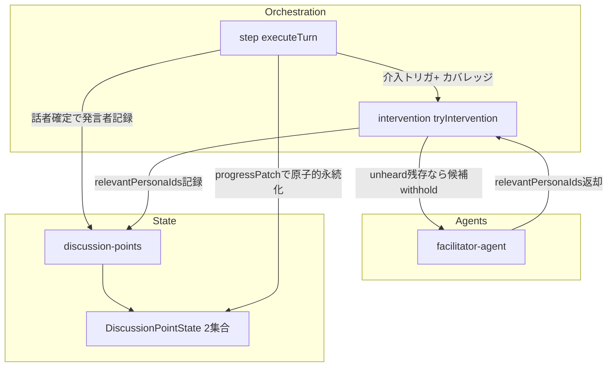
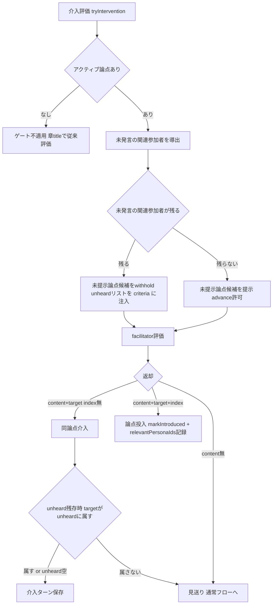

# Technical Design: discussion-point-standpoint-coverage

## Overview

**Purpose**: ファシリテーターが論点を「次へ進める／現論点を維持する」判断軸を、「直近応酬の新規性」から「立場のカバレッジ（その論点で立場を聞くべき参加者が出そろったか）」へ是正する。これにより「さまざまな立場の意見を聞く」というプロダクトの根幹を構造的に担保する。

**Users**: 討論コンテンツの閲覧者（多様な立場が各論点で実際に表明されてから次へ進む討論を読む）と、討論パイプラインの保守者（介入判断の挙動が状態から決まり予測可能になる）。

**Impact**: 各論点の状態（`DiscussionPointState`）に「発言済みペルソナ」と「関連参加者」の2集合を追加し、介入評価に立場カバレッジを注入する。前進可否は、未発言の関連参加者が残る間は未提示論点候補を withhold して論点投入を構造的に封じる既存パターンで強制する。新規のLLM呼び出し・新規アーキテクチャ層は追加しない。

### Goals
- 各論点について「立場を聞くべき関連参加者」と「立場を表明済みのペルソナ」を論点状態に記録する。
- 出尽くし判定を「直近応酬の新規性」と「立場カバレッジ」の二軸に分離し、未発言の関連参加者が残る限り前進させない。
- 未発言の関連参加者が残る間は、同論点を維持してその中の1人を引き込む介入を選ばせる。
- 連続指名チェーン長を「まず未発言者を引き込むべきシグナル」として解釈し直す。

### Non-Goals
- アクティブ論点追跡（最新 `introducedOrder`）・論点 status 遷移アルゴリズム本体の再設計。
- 介入クールダウン値・章強制終了ハードキャップの変更。
- engagement スコアリング・話者選択（キュー／スコア）本体の再設計。
- 発言内容からの立場・スタンスの分類（発言したか否かのみを扱う）。
- 既存公開データの一括バックフィル、フロントエンド表示の変更。

## Boundary Commitments

### This Spec Owns
- `DiscussionPointState` の `spokenPersonaIds` / `relevantPersonaIds` 2集合の定義・記録・永続化・復元。
- 立場カバレッジ（発言済み／未発言の関連参加者）の導出と、介入評価への注入。
- 前進可否のコードゲート（未発言の関連参加者が残る間は未提示論点候補を withhold する）。
- `evaluateTopicDrift` / `evaluateStallIntervention` / `generateOpening` のプロンプトと返却契約（`relevantPersonaIds` の判定・引き込み選択肢・chainSignal の解釈是正）。

### Out of Boundary
- `getActiveDiscussionPoint` / `markIntroduced` の introducedOrder 採番ロジック本体（呼び出し契約の拡張のみ owns）。
- 介入クールダウン・cap・engagement・話者選択の各定数とアルゴリズム。
- 指名チェーン中の介入評価ゲート（`facilitator-intervention-timing` 所有）の**発火条件そのもの**は変更しない。ただし発火後の**前進可否（次論点投入の採否）にはカバレッジ・ゲートを被せて上書きする**（`facilitator-intervention-timing` R2-3 の「出尽くし→次論点投入」より、未発言の関連参加者の引き込みを優先する）。

### Allowed Dependencies
- `discussion-point-consolidation`: アクティブ論点（最新 introduced）解決と出尽くし判定の土台。
- `facilitator-intervention-timing`: `countConsecutivePersonaTargets`・指名チェーン中の介入評価・cap 委譲。
- `facilitator-intervention-engagement-fix`: 介入ターン順序保証（介入はファシリテーターターンのみ保存、応答は次ターン）。
- 永続基盤: `addTurn`（runId 世代照合・単一勝者追記）、`ProgressPatch`、`saveDiscussionPointStatuses`。

### Revalidation Triggers
- `DiscussionPointState` / `ChapterForFirestore.discussionPointStatuses` のスキーマ変更。
- `FacilitatorReply` / `interventionSchema` の返却契約変更（`relevantPersonaIds` 追加）。
- `markIntroduced` のシグネチャ変更。
- persona-chain 経路の前進可否にカバレッジ・ゲートを被せる点（`facilitator-intervention-timing` の挙動を一部上書き）。

## Architecture

### Existing Architecture Analysis
討論は一方向依存（`debate-orchestrator` → `step` → `intervention` / `facilitator-agent` / `discussion-points`）。介入は `tryIntervention` が drift→stall のカスケードで評価し、`markIntroduced` が論点 introduced 化の単一遷移点。論点状態は `DiscussionPointState[]` として state に載り、`discussionPointStatuses` 経由で永続化・resume 復元される。既存に「未提示論点候補を withhold して論点投入を封じる」手法（高意欲ゲート）があり、本仕様のカバレッジ・ゲートはこれと同型で実装する。

### Architecture Pattern & Boundary Map



**Architecture Integration**:
- Selected pattern: 既存パイプラインへの **状態拡張＋ゲート注入**（新層なし）。
- Domain boundaries: 「カバレッジの状態」は `discussion-points`（state）が所有、「ゲート判断」は `intervention`、「関連判定・文面」は `facilitator-agent`。
- Existing patterns preserved: 候補 withhold ゲート、`markIntroduced` 単一遷移、`ProgressPatch` 原子的永続化、介入ターン順序保証。
- New components rationale: 新規コンポーネントは無し。純関数（未発言者導出）と更新関数（発言者記録）を `discussion-points` に追加するのみ。
- Steering compliance: アロー関数、過度な共通化なし、型は該当モジュールに直接、`*ForFirestore` 命名と非衝突。

### Technology Stack

| Layer | Choice / Version | Role in Feature | Notes |
|-------|------------------|-----------------|-------|
| Backend / Services | TypeScript (Firebase Functions), Vercel AI SDK `generateObject` + `@ai-sdk/anthropic` | 関連参加者判定・介入文面生成（既存呼び出しに相乗り） | 新規依存なし |
| Data / Storage | Firestore（`topics/{id}/chapters/{id}.discussionPointStatuses`） | 2集合の永続化・resume 復元 | optional 追加で後方互換 |

## Data Models

### DiscussionPointState 拡張

```typescript
export type DiscussionPointState = {
  point: string;
  status: DiscussionPointStatus; // untouched | introduced | addressed
  introducedOrder?: number;
  spokenPersonaIds?: string[];    // 当該論点で発言済みのペルソナID（集合・重複なし）
  relevantPersonaIds?: string[];  // 当該論点で立場を聞くべき関連参加者ID（論点投入時に記録）
};
```

**Consistency & Integrity**:
- 両フィールドは optional。欠損（既存データ）は空配列として扱う（1.7）。
- `spokenPersonaIds` は集合意味論（重複追加は no-op、冪等）。
- `relevantPersonaIds` は `markIntroduced` 時に一度だけ記録（任意で介入評価時に追加のみ可・削除不可、5.2）。
- 派生値「未発言の関連参加者」= `relevantPersonaIds − spokenPersonaIds`（純関数で都度導出、永続化しない）。
- **型の一貫性（必須）**: `DiscussionPointState` はランタイム（`state.discussionPoints`）と永続（`ChapterForFirestore.discussionPointStatuses`）で共有する単一の型。本specの拡張で **ランタイム型＝Firestore構造** を保つため、型追加・`saveDiscussionPointStatuses` の書き出し・resume 復元の3点に同じ2フィールドを必ず通し、「ランタイムにあるが永続されないフィールド」を作らない。
- 永続経路: `saveDiscussionPointStatuses(topicId, chapterId, state)` が `state.discussionPoints` から `discussionPointStatuses` を書き出す（永続型からそのまま書く既存手段）。本specの新データは `ProgressPatch`（章ドキュメントのPartial転送形）に載せず、この state ベースの書き出しで永続化する。resume は `debate-orchestrator` の既存復元で同型のまま state に戻る。

## System Flows

### 介入評価におけるカバレッジ・ゲート



**Key Decisions（前進ゲートは2段で効かせる）**:
- **誘導（プロンプト側）**: unheard 残存時は未提示論点候補を withhold し、LLM に論点投入（選択肢2）を選ばせない。
- **強制（コード側・必須）**: `markIntroduced` は渡した候補ではなく state の untouched から index を解決するため、候補を隠すだけでは LLM が index を返すと advance してしまう。よって unheard 残存時は `markIntroduced` 呼び出し前に `selectedDiscussionPointIndex` を **コードで undefined に落とす**（2.5 のコードゲートの実体）。withhold は誘導、index-drop が強制。
- unheard 残存時は介入を index 無し（同論点）に確定し、その target が未発言の関連参加者に属することを検証する（3.4）。属さなければ見送り扱いで通常フローへ。
- chainLength は「未発言者を引き込むべきシグナル」として criteria に渡す。unheard 残存時は withhold が優先するため、出尽くし即断には働かない（4.1–4.3）。

### 発言済みペルソナの記録（通常ターン）

ターンがコミットされた後（`finalizeCommittedTurn`、`topicId` / `chapterId` / `state` / `reply.personaId` を保持）に、`recordSpeakerOnActivePoint(state, reply.personaId)` で現アクティブ論点の `spokenPersonaIds` へ話者を冪等追加し、`saveDiscussionPointStatuses(topicId, chapterId, state)` で永続化する（`updateSpeakerStats` と同じ位置）。`ProgressPatch` 経由ではなく state ベースの書き出しを用いる（型の一貫性のため）。集合のため重複は無視され、resume 復元後も冪等（1.2–1.4, 1.6）。

トレードオフ: 通常ターンごとに `discussionPointStatuses` の書き込みが1回増える（ターン追記とは別書き込み）。これは介入経路の既存挙動（`step.ts:230` の `saveDiscussionPointStatuses`）と同じで、Partial転送形への依存を避けるための意図的な選択。永続が追記と非原子のため、追記コミット直後にクラッシュすると当該話者の記録が欠落しうるが、resume 時に「未発言」と見なされ再度引き込まれるだけで自己回復的（介入経路と同じ特性）。

## Requirements Traceability

| Requirement | Summary | Components | Interfaces | Flows |
|-------------|---------|------------|------------|-------|
| 1.1, 1.6, 1.7 | 2集合の保持・永続・欠損フォールバック | DiscussionPointState, discussion-points | `saveDiscussionPointStatuses` | データモデル |
| 1.2, 1.3, 1.4 | 発言コミット時に発言者を冪等記録 | step.executeTurn, discussion-points | `recordSpeakerOnActivePoint` | 発言記録フロー |
| 1.5 | 未発言の関連参加者を導出し注入 | intervention, discussion-points | `getUnheardRelevant` | ゲートフロー |
| 1.8 | アクティブ論点不在でゲート不適用 | intervention | `tryIntervention` | ゲートフロー |
| 2.1, 2.4 | 新規性×カバレッジの二軸評価 | facilitator-agent | `evaluateTopicDrift` / `evaluateStallIntervention` criteria | ゲートフロー |
| 2.2 | 充足かつ新規性なしで前進 | intervention, facilitator-agent | 候補 expose | ゲートフロー |
| 2.3, 2.5 | 未発言残存で前進不可（コードゲート） | intervention | 候補 withhold | ゲートフロー |
| 3.1, 3.2, 3.3 | 同論点で未発言者を引き込む | facilitator-agent | 引き戻し／引き込みプロンプト | ゲートフロー |
| 3.4 | 引き込み先のunheard所属検証 | intervention | `validateBringInTarget` | ゲートフロー |
| 3.5 | 介入ターン順序保証 | intervention | `persistInterventionTurn`（既存） | — |
| 4.1, 4.2, 4.3 | chainLengthの解釈是正 | facilitator-agent, intervention | `chainSignal` criteria | ゲートフロー |
| 5.1, 5.2 | 関連集合の範囲・追加のみ可 | facilitator-agent | `relevantPersonaIds` 返却契約 | — |
| 5.3 | 引き込み→応答でカバレッジ単調充足 | step | 発言記録 | 発言記録フロー |
| 5.4 | 無限滞留防止（cap 委譲） | （既存 cap） | — | — |
| 6.1–6.5 | 既存挙動・隣接仕様の維持 | 全コンポーネント | 既存契約不変 | — |

## Components and Interfaces

| Component | Domain/Layer | Intent | Req Coverage | Key Dependencies | Contracts |
|-----------|--------------|--------|--------------|------------------|-----------|
| discussion-points | State | 2集合の記録・導出・永続化 | 1, 5 | DiscussionPointState (P0) | Service, State |
| intervention | Orchestration | カバレッジ・ゲートと target 検証 | 1, 2, 3, 4 | discussion-points (P0), facilitator-agent (P0) | Service |
| facilitator-agent | Agents | 関連判定・二軸プロンプト・chainSignal | 2, 3, 4, 5 | Vercel AI SDK (P0) | Service |
| step.executeTurn | Orchestration | 発言者記録の配線 | 1, 5 | discussion-points (P0) | Service |
| DiscussionPointState | Types | 2集合の型 | 1 | — | State |

### State

#### discussion-points

| Field | Detail |
|-------|--------|
| Intent | 論点状態の2集合を記録・導出・永続化する純関数群 |
| Requirements | 1.1, 1.2, 1.3, 1.4, 1.5, 1.6, 5.2 |

**Responsibilities & Constraints**
- `markIntroduced` 拡張: introduced 化と同時に `relevantPersonaIds` を記録、`spokenPersonaIds` を空初期化。
- 発言者記録・未発言者導出の純関数を提供（I/O なし、state 不変は記録関数のみ mutate）。
- `saveDiscussionPointStatuses` の書き出しに2集合を含める。

**Contracts**: Service [x] / State [x]

##### Service Interface
```typescript
// 論点投入時に introduced 化し、関連参加者を記録、発言済みを空初期化する
export const markIntroduced: (
  state: DebateState,
  index: number | undefined,
  relevantPersonaIds?: string[]
) => void;

// 発言コミット時、現アクティブ論点の spokenPersonaIds に話者を冪等追加する（集合）
export const recordSpeakerOnActivePoint: (
  state: DebateState,
  personaId: string
) => void;

// 現アクティブ論点の未発言の関連参加者（relevantPersonaIds − spokenPersonaIds）を返す。
// アクティブ論点が無い、または relevantPersonaIds が空なら空配列。
export const getUnheardRelevant: (state: DebateState) => string[];
```
- Preconditions: `personaId` は参加者リストの有効ID。`relevantPersonaIds` は有効IDへフィルタ済み。
- Postconditions: `recordSpeakerOnActivePoint` 後、当該論点 `spokenPersonaIds` に `personaId` を含む（重複なし）。
- Invariants: 永続化しない派生値は `getUnheardRelevant` のみ。`relevantPersonaIds` は削除されない。

**Implementation Notes**
- Integration: `markIntroduced` は `tryIntervention`（介入投入）と open ステップ（opening）から呼ばれ、いずれも直後に `saveDiscussionPointStatuses` で永続化する既存経路に乗る（`relevantPersonaIds` も同時に永続化）。`recordSpeakerOnActivePoint` は `finalizeCommittedTurn`（ターンコミット後）で呼び、続けて `saveDiscussionPointStatuses` を呼ぶ。
- Validation: `relevantPersonaIds` は記録前に参加者IDへフィルタ。
- Risks: freeze 経路では論点が概ね addressed のため記録は任意（記録しても無害）。永続は追記と非原子（state ベース書き出しのため）だが介入経路と同特性で自己回復的。

#### intervention

| Field | Detail |
|-------|--------|
| Intent | カバレッジ・ゲート（候補 withhold）と引き込み target 検証 |
| Requirements | 1.5, 1.8, 2.2, 2.3, 2.5, 3.4, 4.1 |

**Responsibilities & Constraints**
- 介入評価前に `getUnheardRelevant(state)` を算出。
- 未提示論点候補の出し分け: `(hasHighEngagement(engagements) || unheardRelevant.length > 0) ? [] : untouchedDiscussionPoints`（no-target / persona-chain 両経路）。＝プロンプト誘導。
- **index-drop ガード（必須）**: `unheardRelevant.length > 0` のとき、`markIntroduced` 呼び出し前に LLM 返却の `selectedDiscussionPointIndex` を undefined に落とす。候補 withhold だけでは `markIntroduced` が state の untouched から index を解決して advance しうるため、これが前進阻止の実体（2.5）。
- unheard を criteria 用にファシリテーターへ渡す（名前解決）。chainLength を未発言者優先シグナルとして渡す。
- 返却採用時、unheard 残存かつ index 無し介入は target が unheard に属することを検証（属さなければ不採用＝false）。

**Contracts**: Service [x]

##### Service Interface
```typescript
// 既存 tryIntervention にカバレッジ導出とゲートを内蔵（シグネチャは不変）。
// 内部で getUnheardRelevant を算出し、候補リストと criteria を出し分ける。
// 既存の戻り値（介入が発火したか boolean）は不変。

// 引き込み採用判定（unheard 残存時のみ所属必須）
const isAdoptableBringIn: (
  targetPersonaId: string | undefined,
  unheardRelevant: string[]
) => boolean;
```
- Preconditions: `tryIntervention` のクールダウン・トリガー枠組みは不変（6.1）。
- Postconditions: unheard 残存中はコードが `selectedDiscussionPointIndex` を undefined に落とすため `markIntroduced` に index が渡らない（advance 不可）。
- Invariants: 介入ターンは `persistInterventionTurn` 経由で1ターンのみ保存（順序保証・冪等は既存、3.5, 6.5）。

**Implementation Notes**
- Integration: drift→stall カスケード（no-target）と drift のみ（persona-chain）の両分岐で候補出し分けを適用。
- Validation: `validPersonaId` に加え、unheard 残存時は unheard 所属チェック。
- Risks: LLM が見送り続けると前進が遅れる → cap が最終保証（5.4）。

### Agents

#### facilitator-agent

| Field | Detail |
|-------|--------|
| Intent | 関連参加者の判定、二軸出尽くし判定、引き込みプロンプト、chainSignal 是正 |
| Requirements | 2.1, 2.4, 3.1, 3.2, 3.3, 4.1, 4.2, 4.3, 5.1, 5.2 |

**Responsibilities & Constraints**
- `generateOpening` と介入評価（`interventionSchema`）が `relevantPersonaIds` を返す（論点投入時に「この論点で立場を聞くべき参加者」を判定、全員を一律に含めない）。
- 候補が無い（withhold された）ときの引き戻し系プロンプトを「未発言の関連参加者を1人指名して引き込む」へ拡張（criteria の unheard リストを使用）。
- chainSignal を「まず未発言者を引き込む」方向の文面へ是正。

**Contracts**: Service [x]

##### Service Interface
```typescript
// FacilitatorReply / interventionSchema に relevantPersonaIds を追加
export type FacilitatorReply = {
  content?: string;
  targetPersonaId?: string;
  selectedDiscussionPointIndex?: number;
  relevantPersonaIds?: string[]; // 論点投入時に判定（opening / 介入）
};
```
- Preconditions: 介入評価は呼び出し側から unheard リスト・chainLength・候補（出し分け済み）を受け取る。
- Postconditions: 候補未提示時は `selectedDiscussionPointIndex` を返さない。
- Invariants: 中立性システムプロンプト・2〜3文制約・履歴窓（直近20ターン）は不変。unheard は構造シグナルとして渡るため窓外の序盤発言者も正しく扱える。

**Implementation Notes**
- Integration: `runInterventionCheck` の `interventionSchema` に `relevantPersonaIds` を追加し、`evaluateTopicDrift` / `evaluateStallIntervention` / `generateOpening` の criteria を拡張。
- Validation: 返却 `relevantPersonaIds` は呼び出し側で参加者IDへフィルタ。
- Risks: `relevantPersonaIds` が空のときはゲート不活性（現行挙動。全員フォールバックしない）。

## Error Handling

### Error Strategy
- 既存の `Result<FacilitatorReply, PipelineError>` を踏襲。LLM呼び出し失敗は `AI_API_ERROR`（retryable）として既存どおり伝播。
- 不正・自己・非参加者IDの target は既存 `validPersonaId` で無効化（6 既存挙動維持）。
- 既存永続データの集合欠損は空配列フォールバックで吸収（1.7）。`undefined` を直接走査せず必ず `?? []` を介す。

### Error Categories and Responses
- Business Logic（カバレッジ未充足での前進要求）: 候補 withhold により構造的に発生させない（先回り防止）。
- Idempotency: 発言者記録は集合追加で冪等。resume 後の再記録も無害。

### Monitoring
- 既存の討論パイプラインログに準拠（新規メトリクスは追加しない）。

## Testing Strategy

### Unit Tests
- `recordSpeakerOnActivePoint`: アクティブ論点へ冪等追加、論点不在時は no-op。
- `getUnheardRelevant`: `relevantPersonaIds − spokenPersonaIds`、空 relevant / 集合欠損で空配列。
- `markIntroduced`: introduced 化と同時に `relevantPersonaIds` 記録・`spokenPersonaIds` 空初期化。
- `isAdoptableBringIn`: unheard 残存時の所属必須、unheard 空時は常に採用可。
- `saveDiscussionPointStatuses`: 2集合の書き出しと欠損時の後方互換。

### Integration Tests
- ゲート: 未発言の関連参加者が残る状態で介入評価 → 論点投入（index）が起きず同論点が維持される（`debate-parity` 系に追加）。
- カバレッジ充足: 関連参加者全員が発言済み → advance 候補が提示され次論点投入が起こりうる。
- 順序保証: 引き込み介入はファシリテーターターンのみ保存し応答は次ターン（既存 engagement-fix 不変）。
- resume: `discussionPointStatuses` から2集合が復元され、記録が二重化しない。

### Performance/Load
- 通常ターンごとの `saveDiscussionPointStatuses` 追加書き込みが1回に収まる（多重書き込みしない）ことを確認。介入経路の既存書き込みと同じ粒度。
