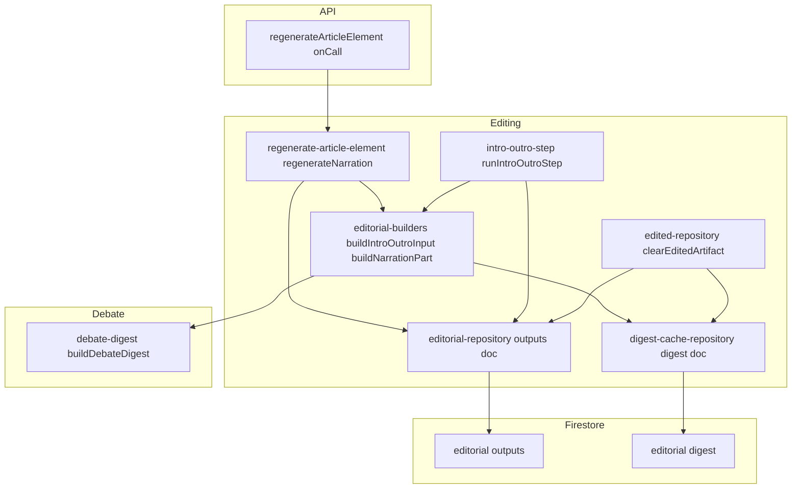
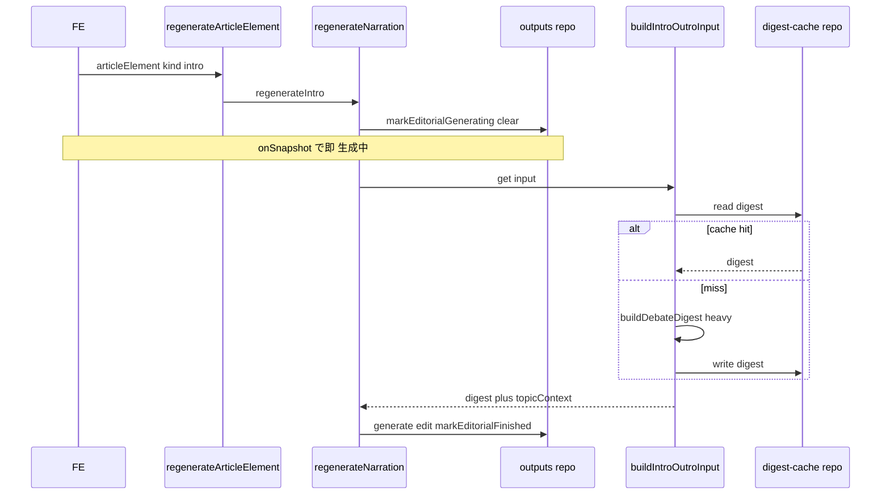
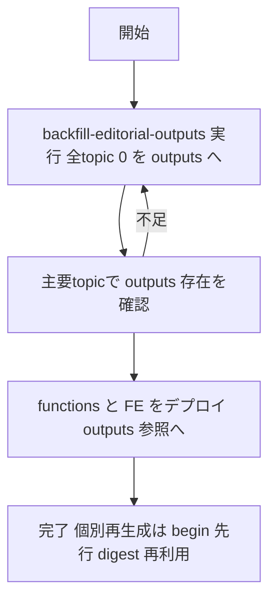

# Technical Design: editing-pass-regeneration-efficiency

## Overview

**Purpose**: 編集工程（記事要素＝導入・締め・所感の再生成）の「処理順序」「ステータス管理」「討論ダイジェストの再計算」を整え、再生成の体感と効率を改善する。

**Users**: 管理画面で記事を編集する編集者（個別再生成の即時フィードバックと待ち時間短縮を受ける）。

**Impact**: (1) 導入・締めの再生成で「生成中」を押下直後に反映する。(2) 討論ダイジェストを `editorial/digest` に保存して再利用し、毎回の再計算を無くす。(3) 編集成果物ドキュメントを `editorial/0` から `editorial/outputs` へ改名し、digest と名前付きで分離する（既存データは backfill で移行）。

### Goals
- 再生成トリガー直後に、重い前処理より前に当該要素を「生成中」にする（R1/R4）。
- 討論ダイジェストを保存・再利用し、討論が変わらない限り再構築を避ける（R5）。
- 編集成果物とダイジェストを名前付きの別ドキュメントに分け、既存データを壊さず移行する（R6）。

### Non-Goals
- 新しいステータス種別の追加、FE 表示ロジックの刷新。
- 章（chapter）の編集ステータスの新設。
- 生成・整えの品質やプロンプト内容の変更。
- 討論バージョンをキーにした厳密なキャッシュ無効化（案B）。本 spec は案A を採る。

## Boundary Commitments

### This Spec Owns
- 記事要素（導入・締め・所感）の再生成における処理順序（begin 先行）とステータス書き込みの最小性。
- 討論ダイジェストのキャッシュ（保存・再利用・無効化）。保存先ドキュメント `topics/{id}/editorial/digest` の所有。
- 編集成果物ドキュメントのパス命名（`editorial/outputs`）と、`editorial/0 → editorial/outputs` の移行。

### Out of Boundary
- `DebateDigest` の中身・構築ロジック（`buildDebateDigest`）そのもの。本 spec は保存/再利用のみ足す。
- editorial ステータス機構の**振る舞い**（生成待ち/生成中/整え中/完了の意味論）。既存 spec `editorial-element-status` が所有。本 spec は呼び出し順序と命名だけ整える（振る舞いは変えない）。
- 章の編集・ステータス。

> 命名整理（下記「命名整理」節）で、editorial（導入・締め・所感）を指す識別子から `Element` を排し `Editorial…` に統一する。既存 spec 由来の識別子（現行 `EditorialElementStatus` 等）も対象に含む。振る舞いを変えない機械的リネームで、本 spec で一括実施する。

### Allowed Dependencies
- `buildDebateDigest`（読み取り専用の入力構築）。
- `clearEditedArtifact`（無効化フックとして相乗り）。
- `firestore.rules` の既存ワイルドカード `match /editorial/{docId}`（変更しない）。

### Revalidation Triggers
- `EditorialForFirestore` の形が変わる（本 spec は形を変えず doc パスのみ変更）。
- `editorial/outputs` のパス命名を再度変える。
- `DebateDigest` の型変更（キャッシュのシリアライズに影響）。
- `clearEditedArtifact` の呼び出し元が増減する（無効化網の範囲が変わる）。

## 命名整理（Naming Cleanup）

**原則**: 識別子で **`Element` を単独で使わない**。常に完全な語で書く。
- editorial（導入・締め・所感）を指すもの → **`Editorial`**（`EditorialElement` は用いない）。
- 記事全体の再生成単位（章＝討論＋導入＋締め＋所感） → **`ArticleElement`**（`Element` に省略しない）。
- 理由: `Element` は一般用語すぎて、単独では何を指すか分からない。加えて `EditorialElement` と `ArticleElement` の2つがあると `Element` と略して両者を混同する。片方を `Editorial` にし、もう片方は省略を禁じることで、意味不明な `Element` 単独の語を消す。

### 改名（本 spec で実施・振る舞いは不変）
| 現行 | 変更後 | 種別 |
|------|--------|------|
| `ElementWriter` | `EditorialWriter` | 型（editorial 1つの段階書き込みハンドル） |
| `element-builders.ts` | `editorial-builders.ts` | ファイル |
| `begin()` | `markEditorialGenerating()` | メソッド（editorial を生成中にする＋旧内容クリア） |
| `toEditing(draft)` | `markEditorialEditing(draft)` | メソッド（整え中にする） |
| `finish({draft, final})` | `markEditorialFinished({draft, final})` | メソッド（完了にする） |
| `EditorialElementStatus` | `EditorialStatus` | 型 |
| `finalizePendingEditorialElements` | `finalizePendingEditorials` | 関数 |
| `regenerate-element.ts` | `regenerate-article-element.ts` | ファイル（`ArticleElement` を扱うので省略しない） |
| 変数/引数 `element`（型 `ArticleElement`） | `articleElement` | 変数（api/editing.ts、FE createTopic・EditingPage） |
| コメント「記事要素」（editorial だけを指す箇所） | 「editorial（導入・締め・所感）」 | コメント |

### そのまま維持
- `ArticleElement` 型（章＋導入＋締め＋所感の union）、`regenerateArticleElement`（API・FE。完全形なので可）。
- `narrationWriter` / `impressionWriter` / `buildNarrationPart` / `buildImpressionPart`（`Narration` / `Impression` 由来で `Element` を含まないため対象外）。

> 以降の本ドキュメントは変更後の名称（`EditorialWriter` / `markEditorialGenerating` / `regenerate-article-element.ts` 等）で記述する。

## Architecture

### Existing Architecture Analysis
- リポジトリ層は blind write（部分上書き）中心。`runTransaction` は世代ガードが要る箇所（`finalizeEditingRun`/`stopEditingRun`）のみ。ステータス変更はこの原則どおり単一 `update` で行われており R2 は現状充足。
- editorial の段階書き込みは `EditorialWriter`（旧 `ElementWriter`）の markEditorialGenerating→markEditorialEditing→markEditorialFinished に集約。本 spec は生成中切替（markEditorialGenerating）の**呼び出し位置**だけ変える（ハンドル契約は不変）。
- `clearEditedArtifact` は上流変更（討論・ペルソナ・章・fact）と編集ラン開始のすべてから呼ばれる中央無効化点。

### Architecture Pattern & Boundary Map



**Architecture Integration**:
- Selected pattern: 既存のレイヤード（Types → Repository → Builders → Step/Regenerate → API → FE）への局所拡張。
- Domain/feature boundaries: 成果物ドキュメント（outputs）とキャッシュ（digest）を別リポジトリ・別ドキュメントに分離。digest は FE に配信しない。
- Existing patterns preserved: blind write / `EditorialWriter` の markEditorialGenerating→markEditorialEditing→markEditorialFinished / `clearEditedArtifact` 中央無効化。
- New components rationale: `digest-cache-repository`（digest の read/write/clear を所有し責務を分離）。
- Steering compliance: 単一 set・非トランザクション（conventions）、再生成は開始時に即時反映（regenerate-immediate-clear）、backfill はコミットして残す（使い捨て禁止）。

### Dependency Direction
`types` → `editorial-repository` / `digest-cache-repository` → `editorial-builders` → `intro-outro-step` / `regenerate-article-element` → `api` → `FE stores/models`。左のレイヤーのみ import。`edited-repository.clearEditedArtifact` は `digest-cache-repository` に依存（無効化）。

## Technology Stack

| Layer | Choice / Version | Role in Feature | Notes |
|-------|------------------|-----------------|-------|
| Backend / Services | Firebase Functions v2 (Node, TypeScript) | 再生成・一括ラン・キャッシュ・移行 | 既存スタック |
| Data / Storage | Cloud Firestore | `editorial/outputs`・`editorial/digest` | blind write。rules はワイルドカードで変更不要 |
| Frontend | SvelteKit + `@14ch/svelte-ui` | outputs doc の購読/読み取りパス更新 | 表示ロジックは変えない |
| Infrastructure | 手動 `firebase deploy`（Claude は実行しない） | backfill → deploy の順序 | project-knowledge.md 準拠 |

## File Structure Plan

> 命名は「命名整理」節の変更後名称で記す（`EditorialWriter` / `markEditorial…` / `editorial-builders.ts` / `regenerate-article-element.ts` / `EditorialStatus` / `finalizePendingEditorials`）。

### Modified Files
- `functions/src/pipeline/editing/editorial-repository.ts` — `editorialRef` を `editorial/0` → `editorial/outputs` に変更。`ElementWriter` 型を `EditorialWriter` に、メソッドを `markEditorialGenerating` / `markEditorialEditing` / `markEditorialFinished` に改名。
- `functions/src/pipeline/editing/editorial-builders.ts`（旧 `element-builders.ts`・改名）— `buildIntroOutroInput` を digest キャッシュ対応。`buildNarrationPart` から `markEditorialGenerating()` の呼び出しを除去（生成中への切替は呼び出し側が持つ契約に変更）。
- `functions/src/pipeline/editing/regenerate-article-element.ts`（旧 `regenerate-element.ts`・改名）— `regenerateNarration` を「`markEditorialGenerating()` → `buildIntroOutroInput` → `buildNarrationPart`」の順に組み替え。
- `functions/src/pipeline/editing/intro-outro-step.ts` — 未生成の editorial に `markEditorialGenerating()` を digest 構築より前に行い、builder の切替除去に追随。
- `functions/src/pipeline/editing/edited-repository.ts` — `clearEditedArtifact` に digest キャッシュ削除を追加（案A 無効化）。
- `functions/src/pipeline/editing/editing-lifecycle.ts` — `finalizePendingEditorialElements` を `finalizePendingEditorials` に改名。
- `functions/src/types/editorial.types.ts` — `EditorialElementStatus` を `EditorialStatus` に改名。editorial だけを指すコメントの「記事要素」を「editorial」に是正。
- `functions/src/api/editing.ts` — 変数/引数 `element`（型 `ArticleElement`）を `articleElement` に改名。
- `src/lib/stores/editorial.svelte.ts` / `src/lib/stores/topics.svelte.ts` / `src/lib/models/published/published-article/published-article.ts` — 参照 doc を `'0'` → `'outputs'` に変更。`EditorialElementStatus` 参照を `EditorialStatus` に、`element` 引数を `articleElement` に追随改名（FE `createTopic.svelte.ts` / `EditingPage.svelte` 含む）。

### New Files
- `functions/src/pipeline/editing/digest-cache-repository.ts` — digest 専用リポジトリ（read/write/clear）。
- `functions/src/scripts/backfill-editorial-outputs.ts` — 全トピックの `editorial/0` を `editorial/outputs` へコピーする冪等 backfill（コミットして残す）。

## System Flows

### 個別再生成（導入・締め）: begin 先行 + キャッシュ再利用（R1/R5）


### 無効化（案A）
上流変更・編集ラン開始 → `clearEditedArtifact` → (a) `clearEditorial`（outputs リセット）(b) editedChapters 削除 (c) **digest キャッシュ削除（新規）**。次回の `buildIntroOutroInput` が再構築して保存し直す。

## Requirements Traceability

| Requirement | Summary | Components | Interfaces | Flows |
|-------------|---------|------------|------------|-------|
| 1.1, 1.2, 4.1, 4.2 | 重い前処理より前に生成中へ（順序統一） | regenerate-article-element, intro-outro-step, editorial-builders | `buildNarrationPart`（切替除去）, `EditorialWriter.markEditorialGenerating` | 個別再生成フロー |
| 1.3 | 生成中を FE が判別可能 | editorial-repository（outputs）, FE stores | onSnapshot（既存） | — |
| 2.1, 2.2 | ステータス変更は単一書き込み・非トランザクション | editorial-repository | `narrationWriter.begin`（既存 update） | — |
| 3.1, 3.2 | 前処理失敗時に終端へ | regenerate-article-element, intro-outro-step | `EditorialWriter.markEditorialFinished` / `finalizePendingEditorials` | 無効化/スイープ |
| 5.1, 5.2, 5.3, 5.4 | ダイジェスト保存・再利用・無効化 | digest-cache-repository, editorial-builders, edited-repository | `DigestCache`（read/write/clear） | 再利用/無効化フロー |
| 6.1, 6.2 | outputs / digest を別ドキュメントに | editorial-repository, digest-cache-repository | doc paths | — |
| 6.3, 6.4, 6.5 | 既存データ移行（backfill） | backfill-editorial-outputs | Batch/Job | Migration Strategy |

## Components and Interfaces

| Component | Domain/Layer | Intent | Req Coverage | Key Dependencies | Contracts |
|-----------|--------------|--------|--------------|------------------|-----------|
| digest-cache-repository | Repository | digest の保存/読取/無効化を所有 | 5.1–5.4, 6.2 | Firestore (P0) | Service, State |
| editorial-builders (mod) | Builders | 生成中切替の呼び出し側移管＋キャッシュ対応入力構築 | 1.x, 4.x, 5.1, 5.2 | digest-cache (P0), buildDebateDigest (P0) | Service |
| regenerate-article-element (mod) | Step | 生成中切替を先行させる順序に組み替え | 1.x, 3.1, 4.x | editorial-repo (P0), builders (P0) | Service |
| intro-outro-step (mod) | Step | 一括ランも生成中切替を先行・キャッシュ再利用 | 1.x, 3.2, 4.x, 5.1 | builders (P0) | Service |
| editorial-repository (mod) | Repository | outputs パスへ改名 | 1.3, 2.x, 6.1 | Firestore (P0) | State |
| edited-repository (mod) | Repository | 無効化に digest 削除を追加 | 5.3 | digest-cache (P0) | Service |
| backfill-editorial-outputs | Script | 0→outputs 移行 | 6.3–6.5 | Firestore (P0) | Batch |

### Repository

#### digest-cache-repository（新規）

| Field | Detail |
|-------|--------|
| Intent | 討論ダイジェストのキャッシュを `topics/{id}/editorial/digest` に保存・読取・無効化する |
| Requirements | 5.1, 5.2, 5.3, 5.4, 6.2 |

**Responsibilities & Constraints**
- `DebateDigest` を単一ドキュメントに保存（blind write・トランザクション不使用）。
- FE には購読させない（サーバー内専用）。
- ドキュメント所有はこのリポジトリのみ。他所は関数経由でのみ触る。

**Dependencies**
- Outbound: Firestore `editorial/digest`（P0）
- Inbound: editorial-builders（read/write）, edited-repository（clear）

**Contracts**: Service [x] / State [x]

##### Service Interface
```typescript
import type { DebateDigest } from '../../types/debate-digest.types.js';

interface DigestCacheRepository {
  readDigestCache(topicId: string): Promise<DebateDigest | null>;
  writeDigestCache(topicId: string, digest: DebateDigest): Promise<void>;
  clearDigestCache(topicId: string): Promise<void>;
}
```
- Preconditions: `topicId` 非空。
- Postconditions: read はドキュメント未存在で `null`。write は上書き保存。clear は delete（未存在でも成功）。
- Invariants: 保存する形は `DebateDigest` と同一（追加フィールドを混ぜない）。

##### State Management
- State model: `topics/{id}/editorial/digest` = `DebateDigest`（`topicTitle` / `chapters[]` / `personas[]`。素の object 配列で Firestore シリアライズ可）。
- Persistence & consistency: blind write。無効化は `clearEditedArtifact` からの `clearDigestCache` 呼び出しに一元化（案A）。
- Concurrency: 単一ドキュメント上書き。世代ガードは不要（キャッシュは再構築可能）。

### Builders / Steps

#### editorial-builders（変更・旧 element-builders）

| Field | Detail |
|-------|--------|
| Intent | `buildIntroOutroInput` をキャッシュ対応化し、`buildNarrationPart` から生成中切替を除去する |
| Requirements | 1.1, 1.2, 4.1, 4.2, 5.1, 5.2 |

**Responsibilities & Constraints**
- `buildIntroOutroInput(topicId)`: digest を「キャッシュにあれば読む・無ければ `buildDebateDigest` で構築して `writeDigestCache`」で得る。`topicContext` は従来どおり毎回取得（軽い）。戻り値の形（`{ digest, topicContext }`）は不変。
- **初回の一括ラン（`runIntroOutroStep`）と個別再生成（`regenerateNarration`）は同一の `buildIntroOutroInput` を通す。** よって初回ランが構築・保存した digest を以降の個別再生成が再利用し、初回↔再生成での digest 重複構築が生じない（＝重い処理で初回生成と重複するのは digest のみ・それをキャッシュ共有で解消）。
- `buildNarrationPart(kind, input, writer)`: 先頭の `writer.markEditorialGenerating()` を**除去**。以降（generate → markEditorialEditing → edit → markEditorialFinished）は不変。生成中への切替は呼び出し側が事前に済ませる契約。
- `buildImpressionPart` は既に生成中切替が先頭のため変更なし（R4 の基準として維持）。

##### Service Interface（変更後の契約）
```typescript
// markEditorialGenerating は呼び出し側が事前に実行済みである前提（この関数は呼ばない）
const buildNarrationPart: (
  kind: 'intro' | 'outro',
  input: IntroClosingInput,
  writer: EditorialWriter
) => Promise<void>;

// digest をキャッシュ優先で解決してから入力を返す
const buildIntroOutroInput: (
  topicId: string
) => Promise<Result<IntroClosingInput, PipelineError>>;
```
- Preconditions: `buildNarrationPart` 呼び出し前に `writer.markEditorialGenerating()` が実行済み。
- Postconditions: `buildIntroOutroInput` はキャッシュ未存在時に digest を保存してから返す（5.2）。

#### regenerate-article-element / intro-outro-step（変更）

| Field | Detail |
|-------|--------|
| Intent | 生成中への切替を重い前処理の前に出す順序へ統一する | 
| Requirements | 1.1, 1.2, 3.1, 3.2, 4.1, 4.2 |

**Responsibilities & Constraints**
- `regenerateNarration(topicId, kind)`: `writer.markEditorialGenerating()`（生成中・旧内容クリア）を**最初に**実行 → `buildIntroOutroInput`（キャッシュ対応）→ 失敗時 `writer.markEditorialFinished({draft:null,final:null})`（3.1）→ 成功時 `buildNarrationPart`（生成中切替済み前提）。
- `runIntroOutroStep(topicId, runId)`: `readEditorial` 後、未生成（`draft` 無し）の intro/outro に `markEditorialGenerating()` を digest 構築の前に実行 → `buildIntroOutroInput` → 各 `buildNarrationPart`。digest 構築失敗・未達の editorial は既存の `finalizePendingEditorials` が終端化（3.2）。

**Implementation Notes**
- Integration: 生成中切替を builder から呼び出し側へ移すのは両呼び出し元同時に行う（`buildNarrationPart` の契約変更と一括で／batch changes）。
- Validation: 生成中切替済みで `buildNarrationPart` を呼ぶこと。二重に切替を呼ばない。
- Risks: 切替の移設漏れがあると生成中表示が出ない → 呼び出し2箇所を同時に修正しテストで担保。

#### edited-repository（変更）

| Field | Detail |
|-------|--------|
| Intent | 無効化網に digest 削除を追加（案A） |
| Requirements | 5.3 |

**Responsibilities & Constraints**
- `clearEditedArtifact(topicId)`: 既存処理（editedChapters 削除＋`clearEditorial`）に加え `clearDigestCache(topicId)` を呼ぶ。
- これにより討論/ペルソナ/章/fact 変更・編集ラン開始のすべてで digest が無効化される。

### Migration

#### backfill-editorial-outputs（新規スクリプト）

| Field | Detail |
|-------|--------|
| Intent | 既存トピックの `editorial/0` を `editorial/outputs` へコピー | 
| Requirements | 6.3, 6.4, 6.5 |

**Contracts**: Batch [x]

##### Batch / Job Contract
- Trigger: 手動実行（`npx tsx` 等）。デプロイ前に1回。
- Input / validation: 全 `topics` を走査。各 topic の `editorial/0` が存在すれば読む。
- Output / destination: `editorial/outputs` に同内容を書く。
- Idempotency & recovery: `editorial/outputs` が既に存在するトピックはスキップ（冪等・再実行安全）。`0` が無いトピックは何もしない。
- Persistence: リポジトリにコミットして残す（`functions/src/scripts/`・使い捨て禁止）。

## Data Models

### Physical Data Model（Document Store）
- `topics/{topicId}/editorial/outputs`（改名前 `editorial/0`）: `EditorialForFirestore = { intro: Narration; outro: Narration; impressions: Record<personaId, ImpressionForFirestore> }`。**形は不変・パスのみ変更**。
- `topics/{topicId}/editorial/digest`（新規）: `DebateDigest`。サーバー内キャッシュ。FE 非購読。
- rules: `match /editorial/{docId}` のワイルドカードが両 doc をカバー（変更不要）。副作用として公開トピックの digest も公開読み取り可（実害小・任意で除外可能）。

## Error Handling

### Error Strategy
- **前処理（digest 構築）失敗**: `regenerateNarration` は生成中切替後に失敗しても `writer.markEditorialFinished({draft:null,final:null})` で終端（生成失敗）へ落とし、「生成中」で固着させない（3.1）。一括ランは `finalizePendingEditorials` が未達の editorial を終端化（3.2）。
- **キャッシュ read/write 失敗**: キャッシュは再構築可能なため best-effort。read 失敗は `null` 扱いで通常構築へフォールバック。write 失敗は生成自体を止めない（warn ログ）。
- **移行の欠損**: backfill 未実行のトピックは `editorial/outputs` が無く空表示になりうる → backfill 先行の運用で回避（6.5）。

### Monitoring
- 既存の `console.warn`（digest 構築失敗・スイープ失敗）に準拠。キャッシュ hit/miss・clear の要所に warn/info を残す。

## Testing Strategy

### Unit Tests
- `regenerateNarration`: `writer.markEditorialGenerating()` が `buildIntroOutroInput` より前に呼ばれる（呼び出し順序）。digest 構築失敗時に `markEditorialFinished(null)` へ落ちる（3.1）。
- `buildIntroOutroInput`: キャッシュ hit で `buildDebateDigest` を呼ばない／miss で構築後 `writeDigestCache` する（5.1, 5.2）。
- `buildNarrationPart`: begin を呼ばない（契約変更の回帰防止）。
- `clearEditedArtifact`: `clearDigestCache` を呼ぶ（5.3）。
- `backfill-editorial-outputs`: `outputs` 既存トピックをスキップ（冪等）、`0` を `outputs` へコピー、`0` 無しは無操作。

### Integration Tests
- 一括ラン → 個別再生成の連打で digest が1回だけ構築される（再利用。5.4）。
- 上流変更（`clearEditedArtifact` 経由）後の再生成で digest が作り直される（無効化。5.3）。

## Migration Strategy



- Phase: (1) backfill 実行 → (2) 検証 → (3) デプロイ（参照を outputs へ切替）。デプロイはユーザーが実行（Claude は案内のみ）。
- Rollback: 旧 `editorial/0` は backfill で削除せず残すため、コードを戻せば復旧可能。
- Validation checkpoint: 代表トピック（公開済み含む）の `editorial/outputs` 存在確認後にデプロイ。
