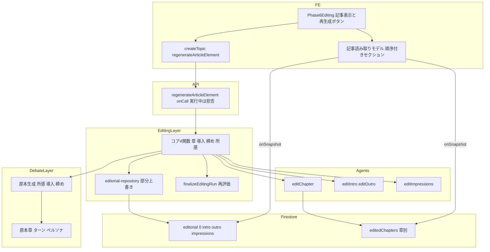
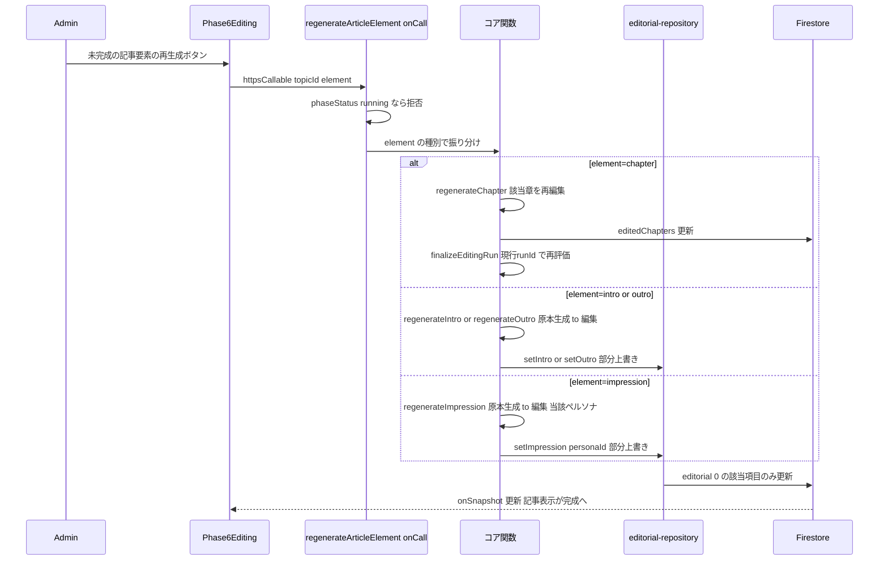

# Technical Design: editing-pass-resilience

## Overview

**Purpose**: 編集フェーズ（Phase 6）の成果物を「1つの記事＝順序付きセクション（導入・本体(章)・締め・所感）」として一貫して扱い、各記事要素が「原本(draft)→編集後(final)」で確実に完成するようにする。堅牢化（自動回復）・未完成の可視化・記事要素ごとの個別再生成・やり直しでの全記事作り直しを、セクション共通の作法で提供する。あわせて導入/締め/所感を1つのドキュメントへまとめ、命名を整理する（closing→outro、所感を impressions へ、冗長な postDebateComments 系を廃止）。

**Users**: 管理者が編集を実行・確認する。編集後(final)の無い記事要素（失敗した章・欠けた導入/締め・欠けた所感）を記事表示上で識別でき、その要素だけを完成状態まで作り直せる。

**Impact**: 出力を「バラバラの生成物」から「記事のセクション群」へ捉え直す。導入/締め/所感を1ドキュメント（`editorial/0`）へ統合し、所感は personaId をキーにしたマップにして記事要素ごとの部分上書き（衝突なし）を可能にする。本体(章)は 1MB 制約のため当面 `editedChapters` 別保存のまま、概念上は記事のセクションとして扱う。討論生データ・討論の完了確定は不変。

### Goals
- 記事のセクション/記事要素を「原本→編集後・完成＝編集後の存在」で一貫定義（R1）。
- 一括生成を記事要素ごとの自動回復で堅牢化（R2）。
- 編集後の無い記事要素を可視化し、要素ごとに個別再生成（R3, R4）。
- やり直しは全記事を作り直す（R5）。
- 導入/締め/所感を1ドキュメント化・命名整理、部分上書きで衝突なし（R6）。

### Non-Goals
- 討論生データの変更、既存の生成・編集エージェント（`editChapter`/`generateIntro`/`generateOutro`/`generateImpression`）の中身・構造検証規則の変更。ただし導入/締めの編集関数 `editIntro`/`editOutro` は本 spec で新規追加し、所感編集 `editImpressions`（旧 editComments）は改名のみ。
- 討論の完了確定（討論側 Phase 5、最終章まで進んだときトピックを完了にする処理）の変更。
- 本体(章)の物理統合（1MB 制約のため将来対応）。
- 一般ユーザーが公開記事に貼るコメント機能（将来別 spec）。`comments` という名前はそのために予約し、本 spec の所感には使わない。

## 用語

`code` 表記はコード上の識別子。

- **記事（Article）**: 1トピックについて編集フェーズが作る成果物全体。導入・本体(章)・締め・所感を順に並べた閲覧用の読み物。討論生データ（章・ターン）を編集して作る別物。
- **セクション**: 記事の構成要素＝導入 / 本体(章) / 締め / 所感。
- **記事要素（`ArticleElement`）**: 記事の中で独立に作り直せる最小単位（本体＝章ごと、導入＝1、締め＝1、所感＝承認ペルソナごと）。
- **原本（draft）**: 生成しただけの未編集テキスト。
- **編集後（final）**: 原本を整えた（リライトした）最終テキスト。画面表示に使う。
- **完成 / 未完成**: その記事要素の編集後(final)があれば完成、無ければ未完成。
- **代替表示（フォールバック）**: 編集後が無いとき原本を暫定表示すること（記法 `final ?? draft`＝final があれば final、無ければ draft）。
- **phaseStatus（フェーズ状態）**: トピックの進行状態。`running`＝実行中／`stopped`＝停止（失敗で止まった）／`generated`＝完了。「編集の確定」は generated または stopped を指す。
- **部分上書き（blind write）**: ドキュメント全体を読み直さず、対象項目（例: 所感の1人分）だけを書き換える更新。別々の項目への更新は同時でも衝突しない。
- **一括生成**: 編集開始時に全記事要素をまとめて作る処理。
- **個別再生成**: 未完成の記事要素だけを後から作り直す処理。
- **できる範囲で（best-effort）**: 失敗しても全体を止めず、その要素を欠けたまま先へ進む方針。
- **討論の完了確定**: 討論（Phase 5）が最終章まで進んだとき、トピックを完了（generated）にする処理。編集はこの後に始まる。本 spec は変更しない。
- `editorial/0`: 導入・締め・所感をまとめて保存する Firestore ドキュメント（`topics/{id}/editorial/0`）。
- `editedChapters`: 本体(章)の編集後を章ごとに保存する Firestore コレクション。

## Boundary Commitments

### This Spec Owns
- 記事要素の完成判定（各要素の編集後の存在）と代替表示（`final ?? draft`）。
- 導入/締め/所感を保存する `editorial/0` の構造・読み書き（部分上書き）と命名（outro/impressions）。
- 記事要素ごとの個別再生成のコア関数群と、共通入口の onCall 契約（`regenerateArticleElement`）。
- 一括生成の自動堅牢化（所感のペルソナ単位再試行等）と、章の個別再生成後の完了状態再評価。
- 編集開始・やり直し時の全記事破棄。

### Out of Boundary
- 既存の生成・編集エージェントの中身、構造検証（`validateEditedChapter`）の規則。
- 討論の完了確定（`chapter-end` での `confirmDebateGenerated`）。
- 本体(章)の `editedChapters` 別保存を1ドキュメントへ畳むこと（将来）。
- 一般ユーザーのコメント機能（将来別 spec）。

### Allowed Dependencies
- editing 層 → debate データ層（原本章・ターン・ペルソナ・所感の原本生成）。依存方向 editing→debate 一方向。
- Cloud Functions（新 onCall `regenerateArticleElement`、既存 `runEditingStep`）、Firestore、既存編集ライフサイクル（`finalizeEditingRun` / `startEditingRun`）。

### Revalidation Triggers
- `editorial/0` の構造変更、`editedChapters` の構造変更。
- 完成判定（編集後の存在）の変更（記事読み取りモデルの前提）。
- `regenerateArticleElement` の onCall 契約変更（FE モデルの呼び出し）。
- 編集開始/やり直しの破棄対象変更。

## Architecture

### Existing Architecture Analysis
- **編集チェーン**（`runEditingStep` の自己継続タスク）: 現状は `generate-comments（所感原本の一括生成）→ chapter(0..N) → intro-closing → comments（所感を整え）→ finalize`。停止ゲート `isEditingActive`（running かつ runId 一致）。終端失敗で `stopEditingRun`。
- **単体処理の再利用性**: `runChapterEditStep`（runId を使わない＝単体実行可）、`runIntroClosingStep`（runId はログのみ＝単体実行可・intro/closing を独立生成）。`finalizeEditingRun` は phaseStatus が running または stopped のとき遷移し、stopped→generated が可能。
- **現状の保存（改名前）**: 所感原本 `postDebateComments/0`、所感編集後 `editedPostDebateComments/0`、導入/締め `editedIntroClosing/0`、本体 `editedChapters/{id}`。所感編集後はドキュメント全上書きで、1人分だけ書く手段がない。導入/締めは編集(整え)工程を持たず生成のみ。

### Architecture Pattern & Boundary Map



**Architecture Integration**:
- Selected pattern: 既存編集チェーンを保ちつつ、出力を「記事セクション」へ再配線。導入/締め/所感を `editorial/0` に統合。個別再生成は**コアを記事要素の種別ごとに別関数**にし、共通入口の onCall で振り分ける。
- Domain/feature boundaries: 生成は debate 層、編集(整え)は agents、記事の保存・部分上書きは editing 層（editorial-repository）。読み取りの統合は FE の記事モデル。
- Existing patterns preserved: editing→debate 一方向依存、`finalizeEditingRun` の遷移規範、停止ゲート。
- New components rationale: `editorial/0`（統合保存）、コア4関数（種別ごとに完結）、共通入口 onCall（実行中拒否ゲートを1箇所に）、`editorial-repository` の部分上書き、`editIntro`/`editOutro`（導入/締めの編集工程）。
- Dependency direction: `types → repository(editorial-repository) → editing core(regenerateChapter 等) → api(onCall) → FE`。左方向のみ import。

### Technology Stack

| Layer | Choice / Version | Role in Feature | Notes |
|-------|------------------|-----------------|-------|
| Frontend | Svelte 5 (runes) + @14ch/svelte-ui | 記事読み取りモデルと記事要素の完成/未完成表示・個別再生成 | `Phase6Editing.svelte` 拡張、購読を editorial に集約 |
| Backend / Services | Firebase Functions v2 onCall | `regenerateArticleElement`（グローバル secrets 継承） | 討論側非干渉 |
| Data / Storage | Firestore | `editorial/0`（導入/締め/所感統合）＋`editedChapters/{id}`（本体） | 再生成前提でデータ移行なし |

## Data Models

### 記事の保存（統合ドキュメント＋本体別保存）

```
topics/{topicId}/editorial/0 = {
  intro:  { draft: string | null, final: string | null },
  outro:  { draft: string | null, final: string | null },
  impressions: {
    [personaId: string]: { sortOrder: number, draft: string | null, final: string | null }
  }
}

topics/{topicId}/editedChapters/{chapterId} = {   // 既存踏襲。本体(章)の編集後。原本は討論 chapters
  chapterIndex, title, discussionPoints,
  turns, status: 'completed' | 'failed', failureReason?
}
```

- **完成** = 記事要素の編集後(final)が存在（章は `status==='completed'`）。**代替表示** = `final ?? draft`（章は failed 時に原本ターン）。
- **部分上書き（衝突なし）**: 所感1人は `update({ ["impressions." + personaId]: {...} })`、導入/締めは `update({ intro: {...} })` / `update({ outro: {...} })`。いずれもドキュメントを読み直さず該当項目だけを書くため、別項目への同時更新でも衝突しない。
- **`comments` は予約**: 将来の「一般ユーザーコメント」機能のために `comments` という名前は空けておき、本 spec の所感には使わない。
- **統合の概念**: 本体(章)は 1MB 制約で `editedChapters` 別保存だが、記事としては `editorial` のセクションと同列。将来のサイズ保証時に畳んでも読み取りモデルは不変。

### 記事の読み取りモデル（FE・非永続）

```typescript
type ElementStatus = 'final' | 'draft_only' | 'missing';
type ArticleElementView = { status: ElementStatus; content: string };

type ArticleSection =
  | { kind: 'intro'; element: ArticleElementView }
  | { kind: 'body'; chapters: Array<{ chapterId: string } & ArticleElementView> }
  | { kind: 'outro'; element: ArticleElementView }
  | { kind: 'impressions'; elements: Array<{ personaId: string; name: string } & ArticleElementView> };
```
`editorial/0` と `editedChapters` の onSnapshot から順序付きセクションを導出する。編集後があれば `final`、無く原本があれば `draft_only`、どちらも無ければ `missing`。

## File Structure Plan

### New Files
- `functions/src/pipeline/editing/editorial-repository.ts` — `editorial/0` の読み取りと部分上書き（`readEditorial` / `setIntro` / `setOutro` / `setImpression` / `clearEditorial`）。
- `functions/src/pipeline/editing/regenerate-element.ts` — 記事要素の種別ごとのコア関数（`regenerateChapter` / `regenerateIntro` / `regenerateOutro` / `regenerateImpression`）。

### Modified Files
- `functions/src/agents/editor-agent.ts` — 導入/締めの編集関数 `editIntro` / `editOutro` を新規追加。所感編集 `editComments` を `editImpressions` へ改名（中身不変）。
- `functions/src/agents/facilitator-agent.ts` — `generateClosing` を `generateOutro` へ改名。
- `functions/src/agents/persona-agent.ts` — `generatePostDebateComment` を `generateImpression` へ改名（型 `PostDebateCommentResult` → `ImpressionResult` 等）。
- `functions/src/pipeline/editing/editing-step.ts` — 一括チェーンの各ステージの保存先を `editorial/0` へ切替（所感 draft/final、導入/締め draft/final を部分上書き）。所感原本のペルソナ単位再試行を維持。
- `functions/src/pipeline/editing/intro-closing-step.ts` → `intro-outro-step.ts` — 生成に続けて `editIntro`/`editOutro` を通し、`editorial.intro`/`editorial.outro` の draft/final を書く。
- `functions/src/pipeline/editing/editing-lifecycle.ts` — `startEditingRun` で `editorial/0`（＋`editedChapters`）を破棄。`finalizeEditingRun` は現行踏襲（editedChapters 基準）。
- `functions/src/api/editing.ts` — 旧 `retryPostDebateComment` を撤去し、共通入口 `regenerateArticleElement` onCall を新設（認証＋実行中拒否＋コア関数への振り分け＋エラー変換のみ）。
- `functions/src/index.ts` — エクスポート更新。
- 旧 `post-debate-comments.ts` / `edited-repository.ts` の所感・導入/締めの読み書きは `editorial-repository.ts` へ移設（`postDebateComments`/`editedPostDebateComments`/`editedIntroClosing` 廃止）。
- FE: `src/lib/stores/` の該当ストアを `editorial` 購読へ集約、`Phase6Editing.svelte` を記事読み取りモデル＋記事要素再生成へ、`createTopic.svelte.ts` に `regenerateArticleElement` を追加。

## System Flows

### 記事要素の個別再生成（共通入口＋コア関数）



分岐/整合: 個別再生成は編集確定後（generated または stopped）のみ受け付ける（実行中は拒否）。部分上書きで対象要素以外は不変・同時実行でも衝突しない。章再生成で全章 completed になれば `finalizeEditingRun` が stopped→generated へ再評価する。

## Requirements Traceability

| Requirement | Summary | Components | Interfaces | Flows |
|-------------|---------|------------|------------|-------|
| 1.1–1.4 | 記事セクション/要素の完成定義・代替表示 | 記事読み取りモデル, `editorial-repository` | 完成判定, `final ?? draft` | — |
| 2.1, 2.2 | 一括生成の自動堅牢化 | 所感=ペルソナ単位再試行, 章=タスク再試行, 導入/締め=できる範囲で | 各ステージ | — |
| 2.3 | 失敗ログ | 各ステージ | warn ログ | — |
| 3.1, 3.2, 3.3 | 未完成要素の可視化（編集確定後のみ） | `Phase6Editing`, 記事読み取りモデル | ElementStatus | — |
| 4.1 | 未完成要素に個別操作 | `Phase6Editing` | 再生成ボタン | 個別再生成 |
| 4.2 | 種別ごとの工程で作り直す | コア4関数 | onCall, コア関数 | 個別再生成 |
| 4.3, 4.4 | 対象要素のみ・完成表示更新 | `editorial-repository`(部分上書き) | `setIntro/setOutro/setImpression` | 個別再生成 |
| 4.5 | 章再生成で全体完了再評価 | `regenerateChapter`, `finalizeEditingRun` | finalize | 個別再生成 |
| 4.6, 4.7, 4.8 | 失敗通知・実行中拒否・多重防止 | `regenerateArticleElement`, `Phase6Editing` | onCall throw/guard, 無効化 | — |
| 5.1 | やり直しで全記事破棄・作り直し | `startEditingRun` | `startEditingRun` | — |
| 5.2 | run 内二重生成防止 | 一括ステージの非空スキップ | 非空スキップ | — |
| 5.3 | generated 非後退 | `stopEditingRun` | phase editing 限定 | — |
| 6.1 | 導入/締め/所感の統合・本体別保存 | `editorial-repository`, `editedChapters` | `editorial/0` | — |
| 6.2 | 部分上書きで衝突しない | `editorial-repository` | 部分上書き | — |
| 6.3, 6.4 | 命名整理・移行不要 | 保存・命名刷新 | outro/impressions | — |
| 6.5 | 討論生データ・完了確定不変 | （討論側非改変） | — | — |
| 6.6 | 要素を消さない | 記事読み取りモデル | 代替表示 | — |

## Components and Interfaces

| Component | Domain/Layer | Intent | Req Coverage | Key Dependencies | Contracts |
|-----------|--------------|--------|--------------|------------------|-----------|
| コア4関数（`regenerateChapter`/`regenerateIntro`/`regenerateOutro`/`regenerateImpression`） | editing/core | 記事要素1つを種別に応じて作り直す | 4 | `editChapter`/`editIntro`/`editOutro`/`editImpressions`(P0), 原本生成(P0), `editorial-repository`(P0), `finalizeEditingRun`(P1) | Service |
| `editorial-repository` | editing/repository | `editorial/0` の読み取りと部分上書き | 1, 4, 6 | Firestore(P0) | Service |
| `regenerateArticleElement`(onCall) | api | 個別再生成の共通入口・実行中拒否・振り分け | 4 | コア4関数(P0) | API |
| 記事読み取りモデル | FE | editorial＋editedChapters を順序付きセクションへ導出 | 1, 3, 6 | onSnapshot(P0) | State |
| `Phase6Editing`（拡張） | FE | 記事表示と未完成要素の個別再生成 | 1, 3, 4 | onCall(P0) | State |
| 一括ステージ（保存先切替） | editing/step | 各要素の draft/final を editorial/editedChapters へ | 2, 5 | `editorial-repository`(P0) | Batch |

### Editing

#### editorial-repository（新規）

**Contracts**: Service [x]

##### Service Interface
```typescript
type NarrationPart = { draft: string | null; final: string | null };
type ImpressionPart = { sortOrder: number; draft: string | null; final: string | null };
type Editorial = {
  intro: NarrationPart;
  outro: NarrationPart;
  impressions: Record<string, ImpressionPart>;   // key = personaId
};

const readEditorial: (topicId: string) => Promise<Editorial>;
const setIntro: (topicId: string, part: NarrationPart) => Promise<void>;   // update({ intro })
const setOutro: (topicId: string, part: NarrationPart) => Promise<void>;   // update({ outro })
const setImpression: (topicId: string, personaId: string, part: ImpressionPart) => Promise<void>; // update({ ["impressions."+personaId] })
const clearEditorial: (topicId: string) => Promise<void>;                  // やり直し時の破棄
```
- Postconditions: 各 set は該当項目のみ部分上書きし、他要素を読み書きしない。
- Invariants: 同時実行でも異なる項目への更新は衝突しない（R6.2）。

#### コア4関数（新規 `regenerate-element.ts`）

| Field | Detail |
|-------|--------|
| Intent | 記事要素1つを種別に応じて「原本生成→編集→部分上書き」で作り直す（種別ごとに独立の関数） |
| Requirements | 4.2, 4.3, 4.4, 4.5 |

**Responsibilities & Constraints**
- `regenerateChapter(topicId, chapterId)`: 該当章を再編集（`editChapter`）し `editedChapters/{id}` を更新、現行 runId で `finalizeEditingRun` を呼び全体完了を再評価。
- `regenerateIntro(topicId)` / `regenerateOutro(topicId)`: 原本生成（`generateIntro`/`generateOutro`）→ `editIntro`/`editOutro` → `setIntro`/`setOutro`。
- `regenerateImpression(topicId, personaId)`: 原本生成（`generateImpression`）→ `editImpressions([原本])` → `setImpression`。
- いずれも対象要素以外を変更しない。失敗は例外送出（onCall がエラー化）。

**Contracts**: Service [x]

##### Service Interface
```typescript
const regenerateChapter:    (topicId: string, chapterId: string) => Promise<void>;
const regenerateIntro:      (topicId: string) => Promise<void>;
const regenerateOutro:      (topicId: string) => Promise<void>;
const regenerateImpression: (topicId: string, personaId: string) => Promise<void>;
```
- Preconditions: 編集が確定済み（phaseStatus が generated または stopped）。対象要素が存在する。
- Postconditions: 成功時、当該要素の編集後（章は completed）が確定。章再生成で全章完成なら phaseStatus が generated へ。
- Invariants: 対象要素以外の記事内容は不変。

### API

#### regenerateArticleElement（onCall・共通入口）

**Contracts**: API [x]

##### API Contract
```typescript
type ArticleElement =
  | { kind: 'chapter'; chapterId: string }
  | { kind: 'intro' }
  | { kind: 'outro' }
  | { kind: 'impression'; personaId: string };
```
| Method | Callable | Request | Response | Errors |
|--------|----------|---------|----------|--------|
| onCall | `regenerateArticleElement` | `{ topicId: string; element: ArticleElement }` | `{ topicId }` | invalid-argument／failed-precondition（実行中）／not-found（対象不在）／internal（再生成失敗） |

- 役割は薄い: 認証、実行中拒否ゲート（`phaseStatus === 'running'` なら `failed-precondition`・R4.7）、`element.kind` によるコア関数への振り分け、例外の HttpsError 変換のみ。ロジックはコア4関数が持つ。

### FE

#### 記事読み取りモデル ＋ Phase6Editing（拡張）— Summary + Implementation Note

**Intent**: `editorial/0` と `editedChapters` から順序付きセクションを導出し、記事として表示。編集後の無い記事要素を（編集確定後に）明示し個別再生成を提供する（1, 3, 4, 6）。

**Implementation Notes**
- Integration: 購読を `editorial/0`（導入/締め/所感）＋`editedChapters` に集約し、`ArticleSection[]`（intro→body→outro→impressions）を導出。各要素の状態は `final`/`draft_only`/`missing`。
- Validation: 未完成（`draft_only`/`missing`）の明示と再生成ボタンは、編集確定後（generated または stopped）のみ表示。
- Validation: 個別再生成中は当該要素のボタンを無効化（種別＋ID で処理中管理）。
- Risks: 判定を「編集後の有無」に統一することで、章の failed・導入/締めの欠落・所感の欠落が同一の未完成表示に揃う。代替表示（`final ?? draft`）で要素は消えない（6.6）。

## Error Handling

### Error Strategy
- **一括生成**: 所感はペルソナ単位再試行（自動回復）。章は LLM 例外でタスク再試行、構造検証不合格は `failed`（原本フォールバック・後続章継続）。導入/締めは生成→編集を「できる範囲で」（失敗は編集後 null）。終端失敗は `stopEditingRun`。失敗は warn ログ。
- **個別再生成**: コア関数の失敗（原本全滅／編集失敗／章編集例外）で例外送出 → onCall が `internal` を返す → FE がボタン再有効化。対象要素以外は不変。章は再編集後 `finalizeEditingRun` で全体状態を再評価。
- **衝突防止**: 実行中は onCall 拒否。記事要素の保存は該当項目の部分上書きで、同時個別再生成でも衝突しない。

### Monitoring
- 既存 `[runEditingStep]` ログ規約に準拠。個別再生成は `topicId`・`element`・失敗理由を記録。

## Testing Strategy

### Unit Tests
- `editorial-repository`: `setIntro/setOutro/setImpression` が該当項目のみ部分上書きし他要素不変。`readEditorial` の欠落補完。
- コア4関数: `regenerateChapter`（再編集＋finalize）、`regenerateIntro/Outro`（生成→編集→setIntro/Outro）、`regenerateImpression`（生成→編集→setImpression）。対象以外不変。
- 所感一括生成: ペルソナ単位再試行（途中成功回復／全滅スキップ・ログ）。
- 章個別再生成: failed 章の再編集で completed 化 → `finalizeEditingRun` が stopped→generated。
- `regenerateArticleElement` onCall: 実行中拒否、種別振り分け、エラー変換。

### Integration Tests
- 一括編集の通し → 記事の全要素が editorial/editedChapters に編集後で揃い、finalize が generated。
- 未完成が残った状態から各要素を個別再生成 → 完成へ、他要素不変。
- やり直し: `startEditingRun` で editorial＋editedChapters 破棄 → 再構築。run 内タスク再試行で二重生成しない。

### UI Tests（svelte-check + 手動）
- 記事読み取りモデルの順序（intro→body→outro→impressions）と各要素の状態。未完成明示の編集確定後ゲート、個別再生成ボタンの無効化/再有効化。
