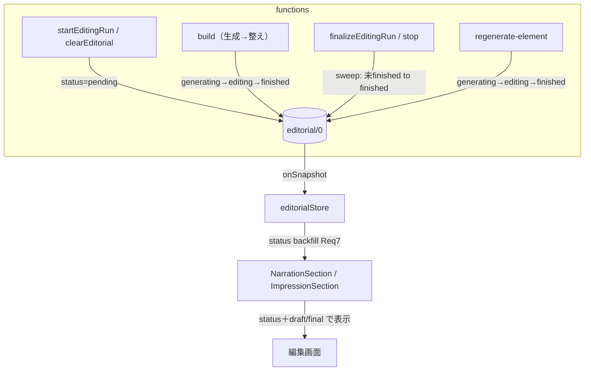
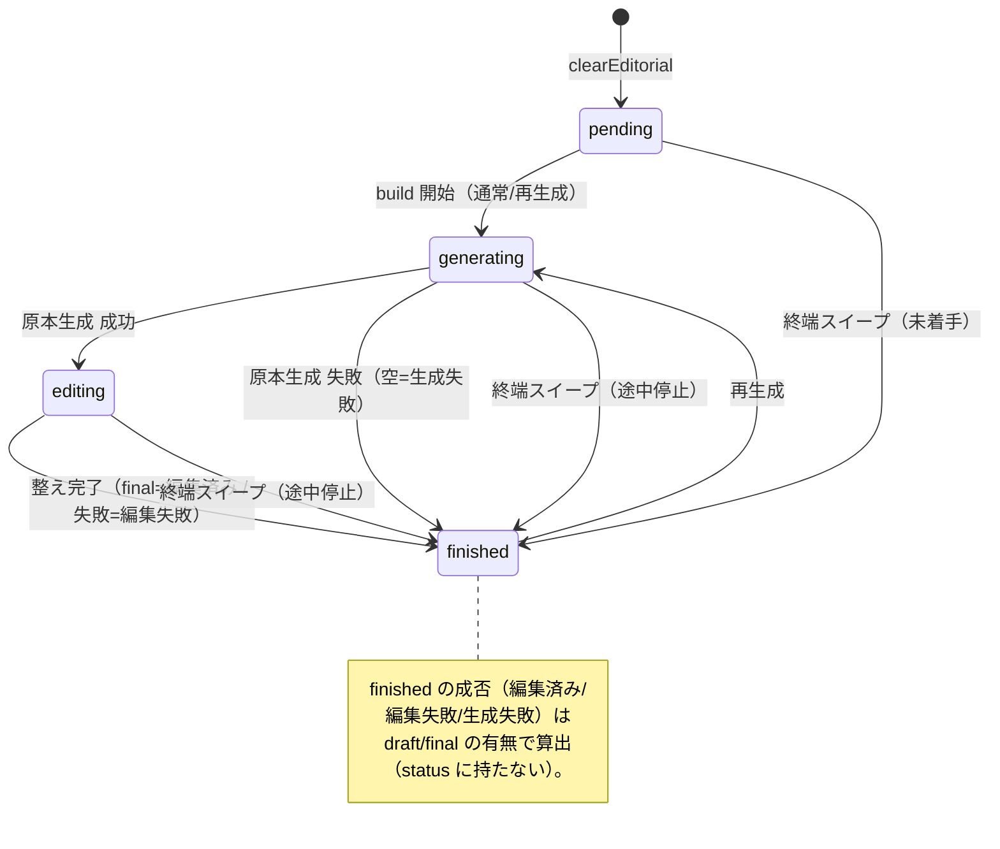

# Design Document — editorial-element-status

## Overview

**Purpose**: 編集フェーズの記事要素（導入・締め・所感）が、**自身の進捗ステータスを独立して持ち**、フロントはそれと内容（draft/final）だけで表示を決められるようにする。現状の「`draft`/`final` の有無 × `isEditingFinished`（ラン全体の完了フラグ）」の組み合わせ復元を廃し、外部フラグへの結合を断つ。

**Users**: 管理者（編集フェーズを実行・監視し、要素を個別再生成する）。

**Impact**: editorial 永続形（`editorial/0`）の各要素に**進捗ステータス `status`（`pending` | `generating` | `editing` | `finished`）** を追加し、サーバ（編集パイプライン）が段階的に書き込む。フロント表示から `isEditingFinished` 依存を除去する。

### 2軸の分離（本設計の核）
記事要素の表示は独立した2軸で決まる:

1. **進捗ステータス（明示・永続）** … `status: 'pending' | 'generating' | 'editing' | 'finished'`。生成待ち／原本生成中／整え中／処理完了。**導出できないため永続化する**（特に「生成待ち」と「失敗」は内容が同じ＝空なので、この軸でしか区別できない）。
2. **内容（算出）** … `draft != null` / `final != null`。**ステータスには含めず内容から算出する**（`finished` の中の編集済み／編集失敗／生成失敗）。

### Goals
- 各要素が独立した進捗ステータスを持つ（段階を表示できる）
- フロント表示が「`status` ＋ 内容」のみで決まる（`isEditingFinished` 不使用）
- 「生成待ち」と「失敗」をデータ上で区別する
- 途中終了しても表示が固着しない

### Non-Goals
- 本体（章）の編集ステータス（`editedChapters`）の変更
- 編集パイプラインの並列化 / 生成ロジック（LLM プロンプト）の変更
- 「編集済み／編集失敗／生成失敗」を進捗ステータスの値として持つこと（内容から算出する）
- 再生成専用の状態（`regenerating`）を設けること（再生成中も `generating` を使う）

## Boundary Commitments

### This Spec Owns
- editorial 要素（intro / outro / 各所感）の進捗ステータス `status` の定義と永続化（段階書き込み）
- 生成・確定・個別再生成における `status` の書き込み
- フロント表示コンポーネント（Narration / Impression）の状態駆動化

### Out of Boundary
- 章ステータス（`EditingChapterStatus` / `EditedChapterDisplayStatus`）
- phaseStatus（running/generated/stopped）の意味・遷移そのもの（既存を利用するのみ）
- 並列化・生成プロンプト

### Allowed Dependencies
- 既存の `editorial-repository`（blind write）、`element-builders`、`editing-lifecycle`、承認ペルソナ取得
- 既存の phase/runId ライフサイクル（世代ガード）

### Revalidation Triggers
- editorial 永続形（要素の形）の変更 / 進捗ステータス値集合の変更 / finalize・stop の責務変更

## Architecture

### Existing Architecture Analysis
- editorial は `editorial/0` 単一ドキュメントに intro/outro/impressions を集約し、要素ごとに blind write（衝突なし）する既存方針。**この blind write と部分上書きは維持する**。
- 現状 builders は「生成→整え」を1タスク内で回して**最後に1回だけ**書く純関数。段階（generating/editing）を見せるには、**build 途中で status を部分上書き**する必要がある（下記 element-builders）。
- 終端で editorial 要素の状態を確定する処理は存在しない（章のみ）。ここに**終端スイープ**を追加する。生成順は impressions → 章 → intro/outro（終端 `finalizeEditingRun`）。

### Architecture Pattern & Boundary Map
- パターン: 既存の server authority（サーバが永続状態を書き、フロントは読んで表示するだけ）を踏襲。`status` はサーバが唯一の権威。
- 新規責務: (1) `status` の段階書き込み（builders / repository 初期化）、(2) 終端スイープ（未完了を finished に確定）、(3) フロントの状態駆動表示。



## Data Models

### 進捗ステータス
```typescript
export type EditorialElementStatus = 'pending' | 'generating' | 'editing' | 'finished';
```
| 進捗 | 意味 | 内容 |
|------|------|------|
| `pending` | 生成待ち（未着手） | 空 |
| `generating` | 原本（draft）生成中（再生成中も含む） | 空 |
| `editing` | 原本ができ整え（final）中 | draft あり |
| `finished` | 処理完了 | 成否は内容で表す |

### 表示の決定（進捗 × 内容）
| 表示 | 判定 | 本文 | 状態ラベル | 再生成ボタン |
|------|------|------|-----------|------------|
| 生成待ち（Skeleton） | `status === 'pending'` | — | — | なし |
| 生成中（Skeleton） | `status === 'generating'` | — | 「生成中」 | なし |
| 編集中（Skeleton） | `status === 'editing'` | — | 「編集中」 | なし |
| 編集済み | `status === 'finished' && final != null` | final（差分可） | なし | あり |
| 編集失敗 | `status === 'finished' && final == null && draft != null` | draft | 「編集失敗」 | あり |
| 生成失敗 | `status === 'finished' && draft == null && final == null` | なし | 「生成失敗」 | あり |

> 進行中（pending/generating/editing）はいずれも Skeleton で、段階ラベルだけが違う。`finished` の中の成否は内容（final/draft）から算出する。再生成は `finished` なら常に出す。

### 永続形（変更）
```typescript
// Narration は永続・フロント共通（同一のため単一型を維持）
export type Narration = {
  status: EditorialElementStatus;
  draft: string | null;
  final: string | null;
};

// 所感（永続）。フロントは personaId を materialize した Impression を使う（既存方針）
export type ImpressionForFirestore = {
  sortOrder: number;
  status: EditorialElementStatus;
  draft: string | null;
  final: string | null;
};
export type Impression = ImpressionForFirestore & { personaId: string };

export type EditorialForFirestore = {
  intro: Narration;
  outro: Narration;
  impressions: Record<string, ImpressionForFirestore>;
};
```

### 永続・表示ルール
- 所感マップに **エントリが無いペルソナ = `pending`**（フロントのフォールバック）。run 終端スイープで未完了ペルソナに `finished`（空＝生成失敗）を materialize するため、run 確定後は absent が残らない。
- Req 7（既存データ）: `status` 欠落時、フロントで `'finished'` に正規化する（既存ドキュメントは過去の run で処理済みのため）。編集済み／編集失敗／生成失敗は内容から算出。ドキュメント自体が無い場合の既定は `status:'pending'`。

## Components and Interfaces

| Component | Layer | Intent | Req | Contracts |
|-----------|-------|--------|-----|-----------|
| editorial.types（両側） | Data | `status` と永続形の定義 | 1.1, 1.3 | State |
| editorial-repository | Backend | 初期化 pending・段階書き込み・blind write | 2.1 | Batch/State |
| element-builders | Backend | generating→editing→finished を書きつつ生成 | 2.2-2.4, 6.1 | Service |
| editing-lifecycle（sweep 追加） | Backend | 終端で未 finished を finished 化 | 4.3 | Batch |
| regenerate-element | Backend | generating 経由で更新・失敗で維持 | 5.1, 5.2 | Service |
| editorialStore | Frontend | status backfill・Impression 化 | 7.1, 7.2, 6.2 | State |
| NarrationSection / ImpressionSection | Frontend | 進捗＋内容で表示 | 2, 3, 6.3 | State |

### Backend

#### element-builders（段階書き込み）
build は要素の status を段階的に部分上書きしながら生成する（純関数ではなくなり、`topicId` と対象要素の setter を受け取る）。
- 開始時: `status='generating'`（draft=null）
- 原本生成 成功時: `status='editing'`（draft を保存）
- 整え 完了時: `status='finished'`（final を保存＝編集済み。整え失敗なら draft のまま finished＝編集失敗）
- 原本生成 失敗時: `status='finished'`（空＝生成失敗）
- `buildImpressionPart` も同様（**戻り値の `null` を廃止**）。`runImpressionsStep` の `if (part===null) continue` を撤去。run 内二重生成防止（スキップ判定）は「**draft を持つ（生成済み）ならスキップ。`generating`(draft無し) 等の未完了は再試行で再実行**」に読み替える（過渡ステータスを再開条件にしない・冪等性維持）。

> 段階遷移ごとに status を部分上書きする（blind write。他要素と衝突しない）。既存も要素ごとに複数回書いており、遷移1回分の update が増えるだけ。

#### editorial-repository（初期化・段階 set）
- `emptyNarration(): Narration` → `{ status: 'pending', draft: null, final: null }`
- `clearEditorial`: intro/outro=emptyNarration、impressions=`{}`。
- 既存の `setIntro/setOutro/setImpression`（part 全体）に加え、段階書き込み用に status のみ／status+draft を部分上書きできる薄い set を用意（blind write）。

#### editing-lifecycle（終端スイープ・新規）
```typescript
// finished でない（pending/generating/editing）まま残った要素を finished（空＝生成失敗）に確定する（Req 4.3）
finalizePendingEditorialElements(topicId: string): Promise<void>
```
- 対象: intro/outro が `status !== 'finished'` → `{ status:'finished', draft?, final }`（既存 draft は保持し、無ければ空＝生成失敗）。承認ペルソナのうち所感が未 finished／エントリ無し → 同様に materialize。
- 呼び出し: `finalizeEditingRun`（終端）と `stopEditingRun`（終端失敗）から。
- Idempotency: 既に `finished` は不変。再入安全。正常完了時は build が finished まで進めるため実質 no-op。

#### regenerate-element（進捗反映・generating 再利用）
- 各 `regenerate*` は build（段階書き込み）を通す。**開始時に既存内容を破棄**して `generating` にし（旧 draft/final をクリア＝再生成の意図を即時反映・Req 5.1）、`editing` を経て `finished` になる（**専用の regenerating 状態は作らない**）。
- 成功（draft を生成できた：編集済み or 編集失敗） → `finished`（内容あり・Req 5.2）。
- 生成失敗（内容が空） → `finished`（空＝生成失敗）。旧内容は保持しない（Req 5.3）。**復元ロジックは不要**。
- 導入・締めの**ダイジェスト構築失敗も throw せず** `finished`（空＝生成失敗）で確定する（旧内容は破棄・status で可視化）。成否は例外でなく status＋内容で表すため、再生成は中断させない（Req 5.1, 5.3）。

### Frontend

#### editorialStore（status backfill・Impression 化）
- snapshot 読み取り時、`status ?? 'finished'` で backfill（既存ドキュメント要素は処理済みとみなす）。ドキュメント自体が無い場合の既定は `pending`。
- `intro` / `outro`: `Narration` で公開。`impressions`: `Impression[]`（personaId materialize、sortOrder 順）。

#### NarrationSection / ImpressionSection（状態駆動）
- **`isEditingFinished` prop を廃止**。`part.status` と `part.final`/`part.draft` のみで分岐（上表）:
  - `pending` / `generating` / `editing` → Skeleton（段階ラベル）
  - `finished && final != null` → final 本文（`showDiff` && diff で差分）＋再生成
  - `finished && final == null && draft != null` → draft 本文＋「編集失敗」＋再生成
  - `finished && 内容が空` → 「生成失敗」（本文なし）＋再生成
- 再生成ボタンは `finished` のみ表示。押下後は要素が `generating`/`editing`（Skeleton）に移り、完了で `finished` に戻る。既存の楽観的ローディングは status で表せるため簡素化できる（クリック→サーバ書き込みの遅延分のみ任意で残す）。
- EditingPage: `displayImpressions` は承認ペルソナに所感を対応づけ、エントリ無しは `{ status:'pending', draft:null, final:null }` にフォールバック（Req 6.2）。`isEditingFinished` 受け渡しを撤去。

## System Flows

### 要素の進捗ライフサイクル


## Requirements Traceability

| Requirement | Summary | Components |
|-------------|---------|------------|
| 1.1, 1.2, 1.3 | 独立進捗・生成待ち↔失敗の区別・両側型一致 | editorial.types（両側）, element-builders, repository |
| 2.1, 2.2 | 完了フラグ非依存の表示 | NarrationSection/ImpressionSection, editorialStore |
| 3.1-3.4 | 状態別表示規則（進捗×内容） | NarrationSection/ImpressionSection |
| 4.1, 4.2 | 生成進行と状態整合（段階） | element-builders, repository |
| 4.3 | 途中終了で固着させない | editing-lifecycle（終端スイープ） |
| 5.1, 5.2, 5.3 | 個別再生成：開始時破棄・成功更新・失敗は生成失敗 | regenerate-element |
| 6.1, 6.2, 6.3 | 所感も同一モデル | element-builders, editorialStore, ImpressionSection |
| 7.1, 7.2 | 既存データのフォールバック | editorialStore（status backfill） |

## Error Handling
- **生成失敗**: build は例外を投げず `finished`＋空 に確定（best-effort、他要素・本文を止めない既存方針を維持）。
- **個別再生成失敗**: `finished`（空＝生成失敗）で確定。開始時に旧内容を破棄済みのため保持しない（Req 5.3）。導入・締めのダイジェスト構築失敗も throw せず同様に確定する（成否は status で可視化）。
- **終端スイープ**: 例外は握りつぶし phaseStatus 確定を妨げない。未 finished のみ対象で冪等。
- **旧データ**: `status` 欠落はフロントで `'finished'` 正規化。成否は内容から算出。

## Testing Strategy

### Unit Tests
- `build`: generating→editing→finished の順で status を書く。原本失敗→generating から finished(空)。整え失敗→editing から finished(draftのみ)。成功→finished(final)。
- `finalizePendingEditorialElements`: pending/generating/editing を finished(既存内容保持・無ければ空) に。finished は不変（冪等）。
- editorialStore backfill: `status` 欠落を `'finished'` に正規化し、内容で表示分岐。
- `regenerate`: 生成失敗で既存保持（復元）、draft ありで finished 更新。

### Integration Tests
- 初期化が intro/outro=`pending`・impressions={} を書く（既存テスト更新）。
- 停止 run で未 finished 要素が finished(空=生成失敗) に確定、所感 absent が materialize（スイープ経路）。

### E2E/UI Tests
- 生成中: 段階に応じ Skeleton（生成待ち/生成中/編集中）。確定後: 空=「生成失敗」、draft のみ=「編集失敗」、final あり=「編集済み」。finished は再生成ボタンを表示。

## Migration Strategy
- 永続形にフィールド追加のみ（既存フィールドは不変）。旧 `editorial/0` は `status` 欠落 → フロントで `'finished'` 正規化して表示継続（移行バッチ不要）。
- 本番 functions のデプロイが必要（エミュレータ未使用）。デプロイ後の新規 run から `status` が段階的に書かれる。既存の生成済みトピックは draft/final の有無から成否を復元。
