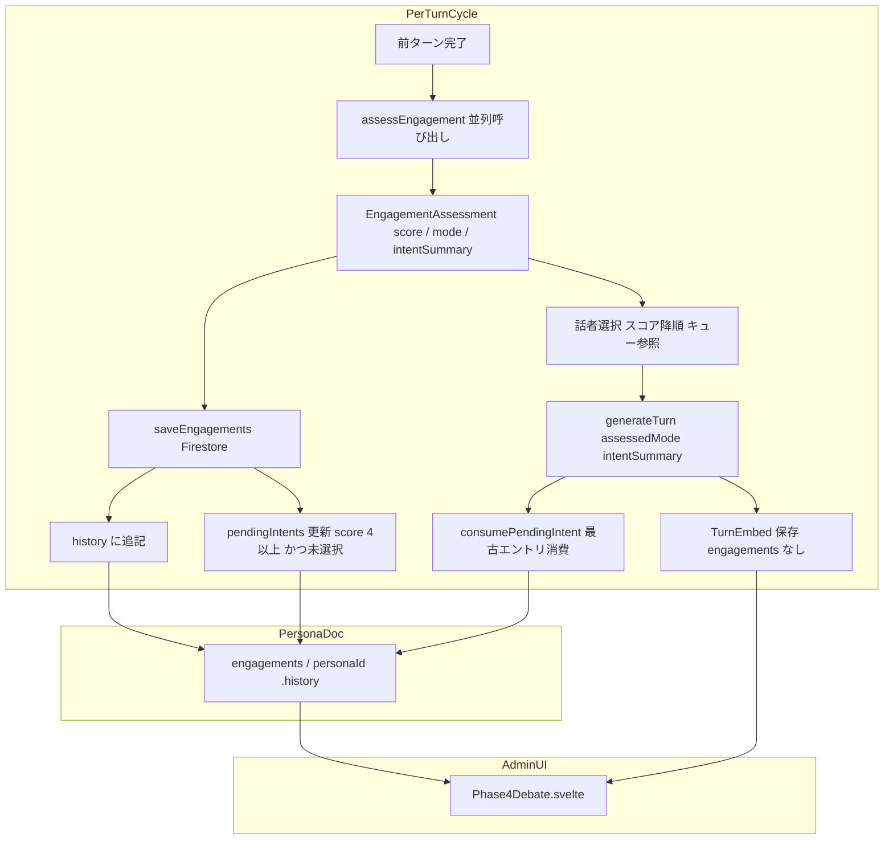
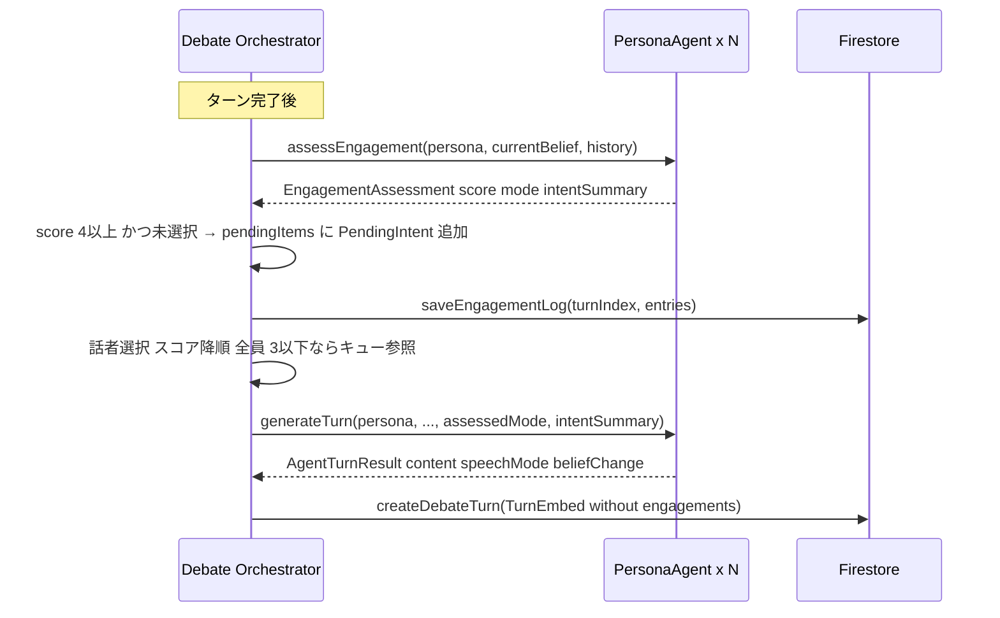

# Design Document: engagement-driven-debate-flow

## Overview

本機能は、討論フローの情報パイプラインを再設計する。現行の問題は3点ある。(1) `assessEngagement` がスコアしか返さず、ペルソナの「言いたいこと」が `generateTurn` に渡らない。(2) mode がスコアから自動導出されるため、強い意志でも短く済ませたい場合を表現できない。(3) エンゲージメントデータが発言ログ（`TurnEmbed`）に埋め込まれており、発言の純粋な記録と制御データが混在している。

本設計では、`assessEngagement` が `score`・`mode`・`intentSummary` を独立して返し、`generateTurn` がその意図を受け取って発言を生成する一貫したサイクルを確立する。あわせて、エンゲージメントデータを専用フィールド `engagementLog` に分離する。

### Goals
- `assessEngagement` が `intentSummary`（言いたいことの要約）を返すよう拡張する
- `score` と `mode` を独立評価にし、LLM が自然な組み合わせを選べるようにする
- `generateTurn` が `intentSummary` を参照して発言を生成できるようにする
- ペルソナ別キューが `intentSummary` を保持するよう変更する
- 発言ログ（`TurnEmbed`）からエンゲージメントデータを分離する

### Non-Goals
- ファシリテーター発言ロジックの変更
- 章管理（chapter progression）の変更
- 公開ページ（`/debate/[id]`）のUI変更
- Anthropic SDK バージョンアップなど外部依存の更新

---

## Boundary Commitments

### This Spec Owns
- `PersonaAgentService.assessEngagement` の引数・返り値インターフェース
- `PersonaAgentService.generateTurn` の引数インターフェース（`intentSummary` 追加）
- `ASSESS_ENGAGEMENT_TOOL` スキーマ定義
- `DebateState.pendingItems` の型（`Map<string, PendingIntent[]>`）
- `EngagementLogEntry` 型と `sessions/0.engagementLog[]` フィールドの追加
- `TurnEmbed` からの `engagements` フィールド削除
- 管理UI（`Phase4Debate.svelte`）のエンゲージメント表示データソース変更

### Out of Boundary
- ファシリテーターエージェントの実装
- `evaluateIntervention` ロジック
- 公開ビューアのデータ取得

### Allowed Dependencies
- Anthropic SDK（既存バージョンのまま）
- Firestore Admin SDK（`FieldValue.arrayUnion`）
- 既存の `buildPersonaSystemPrompt`・`buildSpeechStyleGuide`

### Revalidation Triggers
- `EngagementAssessment` 型の変更
- `generateTurn` シグネチャの変更
- `sessions/0.engagementLog` フィールドのスキーマ変更

---

## Architecture

### Existing Architecture Analysis

現行フローの問題箇所：

```
assessEngagement → { score, mode(自動導出) }
                          ↓ mode/intentSummary は generateTurn に渡らない
                   generateTurn(pendingTrigger のみ)
                          ↓
                   TurnEmbed(engagements 埋め込み) ← 発言ログに制御データ混入
```

### Architecture Pattern & Boundary Map



**Key Decisions:**
- `mode` を `score` とは独立した LLM 評価フィールドとして `ASSESS_ENGAGEMENT_TOOL` に追加する
- `intentSummary` を `generateTurn` の新引数として追加し、ユーザープロンプトに埋め込む
- `pendingItems`（メモリ内）は `engagements/{personaId}.pendingIntents` と同期し、Functions 再起動時に `resume()` で復元する
- `engagements/{personaId}` ドキュメントにペルソナの思考履歴（`history`）と未発言意図（`pendingIntents`）を集約する

### Technology Stack

| Layer | Choice | Role in Feature |
|-------|--------|-----------------|
| Backend | TypeScript / Firebase Functions v2 | `assessEngagement`・`generateTurn` の拡張 |
| AI | Anthropic SDK（既存） | `ASSESS_ENGAGEMENT_TOOL` スキーマ拡張 |
| Data | Firestore Admin SDK（既存） | `engagementLog` フィールド追加、`engagements` 削除 |
| Frontend | Svelte 5 / SvelteKit（既存） | 管理UI のデータソース変更 |

---

## File Structure Plan

### Modified Files

- `functions/src/types/index.ts` — `EngagementAssessment`・`PendingIntent` 型追加、`PendingThought` 削除
- `functions/src/agents/persona-agent.ts` — `ASSESS_ENGAGEMENT_TOOL` スキーマ拡張、`assessEngagement` 返り値変更、`generateTurn` 引数に `intentSummary` 追加
- `functions/src/pipeline/debate-orchestrator.ts` — `DebateState.pendingItems` 型変更、話者選択ロジック更新、`generateTurn` 呼び出し変更、chapter end detection 更新
- `functions/src/db/repository.ts` — `EngagementLogEntry` 型追加、`CreateDebateTurnParams` から `engagements` 削除、`saveEngagementLog` 関数追加
- `src/lib/types/index.ts` — `TurnDoc` から `engagements` 削除、`SessionDoc` に `engagementLog` 追加、`EngagementLogEntry` 追加
- `src/lib/components/admin/Phase4Debate.svelte` — `turn.engagements` → `session.engagementLog` フィルタリングに変更

---

## System Flows



**Flow Notes:**
- `assessEngagement` は直前話者を除く全ペルソナに並列で呼び出す（既存動作を維持）
- `saveEngagementLog` は `generateTurn` の前に呼び出す（話者選択の透明性のため）
- キュー参照で選ばれた場合、`intentSummary` はキューエントリの値を使い、`pendingTrigger` にトリガー発言を併用する

---

## Requirements Traceability

| Requirement | Summary | Components | Interfaces |
|-------------|---------|------------|------------|
| 1.1–1.7 | エンゲージメント評価の拡張 | PersonaAgentService | `assessEngagement`, `ASSESS_ENGAGEMENT_TOOL` |
| 2.1–2.5 | ペルソナ別意図キュー管理 | DebateOrchestrator | `DebateState.pendingItems`, `PendingIntent` |
| 3.1–3.6 | スコアベース話者選択 | DebateOrchestrator | `executeChapter` 内選択ロジック |
| 4.1–4.6 | 意図に基づく発言生成 | PersonaAgentService, DebateOrchestrator | `generateTurn` |
| 5.1–5.5 | データ分離 | Repository, AdminUI | `saveEngagementLog`, `SessionDoc.engagementLog` |

---

## Components and Interfaces

| Component | Layer | Intent | Req Coverage | Key Dependencies |
|-----------|-------|--------|--------------|-----------------|
| `ASSESS_ENGAGEMENT_TOOL` | AI Schema | スコア・モード・意図の独立評価 | 1.2–1.7 | Anthropic tool_use |
| `PersonaAgentService.assessEngagement` | Agent | 拡張エンゲージメント評価 | 1.1–1.7 | ASSESS_ENGAGEMENT_TOOL |
| `PersonaAgentService.generateTurn` | Agent | 意図を参照した発言生成 | 4.1–4.6 | REACTION_TURN_TOOL, buildFullTurnTool |
| `DebateOrchestrator.executeChapter` | Pipeline | 話者選択・キュー管理 | 2.1–2.5, 3.1–3.6 | assessEngagement, generateTurn |
| `Repository.saveEngagements` | Data | エンゲージメント評価をペルソナ別ドキュメントに追記 | 5.1–5.3 | Firestore Admin SDK |
| `Phase4Debate.svelte` | Admin UI | エンゲージメント表示 | 5.4–5.5 | engagements サブコレクション |

---

### Agent Layer

#### PersonaAgentService — assessEngagement

| Field | Detail |
|-------|--------|
| Intent | ペルソナの信念と会話履歴を照らし合わせ、score・mode・intentSummary を独立評価して返す |
| Requirements | 1.1, 1.2, 1.3, 1.4, 1.5, 1.6, 1.7 |

**Contracts**: Service [x]

##### Service Interface
```typescript
// functions/src/types/index.ts
export interface EngagementAssessment {
  score: number;            // 1–5（信念に照らした発言意欲）
  mode: 'full' | 'reaction' | 'none';  // 独立評価（score とは連動しない）
  intentSummary?: string;  // mode !== 'none' の場合に生成（reaction: 25文字以内、full: 80文字以内）
}

// assessEngagement シグネチャ（変更後）
assessEngagement(
  persona: PersonaAttributes,
  currentBelief: string,
  interviewRecord: string,
  history: ConversationTurn[]
): Promise<Result<EngagementAssessment, PipelineError>>
```

**`ASSESS_ENGAGEMENT_TOOL` スキーマ変更（拡張）:**
```typescript
// 変更前: score のみ
// 変更後:
{
  score: integer,        // 1–5 ラベル付き
  mode: 'full' | 'reaction' | 'none',  // 独立評価
  intentSummary?: string  // mode に応じた文字数制限を description に記載
}
```

- Preconditions: `currentBelief` が空でない、`history` に少なくとも1ターン存在する
- Postconditions: `score === 1` の場合 `mode === 'none'`、`mode === 'none'` の場合 `intentSummary` は undefined
- Invariants: `score` は 1–5 の整数にクランプする

**Implementation Notes:**
- ツール description に「score と mode は独立して評価すること。score が高くても reaction を選んでよい（短く反応すれば十分な場合）」と明示する
- score ラベルをツール description に全文記載し LLM の判定ブレを防ぐ
- `score === 1` の場合は mode を強制的に `'none'` にクランプする（コード側）

---

#### PersonaAgentService — generateTurn

| Field | Detail |
|-------|--------|
| Intent | 選ばれた話者が assessedMode と intentSummary を参照して発言を生成する |
| Requirements | 4.1, 4.2, 4.3, 4.4, 4.5, 4.6 |

**Contracts**: Service [x]

##### Service Interface
```typescript
// generateTurn シグネチャ（変更後）
generateTurn(
  persona: PersonaAttributes,
  currentBelief: string,
  interviewRecord: string,
  history: ConversationTurn[],
  currentChapter?: DebateChapter,
  pendingTrigger?: { speakerName: string; content: string },  // キュー由来のトリガー発言
  assessedMode?: 'full' | 'reaction',
  intentSummary?: string   // NEW: 今回の発言で伝えたいこと（自己評価時 or キュー保存時の要約）
): Promise<Result<AgentTurnResult, PipelineError>>
```

**Implementation Notes:**
- `intentSummary` が存在する場合、ユーザープロンプトに `【今回伝えたいこと】${intentSummary}` として追記する（`pendingNote` と同様の形式）
- キュー参照の場合は `intentSummary`（キューエントリ）と `pendingTrigger`（トリガー発言）を両方渡す
- `assessedMode` によるツール切り替えロジックは変更なし

---

### Pipeline Layer

#### DebateOrchestrator — executeChapter（更新箇所）

| Field | Detail |
|-------|--------|
| Intent | エンゲージメント評価結果を使って話者を選択し、意図をキューに保持しながら発言生成を指示する |
| Requirements | 2.1–2.5, 3.1–3.6, 4.1 |

**Contracts**: State [x]

##### State Management
```typescript
// functions/src/types/index.ts（変更後）
export interface PendingIntent {
  triggerTurnIndex: number;
  intentSummary: string;
}

// DebateState の変更
interface DebateState {
  // ...existing fields...
  pendingItems: Map<string, PendingIntent[]>;  // was: Map<string, number[]>
  // pendingItems は engagements/{personaId}.pendingIntents と同期
  // run() 開始時: new Map()
  // resume() 時: loadPendingIntents() で Firestore から復元
}
```

**pendingItems 更新ロジック（変更点）:**
```
// 旧: mode === 'full' のエントリを追加
// 新: score >= 4 かつ未選択のエントリを intentSummary 付きで追加
for each assessment where score >= 4 and personaId !== nextPersonaId:
  pendingItems.get(personaId).push({ triggerTurnIndex: lastTurnIndex, intentSummary })
```

**話者選択ロジック（変更点）:**
```
topScore = max(all scores)
if topScore <= 3 and pendingItems.size > 0:
  // 話題がひと段落 → キューの最古エントリを選択
  select persona with oldest triggerTurnIndex (excluding lastSpeakerId)
  fromQueue = true
else:
  select persona with highest score (tiebreak: longest silence)
```

**chapter end detection（変更点）:**
```
// 旧: rawAssessments.some(a => a.mode === 'full') ? 1 : 0
// 新: rawAssessments.some(a => a.score >= 4) ? 1 : 0
```

---

### Data Layer

#### Repository — saveEngagements

| Field | Detail |
|-------|--------|
| Intent | エンゲージメント評価結果をペルソナ別ドキュメント `sessions/0/engagements/{personaId}` に追記する |
| Requirements | 5.1, 5.2, 5.3 |

**Contracts**: Service [x]

##### Service Interface
```typescript
// functions/src/db/repository.ts

export interface EngagementHistoryEntry {
  turnIndex: number;
  score: number;
  mode: 'full' | 'reaction' | 'none';
  intentSummary?: string;
}

export interface PendingIntentEntry {
  triggerTurnIndex: number;
  intentSummary: string;
}

// サブコレクションドキュメント（1ペルソナに1ドキュメント、IDが personaId）
export interface EngagementDoc {
  history: EngagementHistoryEntry[];       // 全ターンの評価履歴
  pendingIntents: PendingIntentEntry[];    // まだ発言できていない強い意図
}

export interface SaveEngagementsParams {
  sessionId: string;
  turnIndex: number;
  assessments: Array<{
    personaId: string;
    score: number;
    mode: 'full' | 'reaction' | 'none';
    intentSummary?: string;
    addToPending: boolean;  // score>=4 かつ未選択の場合 true
  }>;
}

// ターン後の評価を保存（history 追記 + pendingIntents 更新）
saveEngagements(params: SaveEngagementsParams): Promise<void>

// 発言後に最古の pendingIntent を消費
consumePendingIntent(sessionId: string, personaId: string): Promise<void>

// resume() 時に pendingIntents を読み込む
loadPendingIntents(sessionId: string): Promise<Map<string, PendingIntentEntry[]>>
```

- Firestore パス: `topics/{sessionId}/sessions/0/engagements/{personaId}`
- `saveEngagements`: `history` に `arrayUnion` で追記し、`addToPending` が true のペルソナは `pendingIntents` にも `arrayUnion`
- `consumePendingIntent`: `pendingIntents` の先頭（最古）を除いた配列で `update`
- `loadPendingIntents`: `resume()` 時に全ペルソナの `pendingIntents` を取得して `DebateState.pendingItems` を再構築
- **容量**: ペルソナあたり ~30KB（history） + わずかな pendingIntents（余裕あり）

**`CreateDebateTurnParams` からの削除:**
```typescript
// 削除するフィールド:
engagements?: EngagementEntry[]  // → saveEngagements に分離
```

---

### Admin UI Layer

#### Phase4Debate.svelte（更新箇所）

| Field | Detail |
|-------|--------|
| Intent | `engagements` サブコレクションをペルソナ別に購読し、ターンごとのエンゲージメント情報を表示する |
| Requirements | 5.4, 5.5 |

**Implementation Notes:**
- `engagements` サブコレクション（`topics/{topicId}/sessions/0/engagements`）全体を `onSnapshot`（コレクションクエリ）で購読する専用ストアを追加する
- ストアは `Map<number, EngagementHistoryEntry[]>`（turnIndex → 全ペルソナ分のエントリ）として保持する
- 各ペルソナドキュメントの `history` をターンインデックスでグループ化してマップを構築する
- `turn.engagements` の参照を削除し、マップから `engagementsMap.get(turn.turnIndex) ?? []` で取得する
- 表示形式は変更なし（`{name}: {mode}({score})`）

---

## Data Models

### Domain Model

```
sessions/0                              ← 発言ログ（変更: turns から engagements フィールド削除）
  └── turns: TurnDoc[]

sessions/0/engagements/{personaId}      ← エンゲージメント制御データ（新規サブコレクション）
  └── EngagementDoc（ペルソナの全ターン履歴を蓄積）
```

### Physical Data Model

**`sessions/0.turns[]` の各エントリ（変更後）:**
```typescript
{
  id: string;
  turnIndex: number;
  speakerType: 'facilitator' | 'persona';
  personaId?: string;
  content: string;
  createdAt: Timestamp;
  chapterIndex?: number;
  speechMode?: 'reaction' | 'full';
  // engagements フィールドは削除済み
}
```

**`sessions/0/engagements/{personaId}` ドキュメント（新規）:**
```typescript
// {personaId} をドキュメントIDとして使用
// ペルソナの「思考ドキュメント」— 履歴と未発言意図を一元管理
{
  history: Array<{
    turnIndex: number;         // 評価トリガーとなったターン
    score: number;             // 1–5
    mode: 'full' | 'reaction' | 'none';
    intentSummary?: string;   // mode !== 'none' の場合のみ存在
  }>;
  pendingIntents: Array<{
    triggerTurnIndex: number;  // 意図が生まれたターン
    intentSummary: string;     // 言いたいことの要約
  }>;
}
```

**容量:** ペルソナあたり ~35KB × 最大8ペルソナ ≒ 280KB。サブコレクションのため1MB制限は無関係

**`src/lib/types/index.ts` の変更:**
```typescript
// 追加
export interface EngagementHistoryEntry {
  turnIndex: number;
  score: number;
  mode: 'full' | 'reaction' | 'none';
  intentSummary?: string;
}

export interface PendingIntentEntry {
  triggerTurnIndex: number;
  intentSummary: string;
}

export interface EngagementDoc {
  history: EngagementHistoryEntry[];
  pendingIntents: PendingIntentEntry[];
}

// TurnDoc から削除
export interface TurnDoc {
  // engagements?: EngagementEntry[]  ← 削除
}
// SessionDoc への追加なし（サブコレクションのため）
```

---

## Error Handling

### Error Strategy
- `assessEngagement` が失敗した場合: `{ score: 1, mode: 'none' }` にフォールバック（既存動作維持）
- `saveEngagements` が失敗した場合: ログ出力してスキップ（討論進行は止めない）
- `intentSummary` が空の場合: undefined 扱いとしてプロンプトに追記しない

---

## Testing Strategy

### Unit Tests
- `assessEngagement`: `ASSESS_ENGAGEMENT_TOOL` の新スキーマ（`mode`, `intentSummary` フィールド）を含むモックレスポンスで `EngagementAssessment` が正しく返ること
- `generateTurn`: `intentSummary` が渡された場合、ユーザープロンプトに含まれること
- `pendingItems` 更新: `score >= 4` のエントリのみキューに追加されること
- 話者選択: `topScore <= 3` かつキューあり → キュー参照が機能すること
- chapter end detection: `score >= 4` の人がいれば 1、いなければ 0 を記録すること

### Integration Tests
- `saveEngagementLog` → `sessions/0.engagementLog` に追記されること
- `createDebateTurn` に `engagements` フィールドが含まれないこと
- `saveEngagements` が `sessions/0/engagements/{personaId}` の `history` と `pendingIntents` を正しく更新すること
- `consumePendingIntent` が最古エントリを削除すること
- `loadPendingIntents` が `resume()` 時に `pendingItems` を正しく復元すること
- `Phase4Debate.svelte` が `engagements` サブコレクションから turnIndex で正しく取得して表示すること
