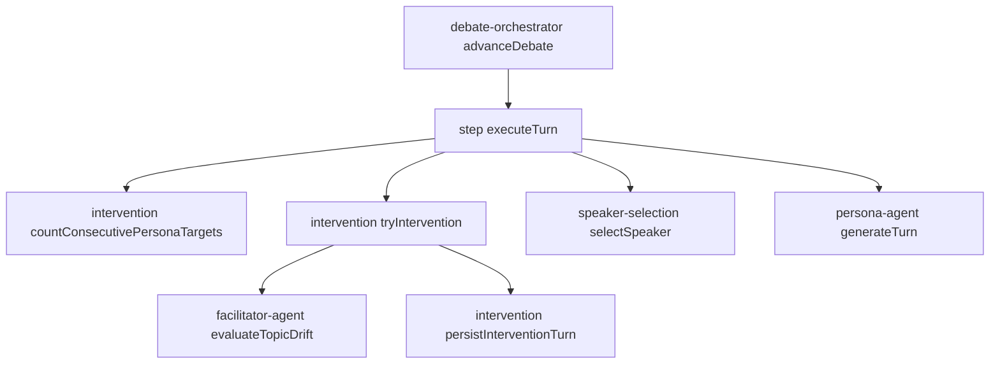
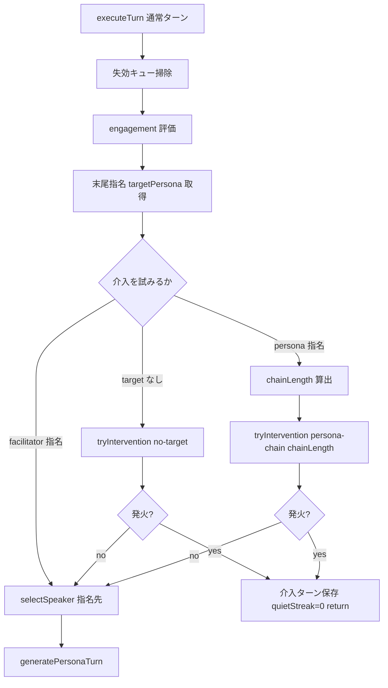

# Technical Design: facilitator-intervention-timing

## Overview

**Purpose**: ペルソナ同士の指名（`targetedBy='persona'`）が連鎖して討論が間延びする問題を、ファシリテーター介入を指名チェーン中にも評価し、判断軸を「論点ずれ（逸脱）」だけでなく「出尽くし（発展性のない応酬）」へ広げることで解消する。

**Users**: 討論コンテンツを生成・閲覧する管理者と閲覧者。無理やり答え合うだけの応酬が延々続かない、適切に区切られた討論を得られる。

**Impact**: 現状、`step.ts` `executeTurn` の `if (!targetPersona)` ゲートにより、ペルソナ指名チェーン中はファシリテーター介入が一度も評価されない。本設計はこのゲートを「指名なし、またはペルソナ指名チェーン中」に緩め、`evaluateTopicDrift` をチェーン中にも評価する。さらに drift の判断軸に「発展性のない応酬（出尽くし）」を加え、連続指名チェーン長を出尽くしを疑わせるソフトシグナルとして渡す。ターン数ベースの機械的な強制介入は設けず、暴走時の終了保証は既存ハードキャップに委ねる。

### Goals
- 指名チェーン中でも、会話が逸脱／応酬に発展性がないときにファシリテーターが割り込んで流れを整理する（内容駆動）。
- 「無理やり答え合うだけの往復」を出尽くしとして検知し、引き戻し／次論点投入で打ち切る。
- 逸脱でも出尽くしでもなく本当に深まっている最中は介入せずスルーする（過剰介入の防止）。
- 既存の冪等性・`runId` 世代分離・freeze（章末 +1）・ハードキャップ終了保証を一切壊さない。

### Non-Goals
- ターン数（連続指名長）ベースの強制介入。機械的に一定間隔で介入する仕組みは設けない。
- 既存スタール（stall）介入（低エンゲージメント前提）の発火条件の変更。
- engagement スコアリング・話者選択（キュー/スコア）アルゴリズムの変更。
- Firestore スキーマ・フロントエンド表示の変更。
- 専用の新規 LLM 介入関数の新設（`evaluateTopicDrift` の判断軸拡張で代替）。

## Boundary Commitments

### This Spec Owns
- `step.ts` `executeTurn` の介入評価ゲート（いつ介入を試みるか）の判定。
- 連続指名チェーン長の計測（`intervention.ts` の純関数）。
- `tryIntervention` の介入トリガー判別（no-target / persona-chain）と評価経路選択。
- `evaluateTopicDrift` の判断軸拡張（逸脱＋出尽くし）と chainLength シグナル（`facilitator-agent.ts`）。
- ペルソナ発言生成の指名抑制プロンプト（`persona-agent.ts`）。

### Out of Boundary
- 介入ターンの永続化トランザクション（`addTurn`）と frontier/世代照合（既存を利用するのみ）。
- stall 介入の発火条件、engagement 評価ロジック、話者選択ロジック（指名チェーン経路以外は不変）。
- 章の強制終了・早期終了・論点カバレッジ補正のルール（不変）。
- 終了保証を担うハードキャップ定数（参照のみ・変更しない）。

### Allowed Dependencies
- 既存の `persistInterventionTurn` / `addQueuedIntents` / `addTurn`（冪等追記）。
- 既存の `evaluateTopicDrift`（facilitator-agent）。
- 依存方向は一方向（orchestrator → step → intervention/turn → agents）を厳守。`intervention.ts` は orchestrator に依存しない。

### Revalidation Triggers
- `DebateTurn` の `targetedBy` / `targetPersonaId` の意味・形が変わる場合（チェーン計測の前提）。
- `tryIntervention` のシグネチャ変更（step 層が呼ぶ契約）。
- `executeTurn` の介入・話者選択の順序変更（`facilitator-intervention-engagement-fix` の順序保証と整合）。

## Architecture

### Existing Architecture Analysis
- **チェーン駆動**: `debate-orchestrator.ts` が `advanceDebate` で 1 step = 1 Cloud Task を駆動。次ステップは `decideNextStep` が永続状態のみから決定的に算出。
- **ステップ実行**: `step.ts` `executeTurn` が「失効キュー掃除 → engagement 評価 → 介入評価（`!targetPersona` 時のみ）→ 話者選択 → 発言生成」を実行。
- **介入**: `intervention.ts` `tryIntervention` がクールダウン後に drift→stall をカスケード。発火時は `persistInterventionTurn` で1ターン保存し `lastSpeakerId=undefined`。
- **drift の現状の限界**: `tryIntervention` は `hasHighEngagement` のとき drift に渡す未完了論点を空にする（[intervention.ts:121](../../functions/src/pipeline/debate/intervention.ts)）。その結果、高エンゲージメント時の drift は「明確な逸脱のみ」を見て、論点投入（出尽くし対応）ができない。盛り上がった指名チェーンはこの条件に該当し、既存経路では捕捉できない。
- **順序保証**: `facilitator-intervention-engagement-fix`（実装済み）により、介入発火イテレーションはファシリテーターターンのみ保存し、メンバー応答は次イテレーション。
- **維持すべき制約**: frontier 照合・`runId` 世代照合による単一勝者規則、freeze 分岐の独立性、ハードキャップ終了保証。

### Architecture Pattern & Boundary Map



**Architecture Integration**:
- **Selected pattern**: 既存チェーン駆動（orchestrator → step → intervention/agents）の拡張。中央ディスパッチャは追加しない。
- **Domain/feature boundaries**: 「いつ介入を試みるか」は step 層、「どの評価経路で永続化するか」は intervention 層、「介入するか・文面」は facilitator-agent 層に分離。
- **Existing patterns preserved**: 純関数による決定的計測（`countPersonaTurnsSinceFacilitator` に倣う）、`persistInterventionTurn` 単一経路、freeze 分岐の独立、no-target 経路の既存挙動。
- **New components rationale**: `countConsecutivePersonaTargets`（チェーン計測）のみ新規純関数。他は既存関数の引数・分岐拡張。
- **Steering compliance**: アロー関数、省略しない命名、過度な共通化の回避。新定数は追加しない。

### Technology Stack

| Layer | Choice / Version | Role in Feature | Notes |
|-------|------------------|-----------------|-------|
| Backend / Services | TypeScript (Node.js 24, Firebase Functions v2) | 介入タイミング制御ロジック | 新ライブラリ・新定数なし |
| AI | Anthropic SDK (Claude / `evaluateTopicDrift`) | 逸脱＋出尽くし判断・引き戻し文面生成 | プロンプト調整のみ |
| Data / Storage | Firestore（既存 `turns` / `engagements`） | 永続ターン列からチェーン長算出 | スキーマ変更なし |

## File Structure Plan

### Modified Files
- `functions/src/pipeline/debate/intervention.ts` — `countConsecutivePersonaTargets` 追加。`tryIntervention` に介入トリガー判別共用体（`no-target` / `persona-chain`）を導入し、`persona-chain` では drift のみ評価・未完了論点を渡す・chainLength を渡す。
- `functions/src/pipeline/debate/step.ts` — `executeTurn` の介入ゲートを「指名なし、またはペルソナ指名チェーン中」に緩和。チェーン長算出・トリガー構築。
- `functions/src/agents/facilitator-agent.ts` — `evaluateTopicDrift` に `{ chainLength?: number }` オプションを追加し、判断軸に「発展性のない応酬（出尽くし）」を加える。
- `functions/src/agents/persona-agent.ts` — `targetingGuide` / `targetBiasNote` の指名抑制プロンプトを強化（R6.1/6.2）。

### Test Files
- `functions/src/tests/pipeline/debate/intervention.test.ts` — `countConsecutivePersonaTargets` と `tryIntervention` トリガー分岐のテストを追加。
- `functions/src/tests/pipeline/debate/debate-parity.test.ts` / `debate-step-idempotency.test.ts` — 回帰確認（必要に応じてケース追加）。

> 依存方向: `intervention` → `step` → `orchestrator`、`agents` は `intervention`/`step`/`turn` から参照。上位への import は行わない。

## System Flows

### 介入判定フロー（executeTurn 通常ターン）



**Key Decisions**:
- 介入を試みる条件は「target なし」または「`targetedBy='persona'` の指名」。`targetedBy='facilitator'` の指名（章開始導入・前回介入の指名先）は割り込まず指名先に応答させる（R1.5 / R5.2）。
- `persona-chain` 経路は drift のみ評価（stall は回さない＝R7.4）。drift には未完了論点を常に渡し（`hasHighEngagement` による論点空化を適用しない）、出尽くし時の次論点投入を可能にする。chainLength も渡す。
- クールダウン未達は `tryIntervention` 内部で評価せず false を返し、指名先応答へ（R1.4）。
- いずれも非発火（逸脱でも出尽くしでもない）なら従来どおり `selectSpeaker` が指名先（またはキュー/スコア）を選ぶ（R1.3）。
- ターン数ベースの強制介入は持たない。drift が見送り続けた場合の終端は既存ハードキャップが保証（R4）。

## Requirements Traceability

| Requirement | Summary | Components | Interfaces | Flows |
|-------------|---------|------------|------------|-------|
| 1.1 | 指名チェーン中も介入評価 | step `executeTurn`, intervention `tryIntervention` | `tryIntervention(trigger)` | 介入判定フロー |
| 1.2 | 発火時は指名上書き・介入のみ保存 | intervention `persistInterventionTurn` | `persistInterventionTurn` | 介入判定フロー |
| 1.3 | 非発火時は指名先応答 | step `executeTurn`, speaker-selection | `selectSpeaker` | 介入判定フロー |
| 1.4 | クールダウン未達は評価せず | intervention `shouldEvaluateIntervention` | `tryIntervention` | 介入判定フロー |
| 1.5 | facilitator 指名は介入せず応答 | step `executeTurn` | — | 介入判定フロー |
| 2.1 | 逸脱＋出尽くしを判断軸に | facilitator-agent `evaluateTopicDrift` | `evaluateTopicDrift(opts)` | — |
| 2.2 | 逸脱→引き戻し | facilitator-agent `evaluateTopicDrift` | 同上 | — |
| 2.3 | 出尽くし→次論点（無ければ引き戻し） | facilitator-agent `evaluateTopicDrift`, intervention | 同上 | — |
| 2.4 | 次論点投入で introduced 更新 | intervention `tryIntervention`（既存） | — | — |
| 2.5 | 深まり中は見送り | facilitator-agent `evaluateTopicDrift` | 同上 | — |
| 3.1 | 連続指名長算出 | intervention `countConsecutivePersonaTargets` | `countConsecutivePersonaTargets` | 介入判定フロー |
| 3.2 | facilitator/指名なしで 0 | intervention `countConsecutivePersonaTargets` | 同上 | — |
| 3.3 | chainLength を出尽くしシグナルに | facilitator-agent `evaluateTopicDrift` | `evaluateTopicDrift({chainLength})` | — |
| 3.4 | 永続ターン由来・決定的 | intervention `countConsecutivePersonaTargets` | 同上 | — |
| 4.1 | ターン数強制介入を設けない | step `executeTurn`（設計判断） | — | — |
| 4.2 | 既存ハードキャップ維持 | orchestrator `decideNextStep`（不変） | — | — |
| 5.1 | 介入後チェーン 0 リセット | intervention `persistInterventionTurn`（既存） | — | — |
| 5.2 | facilitator 指名は次ターン応答 | step `executeTurn`, count（除外） | `countConsecutivePersonaTargets` | 介入判定フロー |
| 5.3 | 指名なし介入後は通常選択 | speaker-selection（既存） | `selectSpeaker` | — |
| 6.1 | 無関係なら target 指定しない | persona-agent `targetingGuide` | プロンプト | — |
| 6.2 | 直前話者への再 target 限定 | persona-agent `targetBiasNote` | プロンプト | — |
| 6.3 | 自己/不正 target 無効化 | turn `generatePersonaTurn`（実装済み） | — | — |
| 7.1 | 早期終了/カバレッジ補正不変 | step（不変箇所） | — | — |
| 7.2 | frontier/世代照合維持 | turn `addTurn`（既存） | — | — |
| 7.3 | freeze に介入判定を適用しない | step `executeTurn` freeze 分岐（不変） | — | — |
| 7.4 | チェーン経路以外の発火条件不変 | intervention（既存 no-target 経路） | — | — |

## Components and Interfaces

| Component | Domain/Layer | Intent | Req Coverage | Key Dependencies (P0/P1) | Contracts |
|-----------|--------------|--------|--------------|--------------------------|-----------|
| countConsecutivePersonaTargets | intervention | 末尾からの連続ペルソナ指名長を算出 | 3.1, 3.2, 3.4, 5.2 | DebateTurn (P0) | State |
| tryIntervention（拡張） | intervention | トリガー別に評価経路を選び介入を永続化 | 1.1, 1.2, 1.4, 2.3, 3.3 | evaluateTopicDrift (P0), persistInterventionTurn (P0) | Service |
| executeTurn（拡張） | step | 介入ゲート判定・チェーン長算出・トリガー構築 | 1.1, 1.3, 1.5, 4.1, 5.2, 7.3 | tryIntervention (P0), countConsecutivePersonaTargets (P0), selectSpeaker (P0) | Service |
| evaluateTopicDrift（拡張） | agents | 逸脱＋出尽くし判断＋chainLength シグナル | 2.1, 2.2, 2.3, 2.5, 3.3 | Claude API (P0) | Service |
| persona-agent prompts | agents | 過剰指名の抑制 | 6.1, 6.2 | Claude API (P1) | Service |

### intervention 層

#### countConsecutivePersonaTargets

| Field | Detail |
|-------|--------|
| Intent | 章ローカル永続ターン列末尾から、連続するペルソナ間指名の数を返す |
| Requirements | 3.1, 3.2, 3.4, 5.2 |

**Responsibilities & Constraints**
- 末尾から遡り `speakerType==='persona' && targetedBy==='persona' && targetPersonaId` が続く限りカウント。
- ファシリテーター発言・指名なしペルソナ発言・`targetedBy==='facilitator'` 指名に当たった時点で打ち切り。
- 永続ターン列（引数）のみに依存する純関数。乱数・時刻・I/O なし。

**Dependencies**
- Inbound: `executeTurn` — チェーン長取得（P0）
- Outbound: なし（純関数）

**Contracts**: State [x]

##### Service Interface
```typescript
// chapterTurns: 章ローカルのターン列（state.turns.slice(chapterTurnStartInState)）
export const countConsecutivePersonaTargets = (
  chapterTurns: readonly DebateTurn[]
): number;
```
- Preconditions: `chapterTurns` は時系列昇順。
- Postconditions: 0 以上の整数。末尾が非ペルソナ指名なら 0。
- Invariants: 同一入力に対し常に同一結果（決定的）。

**Implementation Notes**
- Integration: `countPersonaTurnsSinceFacilitator` と同ファイル・同パターン。`intervention.test.ts` にユニットテスト追加。
- Validation: 空配列 → 0、末尾 facilitator → 0、`targetedBy='facilitator'` → 0、連続 N → N。
- Risks: なし（純関数）。

#### tryIntervention（拡張）

| Field | Detail |
|-------|--------|
| Intent | 介入トリガー種別に応じて評価経路を選び、発火時に介入ターンを永続化する |
| Requirements | 1.1, 1.2, 1.4, 2.3, 3.3 |

**Responsibilities & Constraints**
- `trigger.kind` で評価経路を選択:
  - `no-target`: 従来どおり drift → stall（既存挙動・`hasHighEngagement` による論点空化も維持＝R7.4）。
  - `persona-chain`: **drift のみ**評価。未完了論点を常に渡す（`hasHighEngagement` による空化を適用しない）ことで出尽くし時の次論点投入を可能にし、`chainLength` をシグナルとして drift に渡す。
- いずれもクールダウン（`shouldEvaluateIntervention(countPersonaTurnsSinceFacilitator, cooldown)`）を満たすときのみ評価（R1.4）。
- 発火時は既存どおり `addQueuedIntents` → `persistInterventionTurn` で1ターン保存し、論点 introduced 更新（R2.4）。`lastSpeakerId=undefined` により次ターンのチェーン長は 0（R5.1）。

**Dependencies**
- Inbound: `executeTurn` — 介入評価依頼（P0）
- Outbound: `evaluateTopicDrift`（P0）, `evaluateStallIntervention`（P1, no-target 時のみ）, `persistInterventionTurn`（P0）, `addQueuedIntents`（P1）

**Contracts**: Service [x]

##### Service Interface
```typescript
type InterventionTrigger =
  | { kind: 'no-target' }
  | { kind: 'persona-chain'; chainLength: number };

export const tryIntervention = (args: {
  topicId: string;
  personas: Persona[];
  chapter: Chapter;
  chapterId: string;
  state: DebateState;
  engagements: Engagement[];
  interventionCooldown: number;
  trigger: InterventionTrigger;          // 追加
  chapterTurns?: DebateTurn[];
  chapterTurnStartIndex?: number;
  progressPatch?: ProgressPatch;
}): Promise<boolean>;                      // true=発火・保存済み
```
- Preconditions: `engagements` は当ターン評価済み。`trigger` は step 層が末尾指名とチェーン長から構築。
- Postconditions: 発火時 `state.turns` に介入ターン1件追加・`true`。非発火は副作用なしで `false`。
- Invariants: 介入永続化は本関数の単一経路を通る（重複所有なし）。

**Implementation Notes**
- Integration: `persona-chain` では `tryTopicDriftIntervention` に未完了論点と `chainLength` を渡す。`no-target` は現行コードのまま（drift→stall、`hasHighEngagement` 抑止維持）。
- Validation: drift が逸脱でも出尽くしでもないと判断（空応答）した場合は `false`。step 層が指名先応答へ。
- Risks: drift の判断軸拡張はプロンプト品質依存（research.md のリスク参照）。

### step 層

#### executeTurn（拡張・介入ゲート）

| Field | Detail |
|-------|--------|
| Intent | 末尾指名とチェーン長から介入トリガーを構築し、介入評価のゲートを判定する |
| Requirements | 1.1, 1.3, 1.5, 4.1, 5.2, 7.3 |

**Responsibilities & Constraints**
- freeze 分岐は不変（介入・チェーン判定を一切適用しない＝R7.3）。
- 通常ターンで `targetPersona = getLastTargetPersona(state.turns)` を取得後:
  - `!targetPersona` → trigger `no-target`。
  - `targetPersona.targetedBy==='persona'` → `chainLength = countConsecutivePersonaTargets(getChapterTurns())` を算出し trigger `persona-chain`。
  - `targetPersona.targetedBy==='facilitator'` → 介入を試みず指名先に応答（R1.5 / R5.2）。
- 介入発火（`tryIntervention` が true）なら `saveDiscussionPointStatuses` 後 `{ committed: true, quietStreak: 0 }` で return（既存挙動と同一）。
- 非発火なら従来フロー（`selectSpeaker` → `addQueuedIntents` → `generatePersonaTurn`）。

**Dependencies**
- Inbound: `performTurnStep`（P0）
- Outbound: `countConsecutivePersonaTargets`（P0）, `tryIntervention`（P0）, `selectSpeaker`（P0）

**Contracts**: Service [x]

**Implementation Notes**
- Integration: 現行 `if (!targetPersona) { tryIntervention... }` ブロックを、上記トリガー構築付きの分岐に置換。発火時の戻り（`quietStreak: 0`・return）と非発火時のフォールスルーは現行と同形。
- Validation: `facilitator-intervention-engagement-fix` の「介入イテレーションはファシリテーターのみ保存」を維持（発火時は generatePersonaTurn を呼ばず return）。
- Risks: 分岐条件の取り違えで facilitator 指名にも割り込む回帰 → トリガー構築の単体テストで担保。

### agents 層

#### evaluateTopicDrift（拡張）

| Field | Detail |
|-------|--------|
| Intent | 判断軸に「発展性のない応酬（出尽くし）」を加え、chainLength シグナルを受ける |
| Requirements | 2.1, 2.2, 2.3, 2.5, 3.3 |

**Responsibilities & Constraints**
- 既存シグネチャに後方互換なオプション引数を追加: `{ chainLength?: number }`。
- 三択判断を次のように拡張（has-points / no-points 両方の criteria に反映）:
  1. フォーカス問いから逸脱 → 引き戻し（R2.2）。
  2. 逸脱はしていないが**応酬に新たな発展性がない**（指摘・質問に無理やり答えるだけの往復になっている）または現在の論点が一段落 → 未完了論点を投入。未完了論点が無ければ引き戻し・振り直し（R2.3）。
  3. 本題に沿って**新たに深まっている最中** → 介入しない（R2.5）。
- `chainLength` が与えられた場合、criteria に「同じ相手指名が N 回続いている。長いほど発展性が尽きている可能性を疑う」旨を含める（R3.3）。
- 戻り値の型（`Result<FacilitatorReply, PipelineError>`）と `content`/`targetPersonaId`/`selectedDiscussionPointIndex` の意味は不変。

**Dependencies**
- Inbound: `tryTopicDriftIntervention`（intervention 層, P0）
- Outbound: Claude API（`generateObject`, P0）

**Contracts**: Service [x]

##### Service Interface
```typescript
export const evaluateTopicDrift = (
  turns: DebateTurn[],
  personas: Persona[],
  speakCount?: Map<string, number>,
  currentChapter?: Chapter,
  unaddressedDiscussionPoints?: string[],
  options?: { chainLength?: number }            // 追加（後方互換）
): Promise<Result<FacilitatorReply, PipelineError>>;
```
- Preconditions: なし（options 省略時は従来挙動）。
- Postconditions: 逸脱でも出尽くしでもなければ空 `content`（見送り）。
- Invariants: 既存呼び出し（options 省略）は従来挙動。

**Implementation Notes**
- Integration: `persona-chain` 経路の `tryTopicDriftIntervention` が未完了論点と `chainLength` を渡す。`no-target` 経路の挙動は不変。
- Validation: 「発展性なし」の判断が criteria に含まれること、`chainLength` が criteria に反映されることをユニットテスト（モック）で確認。
- Risks: プロンプト調整のため効果はモデル挙動依存。文面は調整可能に保つ。

#### persona-agent prompts（R6）

| Field | Detail |
|-------|--------|
| Intent | 過剰な指名（特に直前話者への即時再指名）を抑制 |
| Requirements | 6.1, 6.2 |

**Responsibilities & Constraints**
- `targetingGuide`: 「特定の参加者と直接関係しない話なら targetPersonaId を指定しない」を維持・強調（R6.1）。
- `targetBiasNote`: 「直前話者への再 target は直接の確認・反論が必要な場合のみ」を維持・強調（R6.2）。
- R6.3（自己/不正 target 無効化）は `turn.ts` で実装済み。本コンポーネントでは扱わない。

**Contracts**: Service [x]（プロンプト調整のみ、制御フロー変更なし）

**Implementation Notes**
- Integration: 既存文字列の文言調整に限定。スキーマ（`targetPersonaId: z.string().nullable()`）は不変。
- Risks: 指名抑制が強すぎると相互作用が減る → 文言は控えめに調整。

## Error Handling

### Error Strategy
- LLM 呼び出し（`evaluateTopicDrift`）失敗は既存どおり `Result` のエラーを `pipelineErrorMessage` 経由で throw し、チェーン駆動のリトライ（resume）に委ねる。
- drift が「逸脱でも出尽くしでもない」と判断（空応答）した場合は throw せず `tryIntervention` が `false` を返し、step 層が指名先応答へ継続。新たな失敗カテゴリは追加しない。

### Error Categories and Responses
- **System Errors**: Claude API 失敗 → 既存リトライ/resume。
- **Business Logic（介入見送り）**: drift が見送り → 指名先応答継続。暴走時の終端は `MAX_TURNS`/`TURN_CAP` が保証（R4.2）。

### Monitoring
- 既存のパイプラインログに準拠。新規メトリクスは追加しない（介入発火種別のログ付与は実装時の任意）。

## Testing Strategy

### Unit Tests
- `countConsecutivePersonaTargets`: 空列=0 / 末尾 facilitator=0 / `targetedBy='facilitator'`=0 / 連続ペルソナ指名 N=N / 途中に指名なし発言で打ち切り。
- `tryIntervention` トリガー分岐: `no-target` は drift→stall を呼ぶ（`hasHighEngagement` 抑止維持）/ `persona-chain` は drift のみ・未完了論点と `chainLength` を渡す / クールダウン未達は評価しない。
- `evaluateTopicDrift`（モック）: 「発展性なし（出尽くし）」が判断軸に含まれる criteria / `chainLength` が criteria に反映される。

### Integration Tests
- `executeTurn` 介入ゲート: ペルソナ指名チェーン中に drift 発火 → ファシリテーターターンのみ保存・`quietStreak=0`・ペルソナ応答なし（順序保証）。
- `targetedBy='facilitator'` の指名では介入を試みず指名先応答（R1.5 / R5.2）。
- drift 見送り時は指名先応答が続き、終端はハードキャップで保証（R4.2）。
- 回帰: `debate-parity` / `debate-step-idempotency` で frontier/世代照合・冪等性が不変。

## Performance & Scalability
- 追加コストはチェーン中ターンでの drift 評価 1 回（クールダウンで抑制）。`persona-chain` は stall を回さないため LLM 呼び出しは増えない（既存 no-target 時と同等オーダー）。
- Firestore 読み書きは介入ターン追記のみで既存と同一。
