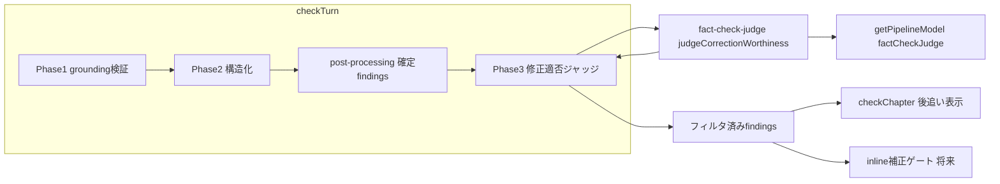
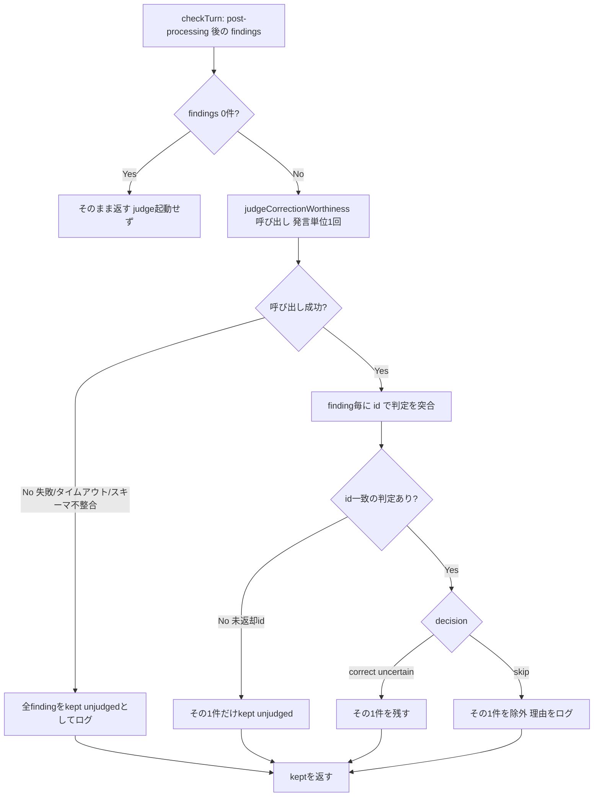

# Technical Design: fact-check-correction-worthiness

## Overview

**Purpose**: ファクトチェックの過検出を抑えるため、検出済みの指摘（finding）に対して「この発言を直さないと事実誤認として読者に伝わるか／それとも問い・提案・仮定・当為として自然で、直すと発言が壊れるか」を討論文脈付きで判定する**修正適否ジャッジ**を、ファクトチェックパイプラインの最終段に共通フィルタとして追加する。

**Users**: 後追いファクトチェックの結果を見る管理者（表示品質の向上）と、将来の発言インライン補正（`inline-speech-fact-check-correction`）の補正対象判定（共通ゲート）。

**Impact**: [checkTurn](functions/src/pipeline/fact-check/fact-check-runner.ts#L110) の戻り値を「検出した全 finding」から「修正すべきと判定した finding のみ」に変える。`checkTurn` は後追い `checkChapter` と将来の inline の唯一の合流点であり、ここを通すだけで全消費者がフィルタ済みを受け取る。検出（Phase1/2）・finding 型・FE 表示・repository は不変。

### Goals
- 検出済み finding を「修正すべきか」で絞り込む判定段を `checkTurn` 内に1段追加する（要件1）。
- 「問いの前提」「当為・提案・規範」の過検出を、一般原則ベースの判定で抑制する（要件3, 4）。
- 真の事実誤認は残す保守的デフォルトと、判定失敗時のフェイルオープンを保証する（要件5, 6）。
- 判定結果を評価可能な構造で返し、回帰テストで汎化を守る（要件7, 2.6）。

### Non-Goals
- 発言の補正・再生成（`inline-speech-fact-check-correction` の責務）。
- 検出プロンプト（Phase1 grounding / Phase2 構造化）の改修（`fact-check-validity-improvement` の責務）。
- `FactCheckFinding` データ構造の変更、管理画面の表示レイアウト変更（本設計は型・FE 不変）。
- 対象外 finding の永続化（案2）。本設計は破棄＋ログ（案1）に限定する。

## Boundary Commitments

### This Spec Owns
- `checkTurn` 内の修正適否判定段（Phase3）と、その判定ロジック・プロンプト・出力スキーマ。
- 判定関数 `judgeCorrectionWorthiness(content, findings, context)` の契約。
- 判定モデル定数 `factCheckJudge` の追加。
- 過検出抑制／回帰の評価ケース（judge 単体テスト）。

### Out of Boundary
- 発言の再生成・補正フロー（inline スペック）。
- 検出フェーズ（Phase1/Phase2）のプロンプト・スキーマ。
- finding 型・FE 表示・`factCheck/result` の永続スキーマ。
- 対象外理由の画面表示（案2）。

### Allowed Dependencies
- 既存 [FactCheckContext](functions/src/pipeline/fact-check/fact-check-runner.ts#L30)、[FactCheckFinding](functions/src/types/fact-check.types.ts#L8)（読み取りのみ）。
- [getPipelineModel](functions/src/llm/models.ts#L35) / [PIPELINE_MODELS](functions/src/constants/ai.constants.ts#L6)（Gemini provider 供給）。
- `ai` パッケージ（`generateObject`）、`zod`。

### Revalidation Triggers
- `judgeCorrectionWorthiness` の入力/出力契約変更（inline スペックが将来この判定を参照するため）。
- `checkTurn` の戻り値の意味変更（「フィルタ済み」という前提が消費者の暗黙契約）。
- 記録方式を案1→案2へ変更（finding 型拡張＝FE・repository・inline へ波及）。

## Architecture

### Existing Architecture Analysis
- ファクトチェックは `checkTurn`（発言単位）→ `checkChapter`（章単位ループ）の二層。`checkTurn` は Phase1（grounding 検証, gemini-2.5-pro）→ Phase2（構造化, gemini-2.5-flash）→ post-processing（引用照合・出典写像・unverifiable 格上げ）で finding を確定する（[L122-174](functions/src/pipeline/fact-check/fact-check-runner.ts#L122)）。
- 後追い経路は `runFactCheck`（onCall）→ `runFactCheckTask`（onTaskDispatched, 1800s）→ `checkChapter`。inline 経路（将来）は `runStep`（onTaskDispatched, 540s, 1タスク1ターン）から `checkTurn` 相当を呼ぶ。
- **保たれる制約**: ディスパッチャを作らない（structure.md）。判定は「消費者側の分岐」ではなく「パイプライン1段」として検出経路に置く。

### Architecture Pattern & Boundary Map



**Architecture Integration**:
- Selected pattern: **パイプライン末尾フィルタ**（検出経路の最終段に判定を1段追加）。中央ディスパッチャを作らず共通化を実現する。
- Domain/feature boundaries: 検出（runner）と修正適否（judge）を別ファイルに分離。judge は finding を生成せず、入力 finding を絞るのみ。
- Existing patterns preserved: Result 型エラー処理、`FactCheckContext` の文脈受け渡し、Gemini provider 供給（`getPipelineModel`）。
- New components rationale: `fact-check-judge.ts`（判定責務の分離・単体テスト・inline 再利用）、`factCheckJudge` モデル定数（判定用 LLM 供給）。
- Steering compliance: 過度な共通化の回避（パイプライン段であってディスパッチャではない）、型安全（`any` 不使用）、AI ロジックは `pipeline/fact-check/` に配置。

### Technology Stack

| Layer | Choice / Version | Role in Feature | Notes |
|-------|------------------|-----------------|-------|
| Backend / Services | TypeScript（Functions, strict） | 判定ロジック・パイプライン統合 | 既存 runner と同層 |
| AI | Gemini 2.5-flash（`ai` `generateObject` + zod） | 修正適否の構造化判定 | `factCheckStructuring` と同モデル系。`GEMINI_API_KEY` 未設定時は claude フォールバック |
| Data / Storage | （変更なし） | — | finding 型・`factCheck/result`・FE は不変（案1） |

## File Structure Plan

### Directory Structure
```
functions/src/
├── pipeline/fact-check/
│   ├── fact-check-runner.ts    # checkTurn に Phase3 呼び出しを追加（既存）
│   └── fact-check-judge.ts     # 新規: judgeCorrectionWorthiness とプロンプト・スキーマ
├── constants/
│   └── ai.constants.ts         # PIPELINE_MODELS に factCheckJudge を追加（既存）
├── llm/
│   └── models.ts               # getPipelineModel の switch に factCheckJudge case 追加（既存）
└── tests/pipeline/fact-check/
    ├── fact-check-judge.test.ts        # 新規: 評価ケース（過検出抑制・回帰）
    └── fact-check-runner.test.ts       # 既存: checkTurn が judge を通すことの結線テスト追加
```

### Modified Files
- `functions/src/pipeline/fact-check/fact-check-runner.ts` — `checkTurn` の `return` 直前で `judgeCorrectionWorthiness` を呼び、`kept` を返す。finding 0 件時は呼ばない（要件1.3）。
- `functions/src/constants/ai.constants.ts` — `PIPELINE_MODELS.factCheckJudge: 'gemini-2.5-flash'` を追加。
- `functions/src/llm/models.ts` — `getPipelineModel` の `factCheckGrounding`/`factCheckStructuring` case 群に `factCheckJudge` を追加（同じ Gemini 供給ロジック）。

### Dependency Direction
`types / constants → llm/models → fact-check-judge → fact-check-runner(checkTurn) → checkChapter / inline(将来)`
judge は types・models・constants のみに依存し、runner からは judge を一方向に呼ぶ。judge は `DebateTurn`・repository に依存しない。

## System Flows



**Key Decisions**:
- 判定は発言単位で1回（finding 群をまとめて評価）。finding 0 件のターンは判定を起動しない（コスト最小・要件1.3, 7）。
- 突合は finding の `id`（既存 nanoid）で行い、除外は `decision==='skip'` のみ。`correct`/`uncertain`/`unjudged` は残す（保守的デフォルト・要件5.3）。
- フェイルオープンは2段階（要件6.1/6.3）: LLM 呼び出し失敗・スキーマ不整合は**全件**温存、id 未返却は**その1件のみ**温存（per-finding）。1件のずれで発言全体のフィルタを無効化しない。

## Requirements Traceability

| Requirement | Summary | Components | Interfaces | Flows |
|-------------|---------|------------|------------|-------|
| 1.1, 1.2 | finding を表示前にフィルタ | checkTurn, Judge | `judgeCorrectionWorthiness` | System Flows |
| 1.3 | finding 0件は起動しない | checkTurn | 早期 return | Empty 分岐 |
| 1.4 | 検出内部に置き全経路が受領 | checkTurn | 戻り値=kept | Boundary Map |
| 2.1, 2.2 | 討論文脈＋原則で判定 | Judge | `context` 引数・判定プロンプト | — |
| 2.3, 2.4, 2.5 | 修正適否の基準 | Judge | decision スキーマ | Map/Decide |
| 2.6 | 汎化・事例非埋め込み | Judge | 原則プロンプト | — |
| 3.1, 3.2 | 問いの前提を抑制 | Judge | 判定プロンプト | Decide=skip |
| 4.1, 4.2 | 当為・提案を抑制 | Judge | 判定プロンプト | Decide=skip |
| 5.1, 5.2, 5.4 | 真の誤りは残す | Judge | decision=correct | Decide=keep |
| 5.3 | 不確実は残す | Judge | uncertain→keep | Map |
| 6.1, 6.3 | 失敗時フェイルオープン | Judge | try/catch→unjudged | FailOpen |
| 6.2 | 未判定を記録 | Judge | decision=unjudged ログ | FailOpen |
| 7.1, 7.2 | 判定根拠の記録 | Judge | `decisions[]` 返却・ログ | Map |
| 7.3 | finding 構造と整合 | checkTurn | kept は FactCheckFinding 不変 | — |

## Components and Interfaces

| Component | Domain/Layer | Intent | Req Coverage | Key Dependencies (P0/P1) | Contracts |
|-----------|--------------|--------|--------------|--------------------------|-----------|
| fact-check-judge | pipeline/fact-check | finding を修正適否で絞る | 2,3,4,5,6,7 | getPipelineModel (P0), FactCheckContext/FactCheckFinding (P0) | Service |
| checkTurn (改修) | pipeline/fact-check | 検出末尾で judge を通す | 1 | fact-check-judge (P0) | Service |
| factCheckJudge model | constants/llm | 判定用 LLM 供給 | 2 | GEMINI_API_KEY (P1) | — |

### pipeline/fact-check

#### fact-check-judge（新規）

| Field | Detail |
|-------|--------|
| Intent | 検出済み finding を討論文脈で評価し、修正すべきものだけを残す |
| Requirements | 2.1, 2.2, 2.3, 2.4, 2.5, 2.6, 3.1, 3.2, 4.1, 4.2, 5.1, 5.2, 5.3, 5.4, 6.1, 6.2, 6.3, 7.1, 7.2 |

**Responsibilities & Constraints**
- 入力 finding を絞るのみ。**finding を新規生成・改変しない**（id/claim/verdict 等は不変）。
- `DebateTurn`・repository・FE に依存しない（inline がドラフトに再利用できるよう `content/findings/context` のみを受ける）。
- 失敗時は全件温存（フェイルオープン）。判定の失敗を検出の失敗と独立に扱う。
- 判定は一般原則ベース。プロンプトに個別事例を埋め込まない（要件2.6）。

**Dependencies**
- Inbound: `checkTurn` — finding 確定後に呼ばれる（P0）
- Outbound: `getPipelineModel('factCheckJudge')` — 判定 LLM（P0）
- External: `ai` `generateObject` + `zod` — 構造化判定（P0）

**Contracts**: Service [x]

##### Service Interface
```typescript
// 判定の決定種別。skip のみ除外、それ以外は残す（保守的デフォルト）。
type CorrectionWorthinessDecision = 'correct' | 'skip' | 'uncertain';

// finding 1件ごとの判定結果（評価・ログ用。要件7.2）。
interface FindingJudgment {
  findingId: string;               // 対象 finding の id（既存 nanoid）で突合
  decision: CorrectionWorthinessDecision | 'unjudged'; // unjudged は失敗時の内部値（要件6.2）
  reason: string;                  // そう判定した理由（要件7.1）
}

interface CorrectionWorthinessResult {
  kept: FactCheckFinding[];        // 修正すべきと判定して残した finding（checkTurn の戻り値に使う）
  judgments: FindingJudgment[];    // 全 finding の判定（テスト・ログ用。要件7.2）
}

// context は必須（要件2.1/2.2: 討論文脈での判定が機能の本質）。
const judgeCorrectionWorthiness: (
  content: string,
  findings: FactCheckFinding[],
  context: FactCheckContext
) => Promise<CorrectionWorthinessResult>;
```
- Preconditions: `findings.length > 0`（0 件時は呼び出し側で判定を起動しない＝要件1.3）。`context` 必須。
- Postconditions: `kept` は入力 findings の部分集合（順序保持・要素は不変）。`judgments.length === findings.length`（id ごとに1件）。`decision==='skip'` の finding のみ `kept` から除外。`correct`/`uncertain`/`unjudged` は `kept` に含める。
- Invariants: finding の内容を改変しない。例外を呼び出し側へ伝播しない（内部で握り、フェイルオープン）。

##### 判定の LLM 契約（generateObject schema）
```typescript
// LLM へは findings を id（既存 nanoid）付きで提示し、id をエコーさせる。
// 'unjudged' は LLM 出力には含めない（内部のフェイルオープン専用）。
const judgmentSchema = z.object({
  judgments: z.array(z.object({
    id: z.string(),               // 提示した finding.id をそのまま返す
    decision: z.enum(['correct', 'skip', 'uncertain']),
    reason: z.string()
  }))
});
```
- **id で突合（部分文字列照合はしない）**。判定は finding 単位で適用する。
- **per-finding フェイルオープン（要件6.1）**: judge が返さなかった id・未知の id の finding は、その1件だけ `decision: 'unjudged'` として `kept` に残す（1件のずれで発言全体のフィルタを無効化しない）。LLM 呼び出し自体の失敗・スキーマ不整合時は全件 `unjudged` で `kept`。

**判定プロンプトの方針（要件2, 3, 4, 5）**
- 前提提示: 「これは多様な立場が意見・提案・問いを交わす討論であり、事実として読者に誤って伝わる**断定**のみを修正対象とする」。討論テーマ・章（`context`）を添える。
- 残す（correct）: 断定された事実が誤っている。問い・提案の形式でも、その中で確定事実として述べた断定の誤りは残す（要件5.2）。
- 除外（skip）: 対象箇所が問いの前提／問いから再構成した暗黙命題（要件3）、当為・提案・規範（これから盛り込む条項を含む反実仮想）／提案の実現可能性への反論（要件4）。**これらに該当すると判断できたら `uncertain` に逃がさず、自信を持って `skip` する**。
- 不確実（uncertain）: 「断定された事実誤認」か「問い・提案等の非対象」かが**真に判別不能**なときに限る → 残す側に倒す（要件5.3）。判別がつくのに迷って uncertain を選ばない。
- 一般原則のみを記述し、個別事例を列挙しない（要件2.6）。
- 受け入れ基準（要件3,4 と 5.3 の両立）: 評価セットの過検出5件で judge が `skip` を返すこと（`uncertain` への逃避で過検出が残らないこと）をテストで担保する。

**Implementation Notes**
- Integration: `checkTurn` の `return { ok: true, value: findings }`（[L174](functions/src/pipeline/fact-check/fact-check-runner.ts#L174)）の直前で、`findings.length > 0` のとき `judgeCorrectionWorthiness(turn.content, findings, context)` を呼び `value: result.kept` を返す。`context` は必須引数（要件2.1/2.2）。`checkTurn` の `context` も本機能では必須前提とし、未指定での呼び出しを許容しない。
- Validation: 返却 judgment の `id` を入力 finding の `id` 集合と突合（未知 id は無視、未返却 id は per-finding フェイルオープン）。`generateObject` の zod でスキーマ検証。
- Risks: プロンプト汎化（過検出残存／過剰除去）。評価セットで両側を固定。`uncertain` 多用で過検出が残らないよう受け入れ基準で監視。

#### checkTurn（改修）

| Field | Detail |
|-------|--------|
| Intent | 検出の最終段で judge を通し、フィルタ済み finding を返す |
| Requirements | 1.1, 1.2, 1.3, 1.4, 7.3 |

**Responsibilities & Constraints**
- finding 0 件のときは judge を呼ばずそのまま返す（要件1.3）。
- 戻り値は従来と同じ `Result<FactCheckFinding[], PipelineError>`。中身が「フィルタ済み」になる点のみ変わる（型不変・要件7.3）。
- judge の失敗で `checkTurn` 全体を失敗にしない（judge 側でフェイルオープン済み）。

**Contracts**: Service [x]（既存シグネチャ不変）

**Implementation Notes**
- Integration: 既存 post-processing 後の `findings` を judge に渡す。`checkChapter`（[L196](functions/src/pipeline/fact-check/fact-check-runner.ts#L196)）は無変更で恩恵。
- Validation: 既存の引用照合・出典写像・unverifiable 格上げは judge の前段で従来どおり実施。
- Risks: 後追いの再試行で judge が再走し結果が揺れるが、`resetFactCheckProgress` が部分追記をクリアするため整合は保たれる。

## Error Handling

### Error Strategy
判定段のエラーは**フェイルオープン**（検出済み finding を失わせない）を原則とする。検出（Phase1/2）の失敗系統とは独立。

### Error Categories and Responses
- **判定 LLM 失敗 / タイムアウト / スキーマ不整合**（要件6.1）: judge 内 `try/catch` で握り、**全 finding** を `kept`・`decision: 'unjudged'` として返す＋ログ。`checkTurn` は成功扱いで継続。
- **id 未返却 / 未知 id**（per-finding）: 判定が返らなかった finding は**その1件だけ** `kept`・`unjudged`。未知 id は無視。発言全体のフィルタは無効化しない。
- **GEMINI_API_KEY 未設定**: `getPipelineModel` が claude へフォールバック（既存挙動）。判定自体は動作。

### Monitoring
- 除外（skip）finding は `turnId`・`claim`・`reason` を `console` に出す（要件7.1）。
- 未判定（unjudged）は失敗理由とともにログ（要件6.2）。
- 判定件数・除外件数を発言単位でログし、過検出抑制の効きを観測可能にする。

## Testing Strategy

### Unit Tests（fact-check-judge.test.ts）
- 過検出抑制（skip）: 問いの前提2例（国連・赤十字／インド・ブラジル）、当為・提案3例（インドの役割／24時間報告／事前制裁）が `kept` から除外される（要件3, 4）。※テスト入力としてのみ使用し、プロンプトには埋め込まない（要件2.6）。
- uncertain 逃避の抑止（受け入れ基準・Issue 1）: 上記5件の判定が `uncertain` ではなく `skip` であること（迷いで過検出が残らない）（要件3, 4 ↔ 5.3）。
- 回帰（correct 残置）: 断定された誤り（大会方式変更による試合数、現在日時基準の時間軸の断定）が `kept` に残る（要件5.1, 5.4）。
- 問い・提案形式でも内部の確定事実の誤りは残す（要件5.2）。
- uncertain は `kept` に残る（要件5.3）。
- フェイルオープン: 判定 LLM 失敗・スキーマ不整合時に全 finding が `kept`・`unjudged`。id 未返却時はその1件だけ `kept`・`unjudged`（per-finding）になる（要件6.1, 6.2）。
- `judgments.length === findings.length` と reason の付与（要件7.1, 7.2）。

### Integration Tests（fact-check-runner.test.ts）
- finding ありの `checkTurn` が judge を通してフィルタ済みを返す（`generateObject` モックに判定分を追加）。
- finding 0 件で judge が呼ばれない（要件1.3）。
- `checkChapter` がフィルタ済み finding を集約する（後追い経路の結線）。

## Open Questions / Risks
- 記録は案1（ログ＋テスト）。管理画面で「除外理由」を見たい要望が出たら案2（finding 型拡張・FE 出し分け）へ拡張する（Revalidation Trigger）。
- 判定モデルは flash 相当を既定とするが、過検出/見逃しの評価次第で pro へ引き上げる余地（research.md 参照）。
- `inline-speech-fact-check-correction`（保留中）は本判定をドラフト（id 未確定）に再利用する想定。judge を `content/findings/context` 契約に保つことが前提。
