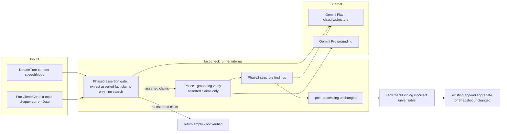
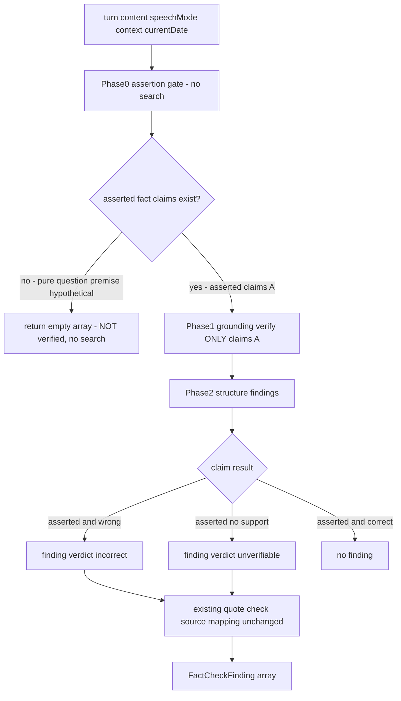

# Technical Design: fact-check-validity-improvement

## Overview

**Purpose**: 既存 `chapter-fact-check` のファクトチェック判定を**発話文脈（断定性）に応じて調整**し、誤検出を減らす。問い・前提・仮定・代弁として述べられた主張は**検証も指摘もせず**、事実として断定された主張は従来どおり（最新性・時間軸も含めて）厳密に検証する。

**Users**: 管理者が完了章のファクトチェックを実行した際、誤検出（問いかけの前提を誤りと断じる等）が抑えられ、断定された事実の誤りに集中して確認できる。

**Impact**: 検証ロジック（[fact-check-runner.ts](functions/src/pipeline/fact-check/fact-check-runner.ts)）に**断定ゲート（Phase0）を新設**する。非断定の主張は **grounding 検索に到達する前に除外**され、検証も finding 生成も行われない。`FactCheckFinding` の形・`FactCheckVerdict` の値・永続・FE 表示はいずれも不変。

> **設計やり直しの背景（旧版からの方針転換）**: 旧 design は「Phase1 で前提部分まで検索し、Phase2 で非断定を落とす（検索コストは1呼び出しで不変だから許容）」としていた。これは requirements 2.1/2.2/2.3 の「非断定は**検証**も指摘も**しない**」を実装しておらず、(a) 前提の検証テキストが過検出の燃料になる、(b) 非断定の grounding 検索という実質的に「検証している」状態が残る、という不整合を生んでいた。本版は**断定ゲートを検索の前に置く**ことで要件に回帰する。

### Goals
- 各事実主張を断定/非断定で判定し、**非断定は grounding 検証にも掛けず** finding も生成しない（1.x, 2.x）
- 断定された事実は従来どおり検証し、最新性・時間軸の誤りも捉える（3.x）
- 時間軸検証のため検証コンテキストに現在日時を与える（3.5）

### Non-Goals
- 実行制御・永続・逐次表示の仕組みの変更（chapter-fact-check が所有）
- 意見・価値判断の正否評価（従来どおり対象外）
- 非断定の主張に対する別種の指摘（`contextual` verdict 等）の保持 — 検証しない以上、ファクトチェック判断を含まない指摘は残さない
- `FactCheckFinding` / `FactCheckVerdict` の契約変更
- `fact-check-correction-worthiness`（修正適否ジャッジ）の改廃 — 本スペックは上流の過検出を断つが、後段ジャッジの縮小・廃止判断は当該スペックで別途行う（下記 Revalidation Triggers 参照）

## Boundary Commitments

### This Spec Owns
- runner の**断定ゲート（Phase0）** — 発言から検証対象の断定された事実主張のみを抽出し、非断定を Phase1 検索の前に除外する
- `FactCheckContext` への現在日時の追加と時間軸検証の指示
- `turn.speechMode` を断定ゲートの手掛かりとして渡すこと
- Phase1/Phase2 プロンプトの検証範囲指示（断定ゲートが渡した断定主張のみを検証・構造化）

### Out of Boundary
- 章・ターンの生成・永続、章ステータス管理（討論パイプライン）
- ファクトチェックの実行制御・結果ドキュメントの保存フロー（chapter-fact-check）
- `FactCheckFinding` / `FactCheckVerdict` のデータ契約（変更しない）
- `speechMode` の生成・付与ロジック（persona-question-mode が所有。本スペックは読み取りのみ）
- 修正適否ジャッジ（fact-check-correction-worthiness が所有）

### Allowed Dependencies
- `DebateTurn`（`content` / `speakerType` / `speechMode`）の読み取り
- `currentDateString()`（`utils/prompt-formatters`）の流用
- Gemini grounding／構造化／分類（`getGoogleProvider` / `getPipelineModel`）・`search/grounding`
- 既存 `FactCheckFinding[]` の逐次追記・集約経路（repository / api、無改修）

### Revalidation Triggers
- `FactCheckContext` の形変更
- 断定ゲート／Phase1／Phase2 プロンプトの検証範囲方針の変更（誤検出/見逃しのバランスに影響）
- `DebateTurn.speechMode` の値・意味変更（persona-question-mode 連動）
- **本スペックの過検出抑制効果により、後段の `fact-check-correction-worthiness`（修正適否ジャッジ）の要否・スコープを再評価すること**（上流で非断定を断てば、後段で拾うべき過検出が縮小するため）

## Architecture

### Existing Architecture Analysis
- **判定の集中点**: 発言単位の `checkTurn` が Phase1（grounding 検証, gemini-2.5-pro）→ Phase2（構造化, gemini-2.5-flash）→ 後処理（引用照合・出典写像・verdict 降格）で finding を生成する。本スペックは `checkTurn` の先頭に Phase0（断定ゲート）を挿入し、Phase1/Phase2 プロンプトと `FactCheckContext` を拡張する。
- **保持すべき統合点**: `checkChapter` の逐次 `onTurnFindings`、`FactCheckFinding[]` の形（api の `aggregateSources`・repository の追記が依存）、FE の onSnapshot 表示。いずれも不変。
- **再利用する前例**: 文脈注入 `FactCheckContext`（テーマ・章・focusQuestion を既に各発言検証へ渡している）に現在日時を加えるだけで時間軸検証が成立する。断定ゲートは grounding 不要の `generateObject`（軽量 Flash）で、Phase2 と同型の呼び出しパターンを踏襲する。

### Architecture Pattern & Boundary Map



**Architecture Integration**:
- **Selected pattern**: Option D（runner 内に Phase0 断定ゲートを前置）。判定は runner 内のプロンプトに素直に書き、中央ディスパッチャや独立モジュールは作らない（structure.md）。
- **Domain/feature boundaries**: 断定判定・検証範囲＝runner のプロンプトのみ。型・永続・実行制御・FE には触れない。
- **Existing patterns preserved**: Phase1/Phase2 二段、`FactCheckContext` 文脈注入、引用照合・出典写像、逐次追記、onSnapshot、`verdict: incorrect | unverifiable`。
- **New components rationale**: 新規型なし。`checkTurn` 内に Phase0（`generateObject`・Flash・grounding なし）を1段追加し、`FactCheckContext` に1フィールド追加するのみ。
- **Dependency direction**: `types → search/grounding → pipeline/fact-check(runner) → api`（不変）。

### Technology Stack

| Layer | Choice / Version | Role in Feature | Notes |
|-------|------------------|-----------------|-------|
| Backend | Firebase Functions v2（既存 `runFactCheckTask`） | runner に断定ゲートを前置 | 実行制御・型は変更なし |
| AI（Phase0 断定ゲート） | Gemini 2.5 Flash（grounding なし `generateObject`） | 断定された事実主張のみを抽出し非断定を除外 | 新 `PIPELINE_MODELS.factCheckAssertionGate`（flash）。Phase2 と同型の軽量呼び出し |
| AI（Phase1/2） | Gemini 2.5 Pro（grounding）／2.5 Flash（構造化）（既存） | 断定主張のみ検証・構造化 | モデル・スキーマ変更なし |
| Data | Firestore（既存 `factCheck/result`） | 変更なし | finding の形・verdict 値とも不変 |
| Frontend | （変更なし） | — | `FactCheckFindings.svelte` 改修不要 |

## File Structure Plan

### Modified Files
- `functions/src/constants/ai.constants.ts` — `PIPELINE_MODELS` に `factCheckAssertionGate: 'gemini-2.5-flash'` を追加（断定ゲート用・grounding なし）。
- `functions/src/llm/models.ts` — `getPipelineModel` の Gemini 系 case に `factCheckAssertionGate` を追加（既存 `factCheckGrounding | factCheckStructuring | factCheckJudge` と同じ分岐）。
- `functions/src/pipeline/fact-check/fact-check-runner.ts` —
  1. `FactCheckContext` に `currentDate: string` を追加し `buildContextSection` で本日を注入（3.5）。
  2. **Phase0 断定ゲートを新設**: `buildAssertionGatePrompt`（grounding なし）＋ `generateObject`（Flash）で、発言から「検証すべき断定された事実主張」のみを抽出する。`speechMode` を手掛かりに渡す。
  3. `checkTurn` を Phase0 → Phase1 → Phase2 の順に組み替え、Phase0 が断定主張ゼロを返したら **Phase1/Phase2 を実行せず空配列を返す**（非断定は検証しない・2.1）。
  4. `buildPhase1Prompt` を「Phase0 が抽出した断定主張のみを反証起点で検証する」指示に変更（前提・問い・仮定は渡さない／検証対象に含めない）。
  5. `buildPhase2Prompt` は従来どおり構造化。断定主張のみが入力されるため Phase2 の抑制は後段バックストップに格下げ。
- `functions/src/pipeline/fact-check/fact-check-runner.ts` の呼び出し元 `checkChapter` — `FactCheckContext` 生成時に `currentDate: currentDateString()` を設定。
- 既存テスト（`functions/src/tests/pipeline/fact-check/fact-check-runner.test.ts`）— 非断定の例で Phase1 が呼ばれず finding が出ないこと、断定/時間軸/制度変更の例で従来どおり検証されることを追加。

### 変更しないファイル（境界の明示）
- `functions/src/types/fact-check.types.ts`・`src/lib/models/factCheck/factCheck.types.ts` — verdict・finding 契約は不変。
- `api/fact-check.ts`・`fact-check-repository.ts`・`factCheck.svelte.ts`・`FactCheckFindings.svelte` — finding の形に依存するだけで判定方針に依存しないため不変。
- `functions/src/pipeline/fact-check/fact-check-judge.ts`（修正適否ジャッジ）— 本スペックの対象外。上流改善後の要否は correction-worthiness 側で再評価。
- `functions/src/utils/prompt-formatters.ts` — `currentDateString()` を再利用（無改修）。

## System Flows

### 発言単位の断定ゲート＋検証フロー（checkTurn 内）



- **判定の線引き（最重要）**: 断定/非断定の最終決定点は **Phase0（断定ゲート）** とする。Phase0 は grounding を使わずテキストのみで「事実として断定された主張」を抽出する。**非断定（問い・問いかけの前提・仮定/条件・他者認識の代弁）は Phase1 検索に渡さない＝検証しない**（2.1, 2.2, 2.3, 2.4）。
- **混在発言**: 一つの発言に断定と非断定が混在する場合、Phase0 は断定主張のみを抽出して Phase1 へ渡す（1.6）。前提・問いの文言は検証対象に含めない。
- **質問内の確定事実**: 質問形式の発言でも、その中で確定事実（過去の出来事・既成の状態）として述べた部分は Phase0 が断定として抽出し、Phase1 で検証する（3.3）。
- **不確実なら検証側へ**: Phase0 は断定か非断定か不確実なときは断定として抽出する（保守的デフォルト・見逃し回避、3.6）。
- **`speechMode` の扱い**: `question` は当該発言が問いかけである手掛かりとして Phase0 に渡すが、それ単独で全主張を一律除外しない（1.4, 1.5）。
- **後処理**: 既存のまま（引用の部分文字列照合・出典写像・出典0件の `unverifiable` 降格）。verdict 値は `incorrect | unverifiable` のまま。

## Requirements Traceability

| Requirement | Summary | Components | Interfaces | Flows |
|-------------|---------|------------|------------|-------|
| 1.1 | 断定/非断定を判定 | runner Phase0 | buildAssertionGatePrompt | 断定ゲートフロー |
| 1.2 | 発話意図＋言い回しで判定 | runner Phase0 | buildAssertionGatePrompt | 断定ゲートフロー |
| 1.3 | 話者種別に依らず同基準 | runner Phase0 | buildAssertionGatePrompt | 断定ゲートフロー |
| 1.4 | speechMode を手掛かりに | checkTurn → Phase0 | turn.speechMode → prompt | 断定ゲートフロー |
| 1.5 | シグナル単独で一律除外しない | runner Phase0 | Phase0 注記 | 断定ゲートフロー |
| 1.6 | 混在発言は主張ごと判定 | runner Phase0 | 抽出された断定主張配列 | 断定ゲートフロー |
| 2.1 | 非断定は検証も指摘もしない | runner Phase0 | 断定ゼロ→Phase1 非実行・空配列 | 断定ゲートフロー |
| 2.2 | 問いの前提は対象外 | runner Phase0 | 前提を抽出しない | 断定ゲートフロー |
| 2.3 | 仮定・条件は対象外 | runner Phase0 | 仮定を抽出しない | 断定ゲートフロー |
| 2.4 | 検証は断定主張に絞る | runner Phase0 → Phase1 | 抽出断定のみを Phase1 入力に | 断定ゲートフロー |
| 3.1 | 断定は外部検証 | runner Phase1 | grounding | 断定ゲートフロー |
| 3.2 | 誤りは従来の指摘 | runner Phase2 | FactCheckFinding | 断定ゲートフロー |
| 3.3 | 質問内の確定事実は検証 | runner Phase0 → Phase1 | buildAssertionGatePrompt | 断定ゲートフロー |
| 3.4 | 制度変更を最新事実で | runner Phase1 prompt | grounding 指示 | 断定ゲートフロー |
| 3.5 | 時間軸は現在日時基準 | FactCheckContext | currentDate | 断定ゲートフロー |
| 3.6 | 不確実なら検証側へ | runner Phase0 | 不確実→断定として抽出 | 断定ゲートフロー |

## Components and Interfaces

| Component | Domain/Layer | Intent | Req Coverage | Key Dependencies (P0/P1) | Contracts |
|-----------|--------------|--------|--------------|--------------------------|-----------|
| fact-check runner | Functions/Pipeline | 断定ゲートを前置し、断定された事実のみ検証・指摘する | 1.x, 2.x, 3.x | grounding(P0), getPipelineModel(P0), currentDateString(P1) | Service |

### Functions / Pipeline

#### fact-check runner（Phase0 断定ゲート＋プロンプト・コンテキスト拡張）

| Field | Detail |
|-------|--------|
| Intent | 発言から検証すべき断定された事実主張のみを抽出（Phase0）し、それだけを検証（Phase1）・構造化（Phase2）する |
| Requirements | 1.1, 1.2, 1.3, 1.4, 1.5, 1.6, 2.1, 2.2, 2.3, 2.4, 3.1, 3.2, 3.3, 3.4, 3.5, 3.6 |

**Responsibilities & Constraints**
- **Phase0 断定ゲート（新設・判定の決定点）**: `generateObject`（`getPipelineModel('factCheckAssertionGate')` = Flash・**grounding なし**）で、発言テキストから「事実として断定された、検証可能な事実主張」を `claim`（発言の部分文字列）の配列として抽出する。問い・問いかけの前提・仮定/条件・他者認識の代弁は**抽出しない**。断定か非断定か不確実なら断定として抽出する（3.6）。`turn.speechMode === 'question'` を手掛かりとして渡すが、それ単独で全主張を除外しない（1.4, 1.5）。**抽出結果が空なら Phase1/Phase2 を実行せず空配列を返す**（非断定は grounding 検索にも掛けない・2.1）。
- **Phase1（検証専念・対象は Phase0 の抽出結果のみ）**: `buildPhase1Prompt` を「次の断定された事実主張のみを反証起点で検証する」に変更し、Phase0 が抽出した断定主張リストを検証対象として渡す。問い・前提・仮定の文言は検証対象に含めない（2.2, 2.3, 2.4, 3.1, 3.3, 3.4）。
- **Phase2（構造化・バックストップ）**: 断定主張のみが入力されるため、`buildPhase2Prompt` の非断定抑制は二次的な安全網に格下げ。出力 finding の形・verdict は不変。
- **時間軸検証**: `FactCheckContext` に `currentDate: string`（`currentDateString()` 由来＝実行開始時刻）を追加し、`buildContextSection` で「本日は〜です。時間軸に関する主張はこの日付を基準に検証する」を注入（3.5）。`checkChapter` が context 生成時に設定。
- 後処理・`checkChapter` の制御構造・`FactCheckFinding` の生成形は不変。

**Dependencies**
- Outbound: `getPipelineModel('factCheckAssertionGate')`（P0, 新）／grounding util（P0）／ `getPipelineModel('factCheckGrounding' | 'factCheckStructuring')`（P0）／ `currentDateString`（P1）
- External: Gemini classify（Flash・grounding なし）／grounding（Pro）／structuring（Flash）（P0）
- Inbound: `runFactCheckTask` → `checkChapter`（P0、変更なし）

**Contracts**: Service [x]

##### Service Interface
```typescript
export type FactCheckContext = {
  topicTitle: string;
  chapterTitle: string;
  focusQuestion: string;
  currentDate: string; // 追加: 時間軸検証の基準（currentDateString() 由来, 3.5）
};

// Phase0 断定ゲートの出力（runner 内部・generateObject スキーマ）
// claim は当該発言 content の部分文字列。空配列なら検証対象なし（=非断定のみ）。
type AssertionGateResult = {
  assertedClaims: { claim: string }[];
};

// findingSchema / FactCheckVerdict は不変（'incorrect' | 'unverifiable'）
export const checkTurn: (
  turn: DebateTurn,
  context?: FactCheckContext
) => Promise<Result<FactCheckFinding[], PipelineError>>;
```
- Preconditions: 章のターンが取得可能。`context.currentDate` が与えられる。
- Postconditions: 返す findings は **Phase0 が断定と判定した事実主張のみ**が対象。非断定主張は grounding 検証されず finding も生成されない。`claim` は当該発言の部分文字列、`verdict` は `incorrect | unverifiable`。
- Invariants: 非断定主張は grounding 検証しない（Phase1 に渡さない）。`turnId` は runner 付与。`FactCheckFinding` の形は不変。

**Implementation Notes**
- Integration: Phase1/Phase2 の呼び出し構造・スキーマ・後処理を維持し、`checkTurn` の先頭に Phase0 を1段追加。`FactCheckFinding[]` の形が不変のため api/repository/store/FE は無改修。
- Phase0 の入力受け渡し: Phase1 へは Phase0 が抽出した断定主張（部分文字列）を検証対象として明示的に渡す。文脈補完のため `FactCheckContext`（テーマ・章・本日）は引き続き与える。
- Validation: Phase0 出力の `claim` も既存と同様 `turn.content.includes(claim)` で部分文字列照合し、ハルシネーション抽出を破棄する。
- Risks: 断定/非断定判定の精度は Phase0 プロンプト依存。3.6（不確実なら断定として抽出）を保守的デフォルトにし、提示済み4例（停戦前提・国連/赤十字の仮定・W杯試合数・時間軸）＋ loaded question（問いの中の偽の前提）で回帰確認。

## Error Handling

### Error Strategy
- 既存のエラー戦略を踏襲。検索プロバイダ利用不可（章全体）→ `checkChapter` が findings 空で完了（既存）。実行中例外 → `runFactCheckTask` が `failed` 記録（既存）。
- **Phase0 失敗時のフォールバック**: 断定ゲートの LLM 呼び出しが失敗・スキーマ不整合のときは、見逃し回避を優先し**当該発言の全文を従来どおり Phase1 検証に回す（フェイルオープン）**。`console.error('[checkTurn] assertion gate failed; falling back to full verification', ...)` を記録。これにより Phase0 障害が検出機能そのものを止めない。

### Monitoring
- 既存 `console.error('[checkTurn] ...')` を踏襲。Phase0 が除外した発言（断定ゼロ）は `console.info('[factCheckGate] no asserted claim', { turnId })` で観察可能にし、過検出抑制の効果を finding 件数の変化とあわせて確認する。

## Testing Strategy

### Unit Tests（fact-check-runner）
- 問いかけの前提として述べた事実主張は Phase0 が抽出せず、**Phase1（grounding）が呼ばれない**こと（2.1, 2.2）— 停戦前提・国連/赤十字の仮定・loaded question（問いの中の偽前提「FSBが処罰する」型）をモックし、grounding モックの未呼び出しを assert。
- 質問文中でも確定事実（「○○でXXXが起きました」）として述べた主張は Phase0 が抽出し、Phase1 で検証され、誤りなら `incorrect`（3.3）。
- 制度変更（W杯 7→8 試合）の断定は抽出・検証され最新事実で `incorrect`（3.4）。
- 時間軸主張（「まだ1年以上ある」）は抽出され `context.currentDate` 基準で検証される（3.5）。
- `speechMode === 'question'` でも断定された誤りは抽出され `incorrect` のまま検出される（1.5）。
- 混在発言で断定主張のみが Phase1 に渡る（1.6）。
- Phase0 が失敗したときは全文 Phase1 にフォールバックし、従来挙動になる（Error Strategy 回帰）。
- 既存の出典0件 → `unverifiable` 降格、引用照合の挙動が不変であること（回帰）。

## Security Considerations
- 追加の外部入力・権限変更なし。非断定主張は検証しないため出典解決（HEAD 解決）も発生せず、攻撃面はむしろ縮小。Phase0 は grounding を持たない内部分類呼び出しで外部到達なし。既存の `requireAuth`・Functions 経由方針を踏襲。
</content>
</invoke>
