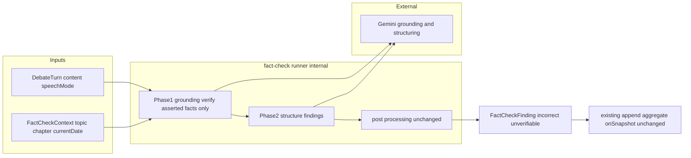
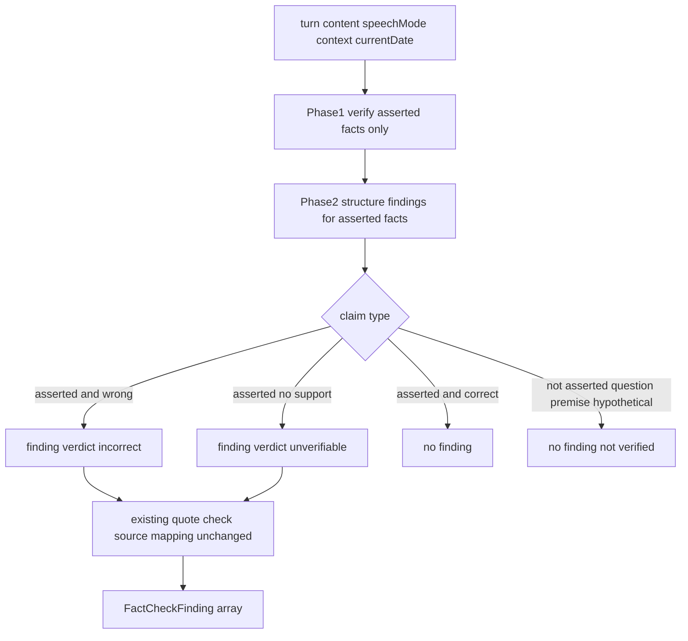

# Technical Design: fact-check-validity-improvement

## Overview

**Purpose**: 既存 `chapter-fact-check` のファクトチェック判定を**発話文脈（断定性）に応じて調整**し、誤検出を減らす。問い・前提・仮定・代弁として述べられた主張は検証も指摘もせず、事実として断定された主張は従来どおり（最新性・時間軸も含めて）厳密に検証する。

**Users**: 管理者が完了章のファクトチェックを実行した際、誤検出（問いかけの前提を誤りと断じる等）が抑えられ、断定された事実の誤りに集中して確認できる。

**Impact**: 検証ロジック（[fact-check-runner.ts](functions/src/pipeline/fact-check/fact-check-runner.ts)）の**プロンプトと検証コンテキストに閉じた変更**。非断定の主張は finding を生成しない（事実として正しい主張が今も何も生成しないのと同じ扱い）ため、`FactCheckFinding` の形・`FactCheckVerdict` の値・永続・FE 表示はいずれも不変。

### Goals
- 各事実主張を断定/非断定で判定し、非断定は検証も指摘もしない（1.x, 2.x）
- 断定された事実は従来どおり検証し、最新性・時間軸の誤りも捉える（3.x）
- 時間軸検証のため検証コンテキストに現在日時を与える（3.5）

### Non-Goals
- 実行制御・永続・逐次表示の仕組みの変更（chapter-fact-check が所有）
- 意見・価値判断の正否評価（従来どおり対象外）
- 非断定の主張に対する別種の指摘（`contextual` verdict 等）の保持 — 検証しない以上、ファクトチェック判断を含まない指摘は残さない
- `FactCheckFinding` / `FactCheckVerdict` の契約変更
- 非断定主張の grounding 検証（軽量版＝検証しない）

## Boundary Commitments

### This Spec Owns
- runner の断定性判定ロジック（Phase1/Phase2 プロンプトの検証範囲指示）
- `FactCheckContext` への現在日時の追加と時間軸検証の指示
- `turn.speechMode` を判定の手掛かりとして Phase1 へ渡すこと

### Out of Boundary
- 章・ターンの生成・永続、章ステータス管理（討論パイプライン）
- ファクトチェックの実行制御・結果ドキュメントの保存フロー（chapter-fact-check）
- `FactCheckFinding` / `FactCheckVerdict` のデータ契約（変更しない）
- `speechMode` の生成・付与ロジック（persona-question-mode が所有。本スペックは読み取りのみ）
- 編集工程（別スペック）

### Allowed Dependencies
- `DebateTurn`（`content` / `speakerType` / `speechMode`）の読み取り
- `currentDateString()`（`utils/prompt-formatters`）の流用
- Gemini grounding／構造化（`getGoogleProvider` / `getPipelineModel`）・`search/grounding`
- 既存 `FactCheckFinding[]` の逐次追記・集約経路（repository / api、無改修）

### Revalidation Triggers
- `FactCheckContext` の形変更
- Phase1/Phase2 プロンプトの検証範囲方針の変更（誤検出/見逃しのバランスに影響）
- `DebateTurn.speechMode` の値・意味変更（persona-question-mode 連動）

## Architecture

### Existing Architecture Analysis
- **判定の集中点**: 発言単位の `checkTurn` が Phase1（grounding 検証, gemini-2.5-pro）→ Phase2（構造化, gemini-2.5-flash）→ 後処理（引用照合・出典写像・verdict 降格）で finding を生成する。本スペックは Phase1/Phase2 プロンプトと `FactCheckContext` に閉じる。
- **保持すべき統合点**: `checkChapter` の逐次 `onTurnFindings`、`FactCheckFinding[]` の形（api の `aggregateSources`・repository の追記が依存）、FE の onSnapshot 表示。いずれも不変。
- **再利用する前例**: 文脈注入 `FactCheckContext`（テーマ・章・focusQuestion を既に各発言検証へ渡している）に現在日時を加えるだけで時間軸検証が成立する。

### Architecture Pattern & Boundary Map



**Architecture Integration**:
- **Selected pattern**: Option A（runner 拡張）。判定は runner 内のプロンプトに素直に書き、中央ディスパッチャや独立モジュールを作らない（structure.md）。
- **Domain/feature boundaries**: 判定ロジック＝runner プロンプトのみ。型・永続・実行制御・FE には触れない。
- **Existing patterns preserved**: Phase1/Phase2 二段、`FactCheckContext` 文脈注入、引用照合・出典写像、逐次追記、onSnapshot、`verdict: incorrect | unverifiable`。
- **New components rationale**: 新規コンポーネント・新規型なし。プロンプト本文と `FactCheckContext` への1フィールド追加のみ。
- **Dependency direction**: `types → search/grounding → pipeline/fact-check(runner) → api`（不変）。

### Technology Stack

| Layer | Choice / Version | Role in Feature | Notes |
|-------|------------------|-----------------|-------|
| Backend | Firebase Functions v2（既存 `runFactCheckTask`） | runner プロンプトで断定性判定 | 実行制御・型は変更なし |
| AI | Gemini 2.5 Pro（grounding）／2.5 Flash（構造化）（既存 `PIPELINE_MODELS`） | 断定された事実のみ検証・構造化 | モデル・スキーマ変更なし。プロンプトのみ |
| Data | Firestore（既存 `factCheck/result`） | 変更なし | finding の形・verdict 値とも不変 |
| Frontend | （変更なし） | — | `FactCheckFindings.svelte` 改修不要 |

## File Structure Plan

### Modified Files
- `functions/src/pipeline/fact-check/fact-check-runner.ts` — (1) `FactCheckContext` に `currentDate: string` を追加し `buildContextSection` で本日を注入、(2) `buildPhase1Prompt` に断定性の検証範囲指示（断定された事実のみ検証、問い・前提・仮定・代弁は対象外、質問内の確定事実は検証、制度変更は最新事実、不確実なら検証）を追加、(3) `buildPhase2Prompt` に「断定でない主張は finding を生成しない」を明記、(4) `checkTurn` で `turn.speechMode` を Phase1 プロンプトの手掛かりとして渡す。
- `functions/src/pipeline/fact-check/fact-check-runner.ts` の呼び出し元 `checkChapter` — `FactCheckContext` 生成時に `currentDate: currentDateString()` を設定。
- 既存テスト（`functions/src/tests/pipeline/fact-check/fact-check-runner.test.ts`）— 非断定の例で finding が出ないこと、断定/時間軸/制度変更の例で従来どおり検証されることを追加。

### 変更しないファイル（境界の明示）
- `functions/src/types/fact-check.types.ts`・`src/lib/models/factCheck/factCheck.types.ts` — verdict・finding 契約は不変。
- `api/fact-check.ts`・`fact-check-repository.ts`・`factCheck.svelte.ts`・`FactCheckFindings.svelte` — finding の形に依存するだけで判定方針に依存しないため不変。
- `functions/src/utils/prompt-formatters.ts` — `currentDateString()` を再利用（無改修）。

## System Flows

### 発言単位の断定性判定フロー（checkTurn 内）



- **判定の線引き**: Phase1 は断定された事実を反証起点で検証する（検証専念）。finding 化（非断定の抑制）の最終決定は Phase2 が一括して行う。質問文中でも確定事実（過去の出来事・既成の状態）として述べた部分は検証対象とする（3.3）。判定が不確実なら事実主張として finding を生成する（3.6）。
- **非断定の帰結**: 検証しないため finding を生成しない。事実として正しい断定主張が finding を生成しないのと同じ経路で、結果に現れない（2.1）。
- **`speechMode` の扱い**: `question` は当該発言が問いかけである手掛かりとして Phase1 に渡すが、それ単独で全主張を一律除外しない（1.4, 1.5）。
- **後処理**: 既存のまま（引用の部分文字列照合・出典写像・出典0件の `unverifiable` 降格）。verdict 値は `incorrect | unverifiable` のまま変更しない。

## Requirements Traceability

| Requirement | Summary | Components | Interfaces | Flows |
|-------------|---------|------------|------------|-------|
| 1.1 | 断定/非断定を判定 | runner Phase1/2 prompt | buildPhase1/2Prompt | 判定フロー |
| 1.2 | 発話意図＋言い回しで判定 | runner prompt | buildPhase1Prompt | 判定フロー |
| 1.3 | 話者種別に依らず同基準 | runner prompt | buildPhase1Prompt | 判定フロー |
| 1.4 | speechMode を手掛かりに | checkTurn | turn.speechMode → prompt | 判定フロー |
| 1.5 | シグナル単独で一律除外しない | runner prompt | Phase1 注記 | 判定フロー |
| 1.6 | 混在発言は主張ごと判定 | runner Phase1/2 | findings 配列 | 判定フロー |
| 2.1 | 非断定は検証も指摘もしない | runner Phase1/2 prompt | finding 非生成 | 判定フロー |
| 2.2 | 問いの前提は対象外 | runner prompt | buildPhase1Prompt | 判定フロー |
| 2.3 | 仮定・条件は対象外 | runner prompt | buildPhase1Prompt | 判定フロー |
| 2.4 | 検証は断定主張に絞る | runner Phase1 | buildPhase1Prompt | 判定フロー |
| 3.1 | 断定は外部検証 | runner Phase1 | grounding | 判定フロー |
| 3.2 | 誤りは従来の指摘 | runner Phase2 | FactCheckFinding | 判定フロー |
| 3.3 | 質問内の確定事実は検証 | runner prompt | buildPhase1Prompt | 判定フロー |
| 3.4 | 制度変更を最新事実で | runner Phase1 prompt | grounding 指示 | 判定フロー |
| 3.5 | 時間軸は現在日時基準 | FactCheckContext | currentDate | 判定フロー |
| 3.6 | 不確実なら検証側へ | runner prompt | buildPhase1/2Prompt | 判定フロー |

## Components and Interfaces

| Component | Domain/Layer | Intent | Req Coverage | Key Dependencies (P0/P1) | Contracts |
|-----------|--------------|--------|--------------|--------------------------|-----------|
| fact-check runner | Functions/Pipeline | 断定された事実のみ検証するよう判定を組み込む | 1.x, 2.x, 3.x | grounding(P0), getPipelineModel(P0), currentDateString(P1) | Service |

### Functions / Pipeline

#### fact-check runner（プロンプト・コンテキスト拡張）

| Field | Detail |
|-------|--------|
| Intent | 発言の各事実主張を断定性で判定し、断定された事実のみを検証・指摘する |
| Requirements | 1.1, 1.2, 1.3, 1.4, 1.5, 1.6, 2.1, 2.2, 2.3, 2.4, 3.1, 3.2, 3.3, 3.4, 3.5, 3.6 |

**Responsibilities & Constraints**
- `FactCheckContext` に `currentDate: string`（`currentDateString()` 由来＝ファクトチェック実行開始時刻）を追加し、`buildContextSection` で「本日は〜です。時間軸に関する主張はこの日付を基準に検証する」を注入（3.5）。`checkChapter` が context 生成時に設定。基準は実行開始時刻とする（発言時刻 `turn.createdAt` との差は時間軸判定に本質的影響がないため、実行時刻に統一）。
- **判定責務の所在**: finding 化（指摘の生成/抑制）の最終決定点は **Phase2 とする**。Phase1 は「断定された事実を反証起点で検証する」検証専念とし、断定/非断定の最終的な線引きは Phase2 が行う。grounding は1呼び出しで全文を見るため、Phase1 が前提部分まで検索しても実コストは不変であり、Phase2 が非断定を落とすことで一貫性を担保する。
- `buildPhase1Prompt`: 検証範囲の指示を追加 — 「事実として断定された主張を反証起点で検証する。問い・問いかけの前提・仮定/条件・他者認識の代弁は厳密な検証の主対象としない。ただし質問文中でも確定事実（過去の出来事・既成の状態）として述べた部分は検証する。制度・規則は最新の事実で確認する。断定か非断定かが不確実なら断定扱いで検証する」（1.1, 1.2, 1.3, 2.2, 2.3, 2.4, 3.1, 3.3, 3.4, 3.6）。`turn.speechMode === 'question'` のときは「この発言は問いかけ（参考情報。モードのみで一律に検証対象外としない）」を付す（1.4, 1.5）。
- `buildPhase2Prompt`（finding 化の決定点）: 出力ルールに「断定でない（問い・前提・仮定・代弁）と判断した主張は finding を生成しない。意見・価値判断の対象外とは別概念として扱い、断定か非断定かが不確実なら finding を生成する（断定扱い）」を明記（2.1, 1.6, 3.6）。verdict は既存の `incorrect | unverifiable` のまま。
- 後処理・`checkTurn`/`checkChapter` の制御構造・`FactCheckFinding` の生成形は不変。

**Dependencies**
- Outbound: grounding util（P0）／ `getPipelineModel('factCheckStructuring')`（P0）／ `currentDateString`（P1）
- External: Gemini grounding／structuring（P0）
- Inbound: `runFactCheckTask` → `checkChapter`（P0、変更なし）

**Contracts**: Service [x]

##### Service Interface
```typescript
export type FactCheckContext = {
  topicTitle: string;
  chapterTitle: string;
  focusQuestion: string;
  currentDate: string; // 追加: 時間軸検証の基準（currentDateString() 由来, 3.5）
};

// findingSchema / FactCheckVerdict は不変（'incorrect' | 'unverifiable'）
export const checkTurn: (
  turn: DebateTurn,
  context?: FactCheckContext
) => Promise<Result<FactCheckFinding[], PipelineError>>;
```
- Preconditions: 章のターンが取得可能。`context.currentDate` が与えられる。
- Postconditions: 返す findings は断定された事実主張のみが対象。非断定主張・正しい断定主張は finding を生成しない。`claim` は当該発言の部分文字列、`verdict` は `incorrect | unverifiable`。
- Invariants: 非断定主張は grounding 検証しない（軽量版）。`turnId` は runner 付与。`FactCheckFinding` の形は不変。

**Implementation Notes**
- Integration: Phase1/Phase2 の呼び出し構造・スキーマ・後処理を維持し、プロンプト本文と `FactCheckContext` の1フィールドのみ拡張。`FactCheckFinding[]` の形が不変のため api/repository/store/FE は無改修。
- Validation: 既存の Zod スキーマ・引用照合をそのまま使用。
- Risks: 断定/非断定判定の精度はプロンプト依存。3.6（不確実なら検証）を保守的デフォルトにし、提示済み4例（停戦前提・国連/赤十字の仮定・W杯試合数・時間軸）で回帰確認。

## Error Handling

### Error Strategy
- 既存のエラー戦略を変更しない。検索プロバイダ利用不可（章全体）→ `checkChapter` が findings 空で完了（既存）。実行中例外 → `runFactCheckTask` が `failed` 記録（既存）。
- プロンプト変更のみのため新たな失敗経路は生じない。

### Monitoring
- 既存 `console.error('[checkTurn] ...')` を踏襲。誤検出抑制の効果は finding 件数の変化で観察。

## Testing Strategy

### Unit Tests（fact-check-runner）
- 問いかけの前提として述べた事実主張は finding を生成しない（2.1, 2.2）— 停戦前提・国連/赤十字の仮定の例をモック。
- 質問文中でも確定事実（「○○でXXXが起きました」）として述べた主張は検証され、誤りなら `incorrect`（3.3）。
- 制度変更（W杯 7→8 試合）の断定は最新事実で `incorrect`（3.4）。
- 時間軸主張（「まだ1年以上ある」）は `context.currentDate` 基準で検証される（3.5）— currentDate をモックし判定を確認。
- `speechMode === 'question'` でも断定された誤りは `incorrect` のまま検出される（1.5）。
- 既存の出典0件 → `unverifiable` 降格、引用照合の挙動が不変であること（回帰）。

## Security Considerations
- 追加の外部入力・権限変更なし。非断定主張は検証しないため出典解決（HEAD 解決）も発生せず、攻撃面はむしろ縮小。既存の `requireAuth`・Functions 経由方針を踏襲。
