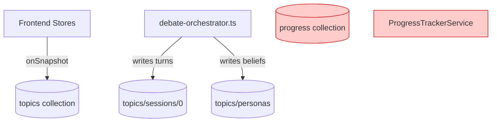

# Technical Design Document

## Overview

本スペックは、Firestore に存在する未使用コレクション (`progress`・`debate_progress`) および関連コードを削除し、トピック状態の管理を `topics/{topicId}` に一本化する。

`ProgressTrackerService` は `progress` コレクションに書き込むが、フロントエンドのどこからも読まれていない。`topics/{topicId}.status` が唯一の状態管理ソースであり、このサービスは二重管理を引き起こしているだけである。統合テスト (`progress-tracker.integration.test.ts`) はコード本体と異なるコレクション名 (`debate_progress`) を参照しており、現状常に失敗する。

**Users**: 管理者（間接的。機能変更なし）  
**Impact**: `ProgressTrackerService`・未使用テスト・誤ったドキュメントを除去し、データフローを `topics` に統一する。

### Goals
- `progress` コレクションへの書き込みを廃止し、未使用データを排除する
- コードと統合テスト間の不整合（コレクション名ミスマッチ）を解消する
- `firebase.md` ステアリングを実装と一致させ、`debate_progress` の誤記を除去する

### Non-Goals
- `topics` ドキュメントへのフィールド追加・構造変更
- フロントエンドコードの変更（`progress` を読んでいないため不要）
- Firestore セキュリティルールの変更（`progress`・`debate_progress` は既に catch-all deny で拒否済み）
- 新機能の追加

---

## Boundary Commitments

### This Spec Owns
- `functions/src/pipeline/progress-tracker.ts` の削除
- `functions/src/pipeline/debate-orchestrator.ts` からの `ProgressTrackerService` 参照除去
- `functions/src/pipeline/progress-tracker.integration.test.ts` の削除
- `.kiro/steering/firebase.md` の `debate_progress` 記述除去

### Out of Boundary
- `topics` コレクション・サブコレクションのスキーマ変更
- `debate-orchestrator.ts` のビジネスロジック変更
- Firestore セキュリティルールの更新
- フロントエンドストア・コンポーネントの変更

### Allowed Dependencies
- Firestore スキーマ設計原則（`.kiro/steering/firebase.md`）
- 既存の `topics/{topicId}` ドキュメント構造（変更しない）

### Revalidation Triggers
- `debate-orchestrator.ts` が将来 `topics.status` 以外で状態を管理するようになった場合

---

## Architecture

### Existing Architecture Analysis

現在の状態管理フロー（変更前）：

```
[Frontend]
  approveInterviews() → topics/{topicId}.status = 'debating'
  ↓
  httpsCallable('startDebate')
  ↓
[Cloud Functions: debate-orchestrator.ts]
  tracker.updateStatus(topicId, 'debating')  ← progress/{topicId} へ書き込み（誰も読まない）
  → 討論処理実行
```

変更後：

```
[Frontend]
  approveInterviews() → topics/{topicId}.status = 'debating'  ← 唯一の状態管理
  ↓
  httpsCallable('startDebate')
  ↓
[Cloud Functions: debate-orchestrator.ts]
  → 討論処理実行（tracker 呼び出しなし）
```

### Architecture Pattern & Boundary Map

本スペックは新しいコンポーネントを追加しない。既存コンポーネントから不要な依存を除去する。



*赤色は本スペックで削除するコンポーネント・コレクション*

### Technology Stack

| Layer | Choice / Version | Role in Feature |
|-------|------------------|-----------------|
| Backend / Services | TypeScript strict mode | `debate-orchestrator.ts` の不要参照除去 |
| Data / Storage | Firestore | `progress` コレクションへの書き込み廃止 |

---

## File Structure Plan

### 削除ファイル

```
functions/src/pipeline/
├── progress-tracker.ts                   ← 削除
└── progress-tracker.integration.test.ts  ← 削除
```

### 変更ファイル

- `functions/src/pipeline/debate-orchestrator.ts` — `ProgressTrackerService` の import・constructor パラメータ・2箇所の `updateStatus` 呼び出しを削除
- `.kiro/steering/firebase.md` — `debate_progress/{topicId}` の記述行を削除

---

## Requirements Traceability

| Requirement | Summary | Components | Flows |
|-------------|---------|------------|-------|
| 1.1 | `ProgressTrackerService` なしで討論処理完了 | `debate-orchestrator.ts` | 変更後アーキテクチャ図 |
| 1.2 | `tracker.updateStatus()` 呼び出しを除去 | `debate-orchestrator.ts` | — |
| 1.3 | `progress-tracker.ts` 削除後もビルド成功 | `debate-orchestrator.ts` | — |
| 1.4 | `progress/{topicId}` への書き込みが発生しない | `progress-tracker.ts`（削除） | — |
| 2.1 | テストスイートが正常実行 | `progress-tracker.integration.test.ts`（削除） | — |
| 2.2 | `debate_progress` 参照がリポジトリに存在しない | `progress-tracker.integration.test.ts`（削除） | — |
| 2.3 | テスト失敗なし | `progress-tracker.integration.test.ts`（削除） | — |
| 3.1 | `firebase.md` から `debate_progress` 記述除去 | `.kiro/steering/firebase.md` | — |
| 3.2 | ドキュメントと実装の一致 | `.kiro/steering/firebase.md` | — |

---

## Components and Interfaces

| Component | Domain/Layer | Intent | Req Coverage | 変更種別 |
|-----------|--------------|--------|--------------|----------|
| `ProgressTrackerService` | Functions/Pipeline | `progress` コレクションへの書き込み | 1.1–1.4 | **削除** |
| `progress-tracker.integration.test.ts` | Functions/Test | `ProgressTrackerService` の統合テスト（バグあり） | 2.1–2.3 | **削除** |
| `debate-orchestrator.ts` | Functions/Pipeline | AI討論パイプライン | 1.1–1.2 | **変更**（tracker参照除去） |
| `firebase.md` | Steering | Firestore設計ガイドライン | 3.1–3.2 | **変更**（debate_progress記述除去） |

### Functions/Pipeline

#### `debate-orchestrator.ts`（変更）

| Field | Detail |
|-------|--------|
| Intent | `ProgressTrackerService` への依存を除去し、シンプルな討論パイプラインとする |
| Requirements | 1.1, 1.2, 1.3 |

**変更箇所**:
- `import { ProgressTrackerService } from './progress-tracker.js'` を削除
- `constructor` の `private tracker: ProgressTrackerService` パラメータを削除
- `run()` メソッド内の `await this.tracker.updateStatus(topicId, 'debating')` を削除（行107）
- `resume()` メソッド内の `await this.tracker.updateStatus(topicId, 'debating')` を削除（行140）

**Contracts**: Service [x]

**Implementation Notes**
- `tracker` はデフォルト引数付きの DI パラメータのため、呼び出し元（Functions エントリポイント）への変更は不要
- `ProgressTrackerService` は外部エクスポートされていないため、他ファイルへの影響なし
- ビルド時に未使用 import エラーが発生しないよう import 行ごと削除する

---

## Testing Strategy

### Unit Tests
- `debate-orchestrator.ts` の既存ユニットテストが `tracker` モックなしで通過することを確認
- `functions/src/pipeline/` 配下のテストファイル一覧を確認し、`progress-tracker` を import するものがないことを確認

### Integration Tests
- `progress-tracker.integration.test.ts` を削除することで、不整合テストによる偽陰性が解消される
- Firebase Emulator を使った既存の討論パイプライン統合テストが引き続き通過することを確認

---

## Error Handling

本スペックはコードの削除のみであり、新規エラーパターンは発生しない。削除後のビルドエラー（未解決 import）がないことを確認する。
