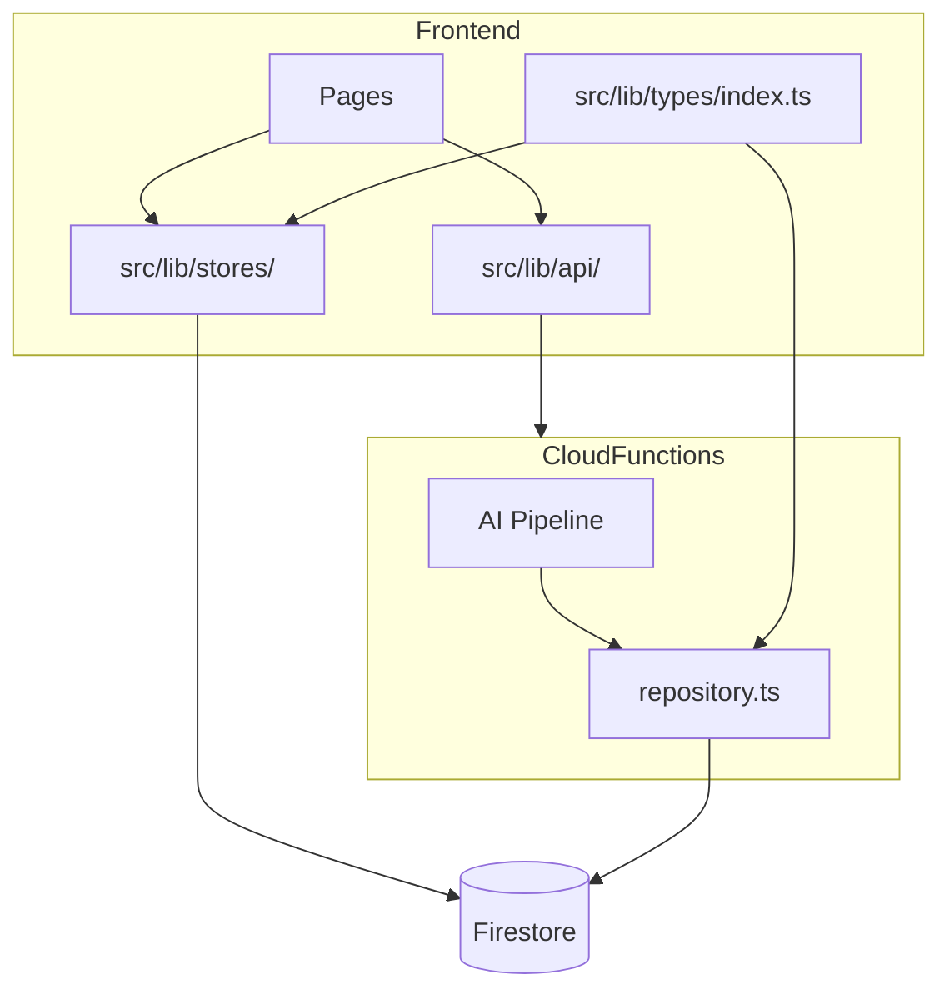
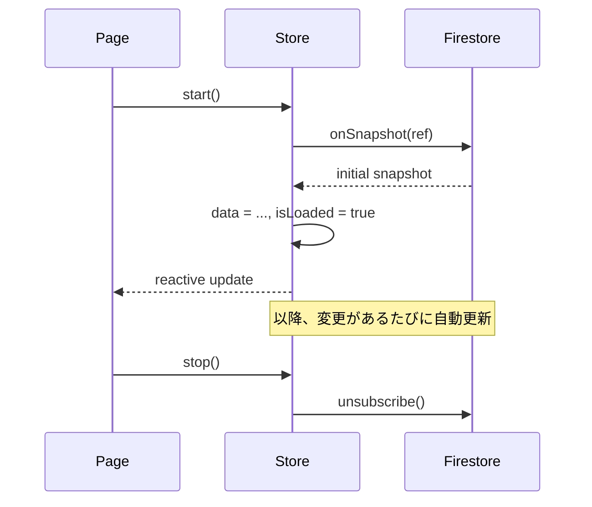
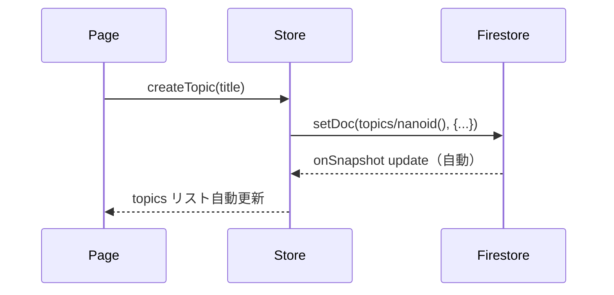
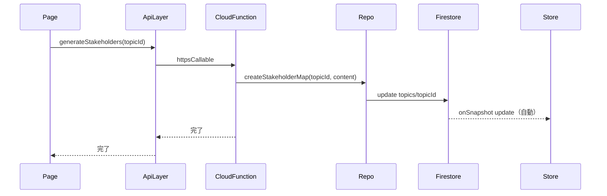
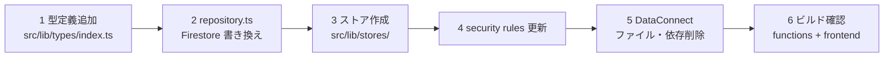

# Design Document: firestore-migration

## Overview

Data Connect（PostgreSQL）を廃止し、すべての永続データを Firestore に一本化する。フロントエンドは Firestore Client SDK を通じて直接データを読み書きし、Cloud Functions は AI パイプライン処理のみを担う。

**Purpose**: DataConnect/PostgreSQL に起因するアーキテクチャの複雑さを解消し、Firestore 単一データストアに移行することで保守性と信頼性を向上させる。  
**Users**: 管理者（テーマ・討論管理）および公開閲覧者（討論コンテンツ閲覧）。  
**Impact**: `functions/src/db/repository.ts` をほぼ全面書き換え、`src/lib/stores/` に新規ストアファイルを追加、DataConnect 関連ファイル・API ルート・page.server.ts を削除。

### Goals
- Firestore への一本化で DataConnect/PostgreSQL を完全撤廃する
- フロントエンドからの Firestore 読み書きを `src/lib/stores/` に集約する
- AI パイプライン専用に縮小した `repository.ts` を Firestore Admin SDK で再実装する

### Non-Goals
- ページコンポーネントの更新（ストアへの切り替えは別 spec）
- `src/lib/api/topics.ts` の Cloud Function 呼び出し削除（ページ更新と同時に実施）
- AI パイプライン内部ロジックの変更
- Firebase Auth の変更

---

## Boundary Commitments

### This Spec Owns
- `src/lib/stores/` の新規ストアファイル 4 本（topics, topic, personas, session）
- `src/lib/types/index.ts` への Firestore ドキュメント型の追加
- `functions/src/db/repository.ts` の Firestore Admin SDK への全面書き換え（AI パイプライン専用に縮小）
- `src/lib/server/dataconnect.ts` の削除
- `src/routes/api/debates/` と `src/routes/api/debates/[id]/` の削除（DataConnect 経由の中継 API ルート）
- `src/routes/+page.server.ts` と `src/routes/debate/[id]/+page.server.ts` の削除（DataConnect 依存の load 関数）
- `firestore.rules` のルール追加（topics/personas/sessions コレクション）
- DataConnect 関連ファイル・依存の完全削除

### Out of Boundary
- ページコンポーネントのストア切り替え（`.svelte` ファイルの変更）
- 公開ページのクライアントサイド Firestore 読み込みへの切り替え（別 spec でストア利用に移行）
- `src/lib/api/topics.ts` の Cloud Function 呼び出しの削除
- AI パイプライン処理ロジック（`functions/src/pipeline/`, `functions/src/agents/`）
- Cloud Functions のエクスポート定義の削除（listTopics 等の Cloud Function 本体は残る）

### Allowed Dependencies
- Firebase Client SDK（`firebase/firestore`, `firebase/functions`）
- Firebase Admin SDK（`firebase-admin/firestore`）
- `nanoid` — ドキュメント ID 生成
- SvelteKit の `$lib` エイリアス

### Revalidation Triggers
- Firestore コレクション構造を変更した場合（パス・フィールド名）
- `TopicDoc` 等の型を変更した場合（ストア利用コンポーネントへ影響）
- `sessionId = topicId` の前提を変更した場合

---

## Architecture

### Existing Architecture Analysis

現在の構成：

- **全データ** → DataConnect (PostgreSQL)
- **進捗のみ** → Firestore（`debate_progress/{topicId}`）
- **クライアント読み込み** → Cloud Functions（onCall）経由
- **クライアント書き込み** → Cloud Functions（onCall）経由
- **公開 API** → SvelteKit server route → DataConnect Client SDK

移行後の構成：

- **全データ** → Firestore
- **クライアント読み書き** → Firestore Client SDK（`src/lib/stores/`）
- **AI パイプライン** → Cloud Functions → Firestore Admin SDK（`repository.ts`）
- **公開ページ** → Firestore Client SDK（セキュリティルールで公開済みトピックの読み取りを許可）

### Architecture Pattern & Boundary Map



**依存方向**: Types → Firebase SDK → Stores/Helper/Repo → 上位コンポーネント  
各層は左より右へのみ依存する。ストアからパイプラインへの逆方向依存は禁止。

### Technology Stack

| Layer | 選択 | 役割 |
|-------|------|------|
| Frontend reads | `firebase/firestore` onSnapshot | ストアのリアルタイム購読（公開ページ含む） |
| Frontend writes | `firebase/firestore` setDoc/updateDoc/addDoc/deleteDoc | ストアの CRUD 書き込み |
| Pipeline reads/writes | `firebase-admin/firestore` | AI パイプライン内部 |
| ID generation | `nanoid` | Firestore ドキュメント ID |
| Timestamp | `firebase/firestore` Timestamp（client）/ `firebase-admin/firestore` Timestamp（server） | 全タイムスタンプフィールド |

---

## File Structure Plan

### Directory Structure

```
src/
├── lib/
│   ├── types/
│   │   └── index.ts          # 変更: Firestore Doc 型を追加
│   ├── stores/
│   │   ├── progress.svelte.ts # 変更なし（アロー関数化済み）
│   │   ├── topics.svelte.ts   # 新規: topics コレクション購読 + createTopic/deleteTopic
│   │   ├── topic.svelte.ts    # 新規: 単一 topic 購読 + approveStakeholders/publishDebate/resetDebate
│   │   ├── personas.svelte.ts # 新規: personas サブコレクション購読 + approvePersonas/resetPersonas
│   │   └── session.svelte.ts  # 新規: sessions/0 購読（read only）
│   └── server/
│       └── dataconnect.ts     # 削除
└── routes/
    ├── +page.server.ts        # 削除（DataConnect 依存の load 関数）
    ├── api/debates/
    │   ├── +server.ts         # 削除（DataConnect 中継 API）
    │   └── [id]/+server.ts    # 削除（DataConnect 中継 API）
    └── debate/[id]/
        └── +page.server.ts    # 削除（DataConnect 依存の load 関数）

functions/src/db/
└── repository.ts              # 全面書き換え（縮小）

firestore.rules                # 変更: topics/personas/sessions ルール追加

# 削除対象
dataconnect/                   # DataConnect 設定・スキーマ全体
src/dataconnect-generated/     # 自動生成コード
dataconnect-debug.log
.emulator-data/dataconnect_export/
```

---

## System Flows

### 管理者データ読み込みフロー



### 管理者 CRUD 書き込みフロー



### AI パイプライントリガーフロー



---

## Requirements Traceability

| 要件 | 概要 | コンポーネント | インターフェース |
|------|------|----------------|-----------------|
| 1.1–1.5 | Firestore コレクション設計 | FirestoreTypes, Repository | TopicDoc, PersonaDoc, SessionDoc |
| 2.1–2.10 | リアルタイム同期ストア | TopicsStore, TopicStore, PersonasStore, SessionStore | createXxxStore() |
| 3.1–3.4 | ストア書き込み関数 | TopicsStore, TopicStore, PersonasStore | createTopic, approvePersonas 等 |
| 4.1–4.6 | セキュリティルール | FirestoreRules | firestore.rules |
| 5.1–5.20 | repository.ts 書き込み | Repository | 各 create*/update* 関数 |
| 5.12–5.13 | repository.ts 読み込み | Repository | getTopicById, getApprovedPersonasByTopicId |
| 6.1–6.10 | DataConnect 完全撤廃 | — | ファイル・依存削除 |

---

## Components and Interfaces

### サマリーテーブル

| コンポーネント | レイヤー | 役割 | 要件カバレッジ | 主要依存 |
|---|---|---|---|---|
| FirestoreTypes | Types | Firestore ドキュメント型定義 | 1.1–1.4 | firebase/firestore Timestamp |
| TopicsStore | Store | topics 一覧購読 + createTopic/deleteTopic | 2.1, 3.1 | FirestoreTypes, db |
| TopicStore | Store | 単一 topic 購読 + approve/publish/reset | 2.1, 3.1 | FirestoreTypes, db |
| PersonasStore | Store | personas 購読 + approve/reset | 2.1, 3.1 | FirestoreTypes, db |
| SessionStore | Store | sessions/0 購読（read only） | 2.1 | FirestoreTypes, db |
| Repository | Functions | AI パイプライン専用 Firestore 読み書き | 5.1–5.13 | firebase-admin/firestore |
| FirestoreRules | Infra | 読み書き権限制御 | 4.1–4.6 | — |

---

### Types Layer

#### FirestoreTypes

| Field | Detail |
|-------|--------|
| Intent | Firestore ドキュメントの TypeScript 型を定義する |
| Requirements | 1.1, 1.2, 1.3, 2.10 |

**Responsibilities & Constraints**
- `src/lib/types/index.ts` に追記する（既存型は変更しない）
- `Timestamp` は `firebase/firestore` から import する
- 既存の `TopicSummary`, `PublishedDebateDetail` 等の既存型はそのまま維持する

**Contracts**: State [x]

##### State Management
```typescript
import type { Timestamp } from 'firebase/firestore';

export interface StakeholderDoc {
  role: string;
  reason: string;
  mainInterests: string[];
  stanceDirection: string;
  minorityLevel: string;
}

export interface TopicDoc {
  id: string;           // document ID
  title: string;
  status: DebateStatus;
  createdAt: Timestamp;
  updatedAt: Timestamp;
  stakeholders?: {
    items: StakeholderDoc[];
    approved: boolean;
    createdAt: Timestamp;
  };
}

export interface InterviewDoc {
  interviewRecord: string;
  status: 'completed' | 'error' | 'pending';
  errorMessage?: string;
  completedAt?: Timestamp;
}

export interface BeliefDoc {
  id: string;
  version: number;
  content: string;
  changeType?: BeliefChangeType;
  changeSummary?: string;
  triggeredByTurnId?: string;
  createdAt: Timestamp;
}

export interface PersonaDoc {
  id: string;           // document ID
  topicId: string;
  stakeholderRole: string;
  name: string;
  age: number;
  occupation: string;
  background: string;
  interests: string;
  stanceDirection: string;
  approved: boolean;
  sortOrder: number;
  interview?: InterviewDoc;
  beliefs: BeliefDoc[];
}

export interface TurnDoc {
  id: string;
  turnIndex: number;
  speakerType: SpeakerType;
  personaId?: string;
  content: string;
  createdAt: Timestamp;
}

export interface PostDebateCommentDoc {
  id: string;
  personaId: string;
  content: string;
  sortOrder: number;
}

export interface SessionDoc {
  status: DebateStatus;
  totalTurns?: number;
  createdAt: Timestamp;
  completedAt?: Timestamp;
  publishedAt?: Timestamp;
  turns: TurnDoc[];
  postDebateComments: PostDebateCommentDoc[];
}
```

---

### Store Layer

全ストアは以下の共通構造を持つ（`progress.svelte.ts` と同パターン）。

```typescript
// 共通パターン
const createXxxStore = (...params) => {
  let data = $state<XxxDoc | null>(null);
  let isLoaded = $state(false);
  let unsubscribe: (() => void) | null = null;

  const start = () => { /* onSnapshot */ };
  const stop = () => { unsubscribe?.(); unsubscribe = null; };

  return { get data() { return data; }, get isLoaded() { return isLoaded; }, start, stop };
};
```

#### TopicsStore

| Field | Detail |
|-------|--------|
| Intent | `topics` コレクション全件をリアルタイム購読し、トピック作成・削除を担う |
| Requirements | 2.1, 2.2, 2.3, 2.4, 2.6, 2.9, 3.1 |

**Contracts**: State [x]

##### State Management
```typescript
export const createTopicsStore = () => {
  // State
  let topics = $state<TopicDoc[]>([]);
  let isLoaded = $state(false);

  // onSnapshot: topics コレクション、createdAt 降順
  const start = () => { ... };
  const stop = () => { ... };

  // Write functions
  const createTopic: (title: string) => Promise<string>;
  // topics/{nanoid()} に setDoc。status: 'pending', createdAt/updatedAt: Timestamp.now()
  // 戻り値: 生成した topicId

  const deleteTopic: (topicId: string) => Promise<void>;
  // topics/{topicId} + サブコレクション(personas/*, sessions/0) を batch delete

  return { get topics() { return topics; }, get isLoaded() { return isLoaded; }, start, stop, createTopic, deleteTopic };
};
```
- Preconditions: `start()` 呼び出し後に購読開始
- Postconditions: `topics` は常に最新の Firestore 状態を反映
- Invariants: `isLoaded` は初回 snapshot 受信後 `true` に遷移し、以降変化しない

**Implementation Notes**
- `deleteTopic` はサブコレクション（personas/*, sessions/0）を含む batch delete。Firestore はサブコレクションを自動削除しないため明示的に削除する
- batch は最大500件制限があるため、personas 数が多い場合は複数 batch に分割する

#### TopicStore

| Field | Detail |
|-------|--------|
| Intent | `topics/{topicId}` 単一ドキュメントを購読し、承認・公開・リセット操作を担う |
| Requirements | 2.1, 2.2, 2.3, 2.4, 2.9, 3.1 |

**Contracts**: State [x]

##### State Management
```typescript
export const createTopicStore = (topicId: string) => {
  let topic = $state<TopicDoc | null>(null);
  let isLoaded = $state(false);

  const start = () => { /* onSnapshot doc(db, 'topics', topicId) */ };
  const stop = () => { ... };

  const approveStakeholders: () => Promise<void>;
  // updateDoc(topics/{topicId}, { 'stakeholders.approved': true, updatedAt: Timestamp.now() })

  const publishDebate: () => Promise<void>;
  // updateDoc(topics/{topicId}, { status: 'published', updatedAt: Timestamp.now() })
  // updateDoc(topics/{topicId}/sessions/0, { publishedAt: Timestamp.now() })

  const resetDebate: () => Promise<void>;
  // deleteDoc(topics/{topicId}/sessions/0)
  // updateDoc(topics/{topicId}, { status: 'interviewing', updatedAt: Timestamp.now() })

  return { get topic() { return topic; }, get isLoaded() { return isLoaded; }, start, stop,
           approveStakeholders, publishDebate, resetDebate };
};
```

**Implementation Notes**
- `publishDebate` は 2ドキュメントへの更新。Firestore batch write で原子性を保証する
- `resetDebate` 後の status は `'interviewing'`（討論前の状態）

#### PersonasStore

| Field | Detail |
|-------|--------|
| Intent | `topics/{topicId}/personas` サブコレクションを購読し、承認・リセット操作を担う |
| Requirements | 2.1, 2.2, 2.3, 2.4, 2.7, 2.9, 3.1 |

**Contracts**: State [x]

##### State Management
```typescript
export const createPersonasStore = (topicId: string) => {
  let personas = $state<PersonaDoc[]>([]);
  let isLoaded = $state(false);

  const start = () => {
    // onSnapshot query(collection(db, 'topics', topicId, 'personas'), orderBy('sortOrder', 'asc'))
  };
  const stop = () => { ... };

  const approvePersonas: () => Promise<void>;
  // batch updateDoc 全 persona: { approved: true }

  const resetPersonas: () => Promise<void>;
  // batch deleteDoc 全 persona
  // updateDoc(topics/{topicId}, { status: 'surveying', updatedAt: Timestamp.now() })

  return { get personas() { return personas; }, get isLoaded() { return isLoaded; }, start, stop,
           approvePersonas, resetPersonas };
};
```

**Implementation Notes**
- `approvePersonas` と `resetPersonas` は現在の `personas` state を使って対象ドキュメントを特定する（`start()` 後に呼ぶこと）

#### SessionStore

| Field | Detail |
|-------|--------|
| Intent | `topics/{topicId}/sessions/0` を購読する（read only）。書き込みは AI パイプラインが担う |
| Requirements | 2.1, 2.2, 2.3, 2.4, 2.9 |

**Contracts**: State [x]

##### State Management
```typescript
export const createSessionStore = (topicId: string) => {
  let session = $state<SessionDoc | null>(null);
  let isLoaded = $state(false);

  const start = () => {
    // onSnapshot doc(db, 'topics', topicId, 'sessions', '0')
  };
  const stop = () => { ... };

  return { get session() { return session; }, get isLoaded() { return isLoaded; }, start, stop };
};
```

---

### Repository Layer（AI パイプライン専用）

#### Repository

| Field | Detail |
|-------|--------|
| Intent | AI パイプラインが Firestore に読み書きするための Admin SDK ラッパー |
| Requirements | 5.1–5.33 |

**Dependencies**
- External: `firebase-admin/firestore` — Admin SDK（P0）
- External: `nanoid` — ドキュメント ID 生成（P0）

**Contracts**: Service [x]

##### Service Interface

```typescript
// --- 書き込み関数（AI パイプライン用）---

export const updateTopicStatus: (id: string, status: string) => Promise<void>;
// topics/{id}: { status, updatedAt: Timestamp.now() }

export const createStakeholderMap: (topicId: string, content: string) => Promise<{ id: string }>;
// content (JSON string) をパースし topics/{topicId}.stakeholders を set
// 戻り値: { id: topicId }

export const createPersonaProfile: (params: CreatePersonaProfileParams) => Promise<{ id: string }>;
// topics/{topicId}/personas/{nanoid()} に setDoc。beliefs: []

export const approvePersonaProfiles: (topicId: string) => Promise<void>;
// topics/{topicId}/personas/* を batch updateDoc: { approved: true }

export const createCompletedPersonaInterview: (personaId: string, interviewRecord: string) => Promise<{ id: string }>;
// persona doc の interview フィールドを set: { interviewRecord, status: 'completed', completedAt }
// personaId からtopicId を引くため persona doc を事前に読む（getDoc）
// 戻り値: { id: personaId }

export const createErrorPersonaInterview: (personaId: string, errorMessage: string) => Promise<void>;
// persona doc の interview: { status: 'error', errorMessage } を set

export const createPersonaBelief: (params: CreatePersonaBeliefParams) => Promise<{ id: string }>;
// FieldValue.arrayUnion() で persona doc の beliefs に追記
// belief.id = nanoid()

export const createDebateSession: (topicId: string) => Promise<{ id: string }>;
// topics/{topicId}/sessions/0 を create (存在チェック後)
// 戻り値: { id: topicId }

export const completeDebateSession: (id: string, totalTurns: number) => Promise<void>;
// topics/{id}/sessions/0: { status: 'completed', totalTurns, completedAt: Timestamp.now() }

export const createDebateTurn: (params: CreateDebateTurnParams) => Promise<{ id: string }>;
// FieldValue.arrayUnion() で topics/{sessionId}/sessions/0 の turns に追記

export const createPostDebateComment: (params: CreatePostDebateCommentParams) => Promise<{ id: string }>;
// FieldValue.arrayUnion() で topics/{sessionId}/sessions/0 の postDebateComments に追記

// --- 読み込み関数（AI パイプライン内部専用・4つのみ）---
// interview/beliefs は persona に埋め込みのため個別取得関数は不要
// stakeholders は topic に埋め込みのため getStakeholderMapByTopicId は不要

export const getTopicById: (id: string) => Promise<DebateTopic | null>;

export const getApprovedPersonasByTopicId: (topicId: string) => Promise<PersonaProfile[]>;
// 返る PersonaProfile には interview・beliefs が含まれる（個別取得関数は不要）

// getDebateSessionByTopicId は不要:
// createDebateSession を冪等化（create-if-not-exists）することで事前確認が不要になる

// --- 既存型（シグネチャ互換維持）---
export interface DebateTopic { id: string; title: string; status: string; createdAt: string; updatedAt: string; }
export interface PersonaProfile { id: string; topicId: string; stakeholderRole: string; name: string; age: number; occupation: string; background: string; interests: string; stanceDirection: string; approved: boolean; sortOrder: number; }
export interface PersonaBelief { id: string; personaId: string; version: number; content: string; changeType?: string | null; changeSummary?: string | null; triggeredByTurnId?: string | null; createdAt: string; }
export interface DebateSession { id: string; topicId: string; status: string; totalTurns?: number | null; createdAt: string; completedAt?: string | null; publishedAt?: string | null; }
export interface PersonaInterview { id: string; personaId: string; interviewRecord: string; status: string; errorMessage?: string | null; completedAt?: string | null; }
```

- Preconditions: Firebase Admin SDK 初期化済み
- Postconditions: 各関数は対応する Firestore ドキュメントを作成・更新・読み込みして返す
- Invariants: `createPersonaBelief`, `createDebateTurn`, `createPostDebateComment` は `FieldValue.arrayUnion()` で原子性を保証する

**Implementation Notes**
- `Timestamp` フィールドを既存の `createdAt: string` シグネチャで返す際は `.toDate().toISOString()` で変換する
- `createCompletedPersonaInterview` は persona の topicId が必要なため先に `getDoc` を行う

---

### Infrastructure Layer

#### FirestoreRules

| Field | Detail |
|-------|--------|
| Intent | Firestore への読み書き権限を制御する |
| Requirements | 4.1–4.6 |

**Contracts**: — (設定ファイル)

```
rules_version = '2';

service cloud.firestore {
  match /databases/{database}/documents {

    match /topics/{topicId} {
      allow read: if request.auth != null
                  || resource.data.status == 'published';
      allow write: if request.auth != null;

      match /personas/{personaId} {
        allow read: if request.auth != null
                    || get(/databases/$(database)/documents/topics/$(topicId)).data.status == 'published';
        allow write: if request.auth != null;
      }

      match /sessions/{sessionId} {
        allow read: if request.auth != null
                    || (resource != null && resource.data.publishedAt != null);
        allow write: if request.auth != null;
      }
    }

    match /debate_progress/{topicId} {
      allow read: if true;
      allow write: if false;
    }

    match /{document=**} {
      allow read, write: if false;
    }
  }
}
```

**Implementation Notes**
- `personas` の公開判定に `get()` を使用するため、公開ページ表示時に追加読み込みコストが発生する
- `debate_progress` の read は認証不要（管理画面の進捗表示が未認証ユーザーから見える可能性があるため `if true`）。必要に応じて `request.auth != null` に絞ること

---

## Data Models

### Physical Data Model

#### Firestore コレクション構造

```
topics/{topicId}
  title: string
  status: DebateStatus
  createdAt: Timestamp
  updatedAt: Timestamp
  stakeholders?: {
    items: StakeholderDoc[]   // 埋め込み（1:1）
    approved: boolean
    createdAt: Timestamp
  }

topics/{topicId}/personas/{personaId}   // sortOrder 昇順で読む
  topicId, stakeholderRole, name, age, occupation, background, interests
  stanceDirection: string
  approved: boolean
  sortOrder: number
  interview?: InterviewDoc    // 埋め込み（1:1）
  beliefs: BeliefDoc[]        // 埋め込み（常に全件読む）、arrayUnion で追記

topics/{topicId}/sessions/0             // ドキュメントID固定
  status: string
  totalTurns?: number
  createdAt: Timestamp
  completedAt?: Timestamp
  publishedAt?: Timestamp
  turns: TurnDoc[]            // 埋め込み（arrayUnion で追記）
  postDebateComments: PostDebateCommentDoc[]  // 埋め込み（arrayUnion で追記）

debate_progress/{topicId}               // 変更なし
```

#### 埋め込み判断基準

| データ | 理由 |
|--------|------|
| stakeholders in topic | 1:1 関係。topic と常に一緒に読む |
| interview in persona | 1:1 関係。persona と常に一緒に読む |
| beliefs in persona | 常に全件読む前提。1ドキュメント課金で済む |
| turns in session | 討論表示時は全ターン必要。100件×1.5KB≈150KB（上限以内） |
| postDebateComments in session | 小配列（ペルソナ数分）。session と常に一緒に読む |

#### ドキュメント ID 設計

| コレクション | ID 生成方法 | 備考 |
|---|---|---|
| topics | `nanoid()` | クライアント側で生成 |
| topics/{topicId}/personas | `nanoid()` | repository.ts で生成 |
| topics/{topicId}/sessions | 固定 `'0'` | 1:1 のため |

---

## Error Handling

### Error Strategy

- **Firestore 書き込み失敗**: ストアの write 関数は例外をそのまま throw。呼び出し元コンポーネントが try/catch する
- **`onSnapshot` エラー**: 第2引数でエラーコールバックを受け取り、`isLoaded = true` に設定してローディングを解除する
- **セキュリティルール拒否（permission-denied）**: 未認証ユーザーがストアを操作した場合に発生。管理画面は認証ガード済みのため通常発生しない

### Error Categories and Responses

| エラー種別 | 発生箇所 | 対応 |
|---|---|---|
| permission-denied | ストア write / onSnapshot | ログ出力。管理画面は認証ガード済みのため運用上は発生しない |
| not-found | repository.ts get* | `null` を返す（現行動作を維持） |
| deadline-exceeded | AI パイプライン長時間処理 | Cloud Functions のタイムアウト設定で対応（既存） |
| document-size-overflow | turns が1MB超え | turns 最大200件の制限で防止（約300KB） |

---

## Testing Strategy

### Unit Tests
- `repository.ts` の各関数をモック Firestore で検証（`firebase-admin/firestore` のモック）
- ストアの write 関数を `vi.mock('firebase/firestore')` でモックして検証

### Integration Tests
- Firestore エミュレーターを使い、ストアの onSnapshot が実際のドキュメント変更を反映することを確認
- `repository.ts` の `createDebateTurn`（arrayUnion）が順序を保持することをエミュレーターで確認
- セキュリティルールを Firestore エミュレーターの `@firebase/rules-unit-testing` で検証（認証済み/未認証の read/write）

---

## Security Considerations

- **認証必須の書き込み**: 全 Firestore 書き込みは `request.auth != null` で保護
- **公開コンテンツの read**: `published` ステータスのトピックのみ未認証で読める
- **AI パイプラインの書き込み**: Admin SDK は security rules をバイパスするため、Cloud Functions の認証チェック（`requireAuth`）が保護の要となる
- **`debate_progress` の write**: `allow write: if false` を維持（Admin SDK のみ書き込み可）

## Migration Strategy



DataConnect は **最後に削除**する。repository.ts が Firestore に切り替わるまで DataConnect コードは残し、切り替え後にファイルを削除する。ロールバックが必要な場合は `repository.ts` を git で戻す。
