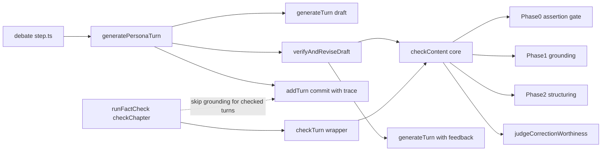
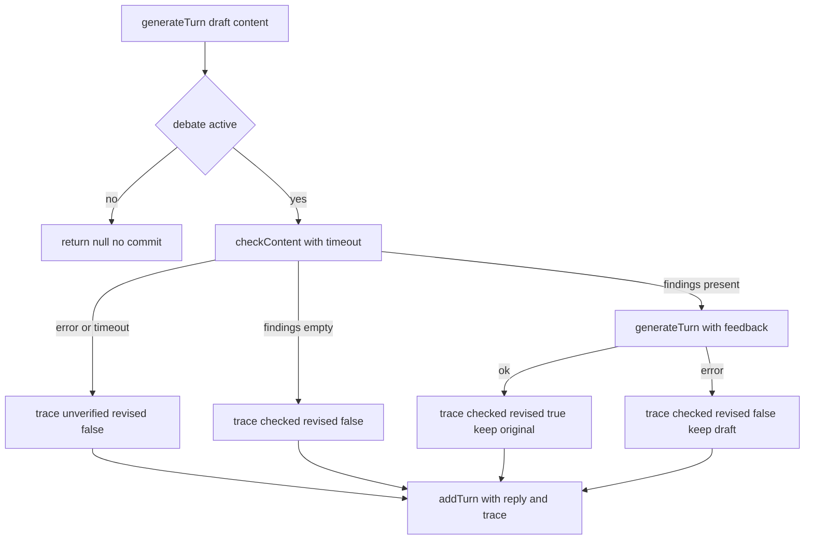
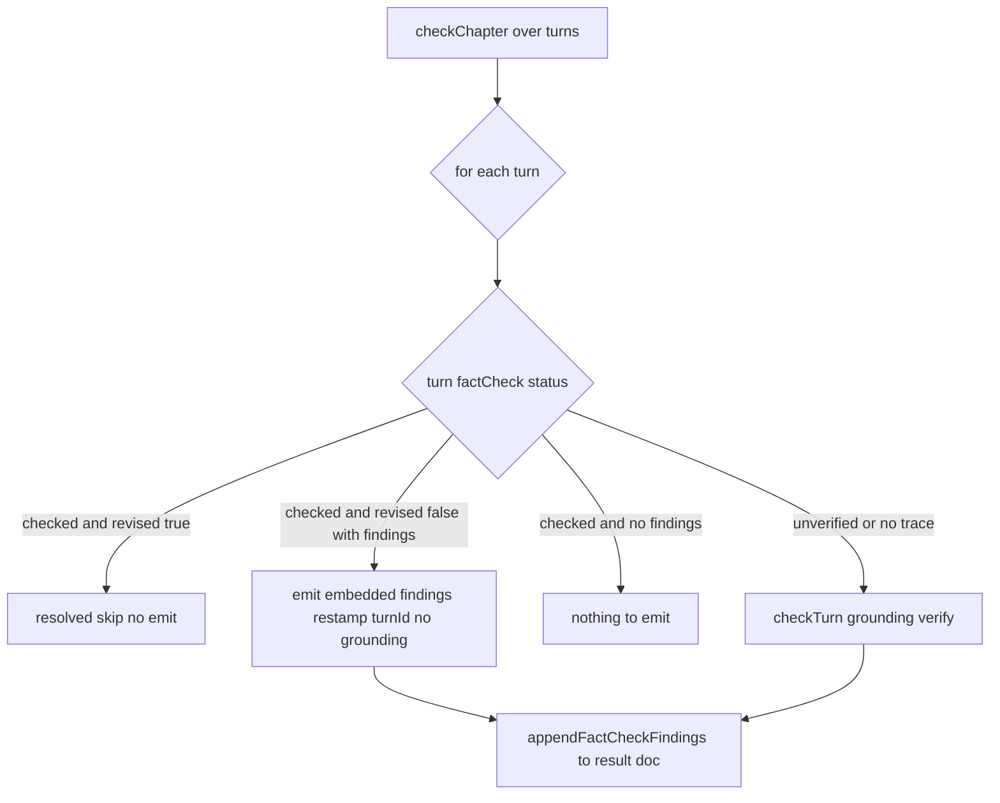

# Technical Design Document

## Overview

本機能は、ペルソナ発言のファクトチェックを「章完了後の後追い検証」から「発言生成ループ内の同期検証＋補正」へ再構成する。ペルソナ発言は **ドラフト生成 → ファクトチェック → 指摘フィードバックによる再生成 → 正式登録** の流れで確定し、断定的な事実誤認は正式登録前に補正される。以降の話者選定・文脈構築には補正済みの正式発言のみが用いられ、誤った前提が後続発言へ伝播しない。

**Users**: 討論パイプライン運用者（誤った発言が議論を歪めない）、討論閲覧者（登録発言が事実誤認を含みにくい）、管理者（どの発言がどう補正されたか監査できる）。

**Impact**: 既存の唯一の挿入点 [generatePersonaTurn](functions/src/pipeline/debate/turn.ts#L154)（`generateTurn` の直後・`addTurn` の直前）に、薄い補正オーケストレーション `verifyAndReviseDraft` を1本差し込む。検証本体は依存スペック完了済みの `checkTurn`（Phase0 断定ゲート→Phase1 grounding→Phase2 構造化→修正適否ジャッジ）から `content` ベースのコア `checkContent` を抽出して再利用する。後追い `runFactCheck` は廃止せず、インライン検証済みターンを再 grounding しない役割へ調整する。

### Goals

- ペルソナ発言を「ドラフト」と「正式発言」に分離し、正式登録前に検証・補正を挟む。
- 断定的事実誤認のみを補正対象とし、指摘フィードバックで発言全体を1回だけ再生成する。
- 補正トレース（原ドラフト・適用指摘・補正有無・未検証フラグ）をターンに埋め込んで監査可能にする。
- 検証・補正の失敗／タイムアウト時も討論生成を停止させない（フォールバック）。
- インライン検証と後追い検証を二重・矛盾なく両立させる。

### Non-Goals

- 指摘のデータ構造（`FactCheckFinding`：verdict/correction/reason/sources）の再設計 → `chapter-fact-check` の構造を再利用。
- 断定性判定ロジックの新規設計 → `fact-check-validity-improvement`（Phase0 断定ゲート＋修正適否ジャッジ）を再利用。
- 発言生成時のオプション検索（Tavily `web_search`）の仕様変更 → `speech-search-grounding` の挙動は不変。
- 公開閲覧ページでの指摘表示 UI の変更。

## Boundary Commitments

### This Spec Owns

- ペルソナ発言の「ドラフト→検証→（必要時）再生成→正式登録」のオーケストレーション（`verifyAndReviseDraft`）。
- 補正トレースのデータ契約（`TurnFactCheckTrace`）とターンへの埋め込み・永続化。
- インライン検証のフォールバック方針とタイムアウト制御。
- 後追い `checkChapter` における「インライン検証済みターンの再 grounding 回避」分岐。

### Out of Boundary

- 検証パイプライン本体（Phase0/1/2・judge）のプロンプトやスキーマ → `fact-check-validity-improvement` / `fact-check-correction-worthiness` / `chapter-fact-check` が所有。本仕様は呼び出すのみ。
- `FactCheckFinding` / `FactCheckContext` / `FactCheckResultForFirestore` の型定義 → `chapter-fact-check` が所有。
- ファシリテーター発言の検証（要件1.5により対象外）。
- 公開・管理画面の指摘表示 UI。

### Allowed Dependencies

- `pipeline/fact-check/`（`checkContent`・`judgeCorrectionWorthiness`・grounding）。
- `agents/persona-agent.ts`（`generateTurn` の再生成拡張）。
- `runStep`（onTaskDispatched）の実行環境・Gemini provider・secrets（既存）。
- 依存方向: `types → constants → fact-check core(checkContent) → debate/inline-fact-check → debate/turn → debate/step → orchestrator`。各層は左方向のみ import する。

### Revalidation Triggers

- `FactCheckFinding` / `FactCheckContext` の形状変更（インライン・後追い双方に波及）。
- `checkTurn` / `checkContent` の戻り値契約の変更。
- `generateTurn` の入出力スキーマ変更（再生成の前提が崩れる）。
- ターン埋め込み `factCheck` の形状変更（FE 型・後追い反映ロジックに波及）。

## Architecture

### Existing Architecture Analysis

- **1タスク=1ターン**: `runStep`（[onTaskDispatched](functions/src/pipeline/debate/debate-orchestrator.ts)・討論540s）が1ターンずつ生成し、各ターン後に次ステップを enqueue する。インライン検証・再生成はこの1ターン予算に同期で収まる。
- **唯一のコミット点 `addTurn`**: 章ローカル index 照合＋runId 世代照合の冪等トランザクション（[turn.ts L51](functions/src/pipeline/debate/turn.ts#L51)）。検証・再生成は **コミット前** に閉じるため、タスク再試行時は検証が再走するが正しさは保たれる。
- **検証パイプライン（依存スペック完了済み）**: `checkTurn` は Phase0 断定ゲート（grounding なし・断定なしは即 `findings:[]`）→ Phase1 grounding → Phase2 構造化 → `judgeCorrectionWorthiness`（修正適否フィルタ）。要件2・7.1は本パイプラインで充足済み。
- **検証モデル**: `factCheckAssertionGate/Grounding/Structuring/Judge` は `PIPELINE_MODELS` に登録済み。**新規モデル登録は不要**。

### Architecture Pattern & Boundary Map



**Architecture Integration**:
- **Selected pattern**: 薄いオーケストレーション関数（`verifyAndReviseDraft`）＋検証コア共有（`checkContent`）。gap-analysis Option B。
- **Domain/feature boundaries**: 補正の制御フローは debate 側（`pipeline/debate/inline-fact-check.ts`）。検証ロジックは fact-check 側（`checkContent`）。両者は `FactCheckFinding` 契約のみで結合。
- **Existing patterns preserved**: `addTurn` の冪等コミット、`generateTurn` の単一呼び出し、`checkTurn`/`checkChapter` の後追い経路、Result 型エラーハンドリング。
- **New components rationale**: `verifyAndReviseDraft`（補正責務を `generatePersonaTurn` から分離）、`checkContent`（ドラフト・後追いの検証共有）、`TurnFactCheckTrace`（監査契約）。
- **Steering compliance**: 中央ディスパッチャを作らずターン生成経路に素直に配置（structure.md）。監査情報は発言に co-locate（firebase.md）。

### Technology Stack

| Layer | Choice / Version | Role in Feature | Notes |
|-------|------------------|-----------------|-------|
| Backend / Services | Firebase Functions v2 `onTaskDispatched`（既存 runStep） | インライン検証・再生成の同期実行環境 | 討論540s 予算内 |
| AI / Verify | Gemini `google_search` grounding（pro）＋ flash（gate/structuring/judge） | Phase0–2＋修正適否（既存 `PIPELINE_MODELS`） | 新規登録不要 |
| AI / Regenerate | 既存 persona LLM（`getPersonaModel`） | 指摘フィードバックでの発言再生成 | スキーマ・ツール不変 |
| Data / Storage | Firestore `topics/{t}/chapters/{c}.turns[]` | 補正トレースをターンに埋め込み | `factCheck/result` とは別管理 |

## File Structure Plan

### Modified Files

- `functions/src/pipeline/fact-check/fact-check-runner.ts` — `checkContent({content,speechMode,speakerType}, context)` コアを抽出。`checkTurn` は `checkContent` を呼び `finding.turnId = turn.id` を後付けする薄いラッパへ。`checkChapter` にインライン検証済みターンの grounding スキップ＋埋め込み finding 反映分岐を追加。
- `functions/src/agents/persona-agent.ts` — `generateTurn` が `context.factCheckFeedback` を受けたとき、指摘フィードバック節を `user` プロンプト末尾に付与（スキーマ・ツール不変）。
- `functions/src/types/turn.types.ts` — `DebateTurn`/`NewTurnFields` に `factCheck?: TurnFactCheckTrace`、`TurnGenerationContext` に `factCheckFeedback?` を追加。`TurnFactCheckTrace` 型を定義（`FactCheckFinding` を import）。
- `functions/src/pipeline/debate/turn.ts` — `buildTurnRecord` が `factCheck` を永続化。`generatePersonaTurn` が `topicTitle` を受け取り、ドラフト生成後に `verifyAndReviseDraft` を呼び、採用 reply とトレースで `addTurn` する。
- `functions/src/pipeline/debate/step.ts` — `ctx.topicTitle` を `generatePersonaTurn` に渡す（2呼び出し箇所）。
- `functions/src/constants/ai.constants.ts`（または debate.constants.ts） — `INLINE_FACT_CHECK_TIMEOUT_MS = 120_000` を追加。
- `src/lib/models/factCheck/factCheck.types.ts` ＋ FE のターン型 — `factCheck?` 埋め込みの型を追加（型のみ。表示 UI は本仕様の対象外）。

### New Files

- `functions/src/pipeline/debate/inline-fact-check.ts` — `verifyAndReviseDraft` と `TurnFactCheckTrace` の構築・タイムアウト制御。
- `functions/src/tests/pipeline/debate/inline-fact-check.test.ts` — 補正分岐・フォールバックの単体テスト。
- `functions/src/tests/pipeline/fact-check/fact-check-runner.test.ts` の更新 — `checkContent` 抽出・`checkChapter` スキップ分岐の回帰。

## System Flows

### インライン補正フロー（ペルソナターン）



**Key decisions**:
- 検証・再生成は `addTurn` コミット前に必ず閉じる（最大1巡・再生成後の再検証なし：要件1.4/3.5）。
- フォールバックは常に「原ドラフトを正式登録して継続」（要件6.1/6.4）。
- `checkContent` は Phase0 ゲートにより断定なしドラフトを grounding 起動せず即通過（要件7.1）。

### 後追い検証との関係（要件5）



**Key decisions**: インライン検証済みターンは再 grounding しない。ただし反映ルールは `revised` で分岐する。
- `revised:true`（再生成で補正済み）の埋め込み finding は **補正前ドラフトに対する指摘** であり、補正後の発言本文には存在しない。結果ドキュメント（本文に対して表示・突合される面）へ流すと解決済みの誤りを未解決として再提示し、要件5.3/5.4に反する。よって **結果へは流さず**、監査用に埋め込みトレースへ留める。
- `revised:false` かつ finding あり（=再生成失敗で原ドラフトを登録）の finding は本文と一致するため、`turnId` を復元して結果へ流す。
- `checked` かつ finding なし（修正対象なし）は反映対象なし。
- `unverified`・トレースなし（旧データ）ターンのみ `checkTurn` で grounding 再検証する。

## Requirements Traceability

| Requirement | Summary | Components | Interfaces | Flows |
|-------------|---------|------------|------------|-------|
| 1.1–1.3 | ドラフトと正式発言の分離・補正後のみ登録 | generatePersonaTurn, verifyAndReviseDraft | `verifyAndReviseDraft` | インライン補正フロー |
| 1.4 | 最大1巡・再検証なし | verifyAndReviseDraft | （内部制御） | インライン補正フロー |
| 1.5 | ファシリテーターは対象外 | generateFacilitatorTurn（経路分離） | — | — |
| 2.1–2.5 | 断定のみ検証・指摘なしは素通し | checkContent（Phase0 gate＋judge） | `checkContent` | インライン補正フロー |
| 3.1–3.5 | 指摘フィードバックで再生成 | generateTurn（拡張）, verifyAndReviseDraft | `generateTurn` factCheckFeedback | インライン補正フロー |
| 4.1–4.4 | 補正トレース記録 | TurnFactCheckTrace, buildTurnRecord | `TurnFactCheckTrace` | インライン補正フロー |
| 5.1–5.4 | 後追いとの非重複 | checkChapter（分岐） | `checkChapter` | 後追い検証との関係 |
| 6.1–6.4 | 失敗時フォールバック | verifyAndReviseDraft（timeout/try） | `verifyAndReviseDraft` | インライン補正フロー |
| 7.1 | 断定なしは起動せず素通し | checkContent（Phase0 gate） | `checkContent` | — |
| 7.2–7.3 | ターン/章タイムアウト内 | INLINE_FACT_CHECK_TIMEOUT_MS | （定数） | — |

## Components and Interfaces

| Component | Domain/Layer | Intent | Req Coverage | Key Dependencies (P0/P1) | Contracts |
|-----------|--------------|--------|--------------|--------------------------|-----------|
| verifyAndReviseDraft | pipeline/debate | ドラフト検証→（必要時）再生成→トレース構築 | 1, 3, 6 | checkContent (P0), generateTurn (P0) | Service |
| checkContent | pipeline/fact-check | content ベースの検証コア（Phase0–2＋judge） | 2, 7 | grounding (P0), judge (P0) | Service |
| generateTurn（拡張） | agents | 指摘フィードバックでの再生成 | 3 | persona LLM (P0) | Service |
| checkChapter（分岐） | pipeline/fact-check | 後追い：インライン済みは grounding 回避 | 5 | checkTurn (P0), repository (P1) | Service |
| TurnFactCheckTrace | types | 補正トレースの永続契約 | 4 | FactCheckFinding (P0) | State |

### pipeline/debate

#### verifyAndReviseDraft

| Field | Detail |
|-------|--------|
| Intent | ドラフトを検証し、修正対象指摘があれば1回だけ再生成して採用 reply とトレースを返す |
| Requirements | 1.1, 1.2, 1.3, 1.4, 3.1, 3.2, 3.3, 3.4, 3.5, 6.1, 6.3, 6.4 |

**Responsibilities & Constraints**
- ドラフト（`PersonaReply`）を `checkContent` で検証（上限時間 `INLINE_FACT_CHECK_TIMEOUT_MS`）。
- 修正対象 finding が0件 → ドラフトをそのまま採用（`revised:false`）。
- finding ありで再生成成功 → 再生成 reply を採用（`revised:true`、原ドラフトを保持）。
- 検証エラー/タイムアウト → ドラフト採用・`status:'unverified'`（要件6.1/6.3）。
- 再生成エラー → ドラフト採用・`revised:false`・finding は記録（要件6.4）。
- 検証は最大1巡、再生成は最大1回、再生成後の再検証はしない（要件1.4/3.5）。
- コミット（`addTurn`）はしない。採用 reply とトレースを呼び出し元へ返すのみ（責務分離）。

**Dependencies**
- Inbound: generatePersonaTurn — ドラフト生成後に呼ばれる（P0）
- Outbound: checkContent — 検証コア（P0）／ generateTurn — 再生成（P0）
- External: Gemini grounding・persona LLM（P0）

**Contracts**: Service [x]

##### Service Interface
```typescript
type TurnFactCheckTrace = {
  status: 'checked' | 'unverified';   // unverified = 検証未完了で登録（フォールバック）
  revised: boolean;                    // 再生成して補正したか
  findings: FactCheckFinding[];        // フィードバックした指摘（turnId は空、後追い反映時に復元）
  originalContent?: string;            // 補正前ドラフト（revised:true のみ）
};

type VerifyAndReviseResult = {
  reply: PersonaReply;                 // 採用する発言（原ドラフト or 再生成）
  trace: TurnFactCheckTrace;
};

interface InlineFactCheck {
  verifyAndReviseDraft(input: {
    draft: PersonaReply;
    persona: Persona;
    context: TurnGenerationContext;    // 再生成に渡す（factCheckFeedback を載せ替える）
    factCheckContext: FactCheckContext;
    engagement: Engagement;
    personas: ReadonlyArray<Persona>;
  }): Promise<VerifyAndReviseResult>;  // 例外は投げず常にフォールバックで解決
}
```
- Preconditions: `draft` は `generateTurn` 成功結果。話者はペルソナ（ファシリテーターは呼ばない）。
- Postconditions: 戻り値の `reply.content` が正式登録対象。`trace` は要件4の3状態のいずれか。
- Invariants: `checkContent` は高々1回、`generateTurn`（再生成）は高々1回。例外を呼び出し元へ伝播しない。

**Implementation Notes**
- Integration: `generatePersonaTurn` 内で `generateTurn`（ドラフト）と `addTurn` の間に挿入。採用 reply で `targetPersonaId` 検証・`effectiveSpeechMode` 算定を行う（再生成で target が変わりうる：要件3.3）。
- Validation: タイムアウトは `Promise.race([checkContent(...), timeout])`。再生成プロンプトには「論旨方向性・指名整合を維持、訂正で結論が変わるのは許容」を明示。
- Risks: 再生成で `targetPersonaId` が変化 → 既存 `validPersonaId` で再検証。

### pipeline/fact-check

#### checkContent（抽出コア）

| Field | Detail |
|-------|--------|
| Intent | `content`/`speechMode` ベースで Phase0–2＋修正適否を実行し finding を返す |
| Requirements | 2.1, 2.2, 2.3, 2.4, 2.5, 7.1 |

**Responsibilities & Constraints**
- Phase0 断定ゲート → 断定なしは grounding 起動せず `findings:[]`（要件2.2/2.5/7.1）。
- Phase1 grounding → Phase2 構造化 → `judgeCorrectionWorthiness` で修正対象のみ残す（要件2.3/2.4）。
- `turnId` を持たない（呼び出し元が束縛）。`speakerType` は入力で受ける。
- 後追い `checkTurn` とインライン双方から呼ばれる単一実装（重複排除）。

**Contracts**: Service [x]

##### Service Interface
```typescript
interface FactCheckCore {
  checkContent(
    input: { content: string; speechMode?: 'opinion' | 'fact' | 'question'; speakerType: 'persona' | 'facilitator' },
    context?: FactCheckContext
  ): Promise<Result<FactCheckFinding[], PipelineError>>;  // finding.turnId は '' で返す
}
```
- Postconditions: 返す finding は修正適否ジャッジ通過後のもの（`kept`）。
- Invariants: 検索 provider 不在時は `AI_API_ERROR`（呼び出し元がフォールバック判断）。

**Implementation Notes**
- Integration: 既存 `checkTurn` は `checkContent` を呼び `finding.turnId = turn.id`・ログ用 id を付与する薄いラッパへ退避。後追い経路・既存テストは挙動不変。
- Validation: Phase0 ゲートのフェイルオープン（全文検証）と claim 部分文字列照合は現行のまま。

#### checkChapter（後追い分岐）

| Field | Detail |
|-------|--------|
| Intent | インライン検証済みターンを再 grounding せず埋め込み finding を結果へ反映 |
| Requirements | 5.1, 5.2, 5.3, 5.4 |

**Responsibilities & Constraints**
- `turn.factCheck?.status === 'checked'` のターンは grounding を起動しない。結果ドキュメントへの反映は `revised` で分岐する:
  - `revised:true`（補正済み）: 埋め込み finding は補正前ドラフトに対する指摘で本文と一致しないため、**結果へ流さない**（解決済み。監査はトレースで行う）。要件5.3/5.4。
  - `revised:false` かつ finding あり（再生成失敗で原ドラフト登録）: finding は本文と一致するため `turnId = turn.id` に復元して `onTurnFindings` へ渡す。
  - finding なし: 反映対象なし。
- `unverified` ターン・`factCheck` 無しターン（旧データ含む）のみ `checkTurn` で grounding 検証する。
- 結果ドキュメント（`factCheck/result`）を単一の表示読取り面として維持（重複・矛盾なし：要件5.4）。

**Contracts**: Service [x]

**Implementation Notes**
- Integration: `checkChapter` のループ内分岐のみ。`appendFactCheckFindings` は既存のまま再利用。
- Risks: 旧仕様で生成済みの章（`factCheck` 無し）は従来どおり全 grounding 検証されるため後方互換。

### agents

#### generateTurn（再生成拡張）

| Field | Detail |
|-------|--------|
| Intent | `factCheckFeedback` 指定時に指摘を踏まえた発言を再生成する |
| Requirements | 3.1, 3.2, 3.3, 3.4 |

**Responsibilities & Constraints**
- `context.factCheckFeedback`（claim/verdict/correction/reason の配列）が存在するとき、`user` プロンプト末尾に補正指示節を付与。
- 立場・口調・論旨方向性・指名整合を維持しつつ、誤った主張を含まない発言を生成（結論変化は許容）。
- 出力スキーマ（content/beliefChange/targetPersonaId）・ツール定義は不変。

**Contracts**: Service [x]

##### Service Interface
```typescript
// TurnGenerationContext に追加
type TurnFactCheckFeedback = ReadonlyArray<{
  claim: string;
  verdict: 'incorrect' | 'unverifiable';
  correction: string;
  reason: string;
}>;
// TurnGenerationContext.factCheckFeedback?: TurnFactCheckFeedback
```
- Preconditions: `factCheckFeedback` は修正対象として確定した finding 由来。
- Postconditions: 返す `PersonaReply` を補正後コンテンツとして扱う。

**Implementation Notes**
- Integration: 既存呼び出しは `factCheckFeedback` 未指定で挙動不変。再生成のみ指定して1回呼ぶ。
- Validation: `unverifiable` の指摘は「不確実性を含む表現に改めるか取り下げる」方針をプロンプトで指示（要件2.4）。

## Data Models

### ターン埋め込み（Physical Data Model — Firestore Document Store）

`topics/{topicId}/chapters/{chapterId}.turns[]` の各ペルソナターンに任意フィールド `factCheck` を埋め込む。

```typescript
// functions/src/types/turn.types.ts
type TurnFactCheckTrace = {
  status: 'checked' | 'unverified';
  revised: boolean;
  findings: FactCheckFinding[];   // turnId は '' で保存（co-located）
  originalContent?: string;        // revised:true のときのみ
};
// DebateTurn / NewTurnFields に factCheck?: TurnFactCheckTrace
```

**Embedding vs referencing**: 監査情報は対象発言と常に同時に読むため埋め込み（firebase.md）。後追い `factCheck/result`（章単位・未解決指摘・章再生成で delete）とは意味論を分離する。

**状態と要件の対応**:
| trace 状態 | 意味 | 要件 |
|-----------|------|------|
| `status:'checked', revised:false, findings:[]` | 検証したが修正対象なし | 2.5, 4.3 |
| `status:'checked', revised:true, findings, originalContent` | 補正して登録 | 4.1, 4.2 |
| `status:'checked', revised:false, findings` | 指摘ありだが再生成失敗で原ドラフト登録 | 6.4 |
| `status:'unverified', revised:false` | 検証未完了で登録（フォールバック） | 6.2 |

**永続化**: `buildTurnRecord` は `turn.factCheck !== undefined` のときのみ `record.factCheck` を付与（既存の undefined 除外方針に踏襲）。

**監査の可視化（要件4の達成範囲）**: 補正トレースはターン埋め込みとして永続化され、監査は埋め込みトレースの読取り（Firestore／管理経路）で行う。インラインのみ実行（後追い未実行）の章では `factCheck/result` は空のままになり得るため、本トレースを管理画面に表示する UI は **本仕様のスコープ外（別仕様）** とする。要件4は「記録・判別可能性」を埋め込みで満たし、表示UIは要求しない。

### 型の二重管理

`src/lib/models/factCheck/factCheck.types.ts` と FE のターン型に `factCheck?` 埋め込みの相当型を追加する（型整合のみ。本仕様では表示 UI を変更しない）。FE では `FactCheckFinding`/`FactCheckSource` 既存型を再利用。

## Error Handling

### Error Strategy

検証工程の失敗は **討論生成を止めない**（フェイルオープン）。`verifyAndReviseDraft` は例外を呼び出し元へ伝播せず、常に「採用 reply＋トレース」を返す。

### Error Categories and Responses

- **検証エラー/タイムアウト（System）**: `checkContent` が `!ok` または `INLINE_FACT_CHECK_TIMEOUT_MS` 超過 → 原ドラフトを `status:'unverified'` で登録し継続（要件6.1/6.2/6.3）。
- **再生成エラー（System）**: `generateTurn`（再生成）が `!ok`/例外 → 原ドラフトを `revised:false`・finding 記録で登録（要件6.4）。
- **検索 provider 不在（Business）**: `checkContent` が `AI_API_ERROR` → 上記検証エラーと同様にフォールバック。
- **討論停止（State）**: ドラフト生成後の `isDebateActive` false → 既存どおり `null` を返し未登録（検証より前で短絡）。

### Monitoring

- フォールバック発生時に `console.warn`（turnId 採番前のため persona.id・章 id で識別）。
- `judgeCorrectionWorthiness` の skip/unjudged ログ（既存）はそのまま有効。

## Testing Strategy

### Unit Tests
- `verifyAndReviseDraft`: finding 0件→原ドラフト採用／finding あり→再生成採用・原ドラフト保持／検証エラー→`unverified`／再生成エラー→`revised:false`＋finding 記録／タイムアウト→`unverified`。
- `checkContent` 抽出後の `checkTurn`: `finding.turnId === turn.id` 束縛の回帰。
- `generateTurn`: `factCheckFeedback` 指定時にプロンプト節が付与され、未指定時は従来出力（スキーマ不変）。
- `buildTurnRecord`: `factCheck` 埋め込みの有無で正しく永続レコードに反映。

### Integration Tests
- `generatePersonaTurn`: ドラフト→検証→（再生成）→`addTurn` の結線。補正後 reply の `targetPersonaId` 再検証・`effectiveSpeechMode` 算定。
- `checkChapter`: `factCheck.status==='checked'` ターンは grounding を呼ばず埋め込み finding を `turnId` 復元で反映、`unverified`/無トレースは `checkTurn` 検証。

### Performance
- 断定なしドラフトで grounding（Phase1）が起動しないこと（Phase0 ゲート経路）。
- 1ターン内で検証＋再生成が `INLINE_FACT_CHECK_TIMEOUT_MS` ＋再生成時間の範囲に収まり、討論540s 予算を超えないこと。

## Performance & Scalability

- **コスト**: ペルソナ発言ごとに Phase0(flash)＋断定時のみ Phase1(pro)/Phase2(flash)/judge(flash)＋補正時のみ再生成(persona LLM)。Phase0 ゲートと後追い重複解消（要件5）で grounding 回数を最小化。
- **レイテンシ目標**: 検証 ≤ `INLINE_FACT_CHECK_TIMEOUT_MS`（120s）、典型は10–30秒。1タスク=1ターン・540s 予算に対し十分。
- **スケール**: 章ターン数が増えてもターン単位で予算が独立するため、章全体タイムアウトの懸念は構造的に回避（要件7.3）。
</content>
