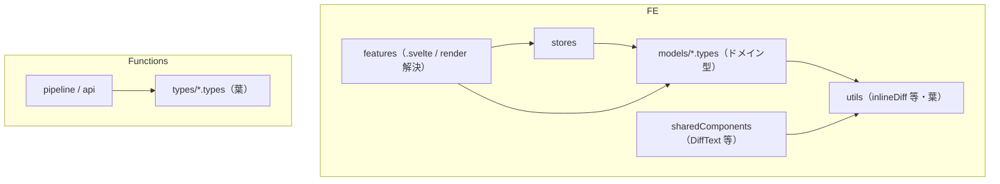
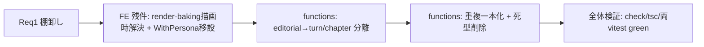

# Design Document — model-type-consolidation

## Overview

**Purpose**: フロント（`src/lib/models` ＋ `stores`/`features` 境界）と functions（`functions/src/types`）の型定義を、直近の turn/chapter 系整理で確立した方針で網羅的に整える。同一ドメインの型を1ファイルに集約し、ドメイン/永続型を表示用に加工した「似て非なる型」を排し、各型の責務境界（intrinsic な値＋id 参照のみ、派生は描画時解決／型に畳まない）をそろえる。

**Users**: 開発者（型の探索性・一貫性が上がり、FE/functions で同一概念が同じ配置・責務でそろう）。

**Impact**: 型の**配置・重複・責務**のみを変更する純粋なリファクタ。型の意味・データ形・UI 出力・生成/永続の挙動は不変。`*ForFirestore`（Firestore 書き込み境界）の構造・命名は維持する。

### Goals
- 1ドメイン=1型ファイルへ集約し、FE `models/<domain>.types` と functions `types/<domain>.types` を同粒度で並行させる。
- ドメイン/永続型から解決済みラベル・横断JOIN・算出結果を排し、FE は描画時解決、functions は型に畳まない責務境界に統一する。
- 実質同一の型を一本化し、参照ゼロの死型・フォルダを削除する。
- コンポーネント内の独自データ型を `models` へ一元化する。
- `svelte-check` / functions `tsc` / 両 vitest を 0 error・green に保つ（挙動不変）。

### Non-Goals
- 型の意味・データ形・UI/生成/永続の挙動の変更。
- `*ForFirestore` の**構造**変更（役割・命名・フィールドは維持。配置・重複整理のみ）。
- 識別子リネーム（例: functions `DebateTurn` ↔ FE `Turn` の名称統一）。behavior-neutral だが波及大のため別対応候補。
- FE/functions の共通型を単一ソース化する共有パッケージ（steering 方針と乖離・スコープ外）。
- Props（UI 入力契約）を `models` に定義すること。Props はコンポーネント固有の契約であり models 一元化の**対象外**。インライン（`let { … }: { … } = $props()`）でも局所定義でもよく、フィールド型のみ `models` を用いる。

## Boundary Commitments

### This Spec Owns
- FE `src/lib/models` 配下の型の集約・重複除去・死型削除・責務境界統一。
- `stores`/`features` 境界に残る表示派生（ラベル解決・JOIN・差分）の描画時解決化、およびコンポーネント/store 内の独自データ型の `models` 移設。
- functions `functions/src/types` への同一方針の適用（集約・重複除去・死型削除・責務境界統一）と、同一概念の FE/functions 整合。
- 「概念 → 型ファイル」の正準マッピング（下記）。

### Out of Boundary
- 識別子のリネーム（D5）。
- `*ForFirestore` の構造・書き込み挙動（維持）。
- 型の意味・データ形の変更、新機能。
- FE/functions 共有型パッケージ化（Option B）。
- `Props` interface 自体の存在（維持）。

### Allowed Dependencies
- 既存の依存方向（下記 Architecture）。FE: `utils`（葉） ← `models` ← `stores` ← `features`、`sharedComponents` ← `utils`。functions: `types`（葉） ← `pipeline`/`api` 等。
- 既存の描画時解決手段（`personaMap`、id 参照）。

### Revalidation Triggers
- `*ForFirestore` のフィールド変更（起きてはならない）。
- ドメイン型の責務境界変更（intrinsic＋id 参照の原則を破る追加）。
- 概念→ファイル マッピングの変更。

## Architecture

### Existing Architecture Analysis
- FE は層構成（`utils` 葉 → `models` → `stores` → `features`、`sharedComponents` は `utils` に依存）。直近作業で turn/chapter 系は集約済み、死型（postDebateComment/editedIntroClosing 系）除去済み、turns の描画時解決済み。
- functions は `types/` にドメイン別分割済みだが、`editorial.types.ts` が「編集出力」と「編集後討論」を混載し、`EditedTurn`/`EditedChapter` が turn/chapter に無い（FE と配置が不一致）。
- `structure.md`: 「`models/` はドメインデータ・永続化に限る／過度な共通化をしない」に準拠。

### Architecture Pattern & Boundary Map

**Selected pattern**: Option C（Hybrid）— 各層内 in-place 整理＋「概念→ファイル」正準マッピングで FE/functions を並行。

依存方向（本 spec で不変・違反はエラー扱い）:



**正準マッピング（概念 → 型ファイル）**: 同一概念は FE/functions で同じドメインファイルに置く。

| 概念 | FE | functions | 備考 |
|------|----|-----------|------|
| 原本ターン | `turn.types`（`Turn`/`TurnForFirestore`） | `turn.types`（`DebateTurn`＝原本） | 命名統一は Non-Goal |
| 編集後ターン | `turn.types`（`EditedTurn`） | `turn.types`（`EditedTurnForFirestore`）← editorial から移動 | |
| 原本章 | `chapter.types`（`Chapter`/`ChapterForFirestore`＋analysis） | `chapter.types` | |
| 編集後章 | `chapter.types`（`EditedChapter`/`EditingChapterStatus`/`EditedChapterDisplayStatus`） | `chapter.types`（`EditedChapterForFirestore`/`EditingChapterStatus`）← editorial から移動 | |
| 編集出力（導入/締め/所感） | `editorial.types`（`Narration`/`Impression*`/`Editorial*`/`ArticleElement`） | `editorial.types`（同）※ EditedTurn/EditedChapter を除去して編集出力専用に | |
| エンゲージメント | `engagement.types`（`EngagementHistoryEntryWithPersona` を store から移設） | `debate.types` 等（現状維持・責務点検） | |

### Technology Stack

| Layer | Choice / Version | Role in Feature | Notes |
|-------|------------------|-----------------|-------|
| Frontend | Svelte 5 / TypeScript | 型定義・描画時解決 | `models` に型集約 |
| Backend / Services | Firebase Functions / TypeScript | 型定義（`types/`） | `*ForFirestore` 維持 |
| Data / Storage | Firestore | 永続形 | 構造不変 |
| Infrastructure / Runtime | Vite / vitest / svelte-check / tsc | 検証 | 0 error・green |

## File Structure Plan

### 目標レイアウト（変更が生じる箇所のみ）
```
src/lib/
├── models/
│   ├── turn/turn.types.ts            # Turn / EditedTurn / TurnForEditing（済）
│   ├── chapter/chapter.types.ts      # Chapter / EditedChapter* / analysis（済）
│   ├── editorial/editorial.types.ts  # Narration / Impression* / Editorial* / ArticleElement
│   └── engagement/engagement.types.ts# ＋ EngagementHistoryEntryWithPersona（store から移設）
├── stores/engagements.svelte.ts      # WithPersona 型を models へ移し import に変更
└── features/.../                     # render-baking を描画時解決へ（下記 Modified）

functions/src/types/
├── turn.types.ts                     # ＋ EditedTurnForFirestore（editorial から移動）
├── chapter.types.ts                  # ＋ EditedChapterForFirestore / EditingChapterStatus（editorial から移動）
└── editorial.types.ts                # 編集出力専用に縮小（EditedTurn/EditedChapter を除去）
```

### Modified Files（主なもの）
- `functions/src/types/editorial.types.ts` — `EditedTurnForFirestore`/`EditedChapterForFirestore`/`EditingChapterStatus` を除去し、それぞれ `turn.types`/`chapter.types` へ移動。参照 import を全付け替え。
- `src/lib/stores/engagements.svelte.ts` — `EngagementHistoryEntryWithPersona` を `models/engagement/engagement.types.ts` へ移し import。
- `src/lib/features/admin/topic-detail/editing/EditingPage.svelte` — `displayImpressions` の name/role 畳み込みを廃し、`ImpressionSection` が `personaMap` から描画時解決（Req 3）。
- `src/lib/features/admin/topic-detail/debate/EngagementList.svelte` — 行の name 畳み込みを描画時解決に統一（既に `personaMap` 受領）。
- `awarenessesByTurn`（EditingPage / GenerateDebatePage）— `{ personaName, content }` を `{ personaId, content }` に変え、描画時に name 解決。
- Req 1 で発見される functions 内の重複/死型 — ドメイン単位で一本化/削除。

> 各ドメインは独立に適用（1ドメイン=1タスク相当）。移動先が確定した型は、旧定義を残さず import を全付け替えする。

## Requirements Traceability

| Requirement | Summary | 実現要素 |
|-------------|---------|----------|
| 1.1–1.4 | 網羅的棚卸し | 実装先頭で FE models / stores / features ＋ functions/types を全走査し 5分類＋判定根拠を記録 |
| 2.1–2.3 | 同一ドメイン型の集約 | 正準マッピング（Architecture）に沿ってドメインファイルへ集約・空フォルダ廃止・import 付け替え |
| 3.1–3.4 | 表示用もどき型の排除 | FE 残 render-baking（impressions/engagement/awareness）を描画時解決へ（Modified Files） |
| 4.1–4.3 | 実質同一の一本化 | 完全一致の `*ForFirestore`/domain、無意味化 `Omit` を簡約（FE 済＋functions 精査） |
| 5.1–5.2 | 死型削除 | 参照ゼロの型/ファイル/フォルダと残存コメントを除去 |
| 6.1–6.4 | 責務境界の統一 | ドメイン/永続型は intrinsic＋id 参照のみ／派生は描画時 or 非畳み込み／FE・functions 同一方針 |
| 7.1–7.5 | models 一元化 | store/component の独自データ型（`WithPersona`）を models へ。Props は対象外（インライン可・フィールド型のみ models） |
| 8.1–8.4 | functions 整合 | `editorial.types` 分離＋正準マッピング整合、`*ForFirestore` 役割維持、render 概念は非適用 |
| 9.1–9.4 | 振る舞い不変・検証 | 各適用後に svelte-check / tsc / 両 vitest green＋grep（旧パス・死型ゼロ）、`*ForFirestore` 構造不変 |

## Components and Interfaces

本 spec の「コンポーネント」は**型ファイル**と、それらに適用する**責務境界ルール**である。新規サービス/API は無い。

| Component | Layer | Intent | Req | Contracts |
|-----------|-------|--------|-----|-----------|
| 正準マッピング | 設計規約 | 概念→ファイルの唯一の正 | 2, 8 | State（型配置） |
| 責務境界ルール | 設計規約 | intrinsic＋id 参照のみ／派生は描画時解決 or 非畳み込み | 3, 6 | State |
| 型ファイル（FE `models/*`, functions `types/*`） | Data | ドメイン/永続型の単一定義箇所 | 2, 4, 5, 7, 8 | State |
| 描画時解決（features/components） | UI | ラベル/JOIN/diff を render で解決 | 3, 6 | State |

### 責務境界ルール（正準）
- **ドメイン/永続型**: `id` と intrinsic 値、および他要素への **id 参照**（personaId 等）のみを持つ。解決済みラベル（name/role）・横断JOIN（awareness/engagement 集約）・算出結果（diff）を**持たない**。
- **FE 表示**: 上記派生は `personaMap` 等で**描画時に解決**する（型に畳まない）。
- **functions**: render が無いため、生成/永続に不要な派生を**型に畳まない**責務境界のみ適用（描画時解決の概念は非適用）。
- **一元化**: アプリで扱うデータ型は FE=`models`、functions=`types` に定義。`.svelte`/`store` 内に独自データ型を置かない。**Props（UI 入力契約）は対象外**でコンポーネントにインライン（`let { … }: { … } = $props()`）または局所定義してよく、フィールド型のみ `models` を用いる（Props 型を `models` に定義しない）。

## Data Models

本 spec はデータモデル（Firestore の形・意味）を**変更しない**。対象は TypeScript 型の**定義箇所・重複・責務境界**のみ。`*ForFirestore` のフィールド構成は不変。したがって Logical/Physical Data Model の新規設計は無し（正準マッピングが型配置の唯一の記述）。

## Error Handling

該当なし（実行時分岐を伴わない型リファクタ）。唯一のリスクは型/配置の誤りで、これは `tsc`/`svelte-check` のコンパイルエラーとして即時に顕在化する（fail fast）。

## Testing Strategy

### 検証（各ドメイン適用ごとに実施）
- **型チェック**: FE `npm run check`（svelte-check 0 error/warning）、functions `tsc --noEmit` 0 error。
- **テスト**: FE `vitest run` 全 green、functions `vitest run` 全 green（挙動不変の担保）。
- **静的検査（grep）**:
  - 旧パス/旧フォルダ参照ゼロ（`models/editedTurn` の類が残らない）。
  - 死型判定: 削除対象の型名がフロント/該当層で参照ゼロ。
  - 責務境界: ドメイン/永続型の定義に解決済みラベル/JOIN/diff フィールドが無い。
- **描画時解決の回帰**: impressions/engagement/awareness の表示テスト（既存 Phase5/Phase6/Section spec）が出力不変で green。

### Integration Tests
- 既存の editorial リポジトリ/編集チェーン/discussion 描画のテスト群が、型移動・描画時解決後も無改修（または import 付け替えのみ）で green であることを確認。

## Migration Strategy

段階適用（ドメイン単位・独立コミット可）。各ステップは「移動→import 全付け替え→旧定義削除→検証 green」を1単位とする。



- ロールバック: 各ステップは型のみの移動で、`tsc`/`check` が即座に不整合を検出するため、コンパイルが通らなければそのステップを戻す。
- `*ForFirestore` は移動・改名のみで**フィールド不変**（永続互換を壊さない）。
