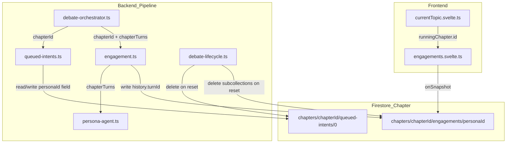
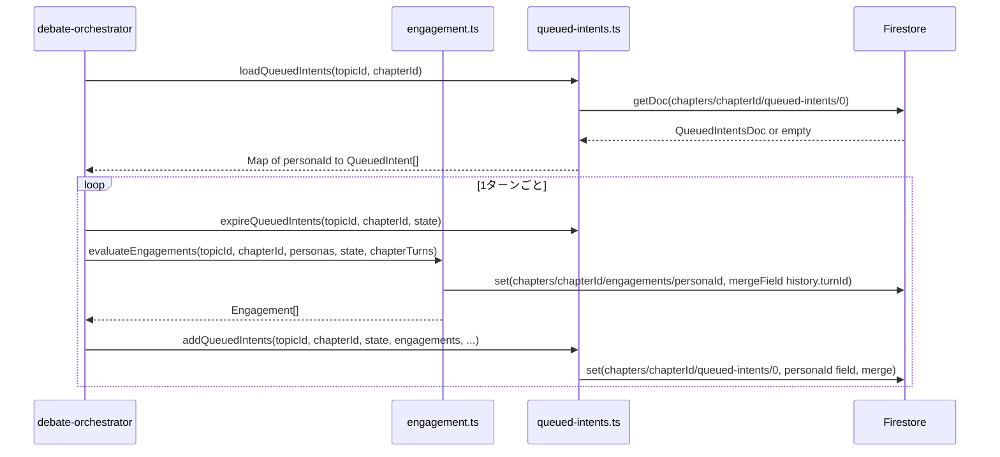

# Technical Design: per-chapter-engagements

## Overview

討論パイプラインのエンゲージメント（発言意欲評価）をチャプター単位に再スコープする変更。現状は評価の入力ターンと Firestore への保存がトピック全体にまたがっているが、この変更により評価はチャプター内ターンのみを入力とし、永続化もチャプター専用のサブコレクションに分離される。あわせて、エンゲージメントドキュメントに同居していた発言意図キュー（queued intents）を独立したドキュメント（`queued-intents/0`）に分離する。

**Purpose**: チャプターをまたいだ評価汚染を排除し、各チャプターが独立した発言意欲状態から開始できるようにする。

**Users**: 討論パイプライン（バックエンド自動処理）と、発言意欲をリアルタイム監視する管理者。

**Impact**: バックエンド4ファイルとフロントエンド3ファイルを変更する。Firestore の永続化コレクションが `topics/{topicId}/engagements` から `topics/{topicId}/chapters/{chapterId}/engagements` および `topics/{topicId}/chapters/{chapterId}/queued-intents` に移行する。

### Goals

- エンゲージメント評価ターンをチャプター内に限定する（1.x）
- 永続化パスを `chapters/{chapterId}/engagements/{personaId}` に移行する（2.x）
- 発言意図キューをエンゲージメントと同一のチャプタースコープ per-persona ドキュメントに保持する（3.x）
- チャプター間でのエンゲージメント状態持ち越しを構造的になくす（4.x）

### Non-Goals

- エンゲージメントスコアのアルゴリズム・閾値変更
- 話者選択ロジックの変更
- 完了済みチャプターのエンゲージメント履歴の管理画面表示
- 旧 `topics/{topicId}/engagements` データの一括移行

## Boundary Commitments

### This Spec Owns

- `engagement.ts` の評価スコープ変更（`chapterTurns` 使用）と保存パス変更
- `queued-intents.ts` のチャプタースコープ移行・シグネチャ更新（`chapterId` 追加）
- `debate-orchestrator.ts` の呼び出しシグネチャ更新（`chapterId`・`chapterTurns` 受け渡し）
- `debate-lifecycle.ts` の `restartChapter` によるチャプタースコープクリーンアップ
- `engagements.svelte.ts` のチャプタースコープ購読と `turnId` キー化
- `currentTopic.svelte.ts` の `engagementsStore` へのチャプターID受け渡し
- `topics.svelte.ts` の `deleteTopic` によるチャプター `engagements` サブコレクション削除

### Out of Boundary

- `turn-index-abolition` spec の担当変更（ターン ID・turnIndex 廃止）
- 旧 `topics/{topicId}/engagements` コレクションの一括クリーンアップスクリプト
- `EngagementList.svelte` および `Phase5Debate.svelte` の表示コンポーネント変更
- 過去チャプターのエンゲージメント履歴のオンデマンドロード

### Allowed Dependencies

- `functions/src/pipeline/debate/debate-lifecycle.ts` の `ChapterEntry` 型
- `functions/src/types/debate.types.ts` の `Engagement`, `QueuedIntent`, `DebateTurn`
- Firebase Admin SDK（`firebase-admin ^13.x`）
- Firebase Client SDK（`firebase/firestore`）
- `src/lib/stores/chapters.svelte.ts` の `chaptersStore`（`runningChapter` 参照）

### Revalidation Triggers

- `QueuedIntent` 型の変更（`triggerTurnId` キーの変更など）
- Firestore セキュリティルールへの `chapters/{chapterId}/engagements` / `queued-intents` サブコレクション追加
- `turn-index-abolition` spec 完了後のターン識別子仕様変更

## Architecture

### Existing Architecture Analysis

現行の永続化パスと責務:

```
topics/{topicId}/engagements/{personaId}
  history: { [turnIndex: string]: { score, mode, intentSummary? } }   // engagement.ts が書く
  queuedIntents: QueuedIntent[]                                        // queued-intents.ts が読み書き
```

現行の評価フロー: `evaluateEngagements` は `state.turns`（全チャプターの累積ターン）を `evaluateEngagement` に渡す。チャプター内ターンへのスライスはない。

変更後: `engagement.ts` と `queued-intents.ts` は役割・保存先とも完全分離する。

### Architecture Pattern & Boundary Map



**Key Decisions**:
- パターン: 既存システムへの最小限 Extension（新コンポーネントなし、シグネチャ追加とパス変更のみ）
- `engagement.ts` と `queued-intents.ts` をストレージレベルで分離し、それぞれが単一の責務を持つ
- フロントエンドは `runningChapter` のエンゲージメントのみを購読する。過去章は変化しない履歴データのため、リアルタイム購読対象から外す

### Technology Stack

| Layer | Choice | Role | Notes |
|-------|--------|------|-------|
| Backend | Firebase Admin SDK (`firebase-admin ^13.x`) | Firestore 読み書き（章サブコレクション） | 既存通り |
| Frontend | Firebase Client SDK (`firebase/firestore`) | `onSnapshot` で章エンゲージメントを購読 | 購読パス変更のみ |
| Storage | Firestore サブコレクション | engagement 履歴と queued-intents の分離保存 | パス変更、ドキュメント構造変更 |

## File Structure Plan

### Modified Files

**Backend（`functions/src/pipeline/debate/`）:**

- `engagement.ts` — `chapterId` + `chapterTurns` パラメータ追加、保存パス変更
- `queued-intents.ts` — `chapterId` パラメータ追加、単一ドキュメント構造に変更、`loadQueuedIntents` を `getDoc` に変更
- `debate-orchestrator.ts` — `evaluateEngagements`・`evaluateEngagementWithFallback`・各 queued-intents 関数への `chapterId` / `chapterTurns` 受け渡し追加
- `debate-lifecycle.ts` — `restartChapter` のエンゲージメントクリーンアップをチャプターサブコレクション削除に変更

**Frontend（`src/lib/stores/`）:**

- `engagements.svelte.ts` — 購読パスをチャプタースコープに変更、`setChapterId` メソッド追加、`Map` キーを `string`（turnId）に変更
- `currentTopic.svelte.ts` — `engagementsStore.setChapterId(chaptersStore.runningChapter?.id ?? null)` を `chaptersStore` 変化時に呼ぶ
- `topics.svelte.ts` — `deleteTopic` で `topics/{topicId}/engagements` の取得・削除を削除し、代わりに章サブコレクションのドキュメントを削除対象に追加

## System Flows

### ターン処理フロー（チャプタースコープ変更後）



## Requirements Traceability

| 要件 | 概要 | コンポーネント | インターフェース |
|------|------|--------------|----------------|
| 1.1 | 評価入力をチャプター内ターンに限定 | engagement.ts, debate-orchestrator.ts | `evaluateEngagements` |
| 1.2 | `evaluateEngagementWithFallback` もチャプターターン参照 | engagement.ts | `evaluateEngagementWithFallback` |
| 1.3 | 前章ターンを評価に含めない | engagement.ts | `evaluateEngagements` |
| 2.1 | 履歴をチャプターパスに保存 | engagement.ts | `saveEngagements`（内部） |
| 2.2 | トピックレベルパスへの書き込みなし | engagement.ts | `saveEngagements`（内部） |
| 3.1 | 全ペルソナ分を単一ドキュメントに格納 | queued-intents.ts | `addQueuedIntents`, `loadQueuedIntents` |
| 3.2 | チャプタースコープから読み込み | queued-intents.ts | `loadQueuedIntents` |
| 3.3 | 更新もチャプタースコープに書き込み | queued-intents.ts | `addQueuedIntents`, `expireQueuedIntents`, `consumeQueuedIntent` |
| 3.4 | トピックレベルパスから読まない | queued-intents.ts | `loadQueuedIntents` |
| 4.1 | 新チャプターは空のキューで開始 | queued-intents.ts | `loadQueuedIntents`（ドキュメント未存在 → 空 Map） |
| 4.2 | 再実行時のキュー状態の冪等性 | queued-intents.ts, debate-state.ts | `loadQueuedIntents`, `getDebateState` |
| 4.3 | チャプタースコープ内にのみ履歴累積 | engagement.ts | `saveEngagements`（内部） |
| 4.4 | キューの章間持ち越しなし | queued-intents.ts | `loadQueuedIntents` |
| 5.1 | リセット時チャプターサブコレクション削除 | debate-lifecycle.ts | `restartChapter` |
| 5.2 | ターン削除に合わせた履歴エントリ削除 | debate-lifecycle.ts | `restartChapter` |
| 6.1 | 管理画面がチャプタースコープから読む | engagements.svelte.ts | `createEngagementsStore` |
| 6.2 | ストアがチャプタースコープを購読 | engagements.svelte.ts | `createEngagementsStore` |
| 6.3 | データ未存在時は空表示 | engagements.svelte.ts | `engagementsMap` |

## Components and Interfaces

### Backend Pipeline

| Component | Domain | Intent | Req Coverage | Key Dependencies |
|-----------|--------|--------|--------------|-----------------|
| engagement.ts | Pipeline/Debate | チャプタースコープ評価と履歴保存 | 1.1–1.3, 2.1–2.2, 4.3 | persona-agent.ts (P0), Firestore Admin (P0) |
| queued-intents.ts | Pipeline/Debate | 発言意図キューのチャプター単位管理 | 3.1–3.4, 4.1–4.4 | Firestore Admin (P0) |
| debate-orchestrator.ts | Pipeline/Debate | chapterId と chapterTurns を下流に受け渡す | 1.1, 1.2, 3.2–3.3 | engagement.ts (P0), queued-intents.ts (P0) |
| debate-lifecycle.ts | Pipeline/Debate | restartChapter のチャプタースコープクリーンアップ | 5.1, 5.2 | Firestore Admin (P0) |

---

#### engagement.ts

| Field | Detail |
|-------|--------|
| Intent | チャプターターンのみを使って発言意欲を評価し、チャプタースコープのパスに履歴を保存する |
| Requirements | 1.1, 1.2, 1.3, 2.1, 2.2, 4.3 |

**Contracts**: Service [x] / State [x]

##### Service Interface

```typescript
// 変更後のシグネチャ
export const evaluateEngagements: (params: {
  topicId: string;
  chapterId: string;                           // 追加: 保存先のチャプターID
  personas: Persona[];
  state: DebateState;
  chapterTurns: ReadonlyArray<DebateTurn>;     // 追加: 現チャプターのターン（評価入力）
}) => Promise<Engagement[]>;

export const evaluateEngagementWithFallback: (params: {
  personaId: string;
  personas: Persona[];
  chapterTurns: ReadonlyArray<DebateTurn>;     // turns → chapterTurns に変更
  engagements?: Engagement[];
}) => Promise<Engagement>;
```

- **Preconditions**: `chapterId` は `debate-orchestrator.ts` から `chapterDoc.id` として渡される; `chapterTurns` は `getChapterTurns()` の戻り値
- **Postconditions**: `topics/{topicId}/chapters/{chapterId}/engagements/{personaId}` の `history.{turnId}` が更新される; `topics/{topicId}/engagements` には書き込まない
- **Invariants**: `saveEngagements`（内部）の書き込み先は常にチャプタースコープパス

**Implementation Notes**:
- `saveEngagements` パス変更: `` `topics/${topicId}/chapters/${chapterId}/engagements/${personaId}` ``
- `evaluateEngagement`（persona-agent.ts）への渡すターンを `chapterTurns` に変更。`state.turns` は渡さない
- `evaluateEngagementWithFallback` の引数名を `turns` → `chapterTurns` にリネームし、`evaluateEngagement` への引数も `chapterTurns` を使う

---

#### queued-intents.ts

| Field | Detail |
|-------|--------|
| Intent | 発言意図キューを `chapters/{chapterId}/engagements/{personaId}` に engagement 履歴と同居させてチャプター単位で管理する |
| Requirements | 3.1, 3.2, 3.3, 3.4, 4.1, 4.2, 4.4 |

**Contracts**: Service [x] / State [x]

##### Service Interface

```typescript
// パス: topics/{topicId}/chapters/{chapterId}/engagements/{personaId}
// ドキュメント構造（engagement.ts と共有）:
// {
//   history: { [turnId: string]: { score, mode, intentSummary? } },
//   queuedIntents: QueuedIntent[]
// }

export const loadQueuedIntents: (
  topicId: string,
  chapterId: string     // 追加
) => Promise<Map<string, QueuedIntent[]>>;

export const expireQueuedIntents: (params: {
  topicId: string;
  chapterId: string;    // 追加
  state: DebateState;
}) => Promise<void>;

export const addQueuedIntents: (params: {
  topicId: string;
  chapterId: string;    // 追加
  state: DebateState;
  engagements: readonly Engagement[];
  speakerSelection: SpeakerSelection;
  triggerTurnId: string;
}) => Promise<void>;

export const consumeQueuedIntent: (params: {
  topicId: string;
  chapterId: string;    // 追加
  state: DebateState;
  personaId: string;
  queuedEntries: QueuedIntent[] | undefined;
}) => Promise<void>;
```

- **Preconditions**: `chapterId` は呼び出し元の `chapterDoc.id`; `loadQueuedIntents` はコレクション未存在・ドキュメント未存在でも空 Map を返す
- **Postconditions**: `addQueuedIntents` / `expireQueuedIntents` / `consumeQueuedIntent` は `engagements/{personaId}` の `queuedIntents` フィールドのみを `mergeFields` で更新
- **Invariants**: `topics/{topicId}/engagements` へのアクセスを一切行わない

**Implementation Notes**:
- `loadQueuedIntents`: `topics/{topicId}/engagements` の `collection().get()` を `topics/${topicId}/chapters/${chapterId}/engagements` の `collection().get()` に変更。各ドキュメントの `queuedIntents` フィールドを読む
- 書き込みパス変更: `topics/${topicId}/engagements/${personaId}` → `topics/${topicId}/chapters/${chapterId}/engagements/${personaId}`
- フィールド更新は `set({ queuedIntents: updated }, { mergeFields: ['queuedIntents'] })` で `history` フィールドを上書きしない（現行と同じ `merge` パターンを継続）
- **章間持ち越しなし**: 新チャプターでは `chapters/{chapterId}/engagements` が空のため `loadQueuedIntents` は空 Map を返す。構造的に持ち越し不可
- 冪等性: `restartChapter` が章の `engagements` サブコレクションごと削除するため、再実行時に `loadQueuedIntents` は空 Map を返す

---

#### debate-orchestrator.ts

| Field | Detail |
|-------|--------|
| Intent | `chapterId` と `chapterTurns` を engagement.ts・queued-intents.ts の各関数に渡す |
| Requirements | 1.1, 1.2, 3.2, 3.3 |

**Contracts**: Service [x]

**Implementation Notes**:
- `executeChapterTask`: `loadQueuedIntents(topicId, chapterDoc.id)` へ `chapterDoc.id` を追加
- `executeTurn` のシグネチャに `chapterId: string` を追加し、呼び出し元から `chapterDoc.id` を受け取る
- `evaluateEngagements` 呼び出しに `chapterId` と `chapterTurns: getChapterTurns()` を追加
- `evaluateEngagementWithFallback` 呼び出しの `turns: state.turns` を `chapterTurns: getChapterTurns()` に変更
- `expireQueuedIntents` / `addQueuedIntents` / `consumeQueuedIntent` 呼び出しに `chapterId` を追加

---

#### debate-lifecycle.ts（`restartChapter`）

| Field | Detail |
|-------|--------|
| Intent | 廃棄チャプターのエンゲージメントサブコレクションと queued-intents ドキュメントを削除する |
| Requirements | 5.1, 5.2 |

**Contracts**: Service [x]

**Implementation Notes**:
- 廃棄対象の `discardChapters` ごとに:
  1. `topics/{topicId}/chapters/{chapter.id}/engagements` サブコレクション全ドキュメントを取得・削除
  2. `topics/{topicId}/chapters/{chapter.id}/queued-intents/0` を削除
- 旧 `topics/{topicId}/engagements` の history / queuedIntents 更新処理（現行の `if (removedTurnIds.size > 0) { const engSnap = ...` ブロック）を削除する
- Risks: Admin SDK でのサブコレクション取得 (`collection().get()`) は追加の Firestore 読み込みコストが発生するが、ペルソナ数（最大10前後）は有限であり問題ない

---

### Frontend Stores

| Component | Domain | Intent | Req Coverage | Key Dependencies |
|-----------|--------|--------|--------------|-----------------|
| engagements.svelte.ts | Store | 実行中チャプターの engagements サブコレクションを購読 | 6.1, 6.2, 6.3 | Firestore Client (P0) |
| currentTopic.svelte.ts | Store | runningChapterId を engagementsStore に渡す | 6.1, 6.2 | chaptersStore (P0), engagementsStore (P0) |
| topics.svelte.ts | Store | deleteTopic でチャプター engagements サブコレクションを削除 | 5.1 | Firestore Client (P0) |

---

#### engagements.svelte.ts

| Field | Detail |
|-------|--------|
| Intent | `topics/{topicId}/chapters/{chapterId}/engagements` を購読し、turnId → 評価エントリリストの Map を提供する |
| Requirements | 6.1, 6.2, 6.3 |

**Contracts**: State [x]

##### State Management

```typescript
export type EngagementHistoryEntryWithPersona = EngagementHistoryEntry & {
  turnId: string;      // turnIndex: number から変更
  personaId: string;
};

export const buildEngagementsMap = (
  rawDocs: Array<{ personaId: string; history: Record<string, EngagementHistoryEntry> }>
): Map<string, EngagementHistoryEntryWithPersona[]>;  // キー: string (turnId)

export const createEngagementsStore = (topicId: string) => {
  // State
  let engagementsMap: Map<string, EngagementHistoryEntryWithPersona[]>;

  // チャプターIDが変わったら購読先を切り替える
  const setChapterId: (chapterId: string | null) => void;

  return {
    get engagementsMap(): Map<string, EngagementHistoryEntryWithPersona[]>;
    setChapterId,
    start,
    stop,
  };
};
```

- **State model**: `Map<string, EngagementHistoryEntryWithPersona[]>` — `turnId`（文字列）キーでペルソナ評価リストを提供
- **Persistence**: `onSnapshot` で `topics/{topicId}/chapters/{chapterId}/engagements` を購読
- **Concurrency**: `setChapterId` 呼び出し時に旧購読を `unsubscribe()` してから新パスで購読を張り直す。`chapterId` が `null` の場合は購読せず空 Map を維持する

**Implementation Notes**:
- `buildEngagementsMap` のキー変換を `parseInt(key, 10)` から `key`（文字列のまま）に変更
- `EngagementHistoryEntryWithPersona` の `turnIndex: number` を `turnId: string` に変更（`turn-index-abolition` と整合。`Phase5Debate.svelte` 側の参照も `t.turnIndex` → `t.id` に変更が必要）
- `currentTopic.svelte.ts` から `$effect(() => { engagementsStore.setChapterId(chaptersStore.runningChapter?.id ?? null); })` パターンで反応的に切り替える

#### topics.svelte.ts（`deleteTopic`）

**Implementation Notes**:
- `topics/{topicId}/engagements` の `getDocs` 取得と `d.ref` 収集を削除する（新アーキテクチャではここに書き込まない）
- 章 `engagements` サブコレクション削除: `chaptersSnap.docs` の各章 ID を使い `topics/{topicId}/chapters/{chapterId}/engagements` のドキュメントを並行取得してバッチ削除対象に追加（`queuedIntents` は同一ドキュメントなので追加取得不要）
- 既存の 500件バッチループで処理できる

## Data Models

### Physical Data Model

**変更後の Firestore 構造（チャプタースコープ）:**

```
topics/{topicId}/chapters/{chapterId}/
  engagements/{personaId}
    history: {
      [turnId: string]: {
        score: number;                            // 1–5
        mode: 'opinion' | 'fact' | 'none' | 'question';
        intentSummary?: string;
      }
    }
    queuedIntents: Array<{
      triggerTurnId: string;
      intentSummary: string;
    }>
```

engagement 履歴と発言意図キューは同一 per-persona ドキュメントに共存する（両方とも次の発言者判定のための中間データ）。

**廃止されるパス（新規書き込みなし）:**

```
topics/{topicId}/engagements/{personaId}   ← 新チャプター処理から書き込まれなくなる
```

**Consistency & Integrity**:
- `history` への書き込みは `mergeFields: ['history.{turnId}']` で特定フィールドのみ更新（他ターンの履歴や `queuedIntents` を上書きしない）
- `queuedIntents` への書き込みは `mergeFields: ['queuedIntents']` で `history` フィールドを上書きしない

## Error Handling

### Error Strategy

バックエンド: 既存の例外処理パターン（`throw new Error` → Cloud Functions 上位ハンドラによるリトライ）を維持する。新規エラーパターンはない。

フロントエンド: `onSnapshot` の失敗は既存の非ハンドリングを維持する（購読失敗時は `engagementsMap` が空 Map のまま表示コンポーネントが空の `[]` を受け取る）。

## Testing Strategy

### Unit Tests

- `evaluateEngagements`: `chapterTurns` が `evaluateEngagement`（persona-agent）に渡されることを確認（`state.turns` が渡されないこと）
- `loadQueuedIntents`: ドキュメント未存在時に空 Map を返すことを確認
- `addQueuedIntents`: 単一ドキュメントの正しいペルソナフィールド更新を確認
- `buildEngagementsMap`: 文字列キーで `Map<string, ...>` を正しく構築することを確認

### Integration Tests

- `executeChapterTask` の第1章→第2章遷移: 第2章の `loadQueuedIntents` が前章のキューを含まないことを確認
- `restartChapter` 後: `chapters/{chapterId}/engagements` サブコレクションと `queued-intents/0` が削除されていることを確認

## Migration Strategy

既存データの移行は不要。

- `topics/{topicId}/engagements` の既存データは討論生成中の一時的な状態データであり、完了済みトピックでは利用されない
- 新チャプター処理の開始から自動的に新パスへ書き込まれる
- フロントエンドは購読先が変わるため旧パスのデータは表示されなくなる
- 旧コレクションは Firestore に残留するが、次回の `deleteTopic` 実行時に削除される（`deleteTopic` は既存の `topics/{topicId}/engagements` 削除を当面維持するため）

## Supporting References

詳細な調査記録・設計判断の根拠は [`research.md`](./research.md) を参照。
