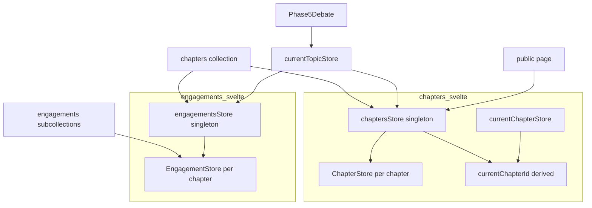

# Technical Design: per-chapter-store-refactor

## Overview

本リファクタは、討論チャプターとそのエンゲージメント評価を扱うクライアント側ストア構造を、シングルトン使い回し型から**チャプター単位インスタンス型**へ移行する。現状は単一の `chaptersStore` が全章を配列管理し、単一の `engagementsStore` シングルトンが `setChapterId()` で購読対象を切り替え、`currentTopicStore` がモジュールレベルの `$effect.root` で両者を連結している。

新構造では、`chaptersStore` が章コレクションを購読して各章を独立したインスタンス（`ChapterStore`）として保持する。`engagementsStore` は討論開始時点で章IDを一度だけ読み、章ごとの `EngagementStore` を生成・購読する（章集合は Phase 4 生成後に固定のため、変化監視は不要）。「どの章が現在か」は `currentChapterId` という**設定される単一の状態**とし、章コレクションのスナップショットコールバック内で `status === 'running'` からセットする。chapter 側・engagement 側はともに `chapterId === currentChapterId` の比較で current を導く。これにより `setChapterId`・`$effect.root`・`ChapterWithId` を廃止する。

**Impact**: Firestore のデータ構造・UI 表示・討論生成ロジックは不変。クライアント状態の持ち方のみを整理する純粋な内部リファクタ。副次効果として、全章のエンゲージメントを購読するため、過去章のターンにもエンゲージメントが表示されるようになる（現状制約の解消）。

### Goals
- チャプターを独立したストアインスタンスの単位として再定義する
- `setChapterId`・モジュールレベル `$effect.root`・`ChapterWithId` を廃止する
- current 判定を `currentChapterId` 比較に一元化する
- 既存の表示・購読ライフサイクル挙動を維持する

### Non-Goals
- Firestore のコレクション構造・ドキュメントスキーマの変更
- Firebase Functions 側の討論オーケストレーション・status 書き込みロジック
- UI の表示内容・レイアウト・操作フローの変更
- 他フェーズストア（personas / postDebateComments / chapterAnalysis / stakeholders）の構造変更
- `session.types.ts → debate.types.ts` リネーム（Open Questions 参照。別途処理を推奨）

## Boundary Commitments

### This Spec Owns
- `src/lib/stores/chapters.svelte.ts`：集約 `chaptersStore` と章単位 `ChapterStore`、`currentChapterId` の算出
- `src/lib/stores/engagements.svelte.ts`：集約 `engagementsStore` と章単位 `EngagementStore`
- `currentChapterStore` / `currentEngagementStore`（current セレクタ）の定義
- `src/lib/stores/currentTopic.svelte.ts`：上記ストアの結線（`$effect.root` 除去）
- 消費側（`Phase5Debate.svelte`、公開ページ `+page.svelte`）の参照更新
- 関連ユニットテストの更新

### Out of Boundary
- 章 `status` フィールドの意味・遷移・書き込み（Functions 所有のまま）
- エンゲージメント評価の生成ロジック（Functions 所有）
- `session.types.ts` のリネーム

### Allowed Dependencies
- Firestore Client SDK（`onSnapshot` / `collection`）
- ドメイン型 `ChapterStateDoc` / `TurnDoc` / `EngagementHistoryEntry`（`$lib/models/...`）
- `engagementsStore` は章ID・順序の取得目的で章コレクションを one-shot 読み取り（`getDocs`）してよい（`chaptersStore` の内部状態には依存しない）

### Revalidation Triggers
- `ChapterStore` / `EngagementStore` の公開アクセサ契約の変更
- `currentChapterId` 算出元（`status === 'running'`）の変更
- 章 `status` の値集合・意味の変更（Functions 側）

## Architecture

### Existing Architecture Analysis
- データ読み書きは Firestore Client SDK を `src/lib/stores/` に集約（tech.md 準拠）。
- 現状は `chaptersStore`（コレクション購読・配列保持）、`engagementsStore`（シングルトン・`setChapterId` 切替）、`currentTopic.svelte.ts`（`$effect.root` で running→engagements 連結）。
- 消費側：`Phase5Debate.svelte`（admin）、`routes/topics/[topicId]/+page.svelte`（公開、engagements 未使用）。

### Architecture Pattern & Boundary Map

集約ストアが章コレクションを購読し、章単位インスタンスを保持する。`currentChapterId` を単一の軸として current セレクタが導出する。**ストア間のリアクティブ依存・`$effect` を持たず**、各集約ストアは自身の `onSnapshot` コールバック内で完結する。



**Key Decisions**:
- **軸1（章リスト集約）**: `chaptersStore` がコレクションを1本購読し `ChapterStore` を保持。各 `ChapterStore` は自前購読しない（二重購読回避）。
- **軸2（engagements 範囲）**: `engagementsStore` が全章ぶんの `EngagementStore` を購読。切替ロジック（`setChapterId`）を排除し、過去章の制約も解消。
- **軸3（discrete 生成・リアクティブ不要）**: 章集合は Phase 4 生成後に固定のため、`engagementsStore` は `start()` 時に章IDを**一度だけ読み**（one-shot `getDocs`）、章ごとの `EngagementStore` を生成する。変化監視（reconcile）も `$effect` も常設の章コレクション購読も不要。これにより `effect_orphan` を構造的に回避（research.md 軸2/軸3, F-2）。
- **current 設定の一元化**: `currentChapterId` は `chaptersStore` が**設定する単一の状態**（`onSnapshot` コールバック内で `status === 'running'` からセット）。両 current セレクタはこれを比較参照する（research.md F-1b, F-1c）。set vs derived は Svelte ではなくドメイン判断。

### Technology Stack

| Layer | Choice / Version | Role in Feature | Notes |
|-------|------------------|-----------------|-------|
| Frontend | Svelte 5.x（runes） | `$state` によるリアクティブストア。`$effect` は使用しない | モジュールレベル `$effect.root` 廃止 |
| Data / Storage | Firestore Client SDK | `onSnapshot` でコレクション/サブコレクション購読 | スキーマ不変 |

## File Structure Plan

### Modified Files
- `src/lib/stores/chapters.svelte.ts` — `ChapterStore`（章単位インスタンス）と `chaptersStore`（集約＋`currentChapterId` 算出）を定義。`ChapterWithId` 廃止。`currentChapterStore` を追加（同ファイル or 近接）。
- `src/lib/stores/engagements.svelte.ts` — `EngagementStore`（章単位）と `engagementsStore`（集約・start 時に章IDを one-shot 取得し全章 `EngagementStore` を生成・merged `engagementsMap`）。`setChapterId` 廃止。`currentEngagementStore` は作らない（OQ-1）。
- `src/lib/stores/currentTopic.svelte.ts` — `$effect.root` とシングルトン `engagementsStore` 結線を除去。新ストア群をアクセサとして公開。
- `src/lib/features/admin/debate/Phase5Debate.svelte` — `chaptersStore.runningChapter` → `currentChapterStore.currentChapter`。`engagementsStore.engagementsMap`（merged）参照に追従。
- `src/routes/topics/[topicId]/+page.svelte` — `ChapterStore` インスタンスのアクセサに追従（`chapters`/`turns`/`isLoaded` の利用契約は維持）。
- `src/lib/stores/chapters.test.ts` / `engagements.test.ts` / `Phase5Debate.svelte.spec.ts` — 新構造に追従。

## Requirements Traceability

| Requirement | Summary | Components |
|-------------|---------|------------|
| 1.1–1.5 | 章単位 `ChapterStore` 化・一覧/順序/current/turns 提供 | `ChapterStore`, `chaptersStore`, `currentChapterStore` |
| 2.1–2.5 | 章単位 `EngagementStore` 化・`setChapterId` 廃止・`buildEngagementsMap` 維持 | `EngagementStore`, `engagementsStore` |
| 3.1–3.3 | `ChapterWithId` 廃止・参照置換 | `chapters.svelte.ts` 型整理 |
| 4.1–4.4 | `$effect.root`/シングルトン除去・利用契約維持 | `currentTopicStore` |
| 5.1–5.4 | 両ストアの独立性（相互非内包） | `ChapterStore`, `EngagementStore` |
| 6.1–6.5 | 表示・ライフサイクル維持・current 反映 | `Phase5Debate`, 公開ページ, 集約ストア |
| 7.1–7.4 | テスト更新 | 3テストファイル |

## Components and Interfaces

| Component | Layer | Intent | Req Coverage | Key Dependencies | Contracts |
|-----------|-------|--------|--------------|------------------|-----------|
| `ChapterStore` | Store/data | 1章分の状態保持 | 1.1, 5.1 | ChapterStateDoc | State |
| `chaptersStore` | Store/aggregate | 章コレクション購読・`ChapterStore` 保持・`currentChapterId` 算出 | 1.2–1.5, 3 | Firestore, ChapterStore (P0) | State |
| `currentChapterStore` | Store/selector | current 章を導出 | 1.4, 4.3 | chaptersStore (P0) | State |
| `EngagementStore` | Store/data | 1章分の engagements 購読・map 保持 | 2.1, 2.3–2.5, 5.2 | Firestore, buildEngagementsMap | State |
| `engagementsStore` | Store/aggregate | 章IDを one-shot 取得・全章 `EngagementStore` 生成・merged map | 2.1–2.4, 4.3 | Firestore (P0), EngagementStore (P0) | State |
| `currentTopicStore` | Store/aggregate | ストア群の結線・公開 | 4.1–4.4 | 上記 (P0) | State |

### chapters.svelte.ts

#### ChapterStore
| Field | Detail |
|-------|--------|
| Intent | Firestore 1章ドキュメントの状態を保持する章単位インスタンス |
| Requirements | 1.1, 5.1 |

**Responsibilities & Constraints**
- `ChapterStateDoc` の全フィールド + `id` を getter で公開（`chapterIndex`/`title`/`focusQuestion`/`discussionPoints`/`turns`/`discussionPointStatuses`/`status`/`id`）。
- `EngagementStore` を内部に保持・生成しない（5.1）。
- 自前で Firestore を購読しない。データは `chaptersStore` のスナップショットから更新される（軸1）。

**Contracts**: State [x]

##### State Management
```typescript
type ChapterStore = {
  readonly id: string;
  readonly chapterIndex: number;
  readonly title: string;
  readonly focusQuestion: string;
  readonly discussionPoints: string[];
  readonly turns: TurnDoc[];
  readonly discussionPointStatuses: DiscussionPointStatusDoc[] | undefined;
  readonly status: ChapterProgressStatus;
};
const createChapterStore = (data: ChapterStateDoc & { id: string }) => ChapterStore;
```
- データ更新方式（内部 `$state` を持ち集約から再代入 / 集約が再生成）は実装時に選択。**現在 (running) 判定は `ChapterStore` 内に持たせず、`currentChapterId` 比較で外部から導く**（F-1b）。

#### chaptersStore
| Field | Detail |
|-------|--------|
| Intent | 章コレクションを購読し `ChapterStore` 群と `currentChapterId` を提供する集約 |
| Requirements | 1.2, 1.3, 1.4, 1.5, 3 |

**Responsibilities & Constraints**
- `topics/{topicId}/chapters` を `orderBy('chapterIndex')` で `onSnapshot` 購読。
- スナップショットから `ChapterStore` 群を構築し `chapterIndex` 昇順で公開（1.2, 1.3）。
- `onSnapshot` コールバック内で `currentChapterId = chapters.find(c => c.status === 'running')?.id ?? null` を**設定**（`$state`、`$effect` 不使用）（1.4, F-1b, F-1c）。
- `turns`：全 `ChapterStore` の `turns` を章順・配列順に連結（1.5）。
- `ChapterWithId` 型を定義・公開しない（3.1）。

**Contracts**: State [x]

##### State Management
```typescript
type ChaptersStore = {
  readonly chapters: ChapterStore[];        // chapterIndex 昇順
  readonly turns: TurnDoc[];                // 全章連結
  readonly currentChapterId: string | null; // onSnapshot コールバックで設定
  readonly isLoaded: boolean;
  start(): void;
  stop(): void;
};
const createChaptersStore = (topicId: string) => ChaptersStore;
```
- Preconditions: `start()` で購読開始。`stop()` で解除（6.3, 6.4）。
- Invariants: `chapters` は常に `chapterIndex` 昇順。`currentChapterId` は running 章が無ければ `null`。

#### currentChapterStore
| Field | Detail |
|-------|--------|
| Intent | `currentChapterId` に対応する `ChapterStore` を導出して返す |
| Requirements | 1.4, 4.3 |

**Responsibilities & Constraints**
- `chaptersStore.chapters` から `id === chaptersStore.currentChapterId` の `ChapterStore` を getter で返す（無ければ `null`）。
- 可変状態・セッターを持たない（F-1b：current は導出のみ）。

```typescript
type CurrentChapterStore = { readonly currentChapter: ChapterStore | null };
const createCurrentChapterStore = (chaptersStore: ChaptersStore) => CurrentChapterStore;
```

### engagements.svelte.ts

#### EngagementStore
| Field | Detail |
|-------|--------|
| Intent | 1章の engagements サブコレクションを購読し `engagementsMap` を保持 |
| Requirements | 2.1, 2.3, 2.4, 2.5, 5.2 |

**Responsibilities & Constraints**
- `topics/{topicId}/chapters/{chapterId}/engagements` を `onSnapshot` 購読し、`buildEngagementsMap` で `turnId` 文字列キーの map を構築（2.3, 2.5）。
- `stop()` で購読解除（2.4）。
- `ChapterStore` を内部に保持・生成しない（5.2）。
- `setChapterId` を持たない（2.2）。

**Contracts**: State [x]

```typescript
type EngagementStore = {
  readonly chapterId: string;
  readonly engagementsMap: Map<string, EngagementHistoryEntryWithPersona[]>;
  start(): void;
  stop(): void;
};
const createEngagementStore = (topicId: string, chapterId: string) => EngagementStore;
```

#### engagementsStore
| Field | Detail |
|-------|--------|
| Intent | 討論開始時に章IDを一度だけ読み、全章ぶんの `EngagementStore` を生成、横断 map を提供 |
| Requirements | 2.1, 2.4, 4.3 |

**Responsibilities & Constraints**
- `start()` 時に `topics/{topicId}/chapters` を **one-shot `getDocs`** で1回だけ読み、章IDを取得（軸3, F-2）。章集合は固定のため変化監視（reconcile）も `$effect` も常設購読も行わない。
- 取得した各章IDについて `createEngagementStore(topicId, chapterId).start()` を生成・購読。
- `engagementsMap`：全 `EngagementStore` の map を `turnId` キーで統合して公開（turnId は全章で一意のため衝突なし）。消費側の横断ルックアップに用いる。
- `stop()`：全 `EngagementStore` の購読を解除（2.4, 6.4）。

**Contracts**: State [x]

```typescript
type EngagementsStore = {
  readonly engagements: EngagementStore[];   // chapterIndex 昇順
  readonly engagementsMap: Map<string, EngagementHistoryEntryWithPersona[]>; // 全章統合
  start(): void;  // one-shot で章IDを読み EngagementStore 群を生成
  stop(): void;
};
const createEngagementsStore = (topicId: string) => EngagementsStore;
```
- Preconditions: `start()` 時点で章が生成済みであること（Phase 4 完了後）。
- Invariants: `engagements` は `start()` 時の章集合で固定。購読リークを生じない（6.4）。
- 既知の制約: `start()` 後に章が再生成された場合は反映されない（再生成は Phase 4 操作であり、`stop()`→`start()`（ページ再訪/再初期化）で対応。OQ-4）。

> **Note**: `currentEngagementStore` は定義しない。`Phase5Debate` は全章のターンを平坦表示し merged `engagementsMap` で引くため現行消費者が無く、steering「過度な抽象化をしない」に従い省略する（OQ-1 決定）。per-chapter のエンゲージメント参照が将来必要になれば `engagementsStore` に `getByChapterId` 等を追加する。

### currentTopic.svelte.ts

#### currentTopicStore
| Field | Detail |
|-------|--------|
| Intent | トピックスコープのストア群を結線して公開 |
| Requirements | 4.1, 4.2, 4.4 |

**Responsibilities & Constraints**
- `start(topicId)` で `chaptersStore`・`engagementsStore`（＋ current セレクタ）を生成し各 `start()` を呼ぶ。`stop` で全解除。
- モジュールレベル `$effect.root` を**使用しない**（4.1）。current 連結は `currentChapterId` の導出参照で成立（軸3：engagements は自己購読で reconcile するため effect 不要）。
- シングルトン `engagementsStore`＋`setChapterId` 結線を持たない（4.2）。
- 既存アクセサ（`topic`/`chaptersStore`/`personasStore` 等）の利用契約を維持（4.4）。`engagementsStore` アクセサは新構造へ置換。

## Data Models

データスキーマ不変（Non-Goals）。クライアント側の保持構造のみ変化：

- `ChapterWithId`（`ChapterStateDoc & { id }`）→ 廃止。章は `ChapterStore` インスタンスで表現（3.1, 3.2）。永続データ表現が必要な箇所は `ChapterStateDoc` を用いる（3.3）。
- engagements の map 型 `EngagementHistoryEntryWithPersona` と `buildEngagementsMap` は維持（2.5）。

## Error Handling

- 本リファクタは表示・購読構造の整理であり、新規エラー経路を導入しない。Firestore 購読失敗時の挙動は現状（`onSnapshot` のデフォルト）を踏襲。
- reconcile 時の購読リーク防止が唯一の信頼性関心事：`engagementsStore.stop()` と章消失時の `EngagementStore.stop()` を確実に呼ぶ（6.4、Testing で検証）。

## Testing Strategy

### Unit Tests
- `chaptersStore`：スナップショットから `ChapterStore` 群を生成、`chapterIndex` 昇順、`turns` 連結、`currentChapterId` 算出（running 有/無）、`stop` で購読解除。
- `currentChapterStore`：`currentChapterId` に対応する `ChapterStore` を返す／running 無で `null`。
- `EngagementStore`：章サブコレクション購読、`buildEngagementsMap`（既存テスト維持）、`stop` で解除。
- `engagementsStore`：章コレクション変化に応じた `EngagementStore` の生成・破棄（reconcile）、merged `engagementsMap` の統合、章消失時の購読解除（リーク無し）、`setChapterId` が存在しないこと。
- `Phase5Debate.svelte.spec.ts`：`setChapterId` モック除去、`currentChapterStore`・merged `engagementsMap` 構造でターン/エンゲージメント表示を検証。

### Integration
- `currentTopicStore.start(topicId)` → 各ストア購読開始、`stop` で全解除（`$effect.root` 不在の確認）。

## Open Questions / Risks
- **OQ-1（決定済）**: `currentEngagementStore` は作らない（現行消費者なし）。
- **OQ-2（クローズ・委譲）**: `session.types.ts` の整理は単純リネームではなく、Firestore のドメイン分割にミラーした型再構成として、別 spec `type-domain-decomposition`（FE + functions 横断、着手は本spec 完了後）に委譲。本spec は現状の `models/session/session.types.ts` を import したまま進める。
- **OQ-3**: `ChapterStore` のデータ更新方式（内部 `$state` 再代入 vs 集約による再生成）。実装時にテスト容易性で選択。
- **OQ-4**: `engagementsStore.start()` 後の章再生成への対応（現状は再初期化前提）。Phase 4 操作のため許容範囲か確認。
- **Risk**: `engagementsStore` の章ID取得は `start()` 時の one-shot のため、章生成タイミングとの順序に依存。Phase 4 完了後に discussion 画面へ入る通常フローでは問題ないが、Phase 4→5 を再読込なしで遷移する場合は再初期化が要る。
