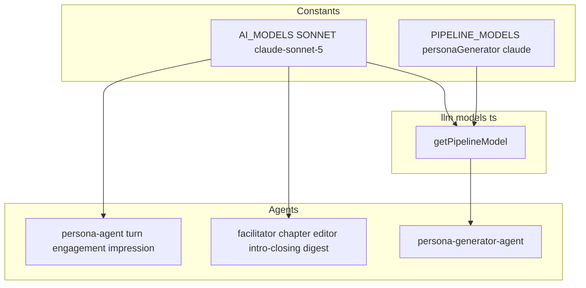
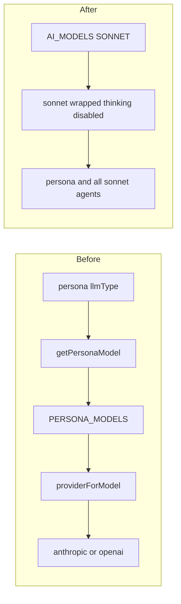
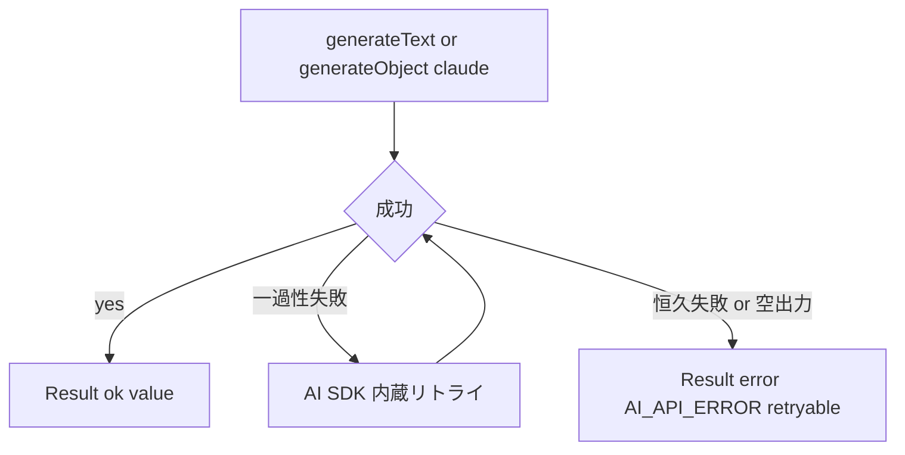
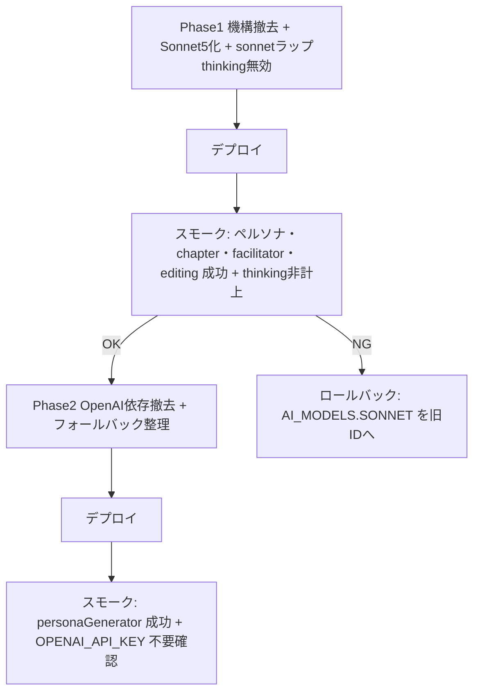

# Technical Design: per-persona-model-selection

## Overview

**Purpose**: 形骸化したペルソナ人格ごとのモデル使い分け機構（`llmType`）を撤去し、全ペルソナ生成を単一の最新 Claude Sonnet（`claude-sonnet-5`）に統一する。あわせてペルソナ生成タスク（`personaGenerator`）を GPT から Claude へ寄せ、ペルソナ関連経路の OpenAI 依存を撤廃し、プロジェクトの Claude Sonnet を最新世代へ更新する。

**Users**: 本変更はエンドユーザー向け機能ではなく、討論生成パイプラインの保守性・障害耐性を高める内部変更である。運用者は「特定ペルソナの所感生成が OpenAI クォータ超過で恒常失敗する」事象から解放される。

**Impact**: `llmType` を軸とした複数プロバイダ分岐（`getPersonaModel` / `providerForModel` / `PERSONA_MODELS` / `buildPersonaSystem` のプロバイダ判定）を撤去し、ペルソナ経路を Claude 単一に単純化する。Sonnet を使う全エージェントのモデルが `claude-sonnet-4-6` → `claude-sonnet-5` に更新される。

### Goals
- ペルソナ生成（発言・所感）を `claude-sonnet-5` に一本化し、ペルソナ単位のモデル分岐を撤去する。
- `personaGenerator` を Claude 化し、ペルソナ関連経路から OpenAI 依存（`@ai-sdk/openai` / `OPENAI_API_KEY`）を撤廃する。
- Claude Sonnet を全利用エージェントで最新世代へ更新する。

### Non-Goals
- `PIPELINE_MODELS` の Gemini 系タスク（fact-check・取材・ステークホルダー分析）のモデル選定変更。
- Opus（`claude-opus-4-8`）の変更（既に最新）。
- 生成プロンプトの内容改善・品質チューニング。
- 新規 LLM プロバイダの追加。

## Boundary Commitments

### This Spec Owns
- ペルソナ人格ごとのモデル使い分け機構（`llmType` 型・フィールド、`PERSONA_MODELS`、`getPersonaModel`、`providerForModel`、`buildPersonaSystem` のプロバイダ分岐）の撤去。
- ペルソナ生成経路（`generatePersonaTurn` / `evaluateEngagement` / `generateImpression`）のモデル解決。
- `PIPELINE_MODELS.personaGenerator` のモデル選定。
- `AI_MODELS.SONNET` 定数の値（Claude Sonnet のバージョン）。
- Claude Sonnet 呼び出しの thinking 既定（4.6 挙動維持＝`thinking: disabled`）を注入する共有ラップモデル。
- ペルソナ関連経路の OpenAI 依存の撤廃範囲。

### Out of Boundary
- `PIPELINE_MODELS` の Gemini 系タスクのモデル選定（現状維持）。
- `AI_MODELS.OPUS` の値。
- 討論生成ロジック・プロンプト内容そのもの。
- フロント管理画面の挙動（`llmType` は UI で未使用のため型削除のみ）。

### Allowed Dependencies
- `@ai-sdk/anthropic`（既存）、`ai`（Vercel AI SDK、既存）。
- `ai.constants.ts` の `AI_MODELS` / `PIPELINE_MODELS`（既存の定数集約点）。
- Firestore 永続ペルソナデータ（読み取り時に余剰 `llmType` を無視する前提）。

### Revalidation Triggers
- `Persona` 型からの `llmType` 削除（型を参照する全コンシューマ）。
- `getPersonaModel` の撤去（モックしているテスト）。
- `OPENAI_API_KEY` シークレット定義の削除（Cloud Functions デプロイ設定）。
- `AI_MODELS.SONNET` の値変更（全 Sonnet 利用エージェントの挙動）。

## Architecture

### Existing Architecture Analysis

Firebase Functions v2 上の AI パイプライン。モデル解決は `functions/src/llm/models.ts` に集約され、定数は `functions/src/constants/ai.constants.ts` が持つ。依存方向は **constants（定数） → llm/models（解決層） → agents（生成層）**。

- `getPersonaModel(llmType)` は `PERSONA_MODELS[llmType]` で実モデル ID を引き、`providerForModel` がプレフィックスで anthropic/openai/google を選ぶ。実体は `gemini`=`claude`=`claude-sonnet-4-6`、`gpt`=`gpt-5.5` の2種に縮退している。
- `getPipelineModel(task)` はタスク単位で独自にプロバイダを選ぶ。`personaGenerator` のみ openai、他は Gemini。
- ペルソナ経路（`persona-agent.ts`）は `persona.llmType ?? 'claude'` を使い、発言経路のみ claude フォールバックを持つ。所感経路はフォールバックを持たず、エラー時はエラー Result を返す。

技術的負債として解消するもの: 形骸化した3値 `llmType`、gpt 経路のクォータ脆弱性、発言経路の冗長な claude→claude フォールバック。

### Architecture Pattern & Boundary Map

**Selected pattern**: 既存のレイヤ構造（constants → llm/models → agents）を維持したまま、ペルソナ用の解決層を撤去して呼び出し側が定数を直接参照する「中間層除去」。



**Architecture Integration**:
- Selected pattern: 中間層除去（`getPersonaModel`/`providerForModel`/`PERSONA_MODELS` を撤去）＋共有 Sonnet ラップモデル導入。ペルソナ経路・全 Sonnet 利用エージェントは、`llm/models.ts` がエクスポートする共有 `sonnet` ラップモデル（`AI_MODELS.SONNET` に thinking 無効を注入）を使う。
- Domain/feature boundaries: モデル定数（constants）が ID の真実源。`llm/models.ts` が「モデル既定オプション込みの解決済みモデル」の真実源。Gemini 解決は `getPipelineModel`／`getGoogleProvider` に集約（保全）。
- Existing patterns preserved: 定数集約（`ai.constants.ts`）、`Result<T,E>` エラー戻り、依存方向 constants→resolver→agents、`getGoogleProvider`（fact-check/取材/interview が使用）。
- New components rationale: 新規は共有 `sonnet` ラップモデル1点のみ。thinking 無効（4.6 挙動維持）を18箇所に散らさず1定義に集約するため（横断的モデル設定の集約であり中央ディスパッチャではない）。
- Steering compliance: `no-emulator`（デプロイ検証）、`type-location`（functions は `types/`）、`no-reexport-shortcuts`（参照側直接書き換え）、`no-over-abstraction`（ラップは横断的設定の集約に限定）。

### Technology Stack

| Layer | Choice / Version | Role in Feature | Notes |
|-------|------------------|-----------------|-------|
| Backend / Services | Firebase Functions v2 (Node.js 24) | AI パイプライン実行 | 既存 |
| AI SDK | `ai` ^6, `@ai-sdk/anthropic` ^3 (3.0.85) | モデル呼び出し | `claude-sonnet-5` は型 union 未掲載だが `(string & {})` で受理 |
| AI SDK 機能 | `wrapLanguageModel` + `defaultSettingsMiddleware`（`ai` ^6）、`providerOptions.anthropic.thinking`（`@ai-sdk/anthropic`） | thinking 無効を共有モデルに注入 | いずれも 3.0.85 / ai ^6 で提供を確認済み |
| AI SDK（撤去） | `@ai-sdk/openai` ^3 | — | ペルソナ経路の OpenAI 撤廃に伴い依存撤去 |
| Data / Storage | Firestore | ペルソナ永続 | `llmType` 余剰フィールドは読み取り時無視（マイグレーション不要） |
| Infrastructure / Runtime | Cloud Functions secrets | `OPENAI_API_KEY` 撤去 | 8ファイルの SECRETS 配列から除去 |

## File Structure Plan

### Modified Files

- `functions/src/types/common.types.ts` — `LLMType` 型を削除。
- `functions/src/types/persona.types.ts` — `Persona` から `llmType` フィールドと `LLMType` import を削除。
- `functions/src/constants/ai.constants.ts` — `AI_MODELS.SONNET` を `claude-sonnet-5` に更新。`PERSONA_MODELS` を削除。`PIPELINE_MODELS.personaGenerator` を `claude-sonnet-5` に更新。
- `functions/src/llm/models.ts` — `getPersonaModel`・`providerForModel`・`PERSONA_MODELS` import を削除。共有 `sonnet` ラップモデル（`wrapLanguageModel`＋`defaultSettingsMiddleware` で thinking 無効を注入）をエクスポート。`getPipelineModel` の `personaGenerator` case を `sonnet` に置換。`@ai-sdk/openai` import と `openai` 利用を削除。**`getGoogleProvider` と Gemini 系 `getPipelineModel` case は保全**（fact-check-runner/fact-research/interview が依存）。
- 全 Sonnet 利用エージェント（`facilitator-agent.ts` / `chapter-agent.ts` / `editor-agent.ts` / `intro-closing-agent.ts` / `debate-digest-agent.ts`）— `anthropic(AI_MODELS.SONNET)` を共有 `sonnet` ラップモデルの使用に置換。
- `functions/src/agents/persona-agent.ts` — `llmType` 参照（243/407/478）を撤去し共有 `sonnet` モデルを使用。`buildPersonaSystem` の `llmType` 引数を撤去し常にキャッシュ経路（Claude 前提）へ。発言経路の claude フォールバック分岐（318-325）を撤去し、空出力・失敗時はエラー Result を返す。
- `functions/src/agents/persona-generator-agent.ts` — 生成スキーマから `llmType: z.enum([...])` を削除。
- `functions/src/index.ts` ほか API 7ファイル（`api/debates.ts` / `api/stakeholders.ts` / `api/interviews.ts` / `api/fact-research.ts` / `api/chapters.ts` / `api/personas.ts` / `api/editing.ts`）— SECRETS 配列から `'OPENAI_API_KEY'` を削除。
- `functions/package.json` — `@ai-sdk/openai` 依存を削除。
- `src/lib/models/persona/persona.types.ts`（フロント）— `llmType?: string` フィールドを削除。
- テスト（約15ファイル）— ペルソナ fixture の `llmType` 除去、`getPersonaModel` モック撤去、`models.test.ts` の gemini/gpt/personaGenerator 分岐テスト更新、`persona-agent.test.ts` の gpt/gemini ペルソナテスト整理。詳細は Testing Strategy 参照。

> 依存方向は不変（constants → llm/models → agents）。ペルソナ経路の import が `getPersonaModel`（解決層）から `anthropic` + `AI_MODELS`（プロバイダ＋定数）へ移るのみ。

## System Flows

### モデル解決フロー（変更前後）



発言・所感とも `persona.llmType` 参照が消え、共有 `sonnet` ラップモデルを使う。プロバイダ分岐が消えるため、別プロバイダのクォータ超過に起因するハード失敗は構造的に発生しない。ラップモデルが thinking 無効を注入するため、Sonnet 5 でも 4.6 と同じく thinking オフで動作する。

### 失敗時挙動（単一プロバイダ化後）



冗長な claude→claude フォールバックは撤去。失敗時は `Result` のエラーとして上位（`buildImpressionPart` 等）へ返す。上位のリトライ/エラー表示ポリシーは既存のまま。

## Requirements Traceability

| Requirement | Summary | Components | Interfaces | Flows |
|-------------|---------|------------|------------|-------|
| 1.1–1.4 | 全ペルソナを claude-sonnet-5 に統一・分岐なし | persona-agent, ai.constants | `generatePersonaTurn`/`generateImpression` | モデル解決フロー |
| 2.1 | `Persona` から `llmType` 削除 | persona.types, common.types | `Persona` 型 | — |
| 2.2 | 使い分け分岐の除去 | models.ts, persona-agent | `getPersonaModel` 撤去 | モデル解決フロー |
| 2.3 | 生成時に `llmType` 付与しない | persona-generator-agent | 生成スキーマ | — |
| 2.4 | re-export で誤魔化さず直接書き換え | 全参照側 | — | — |
| 2.5 | 既存データに `llmType` 残存でもエラーにしない | persona-agent | Firestore 読み取り | — |
| 3.1–3.3 | 別プロバイダ分岐の除去・冗長フォールバック整理・失敗時明示エラー | persona-agent, models.ts | `Result<T,E>` | 失敗時挙動フロー |
| 4.1–4.3 | personaGenerator の Claude 化・OpenAI 依存撤廃 | models.ts, ai.constants, SECRETS 群 | `getPipelineModel` | — |
| 5.1–5.4 | Claude Sonnet を claude-sonnet-5 に最新化・全 Sonnet 利用へ適用・4.6挙動(thinkingオフ)維持 | ai.constants (AI_MODELS.SONNET), llm/models (sonnet ラップ) | 共有 sonnet モデル → 全 Sonnet 利用エージェント | 失敗時挙動フロー |
| 6.1–6.2 | Gemini パイプライン現状維持 | models.ts (`getPipelineModel` Gemini 系) | — | — |

## Components and Interfaces

| Component | Domain/Layer | Intent | Req Coverage | Key Dependencies (P0/P1) | Contracts |
|-----------|--------------|--------|--------------|--------------------------|-----------|
| ai.constants | Constants | モデル ID の真実源を更新 | 1, 4, 5, 6 | — | State |
| llm/models | Resolver | ペルソナ解決層撤去、共有 sonnet ラップ(thinking無効)提供、personaGenerator を Claude 化 | 2, 3, 4, 5, 6 | ai.constants (P0), @ai-sdk/anthropic (P0), ai (P0) | Service |
| Sonnet 利用エージェント群 | Agent | 共有 sonnet モデルへ置換（facilitator/chapter/editor/intro-closing/digest） | 5 | llm/models sonnet (P0) | Service |
| persona-agent | Agent | ペルソナ生成を単一 Claude 化、フォールバック整理 | 1, 2, 3, 5 | llm/models sonnet (P0) | Service |
| persona-generator-agent | Agent | 生成スキーマから llmType 除去 | 2 | getPipelineModel (P0) | Service |
| types (common/persona) | Types | `LLMType`・`llmType` 撤去 | 2 | — | State |
| SECRETS 群 + package.json | Infra | OpenAI 依存撤去 | 4 | — | Batch |

### Constants Layer

#### ai.constants
| Field | Detail |
|-------|--------|
| Intent | モデル ID の集約定数を最新化・整理 |
| Requirements | 1.1, 4.2, 5.1, 5.3 |

**Responsibilities & Constraints**
- `AI_MODELS.SONNET` を `claude-sonnet-5` に更新（全 Sonnet 利用へ波及）。`AI_MODELS.OPUS` は不変。
- `PERSONA_MODELS` を削除（使い分けの真実源を撤去）。
- `PIPELINE_MODELS.personaGenerator` を `claude-sonnet-5` に更新。Gemini 系 `PIPELINE_MODELS` は不変。

**Dependencies**
- Inbound: llm/models, persona-agent, 全 Sonnet 利用エージェント — モデル ID 参照 (P0)
- Outbound: なし

**Contracts**: State

##### State Management
- State model: 静的定数 `AI_MODELS`（OPUS/SONNET）、`PIPELINE_MODELS`（Gemini 系＋personaGenerator）。
- Persistence & consistency: ソース定数のみ。Firestore 非依存。
- Concurrency strategy: 不変（ビルド時定数）。

**Implementation Notes**
- Integration: `PERSONA_MODELS` 削除に伴い `models.ts` の import を除去。
- Validation: `AI_MODELS.SONNET satisfies` 制約は無いが、TS で `as const` を維持。
- Risks: `claude-sonnet-5` の実行時解決（要デプロイ検証）。

### Resolver Layer

#### llm/models
| Field | Detail |
|-------|--------|
| Intent | ペルソナ解決層を撤去し、共有 sonnet ラップ(thinking無効)を提供、personaGenerator を Claude 化 |
| Requirements | 2.2, 3.1, 4.1, 4.2, 5.1, 5.4, 6.1 |

**Responsibilities & Constraints**
- `getPersonaModel`・`providerForModel`・`PERSONA_MODELS` import・`@ai-sdk/openai` import を削除。
- 共有 `sonnet` ラップモデルをエクスポート: `AI_MODELS.SONNET` を `wrapLanguageModel` で包み、`defaultSettingsMiddleware` で `providerOptions.anthropic.thinking = { type: 'disabled' }` を注入（4.6 挙動維持）。
- `getPipelineModel` の `personaGenerator` case を共有 `sonnet` に置換。Gemini 系 case・`getGoogleProvider` は**保全**。
- 撤去後、`models.ts` に openai() 呼び出しが残らないこと。

**Dependencies**
- Inbound: persona-agent・全 Sonnet 利用エージェント — 共有 `sonnet` (P0); persona-generator-agent — `getPipelineModel('personaGenerator')` (P0)
- Outbound: @ai-sdk/anthropic, @ai-sdk/google, ai (`wrapLanguageModel`/`defaultSettingsMiddleware`) — プロバイダ・ミドルウェア (P0)
- External: @ai-sdk/openai — 撤去対象 (P0)

**Contracts**: Service

##### Service Interface
```typescript
// 撤去: export const getPersonaModel = (llmType: LLMType): LanguageModel
// 新規: thinking 無効を注入した共有 Sonnet モデル
export const sonnet: LanguageModel;
// 維持（Gemini 系）・personaGenerator を sonnet へ:
export const getPipelineModel = (task: keyof typeof PIPELINE_MODELS): LanguageModel;
// 維持: Gemini プロバイダ（fact-check/取材/interview が使用）
export const getGoogleProvider = (): ReturnType<typeof createGoogleGenerativeAI> | null;
```
- Preconditions: `ANTHROPIC_API_KEY` 設定済み。`GEMINI_API_KEY` は Gemini 系タスクで必要（既存）。personaGenerator は Claude のため OpenAI キー不要。
- Postconditions: `sonnet` は thinking 無効の `claude-sonnet-5` を返す。personaGenerator は `sonnet` を返す。
- Invariants: Gemini 系タスクの解決・`getGoogleProvider` は不変。

**Implementation Notes**
- Integration: `getPersonaModel` 参照側（`persona-agent.ts`）と `anthropic(AI_MODELS.SONNET)` 参照側（facilitator/chapter/editor/intro-closing/digest）を共有 `sonnet` へ直接書き換え（re-export 互換維持はしない、2.4）。
- Validation: 撤去後 `grep openai(` が 0 件。`sonnet` 経由の呼び出しで thinking トークンが計上されないこと（4.6 挙動）。
- Risks: 撤去漏れ。テストの `getPersonaModel` モック残存。`defaultSettingsMiddleware` の providerOptions がメッセージ側 `cacheControl` と別レイヤで共存すること（要デプロイ確認）。

### Agent Layer

#### persona-agent
| Field | Detail |
|-------|--------|
| Intent | ペルソナ生成を単一 Claude に統一、冗長フォールバックを整理 |
| Requirements | 1.1, 1.2, 1.3, 1.4, 2.2, 2.5, 3.1, 3.2, 3.3 |

**Responsibilities & Constraints**
- `generatePersonaTurn` / `evaluateEngagement` / `generateImpression` の `persona.llmType ?? 'claude'` を撤去し、共有 `sonnet` モデルを使用。
- `buildPersonaSystem` の `llmType` 引数を撤去し、常に cacheControl 付き system（Claude 前提）を返す。
- 発言経路の claude フォールバック分岐（`try/catch` の別モデル再試行、318-325）を撤去。空出力・恒久失敗時は `Result` のエラーを返す（既存の `AI_API_ERROR` 形）。
- 既存永続ペルソナに `llmType` が残っていても、参照しないためエラーにならない（2.5）。

**Dependencies**
- Inbound: debate/editing パイプライン — ペルソナ生成呼び出し (P0)
- Outbound: @ai-sdk/anthropic, ai (`generateText`/`generateObject`), ai.constants (P0)

**Contracts**: Service

##### Service Interface
```typescript
// シグネチャ不変（内部のモデル解決のみ変更）:
export const generatePersonaTurn = (
  persona: Persona, context: TurnContext, engagement: EngagementResult
): Promise<Result<PersonaTurnResult, PipelineError>>;

export const generateImpression = (
  persona: Persona, turns: DebateTurn[], personas?: ReadonlyArray<Persona>
): Promise<Result<ImpressionResult, PipelineError>>;

// 内部ヘルパ: llmType 引数を撤去
// buildPersonaSystem(system: string): SystemModelMessage  // 常に cacheControl 付き
```
- Preconditions: `ANTHROPIC_API_KEY` が設定済み。
- Postconditions: 生成成功で `Result.ok`、恒久失敗で `Result.error(AI_API_ERROR, retryable)`。
- Invariants: 公開関数のシグネチャ・戻り値の形は不変（呼び出し側は変更不要）。

**Implementation Notes**
- Integration: `Persona` 型から `llmType` 削除に追随。`buildPersonaSystem` 呼び出し2箇所（311/415）の引数調整。`getPersonaModel` import を共有 `sonnet` import へ差し替え。
- Validation: 発言・所感の生成テストがモデルモックで通ること。フォールバック撤去後も空出力時にエラー Result を返すこと。
- Risks: cacheControl を常時適用することでのプロンプトキャッシュ挙動（Claude 前提のため従来の claude 経路と同一、実質変化なし）。

#### persona-generator-agent
| Field | Detail |
|-------|--------|
| Intent | 生成スキーマから llmType を除去 |
| Requirements | 2.3, 4.1 |

**Responsibilities & Constraints**
- `personasSchema` から `llmType: z.enum([...])` を削除。生成される `Persona` に `llmType` を含めない。
- モデルは `getPipelineModel('personaGenerator')`（Claude 化済み）を継続使用。

**Dependencies**
- Outbound: getPipelineModel (P0), ai (`generateObject`) (P0)

**Contracts**: Service（シグネチャ不変）

**Implementation Notes**
- Integration: `LLMPersona` 型（`Omit<Persona, ...>`）は `Persona` の `llmType` 削除に自動追随。
- Validation: 生成結果に `llmType` が含まれないこと。personaGenerator が anthropic を呼ぶこと。
- Risks: なし（スキーマ縮小のみ）。

## Data Models

### Logical Data Model
- `Persona`（functions `types/persona.types.ts`）から `llmType: LLMType` を削除。フロント `src/lib/models/persona/persona.types.ts` から `llmType?: string` を削除。
- `LLMType`（`common.types.ts`）型を削除。
- Firestore の既存 `persona` ドキュメントは `llmType` フィールドを保持しうるが、型から消えるため読み取り時に無視される。**マイグレーション不要**（2.5）。書き込み時は `llmType` を含めない。

### Data Contracts & Integration
- ペルソナ生成タスクの出力スキーマ（`personasSchema`）から `llmType` を除去。API 層のリクエスト/レスポンス形は不変。

## Error Handling

### Error Strategy
単一プロバイダ化により、別プロバイダのクォータ超過に起因するハード失敗（本 spec の発端）は構造的に消滅する。失敗は `Result<T, PipelineError>` のエラーとして統一的に上位へ返す。

### Error Categories and Responses
- **System Errors（AI_API_ERROR）**: Claude API の一過性失敗は AI SDK 内蔵リトライで吸収。恒久失敗・空出力は `{ code: 'AI_API_ERROR', retryable: true }` を返し、上位（`buildImpressionPart` → `regenerateImpression` 等）の既存ポリシーに委ねる。
- **撤去する挙動**: 発言経路の「別モデル（claude）へのフォールバック再試行」。単一モデル化で自明に不要。

### Monitoring
- 既存の `console.error`/`console.warn` ログを維持。フォールバック関連の警告ログ（`[llm] fallback to claude ...`）は該当コード撤去に伴い消える。
- デプロイ後、`claude-sonnet-5` での生成成功と、旧 `[llm] provider error` ログが出ないことを確認（下記 Migration/検証）。

## Testing Strategy

### Unit Tests
- `models.test.ts`: `getPersonaModel` の gemini/gpt 分岐テストを削除。`getPipelineModel('personaGenerator')` が共有 `sonnet`（anthropic 系）を返すことへ更新（旧: `openai`）。共有 `sonnet` が thinking 無効の providerOptions を持つことを検証。Gemini 系 case・`getGoogleProvider` が不変であることを維持。
- `persona-agent.test.ts`: gemini/gpt ペルソナのテスト（1218/1232 付近）を撤去または claude 単一前提へ更新。発言経路のフォールバック撤去後、空出力時にエラー Result を返すことを検証。`getPersonaModel` モック（16行目付近）を撤去。
- `persona-generator-agent`: 生成結果に `llmType` を含まないことを検証。
- ペルソナ fixture を持つ全テスト（約15ファイル）: `llmType: 'claude'` 行を除去（型削除に追随）。

### Integration Tests
- `editing-chain.integration.test.ts` / `chapter-agenda.integration.test.ts`: ペルソナ fixture の `llmType` 除去後も既存フローが通ること。
- `debate-cost-reduction.test.ts`: `getPersonaModel` モックを撤去し、モデル解決変更後もコスト削減ロジックのテストが通ること。

### 完了条件
- `npm --prefix functions run build` と `pnpm test:unit`（functions vitest 含む）が全通過。
- `grep -rn "llmType\|getPersonaModel\|PERSONA_MODELS\|openai(" functions/src` が本番コードで 0 件（テスト・コメントを除く）。

## Migration Strategy

steering `no-emulator` によりエミュレータ検証不可のため、本番デプロイでのスモーク検証を段階的に行う（research.md Option C 運用）。



- **Phase 1**: `llmType` 撤去＋`AI_MODELS.SONNET`→`claude-sonnet-5`＋共有 `sonnet` ラップ（thinking 無効）導入。デプロイ後、**ペルソナ生成だけでなく chapter・facilitator・editing の Sonnet 利用経路**が成功し、`usage` に thinking/reasoning トークンが計上されない（4.6 挙動維持）ことを確認。Sonnet 5 実行時解決と thinking 無効を単独変数として切り出す。
- **Rollback trigger**: `claude-sonnet-5` が実行時解決しない／生成失敗、または thinking が意図せず有効 → `AI_MODELS.SONNET` を旧 ID へ戻す。
- **Phase 2**: `personaGenerator` Claude 化＋`@ai-sdk/openai`・`OPENAI_API_KEY` 撤去＋発言フォールバック整理。デプロイ後にペルソナ生成成功と OpenAI 依存不要を確認。
- **Validation checkpoint**: 各フェーズで `verify`（該当フローの実行観察）。

## Supporting References
- 詳細な調査ログ・意思決定の根拠は `research.md` を参照。
- 決定記録: [[project-persona-model-consolidate-claude]]。
