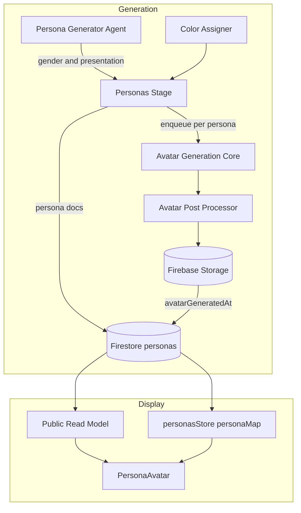
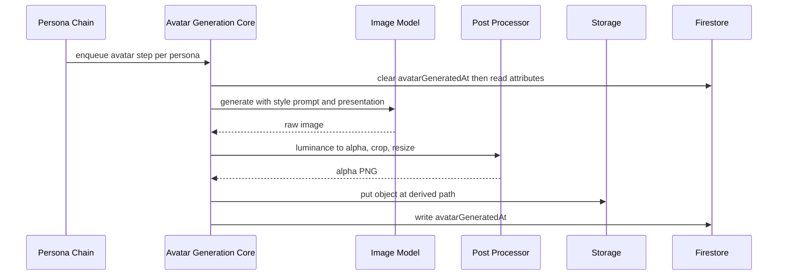
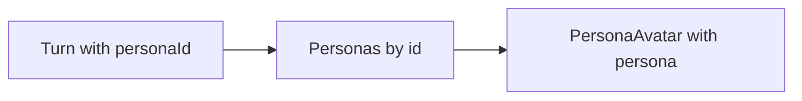
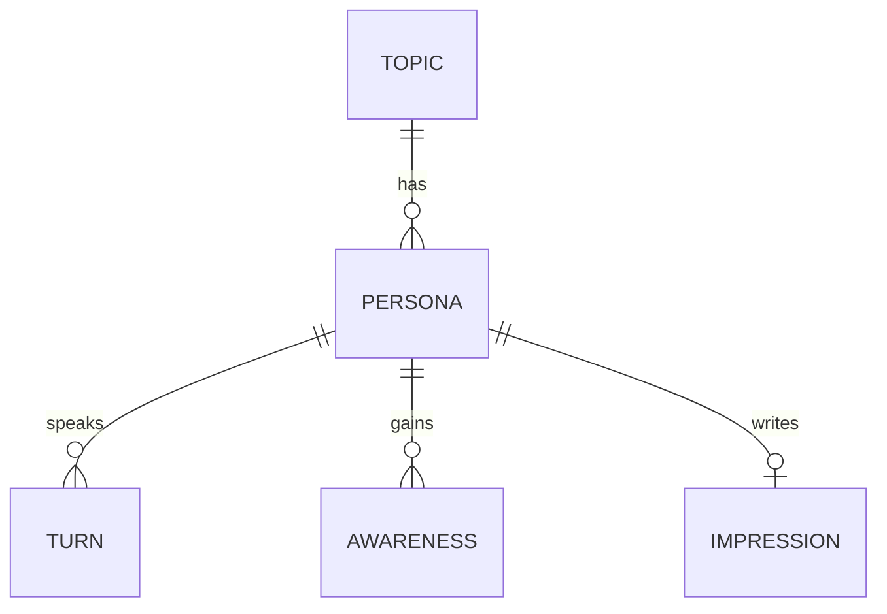
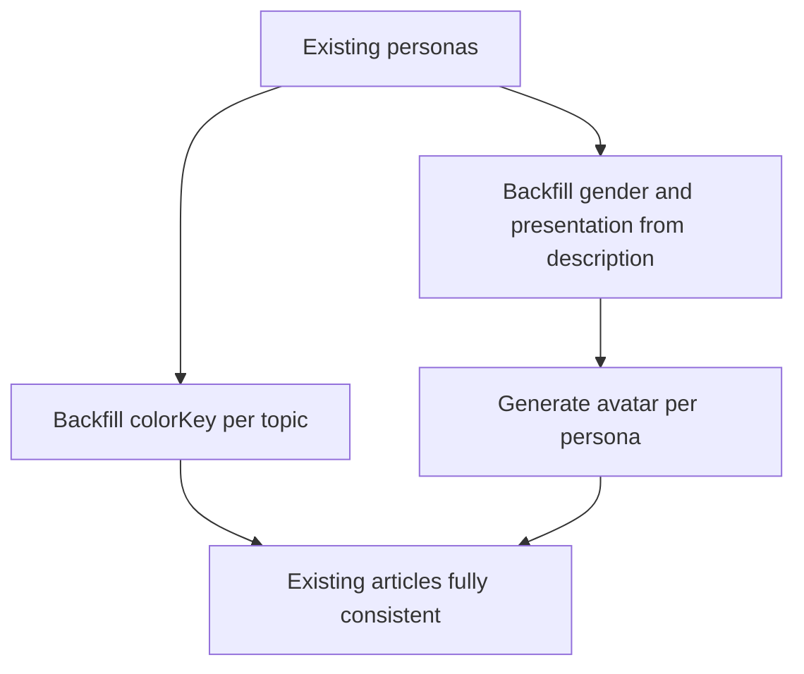

# Technical Design: persona-avatar-generation

## Overview

**Purpose**: 各ペルソナに対し、属性（年齢・外見表現・職業）に基づくアバター画像を AI 生成し、あわせて配色（カラーキー）を自動決定する。これにより閲覧者・管理者が発言者を視覚的に識別できる。

**Users**: 閲覧者は公開記事の発言・気づき・所感で、管理者は管理画面のペルソナ一覧と各発言で、同一のアバターを見る。

**Impact**: ペルソナ生成パイプラインに「配色の決定的割り当て（同期・軽量）」と「アバター画像生成（非同期・per-persona）」を追加する。表示側は既存 `PersonaAvatar` を配線するのみ。あわせて、公開射影が話者情報を要素ごとに焼き込む非正規化を、管理側で既に確立している「ペルソナを id で保持し描画時に解決」パターンへ揃える。

### Goals
- ペルソナ属性からアバター画像を AI 生成し、一度確定して安定的に再利用する。
- 同一トピック内で重複せず色相環上に分散した配色を、決定的に割り当てる。
- 公開・管理の双方で同一の見た目を、単一の共有解決ロジックで表示する。
- 画像生成の失敗・遅延・コストをペルソナ生成の critical path から隔離する。

### Non-Goals
- アバターの視覚スタイル・規範プロンプト・アセット形態の確立（姉妹仕様 persona-avatar-image-generation が所有。本仕様は利用する）。
- `PersonaAvatar` の2色独立着色レンダリング機構そのものの変更（実装済み。本仕様が変えるのは props 契約のみ）。
- 管理画面でのアバター手動上書き UI。
- オフラインのカタログ量産（フォールバック資産としてのみ利用）。

## Boundary Commitments

### This Spec Owns
- ペルソナの性のあり方（`gender` / `genderPresentation`）と外見データ（`colorKey` / `avatarGeneratedAt`）の生成・決定・永続。
- アバター画像生成（呼び出し・後処理・保存・失敗時フォールバック）。
- 配色の決定的割り当て規則（重複回避・色相分散・循環・ファシリテーター既定）。
- 外見の表示解決（カラーキー→濃淡、アバター src、フォールバック）を **`PersonaAvatar` 内に集約**すること。
- 公開読み取りモデルの話者正規化（焼き込み廃止 → ペルソナを id で保持）。

### Out of Boundary
- 規範プロンプト本文・スタイル基準・受け入れチェックリスト（姉妹仕様）。
- 討論生成・取材・編集の各パイプライン挙動。
- `PersonaAvatar` の描画方式（アルファマスクによる2色独立着色）。

### Allowed Dependencies
- 既存 `@ai-sdk/google` と `GEMINI_API_KEY`（fact-check 等で実績あり）。
- Firebase Storage（新規導入）、Firestore、Cloud Tasks 自己連鎖（`enqueuePersonaStep`）。
- 既存カラートークン（[variables.scss](../../../src/lib/assets/styles/variables.scss) の24系統）。
- 既存 `personasStore.personaMap`（管理側の解決基盤）。

### Revalidation Triggers
- `PersonaForFirestore` の追加フィールド（`gender`/`genderPresentation`/`colorKey`/`avatarGeneratedAt`）のシェイプ変更。Storage のパス規則・URL 組み立て方の変更。
- 公開読み取りモデルの話者表現の変更（焼き込み↔id 参照）。
- 画像モデル ID・アセット形態（寸法・アルファ）の変更。
- Storage のパス設計・公開読み取り可否の変更。

## Architecture

### Existing Architecture Analysis

- **ペルソナ生成**は Cloud Task 自己連鎖（`stakeholders` → `personas` → per-persona `interview`）。各段は「停止ゲート（世代照合）→実行＋永続→次段 enqueue」で、中間段は完了確定を書かない（[persona-chain.ts](../../../functions/src/pipeline/personas/persona-chain.ts)）。
- **管理側の話者解決は既に正規化済み**: `personasStore` が `Persona[]` を保持し `personaMap`（id→Persona）を導出、「話者名は畳まず personaId 参照のまま保持し、描画時に解決する」方針が明文化されている（[personas.svelte.ts:39-43](../../../src/lib/stores/personas.svelte.ts#L39-L43)）。
- **公開側だけがこの方針から外れている**: `resolveSpeaker` が `speakerName`/`speakerRole` を毎ターンへ、`personaName` を気づきごとへ焼き込む（[published-article.ts:54-77](../../../src/lib/models/published/published-article/published-article.ts#L54-L77)）。本設計はこれを管理側と同じ「id 参照＋描画時解決」に揃える（技術的負債の解消）。
- **表示部品は準備済み**: `PersonaAvatar` が `src`/`silhouetteColor`/`backgroundColor` を受けアルファマスクで2色独立着色する。唯一の利用箇所が props 未指定。

### Architecture Pattern & Boundary Map

**Selected pattern**: パイプライン（生成）＋プレゼンテーション（`PersonaAvatar` に集約）。両者は**ペルソナドキュメントの外見フィールド**のみで接続する。



**Architecture Integration**:
- **Domain/feature boundaries**: 画像生成は**ペルソナ生成処理の中で呼ぶ per-persona ステップ**として実行する（interview と同じ階層。新しい phase は作らない）。本体は HTTP 非依存の core とし、**チェーンのステップと個別再生成 onCall が同じ core を共有**する（`runInterviewCore` と同型）。軽く決定的な配色はペルソナ永続と同一 batch で確定。表示解決は `PersonaAvatar` の内部に集約し、呼び出し側は見た目の判断を持たない。
- **Existing patterns preserved**: Cloud Task 自己連鎖（interview と同型）、`personaMap` による描画時解決、色はトークン参照でコンポーネントに値を書かない。
- **New components rationale**: 画像生成・後処理・保存はランタイムに存在しない能力のため新規。配色割り当ては既存に該当物が無い純粋ロジック。外見解決は既存 `PersonaAvatar` の内部に足す。
- **Dependency direction**: Types → Constants → Post Processor → Core → Chain（functions側） / Types → Components（FE側。外見解決は PersonaAvatar 内に閉じる）。上位から下位への一方向のみ。
- **Steering compliance**: 型は `.types.ts` に集約、`*ForFirestore` は境界 cast のみ、公開専用型は必要な場合のみ `Published` 接頭辞で新規定義、過度な共通化を避け表示は各画面に素直に配線。

### Technology Stack

| Layer | Choice / Version | Role in Feature | Notes |
|-------|------------------|-----------------|-------|
| Frontend | Svelte 5 runes（既存） | `PersonaAvatar` の props 契約変更＋各表示箇所への配置 | 外見解決はコンポーネント内に閉じる |
| Backend / Services | Firebase Functions v2 + Cloud Tasks（既存） | アバター生成の per-persona 非同期ステージ | `enqueuePersonaStep` に `avatar` ステップ種別を追加 |
| AI | `@ai-sdk/google` / `gemini-3.1-flash-image`（既存依存） | アバター画像生成 | モデル ID は定数として1箇所に集約し差し替え可能に保つ。旧 `gemini-2.5-flash-image` は 2026-10-02 停止予定のため採用しない（`research.md`） |
| Image Processing | `sharp`（新規依存） | 輝度→アルファ・クロップ・256×256 化 | `postprocess.py` の Node 移植 |
| Data / Storage | Firebase Storage（新規）+ Firestore（既存） | 画像実体は Storage、参照 URL と外見フィールドは persona ドキュメント | ドキュメント肥大を避ける |

## File Structure Plan

### Directory Structure
```
functions/src/
├── api/
│   └── avatars.ts                  # 追加: 生成 core（プロンプト組立→モデル呼び出し→保存→永続）＋個別再生成 onCall
├── pipeline/personas/
│   ├── persona-chain.ts            # 変更: avatar ステップの enqueue と dispatch（core を呼ぶ）
│   └── avatar-color.ts             # 追加: 配色の決定的割り当て（純関数・単体テスト対象）
├── avatar/
│   └── avatar-postprocess.ts       # 追加: sharp による後処理（postprocess.py の移植・ゴールデンテスト対象）
└── types/persona.types.ts          # 変更: gender / genderPresentation / colorKey / avatarGeneratedAt

src/lib/
├── models/persona/
│   └── persona.types.ts            # 変更: gender / genderPresentation / colorKey / avatarGeneratedAt（永続形と一致）
└── models/published/published-article/
    ├── published-article.ts        # 変更: 話者焼き込みを廃止し id 参照へ
    └── published-article.types.ts  # 変更: 出力型の話者表現
```

### Modified Files
- `functions/src/agents/persona-generator-agent.ts` — 出力スキーマとプロンプトに `gender` と `genderPresentation` を追加（原則一致、乖離は背景が要する場合のみ）。
- `functions/src/pipeline/personas/enqueue-persona-step.ts` — `stepKind` に `avatar` を追加。
- `functions/src/index.ts` — 個別再生成 onCall（`regenerateAvatar`）を export（`runInterview` と同列）。
- `src/lib/stores/personas.svelte.ts` — 個別再生成メソッドを追加（`reinterview` と同型。開始時に旧 `avatarGeneratedAt` を即時クリア）。
- `src/lib/sharedComponents/PersonaAvatar.svelte` — props を `persona` 1つに変更し、`colorKey` → 濃淡、`avatarGeneratedAt` → 画像 URL の組み立て、不在時フォールバックを内部で解決。
- `src/lib/features/public/article-detail/PublishedTurnItem.svelte` / `PublishedAwarenessDialog.svelte` / `PublishedImpressionItem.svelte` — 話者 id からペルソナを引き `<PersonaAvatar {persona} />` を置く。
- `src/lib/features/admin/topic-detail/debate/DebateTurnItem.svelte` / `persona/PersonaItem.svelte` — `personaMap` から引いたペルソナで `<PersonaAvatar {persona} />` を置く。

## System Flows

### アバター生成（per-persona）



- この処理は終端であり次段を enqueue しない。**phase 完了を gate しない**。アバターは識別のための機能要素だが、1件の生成失敗で討論生成全体を止めるのは不均衡であり、かつ配色によって識別性の最低線は保たれるため（下記 Error Handling）。
- 生成が失敗した場合は `avatarGeneratedAt` を未設定のまま完了させ、表示側の既定アバターにフォールバックする（Req 2.4, 6.1）。

### 表示解決（公開・管理で共通）



- 公開・管理とも「ペルソナを id で保持し、発言・気づき・所感は id を参照、描画時に解決」で統一する。解決ロジックは単一実装を共用し、サーフェス別に分岐させない。

## 実装順序

本 spec は2段で実装する。**公開射影の正規化を先に完了させてから、外見（アバター・配色）の実装に入る。**

**第1段: 公開読み取りモデルの speakerId 正規化**
- 発言・気づき・所感が話者を `personaId` で参照し、ペルソナは記事あたり1回だけ id キーで提供する形に作り替える（管理側の `personaMap` と同じ形）。
- **既存表示（話者名・肩書・気づき）に回帰が無いこと**を確認して締める。この段では新機能を足さない。
- **なぜ先か**: 先に外見フィールドを現行の焼き込み形へ足すと、正規化時に必ず剥がすことになり二度手間になる。捨てる形の上に新機能を積まない。また、既存の公開表示を触る変更を単独で行うことで、回帰が出た場合の原因を切り分けられる。

**第2段: 外見の生成と表示**
- `gender` / `genderPresentation` / `colorKey` / `avatarGeneratedAt` の生成・永続と、`PersonaAvatar` への配線。
- 第1段が済んでいれば各表示箇所は既に id からペルソナを解決しているため、この段は**ペルソナにフィールドを足し `<PersonaAvatar {persona} />` を置くだけ**で届く。

## Requirements Traceability

| Requirement | Summary | Components | Interfaces | Flows |
|-------------|---------|------------|------------|-------|
| 1.1, 1.2 | 性自認・外見表現の付与（多様性許容） | Persona Generator Agent | 生成スキーマ | 生成 |
| 1.3, 1.4 | 属性を生成入力に、決定的 | Avatar Generation Core | 生成入力 | アバター生成 |
| 2.1 | 属性からの AI 生成 | Avatar Generation Core, Avatar Post Processor | Service | アバター生成 |
| 2.2 | 保持し都度再生成しない | Avatar Generation Core, Persona doc | Batch/State | アバター生成 |
| 2.3 | 明示再生成で旧を即時クリア | Avatar Generation Core | API/Batch | アバター生成 |
| 2.4 | 生成失敗でも全体を失敗させない | Avatar Generation Core, PersonaAvatar | Batch/State | アバター生成 |
| 3.1–3.4 | 配色の割り当て・重複回避・色相分散・循環 | Avatar Color Assigner | Service | 生成 |
| 3.5 | ファシリテーター既定色 | PersonaAvatar | State | 表示解決 |
| 4.1–4.3 | 決定性・安定性 | Avatar Color Assigner, Persona doc | Service/State | 生成 |
| 5.1, 5.2 | 発言/気づき/所感に反映・公開管理一致 | PersonaAvatar, 表示各所 | State | 表示解決 |
| 5.3 | 話者情報を重複させない | Public Read Model, personasStore | State | 表示解決 |
| 5.4, 6.1 | フォールバック・見た目の保証 | PersonaAvatar | State | 表示解決 |

## Components and Interfaces

| Component | Domain/Layer | Intent | Req Coverage | Key Dependencies (P0/P1) | Contracts |
|-----------|--------------|--------|--------------|--------------------------|-----------|
| Persona Generator Agent | Functions/Agent | 生成物に `gender` と `genderPresentation` を含める | 1.1, 1.2 | 既存 LLM (P0) | Service |
| Avatar Color Assigner | Functions/Domain | 配色を決定的に割り当てる純関数 | 3.1–3.4, 4.1–4.2 | — | Service |
| Avatar Generation Core | Functions/Pipeline | per-persona のアバター生成を実行し永続（チェーンと onCall が共有） | 1.3, 1.4, 2.1–2.4 | Post Processor (P0), Gemini (P0), Storage (P0) | Service/API/Batch |
| Avatar Post Processor | Functions/Adapter | 規定アセット形態へ変換 | 2.1 | `sharp` (P0) | Service |
| Public Read Model | Frontend/Model | 話者を id 参照で提供 | 5.3 | Firestore (P0) | State |
| PersonaAvatar | Frontend/UI | `persona` を受け外見を解決して描画（公開・管理共用） | 3.5, 5.1, 5.2, 5.4, 6.1 | Color Tokens (P1) | State |

### Functions

#### Avatar Color Assigner

| Field | Detail |
|-------|--------|
| Intent | トピックのペルソナ集合に対し、重複せず色相環上に分散した配色を決定的に割り当てる |
| Requirements | 3.1, 3.2, 3.3, 3.4, 4.1, 4.2 |

**Responsibilities & Constraints**
- 24系統（色相環順）から、ペルソナ数に応じた間隔で選び重複させない。24を超える分は再利用する。
- 入力はペルソナの安定順序（`sortOrder`）のみに依存する純関数。乱数・配列 index の実行時位置に依存しない。
- 割り当ては**ペルソナ永続時に1回だけ**行い、以後再計算しない（並べ替え・追加で既存が変わらない）。

**Dependencies**: External: カラーパレット系統名の定数（P1）

**Contracts**: Service [x]

##### Service Interface
```typescript
type PersonaColorKey = string; // パレット系統名（例: 'ruby'）

interface AvatarColorAssigner {
  assignAll(personaCount: number): readonly PersonaColorKey[];
}
```
- Preconditions: `personaCount >= 1`。
- Postconditions: 返る配列長は `personaCount`。24系統を人数で割った間隔で拾うため、24人以下なら全員が相異なり色相環上で概ね等間隔になる。24人を超える分は再利用する。同一入力から常に同一出力（乱数を使わない）。
- Invariants: 出力は定義済み系統名の集合に含まれる。

**Implementation Notes**
- Integration: `runPersonasStage` の batch 書き込み時に `sortOrder` 順で適用する。ペルソナは一括生成のみで個別追加の経路が無いため、必要なのはこの一括割り当てだけ。将来ペルソナを個別に追加する経路ができた場合は、既存の割り当てを動かさず、色相環上で空きが最も広い場所に入れる。
- **アバターの個別再生成では `colorKey` を再割り当てしない**（再生成対象は画像のみ。配色は Req 4.2 により不変）。
- Validation: N=1..30 で重複有無・分散・決定性を単体テスト。
- Risks: 低（純関数）。

#### Avatar Generation Core（＋チェーンステップ／個別再生成 onCall）

| Field | Detail |
|-------|--------|
| Intent | 1ペルソナ分のアバター画像を生成・後処理・保存し、参照を永続する。**ペルソナ生成処理の中のステップと、個別再生成の onCall が同じ core を共有する** |
| Requirements | 1.3, 1.4, 2.1, 2.2, 2.3, 2.4 |

**Responsibilities & Constraints**
- **本体は HTTP 非依存の core**（`runInterviewCore` と同型）。呼び出し口は2つ:
  1. **ペルソナ生成チェーンの `avatar` ステップ** — `runPersonasStage` 後に per-persona で enqueue（interview と同階層。**新しい phase は作らない**）。
  2. **個別再生成の onCall** — 1ペルソナだけやり直す（interview の再取材と同じ操作性）。
- ペルソナ属性（年齢・**外見表現**`genderPresentation`・職業）から生成入力を構成し、姉妹仕様の規範スタイルを常に含める。性自認 `gender` は見た目の情報ではないため画像生成に渡さない。
- 生成→後処理→保存→`avatarGeneratedAt` 永続を1呼び出しで完結させる。チェーン経路では終端ステップで、次段を enqueue しない。
- **開始時点で既存 `avatarGeneratedAt` を即時クリア**してから生成する（Req 2.3。処理中であることが UI から見える）。
- 失敗時は例外をチェーン全体へ波及させず、`avatarGeneratedAt` 未設定のまま終了する（Req 2.4）。

**Dependencies**
- Inbound: Persona Chain（`avatar` ステップ）／管理画面（個別再生成）（P0）
- Outbound: Avatar Post Processor（P0）、画像モデル・Storage（P0、core に直書き）、Firestore（P0）

**Contracts**: Service [x] / API [x] / Batch [x]

##### Service Interface（共有 core）
```typescript
interface AvatarGenerationCore {
  run(topicId: string, personaId: string): Promise<void>;
}
```
- Preconditions: 対象ペルソナが存在する。
- Postconditions: 成功時 `avatarGeneratedAt` が更新される。失敗時は未設定のまま終了し例外を投げない。
- Invariants: 呼び出し元（チェーン／onCall）によって挙動が変わらない。

##### API Contract（個別再生成）
| Method | Endpoint | Request | Response | Errors |
|--------|----------|---------|----------|--------|
| onCall | `regenerateAvatar` | `{ topicId, personaId }` | `void` | invalid-argument, unauthenticated |

##### Batch / Job Contract（チェーン経路）
- **Trigger**: `stepKind: 'avatar'` の Cloud Task（`topicId` + `personaId`）。
- **Input / validation**: 世代照合（`runId`）が有効であること。無効なら何もせず終了。
- **Output / destination**: Storage 上の画像オブジェクト（固定パス）と、persona ドキュメントの `avatarGeneratedAt`。
- **Idempotency & recovery**: 同一ペルソナへの再実行は同一パスへ上書き。途中失敗は `avatarGeneratedAt` 未設定として観測でき、**個別再生成で回復できる**。

**Implementation Notes**
- Integration: `advancePersonaChain` に `avatar` 分岐を追加し、`runPersonasStage` 後に interview と並列で enqueue。onCall は `functions/src/api/avatars.ts` に置き（`api/interviews.ts` と同型）`index.ts` から export。FE は `personasStore` に再生成メソッドを追加（`reinterview` と同型）。
- Validation: 生成物が規定寸法・アルファを満たすかを後処理側で検査し、満たさなければ失敗扱い（フォールバック）。
- Risks: 生成品質の非決定性が最大リスク（`research.md`）。規範プロンプト固定と参照画像アンカーで抑制し、逸脱時はフォールバックへ倒す。**個別再生成があるため、品質不良は運用でやり直せる**（自動検出の不足を人手で補える）。

#### Avatar Post Processor

**Contracts**: Service [x]

```typescript
interface AvatarPostProcessor {
  toAsset(raw: Uint8Array): Promise<Uint8Array>; // 256x256 アルファPNG（RGB=黒）
}
```
- Preconditions: 白背景・黒基調の生成画像。
- Postconditions: 決定的（同一入力→同一出力）。
- Invariants: `postprocess.py` と出力が一致する（ゴールデンテストで担保）。

**Implementation Notes**
- Integration: 画像モデル呼び出しと Storage 保存は `avatars.ts` の core に直接書く（各数行・単一利用箇所のため独立させない）。モデルは `gemini-3.1-flash-image` を使い、ID は定数として1箇所に集約して差し替え可能に保つ。呼び出し形は `scripts/avatar-generation/gemini-image-client.ts`（`responseModalities` 指定・参照画像添付）を踏襲。
- **移植の等価性が要件**: `postprocess.py` を**リファレンス仕様**として残し、その定数・手順（`SHADOW_CUTOFF=36` の影カット、輝度反転→アルファ、bbox クロップ、`SUBJECT_HEIGHT_RATIO=0.92` の縦占有と**下端接地**、256×256、RGB=黒でアルファのみ保持）を厳密に再現する。ここがずれると全アバターの見た目が変わるため、目視でなく出力比較で担保する。

### Frontend

#### PersonaAvatar（変更）

| Field | Detail |
|-------|--------|
| Intent | `persona` を受け取り、その `colorKey` と画像 URL からアバターを描画する。**全表示箇所が使う唯一の部品** |
| Requirements | 3.5, 5.1, 5.2, 5.4, 6.1 |

**Responsibilities & Constraints**
- **props は `persona` 1つ**。呼び出し側は `<PersonaAvatar {persona} />` と書くだけで、色や画像 URL を組み立てない。
- `colorKey` を濃淡へ解決する（シルエット＝濃、背景＝淡透過）。**この対応表がデザイン調整点**であり、ペルソナデータを変えずにここだけで変更できる。
- `persona` が無い（ファシリテーター等、話者をペルソナに解決できない）場合は無彩色の既定で描画し、パレット系統を消費しない。
- `avatarGeneratedAt` 欠落時は既定アバター、`colorKey` 欠落時は既定色へフォールバックし、常に有効な見た目になる。
- **公開・管理で同一のこの部品を使う**（サーフェス別の分岐・別実装を持たない）。
- 2色独立着色のレンダリング機構（アルファマスク＋単色塗り）は既存のまま。変わるのは props 契約のみ。

**Dependencies**
- Inbound: 公開の表示各所、管理の表示各所（P0）
- Outbound: カラートークン（P1）

**Contracts**: State [x]

##### State Management
```typescript
// 表示に必要な最小形。管理の Persona も公開読み取りモデルのペルソナも構造的に満たすため、
// どちらのサーフェスも自分の型のまま渡せる（Admin 型への依存を作らない）。
interface PersonaAvatarProps {
  persona: { id: string; topicId: string; colorKey?: string; avatarGeneratedAt?: Date } | null | undefined;
}
```
- Preconditions: なし（`null` / `undefined` を許容し既定へ倒す）。
- Postconditions: いかなる入力でも有効な画像と2色が描画される。
- Invariants: 同一の `persona` からは常に同一の見た目。

**Implementation Notes**
- Integration: 公開は読み取りモデルのペルソナ集合から、管理は `personasStore.personaMap` から、いずれも `personaId` で引いた `persona` をそのまま渡す。
- Validation: `colorKey` 有/無、`avatarGeneratedAt` 有/無、`persona` 不在（ファシリテーター）の各ケースを単体テスト。
- Risks: 低。既存の唯一の呼び出し箇所は props 未指定のため、props 契約変更の影響は限定的。

#### Public Read Model（変更）

| Field | Detail |
|-------|--------|
| Intent | 話者情報の焼き込みを廃し、ペルソナを id で引ける形で提供する |
| Requirements | 5.2, 5.3 |

**Responsibilities & Constraints**
- 発言・気づき・所感は話者を `personaId`（ファシリテーターは不在を表す値）で参照する。名前・肩書・外見を各要素へ複製しない。
- ペルソナは記事あたり1回だけ id キーで提供する。管理側 `personaMap` と同じ「id で保持し描画時に解決」を公開でも成立させる。
- 読み取り境界では既存の Admin 永続型を cast して参照し、公開専用型は必要な場合にのみ `Published` 接頭辞で定義する。

**Contracts**: State [x]

**Implementation Notes**
- Integration: `resolveSpeaker` による毎ターンの焼き込みを廃止。消費側（発言・気づき・所感の各コンポーネント）は id から解決する形へ更新する。
- Validation: 既存の公開表示テストで、話者名・肩書・気づきの表示が回帰していないことを確認。
- Risks: 既存出力型と4消費コンポーネントに波及する。**実装順序の第1段として単独で実施し**、既存表示の回帰が無いことを確認してから外見の実装へ進む（上記「実装順序」）。

## Data Models

### Domain Model
ペルソナは自身の**外見**（外見表現・配色・アバター画像参照）と**性自認**を所有する。外見はペルソナ集約の一部であり、発言・気づき・所感は外見を複製せずペルソナを参照する。

### Logical Data Model



- `PERSONA` が外見（`gender` / `colorKey` / `avatarGeneratedAt`）の唯一の真実。`TURN` / `AWARENESS` / `IMPRESSION` は `personaId` で参照するのみ。
- 参照整合: `personaId` が解決できない発言はファシリテーター表示として扱う（既存規則を踏襲）。

### Physical Data Model（Document Store）

`topics/{topicId}/personas/{personaId}` に以下を追加する（永続形とアプリ形を一致させる）。

| Field | Type | 必須 | 説明 |
|-------|------|------|------|
| `gender` | `'male'`（男性）/ `'female'`（女性）/ `'non-binary'`（どちらでもない） | 必須 | 性自認（その人が誰か）。既存ペルソナにはバックフィルする（Migration Strategy）。詳細は「性自認と外見表現」 |
| `genderPresentation` | `'masculine'`（男性的）/ `'feminine'`（女性的）/ `'androgynous'`（中性的） | 必須 | 外見表現（どう見えるか）。**アバター生成が使うのはこちら**。既存ペルソナにはバックフィルする |
| `colorKey` | `string` | 必須 | パレット系統名のみ。濃淡は持たない。既存ペルソナにはバックフィルする |
| `avatarGeneratedAt` | `Timestamp`（アプリ形は `Date`） | 任意 | 画像の生成時刻。**存在フラグ兼キャッシュバスター**（下記「画像の保存と URL」）。未設定は生成前/失敗を意味しフォールバック表示 |

#### 性自認と外見表現（2軸）

性のあり方は**性自認**と**外見表現**という消費者の異なる2つのデータであり、1フィールドに畳まない（Req 1.1, 1.2）。

```typescript
// 性自認: その人が誰か
type PersonaGender =
  | 'male'         // 男性
  | 'female'       // 女性
  | 'non-binary';  // 男性・女性のいずれにも当てはまらない

// 外見表現: どう見えるか（アバター生成が使うのはこちら）
type PersonaGenderPresentation =
  | 'masculine'    // 男性的
  | 'feminine'     // 女性的
  | 'androgynous'; // 中性的（男女どちらとも判別しにくい外見）
```

**なぜ分けるか**: 両者は一致しないことがある。例えば「男性の格好をしているが性自認は女性」は `gender: 'female'` / `genderPresentation: 'masculine'`。これを1フィールドに畳むと、カミングアウト前の人などを実際とは異なる姿で描いてしまう。マイノリティの声を正確に扱う本プロダクトの価値に照らして許容できない。

- **アバター生成入力に使うのは `genderPresentation` のみ**。`gender` は見た目の情報ではないため画像生成に渡さない。逆に討論の発言・信念・背景に効くのは `gender` 側。
- **原則は一致させる**（`female` → `feminine`）。乖離させるのは、そのペルソナの背景がそれを必要とする場合のみ（ペルソナ生成時に判断する）。
- **トランスジェンダーを別値にしない**。トランス女性は `gender: 'female'`（性自認がそのまま値）。「トランスであること」は性自認ではなく経験・来歴なので、討論上意味がある場合にのみ `background` へ自然文で記す（常時保持するデモグラ属性にしない）。
- **`non-binary`（どちらでもない）と `androgynous`（中性的）を明示的に持つ**ことで二元強制を回避する（Req 1.2）。「その他」のような catch-all は周縁化する表現になるため用いない。
- **いずれも列挙にすることで生成入力が決定的**になる（Req 1.4）。自由記述はモデルの表現ブレを招き、再現性を損なう。
- **性的指向はどちらにも含めない**（別軸であり、アバター生成にも不要）。必要な場合は `background` / `interests` に自然文で持たせる。

#### 画像の保存と URL

- **パスは導出できるので保存しない**: `topics/{topicId}/avatars/{personaId}`。ペルソナは `id` と `topicId` を持つため、パスは常に導出できる。保存するのは**生成済みか**の情報だけでよい。
- **ダウンロード URL を保存しない**: `getDownloadURL()` が返すトークン付き URL は、(1) **セキュリティルールを迂回する**（ルールが制御するのは URL の取得可否だけで、生成された URL は誰でも使える）、(2) **上書きでトークンが変わりうる**ため、個別再生成を持つ本設計では保存済み URL が壊れる。したがって採用しない（`research.md`）。
- **`avatarGeneratedAt` が2役を担う**:
  1. **存在フラグ** — 未設定なら未生成／失敗 → フォールバック表示。
  2. **キャッシュバスター** — 再生成しても**パスは同一**のため、ブラウザ・CDN が古い画像を返す。URL に `?v={avatarGeneratedAt}` を付けて回避する。
- **URL の組み立て**: パスとキャッシュバスターから決定的に組み立てる（トークン取得の非同期呼び出しが不要で SSR でもそのまま使える）。組み立ては `PersonaAvatar` 内で行い、呼び出し側は関与しない。
- **Storage ルール**: アバターのパスは**読み取りを公開**、書き込みはサーバ（Admin SDK）のみ。アセットは顔の無いシルエットで名前も発言も含まないため、`published` による門は設けない。門を設けると画像1リクエストごとにルール評価で Firestore read が発生し、公開ページの表示コストに直接効く（`research.md`）。

## Migration Strategy

既存の公開済みトピック（既にペルソナと討論が生成済み）を生かすため、追加フィールドを既存ペルソナへバックフィルする。**移行後は全ペルソナが新規生成分と同じ状態になる**ため、永続型はいずれも必須で定義する。



**`colorKey`: トピック単位で決定的に付与**
- 既存ペルソナを `sortOrder` 順に取り `assignAll` を適用する。AI 不要・コスト無し。
- `colorKey` 未設定のペルソナにのみ付与するため、再実行しても既存の割り当てを変えない（冪等）。

**`gender` / `genderPresentation`: 既存の人物記述から確定する**
- 既存ペルソナは名前・職業・`background` の記述時点ですでに性別を含意しており、**推測ではなくそこに書かれているものを明示化する**作業になる。
- 既存トピックには性自認と外見表現が乖離する事情のあるペルソナが無いため、**両者は一致させる**（`male`→`masculine`、`female`→`feminine`）。
- 記述から判別できないペルソナが出た場合は、機械的に決めず**管理画面で個別に設定**する。判別できないものを推測で埋めない、という原則は維持する（この原則の背景は「性自認と外見表現」節）。

**画像: 既存ペルソナにも生成する**
- `genderPresentation` が揃うため、既存ペルソナも新規と同じ経路（per-persona のアバター生成）で画像を生成できる。既存記事も新規と同じ見た目の水準に揃う。
- 生成は per-persona で独立しているため、トピック単位・ペルソナ単位で段階的に流せる。失敗分は個別再生成で回収する。
- コストは 1枚あたり約 $0.039（`research.md`）。既存ペルソナ総数 × 単価で見積もる。

**実行後の確認**
- 既存記事で各ペルソナが固有色とアバターを持ち、話者を判別できること。
- 判別できず未設定のまま残ったペルソナが無いこと（残った場合は管理画面で設定して個別再生成）。

## Error Handling

### Error Strategy
アバターは**装飾ではなく、長い討論記事で誰の発言かを一目で判別するための機能要素**である。したがって欠落は「許容される状態」ではなく「回収すべき欠陥」として扱う。

一方で、1件の生成失敗で討論生成全体を止めるのは不均衡である。この二つを両立させるため、識別性を**配色と画像の二層**で担保する。

- **第1層（決して欠けない）: 配色**。`colorKey` は純関数で生成時に確定し、外部依存も失敗経路も持たない。したがって画像が無くても**各ペルソナは異なる色で描かれ、判別性の最低線は常に成立する**。ここが本設計の要である。既存ペルソナにもバックフィルで付与し、この前提を全記事で成立させる（Migration Strategy）。
- **第2層（失敗しうる）: アバター画像**。失敗時は既定シルエットになる。既定シルエットは全員共通なので、**画像だけでは判別できなくなる**。これを配色が補う。

この構造により、画像生成の失敗はパイプラインを止めずに済むが、**放置してよいことにはならない**。失敗は握りつぶさず記録し、管理画面で欠落を可視化して、個別再生成（`regenerateAvatar`）で回収する。一時的な API 失敗はステップ内で数回リトライしてから欠落として残す。

### Error Categories and Responses
- **画像生成失敗（API エラー・画像未返却）**: ステップ内で数回リトライ。なお失敗する場合は当該ペルソナの `avatarGeneratedAt` を未設定のまま終了し、ペルソナ id とともにログへ記録する。**欠落は管理画面で可視化し、個別再生成で回収する**（Req 2.4）。
- **後処理不成立（寸法・アルファ不良）**: 資産化せず失敗扱い。同上のフォールバック。
- **保存失敗**: `avatarGeneratedAt` を書かない。画像実体が残っても次回上書きされ、表示はフォールバックのままになる。
- **表示時の欠落（`avatarGeneratedAt`/`colorKey` 無し・話者未解決）**: 既定アバター・既定色・ファシリテーター既定へ縮退（Req 5.4, 6.1）。
- **世代不一致（旧 runId のタスク）**: 何もせず終了（既存チェーンの停止ゲートを踏襲）。

### Monitoring
生成失敗はペルソナ id とともにログへ記録し、トピック単位で失敗率を確認できるようにする。**管理画面ではアバター未生成のペルソナを判別できるようにし**、運用者が個別再生成で回収できる状態を保つ（欠落を検知できないまま公開されることを防ぐ）。

## Testing Strategy

### Unit Tests
- 配色割り当て: N=1..30 での重複無し・色相分散・決定性・24超の循環。
- 外見解決: `colorKey` 有無 / `avatarGeneratedAt` 有無 / ファシリテーターの各フォールバック。URL にキャッシュバスターが載ること。
- 後処理（**等価性ゴールデンテスト**）: `scripts/avatar-generation/candidates/` の既存候補 PNG を入力に、`postprocess.py` と TS 移植版の出力をピクセル比較して一致を確認する。加えて規定寸法・アルファ・下端接地・決定性（同一入力→同一出力）を確認。
- 生成入力構成: 属性（年齢・外見表現・職業）が入力へ反映され、性自認が画像生成入力に混入しないこと。

### Integration Tests
- アバター生成: 成功で `avatarGeneratedAt` が永続される。
- アバター生成: 失敗で `avatarGeneratedAt` が未設定のまま終了し、例外がチェーンへ波及しない。
- ペルソナ生成: `gender` と `colorKey` が全ペルソナへ永続される。
- 再生成: 開始時に旧 `avatarGeneratedAt` がクリアされ、完了後は新しい値でキャッシュが更新される。

### E2E/UI Tests
- 公開記事: 各発言・気づき・所感に話者のアバターと配色が表示される。
- 管理画面: ペルソナ一覧と各発言に、公開と同一のアバターが表示される。
- 外見未生成のペルソナが既定アバターで表示される。

## Security Considerations
- Storage のアバターは**読み取りを公開**する。配置パスには推測されて困る情報を含めない（`topicId`/`personaId` のみ）。書き込みはサーバ（Admin SDK）に限定する。
- 未公開トピックのアバターも URL を知れば取得できるが、アセットは顔の無いシルエットで名前・発言・立場を一切含まないため、実質的な情報漏洩にならない。守るべき情報（誰が何を言ったか）は Firestore 側の公開判定で守られたままである。
- 外部へ送るのは生成プロンプトと参照用スタイル画像のみで、個人情報は含めない。
- 生成画像には提供元の不可視透かしが入りうるが、内部用途のため実害はない。

## Performance & Scalability
- 画像生成は概ね **$0.039/枚**、1トピック N ペルソナで数十円規模（`research.md`）。
- per-persona の非同期ステージにより、生成の遅延はペルソナ生成の完了判定・討論開始をブロックしない。
- 画像は生成時に1回のみ作成し、表示のたびに再生成しない（Req 2.2）。
