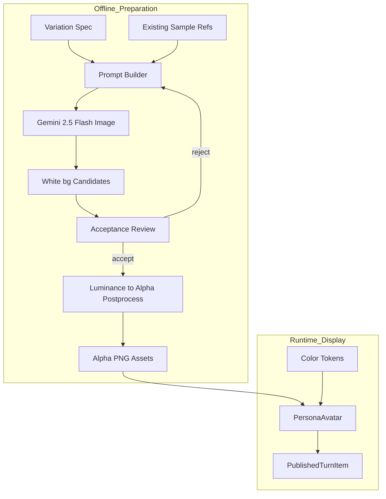
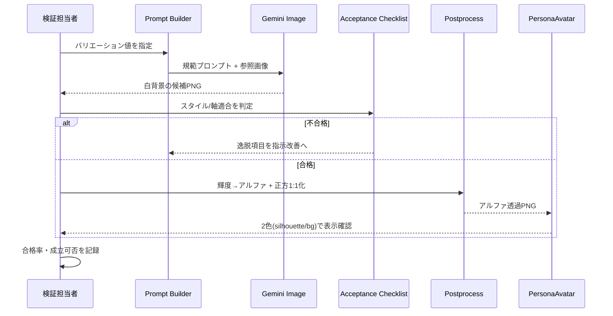

# Technical Design

## Overview

**Purpose**: ペルソナ用アバターを、既存サンプル（顔なし・黒基調・バストアップのシルエット）と同じスタイルで、AI 生成により事前準備できるかを検証する。本スペックの主目的は量産ではなく**実現可能性の確認（フィジビリティ）**であり、あわせて「背景色とシルエット色を独立指定できるアセット形態」を成立させる。

**Users**: 管理者／運用者が事前に用意したアバター資産を、公開記事の発言表示（[PersonaAvatar.svelte](src/lib/sharedComponents/PersonaAvatar.svelte)）で利用する。閲覧者はテーマに応じた2色でシルエットを見る。

**Impact**: 現状は単一画像をハードコードし、`mix-blend-mode: multiply` で着色しているため背景色とシルエット色が独立しない。本設計は「アルファ透過PNGを正規アセットとし、表示を2色独立着色に作り替える」ことと、「Gemini でスタイル／バリエーションを指示生成し後処理で資産化する検証手順」を定義する。

### Goals
- 既存サンプル相当のスタイルを Gemini への指示（規範プロンプト＋参照画像）で再現できるかを、複数バリエーションで実証する。
- バリエーション軸（年齢帯・性別・髪型・アングル・ポーズ・服装・メガネ）を**指示で出し分け**られること、その再現性（合格率）を記録する。
- 背景色・シルエット色を**独立に**指定できるアセット形態（アルファ透過PNG）と表示方式を確立する。
- 量産に進むかの Go/No-Go 判断材料（合格率・後処理成立・残作業）を提示する。

### Non-Goals
- 全バリエーション・マトリクスの量産（本スペックは代表組合せの検証まで）。
- 討論実行時などのランタイム動的生成。
- ペルソナ個別への画像割り当て・選択ロジック。
- 画像配信・キャッシュ・CDN 最適化。

## Boundary Commitments

> **本スペックの着地物**: (1) 2色独立着色に対応した `PersonaAvatar`、(2) スタイル/軸を指示生成し後処理で資産化する手順一式、(3) それを実証する**少数の実証アセット**（代表バケットの数枚）、(4) フィジビリの結論。**全カタログ（約80枚）の量産と、ペルソナ→画像の割り当ては別フェーズ**。本番表示 [PublishedTurnItem.svelte](src/lib/features/public/article-detail/PublishedTurnItem.svelte) の改修は「新 props 呼び出しへの最小更新」に限り、割り当てロジックは持ち込まない。

### This Spec Owns
- スタイル基準（受け入れチェックリスト）の定義と、それに基づく合否判定手順。
- バリエーション仕様（軸と値）と、指示（規範プロンプト＋参照画像）の組み立て方針。
- 生成物のオフライン後処理レシピ（輝度→アルファ透過化・正方トリミング・1:1 リサイズ）と、正規アセット形態・命名規則。
- アバター表示の2色独立着色コントラクト（[PersonaAvatar.svelte](src/lib/sharedComponents/PersonaAvatar.svelte) の props とマスク方式）。
- フィジビリの結論（合格率・成立可否・残作業）の提示。

### Out of Boundary
- 本番ランタイムでの生成サービス化・API 化。
- ペルソナ→画像の割り当てロジック、選択の永続化。
- **全カタログ（約80枚）の量産**・既存20枚資産の全面移行（新方式の成立確認に必要な少数の実証アセットのみ扱う）。

### Allowed Dependencies
- Gemini 2.5 Flash Image（Firebase AI Logic 経由）。既存 `firebase`（フロント）／`@ai-sdk/google`（functions）を利用可能。
- 既存の色トークン（[variables.scss](src/lib/assets/styles/variables.scss) の `--blue-600` 等）。
- 既存サンプル画像（`src/lib/assets/images/`）をスタイル参照・アンカーとして利用。

### Revalidation Triggers
- `PersonaAvatar` の props（シルエット色・背景色の受け口）シェイプ変更。
- 正規アセット形態（アルファ透過PNG・寸法・命名）の変更。
- 生成モデル／後処理レシピの変更（スタイル再現性に影響）。

## Architecture

### Existing Architecture Analysis
- 表示は [PersonaAvatar.svelte](src/lib/sharedComponents/PersonaAvatar.svelte) 単一。現状 props を取らず画像固定。着色は `background-color` ＋ `mix-blend-mode: multiply` ＋ luminance-subtract マスク。**multiply が背景色とシルエット色を乗算結合**するため独立着色できない（詳細は `research.md`）。
- 利用箇所は [PublishedTurnItem.svelte](src/lib/features/public/article-detail/PublishedTurnItem.svelte) の1箇所（`<PersonaAvatar />`）。
- 色は [variables.scss](src/lib/assets/styles/variables.scss) の `:root` トークンで管理（BEM／値はプロジェクト側で指定という規約）。

### Architecture Pattern & Boundary Map

本機能は「オフライン準備（生成→評価→後処理→資産化）」と「ランタイム表示（2色独立着色）」の2フェーズに分かれ、両者は**正規アセット（アルファ透過PNG）**という成果物のみで接続する。

> **検証順序（デリスク）**: 最大リスクは「`mask-mode: alpha` 単色塗り＋背景色で2色独立が本当に成立するか（Req 5.1, 5.2）」。よって**最初のタスクを「既存サンプル1枚を輝度→アルファ変換し、bg/silhouette に別トークンを与えて2色描画が縁の濁りなく成立することの実証」に固定**し、既存 `<PersonaAvatar />`（props なし・1箇所利用）が壊れないことも同時に確認する。ここが通ってから生成・カタログ・後処理の作り込みに進む。



**Architecture Integration**:
- Selected pattern: パイプライン（オフライン生成・評価・後処理）＋プレゼンテーション（表示）。両者は正規アセットで疎結合。
- Domain/feature boundaries: 生成・評価・後処理はオフライン作業（リポジトリ内スクリプト＋人手判定）。表示は既存 `sharedComponents` の小改修に限定。
- Existing patterns preserved: 色はトークン参照、コンポーネントは値を持たない（`feedback-dont-author-style-values`）。BEM 命名。
- New components rationale: 生成統制（Prompt Builder）・受け入れチェックリスト・後処理レシピは検証成立のために必要。表示は既存 `PersonaAvatar` を2色独立に作り替えるのみ。
- Steering compliance: ランタイム生成を持ち込まない（オフライン）、過度な抽象化を避け表示は1コンポーネントに直書き。

### Technology Stack

| Layer | Choice / Version | Role in Feature | Notes |
|-------|------------------|-----------------|-------|
| Frontend | Svelte 5（runes）/ 既存 | `PersonaAvatar` を2色独立着色に改修 | CSS Masking（`mask-mode: alpha`）で単色塗り＋背景色 |
| Image Generation | Gemini 2.5 Flash Image（Firebase AI Logic 経由） | スタイル／バリエーションの指示生成 | PNG 1024・1:1・参照画像最大3枚・日本語可（`research.md`） |
| Offline Tooling | Node スクリプト＋画像後処理（ImageMagick 等） | 生成呼び出し・輝度→アルファ・正方トリミング・1024→256×256 リサイズ | 本番非依存のオフライン作業 |
| Data / Storage | 静的アセット（`src/lib/assets/images/`） | 合格アバターPNGの配置 | 命名規則で識別 |

## File Structure Plan

### Directory Structure
```
src/lib/
├── sharedComponents/
│   └── PersonaAvatar.svelte        # 改修: props(silhouetteColor,backgroundColor,src) + alphaマスク描画
└── assets/
    └── images/
        └── avatars/                # 追加: 合格したアルファ透過PNG（命名規則で識別）

.kiro/specs/persona-avatar-image-generation/
├── prompt.md                       # 追加: 規範プロンプト（スタイル固定文＋軸プレースホルダ）
└── validation/                     # 追加(任意): 試験生成の合否記録・合格率メモ
```

> オフライン生成／後処理のスクリプトは検証用の使い捨て。恒久パイプライン化はしない（Non-Goal）。置き場所は `scripts/` 相当（実装時に確定）。

### Modified Files
- `src/lib/sharedComponents/PersonaAvatar.svelte` — props（`silhouetteColor` / `backgroundColor` / `src`）を受け、`mix-blend-mode` を撤去し `mask-mode: alpha` の単色塗り＋背景色に変更。
- `src/lib/features/public/article-detail/PublishedTurnItem.svelte` — `PersonaAvatar` に色（トークン）と画像を渡す呼び出しへ更新。

## System Flows

### 検証ループ（生成→評価→後処理→表示確認）



- 合否は (a) スタイル基準、(b) 指定バリエーション（年齢帯・性別・アングル・メガネ有無・表情）の両面で判定する（Req 3.3）。
- 同一指示を複数回実行し合格率を記録（Req 3.4）。逸脱時は逸脱項目を特定して指示改善案に反映（Req 3.5）。

## Requirements Traceability

| Requirement | Summary | Components | Interfaces | Flows |
|-------------|---------|------------|------------|-------|
| 1.1–1.4 | スタイル基準（2色分離可能なネガティブスペース含む） | Acceptance Checklist | チェックリスト項目 | 検証ループ |
| 2.1–2.4 | バリエーション軸・指示駆動・命名 | Variation Spec, Prompt Builder | VariationSpec 型・命名規則 | 検証ループ |
| 3.1–3.6 | 指示生成とスタイル/軸再現の検証 | Prompt Builder, Acceptance Checklist | 規範プロンプト | 検証ループ |
| 4.1–4.3 | 受け入れ品質基準 | Acceptance Checklist, Postprocess | チェックリスト・輝度→アルファ | 検証ループ |
| 5.1–5.4 | 背景色・シルエット色の独立着色 | PersonaAvatar, Postprocess | PersonaAvatarProps・アルファPNG | Runtime Display |
| 6.1–6.3 | アセット取り込み形式 | Postprocess, assets/avatars | 命名・寸法・配置 | Runtime Display |
| 7.1–7.3 | Go/No-Go 判断 | Validation 記録 | 合格率・残作業メモ | 検証ループ |

## Components and Interfaces

| Component | Domain/Layer | Intent | Req Coverage | Key Dependencies (P0/P1) | Contracts |
|-----------|--------------|--------|--------------|--------------------------|-----------|
| Variation Spec | Data | バリエーション軸と値の構造化定義 | 2 | — | State |
| Prompt Builder | Offline Tooling | 規範プロンプト＋参照画像を組み立て Gemini を呼ぶ | 2, 3 | Gemini (P0), Variation Spec (P0) | Service |
| Acceptance Checklist | Offline Process | スタイル/軸の合否判定基準 | 1, 3, 4 | — | Batch |
| Postprocess | Offline Tooling | 輝度→アルファ・正方1:1化して資産化 | 4, 5, 6 | 画像処理ツール (P0) | Batch |
| PersonaAvatar | Frontend/UI | アルファPNGを2色独立で表示 | 5, 6 | Color Tokens (P1) | State |

### Frontend

#### PersonaAvatar

| Field | Detail |
|-------|--------|
| Intent | アルファ透過PNGを、シルエット色と背景色の独立指定で表示する |
| Requirements | 5.1, 5.2, 5.3, 6.2 |

**Responsibilities & Constraints**
- アルファをマスクにした単色塗り（シルエット色）＋コンテナ背景色の2層で描画する。両色は独立し、縁はアルファ合成で濁らない。
- `mix-blend-mode` を使わない（背景との乗算結合を排除）。
- コンポーネントは色・寸法の値を持たず、呼び出し側からトークンを受ける（`feedback-dont-author-style-values`）。値のデフォルトは持たず必須 props とするか、CSS 変数受けにするかは実装時に既存規約へ合わせる。

**Dependencies**
- Inbound: PublishedTurnItem — 発言者アバターの表示（P1）
- Outbound: Color Tokens（`--blue-600` 等）— 呼び出し側が渡す（P1）

**Contracts**: State [x]

##### State Management
- Props（型は実装時に `.svelte` 内で定義）:
  ```typescript
  interface PersonaAvatarProps {
    src: string;              // アルファ透過PNG（import 済みURL）
    silhouetteColor: string;  // 例: 'var(--blue-600)'
    backgroundColor: string;  // 例: 'var(--blue-100)'
  }
  ```
- 描画: 背景 = `backgroundColor`、被写体 = `silhouetteColor` を `mask-image: var(--src); mask-mode: alpha` で塗る。
- Preconditions: `src` は「被写体=不透明・顔内側/背景=透明」のアルファPNG。
- Postconditions: 2色が独立に反映され、顔の内側は `backgroundColor` が透ける（featureless 表現）。

**Implementation Notes**
- Integration: 呼び出しは [PublishedTurnItem.svelte](src/lib/features/public/article-detail/PublishedTurnItem.svelte)。現状の引数なし `<PersonaAvatar />` を色・画像付きに更新。
- Validation: 既存サンプルを輝度→アルファ変換した1枚で、bg/silhouette に別トークンを与え、縁が濁らず2色分離することを目視確認。
- Risks: `mask-mode: alpha` のブラウザ差。対象は公開ページ（モダンブラウザ）で許容。

### Offline Tooling / Process

#### Prompt Builder（検証用）

| Field | Detail |
|-------|--------|
| Intent | バリエーション値から、スタイル固定の規範プロンプトと参照画像を組み立て Gemini を呼ぶ |
| Requirements | 2.2, 3.1, 3.2 |

**Responsibilities & Constraints**
- スタイル固定文（無地白背景・顔なし・黒基調・バストアップ・単純化された髪と衣服）を常に含め、各軸（年齢帯・性別・髪型・アングル・ポーズ・服装・メガネ）の値を明示的に埋め込む。
- 既存サンプルを参照画像（最大3枚）としてスタイルアンカーに使う。
- バリエーションは AI 裁量任せにせず、指定値で出し分ける（Req 2.2）。

**Contracts**: Service [x]

##### Service Interface
```typescript
interface PromptBuilder {
  build(spec: VariationSpec): { prompt: string; referenceImages: string[] };
}
```
- Preconditions: `spec` の全軸が既定の区分値。
- Postconditions: 同一 `spec` から同一プロンプトが再現的に得られる（再現性測定のため）。

**Implementation Notes**
- Integration: Firebase AI Logic クライアント／Google GenAI いずれか1つを実装時に確定（`research.md`）。オフライン実行。
- Validation: 複数 `spec` で試験生成し、(a)スタイル (b)軸適合の合格率を記録。
- Risks: スタイルの非決定性 → 参照画像とチェックリストで機械的に不合格化。

#### Postprocess（資産化）

| Field | Detail |
|-------|--------|
| Intent | 合格候補（白背景PNG）を正規アセット（アルファ透過PNG・256×256px）へ確定変換 |
| Requirements | 4.2, 5.3, 5.4, 6.1, 6.3 |

**Contracts**: Batch [x]

##### Batch / Job Contract
- Trigger: 受け入れ合格の候補PNG。
- Input / validation: 白背景・黒基調・バストアップであること（未達は Prompt へ差し戻し）。
- Output / destination: `src/lib/assets/images/avatars/` に命名規則で配置。
- 変換: 輝度→アルファ（黒=不透明, 白=透明, 中間=半透明・色は保持しないモノクロRGBA）＋正方トリミング＋256×256px（1:1）へリサイズ。生成元は 1024px なのでダウンスケール。
- Idempotency & recovery: 入力→出力は決定的。再実行で同一結果。

**Implementation Notes**
- Integration: ImageMagick 等の一括処理を想定（実装時確定）。
- Risks: トリミング基準（顔・肩の収まり）は目視補正が要る場合あり → 後処理前提に含める（Req 6.3）。

## Data Models

### Variation Spec（バリエーション軸）
指示で出し分ける軸と値。**髪型を見た目の主軸**とし、(年齢帯 × 性別) バケットごとに髪型を **約10種**用意して概ね10個体（serial ≒ 髪型）を生成する。**服装・メガネ・アングルは副次軸**で各個体に割り当て、総当たりで掛け算しない（組合せ爆発を回避しつつ多様性は髪型で確保）。量産時の目安は下記カタログ合計の **約80枚**（若年は各10種、70代以上は薄毛・禿頭を含め各5種にタパー）。本スペックは代表バケットでの実現可能性検証までを対象とする。

```typescript
type AgeBand = 'child' | 'teens_twenties' | 'thirties_forties' | 'fifties_sixties' | 'seventies_plus';
type Gender = 'male' | 'female';
type Angle = 'front' | 'oblique30';

interface VariationSpec {
  ageBand: AgeBand;
  gender: Gender;
  hairStyle: string;   // 下記「髪型カタログ」から選ぶ（バケットごとに定義）
  angle: Angle;
  outfit: string;      // 年齢帯に応じた服装
  glasses: boolean;
  // pose/表情は「話している最中の真剣な様子（笑顔でない）」で固定
}
```

### 髪型カタログ（(年齢帯 × 性別) 別）
各バケットの `hairStyle` の候補。原則1個体=1髪型。若年ほど多く、**70代以上は薄毛・禿頭が入るため種類を絞る**。合計 約80枚が量産時の目安。

| 年齢帯＼性別 | female | male |
|---|---|---|
| **child**（10歳） | ①ショートボブ ②おかっぱ ③ツインテール ④ポニーテール ⑤三つ編み ⑥お団子 ⑦前髪ぱっつんロング ⑧サイドテール（計8） | ①ベリーショート ②刈り上げショート ③マッシュ ④ソフトモヒカン ⑤くせ毛マッシュ ⑥スポーツ刈り ⑦坊主 ⑧前髪長めマッシュ（計8） |
| **10s20s**（10〜20代） | ①ロングストレート ②セミロング ③ミディアムレイヤー ④ボブ ⑤ショートボブ ⑥ポニーテール ⑦お団子アップ ⑧ゆる巻きミディアム ⑨ショートカット ⑩前髪ありロング（計10） | ①マッシュ ②ツーブロック ③センターパート ④ショートレイヤー ⑤刈り上げショート ⑥パーマショート ⑦ベリーショート ⑧ウルフカット ⑨七三 ⑩前下がりマッシュ（計10） |
| **30s40s**（30〜40代） | ①セミロング ②ミディアムボブ ③レイヤーロング ④ワンレングスボブ ⑤ゆる巻きミディアム ⑥ハーフアップ ⑦ショートボブ ⑧ストレートロング ⑨アップスタイル ⑩前髪ありロング（計10） | ①ビジネスショート ②ツーブロックショート ③七三 ④オールバック ⑤マッシュショート ⑥刈り上げ ⑦パーマショート ⑧ソフトモヒカン ⑨ナチュラルショート ⑩スキンフェード（計10） |
| **50s60s**（50〜60代） | ①ショートレイヤー ②ミディアムボブ ③ゆるパーマショート ④ワンレンボブ ⑤まとめ髪 ⑥グレイヘアショート ⑦ふんわりショート ⑧セミロング（計8） | ①白髪交じりショート ②七三 ③刈り上げ ④額の後退気味ショート ⑤オールバック ⑥ソフトパーマ ⑦ナチュラルショート（計7） |
| **70plus**（70代以上） | ①ふんわりショートパーマ ②グレイヘアショート ③ショートボブ ④薄毛気味ショート ⑤まとめ髪（計5） | ①白髪短髪 ②頭頂部薄毛 ③ほぼ禿頭（サイドのみ） ④白髪オールバック ⑤坊主（計5） |

> 表中の丸番号は**カタログ内の便宜的なインデックス**であり、ファイル名の `serial` とは連動させない（カタログは検証・生成の過程で増減・並べ替えしうるため）。`serial` は発番したら不変の通し番号とし、`serial` ↔ 髪型 の対応は別途の対応表（メタ情報）で持つ。副次軸（服装・メガネ・アングル）は各個体に割り当てる。

### 命名規則（アセット識別）
- 形式: `{ageBandCode}_{gender}_{serial}.png`
  - `ageBandCode`（年齢帯を範囲が自明な形で一意識別）:
    | 年齢帯 | code |
    |---|---|
    | 10歳（子供） | `child` |
    | 10〜20代 | `10s20s` |
    | 30〜40代 | `30s40s` |
    | 50〜60代 | `50s60s` |
    | 70代以上 | `70plus` |
  - `gender`: `male` / `female`（既存 `female` 命名と整合）
  - `serial`: ゼロ埋め通し番号（`01`, `02`, …）。**発番後は不変**（安定同一性キー）。カタログの増減・並べ替えで再採番しない。髪型・アングル・服装・メガネ差はこの通し番号で別個体として区別する。
- 既存 `NN_female_XX.png` は年齢帯＋性別＋連番の同型。将来移行は任意（本スペックの対象外）。

## Error Handling

### Error Strategy
本スペックはオフライン検証中心。ランタイムの失敗面は小さい。

### Error Categories and Responses
- **生成逸脱（スタイル/軸不一致）**: 受け入れチェックリストで不合格 → 逸脱項目を特定し指示改善（Req 3.5）。資産化しない。
- **後処理不成立（透過/トリミング不良）**: 資産化前に検出し差し戻し（Req 6.3）。
- **表示（欠損 src / 未対応ブラウザ）**: `src` 必須。`mask-mode` 非対応時はシルエットが出ない → 対象はモダンブラウザに限定し許容。

## Testing Strategy

### Manual / Visual（フィジビリの中心）
- 複数バリエーション（軸違い）を指示生成し、(a)スタイル (b)軸適合の合否を記録。
- 同一指示の反復実行で合格率を測定（Req 3.4）。
- 既存サンプルを輝度→アルファ変換し、`PersonaAvatar` に bg/silhouette 別色を与えて2色独立・縁の非濁りを目視確認（Req 5.2）。

### Unit（表示のみ）
- `PersonaAvatar`: props（src/silhouetteColor/backgroundColor）が対応する CSS 変数へ反映されることを最小確認（Vitest）。

## Security Considerations
- Gemini 生成物には不可視 SynthID 透かしが入る。内部用アバターのため実害なし。第三者への画像単体配布時のみ留意（`research.md`）。
- 外部送信するのは生成プロンプトと参照用サンプル画像のみ。個人情報は含めない。
